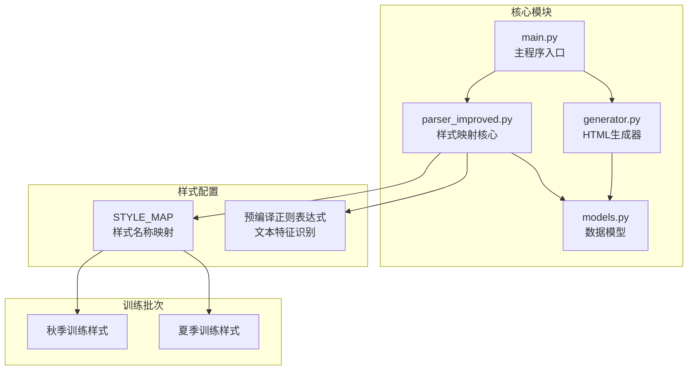
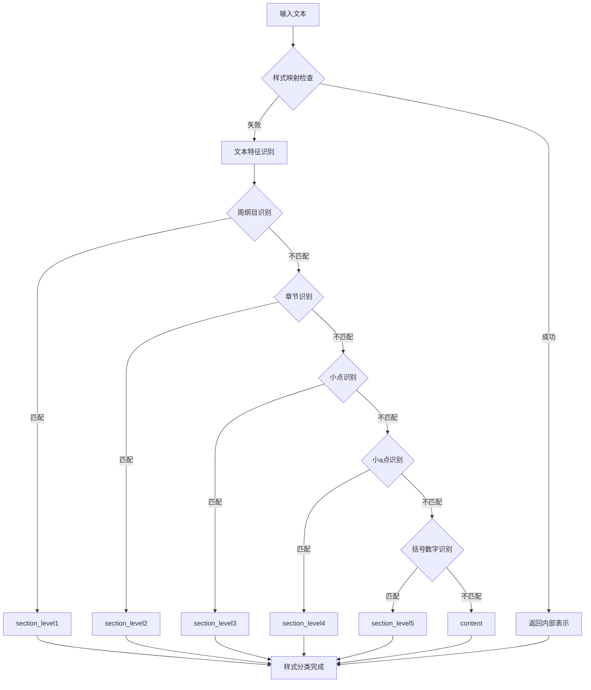
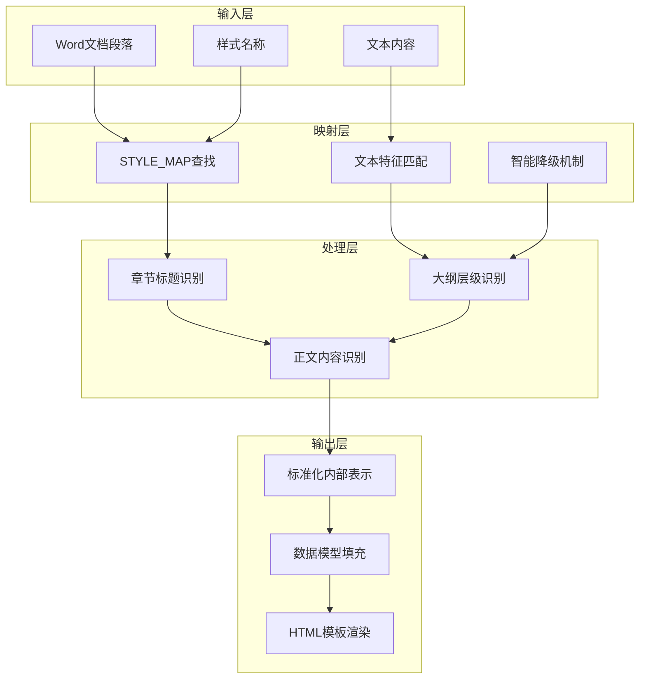
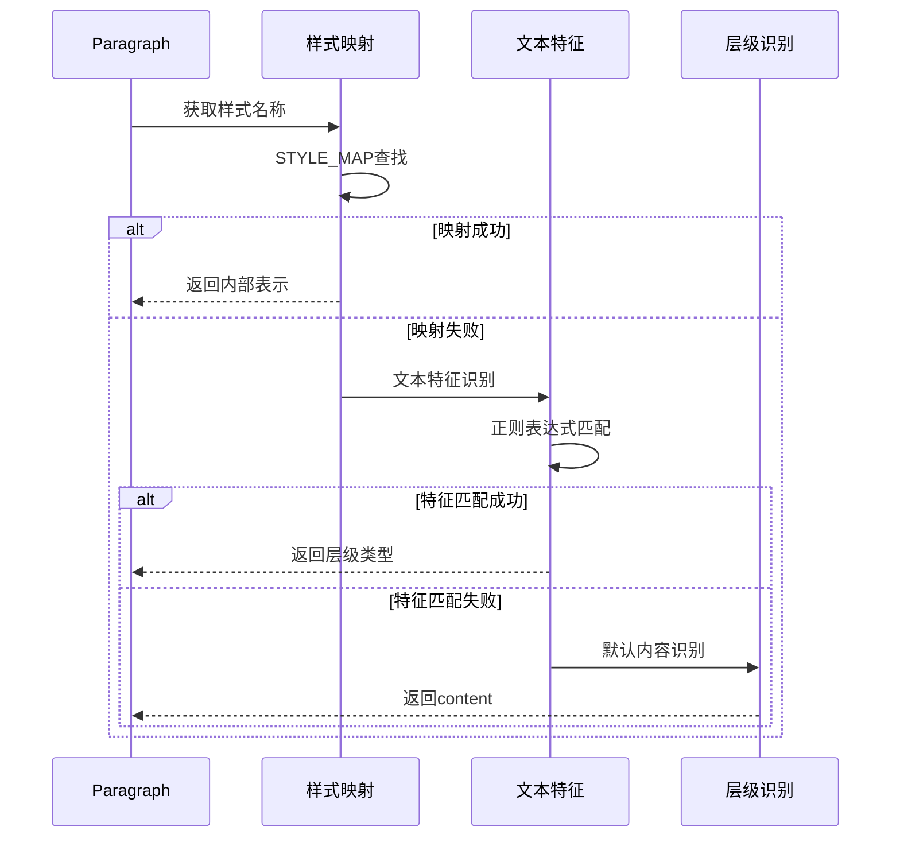
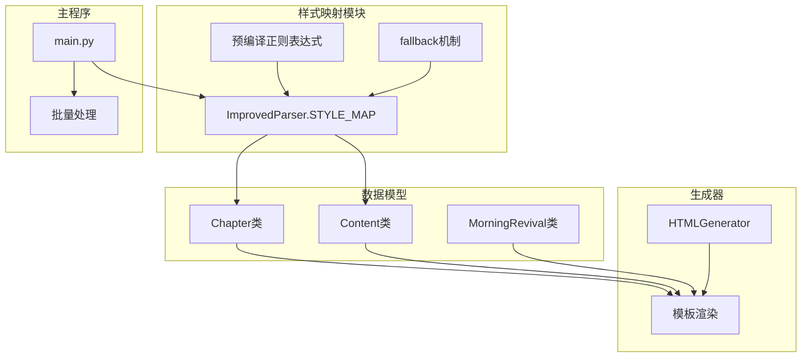

# 样式映射配置

<cite>
**本文档引用的文件**
- [parser_improved.py](file://src/parser_improved.py)
- [models.py](file://src/models.py)
- [generator.py](file://src/generator.py)
- [main.py](file://main.py)
- [README.md](file://README.md)
</cite>

## 目录
1. [简介](#简介)
2. [项目结构](#项目结构)
3. [核心组件](#核心组件)
4. [架构概览](#架构概览)
5. [详细组件分析](#详细组件分析)
6. [依赖分析](#依赖分析)
7. [性能考虑](#性能考虑)
8. [故障排除指南](#故障排除指南)
9. [结论](#结论)

## 简介

样式映射配置是本项目的核心功能模块，负责将Word文档中的样式名称转换为标准化的内部表示。该系统支持不同训练批次（秋季、夏季）的样式差异处理，通过预编译正则表达式实现高性能的文本特征识别。

本系统采用双层映射机制：首先通过精确的样式名称映射，当映射失败时自动降级到基于文本特征的智能识别。这种设计确保了即使在样式名称发生变化的情况下，系统仍能正确识别文档结构。

## 项目结构

项目采用模块化架构，样式映射功能主要集中在`src/parser_improved.py`文件中：



**图表来源**
- [parser_improved.py:117-135](file://src/parser_improved.py#L117-L135)
- [parser_improved.py:137-145](file://src/parser_improved.py#L137-L145)

**章节来源**
- [README.md:52-88](file://README.md#L52-L88)
- [parser_improved.py:115-135](file://src/parser_improved.py#L115-L135)

## 核心组件

### STYLE_MAP配置

STYLE_MAP是样式映射系统的核心配置，定义了Word样式名称到内部表示的映射关系：

| Word样式 | 内部表示 | 秋季训练 | 夏季训练 |
|---------|---------|----------|----------|
| 121文章篇题 | chapter_title | ✅ | ❌ |
| 131文章大点 | section_level1 | ✅ | ❌ |
| 132文章中点 | section_level2 | ✅ | ❌ |
| 133文章小点 | section_level3 | ✅ | ❌ |
| 134文章小a点 | section_level4 | ✅ | ❌ |
| 8888文章正文 | content | ✅ | ❌ |
| ０ａ總題 | chapter_title | ❌ | ✅ |
| 职事信息大標 | section_level1 | ❌ | ✅ |
| 职事信息中標 | section_level2 | ❌ | ✅ |
| 职事小标题 | section_level3 | ❌ | ✅ |
| 信息正文18 | content | ❌ | ✅ |
| 信息正文3 | content | ❌ | ✅ |
| 信息正文17 | content | ❌ | ✅ |
| 职事信息 | content | ❌ | ✅ |

**章节来源**
- [parser_improved.py:118-135](file://src/parser_improved.py#L118-L135)

### 预编译正则表达式优化

系统使用预编译的正则表达式来提高文本特征识别的性能：



**图表来源**
- [parser_improved.py:806-825](file://src/parser_improved.py#L806-L825)

**章节来源**
- [parser_improved.py:137-145](file://src/parser_improved.py#L137-L145)
- [parser_improved.py:806-825](file://src/parser_improved.py#L806-L825)

## 架构概览

样式映射系统采用分层架构设计，确保了高内聚低耦合的代码结构：



**图表来源**
- [parser_improved.py:117-135](file://src/parser_improved.py#L117-L135)
- [parser_improved.py:806-944](file://src/parser_improved.py#L806-L944)

## 详细组件分析

### 样式映射实现机制

样式映射系统实现了双层识别机制：

#### 第一层：精确样式映射
```python
# 获取样式类型（支持样式名称映射或直接匹配）
style_type = self.STYLE_MAP.get(para.style.name) if para.style and para.style.name else None
```

#### 第二层：智能文本特征识别
当样式映射失败时，系统自动降级到基于文本特征的识别：

```python
# 如果样式映射失败，尝试通过文本特征判断
if not style_type:
    if re.match(r'^第[一二三四五六七八九十]+篇', text):
        style_type = 'chapter_title'
    elif re.match(r'^[壹贰叁肆伍陆柒捌玖拾]+[、\s]', text):
        style_type = 'section_level1'
    # ... 其他特征匹配逻辑
```

**章节来源**
- [parser_improved.py:806-825](file://src/parser_improved.py#L806-L825)

### 不同训练批次的样式差异处理

系统针对不同训练批次提供了专门的样式支持：

#### 秋季训练样式（.docx格式）
- 篇章标题：`121文章篇题` → `chapter_title`
- 大点：`131文章大点` → `section_level1`
- 中点：`132文章中点` → `section_level2`
- 小点：`133文章小点` → `section_level3`
- 小a点：`134文章小a点` → `section_level4`
- 正文：`8888文章正文` → `content`

#### 夏季训练样式（.doc格式）
- 篇章标题：`０ａ總題` → `chapter_title`
- 大点：`职事信息大標` → `section_level1`
- 中点：`职事信息中標` → `section_level2`
- 小点：`职事小标题` → `section_level3`
- 正文：`信息正文18`、`信息正文3`、`信息正文17`、`职事信息` → `content`

**章节来源**
- [parser_improved.py:118-135](file://src/parser_improved.py#L118-L135)

### 预编译正则表达式的优化策略

系统使用预编译的正则表达式来提升性能：

#### 预编译正则表达式列表
- `WEEK_OUTLINE_PATTERN`: 周纲目识别
- `DAY_PATTERN`: 周次识别  
- `LEVEL1_PATTERN`: 大点层级识别
- `LEVEL2_PATTERN`: 中点层级识别
- `LEVEL3_PATTERN`: 小点层级识别
- `VERSE_PATTERN`: 经文格式识别

#### 性能优化特点
1. **一次性编译**：正则表达式在类初始化时编译，避免重复编译开销
2. **缓存机制**：编译后的正则表达式对象被复用
3. **智能匹配**：按优先级顺序进行匹配，减少不必要的匹配操作

**章节来源**
- [parser_improved.py:137-145](file://src/parser_improved.py#L137-L145)

### 样式映射的fallback机制

当样式名称映射失败时，系统提供多层次的降级识别机制：



**图表来源**
- [parser_improved.py:806-825](file://src/parser_improved.py#L806-L825)

**章节来源**
- [parser_improved.py:806-944](file://src/parser_improved.py#L806-L944)

## 依赖分析

样式映射系统与其他模块的依赖关系：



**图表来源**
- [models.py:9-232](file://src/models.py#L9-L232)
- [generator.py:22-200](file://src/generator.py#L22-L200)
- [main.py:410-536](file://main.py#L410-L536)

**章节来源**
- [models.py:9-232](file://src/models.py#L9-L232)
- [generator.py:22-200](file://src/generator.py#L22-L200)
- [main.py:410-536](file://main.py#L410-L536)

## 性能考虑

样式映射系统采用了多项性能优化策略：

### 时间复杂度分析
- **样式映射查找**：O(1) - 使用字典查找
- **正则表达式匹配**：O(n) - n为文本长度
- **整体处理**：O(m×n) - m为段落数量

### 内存优化策略
1. **预编译缓存**：正则表达式对象在类级别缓存
2. **对象复用**：样式映射字典在整个实例生命周期内复用
3. **增量处理**：按段落顺序处理，避免不必要的内存分配

### 扩展性设计
- **模块化配置**：样式映射规则易于扩展和修改
- **层次化识别**：支持多级降级识别，提高鲁棒性
- **批量处理**：支持大规模文档的高效处理

## 故障排除指南

### 常见问题及解决方案

#### 样式映射失败
**问题**：样式名称不在STYLE_MAP中
**解决方案**：
1. 检查Word文档的样式名称是否正确
2. 验证STYLE_MAP配置是否包含该样式
3. 确认文档格式（.doc vs .docx）的兼容性

#### 文本特征识别错误
**问题**：fallback机制未能正确识别文本层级
**解决方案**：
1. 检查预编译正则表达式的准确性
2. 验证文本内容是否符合预期格式
3. 调整正则表达式的匹配优先级

#### 性能问题
**问题**：处理大量文档时性能下降
**解决方案**：
1. 确认正则表达式是否正确预编译
2. 检查是否有不必要的重复匹配
3. 考虑分批处理大型文档

**章节来源**
- [parser_improved.py:806-944](file://src/parser_improved.py#L806-L944)

## 结论

样式映射配置系统通过精心设计的双层识别机制，成功解决了不同训练批次样式差异的问题。系统不仅支持精确的样式名称映射，还提供了强大的文本特征识别能力，确保了在各种文档格式和样式变化情况下的稳定性和可靠性。

该系统的预编译正则表达式优化策略显著提升了处理性能，而多层次的fallback机制保证了系统的鲁棒性。通过模块化的架构设计，系统具有良好的扩展性和维护性，能够适应未来更多的样式变化和业务需求。

对于开发者而言，理解STYLE_MAP的设计理念和实现机制，有助于更好地维护和扩展这一核心功能模块。建议在新增样式支持时，遵循现有的命名规范和配置模式，确保系统的整体一致性。