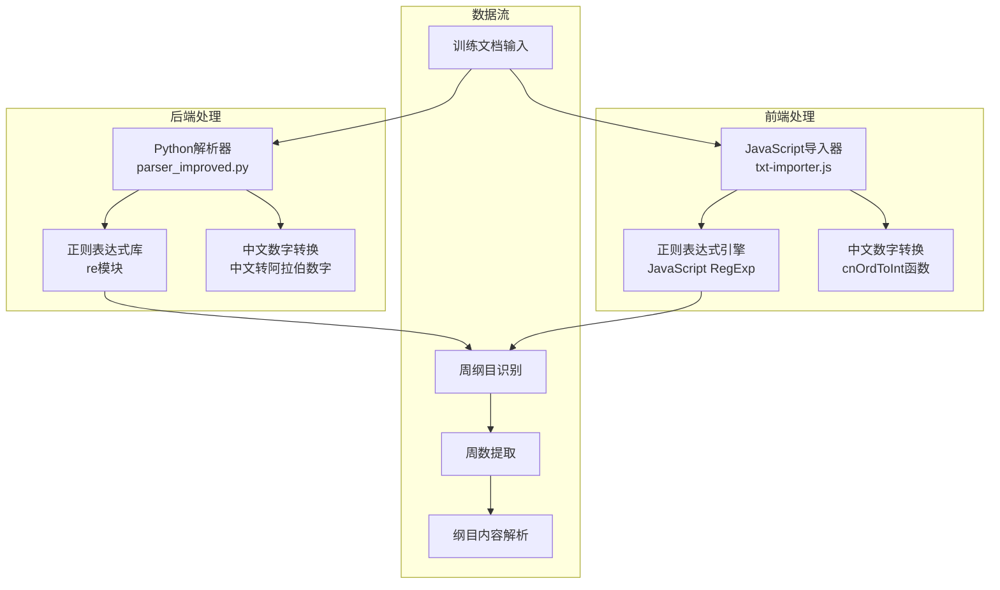
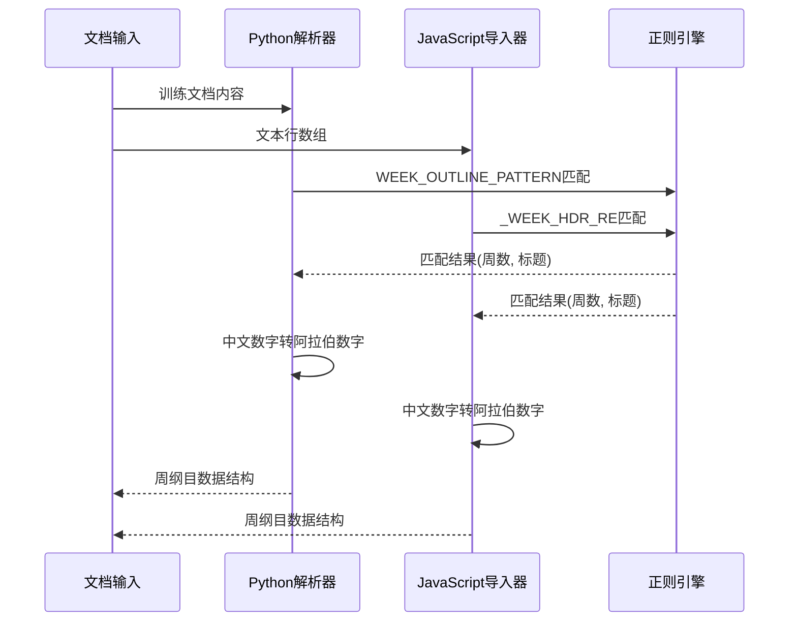
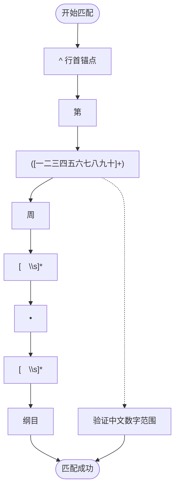
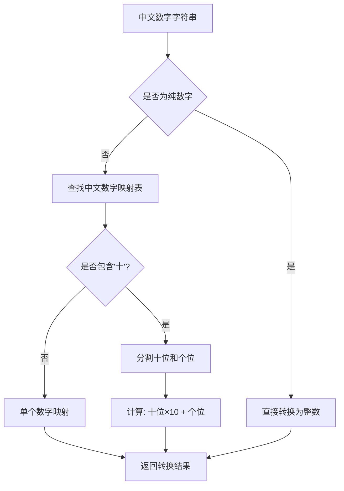
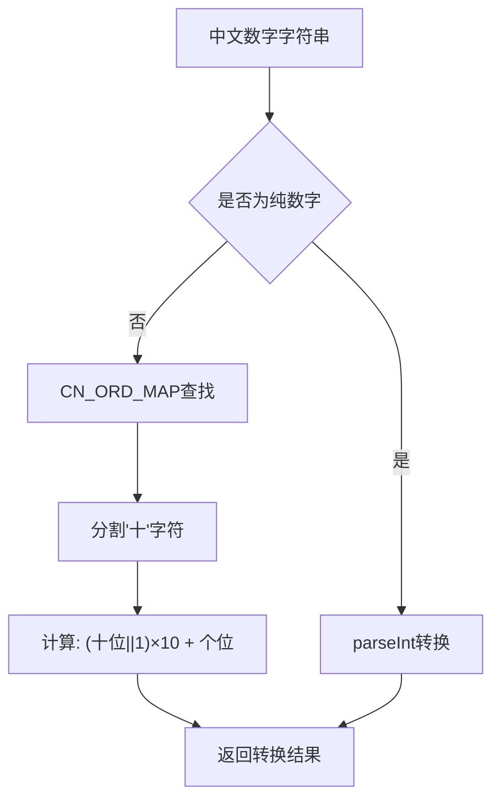
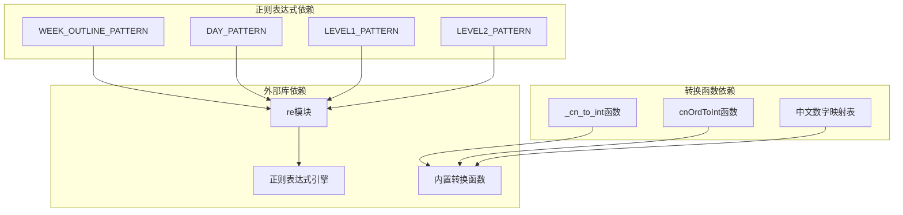
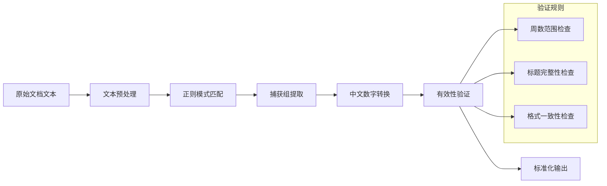

# 周纲目识别模式

<cite>
**本文档引用的文件**
- [src/parser_improved.py](file://src/parser_improved.py)
- [src/static/js/txt-importer.js](file://src/static/js/txt-importer.js)
</cite>

## 目录
1. [简介](#简介)
2. [项目结构](#项目结构)
3. [核心组件](#核心组件)
4. [架构概览](#架构概览)
5. [详细组件分析](#详细组件分析)
6. [依赖关系分析](#依赖关系分析)
7. [性能考量](#性能考量)
8. [故障排除指南](#故障排除指南)
9. [结论](#结论)

## 简介
本文档深入解析"周纲目识别模式"，重点阐述WEEK_OUTLINE_PATTERN正则表达式的匹配规则与应用场景。该模式用于识别"第X周 • 纲目"格式的周纲目标题，通过精确的正则匹配确保从训练文档中正确提取每周的纲目信息，为后续的纲目解析和内容组织奠定基础。

## 项目结构
该项目采用Python后端与JavaScript前端相结合的架构设计：

**图表来源**
- [src/parser_improved.py:137-145](file://src/parser_improved.py#L137-L145)
- [src/static/js/txt-importer.js:850-867](file://src/static/js/txt-importer.js#L850-L867)

**章节来源**
- [src/parser_improved.py:137-145](file://src/parser_improved.py#L137-L145)
- [src/static/js/txt-importer.js:850-867](file://src/static/js/txt-importer.js#L850-L867)

## 核心组件
本系统的核心组件围绕WEEK_OUTLINE_PATTERN正则表达式展开，包含以下关键要素：

### 正则表达式核心
WEEK_OUTLINE_PATTERN = re.compile(r'^第([一二三四五六七八九十]+)周[　\s]*•[　\s]*纲目')

### 关键匹配要素
1. **锚点匹配**：`^` 确保从行首开始匹配
2. **周数捕获组**：`([一二三四五六七八九十]+)` 提取中文数字
3. **可选空白**：`[　\s]*` 匹配全角空格和半角空格
4. **分隔符匹配**：`•` 精确匹配中间的项目符号
5. **固定文本**：`纲目` 确保识别正确的标题类型

**章节来源**
- [src/parser_improved.py:137-139](file://src/parser_improved.py#L137-L139)

## 架构概览
系统采用双层架构设计，确保周纲目识别的准确性与鲁棒性：

**图表来源**
- [src/parser_improved.py:137-139](file://src/parser_improved.py#L137-L139)
- [src/static/js/txt-importer.js:856](file://src/static/js/txt-importer.js#L856)
- [src/static/js/txt-importer.js:907-928](file://src/static/js/txt-importer.js#L907-L928)

## 详细组件分析

### 正则表达式匹配机制

#### 模式分解与匹配流程

**图表来源**
- [src/parser_improved.py:137-139](file://src/parser_improved.py#L137-L139)

#### 周数捕获组详解
- **捕获组作用**：`([一二三四五六七八九十]+)` 提取中文数字部分
- **匹配范围**：支持一到十个汉字数字的组合
- **应用场景**：为后续的数字转换和周数识别提供原始数据

#### 分隔符匹配逻辑
- **• 符号匹配**：精确匹配中间的项目符号
- **· 符号兼容**：在JavaScript版本中支持不同的项目符号变体
- **空白字符处理**：允许全角和半角空格的存在

**章节来源**
- [src/parser_improved.py:137-139](file://src/parser_improved.py#L137-L139)
- [src/static/js/txt-importer.js:856](file://src/static/js/txt-importer.js#L856)

### 中文数字转换机制

#### Python端转换实现
系统实现了完整的中文数字到阿拉伯数字的转换逻辑：

**图表来源**
- [src/parser_improved.py:1401-1417](file://src/parser_improved.py#L1401-L1417)

#### JavaScript端转换实现
JavaScript版本提供了对应的转换函数：

**图表来源**
- [src/static/js/txt-importer.js:75-92](file://src/static/js/txt-importer.js#L75-L92)

**章节来源**
- [src/parser_improved.py:1401-1417](file://src/parser_improved.py#L1401-L1417)
- [src/static/js/txt-importer.js:75-92](file://src/static/js/txt-importer.js#L75-L92)

### 周纲目识别的应用场景

#### 场景一：标准周纲目格式
- **输入格式**："第X周 • 纲目"
- **输出结果**：提取周数和标题信息
- **应用场景**：标准训练文档的周纲目识别

#### 场景二：混合格式识别
- **输入格式**："第X周 • 周Y"（用于每日标记）
- **输出结果**：区分周纲目和每日标记
- **应用场景**：复杂文档结构的智能识别

#### 场景三：容错处理
- **输入格式**：包含额外空白字符的变体
- **输出结果**：统一标准化的识别结果
- **应用场景**：处理不同编辑器产生的格式差异

**章节来源**
- [src/parser_improved.py:1132-1135](file://src/parser_improved.py#L1132-L1135)
- [src/static/js/txt-importer.js:906-928](file://src/static/js/txt-importer.js#L906-L928)

## 依赖关系分析

### 核心依赖关系图

**图表来源**
- [src/parser_improved.py:137-145](file://src/parser_improved.py#L137-L145)
- [src/static/js/txt-importer.js:75-92](file://src/static/js/txt-importer.js#L75-L92)

### 数据流向分析

**图表来源**
- [src/parser_improved.py:1401-1417](file://src/parser_improved.py#L1401-L1417)
- [src/static/js/txt-importer.js:912-913](file://src/static/js/txt-importer.js#L912-L913)

**章节来源**
- [src/parser_improved.py:137-145](file://src/parser_improved.py#L137-L145)
- [src/static/js/txt-importer.js:75-92](file://src/static/js/txt-importer.js#L75-L92)

## 性能考量
系统在设计时充分考虑了性能优化：

### 时间复杂度分析
- **正则匹配**：O(n) 线性扫描文档
- **中文数字转换**：O(1) 常数时间复杂度
- **整体性能**：适合处理大型训练文档

### 内存使用优化
- **正则表达式预编译**：避免重复编译开销
- **增量处理**：逐行处理，减少内存占用
- **缓存机制**：复用转换结果

## 故障排除指南

### 常见问题与解决方案

#### 问题1：中文数字识别失败
**症状**：周数提取为0或None
**解决方案**：
1. 检查中文数字是否在支持范围内
2. 验证数字格式的正确性
3. 确认正则表达式模式的匹配条件

#### 问题2：分隔符匹配错误
**症状**：无法正确识别周纲目格式
**解决方案**：
1. 检查文档中使用的项目符号类型
2. 验证空白字符的处理逻辑
3. 确认不同格式变体的支持情况

#### 问题3：编码问题
**症状**：特殊字符显示异常
**解决方案**：
1. 确认文件编码格式
2. 检查全角字符的处理
3. 验证正则表达式的字符类定义

**章节来源**
- [src/parser_improved.py:1401-1417](file://src/parser_improved.py#L1401-L1417)
- [src/static/js/txt-importer.js:912-913](file://src/static/js/txt-importer.js#L912-L913)

## 结论
周纲目识别模式通过精心设计的正则表达式和完善的中文数字转换机制，实现了对"第X周 • 纲目"格式的精准识别。该系统不仅具备良好的准确性，还具有优秀的容错能力和扩展性，能够适应不同格式的训练文档需求。通过双层架构设计，系统在保持高性能的同时，确保了处理结果的一致性和可靠性。