# 圣经引用识别模式

<cite>
**本文档引用的文件**
- [parser_improved.py](file://src/parser_improved.py)
- [bible_dict.py](file://src/bible_dict.py)
- [models.py](file://src/models.py)
- [generator.py](file://src/generator.py)
- [main.py](file://main.py)
</cite>

## 目录
1. [简介](#简介)
2. [项目结构](#项目结构)
3. [核心组件](#核心组件)
4. [架构概览](#架构概览)
5. [详细组件分析](#详细组件分析)
6. [依赖分析](#依赖分析)
7. [性能考虑](#性能考虑)
8. [故障排除指南](#故障排除指南)
9. [结论](#结论)

## 简介

本文档详细介绍了圣经引用识别模式的技术实现，重点分析了多种引用格式的识别规则和解析逻辑。该系统能够准确识别和解析包括全称引用、相对章引用、整章引用、纯节续行等多种复杂的圣经引用格式，涵盖了纯阿拉伯节号续行、跨章节范围、续章范围等复杂情况的处理。

系统采用正则表达式驱动的模式匹配机制，结合中文数字转换和书卷名称映射功能，实现了对中文圣经引用格式的全面支持。通过预编译的正则表达式和优化的数据结构，确保了高效的引用识别和解析性能。

## 项目结构

该项目采用模块化的Python架构，主要包含以下核心模块：

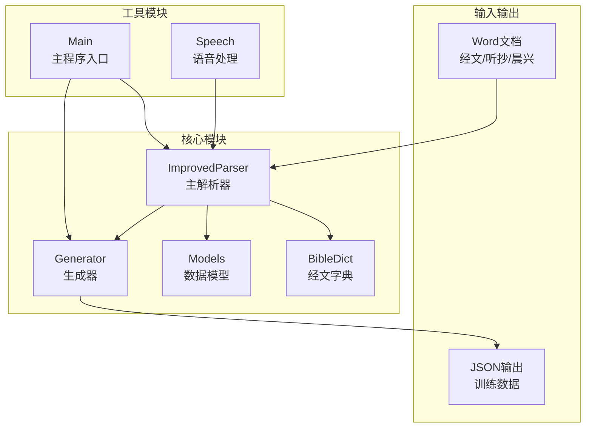

**图表来源**
- [parser_improved.py:115-284](file://src/parser_improved.py#L115-L284)
- [bible_dict.py:19-96](file://src/bible_dict.py#L19-L96)
- [models.py:9-232](file://src/models.py#L9-L232)
- [generator.py:120-319](file://src/generator.py#L120-L319)

**章节来源**
- [parser_improved.py:1-800](file://src/parser_improved.py#L1-L800)
- [bible_dict.py:1-96](file://src/bible_dict.py#L1-L96)
- [models.py:1-232](file://src/models.py#L1-L232)
- [generator.py:1-546](file://src/generator.py#L1-L546)

## 核心组件

### 主解析器 (ImprovedParser)

主解析器是整个系统的中枢，负责处理各种类型的Word文档并提取结构化数据。其核心功能包括：

- **正则表达式模式匹配**：预编译了多种引用格式的正则表达式
- **中文数字转换**：支持1-999范围内的中文数字解析
- **书卷名称映射**：维护完整的66卷圣经书名映射表
- **引用范围解析**：支持复杂的跨章节和续章范围引用

### 经文字典 (BibleDict)

持久化存储所有出现过的经节内容，提供高效的数据检索和缓存功能：

- **键值存储**：以"书卷+章:节"格式存储经文
- **增量加载**：支持从JSON文件增量加载数据
- **范围查询**：支持按书卷和章节范围检索经文

### 数据模型 (Models)

定义了训练数据的结构化表示，包括章节、大纲、晨兴等内容的组织方式。

**章节来源**
- [parser_improved.py:115-284](file://src/parser_improved.py#L115-L284)
- [bible_dict.py:19-96](file://src/bible_dict.py#L19-L96)
- [models.py:9-232](file://src/models.py#L9-L232)

## 架构概览

系统采用分层架构设计，从底层的正则表达式匹配到高层的数据结构组织，形成了完整的圣经引用识别处理链：

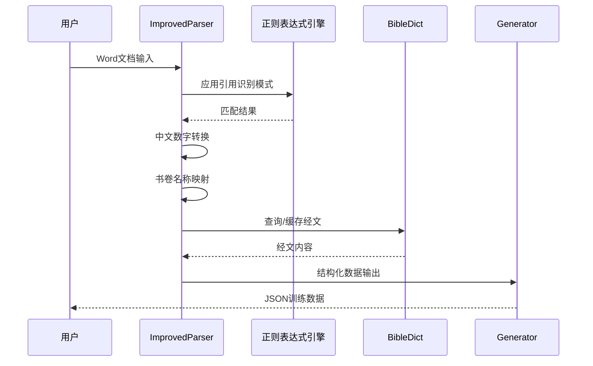

**图表来源**
- [parser_improved.py:367-782](file://src/parser_improved.py#L367-L782)
- [generator.py:120-134](file://src/generator.py#L120-L134)

## 详细组件分析

### 引用识别模式详解

#### 全称引用格式 (_full_ref_re)

全称引用格式是最完整的引用形式，包含书卷、中文章和阿拉伯节号：

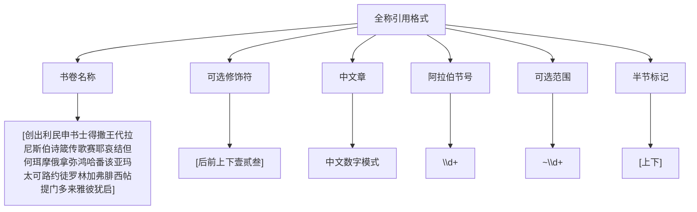

**图表来源**
- [parser_improved.py:167-171](file://src/parser_improved.py#L167-L171)

全称引用格式支持以下变体：
- 标准格式：腓四5~9（书卷+中文章+节号范围）
- 带修饰符：创后十5（书卷修饰符+中文章+节号）
- 半节标记：腓四5上~9下（节号范围带半节标记）

#### 相对章引用 (_rel_chap_re)

相对章引用仅包含中文章和阿拉伯节号，适用于同书卷内的引用：

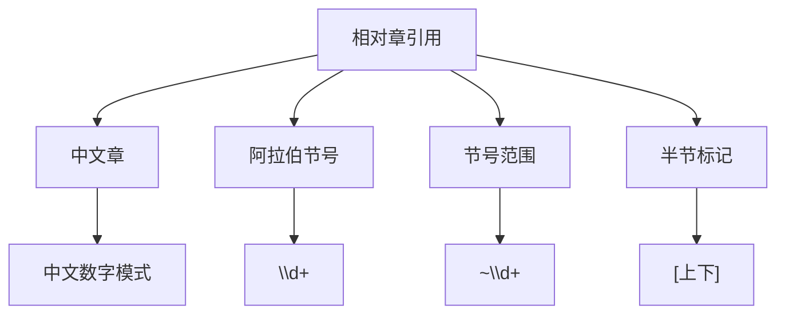

**图表来源**
- [parser_improved.py:173-176](file://src/parser_improved.py#L173-L176)

相对章引用的特点：
- 必须在同一书卷内
- 通过上下文推断书卷名称
- 支持节号范围和半节标记

#### 整章引用 (_whole_chap_re)

整章引用省略节号，表示整章内容：

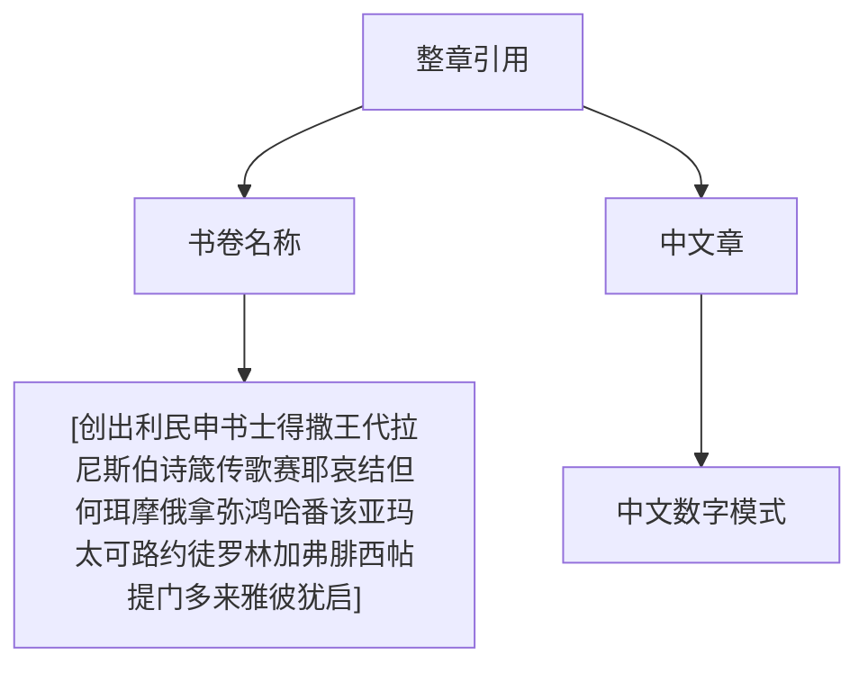

**图表来源**
- [parser_improved.py:178-181](file://src/parser_improved.py#L178-L181)

整章引用的特殊处理：
- 节号为0，表示整章
- 用于简化引用格式
- 支持全称和相对两种形式

#### 纯节续行 (_cont_verse_re)

纯节续行仅包含阿拉伯节号，用于同章内的连续引用：

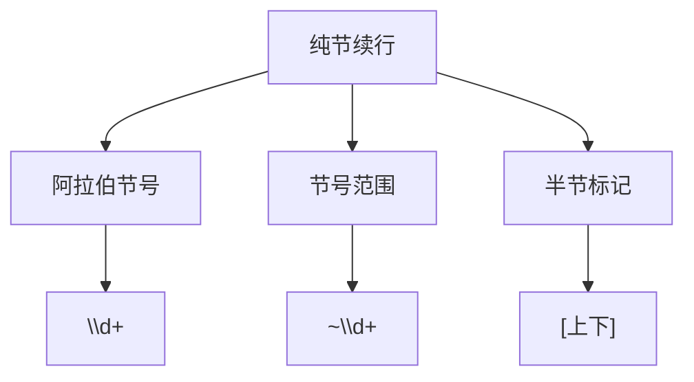

**图表来源**
- [parser_improved.py:187-189](file://src/parser_improved.py#L187-L189)

纯节续行的应用场景：
- 同章内连续的经文引用
- 简化重复的书卷和章号
- 通过上下文确定书卷和章号

### 中文数字转换机制

系统实现了完整的中文数字到阿拉伯数字的转换功能：

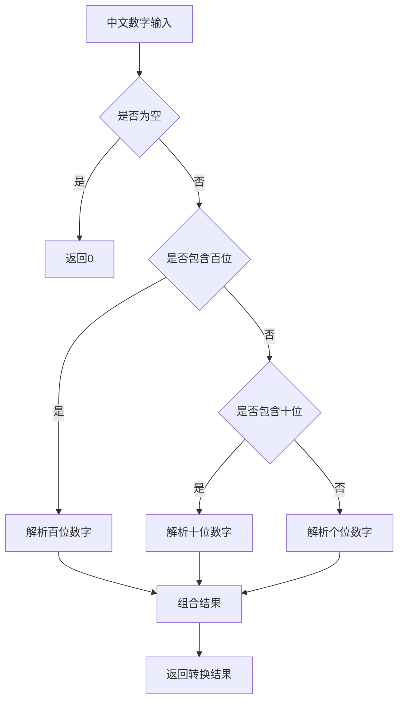

**图表来源**
- [parser_improved.py:2172-2205](file://src/parser_improved.py#L2172-L2205)

中文数字转换支持的格式：
- 基础数字：一、二、三...九
- 十位数：十、十一、十二...十九、二十
- 百位数：一百、一百零一...一百九十九
- 特殊缩写：三八（38）、五七（57）等两位数缩写

### 书卷名称映射系统

系统维护了完整的圣经书卷名称映射表，支持正式全名和常用简称：

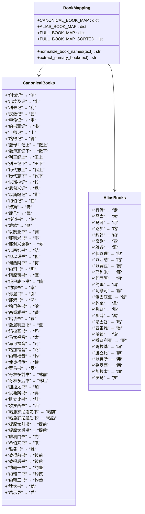

**图表来源**
- [parser_improved.py:192-237](file://src/parser_improved.py#L192-L237)

书卷映射的关键特性：
- **预排序优化**：按书名长度降序排列，避免前缀误匹配
- **双重映射**：正式全名和常用简称并存
- **动态扩展**：支持alias映射的动态添加

### 复杂引用格式处理

#### 跨章节范围引用

跨章节范围引用支持不同书卷间的章节跨越：

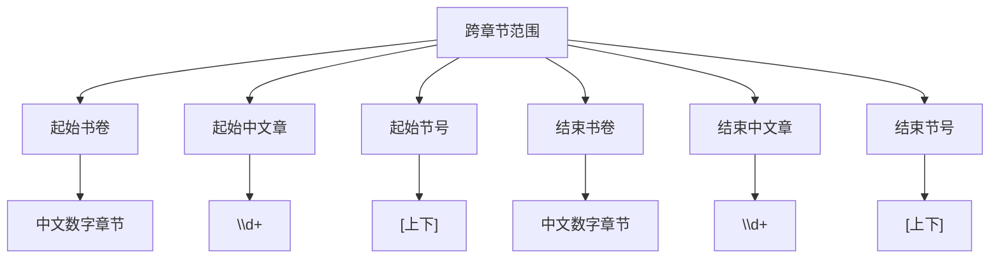

**图表来源**
- [parser_improved.py:265-267](file://src/parser_improved.py#L265-L267)

跨章节范围的解析流程：
1. 识别起始和结束的中文章
2. 转换为阿拉伯数字章号
3. 生成中间章节的整章引用
4. 处理半节标记

#### 续章范围引用

续章范围引用从当前章开始，到指定中文章结束：

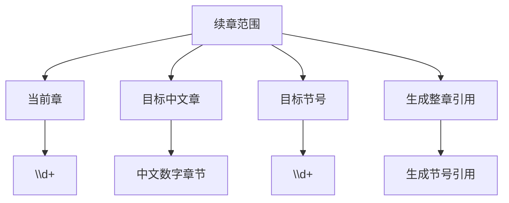

**图表来源**
- [parser_improved.py:269-271](file://src/parser_improved.py#L269-L271)

续章范围的处理逻辑：
- 当前章的起始节号单独处理
- 中间章节生成整章引用
- 目标章节的结束节号单独处理

**章节来源**
- [parser_improved.py:147-276](file://src/parser_improved.py#L147-L276)
- [parser_improved.py:2172-2399](file://src/parser_improved.py#L2172-L2399)

## 依赖分析

系统采用松耦合的设计，各模块之间的依赖关系清晰明确：

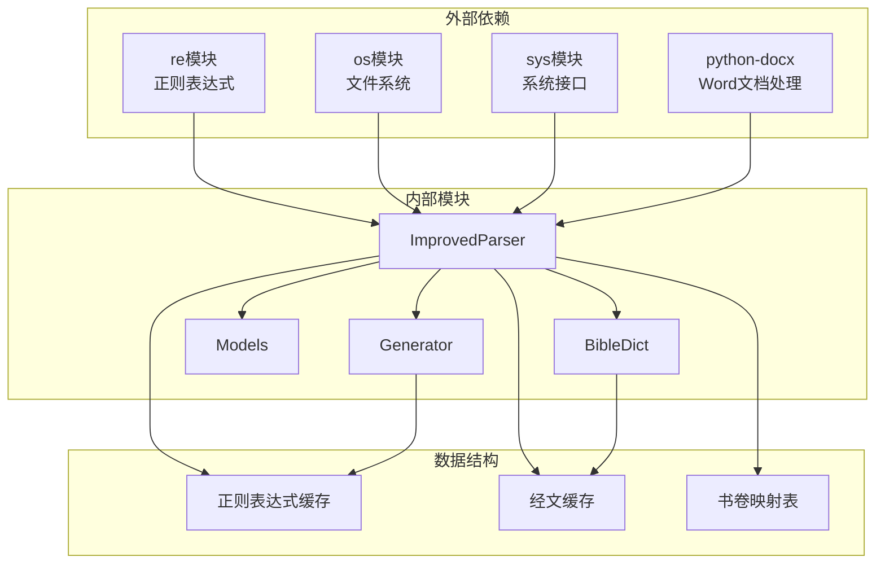

**图表来源**
- [parser_improved.py:5-13](file://src/parser_improved.py#L5-L13)
- [bible_dict.py:8-16](file://src/bible_dict.py#L8-L16)

**章节来源**
- [parser_improved.py:1-800](file://src/parser_improved.py#L1-L800)
- [bible_dict.py:1-96](file://src/bible_dict.py#L1-L96)
- [models.py:1-232](file://src/models.py#L1-L232)
- [generator.py:1-546](file://src/generator.py#L1-L546)

## 性能考虑

系统在设计时充分考虑了性能优化，采用了多种策略来提升处理效率：

### 正则表达式优化

- **预编译缓存**：所有正则表达式在类初始化时预编译，避免重复编译开销
- **模式选择**：根据不同引用类型的频率选择最优的匹配策略
- **原子组使用**：在复杂模式中使用原子组减少回溯

### 数据结构优化

- **映射表排序**：书卷映射表按名称长度降序排列，提高匹配效率
- **缓存机制**：实现多层次缓存，包括经文内容缓存和解析结果缓存
- **增量加载**：支持从文件增量加载数据，减少内存占用

### 处理流程优化

- **早期退出**：在匹配失败时及时退出，避免不必要的处理
- **批量处理**：支持批量引用解析，减少函数调用开销
- **内存管理**：合理控制内存使用，避免长时间运行时的内存泄漏

## 故障排除指南

### 常见问题及解决方案

#### 引用识别失败

**问题症状**：某些引用格式无法正确识别
**可能原因**：
- 正则表达式模式不完整
- 中文数字格式不规范
- 书卷名称映射缺失

**解决步骤**：
1. 检查引用格式是否符合预期
2. 验证中文数字的正确性
3. 确认书卷名称映射的完整性

#### 中文数字转换错误

**问题症状**：中文数字转换结果不正确
**可能原因**：
- 数字格式超出支持范围
- 特殊缩写格式不规范
- 数字组合逻辑错误

**解决步骤**：
1. 验证输入数字的格式正确性
2. 检查是否使用了支持的缩写形式
3. 确认数字范围在1-999之间

#### 性能问题

**问题症状**：处理大量文档时响应缓慢
**可能原因**：
- 正则表达式过于复杂
- 缓存机制失效
- 内存使用过多

**解决步骤**：
1. 优化正则表达式模式
2. 检查缓存配置
3. 监控内存使用情况

**章节来源**
- [parser_improved.py:2172-2205](file://src/parser_improved.py#L2172-L2205)
- [bible_dict.py:65-86](file://src/bible_dict.py#L65-L86)

## 结论

该圣经引用识别系统通过精心设计的正则表达式模式、完善的中文数字转换机制和智能的书卷名称映射，成功实现了对复杂圣经引用格式的全面支持。系统不仅能够处理标准的全称引用，还能优雅地应对相对引用、整章引用、纯节续行以及各种跨章节范围等复杂情况。

通过预编译的正则表达式、优化的数据结构和合理的缓存策略，系统在保证准确性的同时，也具备了良好的性能表现。模块化的架构设计使得系统易于维护和扩展，为未来的功能增强奠定了坚实的基础。

该实现为圣经研究和相关应用提供了可靠的引用识别基础设施，能够有效支持各种基于圣经文本的应用场景。