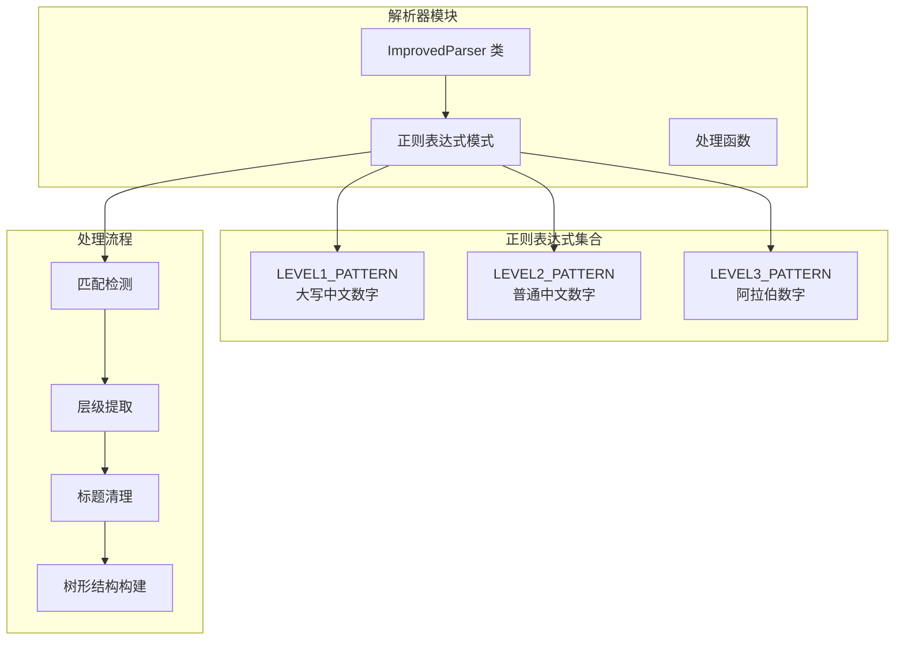
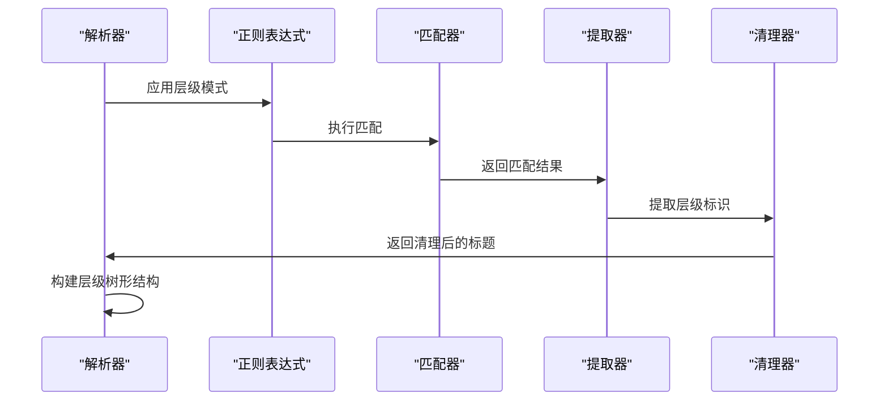
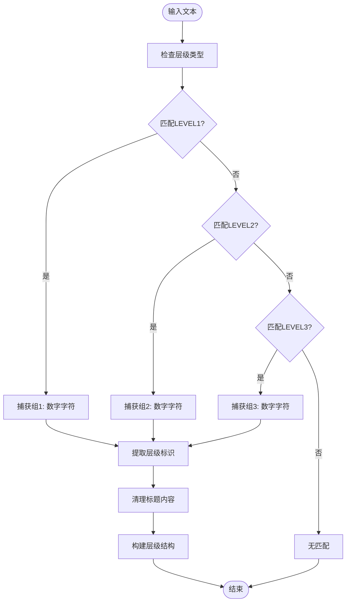
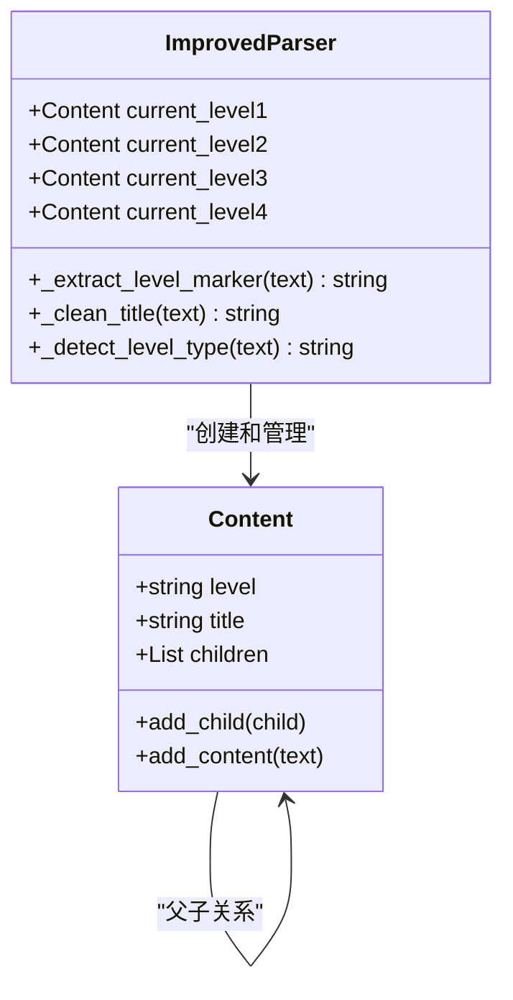
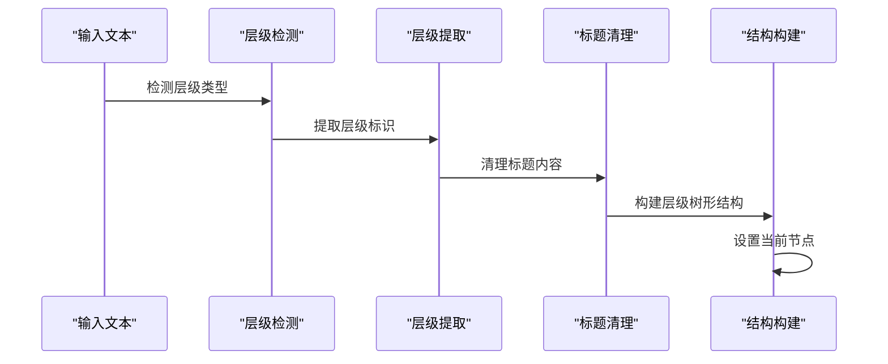
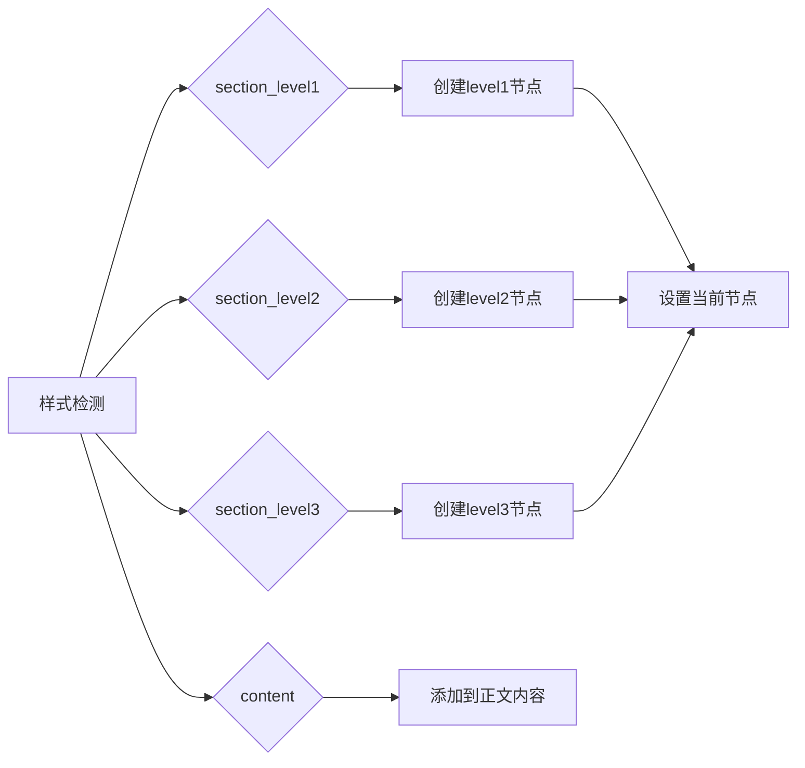
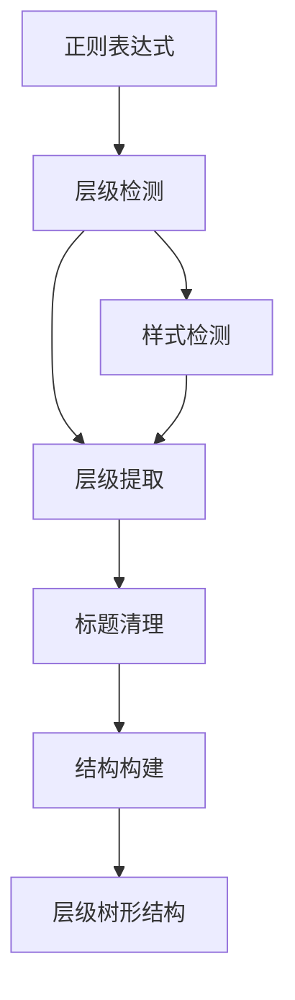

# 层级识别模式

<cite>
**本文档引用的文件**
- [parser_improved.py](file://src/parser_improved.py)
</cite>

## 目录
1. [简介](#简介)
2. [项目结构](#项目结构)
3. [核心组件](#核心组件)
4. [架构概览](#架构概览)
5. [详细组件分析](#详细组件分析)
6. [依赖分析](#依赖分析)
7. [性能考量](#性能考量)
8. [故障排除指南](#故障排除指南)
9. [结论](#结论)

## 简介
本文档深入解析该代码库中的层级识别模式，重点阐述LEVEL1_PATTERN、LEVEL2_PATTERN、LEVEL3_PATTERN等多级大纲识别模式的设计理念、匹配规则和实现机制。这些模式用于从Word文档中准确提取具有层级结构的标题内容，支持中文数字（大写、普通）和阿拉伯数字等多种数字体系，确保解析结果的准确性与一致性。

## 项目结构
该层级识别功能位于Python解析器模块中，采用面向对象设计，通过预编译正则表达式实现高效匹配。核心文件为parser_improved.py，其中定义了多个正则表达式模式和相应的处理函数。



**图表来源**
- [parser_improved.py:137-146](file://src/parser_improved.py#L137-L146)

**章节来源**
- [parser_improved.py:115-146](file://src/parser_improved.py#L115-L146)

## 核心组件
本项目的核心是ImprovedParser类，它包含了完整的层级识别和处理逻辑。主要组件包括：

### 预编译正则表达式模式
- **LEVEL1_PATTERN**: 用于识别大写中文数字层级（壹、贰、叁等）
- **LEVEL2_PATTERN**: 用于识别普通中文数字层级（一、二、三等）
- **LEVEL3_PATTERN**: 用于识别阿拉伯数字层级（1、2、3等）

### 关键处理函数
- `_extract_level_marker()`: 提取层级标识符
- `_clean_title()`: 清理标题内容
- `_detect_level_type()`: 检测文本层级类型

**章节来源**
- [parser_improved.py:137-146](file://src/parser_improved.py#L137-L146)
- [parser_improved.py:946-993](file://src/parser_improved.py#L946-L993)

## 架构概览
层级识别模式采用分层处理架构，通过正则表达式实现精确匹配，然后进行层级提取和内容清理。



**图表来源**
- [parser_improved.py:687-729](file://src/parser_improved.py#L687-L729)
- [parser_improved.py:976-993](file://src/parser_improved.py#L976-L993)

## 详细组件分析

### LEVEL1_PATTERN 设计与实现
LEVEL1_PATTERN专门用于识别大写中文数字层级，支持复杂的中文数字组合。

#### 匹配规则
- **模式**: `^([壹贰叁肆伍陆柒捌玖拾])[　\s]+(.*)`
- **匹配对象**: 大写中文数字（壹、贰、叁、肆、伍、陆、柒、捌、玖、拾）
- **空白字符**: 支持全角空格和普通空格
- **捕获组**:
  - 第1组: 数字字符（如"壹"、"拾"）
  - 第2组: 标题内容

#### 实现细节
```python
LEVEL1_PATTERN = re.compile(r'^([壹贰叁肆伍陆柒捌玖拾])[　\s]+(.*)')
```

#### 匹配示例
- 输入: "壹、使徒的教训"
- 输出: 数字组="壹"，内容组="使徒的教训"

**章节来源**
- [parser_improved.py:139-140](file://src/parser_improved.py#L139-L140)

### LEVEL2_PATTERN 设计与实现
LEVEL2_PATTERN用于识别普通中文数字层级，支持更复杂的数字组合。

#### 匹配规则
- **模式**: `^([一二三四五六七八九十百]+)[　\s]+(.*)`
- **匹配对象**: 普通中文数字（一到十，以及"百"等）
- **复杂数字**: 支持"十一"、"十二"、"二十"、"一百"等复合数字
- **捕获组**:
  - 第1组: 数字字符序列
  - 第2组: 标题内容

#### 实现细节
```python
LEVEL2_PATTERN = re.compile(r'^([一二三四五六七八九十百]+)[　\s]+(.*)')
```

#### 匹配示例
- 输入: "一、使徒的教训"
- 输出: 数字组="一"，内容组="使徒的教训"

**章节来源**
- [parser_improved.py:140-141](file://src/parser_improved.py#L140-L141)

### LEVEL3_PATTERN 设计与实现
LEVEL3_PATTERN专门用于识别阿拉伯数字层级，提供最直接的数字识别。

#### 匹配规则
- **模式**: `^(\d+)[　\s]+(.*)`
- **匹配对象**: 阿拉伯数字（1、2、3等）
- **捕获组**:
  - 第1组: 数字序列
  - 第2组: 标题内容

#### 实现细节
```python
LEVEL3_PATTERN = re.compile(r'^(\d+)[　\s]+(.*)')
```

#### 匹配示例
- 输入: "1、使徒的教训"
- 输出: 数字组="1"，内容组="使徒的教训"

**章节来源**
- [parser_improved.py:141-142](file://src/parser_improved.py#L141-L142)

### 捕获组作用机制
捕获组在正则表达式中起到关键作用，通过分组捕获实现精确的数据提取：



**图表来源**
- [parser_improved.py:976-993](file://src/parser_improved.py#L976-L993)

### 层级提取逻辑
层级提取过程遵循严格的优先级和层次关系：



**图表来源**
- [parser_improved.py:976-993](file://src/parser_improved.py#L976-L993)

**章节来源**
- [parser_improved.py:687-729](file://src/parser_improved.py#L687-L729)

### 具体代码示例

#### 纲目识别处理流程


**图表来源**
- [parser_improved.py:687-729](file://src/parser_improved.py#L687-L729)

#### 样式驱动的层级识别
除了基于文本的识别外，还支持基于样式的层级识别：



**图表来源**
- [parser_improved.py:843-944](file://src/parser_improved.py#L843-L944)

**章节来源**
- [parser_improved.py:807-824](file://src/parser_improved.py#L807-L824)

## 依赖分析
层级识别模式依赖于以下核心组件：

### 正则表达式依赖
- Python内置re模块
- 预编译正则表达式提高性能
- Unicode字符类支持中文数字

### 数据结构依赖
- Content类用于构建层级树形结构
- 字典和列表用于存储层级关系
- 递归结构支持多级嵌套

### 处理流程依赖


**图表来源**
- [parser_improved.py:946-993](file://src/parser_improved.py#L946-L993)

**章节来源**
- [parser_improved.py:115-146](file://src/parser_improved.py#L115-L146)

## 性能考量
层级识别模式在设计时充分考虑了性能优化：

### 预编译优化
- 所有正则表达式在类初始化时预编译
- 避免重复编译提升匹配速度
- 减少内存占用

### 匹配策略优化
- 采用优先级匹配策略
- 早期退出机制减少不必要的匹配
- 捕获组最小化原则

### 内存管理
- 流式处理避免大文件内存溢出
- 及时释放中间结果
- 循环引用检测和清理

## 故障排除指南

### 常见问题及解决方案

#### 匹配失败问题
- **症状**: 标题未被正确识别为层级
- **原因**: 文本格式不符合预期
- **解决方案**: 检查空白字符和标点符号

#### 层级混乱问题  
- **症状**: 层级顺序错误或嵌套异常
- **原因**: 跨页续接处理不当
- **解决方案**: 检查跨页连接检测逻辑

#### 性能问题
- **症状**: 处理大型文档缓慢
- **原因**: 正则表达式过于复杂
- **解决方案**: 优化正则表达式模式

**章节来源**
- [parser_improved.py:2092-2158](file://src/parser_improved.py#L2092-L2158)

## 结论
该层级识别模式通过精心设计的正则表达式和完善的处理逻辑，实现了对多级大纲结构的准确识别。LEVEL1_PATTERN、LEVEL2_PATTERN、LEVEL3_PATTERN三种模式分别针对不同类型的数字体系，确保了系统的兼容性和准确性。通过预编译优化和流式处理，系统能够在保证精度的同时提供良好的性能表现。