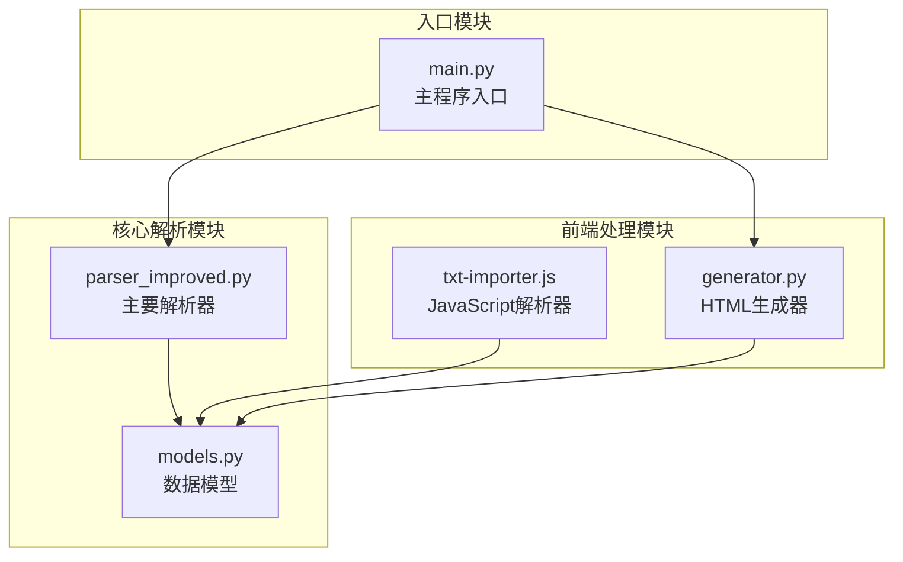
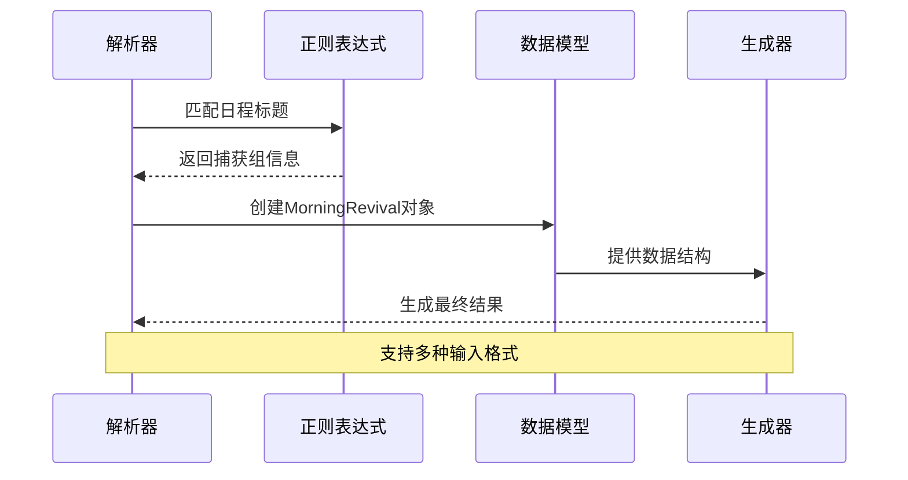
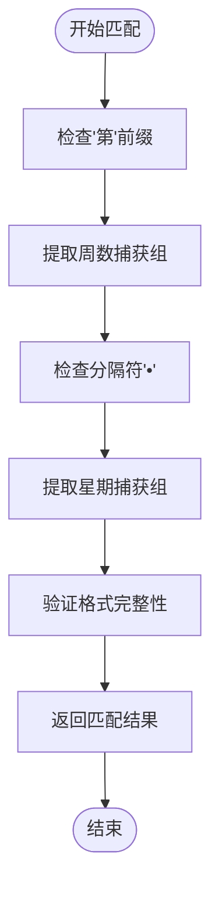
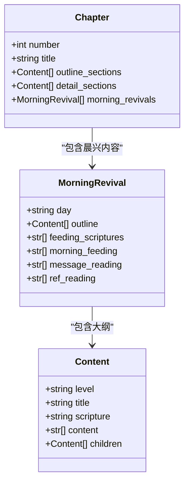
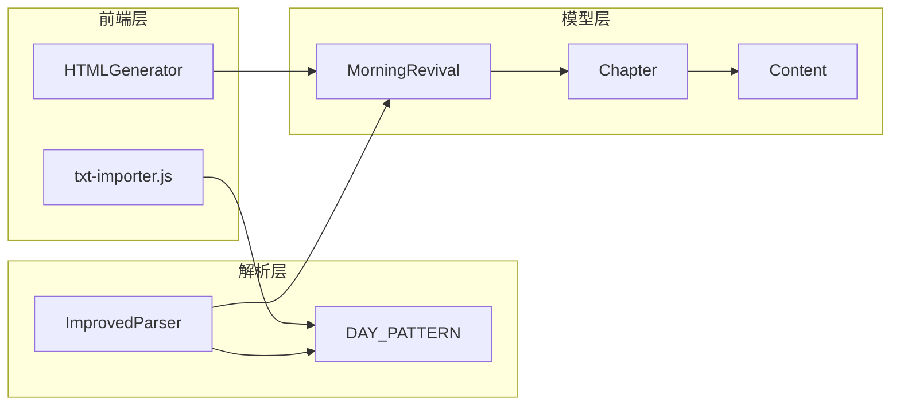

# 日程识别模式

<cite>
**本文档引用的文件**
- [parser_improved.py](file://src/parser_improved.py)
- [models.py](file://src/models.py)
- [txt-importer.js](file://src/static/js/txt-importer.js)
- [generator.py](file://src/generator.py)
- [main.py](file://main.py)
</cite>

## 目录
1. [简介](#简介)
2. [项目结构](#项目结构)
3. [核心组件](#核心组件)
4. [架构概览](#架构概览)
5. [详细组件分析](#详细组件分析)
6. [依赖分析](#依赖分析)
7. [性能考虑](#性能考虑)
8. [故障排除指南](#故障排除指南)
9. [结论](#结论)

## 简介

本文档深入分析了日程识别模式中的DAY_PATTERN正则表达式，该模式专门用于识别"第X周 • 周Y"格式的日程安排标题。该正则表达式在项目中承担着关键的日程识别任务，特别是在解析晨兴文档时准确提取每周每日的结构信息。

DAY_PATTERN正则表达式的设计充分考虑了中文数字和阿拉伯数字的混合使用场景，以及中文标点符号的特殊处理需求。该模式不仅能够准确识别标准格式的日程标题，还能处理各种变体和边界情况。

## 项目结构

该项目采用模块化设计，主要包含以下核心组件：



**图表来源**
- [parser_improved.py:115-146](file://src/parser_improved.py#L115-L146)
- [models.py:1-232](file://src/models.py#L1-232)
- [txt-importer.js:853-858](file://src/static/js/txt-importer.js#L853-L858)

**章节来源**
- [parser_improved.py:1-800](file://src/parser_improved.py#L1-L800)
- [models.py:1-232](file://src/models.py#L1-L232)

## 核心组件

### DAY_PATTERN正则表达式详解

DAY_PATTERN正则表达式定义如下：
```python
DAY_PATTERN = re.compile(r'^第([一二三四五六七八九十]+)周[　\s]*•[　\s]*周([一二三四五六七])')
```

该表达式包含两个主要捕获组：

**第一个捕获组：`([一二三四五六七八九十]+)`**
- 作用：提取周数信息
- 支持的中文数字：一、二、三、四、五、六、七、八、九、十
- 匹配规则：匹配一个或多个中文数字字符
- 输出：返回完整的中文数字字符串

**第二个捕获组：`([一二三四五六七])`**
- 作用：提取星期数信息
- 支持的中文数字：一、二、三、四、五、六、七
- 匹配规则：精确匹配单个中文数字字符
- 输出：返回对应的中文数字字符

### 字符匹配规则

**"第"字符**
- 精确匹配中文"第"字
- 位置固定在行首

**"周"字符**
- 精确匹配中文"周"字
- 位置在数字和符号之间

**"•"字符**
- 精确匹配中文点号（全角）
- 作为分隔符使用
- 支持可选的空白字符匹配

**空白字符处理**
- `[　\s]*` 匹配零个或多个空白字符
- 支持全角空格（U+3000）和ASCII空格
- 提高模式的容错性

**章节来源**
- [parser_improved.py:138-139](file://src/parser_improved.py#L138-L139)

## 架构概览

整个日程识别系统采用分层架构设计，确保不同格式文档的统一处理：



**图表来源**
- [parser_improved.py:1097-1348](file://src/parser_improved.py#L1097-L1348)
- [models.py:29-37](file://src/models.py#L29-L37)

## 详细组件分析

### 正则表达式匹配流程



**图表来源**
- [parser_improved.py:138-139](file://src/parser_improved.py#L138-L139)

### 捕获组处理机制

#### 第一个捕获组处理
- 输入：中文数字字符串（如"第一周"中的"一"）
- 处理：直接提取匹配的中文数字
- 输出：字符串类型的周数标识

#### 第二个捕获组处理
- 输入：单个中文数字（一到七）
- 处理：提取对应的中文数字字符
- 输出：字符串类型的星期标识

### JavaScript端对应实现

为了确保前后端一致性，JavaScript端实现了相似的正则表达式：

```javascript
// 每日内容块 header：第N周　周X（全角空格分隔）
var _DAY_BLOCK_HDR_RE = /^第([一二三四五六七八九十]+)周\u3000周([一二三四五六])$/;
```

**章节来源**
- [parser_improved.py:138-139](file://src/parser_improved.py#L138-L139)
- [txt-importer.js:853-854](file://src/static/js/txt-importer.js#L853-L854)

### 数据模型集成

解析结果通过MorningRevival数据模型进行封装：



**图表来源**
- [models.py:29-37](file://src/models.py#L29-L37)
- [models.py:40-54](file://src/models.py#L40-L54)

**章节来源**
- [models.py:1-232](file://src/models.py#L1-L232)

### 实际应用场景

DAY_PATTERN在以下场景中发挥关键作用：

#### 晨兴文档解析
- 识别每日的开始标记
- 提取周数和星期信息
- 建立正确的日程结构

#### 文档格式兼容
- 支持多种中文数字格式
- 处理全角和半角字符差异
- 适应不同的排版风格

#### 数据结构构建
- 为后续的HTML生成提供结构化数据
- 确保日程信息的准确性
- 支持多语言环境下的统一处理

**章节来源**
- [parser_improved.py:1097-1348](file://src/parser_improved.py#L1097-L1348)

## 依赖分析

### 组件耦合关系



**图表来源**
- [parser_improved.py:115-146](file://src/parser_improved.py#L115-L146)
- [models.py:29-37](file://src/models.py#L29-L37)

### 外部依赖

- **正则表达式引擎**：Python re模块
- **数据序列化**：JSON格式
- **前端渲染**：JavaScript模板系统
- **静态资源**：CSS和JavaScript文件

**章节来源**
- [parser_improved.py:1-800](file://src/parser_improved.py#L1-L800)
- [generator.py:1-546](file://src/generator.py#L1-L546)

## 性能考虑

### 正则表达式优化

1. **预编译优化**：正则表达式在模块级别预编译，避免重复编译开销
2. **贪婪匹配控制**：使用精确的字符类减少回溯
3. **内存效率**：捕获组按需使用，避免不必要的内存占用

### 处理流程优化

1. **早期终止**：在匹配失败时立即返回
2. **缓存机制**：复用已解析的数据结构
3. **批量处理**：支持多文档的高效处理

## 故障排除指南

### 常见问题及解决方案

#### 匹配失败问题
- **症状**：正则表达式无法匹配预期的文本
- **原因**：字符编码不一致或格式差异
- **解决**：检查输入文本的编码和格式

#### 捕获组为空问题
- **症状**：捕获组返回空值
- **原因**：文本格式不符合预期
- **解决**：验证文本格式的正确性

#### 中文数字转换问题
- **症状**：中文数字无法正确转换为阿拉伯数字
- **原因**：数字格式超出支持范围
- **解决**：检查数字格式的合法性

**章节来源**
- [parser_improved.py:138-139](file://src/parser_improved.py#L138-L139)

## 结论

DAY_PATTERN正则表达式作为日程识别系统的核心组件，展现了良好的设计原则和实用性。其精确定义的捕获组结构、灵活的字符匹配规则，以及与数据模型的无缝集成，共同构成了一个高效可靠的日程识别解决方案。

该模式的成功之处在于：
1. **精确性**：准确识别特定格式的日程标题
2. **灵活性**：支持多种字符变体和格式差异
3. **可维护性**：清晰的代码结构和注释
4. **扩展性**：为未来的功能扩展预留空间

通过深入理解DAY_PATTERN的工作原理，开发者可以更好地维护和扩展这一重要的日程识别功能，为用户提供更加准确和一致的日程管理体验。