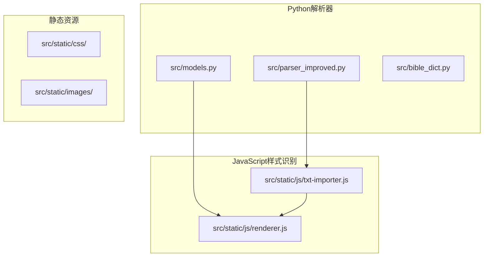
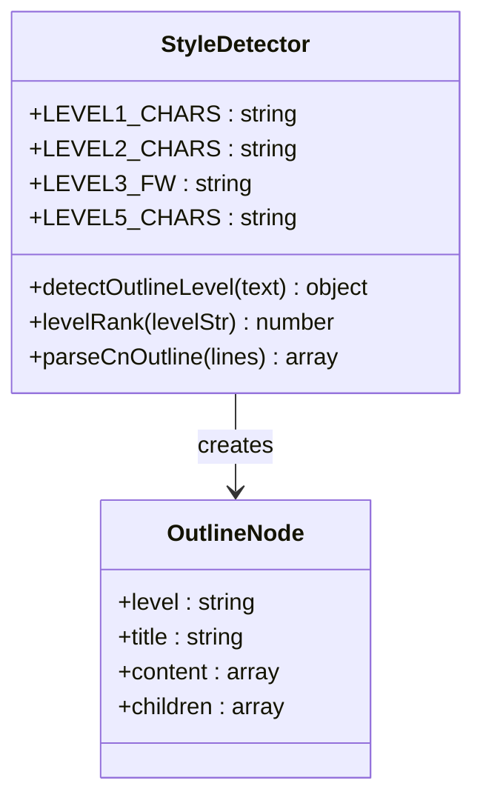
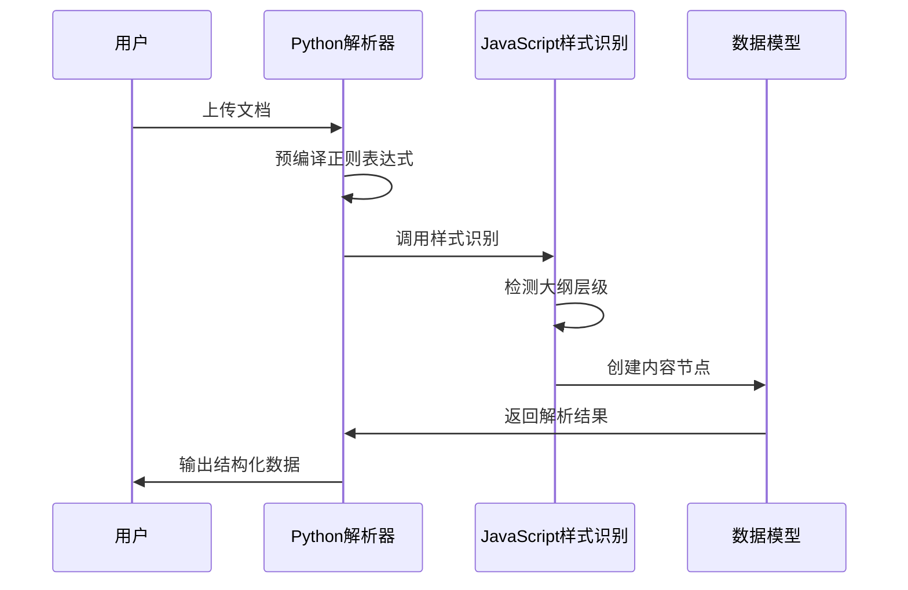
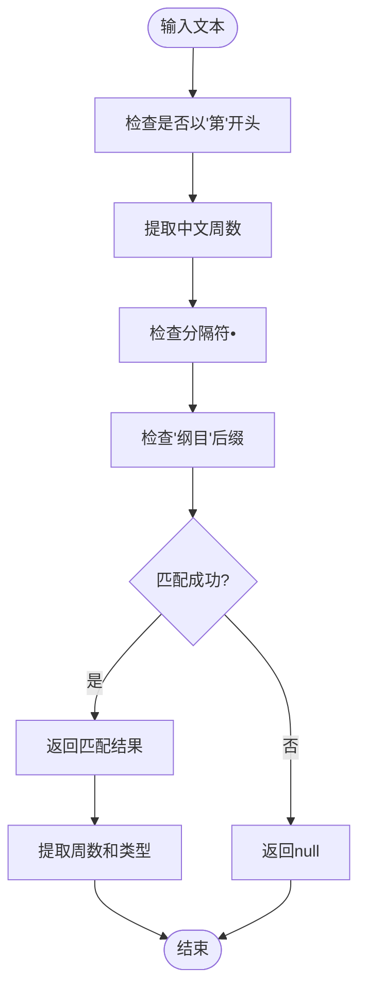
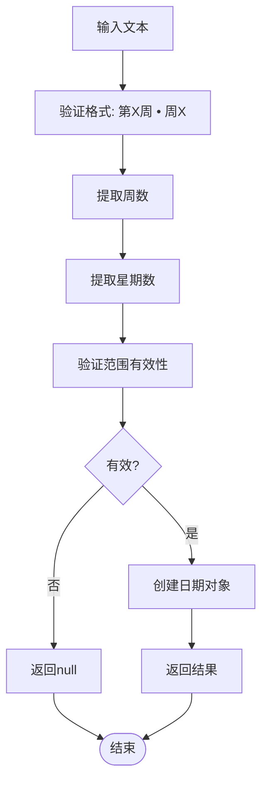
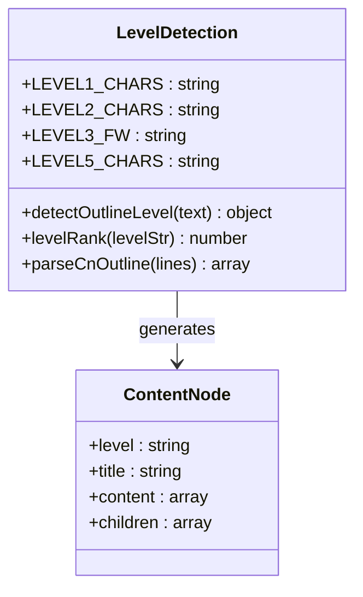
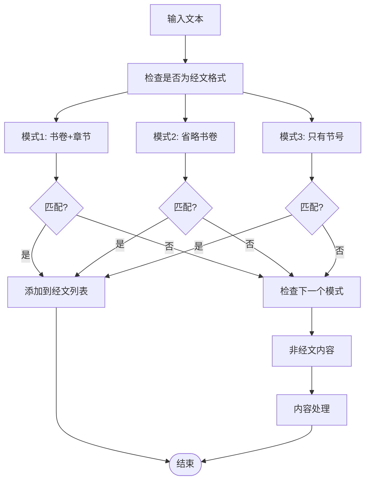
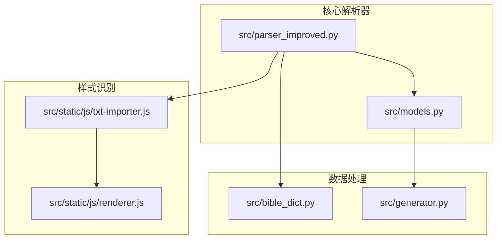

# 样式识别模式

<cite>
**本文档引用的文件**
- [parser_improved.py](file://src/parser_improved.py)
- [txt-importer.js](file://src/static/js/txt-importer.js)
- [models.py](file://src/models.py)
- [renderer.js](file://src/static/js/renderer.js)
</cite>

## 目录
1. [简介](#简介)
2. [项目结构](#项目结构)
3. [核心组件](#核心组件)
4. [架构概览](#架构概览)
5. [详细组件分析](#详细组件分析)
6. [依赖关系分析](#依赖关系分析)
7. [性能考虑](#性能考虑)
8. [故障排除指南](#故障排除指南)
9. [结论](#结论)

## 简介

本文档深入分析了项目中的样式识别模式系统，重点解释了预编译正则表达式模式的设计和用途。系统包含多个关键的样式识别模式，包括WEEK_OUTLINE_PATTERN、DAY_PATTERN、LEVEL1_PATTERN、LEVEL2_PATTERN、LEVEL3_PATTERN等，用于识别和解析不同层次的文档结构。

这些模式主要用于：
- 识别周纲目结构（第X周 • 纲目）
- 识别每日安排（第X周 • 周X）
- 识别各级大纲标题（壹、一二、1、a、㈠等）
- 解析经文格式
- 支持中英文混合的文档结构识别

## 项目结构

项目采用模块化设计，包含Python解析器和JavaScript样式识别两个主要组件：

**图表来源**
- [parser_improved.py:1-50](file://src/parser_improved.py#L1-L50)
- [txt-importer.js:1-30](file://src/static/js/txt-importer.js#L1-L30)

**章节来源**
- [parser_improved.py:1-150](file://src/parser_improved.py#L1-L150)
- [txt-importer.js:1-50](file://src/static/js/txt-importer.js#L1-L50)

## 核心组件

### 预编译正则表达式模式

系统定义了多个预编译的正则表达式模式，用于高效识别不同的文档结构：

| 模式名称 | 正则表达式 | 用途 | 匹配示例 |
|---------|-----------|------|----------|
| WEEK_OUTLINE_PATTERN | `^第([一二三四五六七八九十]+)周[　\s]*•[　\s]*纲目` | 识别周纲目标题 | "第一周 • 纲目" |
| DAY_PATTERN | `^第([一二三四五六七八九十]+)周[　\s]*•[　\s]*周([一二三四五六七])` | 识别每日安排 | "第一周 • 周一" |
| LEVEL1_PATTERN | `^([壹贰叁肆伍陆柒捌玖拾])[　\s]+(.*)` | 识别一级大纲标题 | "壹、创世记" |
| LEVEL2_PATTERN | `^([一二三四五六七八九十百]+)[　\s]+(.*)` | 识别二级大纲标题 | "一、创造天地" |
| LEVEL3_PATTERN | `^(\d+)[　\s]+(.*)` | 识别三级大纲标题 | "1. 创造过程" |

### JavaScript样式识别组件

**图表来源**
- [txt-importer.js:110-167](file://src/static/js/txt-importer.js#L110-L167)
- [txt-importer.js:169-200](file://src/static/js/txt-importer.js#L169-L200)

**章节来源**
- [parser_improved.py:137-146](file://src/parser_improved.py#L137-L146)
- [txt-importer.js:53-167](file://src/static/js/txt-importer.js#L53-L167)

## 架构概览

系统采用双层架构设计，结合Python和JavaScript的优势：

**图表来源**
- [parser_improved.py:367-782](file://src/parser_improved.py#L367-L782)
- [txt-importer.js:169-200](file://src/static/js/txt-importer.js#L169-L200)

## 详细组件分析

### WEEK_OUTLINE_PATTERN 分析

WEEK_OUTLINE_PATTERN专门用于识别周纲目结构：

**图表来源**
- [parser_improved.py:137-137](file://src/parser_improved.py#L137-L137)

**章节来源**
- [parser_improved.py:137-137](file://src/parser_improved.py#L137-L137)

### DAY_PATTERN 分析

DAY_PATTERN用于识别每日安排结构：

**图表来源**
- [parser_improved.py:138-138](file://src/parser_improved.py#L138-L138)

**章节来源**
- [parser_improved.py:138-138](file://src/parser_improved.py#L138-L138)

### 大纲层级识别系统

JavaScript组件提供了完整的层级识别功能：

**图表来源**
- [txt-importer.js:110-167](file://src/static/js/txt-importer.js#L110-L167)
- [txt-importer.js:169-200](file://src/static/js/txt-importer.js#L169-L200)

**章节来源**
- [txt-importer.js:110-167](file://src/static/js/txt-importer.js#L110-L167)
- [renderer.js:119-137](file://src/static/js/renderer.js#L119-L137)

### 经文识别模式

系统还包含专门的经文识别模式：

**图表来源**
- [models.py:112-124](file://src/models.py#L112-L124)

**章节来源**
- [models.py:112-124](file://src/models.py#L112-L124)

## 依赖关系分析

系统中的依赖关系体现了清晰的模块化设计：

**图表来源**
- [parser_improved.py:115-135](file://src/parser_improved.py#L115-L135)
- [txt-importer.js:1-20](file://src/static/js/txt-importer.js#L1-L20)

**章节来源**
- [parser_improved.py:115-135](file://src/parser_improved.py#L115-L135)
- [txt-importer.js:1-20](file://src/static/js/txt-importer.js#L1-L20)

## 性能考虑

### 预编译正则表达式的优化策略

1. **一次性编译**：所有正则表达式在模块加载时预编译，避免重复编译开销
2. **模式复用**：编译后的模式在整个应用生命周期内复用
3. **内存优化**：使用类属性存储预编译模式，减少内存碎片

### 匹配策略优化

1. **优先级匹配**：按照复杂度从高到低的顺序进行匹配
2. **早期退出**：一旦匹配成功立即返回，避免不必要的匹配尝试
3. **字符集优化**：使用专门的字符集常量，提高匹配效率

### JavaScript端的优化

1. **字符集预定义**：在模块顶部定义字符集常量，避免重复创建
2. **缓存机制**：利用JavaScript的闭包特性实现简单的缓存机制
3. **批量处理**：支持批量处理文本行，减少函数调用开销

## 故障排除指南

### 常见问题及解决方案

1. **模式匹配失败**
   - 检查输入文本的编码格式
   - 验证特殊字符的正确性（全角/半角空格）
   - 确认中文数字的正确性

2. **层级识别错误**
   - 检查LEVEL1_CHARS、LEVEL2_CHARS等字符集的完整性
   - 验证字符集与实际文档的一致性
   - 确认字符集的Unicode范围正确

3. **性能问题**
   - 检查正则表达式的复杂度
   - 优化字符集的大小
   - 考虑使用更高效的匹配策略

**章节来源**
- [parser_improved.py:946-956](file://src/parser_improved.py#L946-L956)
- [txt-importer.js:151-167](file://src/static/js/txt-importer.js#L151-L167)

## 结论

样式识别模式系统通过精心设计的预编译正则表达式和高效的JavaScript实现，为文档解析提供了强大的支持。系统的主要优势包括：

1. **模块化设计**：清晰的组件分离，便于维护和扩展
2. **性能优化**：预编译正则表达式和字符集优化
3. **灵活性**：支持多种文档格式和结构
4. **可扩展性**：易于添加新的识别模式和处理逻辑

通过合理使用这些模式，系统能够准确识别和解析复杂的文档结构，为后续的数据处理和展示奠定坚实基础。