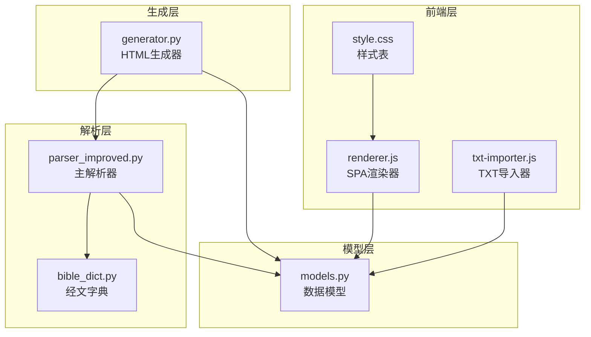
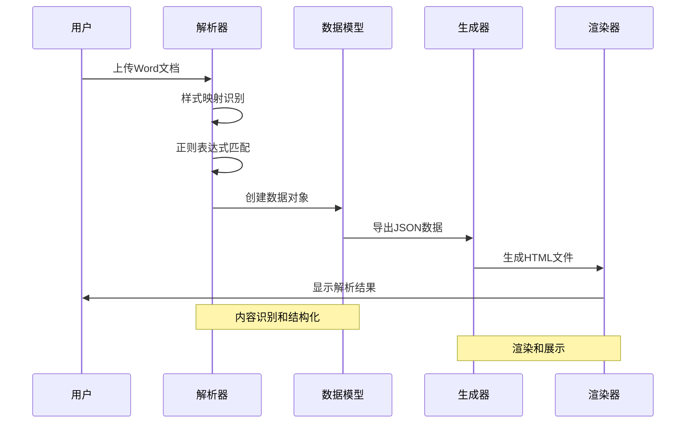
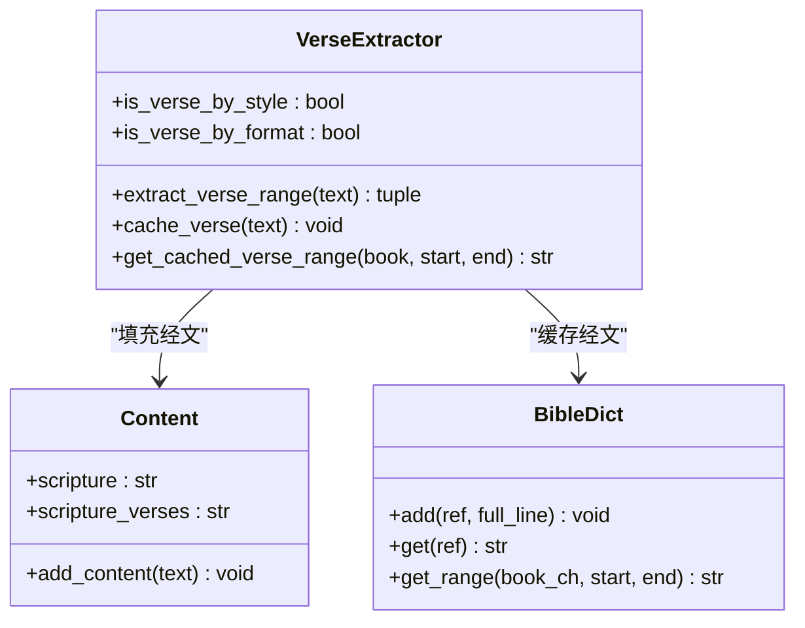
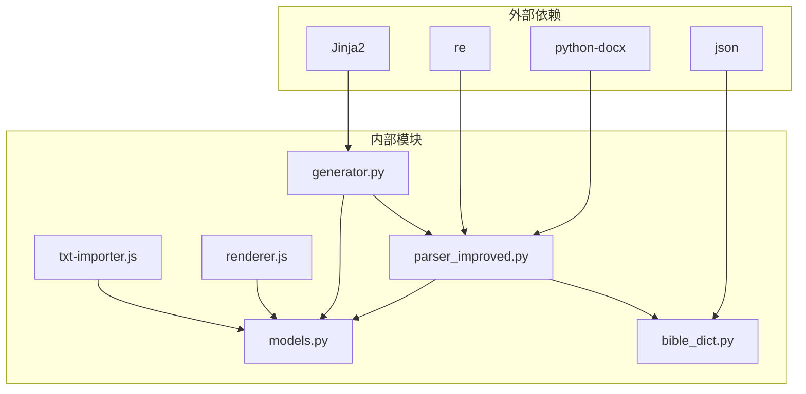

# 章节内容识别模式

<cite>
**本文档引用的文件**
- [parser_improved.py](file://src/parser_improved.py)
- [models.py](file://src/models.py)
- [generator.py](file://src/generator.py)
- [bible_dict.py](file://src/bible_dict.py)
- [renderer.js](file://src/static/js/renderer.js)
- [txt-importer.js](file://src/static/js/txt-importer.js)
- [style.css](file://src/static/css/style.css)
</cite>

## 目录
1. [简介](#简介)
2. [项目结构](#项目结构)
3. [核心组件](#核心组件)
4. [架构概览](#架构概览)
5. [详细组件分析](#详细组件分析)
6. [依赖分析](#依赖分析)
7. [性能考虑](#性能考虑)
8. [故障排除指南](#故障排除指南)
9. [结论](#结论)

## 简介

本文档深入分析了章节内容识别模式的技术实现，涵盖了章节标题识别、读经内容提取、诗歌编号识别等多种内容识别模式。该系统通过样式映射和文本特征识别相结合的方式，实现了对不同类型文档内容的精确分类和处理。

系统采用双引擎架构：Python后端负责复杂的文档解析和内容识别，JavaScript前端负责渲染和用户交互。核心功能包括：

- **章节标题识别**：通过样式映射和正则表达式识别章节标题
- **读经内容提取**：支持多种经文格式和引用方式
- **诗歌编号识别**：兼容全角半角字符和各种诗歌编号格式
- **层次结构解析**：从中文数字到罗马数字的多层级识别
- **正则表达式应用**：统一处理大小写字母前缀和全角半角字符

## 项目结构

该项目采用模块化设计，主要分为以下几个核心模块：



**图表来源**
- [parser_improved.py:115-135](file://src/parser_improved.py#L115-L135)
- [models.py:9-232](file://src/models.py#L9-L232)
- [generator.py:22-46](file://src/generator.py#L22-L46)

**章节来源**
- [parser_improved.py:1-113](file://src/parser_improved.py#L1-L113)
- [models.py:1-232](file://src/models.py#L1-L232)

## 核心组件

### 主解析器 (ImprovedParser)

主解析器是整个系统的中枢，负责处理Word文档的各种内容识别任务。其核心特性包括：

- **样式映射系统**：将Word样式名称映射到内部内容类型
- **正则表达式引擎**：预编译多种正则表达式用于高效匹配
- **层次结构识别**：支持从中文数字到罗马数字的多层级识别
- **经文引用解析**：处理复杂的圣经引用格式

### 数据模型 (Models)

数据模型定义了系统的核心数据结构，包括：

- **Content类**：内容节点基类，支持多层级嵌套
- **Chapter类**：篇章结构，包含标题、大纲、经文等内容
- **MorningRevival类**：晨读内容，按天组织
- **TrainingData类**：训练数据总集，管理整个训练内容

### 经文字典 (BibleDict)

经文字典提供了持久化的经文存储功能：

- **增量存储**：支持增量添加经文条目
- **范围查询**：支持经文范围的批量查询
- **JSON持久化**：支持经文字典的序列化和反序列化

**章节来源**
- [parser_improved.py:115-284](file://src/parser_improved.py#L115-L284)
- [models.py:9-232](file://src/models.py#L9-L232)
- [bible_dict.py:19-96](file://src/bible_dict.py#L19-L96)

## 架构概览

系统采用分层架构设计，确保了良好的可维护性和扩展性：



**图表来源**
- [parser_improved.py:367-782](file://src/parser_improved.py#L367-L782)
- [generator.py:383-425](file://src/generator.py#L383-L425)

系统的核心流程包括：

1. **文档加载**：支持.doc和.docx格式的自动识别和转换
2. **样式识别**：通过STYLE_MAP将Word样式映射到内容类型
3. **文本解析**：使用预编译的正则表达式进行高效匹配
4. **结构化存储**：将解析结果存储到数据模型中
5. **HTML生成**：生成SPA兼容的HTML文件
6. **前端渲染**：通过JavaScript进行动态渲染

## 详细组件分析

### 章节标题识别模式

章节标题识别是系统中最复杂的识别模式之一，采用了多层次的识别策略：

```mermaid
flowchart TD
A[开始解析] --> B{检查样式映射}
B --> |匹配| C[确定章节标题]
B --> |不匹配| D{检查正则表达式}
D --> |匹配| C
D --> |不匹配| E[继续下一个段落]
C --> F{验证包含"第X篇"}
F --> |是| G[提取章节编号]
F --> |否| E
G --> H[创建章节对象]
H --> I[重置层级状态]
I --> J[继续解析]
E --> A
```

**图表来源**
- [parser_improved.py:826-841](file://src/parser_improved.py#L826-L841)

章节标题识别的关键特性：

- **样式驱动**：优先使用Word样式进行识别
- **正则辅助**：通过正则表达式验证标题格式
- **内容过滤**：确保标题包含"第X篇"标识
- **状态管理**：正确重置各级别节点状态

**章节来源**
- [parser_improved.py:814-841](file://src/parser_improved.py#L814-L841)

### 读经内容提取机制

读经内容提取采用了双重识别机制：



**图表来源**
- [parser_improved.py:300-366](file://src/parser_improved.py#L300-L366)
- [models.py:40-53](file://src/models.py#L40-L53)
- [bible_dict.py:33-60](file://src/bible_dict.py#L33-L60)

读经内容提取的核心逻辑：

- **样式识别**：检查para.style.name是否为'verses'或'０c 經節'
- **格式识别**：使用VERSE_PATTERN匹配经文格式
- **范围处理**：支持单节和范围引用的处理
- **缓存机制**：使用verse_cache和BibleDict进行智能缓存

**章节来源**
- [parser_improved.py:730-760](file://src/parser_improved.py#L730-L760)

### 诗歌编号识别模式

诗歌编号识别是系统的重要组成部分，支持多种格式的诗歌编号：

```mermaid
flowchart LR
A[输入文本] --> B{检查包含"诗歌"}
B --> |是| C[提取诗歌编号]
B --> |否| D[检查两字母前缀]
C --> E{格式验证}
D --> E
E --> |有效| F[添加到hymn_number]
E --> |无效| G[跳过处理]
F --> H[继续解析]
G --> H
```

**图表来源**
- [parser_improved.py:657-663](file://src/parser_improved.py#L657-L663)

诗歌编号识别的特点：

- **多格式支持**：兼容"诗歌："和"诗歌:"格式
- **前缀识别**：支持所有两字母大写前缀（如EM、JL、MC等）
- **全角兼容**：支持全角半角字符的混合使用
- **智能合并**：将多个诗歌编号合并为统一格式

**章节来源**
- [parser_improved.py:618-623](file://src/parser_improved.py#L618-L623)

### 层次结构识别系统

系统实现了完整的层次结构识别，支持从中文数字到罗马数字的多层级：

```mermaid
graph TD
A[输入文本] --> B{检测层级字符}
B --> C{中文数字壹-拾}
B --> D{中文数字一二三四五}
B --> E{阿拉伯数字}
B --> F{小写字母}
B --> G{括号数字㈠㈡㈢}
C --> H[level-1 大纲]
D --> I[level-2 中纲]
E --> J[level-3 小纲]
F --> K[level-4 细纲]
G --> L[level-5 更细纲]
H --> M[Content(level="壹", title)]
I --> N[Content(level="一", title)]
J --> O[Content(level="1", title)]
K --> P[Content(level="a", title)]
L --> Q[Content(level="㈠", title)]
```

**图表来源**
- [parser_improved.py:686-728](file://src/parser_improved.py#L686-L728)
- [renderer.js:118-137](file://src/static/js/renderer.js#L118-L137)

层次结构识别的关键特性：

- **多字符集支持**：支持中文数字、阿拉伯数字、罗马数字、括号数字
- **智能降级**：当无法识别时，默认为level-3
- **一致性保证**：前后端使用相同的识别逻辑
- **层级继承**：子节点自动继承父节点的层级关系

**章节来源**
- [parser_improved.py:686-728](file://src/parser_improved.py#L686-L728)
- [renderer.js:118-137](file://src/static/js/renderer.js#L118-L137)

### 正则表达式应用模式

系统广泛使用正则表达式进行内容识别，所有正则表达式都经过预编译优化：

| 正则表达式类型 | 模式 | 用途 | 预编译位置 |
|---------------|------|------|-----------|
| 章节标题 | `^第[一二三四五六七八九十]+篇` | 识别章节标题 | STYLE_MAP区域 |
| 经文格式 | `^([创出利民申书士得撒王代拉尼斯伯诗箴传歌赛耶哀结但何珥摩俄拿弥鸿哈番该亚玛太可路约徒罗林加弗腓西帖提门多来雅彼犹启](?:[一二三四五六七八九十后前上下壹贰叁]\d+|\d+):\d+[上中下]?)[　\s\t]+(.+)` | 经文识别 | VERSE_PATTERN |
| 两字母前缀 | `^[A-Z]{2}[/ ]` | 诗歌编号识别 | 标题缓冲区检查 |
| 中文数字 | `^([一二三四五六七八九十百]+)[、\s]` | 中纲识别 | section_level2 |
| 罗马数字 | `^([I|V|X]+)[、\s]` | 大纲识别 | outlineLevelClass |

**章节来源**
- [parser_improved.py:137-146](file://src/parser_improved.py#L137-L146)
- [parser_improved.py:300-307](file://src/parser_improved.py#L300-L307)

## 依赖分析

系统采用松耦合的设计，各模块之间的依赖关系清晰明确：



**图表来源**
- [parser_improved.py:10-13](file://src/parser_improved.py#L10-L13)
- [generator.py:5-11](file://src/generator.py#L5-L11)

模块间的协作关系：

- **parser_improved.py** 依赖 python-docx 进行Word文档解析
- **generator.py** 依赖 Jinja2 进行模板渲染
- **bible_dict.py** 依赖 json 进行持久化存储
- **renderer.js** 依赖浏览器环境进行动态渲染
- **txt-importer.js** 依赖浏览器的 LocalForage 进行本地存储

**章节来源**
- [parser_improved.py:10-13](file://src/parser_improved.py#L10-L13)
- [generator.py:5-11](file://src/generator.py#L5-L11)

## 性能考虑

系统在设计时充分考虑了性能优化：

### 预编译正则表达式
所有正则表达式在模块加载时预编译，避免重复编译开销。

### 缓存机制
- **verse_cache**：内存缓存最近使用的经文
- **BibleDict**：持久化缓存，支持增量更新
- **类级缓存**：HTMLGenerator使用类变量缓存bible-text.json数据

### 流式处理
- **逐段处理**：文档按段落逐行处理，避免一次性加载整个文档
- **增量生成**：HTML文件按需生成，减少内存占用
- **懒加载**：前端按需加载训练数据

### 优化建议
1. **批量处理**：对于大量文档，考虑使用批处理队列
2. **并发处理**：利用多核CPU进行并行解析
3. **内存监控**：添加内存使用监控，防止内存泄漏
4. **缓存策略**：根据使用频率调整缓存策略

## 故障排除指南

### 常见问题及解决方案

**问题1：.doc文件无法解析**
- **原因**：缺少LibreOffice或转换失败
- **解决方案**：安装LibreOffice或手动转换为.docx格式

**问题2：章节标题识别失败**
- **原因**：样式映射不匹配或标题格式不符合规范
- **解决方案**：检查Word样式设置或调整正则表达式

**问题3：经文引用解析错误**
- **原因**：经文格式不符合标准或包含特殊字符
- **解决方案**：标准化经文格式或更新正则表达式

**问题4：层次结构识别异常**
- **原因**：中文数字格式不规范或混用全角半角字符
- **解决方案**：统一使用规范的中文数字格式

**章节来源**
- [parser_improved.py:84-112](file://src/parser_improved.py#L84-L112)
- [parser_improved.py:537-580](file://src/parser_improved.py#L537-L580)

### 调试技巧

1. **启用详细日志**：在解析过程中打印中间结果
2. **单元测试**：为关键识别函数编写单元测试
3. **边界测试**：测试各种边界情况和异常输入
4. **性能分析**：使用性能分析工具识别瓶颈

## 结论

章节内容识别模式通过精心设计的多层识别机制，成功实现了对复杂文档内容的精确分类和处理。系统的主要优势包括：

1. **高精度识别**：通过样式映射和正则表达式双重验证，确保识别准确性
2. **强扩展性**：模块化设计支持功能扩展和定制
3. **高性能**：预编译正则表达式和智能缓存机制保证处理效率
4. **跨平台兼容**：前后端使用一致的识别逻辑，确保一致性

该系统为文档内容识别提供了一个完整的解决方案，可以轻松扩展到其他类型的文档处理场景。通过持续的优化和改进，系统将继续提升识别准确性和处理性能。