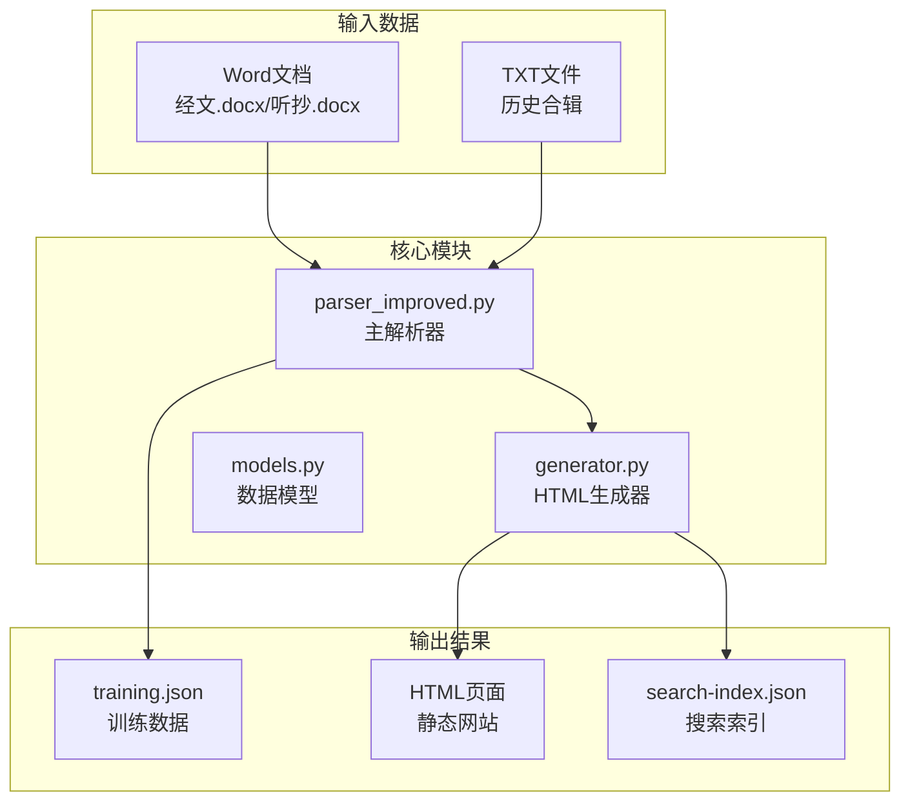
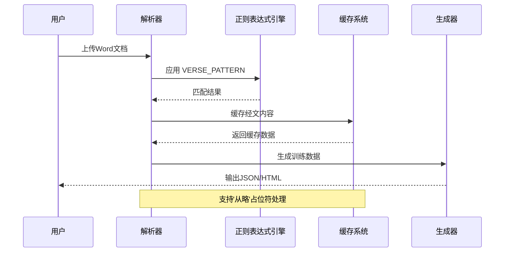
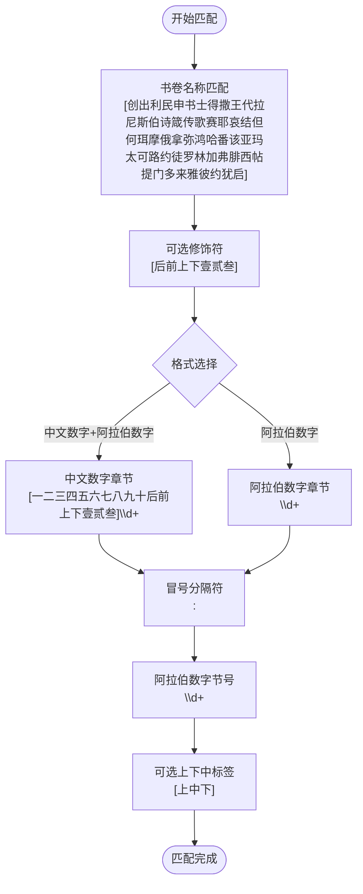
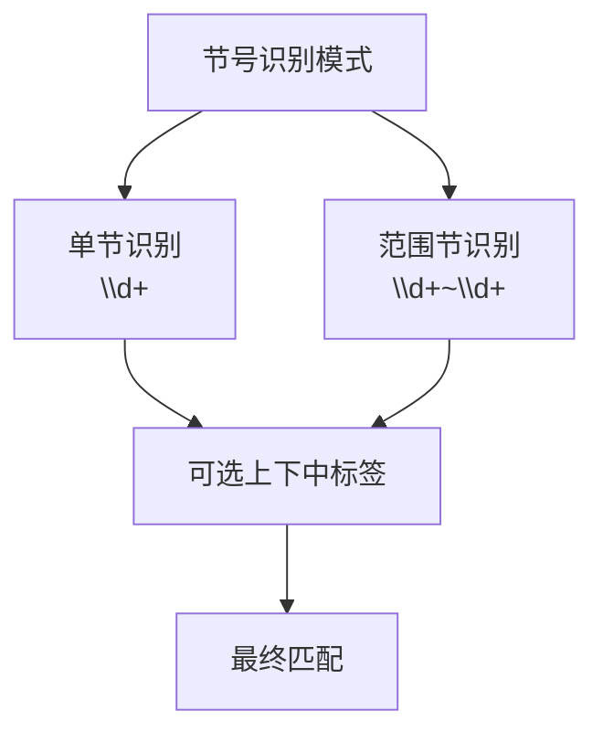
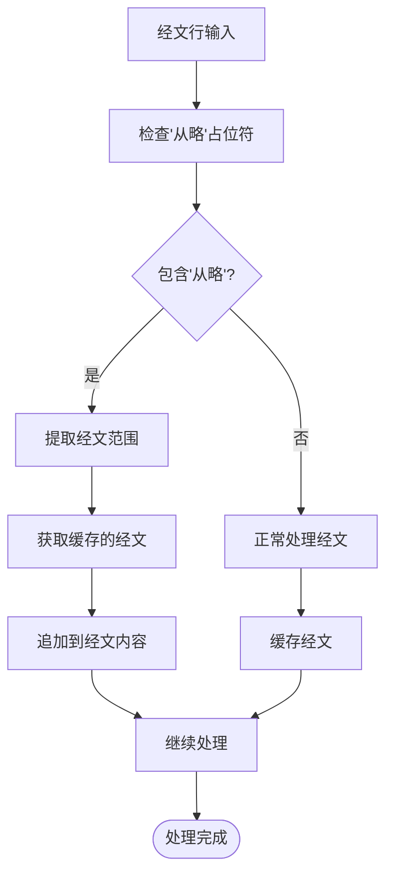
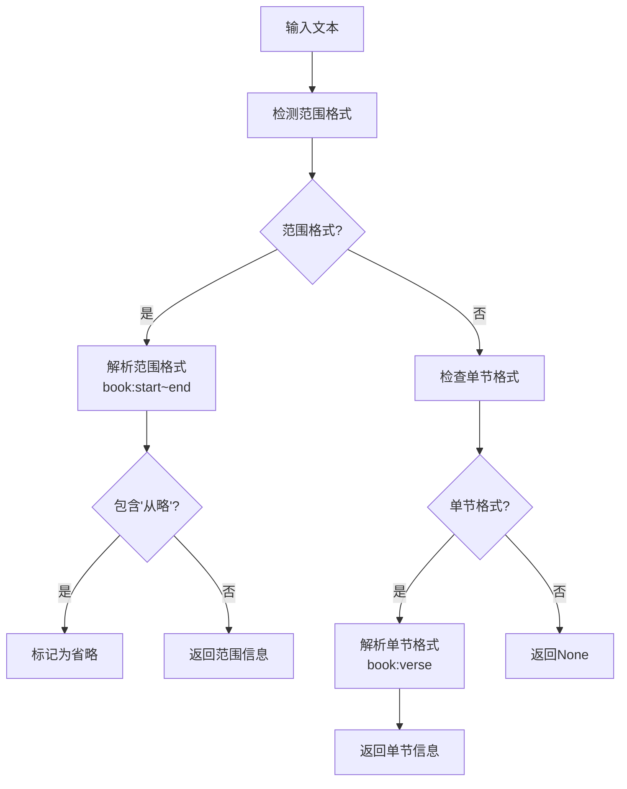
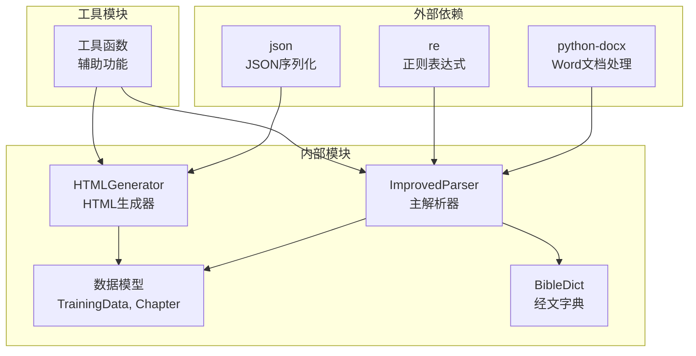

# 经文识别模式

<cite>
**本文档引用的文件**
- [parser_improved.py](file://src/parser_improved.py)
- [generator.py](file://src/generator.py)
- [models.py](file://src/models.py)
- [main.py](file://main.py)
</cite>

## 目录
1. [简介](#简介)
2. [项目结构](#项目结构)
3. [核心组件](#核心组件)
4. [架构概览](#架构概览)
5. [详细组件分析](#详细组件分析)
6. [依赖分析](#依赖分析)
7. [性能考虑](#性能考虑)
8. [故障排除指南](#故障排除指南)
9. [结论](#结论)

## 简介
本文档深入解析经文识别模式的实现，重点阐述 VERSE_PATTERN 正则表达式的复杂匹配逻辑和应用场景。该系统支持两种经文格式：
1) 书卷+中文数字+阿拉伯数字（如'太五3'）
2) 书卷+阿拉伯数字（如'腓2:5'）

文档详细解释书卷名称的匹配逻辑、中文数字章节的处理机制，以及阿拉伯数字节号的识别方法。同时提供具体的代码示例展示经文格式检测和提取过程，包括'从略'占位符的处理机制。

## 项目结构
该项目采用模块化设计，核心功能集中在解析器和生成器模块中：

**图表来源**
- [parser_improved.py:115-145](file://src/parser_improved.py#L115-L145)
- [generator.py:22-46](file://src/generator.py#L22-L46)

**章节来源**
- [parser_improved.py:1-113](file://src/parser_improved.py#L1-L113)
- [generator.py:1-546](file://src/generator.py#L1-L546)

## 核心组件
本项目的核心组件围绕经文识别和处理展开，主要包括：

### VERSE_PATTERN 正则表达式
VERSER_PATTERN 是整个经文识别系统的核心，负责匹配标准的经文格式。其结构设计体现了对中文圣经引用习惯的深度理解。

### 经文格式支持
系统支持两种主要的经文格式：
- **中文数字格式**：如'太五3'，'约壹二15'，'林后十三14'
- **阿拉伯数字格式**：如'腓2:5'，'约壹一6'，'林后十三14'

### 书卷名称匹配逻辑
系统通过预定义的书卷名称集合确保准确识别各种圣经书卷，包括简写形式和完整名称。

**章节来源**
- [parser_improved.py:143-145](file://src/parser_improved.py#L143-L145)
- [parser_improved.py:300-332](file://src/parser_improved.py#L300-L332)

## 架构概览
整个经文识别系统采用分层架构设计，从文档解析到最终输出形成完整的处理链：

**图表来源**
- [parser_improved.py:542-782](file://src/parser_improved.py#L542-L782)
- [generator.py:214-248](file://src/generator.py#L214-L248)

## 详细组件分析

### VERSE_PATTERN 正则表达式详解

#### 基本结构分析
VERSER_PATTERN 采用了精心设计的分组结构来处理复杂的经文格式：

**图表来源**
- [parser_improved.py:143-145](file://src/parser_improved.py#L143-L145)

#### 书卷名称匹配逻辑
系统通过预定义的书卷名称集合确保准确识别各种圣经书卷。该集合涵盖了所有旧约和新约书卷的完整名称和常用简写形式。

**章节来源**
- [parser_improved.py:147-149](file://src/parser_improved.py#L147-L149)

### 中文数字章节处理机制

#### 中文章节正则表达式
系统使用复杂的正则表达式来处理中文数字章节，支持从一到一百五十的所有中文数字组合：

**图表来源**
- [parser_improved.py:150-164](file://src/parser_improved.py#L150-L164)

#### 中文数字转换机制
系统提供了将中文数字转换为阿拉伯数字的功能，这对于处理中文数字章节至关重要。

**章节来源**
- [parser_improved.py:295-298](file://src/parser_improved.py#L295-L298)

### 阿拉伯数字节号识别

#### 节号识别正则表达式
系统使用专门的正则表达式来识别阿拉伯数字节号，支持单节、范围节等多种格式：

**图表来源**
- [parser_improved.py:316-332](file://src/parser_improved.py#L316-L332)

### '从略'占位符处理机制

#### 占位符检测流程
系统实现了智能的'从略'占位符检测和处理机制：

**图表来源**
- [parser_improved.py:547-560](file://src/parser_improved.py#L547-L560)
- [parser_improved.py:738-751](file://src/parser_improved.py#L738-L751)

**章节来源**
- [parser_improved.py:309-365](file://src/parser_improved.py#L309-L365)

### 经文范围提取算法

#### 范围提取流程
系统提供了完整的经文范围提取算法，支持单节、范围节等多种格式：

**图表来源**
- [parser_improved.py:309-332](file://src/parser_improved.py#L309-L332)

**章节来源**
- [parser_improved.py:309-332](file://src/parser_improved.py#L309-L332)

## 依赖分析

### 模块间依赖关系
系统采用清晰的模块化设计，各模块职责明确：

**图表来源**
- [parser_improved.py:5-13](file://src/parser_improved.py#L5-L13)
- [generator.py:5-11](file://src/generator.py#L5-L11)

### 关键依赖特性
- **正则表达式优化**：预编译正则表达式提高匹配效率
- **缓存机制**：VerseCache 和持久化字典双重缓存
- **模块化设计**：清晰的职责分离和接口定义

**章节来源**
- [parser_improved.py:137-142](file://src/parser_improved.py#L137-L142)
- [generator.py:208-212](file://src/generator.py#L208-L212)

## 性能考虑

### 正则表达式性能优化
系统在性能方面采取了多项优化措施：

1. **预编译正则表达式**：所有正则表达式在模块导入时预编译，避免重复编译开销
2. **惰性匹配**：使用非贪婪匹配减少回溯
3. **条件匹配**：根据输入特征选择最优匹配策略

### 缓存策略
系统实现了多层次的缓存机制：
- **内存缓存**：VerseCache 提供快速访问
- **持久化缓存**：BibleDict 支持跨进程数据共享
- **智能失效**：基于时间戳的缓存失效机制

### 内存管理
- **流式处理**：大文件采用流式处理避免内存溢出
- **及时释放**：处理完成后及时释放中间结果
- **垃圾回收**：合理利用Python的垃圾回收机制

## 故障排除指南

### 常见问题及解决方案

#### 正则表达式匹配失败
**问题症状**：某些经文格式无法正确识别
**可能原因**：
- 书卷名称不在预定义集合中
- 中文数字格式超出支持范围
- 格式包含特殊字符

**解决步骤**：
1. 检查书卷名称是否在允许范围内
2. 验证中文数字格式的正确性
3. 确认格式符合标准规范

#### 缓存数据不一致
**问题症状**：'从略'占位符无法正确替换
**可能原因**：
- 缓存键生成错误
- 缓存数据缺失
- 版本不兼容

**解决步骤**：
1. 检查缓存键的生成逻辑
2. 验证缓存数据的完整性
3. 确认版本兼容性

#### 性能问题
**问题症状**：处理大型文档时响应缓慢
**可能原因**：
- 正则表达式过于复杂
- 缓存未生效
- 内存不足

**解决步骤**：
1. 优化正则表达式结构
2. 检查缓存配置
3. 增加内存限制

**章节来源**
- [parser_improved.py:334-365](file://src/parser_improved.py#L334-L365)
- [generator.py:250-280](file://src/generator.py#L250-L280)

## 结论
经文识别模式通过精心设计的正则表达式和智能的数据处理机制，成功实现了对中文圣经引用格式的全面支持。系统不仅能够准确识别标准的经文格式，还提供了灵活的扩展能力来处理各种变体格式。

关键优势包括：
- **高精度匹配**：通过复杂的正则表达式确保匹配准确性
- **智能缓存**：多层次缓存机制提升处理效率
- **灵活扩展**：模块化设计便于功能扩展
- **性能优化**：预编译和流式处理确保高效运行

该系统为圣经研究和教学提供了强大的技术支持，能够有效处理各种复杂的经文引用场景。