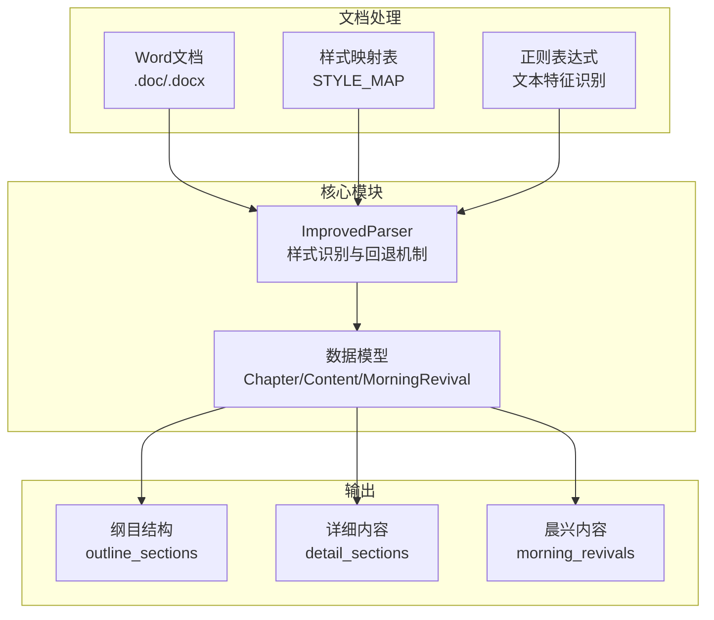
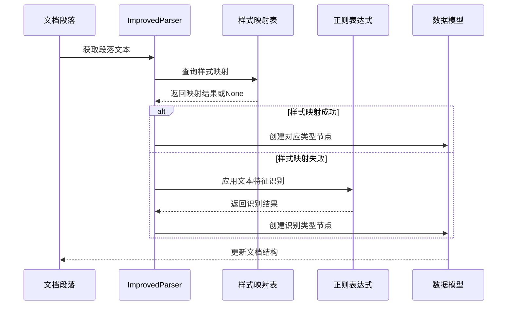
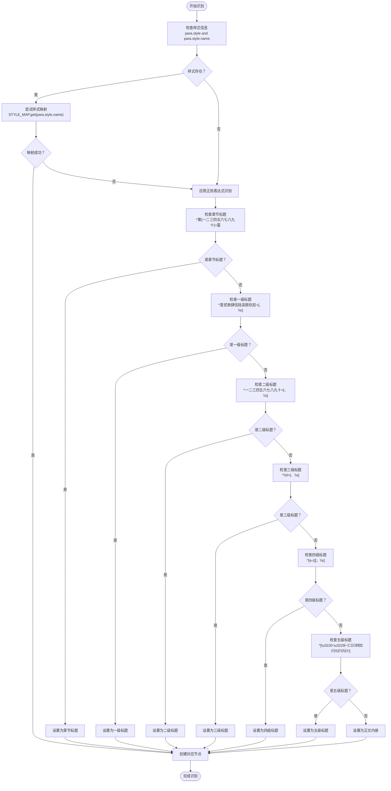
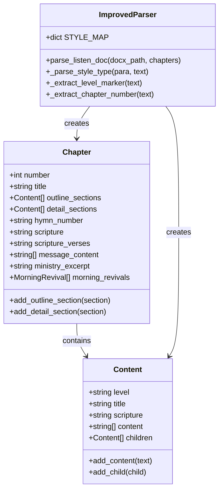
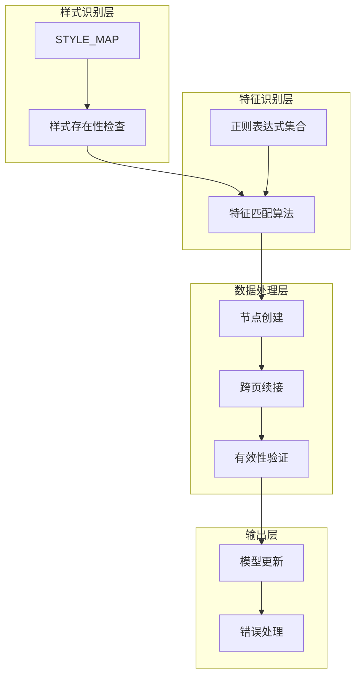

# 回退识别机制

<cite>
**本文引用的文件**
- [parser_improved.py](file://src/parser_improved.py)
- [models.py](file://src/models.py)
</cite>

## 目录
1. [简介](#简介)
2. [项目结构](#项目结构)
3. [核心组件](#核心组件)
4. [架构概览](#架构概览)
5. [详细组件分析](#详细组件分析)
6. [依赖分析](#依赖分析)
7. [性能考虑](#性能考虑)
8. [故障排除指南](#故障排除指南)
9. [结论](#结论)

## 简介
本文档深入解释了改进型Word文档解析器中的回退识别机制，重点阐述样式识别的双层策略：首先通过预定义的样式映射表进行精确匹配，若失败则通过正则表达式模式进行特征识别。文档详细描述了回退识别的触发条件、判断逻辑以及各种文本特征的识别规则，并提供了具体的代码示例路径，展示回退识别在_parse_style_type方法中的实现细节。

## 项目结构
该项目采用模块化设计，核心解析逻辑集中在改进型解析器中，数据模型定义在独立的模型文件中。解析器支持多种文档格式（.doc和.docx），并通过样式映射和正则表达式实现智能识别。

**图表来源**
- [parser_improved.py:117-135](file://src/parser_improved.py#L117-L135)
- [models.py:9-54](file://src/models.py#L9-L54)

## 核心组件
回退识别机制的核心在于双层识别策略的设计与实现。该机制通过样式映射表实现精确匹配，同时通过正则表达式提供灵活的特征识别能力，确保在不同文档格式和样式环境下都能准确识别文本类型。

### 样式映射表
解析器定义了完整的样式映射表，涵盖秋季和夏季训练的不同样式规范：

- **秋季样式**：针对.docx文档的样式映射
- **夏季样式**：针对.doc文档的样式映射  
- **统一映射**：chapter_title、section_level1-5、content等类型

### 正则表达式模式
系统预编译了多种正则表达式模式，用于识别不同类型的文本特征：

- **章节标题识别**：`^第[一二三四五六七八九十]+篇`
- **各级标题识别**：壹、一、数字、小写字母、特殊符号等
- **经文格式识别**：支持多种经文引用格式

**章节来源**
- [parser_improved.py:117-145](file://src/parser_improved.py#L117-L145)

## 架构概览
回退识别机制在整个解析流程中发挥关键作用，确保即使在样式信息缺失的情况下也能正确识别文档结构。

**图表来源**
- [parser_improved.py:806-824](file://src/parser_improved.py#L806-L824)

## 详细组件分析

### 样式识别与回退机制
回退识别的核心实现位于_parse_style_type方法中，该方法实现了完整的双层识别策略。

#### 触发条件
回退识别在以下情况下触发：
1. `para.style`不存在或为None
2. `para.style.name`不存在或为空
3. 样式映射表中未找到对应的样式类型

#### 判断逻辑
识别流程遵循严格的优先级顺序：

**图表来源**
- [parser_improved.py:806-824](file://src/parser_improved.py#L806-L824)

#### 错误处理机制
系统实现了完善的错误处理机制：

1. **样式存在性检查**：在访问`para.style.name`前进行双重检查
2. **映射失败处理**：当样式映射返回None时自动降级到正则表达式识别
3. **章节标题验证**：确保只有包含"第X篇"的标题才被视为有效章节
4. **跨页续接处理**：智能识别分页截断的标题并进行续接

**章节来源**
- [parser_improved.py:806-841](file://src/parser_improved.py#L806-L841)

### 文本特征识别规则

#### 章节标题识别
系统通过正则表达式`^第[一二三四五六七八九十]+篇`识别章节标题，支持中文数字1-99的识别。

#### 各级标题识别模式
系统为不同级别的标题定义了专门的识别模式：

- **一级标题**：`^([壹贰叁肆伍陆柒捌玖拾])[　\s]+(.*)`
- **二级标题**：`^([一二三四五六七八九十百]+)[　\s]+(.*)`  
- **三级标题**：`^(\d+)[　\s]+(.*)`
- **四级标题**：`^[a-z][　\s]+(.*)`
- **五级标题**：`^([\u3220-\u3229\uff08㈠㈡㈢㈣㈤㈥㈦㈧㈨㈩])(.*)`

#### 经文格式识别
系统支持多种经文格式的识别，包括：
- `^([创出利民申书士得撒王代拉尼斯伯诗箴传歌赛耶哀结但何珥摩俄拿弥鸿哈番该亚玛太可路约徒罗林加弗腓西帖提门多来雅彼约犹启](?:[一二三四五六七八九十后前上下壹贰叁]\d+|\d+):\d+[上中下]?)[　\s\t]+(.+)`

**章节来源**
- [parser_improved.py:138-145](file://src/parser_improved.py#L138-L145)
- [parser_improved.py:715-728](file://src/parser_improved.py#L715-L728)

### 数据模型集成
回退识别的结果直接影响数据模型的构建，系统通过统一的节点类型管理实现：

**图表来源**
- [models.py:9-54](file://src/models.py#L9-L54)
- [parser_improved.py:117-135](file://src/parser_improved.py#L117-L135)

**章节来源**
- [models.py:9-54](file://src/models.py#L9-L54)
- [parser_improved.py:843-944](file://src/parser_improved.py#L843-L944)

## 依赖分析
回退识别机制涉及多个组件之间的复杂依赖关系：

**图表来源**
- [parser_improved.py:806-841](file://src/parser_improved.py#L806-L841)
- [parser_improved.py:946-992](file://src/parser_improved.py#L946-L992)

系统的关键依赖包括：
- **样式映射表**：提供精确的样式识别基础
- **正则表达式库**：提供灵活的文本特征识别能力
- **数据模型**：承载识别结果并维护文档结构
- **错误处理机制**：确保识别过程的健壮性

**章节来源**
- [parser_improved.py:117-135](file://src/parser_improved.py#L117-L135)
- [parser_improved.py:946-992](file://src/parser_improved.py#L946-L992)

## 性能考虑
回退识别机制在设计时充分考虑了性能优化：

1. **预编译正则表达式**：所有正则表达式在类初始化时预编译，避免重复编译开销
2. **样式映射优化**：使用字典查找实现O(1)的样式识别速度
3. **早期退出机制**：在样式映射成功时立即返回，避免不必要的正则匹配
4. **内存管理**：合理使用缓存机制，平衡内存占用和性能提升

## 故障排除指南
在实际使用中可能遇到的问题及解决方案：

### 常见问题1：样式映射失败
**症状**：文档中的样式无法被正确识别
**原因**：样式名称不在STYLE_MAP中
**解决方案**：
1. 检查文档样式名称是否正确
2. 在STYLE_MAP中添加缺失的样式映射
3. 验证样式名称的编码格式

### 常见问题2：正则表达式匹配异常
**症状**：文本特征识别不准确
**原因**：正则表达式模式过于严格或宽松
**解决方案**：
1. 检查正则表达式模式的适用性
2. 根据实际文档格式调整匹配规则
3. 添加边界条件检查

### 常见问题3：跨页续接错误
**症状**：分页截断的标题被错误地识别为新标题
**原因**：跨页续接逻辑判断失误
**解决方案**：
1. 检查标题的完整性判断逻辑
2. 验证分页截断的识别条件
3. 实施更精确的续接判断机制

**章节来源**
- [parser_improved.py:843-944](file://src/parser_improved.py#L843-L944)

## 结论
回退识别机制通过双层识别策略实现了高可靠性的文档结构识别。样式映射提供精确的结构信息，而正则表达式则确保了在样式信息缺失时的鲁棒性。该机制不仅提高了文档解析的准确性，还增强了系统对不同文档格式的适应能力。通过合理的错误处理和性能优化，回退识别机制为整个解析系统提供了坚实的基础。