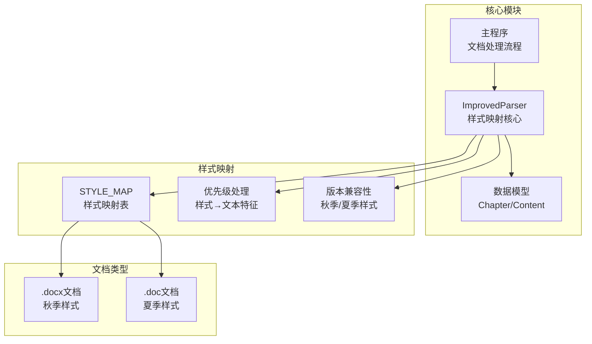
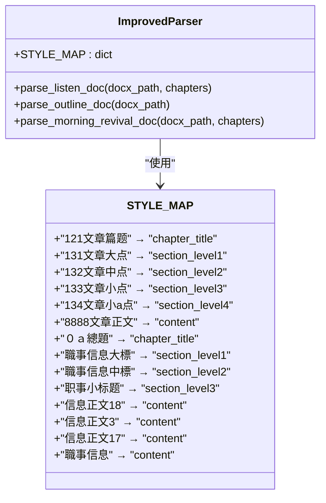
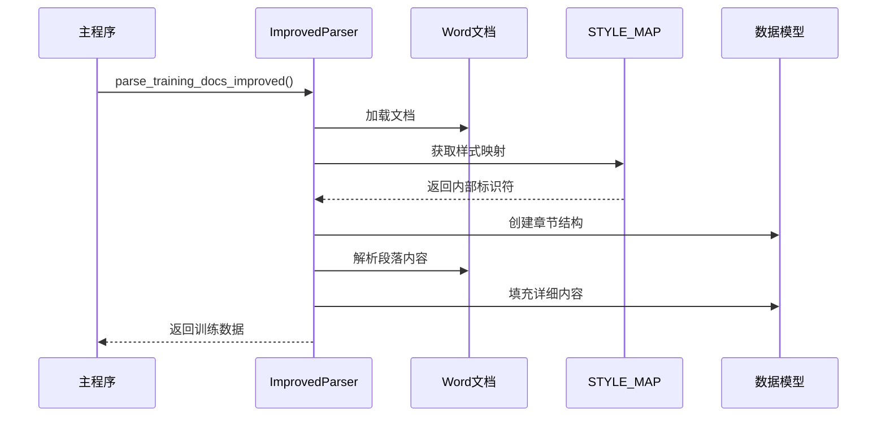
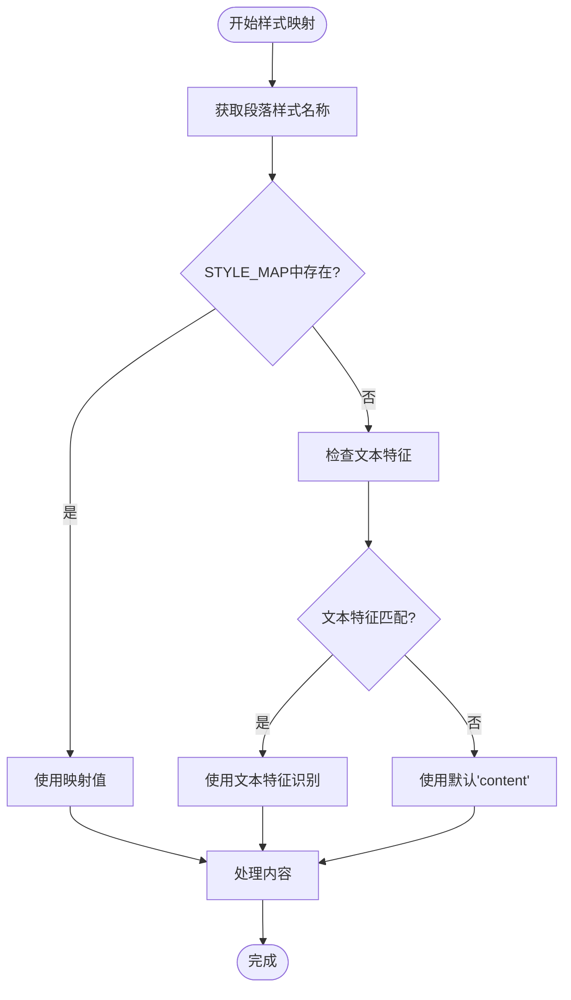
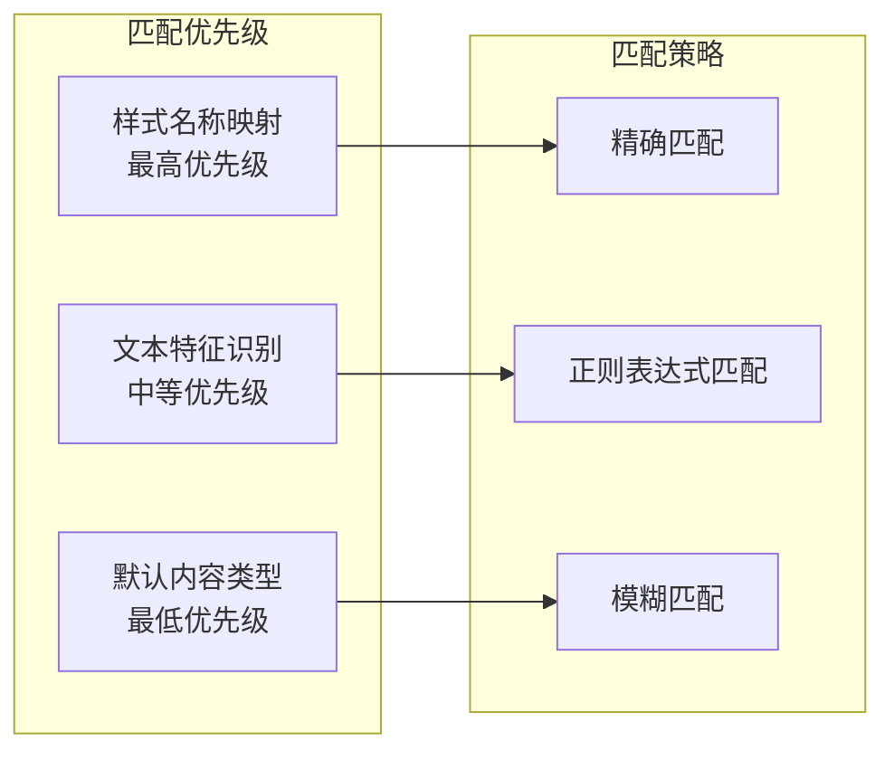
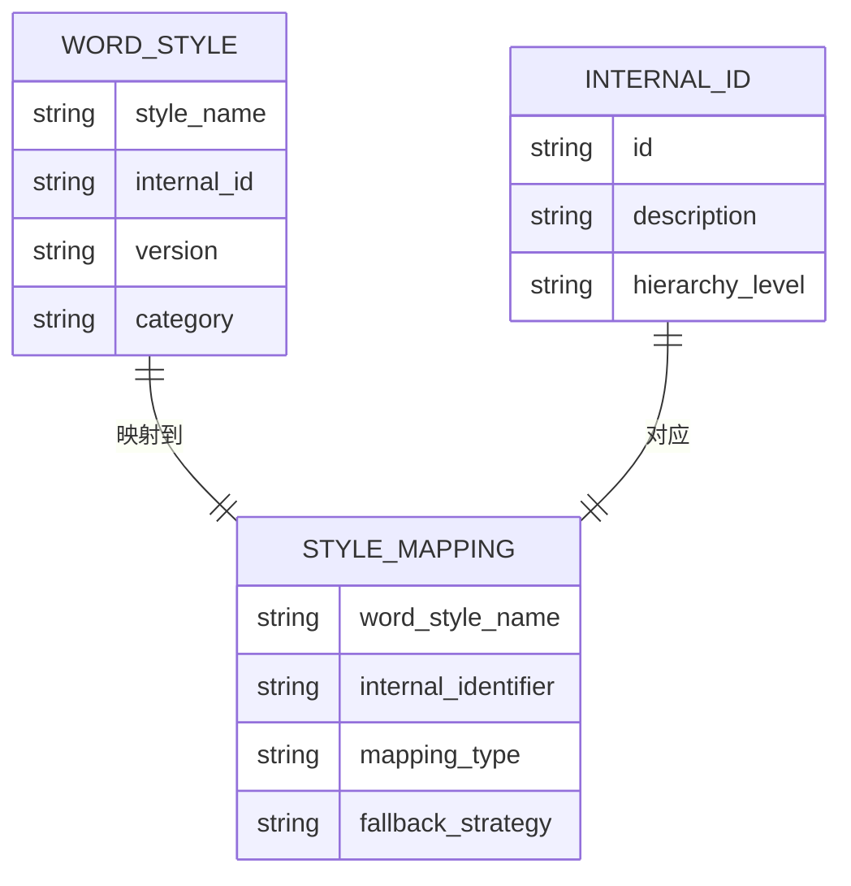
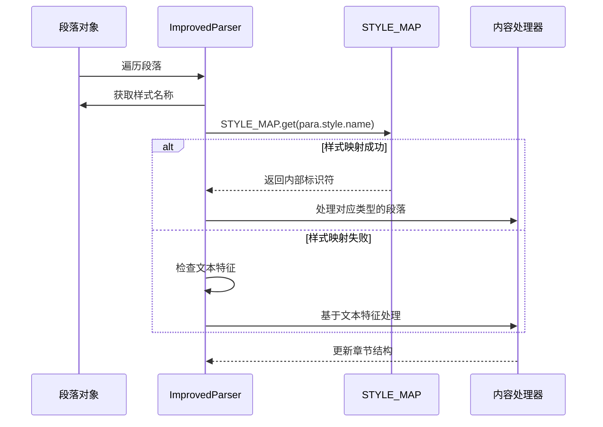
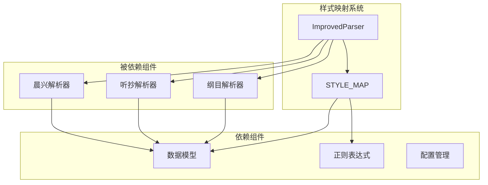

# 样式映射系统

<cite>
**本文档引用的文件**
- [parser_improved.py](file://src/parser_improved.py)
- [models.py](file://src/models.py)
- [main.py](file://main.py)
</cite>

## 目录
1. [简介](#简介)
2. [项目结构](#项目结构)
3. [核心组件](#核心组件)
4. [架构概览](#架构概览)
5. [详细组件分析](#详细组件分析)
6. [依赖分析](#依赖分析)
7. [性能考虑](#性能考虑)
8. [故障排除指南](#故障排除指南)
9. [结论](#结论)

## 简介

样式映射系统是本项目中用于处理Microsoft Word文档样式的关键组件，它实现了从Word文档样式名称到内部标识符的转换机制。该系统支持秋季.docx样式和夏季.doc样式，能够自动识别不同版本Word文档的样式差异，并提供灵活的样式映射策略。

系统的核心功能包括：
- 样式名称到内部标识符的双向映射
- 不同版本Word文档的样式兼容性处理
- 基于样式的智能解析和基于文本的降级处理
- 跨文档样式的统一管理

## 项目结构

该项目采用模块化的Python架构，样式映射系统位于核心解析器模块中：

**图表来源**
- [parser_improved.py:117-135](file://src/parser_improved.py#L117-L135)
- [parser_improved.py:784-945](file://src/parser_improved.py#L784-L945)

**章节来源**
- [parser_improved.py:115-135](file://src/parser_improved.py#L115-L135)
- [main.py:489-500](file://main.py#L489-L500)

## 核心组件

### STYLE_MAP映射表

样式映射系统的核心是STYLE_MAP字典，它定义了Word样式名称与内部标识符之间的映射关系：

**图表来源**
- [parser_improved.py:117-135](file://src/parser_improved.py#L117-L135)

### 样式映射表设计原则

样式映射表遵循以下设计原则：

1. **版本分离**：秋季.docx样式和夏季.doc样式分别定义
2. **层次清晰**：支持从篇章标题到小点级别的完整层次结构
3. **兼容性**：为相同语义的样式提供多个映射选项
4. **扩展性**：预留空间以适应未来样式变化

**章节来源**
- [parser_improved.py:118-134](file://src/parser_improved.py#L118-L134)

## 架构概览

样式映射系统在整个文档解析流程中扮演着关键角色：

**图表来源**
- [parser_improved.py:2592-2709](file://src/parser_improved.py#L2592-L2709)
- [main.py:489-500](file://main.py#L489-L500)

## 详细组件分析

### 样式映射实现机制

样式映射的实现采用了多层次的匹配策略：

**图表来源**
- [parser_improved.py:806-825](file://src/parser_improved.py#L806-L825)

### 样式优先级和匹配逻辑

系统实现了以下优先级处理机制：

1. **样式名称映射优先**：首先尝试通过STYLE_MAP进行精确匹配
2. **文本特征降级**：当样式映射失败时，通过正则表达式识别文本特征
3. **默认处理**：无法识别时默认标记为内容类型

**图表来源**
- [parser_improved.py:806-825](file://src/parser_improved.py#L806-L825)

**章节来源**
- [parser_improved.py:806-825](file://src/parser_improved.py#L806-L825)

### 不同版本Word文档的样式差异处理

系统针对不同版本的Word文档提供了专门的样式处理策略：

#### 秋季.docx样式（2024年及以前）

| Word样式名称 | 内部标识符 | 描述 |
|-------------|-----------|------|
| 121文章篇题 | chapter_title | 篇章标题 |
| 131文章大点 | section_level1 | 一级标题 |
| 132文章中点 | section_level2 | 二级标题 |
| 133文章小点 | section_level3 | 三级标题 |
| 134文章小a点 | section_level4 | 四级标题 |
| 8888文章正文 | content | 正文内容 |

#### 夏季.doc样式（2025年及以后）

| Word样式名称 | 内部标识符 | 描述 |
|-------------|-----------|------|
| ０ａ總題 | chapter_title | 篇章标题 |
| 职事信息大標 | section_level1 | 一级标题 |
| 职事信息中標 | section_level2 | 二级标题 |
| 职事小标题 | section_level3 | 三级标题 |
| 信息正文18 | content | 正文内容 |
| 信息正文3 | content | 正文内容 |
| 信息正文17 | content | 正文内容 |
| 职事信息 | content | 正文内容 |

**章节来源**
- [parser_improved.py:118-134](file://src/parser_improved.py#L118-L134)

### 样式名称到内部标识符的转换规则

系统实现了以下转换规则：

1. **直接映射**：样式名称与内部标识符一对一映射
2. **多对一映射**：多个样式名称映射到同一个内部标识符
3. **版本特定映射**：针对不同版本的Word文档提供不同的映射规则

**图表来源**
- [parser_improved.py:117-135](file://src/parser_improved.py#L117-L135)

**章节来源**
- [parser_improved.py:117-135](file://src/parser_improved.py#L117-L135)

### 样式映射在parse_listen_doc中的应用

在parse_listen_doc方法中，样式映射的具体应用流程如下：

**图表来源**
- [parser_improved.py:798-825](file://src/parser_improved.py#L798-L825)

**章节来源**
- [parser_improved.py:798-825](file://src/parser_improved.py#L798-L825)

## 依赖分析

样式映射系统与其他组件的依赖关系：

**图表来源**
- [parser_improved.py:115-135](file://src/parser_improved.py#L115-L135)
- [models.py:9-26](file://src/models.py#L9-L26)

**章节来源**
- [parser_improved.py:115-135](file://src/parser_improved.py#L115-L135)
- [models.py:9-26](file://src/models.py#L9-L26)

## 性能考虑

样式映射系统的性能优化策略：

1. **预编译正则表达式**：所有正则表达式在类初始化时预编译，提高匹配效率
2. **字典查找优化**：使用Python内置字典进行O(1)时间复杂度的样式查找
3. **早期退出机制**：在样式映射成功后立即处理，避免不必要的文本特征检查
4. **内存管理**：合理使用生成器和迭代器，减少内存占用

## 故障排除指南

### 常见问题及解决方案

1. **样式映射失败**
   - 检查STYLE_MAP中是否存在对应的样式名称
   - 验证Word文档的样式是否正确应用
   - 使用文本特征作为降级处理

2. **版本兼容性问题**
   - 确认使用的Word版本与样式映射表匹配
   - 检查是否有版本特定的样式名称
   - 考虑添加新的样式映射项

3. **性能问题**
   - 检查正则表达式的复杂度
   - 优化样式映射表的大小
   - 考虑缓存机制的使用

**章节来源**
- [parser_improved.py:806-825](file://src/parser_improved.py#L806-L825)

## 结论

样式映射系统通过精心设计的映射表和智能的匹配策略，成功解决了不同版本Word文档样式差异的问题。系统不仅提供了高效的样式转换机制，还具备良好的扩展性和兼容性，能够适应未来样式的变化。

该系统的关键优势包括：
- 清晰的样式层次结构定义
- 灵活的匹配策略和降级处理
- 良好的版本兼容性
- 高效的性能表现

通过持续的维护和优化，样式映射系统将继续为文档解析提供稳定可靠的支持。