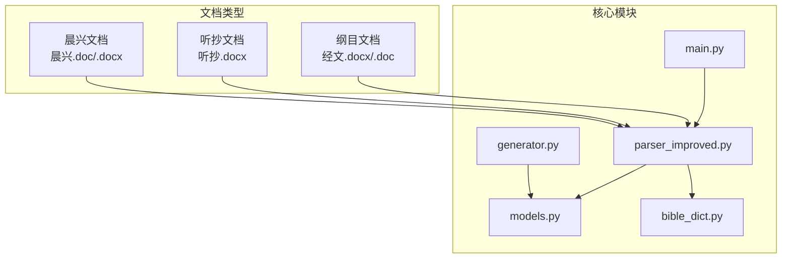
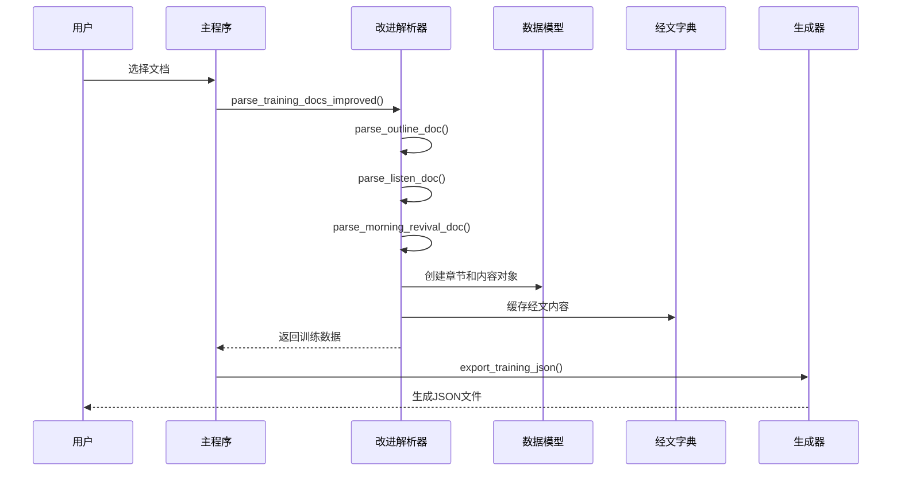
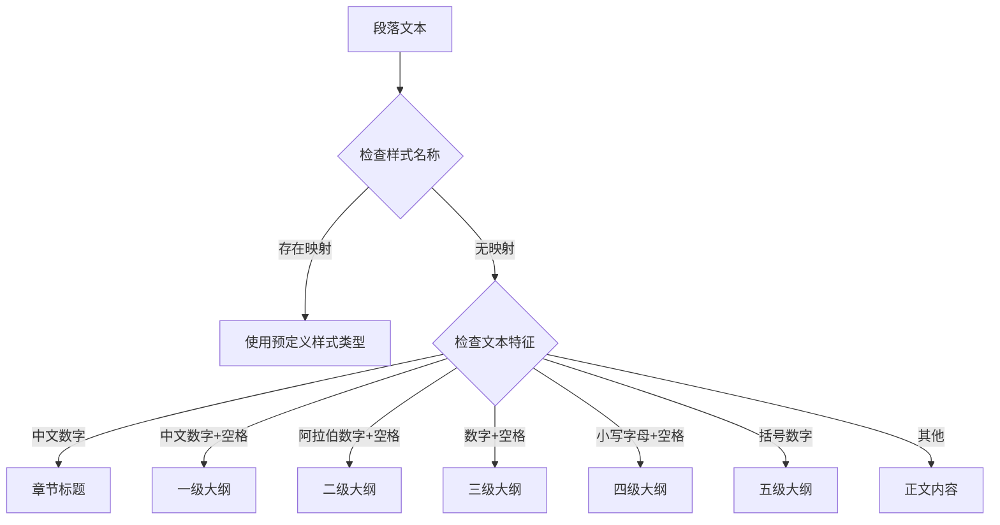
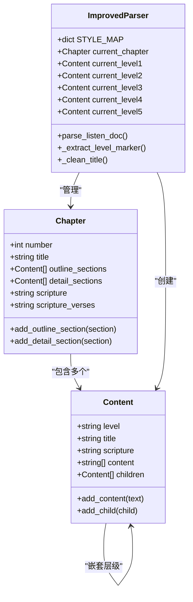
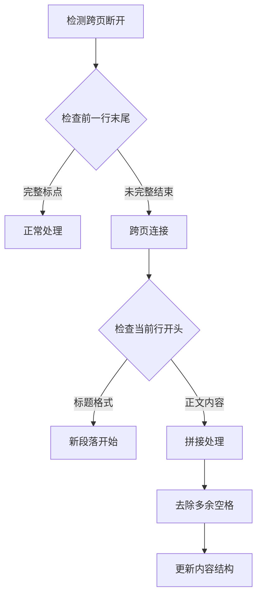
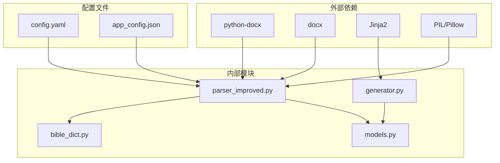
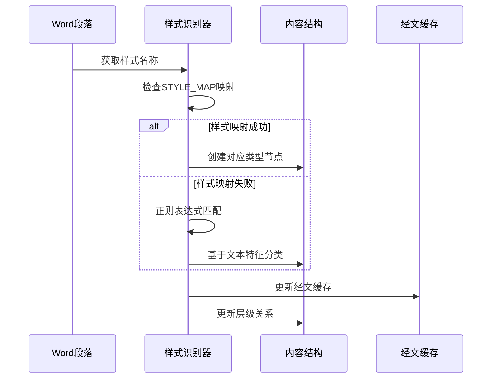

# 样式类型分类

<cite>
**本文档引用的文件**
- [parser_improved.py](file://src/parser_improved.py)
- [models.py](file://src/models.py)
- [bible_dict.py](file://src/bible_dict.py)
- [generator.py](file://src/generator.py)
- [main.py](file://main.py)
</cite>

## 目录
1. [简介](#简介)
2. [项目结构](#项目结构)
3. [核心组件](#核心组件)
4. [架构概览](#架构概览)
5. [详细组件分析](#详细组件分析)
6. [依赖分析](#依赖分析)
7. [性能考虑](#性能考虑)
8. [故障排除指南](#故障排除指南)
9. [结论](#结论)

## 简介

样式类型分类系统是该文档解析项目的核心组件，负责识别和分类Word文档中的各种样式类型。系统能够准确区分章节标题、大纲层级、正文内容等不同类型的文本内容，为后续的文档结构化处理提供基础。

该系统主要处理两类文档：
- **纲目文档（经文.docx/.doc）**：包含训练大纲结构和职事信息
- **听抄文档（听抄.docx）**：包含详细的正文说明和听抄内容

## 项目结构

项目采用模块化设计，主要包含以下核心文件：

**图表来源**
- [main.py:489-500](file://main.py#L489-L500)
- [parser_improved.py:115-135](file://src/parser_improved.py#L115-L135)

**章节来源**
- [main.py:410-536](file://main.py#L410-L536)
- [parser_improved.py:115-135](file://src/parser_improved.py#L115-L135)

## 核心组件

### 样式映射系统

系统使用预定义的样式映射表来识别不同类型的样式：

| 样式类型 | 春季样式 | 夏季样式 | 描述 |
|---------|----------|----------|------|
| 章节标题 | 121文章篇题 | ０ａ總題 | 章节标题识别 |
| 一级大纲 | 131文章大点 | 职事信息大標 | 大纲主标题 |
| 二级大纲 | 132文章中点 | 职事信息中標 | 大纲中标题 |
| 三级大纲 | 133文章小点 | 职事小标题 | 大纲小标题 |
| 四级大纲 | 134文章小a点 | 信息正文18 | 细节标题 |
| 五级大纲 | - | 信息正文17 | 更细标题 |
| 正文内容 | - | 信息正文3 | 普通正文 |

### 样式识别规则

系统采用双重识别机制：

1. **样式名称映射**：基于预定义的样式名称到类型映射
2. **文本特征识别**：基于正则表达式模式的文本特征匹配

**章节来源**
- [parser_improved.py:118-135](file://src/parser_improved.py#L118-L135)
- [parser_improved.py:806-825](file://src/parser_improved.py#L806-L825)

## 架构概览

**图表来源**
- [parser_improved.py:2592-2710](file://src/parser_improved.py#L2592-L2710)
- [main.py:489-500](file://main.py#L489-L500)

## 详细组件分析

### 样式识别引擎

样式识别引擎是系统的核心组件，负责将原始文本内容转换为结构化的样式类型。

#### 样式映射机制

**图表来源**
- [parser_improved.py:806-825](file://src/parser_improved.py#L806-L825)

#### 样式识别优先级

样式识别遵循以下优先级顺序：

1. **样式名称映射**：优先使用预定义的样式名称映射
2. **文本特征匹配**：当样式映射失败时，通过文本特征进行识别
3. **默认分类**：无法识别的文本归类为正文内容

**章节来源**
- [parser_improved.py:806-825](file://src/parser_improved.py#L806-L825)

### 文本模式识别

系统使用复杂的正则表达式来识别不同格式的文本模式：

#### 中文数字标题识别
- **模式**：`^[壹贰叁肆伍陆柒捌玖拾]+[、\s]`
- **用途**：识别一级大纲标题
- **特点**：支持中文数字的变体格式

#### 阿拉伯数字标题识别  
- **模式**：`^[一二三四五六七八九十]+[、\s]`
- **用途**：识别二级大纲标题
- **特点**：支持中文数字的简化形式

#### 数字小标题识别
- **模式**：`^\d+[、\s]`
- **用途**：识别三级大纲标题
- **特点**：支持纯阿拉伯数字格式

#### 字母小标题识别
- **模式**：`^[a-z][、\s]`
- **用途**：识别四级大纲标题
- **特点**：支持英文字母的小写格式

#### 括号数字识别
- **模式**：`^[\u3220-\u3229]`
- **用途**：识别五级大纲标题
- **特点**：支持特殊括号数字格式

**章节来源**
- [parser_improved.py:813-822](file://src/parser_improved.py#L813-L822)
- [parser_improved.py:946-956](file://src/parser_improved.py#L946-L956)

### 大纲层级处理

系统能够智能处理多层级的大纲结构：

**图表来源**
- [models.py:9-26](file://src/models.py#L9-L26)
- [models.py:40-63](file://src/models.py#L40-L63)
- [parser_improved.py:115-135](file://src/parser_improved.py#L115-L135)

### 经文处理系统

系统具备强大的经文识别和处理能力：

#### 经文格式识别
- **模式**：`^([创出利民申书士得撒王代拉尼斯伯诗箴传歌赛耶哀结但何珥摩俄拿弥鸿哈番该亚玛太可路约徒罗林加弗腓西帖提门多彼约犹启来][一二三四五六七八九十后前上下壹贰叁]\d+|\d+):\d+[上下]?`
- **用途**：识别标准的经文格式
- **特点**：支持中文书名、阿拉伯数字书名、半节标记

#### 经文范围处理
系统能够处理经文范围的复杂格式：
- 单节经文：腓2:5
- 经文范围：腓2:5~11
- 半节标记：腓2:5上、腓2:5下

**章节来源**
- [bible_dict.py:13-16](file://src/bible_dict.py#L13-L16)
- [parser_improved.py:309-332](file://src/parser_improved.py#L309-L332)

### 跨页内容处理

系统能够智能处理跨页断开的内容：

**图表来源**
- [parser_improved.py:2092-2158](file://src/parser_improved.py#L2092-L2158)

**章节来源**
- [parser_improved.py:2092-2158](file://src/parser_improved.py#L2092-L2158)

## 依赖分析

### 组件耦合关系

**图表来源**
- [main.py:14-16](file://main.py#L14-L16)
- [generator.py:9](file://src/generator.py#L9)

### 样式类型处理流程

**图表来源**
- [parser_improved.py:806-944](file://src/parser_improved.py#L806-L944)

**章节来源**
- [parser_improved.py:806-944](file://src/parser_improved.py#L806-L944)

## 性能考虑

### 正则表达式优化

系统使用预编译的正则表达式来提高性能：
- 所有正则表达式在模块加载时预编译
- 使用最具体和高效的模式匹配
- 避免回溯陷阱和过度复杂的模式

### 内存管理

- 使用生成器模式处理大量文档
- 及时清理临时数据和缓存
- 控制内存使用量，避免内存泄漏

### 处理效率

- 批量处理文档段落
- 使用字典和集合进行快速查找
- 避免重复计算和不必要的操作

## 故障排除指南

### 常见问题及解决方案

#### 样式识别失败
**症状**：某些段落被错误分类或无法识别
**原因**：样式名称不在映射表中或文本特征不匹配
**解决**：检查文档样式设置，确保使用标准样式名称

#### 跨页内容断裂
**症状**：长段落被错误地分割
**原因**：跨页断开导致内容丢失
**解决**：启用跨页连接检测，检查段落间的标点符号

#### 经文识别错误
**症状**：经文格式被错误解析
**原因**：经文格式不符合预期
**解决**：检查经文格式的一致性，确保使用标准格式

**章节来源**
- [parser_improved.py:2092-2158](file://src/parser_improved.py#L2092-L2158)

### 调试技巧

1. **启用详细日志**：查看样式识别过程的详细信息
2. **检查正则表达式**：验证模式匹配的准确性
3. **验证数据结构**：确保生成的内容结构符合预期
4. **测试边界条件**：验证特殊格式的处理能力

## 结论

样式类型分类系统通过精心设计的识别规则和处理流程，实现了对复杂Word文档的精确分类。系统的主要优势包括：

1. **多层识别机制**：结合样式名称和文本特征，提高识别准确性
2. **灵活的格式支持**：支持多种语言和格式的文本内容
3. **智能的结构处理**：能够处理复杂的嵌套大纲结构
4. **高效的性能表现**：通过预编译和优化算法确保处理速度

该系统为后续的文档处理和内容生成奠定了坚实的基础，能够有效地支持大规模文档的自动化处理需求。