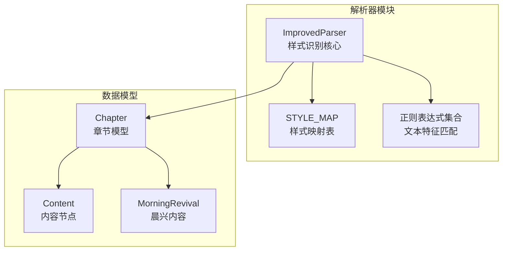
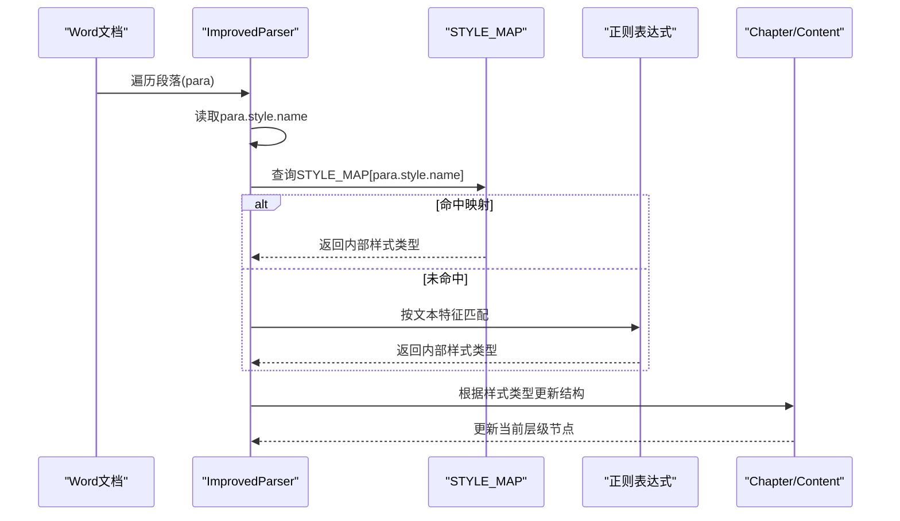
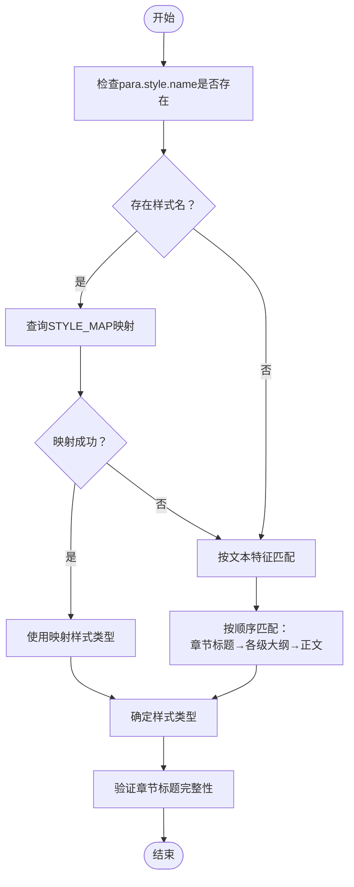
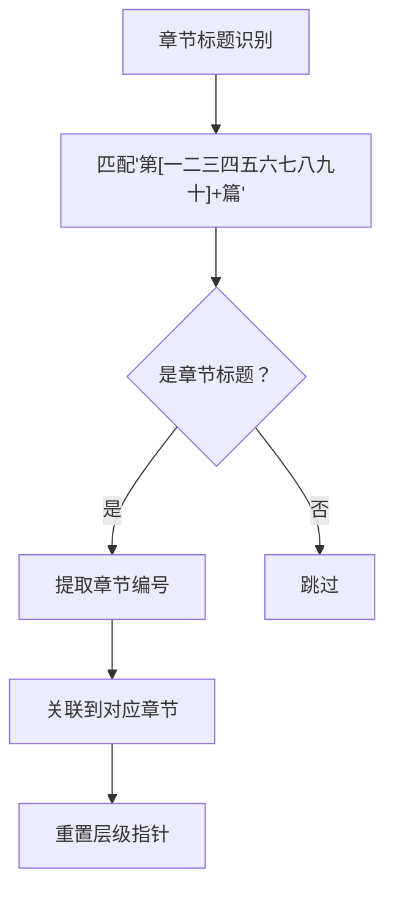
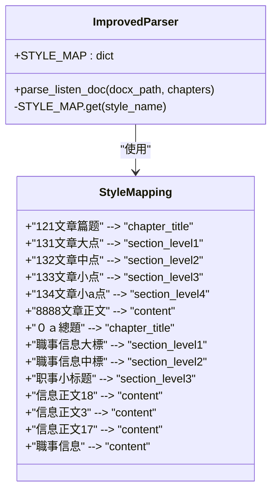
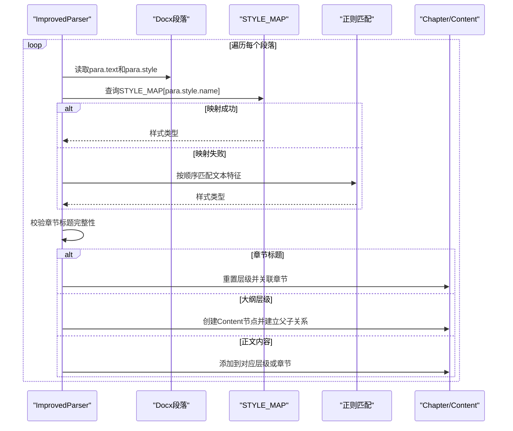
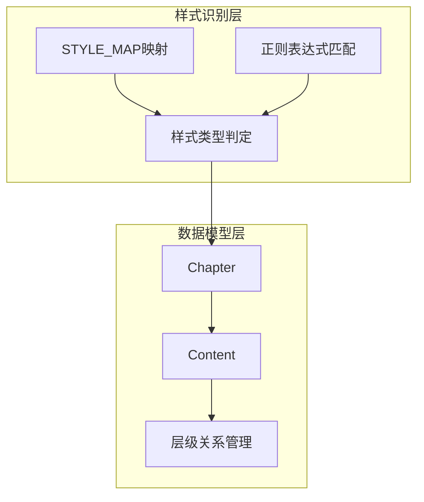

# 样式识别算法

<cite>
**本文档引用的文件**
- [parser_improved.py](file://src/parser_improved.py)
- [models.py](file://src/models.py)
</cite>

## 目录
1. [简介](#简介)
2. [项目结构](#项目结构)
3. [核心组件](#核心组件)
4. [架构概览](#架构概览)
5. [详细组件分析](#详细组件分析)
6. [依赖分析](#依赖分析)
7. [性能考虑](#性能考虑)
8. [故障排除指南](#故障排除指南)
9. [结论](#结论)

## 简介
本文件面向样式识别算法的技术文档，聚焦于ImprovedParser类中的样式识别实现。该算法通过两条路径实现样式类型判定：
- 优先路径：基于para.style.name的STYLE_MAP映射
- 备选路径：基于正则表达式模式的文本特征匹配

文档将详细解释样式识别的优先级顺序、各类样式类型的识别规则（章节标题、各级大纲、正文内容），并给出在parse_listen_doc中的具体应用流程。

## 项目结构
样式识别算法位于Python解析器模块中，核心实现集中在src/parser_improved.py的ImprovedParser类，数据模型定义在src/models.py中。

**图表来源**
- [parser_improved.py:115-135](file://src/parser_improved.py#L115-L135)
- [models.py:9-63](file://src/models.py#L9-L63)

**章节来源**
- [parser_improved.py:115-135](file://src/parser_improved.py#L115-L135)
- [models.py:9-63](file://src/models.py#L9-L63)

## 核心组件
- ImprovedParser：提供样式识别、文本解析、章节结构构建等能力
- STYLE_MAP：定义para.style.name到内部样式的映射
- 正则表达式集合：提供各级标题、大纲、正文的文本特征匹配
- 数据模型：Chapter、Content、MorningRevival用于承载解析结果

**章节来源**
- [parser_improved.py:115-135](file://src/parser_improved.py#L115-L135)
- [parser_improved.py:806-825](file://src/parser_improved.py#L806-L825)
- [models.py:9-63](file://src/models.py#L9-L63)

## 架构概览
样式识别在parse_listen_doc中按段落遍历执行，核心流程如下：

**图表来源**
- [parser_improved.py:806-825](file://src/parser_improved.py#L806-L825)
- [parser_improved.py:826-945](file://src/parser_improved.py#L826-L945)

## 详细组件分析

### 样式识别优先级与实现
- 优先级顺序
  1) 使用STYLE_MAP映射para.style.name
  2) 若映射失败，使用正则表达式匹配文本特征
- 实现要点
  - 通过STYLE_MAP.get(para.style.name)进行快速映射
  - 文本特征匹配遵循“章节标题→各级大纲→正文”的顺序
  - 对章节标题进行二次校验，确保包含“第X篇”

**图表来源**
- [parser_improved.py:806-825](file://src/parser_improved.py#L806-L825)
- [parser_improved.py:826-830](file://src/parser_improved.py#L826-L830)

**章节来源**
- [parser_improved.py:806-825](file://src/parser_improved.py#L806-L825)
- [parser_improved.py:826-830](file://src/parser_improved.py#L826-L830)

### 样式类型识别规则详解

#### 章节标题识别
- 识别规则
  - 匹配包含“第[一二三四五六七八九十]+篇”的文本
  - 通过_extract_chapter_number提取章节编号
  - 与已解析的章节建立关联
- 处理逻辑
  - 仅当文本包含“第X篇”时才视为章节标题
  - 重置各级别层级指针，进入对应章节内容解析

**图表来源**
- [parser_improved.py:811-812](file://src/parser_improved.py#L811-L812)
- [parser_improved.py:830-841](file://src/parser_improved.py#L830-L841)

**章节来源**
- [parser_improved.py:811-812](file://src/parser_improved.py#L811-L812)
- [parser_improved.py:830-841](file://src/parser_improved.py#L830-L841)

#### 一级大纲（section_level1）识别
- 识别规则
  - 匹配“[壹贰叁肆伍陆柒捌玖拾]+[、\s]”模式
  - 支持“拾 壹”等带空格的中文数字
- 处理逻辑
  - 提取层级标记和标题文本
  - 跨页续接：若前一level1无内容且标题未完整结束，进行拼接

**章节来源**
- [parser_improved.py:813-814](file://src/parser_improved.py#L813-L814)
- [parser_improved.py:843-867](file://src/parser_improved.py#L843-L867)

#### 二级大纲（section_level2）识别
- 识别规则
  - 匹配“[一二三四五六七八九十]+[、\s]”模式
- 处理逻辑
  - 仅在存在上级level1时生效
  - 支持跨页续接的智能拼接

**章节来源**
- [parser_improved.py:815-816](file://src/parser_improved.py#L815-L816)
- [parser_improved.py:869-890](file://src/parser_improved.py#L869-L890)

#### 三级大纲（section_level3）识别
- 识别规则
  - 匹配“\d+[、\s]”模式
- 处理逻辑
  - 仅在存在上级level2时生效

**章节来源**
- [parser_improved.py:817-818](file://src/parser_improved.py#L817-L818)
- [parser_improved.py:892-911](file://src/parser_improved.py#L892-L911)

#### 四级大纲（section_level4）识别
- 识别规则
  - 匹配“[a-z][、\s]”模式
- 处理逻辑
  - 仅在存在上级level3时生效

**章节来源**
- [parser_improved.py:819-820](file://src/parser_improved.py#L819-L820)
- [parser_improved.py:913-918](file://src/parser_improved.py#L913-L918)

#### 五级大纲（section_level5）识别
- 识别规则
  - 匹配“[\u3220-\u3229]”（㈠㈡㈢等）模式
- 处理逻辑
  - 仅在存在上级level4时生效

**章节来源**
- [parser_improved.py:821-822](file://src/parser_improved.py#L821-L822)
- [parser_improved.py:920-924](file://src/parser_improved.py#L920-L924)

#### 正文内容（content）识别
- 识别规则
  - 默认样式类型（未匹配到上述任何层级）
  - 跳过“读经：”行（已在其他流程处理）
- 处理逻辑
  - 按层级优先级添加到对应节点
  - 若无层级上下文，添加到章节message_content

**章节来源**
- [parser_improved.py:823-824](file://src/parser_improved.py#L823-L824)
- [parser_improved.py:926-944](file://src/parser_improved.py#L926-L944)

### STYLE_MAP映射机制
STYLE_MAP提供para.style.name到内部样式的直接映射，覆盖秋季和夏季训练的不同样式命名：

**图表来源**
- [parser_improved.py:118-135](file://src/parser_improved.py#L118-L135)

**章节来源**
- [parser_improved.py:118-135](file://src/parser_improved.py#L118-L135)

### 正则表达式特征匹配
当STYLE_MAP未命中时，算法按以下顺序使用正则表达式匹配：
- 章节标题：^第[一二三四五六七八九十]+篇
- 一级大纲：^[壹贰叁肆伍陆柒捌玖拾]+[、\s]
- 二级大纲：^[一二三四五六七八九十]+[、\s]
- 三级大纲：^\d+[、\s]
- 四级大纲：^[a-z][、\s]
- 五级大纲：^[\u3220-\u3229]
- 默认：正文内容

**章节来源**
- [parser_improved.py:810-824](file://src/parser_improved.py#L810-L824)

### parse_listen_doc中的应用流程
在parse_listen_doc中，样式识别贯穿整个段落处理过程：

**图表来源**
- [parser_improved.py:798-945](file://src/parser_improved.py#L798-L945)

**章节来源**
- [parser_improved.py:798-945](file://src/parser_improved.py#L798-L945)

## 依赖分析
样式识别算法与数据模型存在紧密耦合关系：

**图表来源**
- [parser_improved.py:118-135](file://src/parser_improved.py#L118-L135)
- [models.py:9-63](file://src/models.py#L9-L63)

**章节来源**
- [parser_improved.py:118-135](file://src/parser_improved.py#L118-L135)
- [models.py:9-63](file://src/models.py#L9-L63)

## 性能考虑
- 预编译正则表达式：提高匹配效率
- 映射优先策略：减少正则匹配次数
- 跨页续接优化：避免重复拼接操作
- 层级关系维护：通过父子关系链快速定位

## 故障排除指南
- 样式名未识别
  - 检查STYLE_MAP中是否存在对应映射
  - 确认para.style.name是否正确
- 文本特征匹配失败
  - 验证文本格式是否符合预期模式
  - 检查中文数字空格处理
- 章节标题识别异常
  - 确保文本包含“第X篇”标识
  - 检查章节编号提取逻辑

**章节来源**
- [parser_improved.py:806-825](file://src/parser_improved.py#L806-L825)
- [parser_improved.py:826-830](file://src/parser_improved.py#L826-L830)

## 结论
样式识别算法通过“映射优先+特征匹配”的双轨策略，实现了对不同训练文档样式的稳健识别。该设计既保证了对标准样式的快速识别，又提供了对非标准样式的容错能力，为后续的章节结构构建和内容组织奠定了坚实基础。