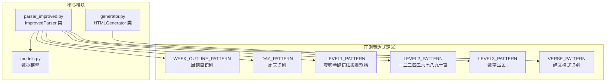
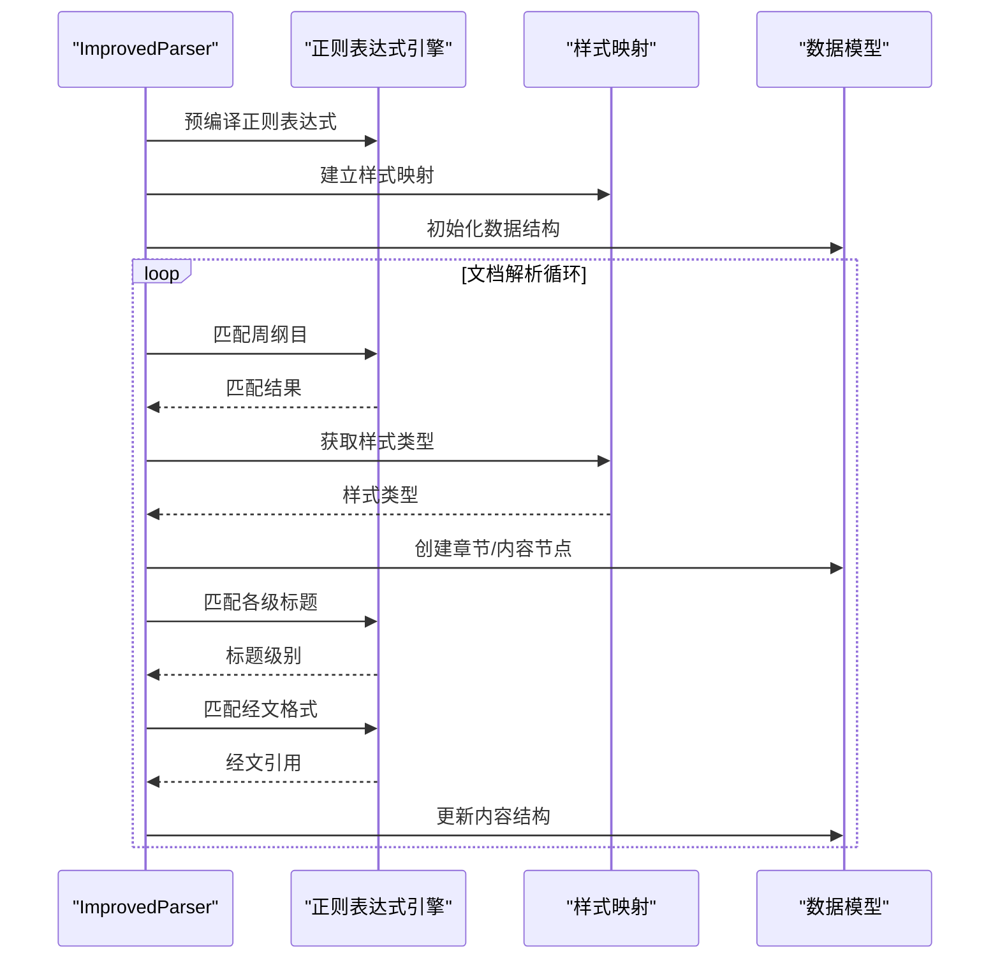
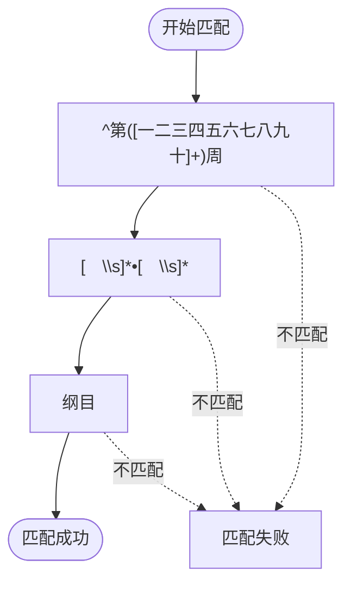
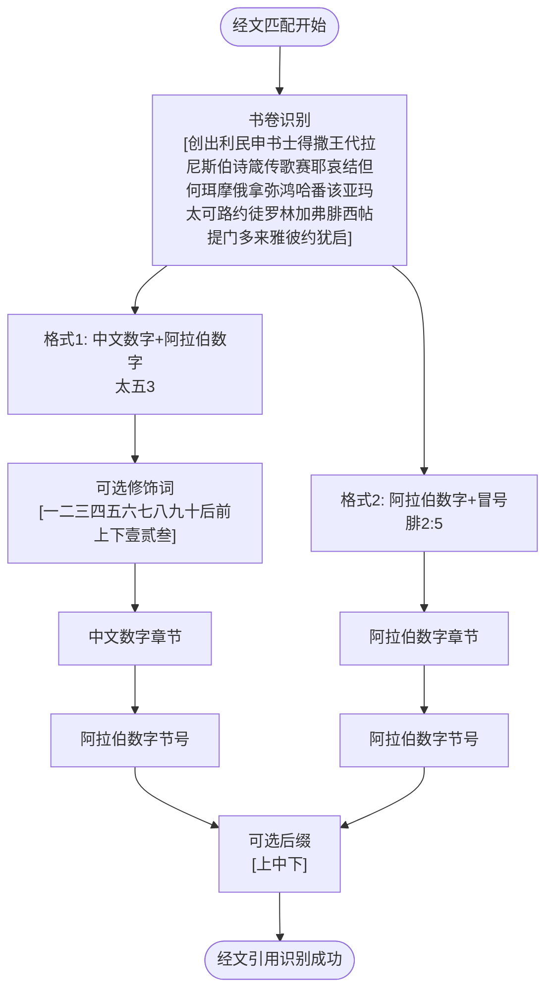
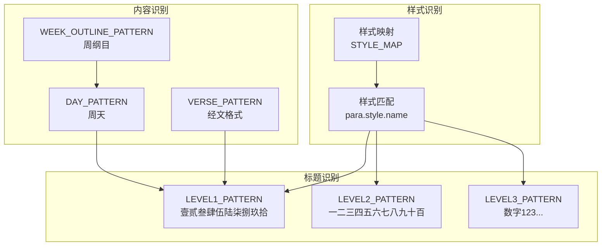

# 正则表达式识别

<cite>
**本文档引用的文件**
- [parser_improved.py](file://src/parser_improved.py)
- [generator.py](file://src/generator.py)
- [models.py](file://src/models.py)
</cite>

## 目录
1. [简介](#简介)
2. [项目结构](#项目结构)
3. [核心组件](#核心组件)
4. [架构概览](#架构概览)
5. [详细组件分析](#详细组件分析)
6. [依赖分析](#依赖分析)
7. [性能考虑](#性能考虑)
8. [故障排除指南](#故障排除指南)
9. [结论](#结论)

## 简介
本文档深入分析了该正则表达式识别系统的设计与实现，重点涵盖以下方面：
- 各种正则表达式模式的设计原理与应用场景
- WEEK_OUTLINE_PATTERN（第X周•纲目）、DAY_PATTERN（第X周•第X天）、LEVEL1_PATTERN到LEVEL5_PATTERN各级标题识别
- 经文格式识别正则表达式 VERSE_PATTERN 的复杂匹配逻辑
- 预编译正则表达式的性能优化策略与匹配优先级
- 具体的代码示例展示正则表达式在样式识别中的应用

## 项目结构
该系统主要位于 src 目录下，核心正则表达式集中在 ImprovedParser 类中，配合 generator.py 中的辅助正则表达式，以及 models.py 中的数据结构定义。



**图表来源**
- [parser_improved.py:137-145](file://src/parser_improved.py#L137-L145)
- [generator.py:208-212](file://src/generator.py#L208-L212)

**章节来源**
- [parser_improved.py:118-145](file://src/parser_improved.py#L118-L145)
- [generator.py:22-46](file://src/generator.py#L22-L46)
- [models.py:9-232](file://src/models.py#L9-L232)

## 核心组件
本系统的核心是 ImprovedParser 类，它包含了所有关键的正则表达式模式和相关的处理逻辑。这些模式按照功能分为几个类别：

### 预编译正则表达式集合
系统在类级别预编译了多个正则表达式，以提升性能和代码可读性：

- **WEEK_OUTLINE_PATTERN**: 识别周纲目标题
- **DAY_PATTERN**: 识别周天标记
- **LEVEL1_PATTERN**: 识别壹到拾的标题级别
- **LEVEL2_PATTERN**: 识别一二到九十百的标题级别
- **LEVEL3_PATTERN**: 识别数字级别的标题
- **VERSE_PATTERN**: 识别经文格式

### 经文引用解析常量
除了基本的正则表达式外，系统还定义了一系列专门用于经文引用解析的常量：

- **_BOOK_BASE_PAT**: 基础书卷名称模式
- **_BOOK_MOD_PAT**: 书卷修饰词模式
- **_CN_CHAP_PAT**: 中文章节模式
- **_FULL_REF_RE**: 全称引用模式
- **_REL_CHAP_RE**: 相对章引用模式
- **_WHOLE_CHAP_RE**: 整章引用模式
- **_REL_WHOLE_CHAP_RE**: 相对整章引用模式
- **_CONT_VERSE_RE**: 纯节续模式

**章节来源**
- [parser_improved.py:137-189](file://src/parser_improved.py#L137-L189)
- [parser_improved.py:191-275](file://src/parser_improved.py#L191-L275)

## 架构概览
系统采用分层架构设计，正则表达式作为识别层，配合样式映射和数据模型完成完整的文档解析。



**图表来源**
- [parser_improved.py:118-145](file://src/parser_improved.py#L118-L145)
- [parser_improved.py:367-782](file://src/parser_improved.py#L367-L782)

## 详细组件分析

### WEEK_OUTLINE_PATTERN（周纲目识别）
该模式专门用于识别训练文档中的周纲目标题，具有以下特征：

#### 设计原理
- 使用中文数字匹配第X周的周数
- 严格匹配"•"符号作为分隔符
- 支持可选的空白字符（全角空格和普通空格）

#### 匹配逻辑


**图表来源**
- [parser_improved.py:138](file://src/parser_improved.py#L138)

#### 应用场景
- 识别训练文档的周纲目开始标记
- 区分不同周次的纲目内容
- 为后续的周天识别提供上下文

**章节来源**
- [parser_improved.py:138](file://src/parser_improved.py#L138)

### DAY_PATTERN（周天识别）
该模式用于识别文档中的周天标记，支持周一到周日的完整识别。

#### 设计特点
- 匹配周数（支持中文数字）
- 严格匹配"•"分隔符
- 匹配周天标识（周一到周日）

#### 匹配优先级
系统在解析过程中对 DAY_PATTERN 的匹配具有较高优先级，因为它直接影响到后续内容的组织结构。

**章节来源**
- [parser_improved.py:139](file://src/parser_improved.py#L139)

### LEVEL1_PATTERN（壹贰叁肆伍陆柒捌玖拾级别）
这是最高等级的标题识别模式，使用特殊的中文数字字符。

#### 字符集设计
- 支持壹、贰、叁、肆、伍、陆、柒、捌、玖、拾
- 这些字符具有特殊的排版用途，用于标识最高级别的纲目

#### 匹配策略
- 使用严格的字符匹配确保准确性
- 支持可选的空白字符分隔
- 与后续级别的模式形成清晰的层次结构

**章节来源**
- [parser_improved.py:140](file://src/parser_improved.py#L140)

### LEVEL2_PATTERN（一二三四五六七八九十百级别）
中等级别的标题识别，支持从一到百的中文数字。

#### 数字范围
- 从一到十的简单数字
- 百位数字的组合（如二十、三十等）
- 复杂数字的组合（如二十一、一百等）

#### 识别逻辑
- 与 LEVEL1_PATTERN 形成层级关系
- 用于标识中等重要性的纲目内容
- 支持复杂的数字组合

**章节来源**
- [parser_improved.py:141](file://src/parser_improved.py#L141)

### LEVEL3_PATTERN（数字级别）
最低级别的标题识别，使用阿拉伯数字。

#### 设计考虑
- 数字级别的标题通常表示最小的纲目单元
- 与罗马数字和字母数字形成完整的层级体系
- 支持从1到多位数字的识别

**章节来源**
- [parser_improved.py:142](file://src/parser_improved.py#L142)

### VERSE_PATTERN（经文格式识别）
这是系统中最复杂的正则表达式，用于识别各种格式的经文引用。

#### 复杂匹配逻辑


**图表来源**
- [parser_improved.py:144-145](file://src/parser_improved.py#L144-L145)

#### 支持的格式
1. **中文数字格式**: 太五3、约壹一六等
2. **阿拉伯数字格式**: 腓2:5、约壹一6等
3. **可选修饰词**: 支持前后上下等修饰
4. **可选后缀**: 支持上中下等节号后缀

#### 生成器中的镜像实现
HTMLGenerator 类中也定义了相同的经文识别模式，确保两个模块的一致性。

**章节来源**
- [parser_improved.py:144-145](file://src/parser_improved.py#L144-L145)
- [generator.py:208-212](file://src/generator.py#L208-L212)

### 经文引用解析常量
系统还定义了一系列专门用于经文引用解析的常量，支持更复杂的引用格式：

#### 书籍名称模式
- **_BOOK_BASE_PAT**: 基础66卷书名
- **_BOOK_MOD_PAT**: 书卷修饰词（后、前、上、下、壹、贰、叁）

#### 中文章节模式
- **_CN_CHAP_PAT**: 支持从一到一百五十的完整中文数字范围
- 包含特殊处理：一百五十、一百零几、二十几等

#### 引用类型
- **_FULL_REF_RE**: 完整引用（书卷+中文章+阿拉伯节）
- **_REL_CHAP_RE**: 相对章引用（仅中文章+阿拉伯节）
- **_WHOLE_CHAP_RE**: 整章引用（书卷+中文章，无节号）
- **_REL_WHOLE_CHAP_RE**: 相对整章引用（仅中文章，无节号）
- **_CONT_VERSE_RE**: 纯节续（同章内节号范围）

**章节来源**
- [parser_improved.py:148-189](file://src/parser_improved.py#L148-L189)

## 依赖分析
系统中的正则表达式相互依赖，形成了完整的识别体系。



**图表来源**
- [parser_improved.py:118-145](file://src/parser_improved.py#L118-L145)
- [parser_improved.py:542-735](file://src/parser_improved.py#L542-L735)

### 样式映射机制
系统通过 STYLE_MAP 将 Word 文档的样式名称映射到内部的结构化标签：

- **chapter_title**: 章节标题
- **section_level1**: 一级纲目标题
- **section_level2**: 二级纲目标题
- **section_level3**: 三级纲目标题
- **section_level4**: 四级纲目标题
- **content**: 正文内容

这种映射机制确保了系统能够正确识别不同格式的文档结构。

**章节来源**
- [parser_improved.py:118-135](file://src/parser_improved.py#L118-L135)
- [parser_improved.py:542-735](file://src/parser_improved.py#L542-L735)

## 性能考虑
系统采用了多项性能优化策略来确保正则表达式的高效执行：

### 预编译优化
所有正则表达式都在类初始化时预编译，避免重复编译开销：

```python
# 预编译正则表达式
WEEK_OUTLINE_PATTERN = re.compile(r'^第([一二三四五六七八九十]+)周[　\s]*•[　\s]*纲目')
DAY_PATTERN = re.compile(r'^第([一二三四五六七八九十]+)周[　\s]*•[　\s]*周([一二三四五六七])')
LEVEL1_PATTERN = re.compile(r'^([壹贰叁肆伍陆柒捌玖拾])[　\s]+(.*)')
LEVEL2_PATTERN = re.compile(r'^([一二三四五六七八九十百]+)[　\s]+(.*)')
LEVEL3_PATTERN = re.compile(r'^(\d+)[　\s]+(.*)')
VERSE_PATTERN = re.compile(r'^([创出利民申书士得撒王代拉尼斯伯诗箴传歌赛耶哀结但何珥摩俄拿弥鸿哈番该亚玛太可路约徒罗林加弗腓西帖提门多来雅彼约犹启](?:[一二三四五六七八九十后前上下壹贰叁]\d+|\d+):\d+[上中下]?)[　\s\t]+(.+)')
```

### 匹配优先级策略
系统在解析过程中采用了明确的匹配优先级：

1. **样式识别**: 首先检查 Word 样式
2. **周纲目识别**: 识别周纲目开始标记
3. **周天识别**: 识别周天标记
4. **各级标题识别**: 按级别顺序识别
5. **经文识别**: 最后识别经文格式

### 缓存机制
系统实现了多层次的缓存机制：

- **verse_cache**: 缓存已识别的经文范围
- **bible_dict**: 持久化经文字典
- **类级缓存**: HTMLGenerator 中的类级缓存

**章节来源**
- [parser_improved.py:277-294](file://src/parser_improved.py#L277-L294)
- [generator.py:250-281](file://src/generator.py#L250-L281)

## 故障排除指南

### 常见问题诊断
1. **样式识别失败**: 检查 STYLE_MAP 中的样式名称是否与实际文档匹配
2. **标题识别异常**: 验证各级标题模式的字符集是否完整
3. **经文识别错误**: 确认 VERSE_PATTERN 的字符集覆盖所有可能的书卷名称

### 调试技巧
- 使用 `_is_verse_line()` 方法测试经文识别
- 通过 `match()` 方法的返回值检查匹配结果
- 利用捕获组验证分组是否正确

### 性能监控
- 监控正则表达式匹配次数
- 检查缓存命中率
- 评估内存使用情况

**章节来源**
- [parser_improved.py:300-307](file://src/parser_improved.py#L300-L307)
- [parser_improved.py:343-349](file://src/parser_improved.py#L343-L349)

## 结论
该正则表达式识别系统通过精心设计的模式集合和优化的执行策略，实现了对训练文档的准确识别和结构化处理。系统的主要优势包括：

1. **完整的模式覆盖**: 从周纲目到各级标题，再到经文格式的全面识别
2. **性能优化**: 预编译和缓存机制确保高效的执行性能
3. **一致性保证**: 生成器和解析器使用相同的正则表达式模式
4. **可维护性**: 清晰的代码结构和注释便于理解和修改

通过合理使用这些正则表达式模式，系统能够准确识别和处理各种格式的训练文档，为后续的内容处理和展示提供了坚实的基础。