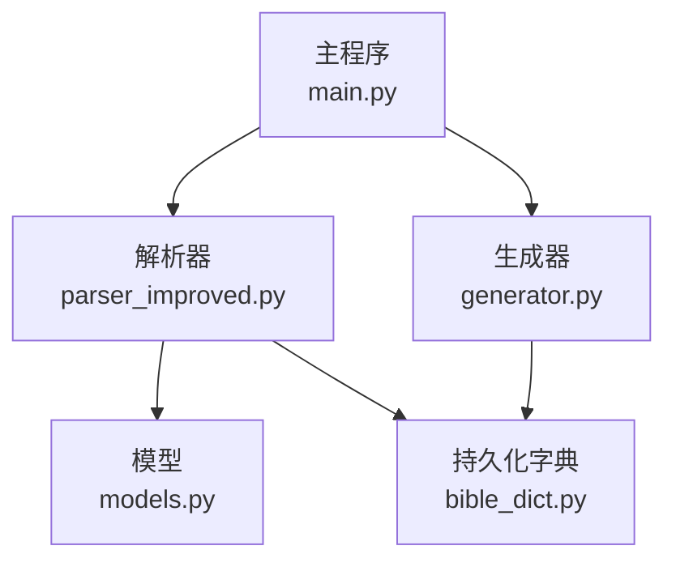
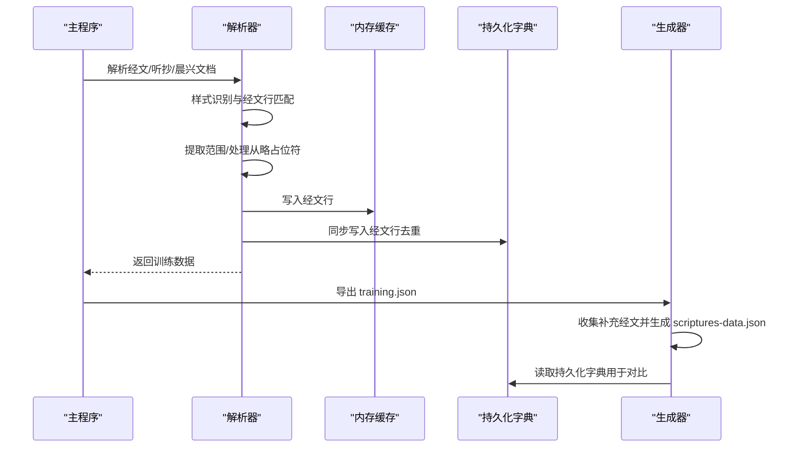
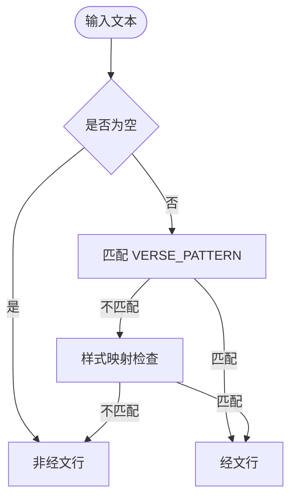
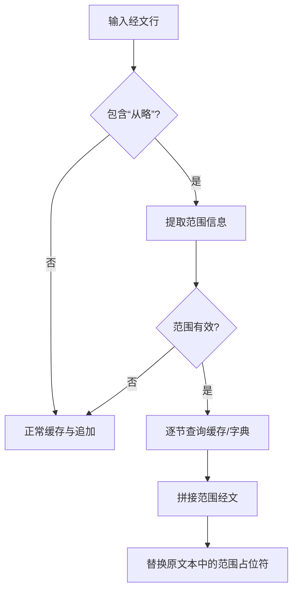
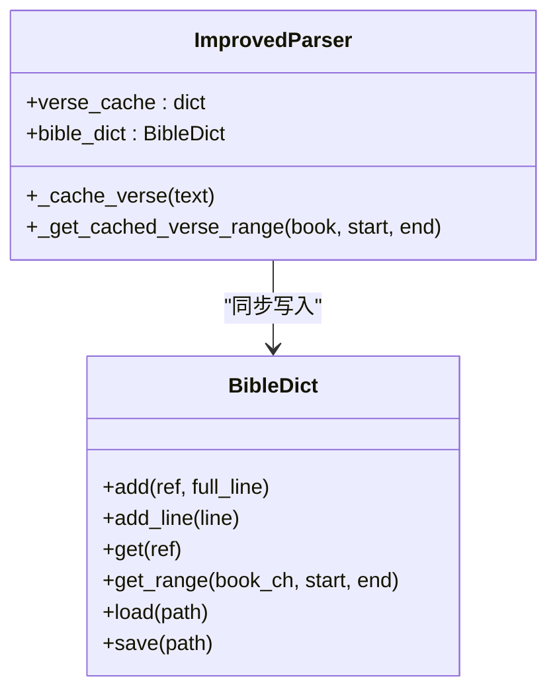
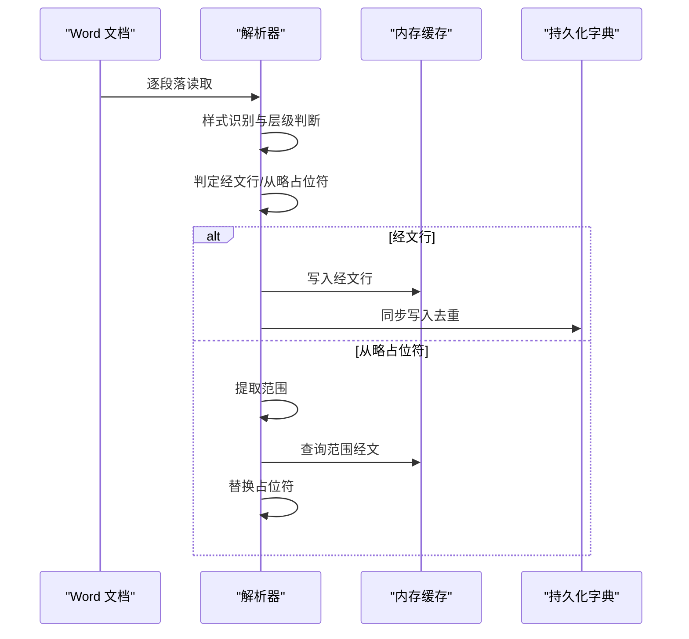

# 经文处理与缓存

<cite>
**本文档引用的文件**
- [src/parser_improved.py](file://src/parser_improved.py)
- [src/bible_dict.py](file://src/bible_dict.py)
- [src/models.py](file://src/models.py)
- [src/generator.py](file://src/generator.py)
- [main.py](file://main.py)
</cite>

## 目录
1. [简介](#简介)
2. [项目结构](#项目结构)
3. [核心组件](#核心组件)
4. [架构概览](#架构概览)
5. [详细组件分析](#详细组件分析)
6. [依赖分析](#依赖分析)
7. [性能考虑](#性能考虑)
8. [故障排除指南](#故障排除指南)
9. [结论](#结论)

## 简介
本技术文档聚焦于经文处理与缓存功能，深入解析经文识别算法、缓存机制设计与数据流处理。文档涵盖从样式识别到内容缓存的完整流程，包括从略占位符处理、经文范围合并、持久化字典同步等关键环节。同时提供性能优化策略、缓存失效处理与错误恢复机制，帮助开发者高效维护与扩展系统。

## 项目结构
经文处理与缓存功能主要分布在以下模块：
- 解析器模块：负责从 Word 文档中识别经文、解析引用范围、缓存与持久化
- 模型模块：定义章节、内容节点与训练数据的数据结构
- 生成器模块：负责将训练数据导出为 JSON，并生成补充经文数据
- 主程序：协调文档解析、缓存持久化与最终产物生成

图表来源
- [main.py:489-500](file://main.py#L489-L500)
- [src/parser_improved.py:277-284](file://src/parser_improved.py#L277-L284)
- [src/generator.py:383-425](file://src/generator.py#L383-L425)

章节来源
- [main.py:410-536](file://main.py#L410-L536)
- [src/parser_improved.py:115-284](file://src/parser_improved.py#L115-L284)
- [src/models.py:9-232](file://src/models.py#L9-L232)
- [src/generator.py:22-425](file://src/generator.py#L22-L425)

## 核心组件
- 改进解析器（ImprovedParser）：负责样式识别、经文行匹配、范围提取、缓存与持久化同步
- 持久化经文字典（BibleDict）：提供经文的增删查与 JSON 持久化能力
- 数据模型（models.py）：定义章节、内容节点与训练数据结构
- HTML 生成器（generator.py）：导出 training.json 并生成补充经文数据

章节来源
- [src/parser_improved.py:115-284](file://src/parser_improved.py#L115-L284)
- [src/bible_dict.py:19-96](file://src/bible_dict.py#L19-L96)
- [src/models.py:9-232](file://src/models.py#L9-L232)
- [src/generator.py:22-425](file://src/generator.py#L22-L425)

## 架构概览
经文处理与缓存的整体流程如下：
- 输入 Word 文档（经文/听抄/晨兴），解析器识别样式与经文行
- 对于“从略”占位符，解析器提取范围并在缓存中查找对应经文进行替换
- 正常经文行被缓存到内存字典，并同步写入持久化字典
- 解析完成后，生成器导出 training.json，并生成补充经文数据

图表来源
- [src/parser_improved.py:338-350](file://src/parser_improved.py#L338-L350)
- [src/parser_improved.py:546-568](file://src/parser_improved.py#L546-L568)
- [src/parser_improved.py:737-760](file://src/parser_improved.py#L737-L760)
- [src/generator.py:383-425](file://src/generator.py#L383-L425)

## 详细组件分析

### 经文识别算法与 VERSE_PATTERN
- VERSE_PATTERN：用于识别“书卷+章节+经文”的经文行格式，支持中文数字与阿拉伯数字混合
- 样式识别：通过 STYLE_MAP 将 Word 样式映射为内部标识，结合正则进一步确认
- 经文行判定：_is_verse_line 使用 VERSE_PATTERN 判断是否为经文行

图表来源
- [src/parser_improved.py:137-146](file://src/parser_improved.py#L137-L146)
- [src/parser_improved.py:118-135](file://src/parser_improved.py#L118-L135)
- [src/parser_improved.py:300-307](file://src/parser_improved.py#L300-L307)

章节来源
- [src/parser_improved.py:118-146](file://src/parser_improved.py#L118-L146)
- [src/parser_improved.py:300-307](file://src/parser_improved.py#L300-L307)

### 经文范围提取与从略占位符处理
- 范围提取：_extract_verse_range 从“从略”经文行中提取书卷、起止节与是否省略标记
- 范围键生成：_get_verse_range_key 生成范围键（如“腓2:5~11”）
- 缓存获取：_get_cached_verse_range 逐节查询缓存或持久化字典，拼接范围内容
- 从略处理：当经文行包含“从略”，解析范围后从缓存/字典获取对应经文并替换

图表来源
- [src/parser_improved.py:309-332](file://src/parser_improved.py#L309-L332)
- [src/parser_improved.py:334-336](file://src/parser_improved.py#L334-L336)
- [src/parser_improved.py:351-365](file://src/parser_improved.py#L351-L365)
- [src/parser_improved.py:548-560](file://src/parser_improved.py#L548-L560)
- [src/parser_improved.py:739-751](file://src/parser_improved.py#L739-L751)

章节来源
- [src/parser_improved.py:309-365](file://src/parser_improved.py#L309-L365)
- [src/parser_improved.py:548-560](file://src/parser_improved.py#L548-L560)
- [src/parser_improved.py:739-751](file://src/parser_improved.py#L739-L751)

### 缓存机制设计
- 内存缓存：verse_cache 以“书卷+章节”为键缓存经文行，提升范围查询效率
- 持久化字典：BibleDict 提供 add/get/load/save 接口，支持增量加载与去重写入
- 同步策略：_cache_verse 在写入内存缓存的同时同步写入持久化字典，避免重复覆盖

图表来源
- [src/parser_improved.py:285-293](file://src/parser_improved.py#L285-L293)
- [src/parser_improved.py:338-350](file://src/parser_improved.py#L338-L350)
- [src/parser_improved.py:351-365](file://src/parser_improved.py#L351-L365)
- [src/bible_dict.py:19-96](file://src/bible_dict.py#L19-L96)

章节来源
- [src/parser_improved.py:285-365](file://src/parser_improved.py#L285-L365)
- [src/bible_dict.py:19-96](file://src/bible_dict.py#L19-L96)

### 经文处理完整流程（从样式识别到内容缓存）
- 样式识别：通过 STYLE_MAP 与正则识别章节标题、纲目层级与经文行
- 经文行处理：对经文行进行缓存与追加；对“从略”进行范围解析与替换
- 范围合并：_get_cached_verse_range 逐节查询并拼接范围内容
- 持久化同步：_cache_verse 同步写入持久化字典，避免重复覆盖

图表来源
- [src/parser_improved.py:537-782](file://src/parser_improved.py#L537-L782)
- [src/parser_improved.py:784-945](file://src/parser_improved.py#L784-L945)
- [src/parser_improved.py:338-365](file://src/parser_improved.py#L338-L365)

章节来源
- [src/parser_improved.py:537-945](file://src/parser_improved.py#L537-L945)

### 具体经文格式处理示例
- 腓2:5：单节经文，直接缓存并追加
- 太5:3~11：范围经文，逐节查询缓存/字典并拼接
- “从略”占位符：解析范围后替换为缓存/字典中的对应经文

章节来源
- [src/parser_improved.py:309-332](file://src/parser_improved.py#L309-L332)
- [src/parser_improved.py:351-365](file://src/parser_improved.py#L351-L365)
- [src/parser_improved.py:548-560](file://src/parser_improved.py#L548-L560)

## 依赖分析
- 解析器依赖模型与持久化字典，生成器依赖解析器与持久化字典
- 主程序协调解析器与生成器，确保缓存与持久化的正确性

图表来源
- [src/parser_improved.py:12-13](file://src/parser_improved.py#L12-L13)
- [src/generator.py:10-11](file://src/generator.py#L10-L11)
- [main.py:14-16](file://main.py#L14-L16)

章节来源
- [src/parser_improved.py:12-13](file://src/parser_improved.py#L12-L13)
- [src/generator.py:10-11](file://src/generator.py#L10-L11)
- [main.py:14-16](file://main.py#L14-L16)

## 性能考虑
- 缓存策略：内存缓存（verse_cache）显著降低范围查询成本，建议合理控制缓存大小
- 去重写入：持久化字典在写入时避免覆盖已有条目，减少重复处理
- 正则预编译：解析器中大量使用预编译正则，提高匹配效率
- 生成阶段过滤：生成器在导出补充经文时过滤已在全本圣经中的条目，减少冗余

## 故障排除指南
- LibreOffice 转换失败：解析器在转换 .doc 时若失败会抛出异常并提供替代方案
- 缓存未命中：当内存缓存未命中时，解析器会回退到持久化字典读取
- 生成器异常：生成器在生成 scriptures-data.json 时捕获异常并输出警告，不影响整体流程

章节来源
- [src/parser_improved.py:38-112](file://src/parser_improved.py#L38-L112)
- [src/parser_improved.py:351-365](file://src/parser_improved.py#L351-L365)
- [src/generator.py:420-424](file://src/generator.py#L420-L424)

## 结论
经文处理与缓存系统通过样式识别、范围提取与双层缓存（内存+持久化）实现了高效稳定的经文解析与复用。配合生成器的补充经文过滤与导出，系统能够持续积累经文数据并优化用户体验。建议在生产环境中关注缓存容量与持久化字典的增量加载策略，确保长期稳定运行。