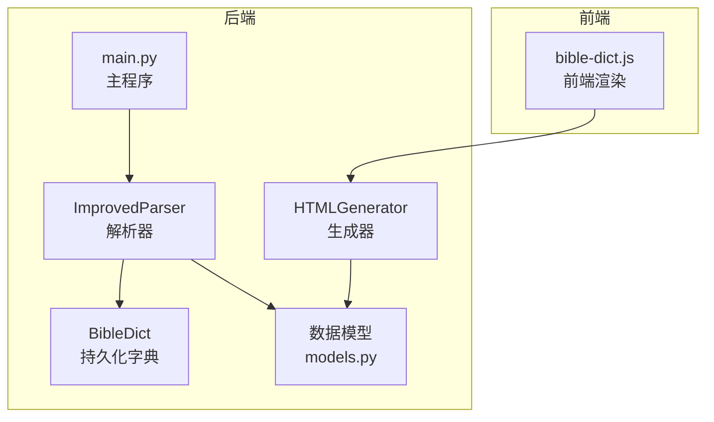
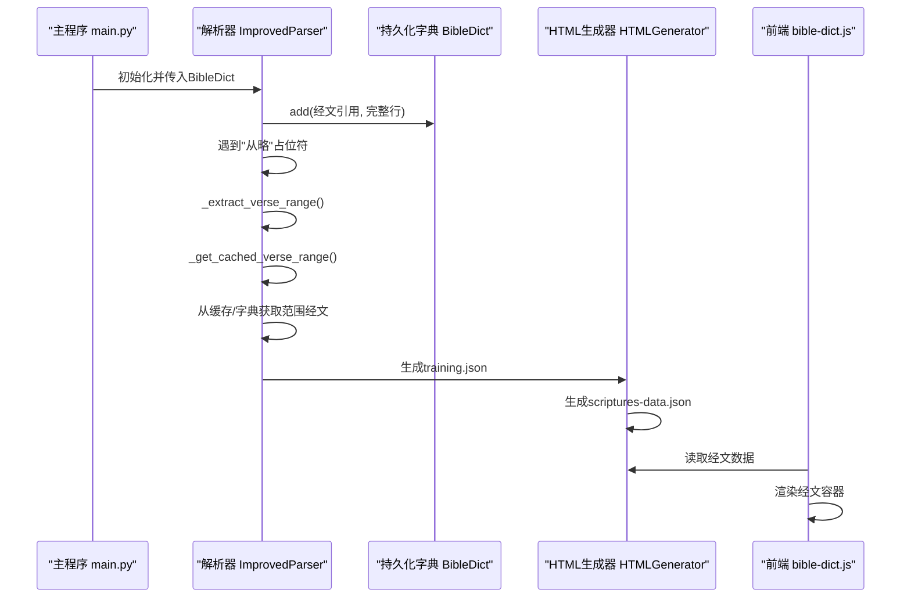
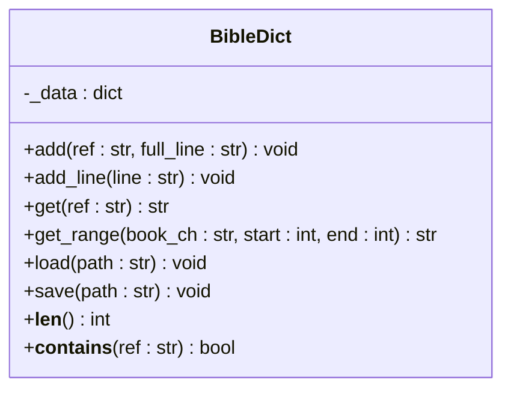
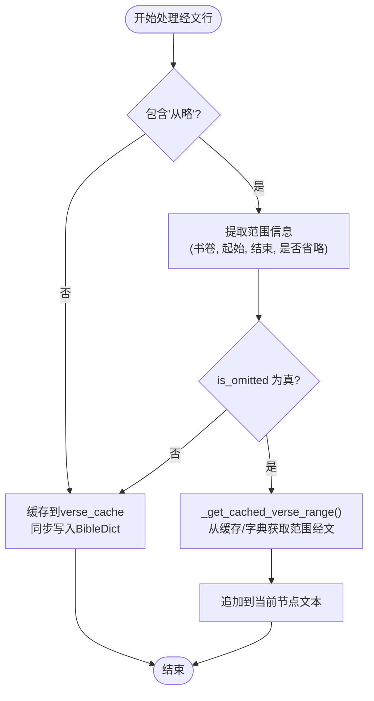
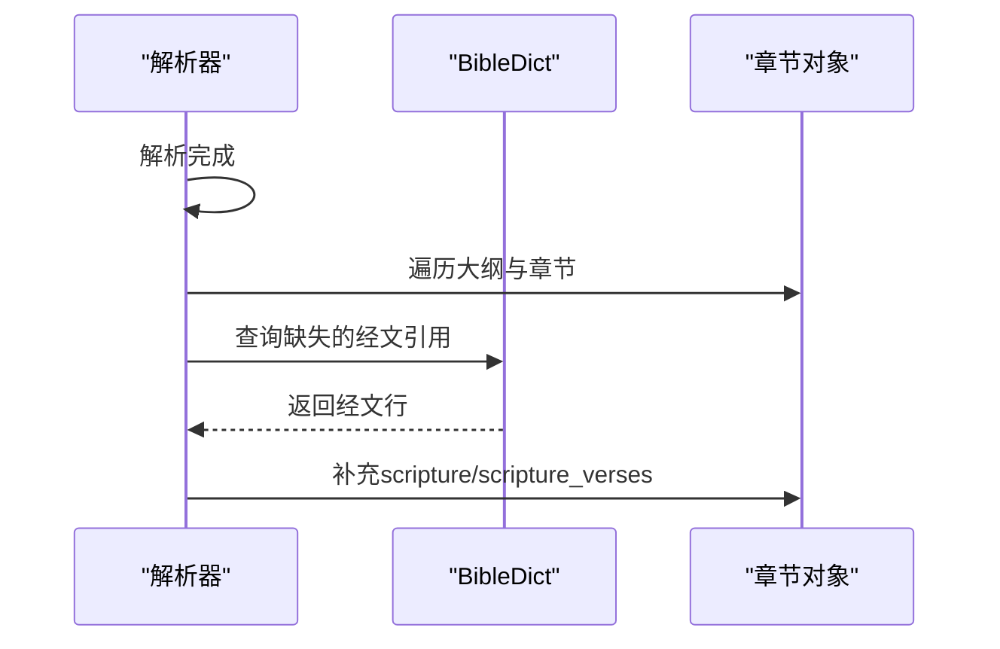
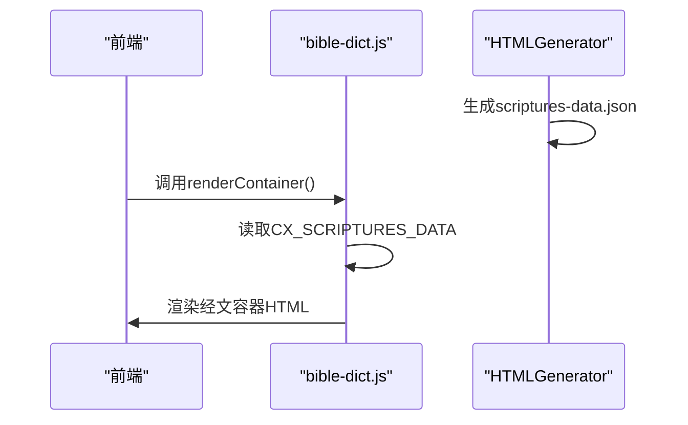
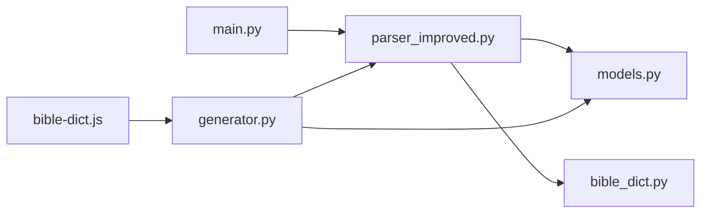

# 经文字典集成

<cite>
**本文档引用的文件**
- [bible_dict.py](file://src/bible_dict.py)
- [parser_improved.py](file://src/parser_improved.py)
- [models.py](file://src/models.py)
- [main.py](file://main.py)
- [generator.py](file://src/generator.py)
- [bible-dict.js](file://src/static/js/bible-dict.js)
</cite>

## 目录
1. [简介](#简介)
2. [项目结构](#项目结构)
3. [核心组件](#核心组件)
4. [架构概览](#架构概览)
5. [详细组件分析](#详细组件分析)
6. [依赖分析](#依赖分析)
7. [性能考虑](#性能考虑)
8. [故障排除指南](#故障排除指南)
9. [结论](#结论)

## 简介
本文档深入解析经文字典集成功能，重点阐述BibleDict与解析器的集成机制，包括：
- 持久化字典的初始化与增量累积策略
- 数据同步与一致性保障
- 冲突处理与错误恢复
- "从略"占位符的处理流程与跨章节还原机制
- 缓存与持久化字典的协同工作方式
- 数据完整性、并发访问控制与错误恢复机制

## 项目结构
该项目采用Python后端解析与前端JavaScript渲染相结合的架构。核心文件分布如下：
- 后端解析与数据处理：src/parser_improved.py、src/bible_dict.py、src/models.py、src/generator.py
- 主程序入口与批处理：main.py
- 前端经文渲染：src/static/js/bible-dict.js

**图表来源**
- [main.py:988-1070](file://main.py#L988-L1070)
- [parser_improved.py:276-284](file://src/parser_improved.py#L276-L284)
- [bible_dict.py:19-96](file://src/bible_dict.py#L19-L96)
- [models.py:9-232](file://src/models.py#L9-L232)
- [generator.py:22-116](file://src/generator.py#L22-L116)
- [bible-dict.js:1-64](file://src/static/js/bible-dict.js#L1-L64)

**章节来源**
- [main.py:988-1070](file://main.py#L988-L1070)
- [parser_improved.py:276-284](file://src/parser_improved.py#L276-L284)
- [bible_dict.py:19-96](file://src/bible_dict.py#L19-L96)
- [models.py:9-232](file://src/models.py#L9-L232)
- [generator.py:22-116](file://src/generator.py#L22-L116)
- [bible-dict.js:1-64](file://src/static/js/bible-dict.js#L1-L64)

## 核心组件
- BibleDict：轻量级持久化经文字典，提供add、add_line、get、get_range、load、save等方法，支持增量加载与JSON持久化。
- ImprovedParser：改进的解析器，负责从Word文档中提取经文、处理"从略"占位符、维护缓存与持久化字典的同步。
- 数据模型：定义Chapter、Content、TrainingData等数据结构，支撑解析结果的组织与输出。
- HTMLGenerator：负责生成training.json与scriptures-data.json，实现经文数据的前后端衔接。
- 前端bible-dict.js：负责在浏览器端渲染经文容器，从全局数据源读取并展示经文。

**章节来源**
- [bible_dict.py:19-96](file://src/bible_dict.py#L19-L96)
- [parser_improved.py:115-284](file://src/parser_improved.py#L115-L284)
- [models.py:9-232](file://src/models.py#L9-L232)
- [generator.py:383-426](file://src/generator.py#L383-L426)
- [bible-dict.js:1-64](file://src/static/js/bible-dict.js#L1-L64)

## 架构概览
经文字典集成的核心流程：
1. 主程序初始化BibleDict实例，作为跨文档/训练的累积字典。
2. 解析器在处理经文文档时，将遇到的经文行缓存到内存字典，并同步写入BibleDict。
3. 当遇到"从略"占位符时，解析器从缓存或BibleDict中获取相应范围的经文进行还原。
4. 后处理阶段，解析器进一步从BibleDict补全大纲与章节中的经文。
5. HTMLGenerator生成training.json与scriptures-data.json，前端bible-dict.js负责渲染。

**图表来源**
- [main.py:988-1070](file://main.py#L988-L1070)
- [parser_improved.py:309-366](file://src/parser_improved.py#L309-L366)
- [parser_improved.py:546-751](file://src/parser_improved.py#L546-L751)
- [parser_improved.py:2471-2512](file://src/parser_improved.py#L2471-L2512)
- [generator.py:383-426](file://src/generator.py#L383-L426)
- [bible-dict.js:38-57](file://src/static/js/bible-dict.js#L38-L57)

## 详细组件分析

### 组件A：BibleDict持久化字典
BibleDict提供轻量级的内存字典与JSON持久化能力：
- add/ref添加：仅在引用不存在时写入，避免覆盖。
- add_line：从完整经文行中提取引用并存储。
- get/get_range：按引用或范围检索经文。
- load/save：增量加载与JSON持久化，按键排序写入。

**图表来源**
- [bible_dict.py:19-96](file://src/bible_dict.py#L19-L96)

**章节来源**
- [bible_dict.py:19-96](file://src/bible_dict.py#L19-L96)

### 组件B：解析器与"从略"占位符处理
解析器在处理经文行时，识别"从略"占位符并执行跨范围还原：
- _is_verse_line：识别经文行格式。
- _extract_verse_range：提取范围与"从略"标记。
- _get_cached_verse_range：优先从缓存获取，未命中则从BibleDict查询。
- parse_outline_doc/parse_listen_doc：在两个文档中均处理"从略"占位符。

**图表来源**
- [parser_improved.py:309-366](file://src/parser_improved.py#L309-L366)
- [parser_improved.py:546-751](file://src/parser_improved.py#L546-L751)

**章节来源**
- [parser_improved.py:309-366](file://src/parser_improved.py#L309-L366)
- [parser_improved.py:546-751](file://src/parser_improved.py#L546-L751)

### 组件C：后处理与数据补全
解析器在文档解析完成后，执行后处理以确保数据完整性：
- _fill_empty_section_scriptures：对大纲节点标题中的内联引用进行补全。
- _supplement_chapter_scripture_verses：根据声明范围补全章节经文。

**图表来源**
- [parser_improved.py:2471-2512](file://src/parser_improved.py#L2471-L2512)

**章节来源**
- [parser_improved.py:2471-2512](file://src/parser_improved.py#L2471-L2512)

### 组件D：前端渲染与数据源
前端bible-dict.js负责渲染经文容器，数据来源于全局的CX_SCRIPTURES_DATA：
- getDict：获取经文字典。
- renderContainer：根据data-refs属性渲染经文。
- 降级处理：字典中找不到时显示引用本身。

**图表来源**
- [bible-dict.js:17-57](file://src/static/js/bible-dict.js#L17-L57)
- [generator.py:334-373](file://src/generator.py#L334-L373)

**章节来源**
- [bible-dict.js:17-57](file://src/static/js/bible-dict.js#L17-L57)
- [generator.py:334-373](file://src/generator.py#L334-L373)

## 依赖分析
- main.py依赖BibleDict，在批处理过程中将其传递给解析器，实现跨文档累积。
- ImprovedParser依赖BibleDict进行缓存与持久化的双向同步。
- HTMLGenerator依赖解析器生成的数据，生成training.json与scriptures-data.json。
- 前端bible-dict.js依赖HTMLGenerator生成的scriptures-data.json进行渲染。

**图表来源**
- [main.py:15-16](file://main.py#L15-L16)
- [parser_improved.py:12-13](file://src/parser_improved.py#L12-L13)
- [generator.py:5-11](file://src/generator.py#L5-L11)
- [bible-dict.js:1-9](file://src/static/js/bible-dict.js#L1-L9)

**章节来源**
- [main.py:15-16](file://main.py#L15-L16)
- [parser_improved.py:12-13](file://src/parser_improved.py#L12-L13)
- [generator.py:5-11](file://src/generator.py#L5-L11)
- [bible-dict.js:1-9](file://src/static/js/bible-dict.js#L1-L9)

## 性能考虑
- 内存缓存vs持久化：解析器优先使用内存缓存（verse_cache）提升实时还原效率，同时通过BibleDict实现跨文档/训练的增量累积。
- 增量加载：BibleDict.load支持增量加载，避免重复覆盖，降低I/O开销。
- JSON序列化优化：HTMLGenerator生成的scriptures-data.json采用紧凑格式，减少传输与解析成本。
- 前端懒渲染：bible-dict.js按需渲染，避免一次性处理大量DOM节点。

## 故障排除指南
- "从略"占位符未还原
  - 检查是否正确识别范围信息（_extract_verse_range）。
  - 确认缓存与BibleDict中是否存在对应引用。
  - 参考路径：[parser_improved.py:309-366](file://src/parser_improved.py#L309-L366)、[parser_improved.py:546-751](file://src/parser_improved.py#L546-L751)

- 经文范围缺失
  - 检查后处理逻辑是否执行（_fill_empty_section_scriptures/_supplement_chapter_scripture_verses）。
  - 参考路径：[parser_improved.py:2471-2512](file://src/parser_improved.py#L2471-L2512)

- 前端渲染异常
  - 确认scriptures-data.json生成成功且数据完整。
  - 检查bible-dict.js是否正确读取CX_SCRIPTURES_DATA。
  - 参考路径：[generator.py:334-373](file://src/generator.py#L334-L373)、[bible-dict.js:17-57](file://src/static/js/bible-dict.js#L17-L57)

- 数据一致性问题
  - 确保add方法仅在引用不存在时写入（避免覆盖）。
  - 参考路径：[bible_dict.py:33-36](file://src/bible_dict.py#L33-L36)

## 结论
经文字典集成功能通过BibleDict与解析器的紧密协作，实现了：
- 跨文档/训练的经文累积与复用
- "从略"占位符的智能还原与范围补全
- 缓存与持久化的双重保障与一致性维护
- 前后端数据链路的清晰分离与高效渲染

该设计在保证数据完整性的同时，兼顾了性能与可维护性，为大规模经文数据的处理提供了可靠的技术支撑。