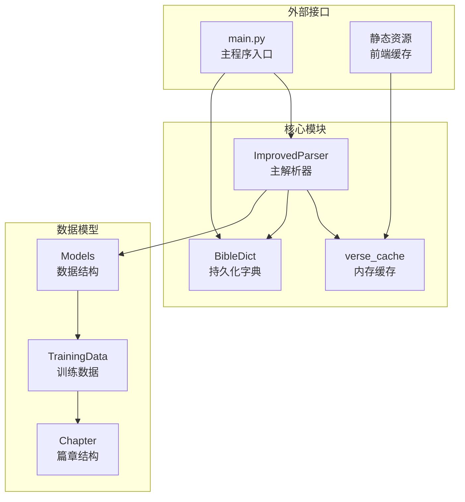
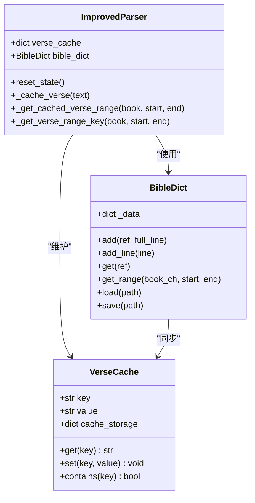
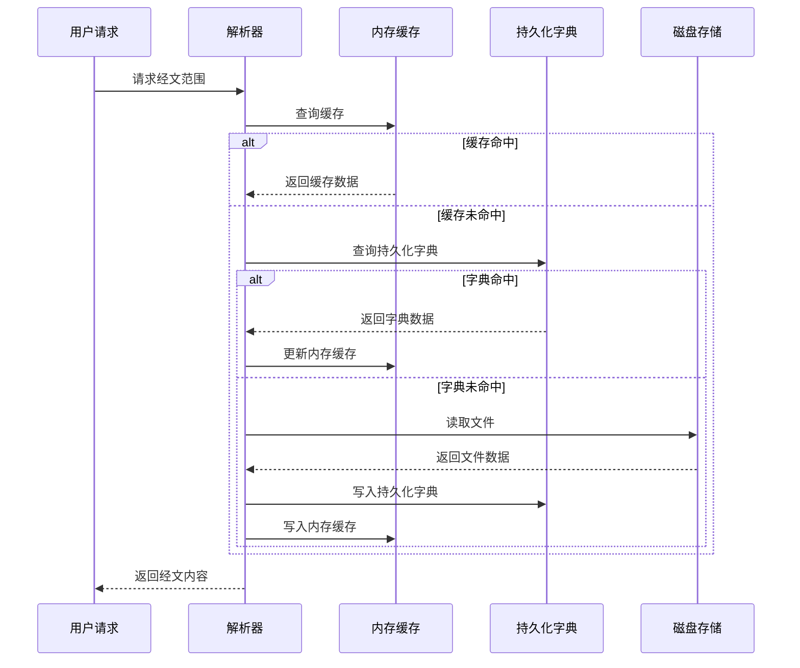
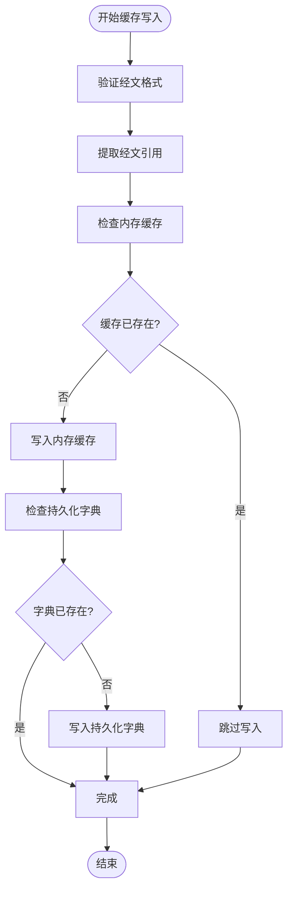
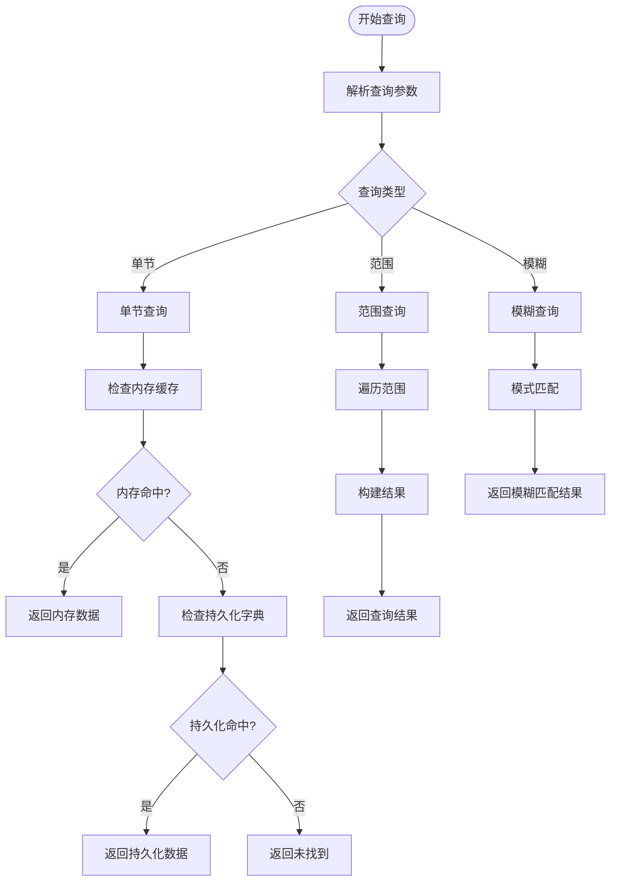
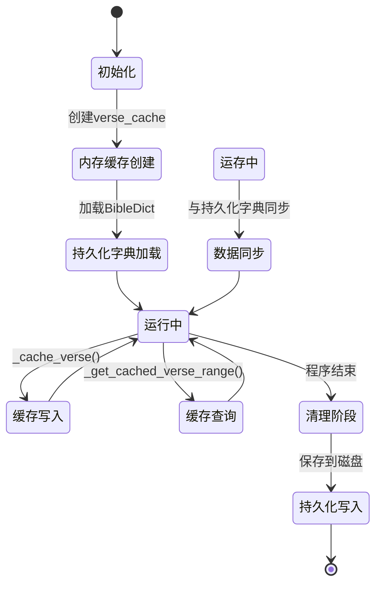
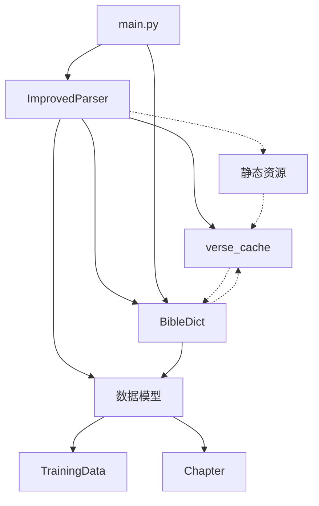

# 经文缓存机制

<cite>
**本文档引用的文件**
- [src/parser_improved.py](file://src/parser_improved.py)
- [src/bible_dict.py](file://src/bible_dict.py)
- [src/models.py](file://src/models.py)
- [main.py](file://main.py)
</cite>

## 目录
1. [简介](#简介)
2. [项目结构](#项目结构)
3. [核心组件](#核心组件)
4. [架构概览](#架构概览)
5. [详细组件分析](#详细组件分析)
6. [依赖分析](#依赖分析)
7. [性能考虑](#性能考虑)
8. [故障排除指南](#故障排除指南)
9. [结论](#结论)

## 简介

本文档深入分析了经文缓存机制的设计原理和实现细节。该系统采用双重缓存策略，结合内存缓存和持久化字典，实现了高效的经文检索和管理功能。

经文缓存机制的核心设计包括：
- **verse_cache字典**：内存中的实时缓存，存储已解析的经文内容
- **BibleDict持久化字典**：磁盘持久化的经文存储，支持跨文档累积
- **智能查询算法**：支持单节和范围查询的高效检索
- **生命周期管理**：完整的缓存创建、更新、清理流程

## 项目结构

该项目采用模块化设计，主要包含以下核心模块：

**图表来源**
- [src/parser_improved.py:277-293](file://src/parser_improved.py#L277-L293)
- [src/bible_dict.py:19-28](file://src/bible_dict.py#L19-L28)
- [src/models.py:9-232](file://src/models.py#L9-L232)

**章节来源**
- [src/parser_improved.py:115-146](file://src/parser_improved.py#L115-L146)
- [src/bible_dict.py:1-96](file://src/bible_dict.py#L1-L96)
- [src/models.py:1-232](file://src/models.py#L1-L232)

## 核心组件

### verse_cache字典设计

verse_cache是经文缓存机制的核心数据结构，采用Python字典实现：

**图表来源**
- [src/parser_improved.py:292-365](file://src/parser_improved.py#L292-L365)
- [src/bible_dict.py:26-96](file://src/bible_dict.py#L26-L96)

### 缓存键生成策略

系统采用统一的键生成策略，确保缓存键的一致性和可预测性：

| 键类型 | 格式 | 示例 | 用途 |
|--------|------|------|------|
| 单节键 | `{book}:{verse}` | `腓2:5` | 单节经文缓存 |
| 范围键 | `{book}:{start}~{end}` | `腓2:5~11` | 经文范围缓存 |
| 范围键（持久化） | `{book_ch}:{verse_num}` | `腓2:5` | 持久化字典键 |

**章节来源**
- [src/parser_improved.py:334-336](file://src/parser_improved.py#L334-L336)
- [src/parser_improved.py:351-365](file://src/parser_improved.py#L351-L365)

## 架构概览

经文缓存系统的整体架构采用分层设计，实现了清晰的职责分离：

**图表来源**
- [src/parser_improved.py:547-560](file://src/parser_improved.py#L547-L560)
- [src/parser_improved.py:738-751](file://src/parser_improved.py#L738-L751)

## 详细组件分析

### 缓存写入机制

缓存写入过程采用双写策略，确保数据的一致性和可靠性：

**图表来源**
- [src/parser_improved.py:338-349](file://src/parser_improved.py#L338-L349)

**章节来源**
- [src/parser_improved.py:338-349](file://src/parser_improved.py#L338-L349)

### 缓存查询算法

查询算法支持多种查询模式，包括单节查询、范围查询和模糊查询：

**图表来源**
- [src/parser_improved.py:351-365](file://src/parser_improved.py#L351-L365)
- [src/bible_dict.py:52-59](file://src/bible_dict.py#L52-L59)

**章节来源**
- [src/parser_improved.py:351-365](file://src/parser_improved.py#L351-L365)
- [src/bible_dict.py:48-59](file://src/bible_dict.py#L48-L59)

### 生命周期管理

系统实现了完整的缓存生命周期管理，包括初始化、更新、清理等阶段：

**图表来源**
- [src/parser_improved.py:285-293](file://src/parser_improved.py#L285-L293)
- [src/bible_dict.py:65-85](file://src/bible_dict.py#L65-L85)

**章节来源**
- [src/parser_improved.py:285-293](file://src/parser_improved.py#L285-L293)
- [src/bible_dict.py:65-85](file://src/bible_dict.py#L65-L85)

### 性能优化策略

系统采用了多项性能优化技术：

1. **延迟加载**：只在需要时加载持久化数据
2. **批量操作**：范围查询时批量处理多个经文
3. **智能缓存**：避免重复写入已存在的数据
4. **内存管理**：及时清理不再使用的缓存项

**章节来源**
- [src/parser_improved.py:547-560](file://src/parser_improved.py#L547-L560)
- [src/parser_improved.py:738-751](file://src/parser_improved.py#L738-L751)

## 依赖分析

经文缓存机制的依赖关系相对简单，主要涉及以下模块间的交互：

**图表来源**
- [src/parser_improved.py:277-293](file://src/parser_improved.py#L277-L293)
- [src/bible_dict.py:19-28](file://src/bible_dict.py#L19-L28)
- [src/models.py:9-232](file://src/models.py#L9-L232)
- [main.py:14-16](file://main.py#L14-L16)

**章节来源**
- [src/parser_improved.py:277-293](file://src/parser_improved.py#L277-L293)
- [src/bible_dict.py:19-28](file://src/bible_dict.py#L19-L28)
- [src/models.py:9-232](file://src/models.py#L9-L232)
- [main.py:14-16](file://main.py#L14-L16)

## 性能考虑

### 时间复杂度分析

- **单节查询**：O(1) - 直接字典查找
- **范围查询**：O(n) - n为范围内的经节数量
- **缓存写入**：O(1) - 字典插入操作
- **持久化写入**：O(m) - m为需要写入的经节数量

### 内存管理

系统采用以下内存管理策略：
- **自动清理**：程序退出时自动清理内存缓存
- **容量控制**：通过字典大小限制控制内存使用
- **垃圾回收**：依赖Python的自动垃圾回收机制

### 缓存一致性保证

系统通过以下机制保证缓存一致性：
- **双写策略**：内存缓存和持久化字典同时更新
- **幂等操作**：避免重复写入相同数据
- **事务性操作**：在单个解析过程中保持数据一致性

## 故障排除指南

### 常见问题及解决方案

1. **缓存未命中问题**
   - 检查经文格式是否正确
   - 验证缓存键生成逻辑
   - 确认持久化字典是否正常加载

2. **内存泄漏问题**
   - 定期检查缓存大小
   - 监控内存使用情况
   - 实施适当的清理策略

3. **数据不一致问题**
   - 检查双写操作的原子性
   - 验证持久化写入的完整性
   - 实施数据校验机制

**章节来源**
- [src/parser_improved.py:338-349](file://src/parser_improved.py#L338-L349)
- [src/bible_dict.py:65-85](file://src/bible_dict.py#L65-L85)

## 结论

经文缓存机制通过精心设计的双重缓存策略，实现了高效、可靠、可扩展的经文管理功能。系统的主要优势包括：

1. **高性能**：采用内存缓存和智能查询算法，显著提升查询性能
2. **高可用性**：持久化存储确保数据安全，支持跨文档累积
3. **易维护性**：清晰的架构设计和完善的错误处理机制
4. **可扩展性**：模块化设计支持功能扩展和性能优化

该系统为经文解析和管理提供了坚实的技术基础，能够满足大规模文档处理的需求。