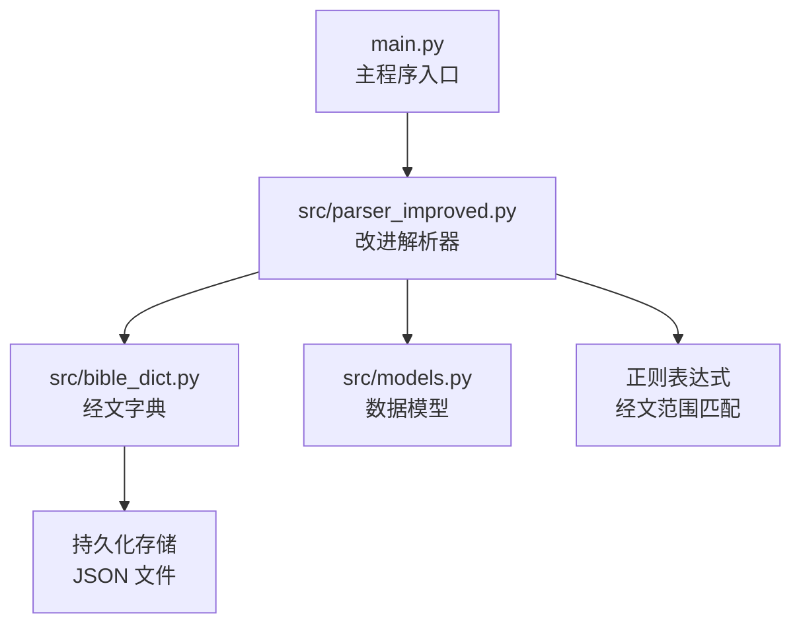
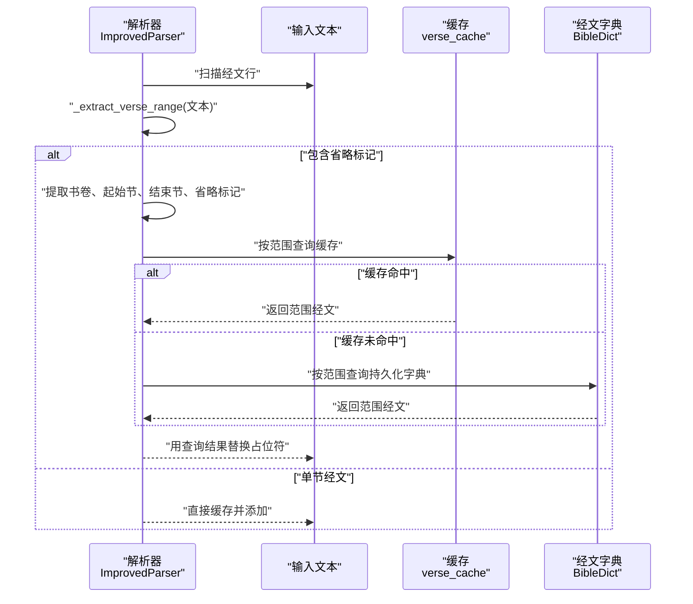
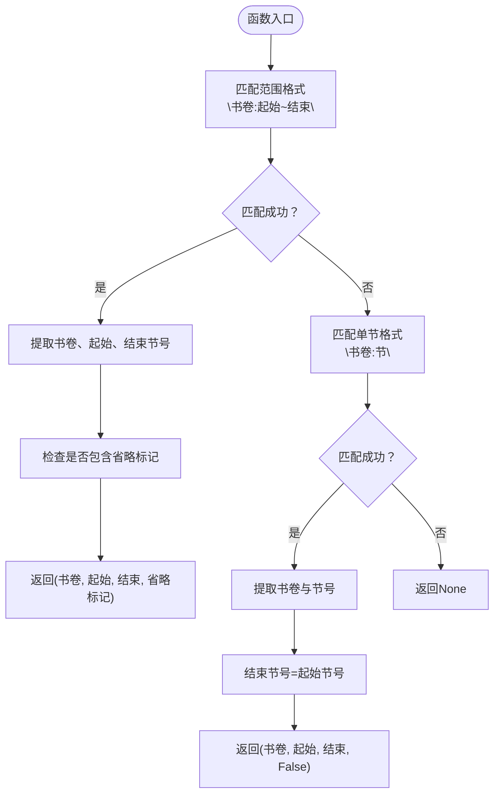
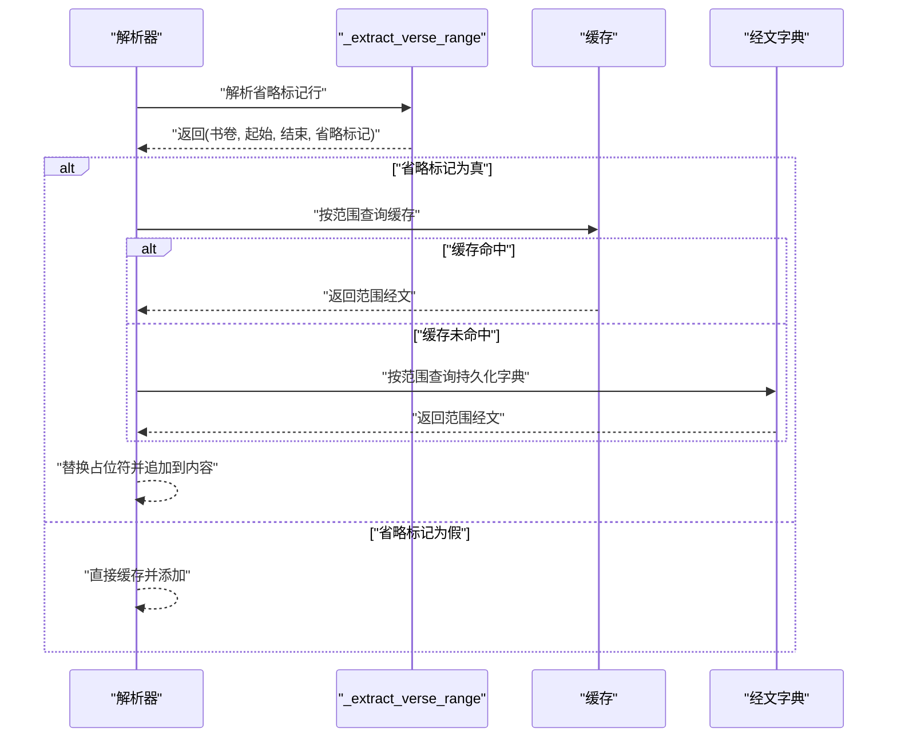
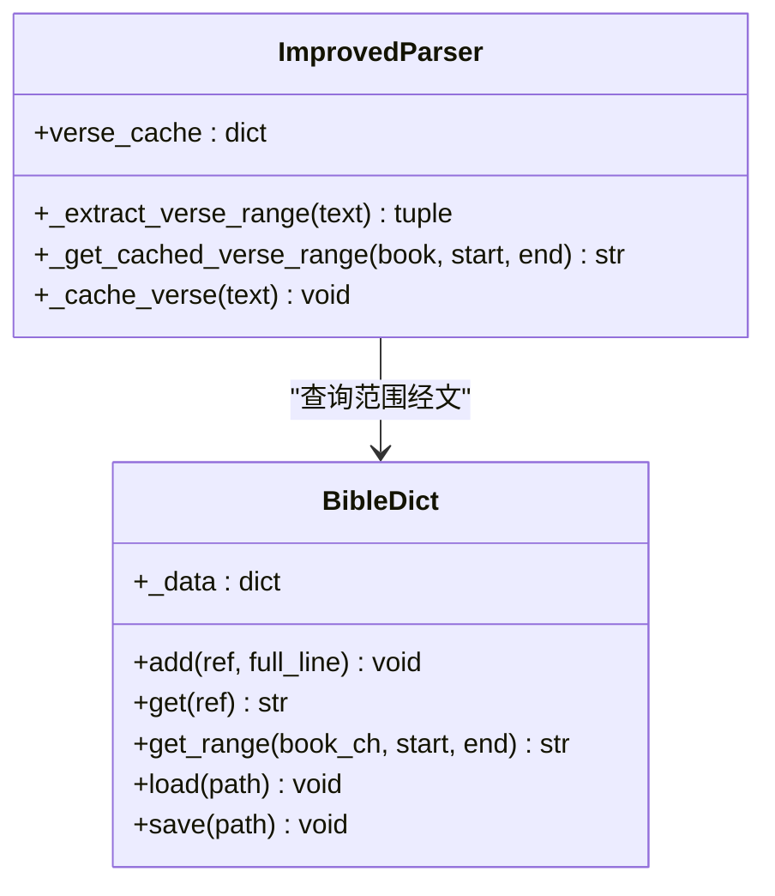
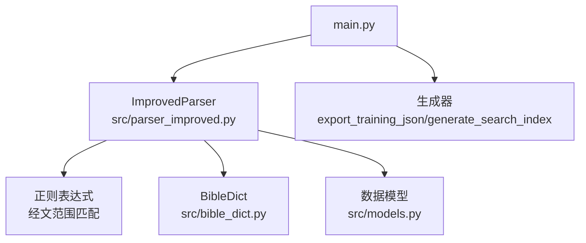

# 经文范围提取

<cite>
**本文档引用的文件**
- [src/parser_improved.py](file://src/parser_improved.py)
- [src/bible_dict.py](file://src/bible_dict.py)
- [src/models.py](file://src/models.py)
- [main.py](file://main.py)
</cite>

## 目录
1. [简介](#简介)
2. [项目结构](#项目结构)
3. [核心组件](#核心组件)
4. [架构概览](#架构概览)
5. [详细组件分析](#详细组件分析)
6. [依赖分析](#依赖分析)
7. [性能考虑](#性能考虑)
8. [故障排除指南](#故障排除指南)
9. [结论](#结论)

## 简介
本文档深入解析经文范围提取功能的技术实现，重点围绕 `_extract_verse_range` 方法的工作机制，涵盖单节经文、经文范围、省略标记的识别与处理逻辑。文档详细说明了经文范围解析算法，包括不同格式（如腓2:5~11、创1:1~5）的处理策略，并提供范围验证、边界检查、格式兼容性的技术要点。

## 项目结构
该功能位于 Python 解析器模块中，主要涉及以下文件：
- `src/parser_improved.py`: 包含改进的解析器类，其中实现了 `_extract_verse_range` 方法以及与经文范围相关的缓存与查询逻辑。
- `src/bible_dict.py`: 提供持久化的经文字典，支持按范围检索与持久化存储。
- `src/models.py`: 定义数据模型，包括章节、内容节点等，支撑经文范围提取后的数据组织。
- `main.py`: 主程序入口，调用解析流程并生成最终的训练数据。

**图表来源**
- [main.py:489-500](file://main.py#L489-L500)
- [src/parser_improved.py:309-333](file://src/parser_improved.py#L309-L333)
- [src/bible_dict.py:26-86](file://src/bible_dict.py#L26-L86)

**章节来源**
- [main.py:489-500](file://main.py#L489-L500)
- [src/parser_improved.py:309-333](file://src/parser_improved.py#L309-L333)
- [src/bible_dict.py:26-86](file://src/bible_dict.py#L26-L86)
- [src/models.py:9-232](file://src/models.py#L9-L232)

## 核心组件
- 改进解析器（ImprovedParser）：负责从 Word 文档中提取经文范围，识别单节与范围，并处理省略标记“从略”。其内部包含 `_extract_verse_range` 方法，用于从文本中抽取书卷标识、起始节号、结束节号与省略标记。
- 经文字典（BibleDict）：提供持久化存储与范围查询能力，支持按书卷+章号+节号的键值检索，以及范围拼接输出。
- 数据模型（models.py）：定义章节、内容节点等结构，承载解析结果并用于后续生成静态站点。

关键实现位置：
- 经文范围提取：[src/parser_improved.py:309-333](file://src/parser_improved.py#L309-L333)
- “从略”处理与缓存替换：[src/parser_improved.py:548-560](file://src/parser_improved.py#L548-L560)
- 范围缓存与查询：[src/parser_improved.py:338-366](file://src/parser_improved.py#L338-L366)
- 经文字典范围查询：[src/bible_dict.py:52-59](file://src/bible_dict.py#L52-L59)

**章节来源**
- [src/parser_improved.py:309-333](file://src/parser_improved.py#L309-L333)
- [src/parser_improved.py:548-560](file://src/parser_improved.py#L548-L560)
- [src/parser_improved.py:338-366](file://src/parser_improved.py#L338-L366)
- [src/bible_dict.py:52-59](file://src/bible_dict.py#L52-L59)

## 架构概览
经文范围提取的整体流程如下：
1. 解析器扫描文档中的经文行，识别符合格式的文本。
2. 对于包含“从略”的行，调用 `_extract_verse_range` 提取书卷与范围信息。
3. 通过缓存或经文字典查询该范围的完整经文内容。
4. 将查询到的经文替换原占位符，继续构建章节的经文内容。

**图表来源**
- [src/parser_improved.py:548-560](file://src/parser_improved.py#L548-L560)
- [src/parser_improved.py:338-366](file://src/parser_improved.py#L338-L366)
- [src/bible_dict.py:52-59](file://src/bible_dict.py#L52-L59)

## 详细组件分析

### 组件A：经文范围提取器（_extract_verse_range）
该方法负责从文本中识别并解析经文范围，支持以下格式：
- 单节经文：如“腓2:5”
- 经文范围：如“腓2:5~11”
- 带省略标记的范围：如“腓2:5~11 从略。”

实现要点：
- 使用正则表达式匹配书卷标识与节号，支持中文数字与阿拉伯数字混合的书卷名。
- 对于范围格式，提取起始与结束节号；对于单节，结束节号等于起始节号。
- 通过检查文本中是否包含“从略”来确定是否为省略标记。

**图表来源**
- [src/parser_improved.py:309-333](file://src/parser_improved.py#L309-L333)

**章节来源**
- [src/parser_improved.py:309-333](file://src/parser_improved.py#L309-L333)

### 组件B：“从略”占位符处理与缓存替换
当解析器遇到包含“从略”的经文行时，会：
1. 调用 `_extract_verse_range` 获取书卷与范围信息。
2. 若省略标记为真，则通过 `_get_cached_verse_range` 查询缓存或持久化字典中的范围经文。
3. 将查询到的经文替换原文本中的占位符，继续构建章节内容。

**图表来源**
- [src/parser_improved.py:548-560](file://src/parser_improved.py#L548-L560)
- [src/parser_improved.py:338-366](file://src/parser_improved.py#L338-L366)
- [src/bible_dict.py:52-59](file://src/bible_dict.py#L52-L59)

**章节来源**
- [src/parser_improved.py:548-560](file://src/parser_improved.py#L548-L560)
- [src/parser_improved.py:338-366](file://src/parser_improved.py#L338-L366)
- [src/bible_dict.py:52-59](file://src/bible_dict.py#L52-L59)

### 组件C：范围缓存与持久化查询
- 缓存层：解析器维护 `verse_cache` 字典，键为“书卷:节”，值为完整经文行。当遇到“从略”范围时，按“书卷:起始~结束”范围遍历并拼接缓存中的经文。
- 持久化层：经文字典提供范围查询接口，按“书卷+章:节”键检索，支持范围拼接输出。

**图表来源**
- [src/parser_improved.py:338-366](file://src/parser_improved.py#L338-L366)
- [src/bible_dict.py:26-86](file://src/bible_dict.py#L26-L86)

**章节来源**
- [src/parser_improved.py:338-366](file://src/parser_improved.py#L338-L366)
- [src/bible_dict.py:26-86](file://src/bible_dict.py#L26-L86)

## 依赖分析
- 改进解析器依赖正则表达式进行经文格式识别，并依赖经文字典进行范围查询与持久化。
- 经文字典提供范围查询接口，支持按书卷+章号+节号的键值检索。
- 主程序通过调用解析流程，将解析结果封装为训练数据并生成最终输出。

**图表来源**
- [src/parser_improved.py:309-333](file://src/parser_improved.py#L309-L333)
- [src/bible_dict.py:26-86](file://src/bible_dict.py#L26-L86)
- [src/models.py:9-232](file://src/models.py#L9-L232)
- [main.py:489-500](file://main.py#L489-L500)

**章节来源**
- [src/parser_improved.py:309-333](file://src/parser_improved.py#L309-L333)
- [src/bible_dict.py:26-86](file://src/bible_dict.py#L26-L86)
- [src/models.py:9-232](file://src/models.py#L9-L232)
- [main.py:489-500](file://main.py#L489-L500)

## 性能考虑
- 正则匹配：经文范围提取使用预编译的正则表达式，减少重复编译开销。
- 缓存策略：优先查询内存缓存，未命中时再访问持久化字典，降低 I/O 次数。
- 范围拼接：按范围遍历缓存或字典，避免不必要的重复查询。
- 文档解析：解析器在处理大量经文时，采用流式处理与缓存复用，提升整体吞吐量。

## 故障排除指南
- “从略”未替换：确认文本中确实包含“从略”字样，且范围格式正确；检查缓存与字典中是否存在对应键。
- 范围查询为空：检查书卷标识与节号是否在缓存或字典中存在；确认范围边界合理（起始节号不大于结束节号）。
- 格式不兼容：确保经文文本遵循支持的格式（如“书卷:节~节”或“书卷:节”），避免混杂多种格式导致误判。

**章节来源**
- [src/parser_improved.py:548-560](file://src/parser_improved.py#L548-L560)
- [src/parser_improved.py:338-366](file://src/parser_improved.py#L338-L366)
- [src/bible_dict.py:52-59](file://src/bible_dict.py#L52-L59)

## 结论
经文范围提取功能通过正则表达式识别单节与范围，并结合缓存与持久化字典实现高效查询与替换。该实现兼顾格式兼容性与性能优化，能够稳定处理多种经文范围格式，满足训练文档解析与静态站点生成的需求。