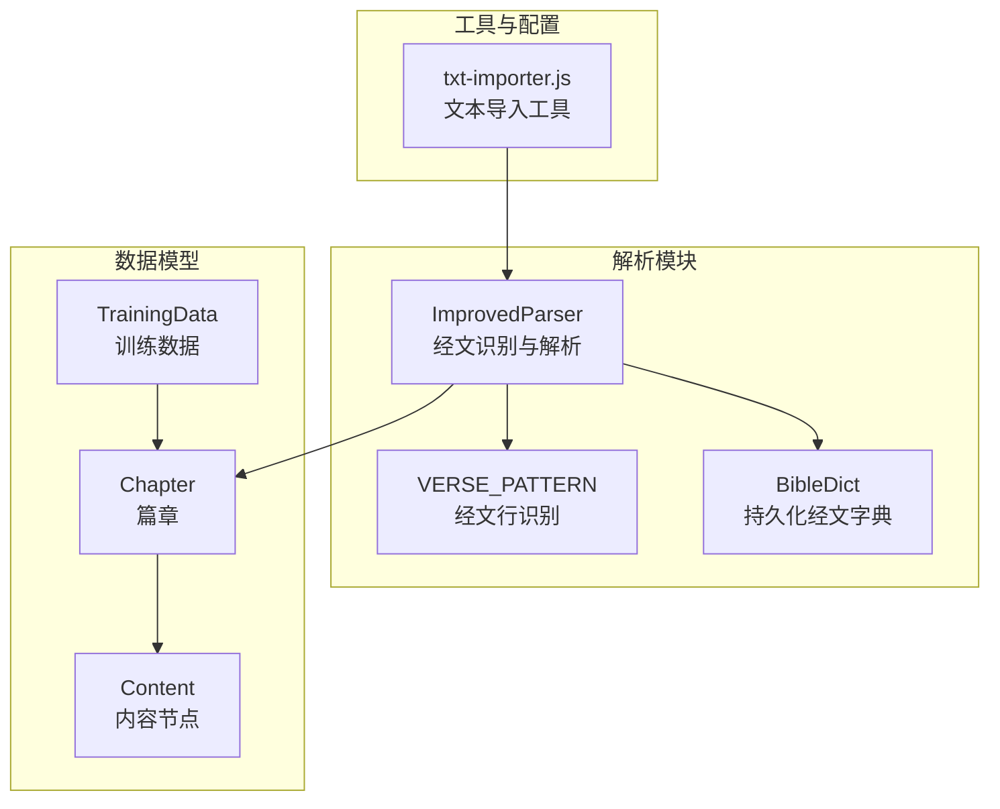
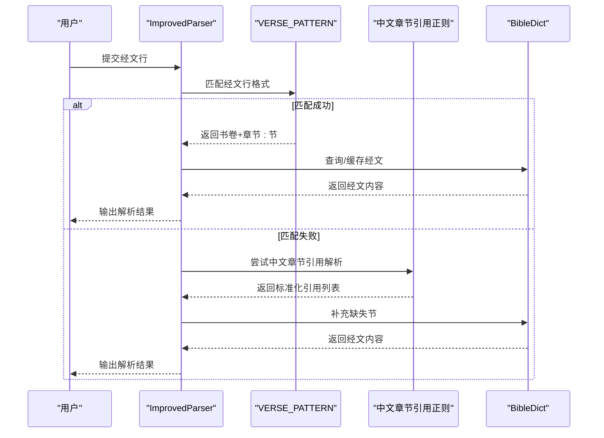
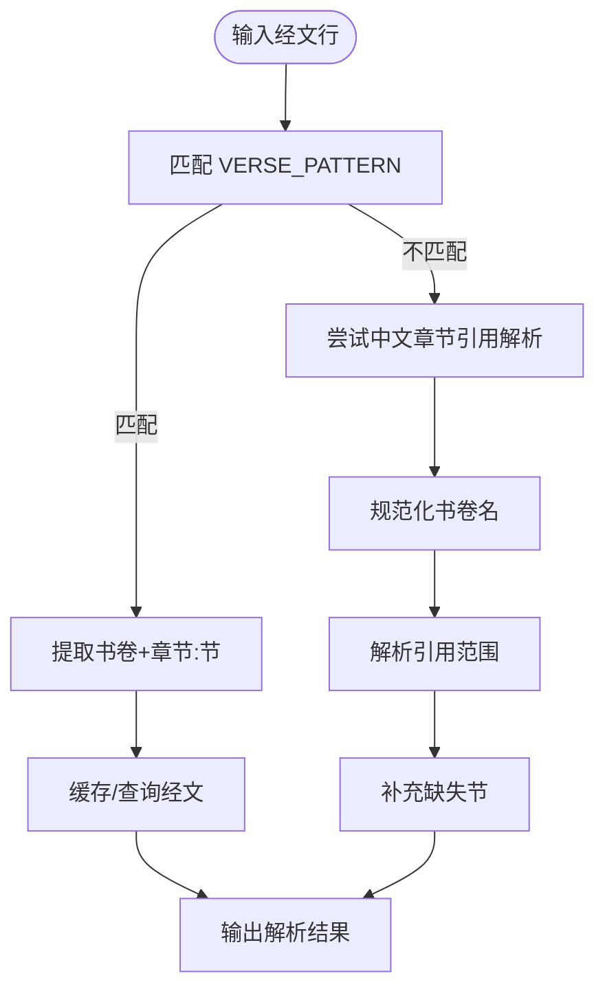
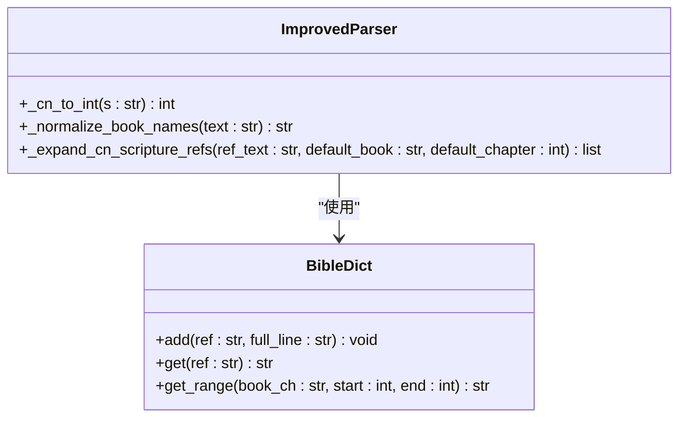
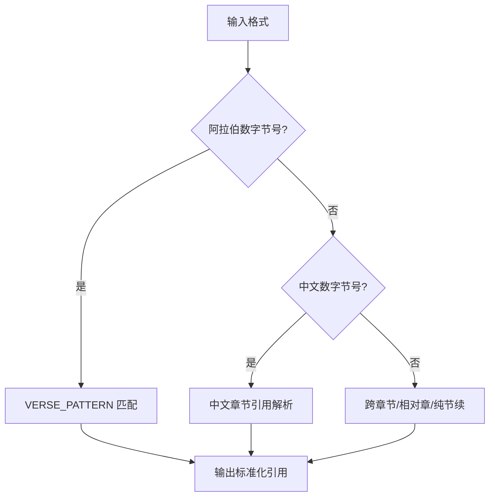
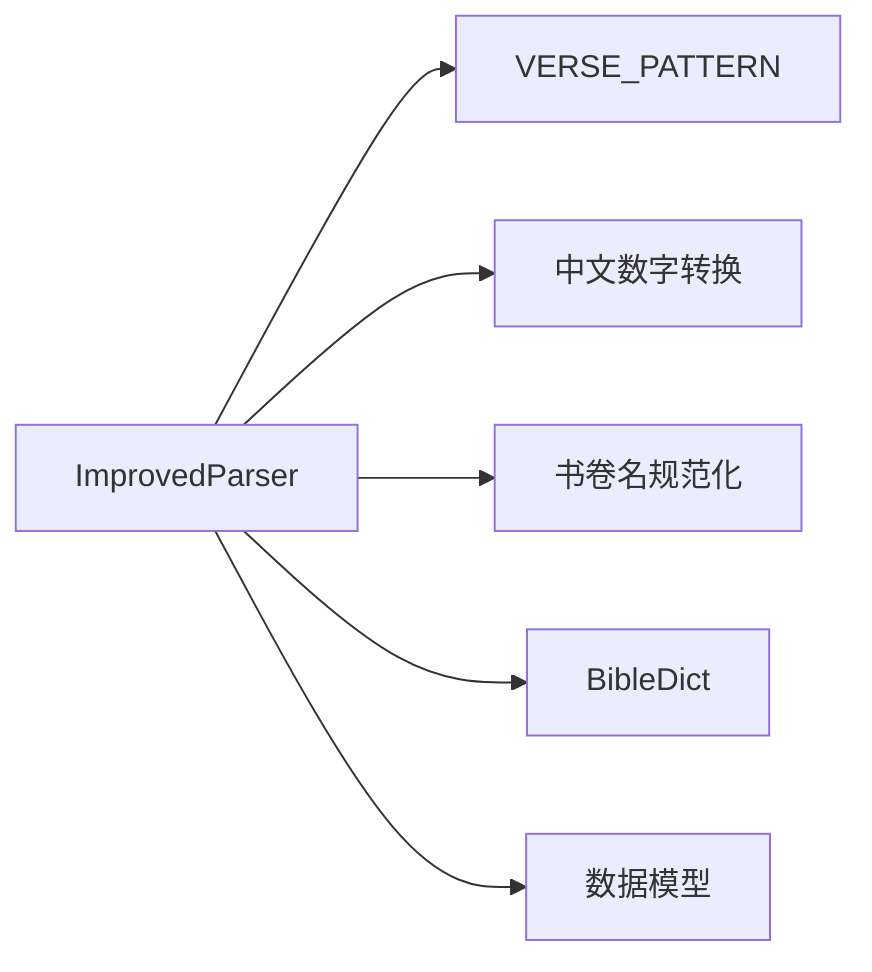

# 经文识别算法

<cite>
**本文档引用的文件**
- [parser_improved.py](file://src/parser_improved.py)
- [bible_dict.py](file://src/bible_dict.py)
- [models.py](file://src/models.py)
- [txt-importer.js](file://src/static/js/txt-importer.js)
</cite>

## 目录
1. [简介](#简介)
2. [项目结构](#项目结构)
3. [核心组件](#核心组件)
4. [架构概览](#架构概览)
5. [详细组件分析](#详细组件分析)
6. [依赖关系分析](#依赖关系分析)
7. [性能考量](#性能考量)
8. [故障排除指南](#故障排除指南)
9. [结论](#结论)

## 简介
本技术文档聚焦于经文识别算法，深入解析 VERSE_PATTERN 正则表达式的匹配逻辑，涵盖书卷名称识别、数字格式支持、中文数字处理等核心机制。文档详细说明经文格式识别规则，包括腓2:5、太5:3~11、创1:1 等不同格式的匹配策略，并提供代码示例路径展示如何处理阿拉伯数字节号、中文数字节号、经文范围等场景。同时总结正则表达式优化技巧、边界条件处理与性能考虑等关键技术要点。

## 项目结构
该项目采用模块化设计，核心解析逻辑集中在改进的解析器中，配合持久化经文字典与数据模型，形成完整的经文识别与处理流水线。

**图表来源**
- [parser_improved.py:115-284](file://src/parser_improved.py#L115-L284)
- [bible_dict.py:19-96](file://src/bible_dict.py#L19-L96)
- [models.py:9-232](file://src/models.py#L9-L232)
- [txt-importer.js:60-94](file://src/static/js/txt-importer.js#L60-L94)

**章节来源**
- [parser_improved.py:115-284](file://src/parser_improved.py#L115-L284)
- [bible_dict.py:19-96](file://src/bible_dict.py#L19-L96)
- [models.py:9-232](file://src/models.py#L9-L232)
- [txt-importer.js:60-94](file://src/static/js/txt-importer.js#L60-L94)

## 核心组件
- VERSE_PATTERN：用于识别“书卷+章节:节”格式的经文行，支持阿拉伯数字节号与半角空格分隔。
- 中文章节引用解析：通过预编译正则与中文数字转换函数，支持“书卷+中文章+阿拉伯节”、“相对章”、“纯节续”等多种格式。
- 经文范围处理：支持单节、节范围、跨章节范围等复杂场景，并与缓存与持久化字典协同工作。
- 数据模型：Chapter、Content、TrainingData 等模型承载解析结果与输出结构。

**章节来源**
- [parser_improved.py:144-190](file://src/parser_improved.py#L144-L190)
- [parser_improved.py:2172-2205](file://src/parser_improved.py#L2172-L2205)
- [parser_improved.py:300-366](file://src/parser_improved.py#L300-L366)
- [models.py:9-232](file://src/models.py#L9-L232)

## 架构概览
经文识别算法围绕 ImprovedParser 展开，利用 VERSE_PATTERN 与一系列中文章节引用正则完成多格式识别，并通过 BibleDict 实现缓存与持久化。

**图表来源**
- [parser_improved.py:300-366](file://src/parser_improved.py#L300-L366)
- [parser_improved.py:2255-2454](file://src/parser_improved.py#L2255-L2454)
- [bible_dict.py:33-60](file://src/bible_dict.py#L33-L60)

**章节来源**
- [parser_improved.py:300-366](file://src/parser_improved.py#L300-L366)
- [parser_improved.py:2255-2454](file://src/parser_improved.py#L2255-L2454)
- [bible_dict.py:33-60](file://src/bible_dict.py#L33-L60)

## 详细组件分析

### VERSE_PATTERN 正则表达式匹配逻辑
VERSE_PATTERN 用于识别“书卷+章节:节”的经文行，其核心机制如下：
- 书卷名称识别：通过字符类匹配常见书卷首字，覆盖旧约与新约关键书卷。
- 数字格式支持：支持阿拉伯数字节号，节号后可带“上/中/下”半角修饰符。
- 空白字符处理：允许中文全角空格、半角空格与制表符作为分隔。

**图表来源**
- [parser_improved.py:144-146](file://src/parser_improved.py#L144-L146)
- [parser_improved.py:300-307](file://src/parser_improved.py#L300-L307)
- [parser_improved.py:338-350](file://src/parser_improved.py#L338-L350)
- [parser_improved.py:2208-2222](file://src/parser_improved.py#L2208-L2222)
- [parser_improved.py:2255-2454](file://src/parser_improved.py#L2255-L2454)

**章节来源**
- [parser_improved.py:144-146](file://src/parser_improved.py#L144-L146)
- [parser_improved.py:300-307](file://src/parser_improved.py#L300-L307)
- [parser_improved.py:338-350](file://src/parser_improved.py#L338-L350)
- [parser_improved.py:2208-2222](file://src/parser_improved.py#L2208-L2222)
- [parser_improved.py:2255-2454](file://src/parser_improved.py#L2255-L2454)

### 中文数字转换与书卷名称规范化
- 中文数字转换：_cn_to_int 支持“十”“百”“十X”“XX”“XXX”等复合形式，包含特殊字符“○/零/两”处理。
- 书卷名称规范化：_normalize_book_names 将完整书名替换为缩写，按长度降序避免前缀误替换。

**图表来源**
- [parser_improved.py:2172-2205](file://src/parser_improved.py#L2172-L2205)
- [parser_improved.py:2208-2213](file://src/parser_improved.py#L2208-L2213)
- [parser_improved.py:2255-2454](file://src/parser_improved.py#L2255-L2454)
- [bible_dict.py:33-60](file://src/bible_dict.py#L33-L60)

**章节来源**
- [parser_improved.py:2172-2205](file://src/parser_improved.py#L2172-L2205)
- [parser_improved.py:2208-2213](file://src/parser_improved.py#L2208-L2213)
- [parser_improved.py:2255-2454](file://src/parser_improved.py#L2255-L2454)
- [bible_dict.py:33-60](file://src/bible_dict.py#L33-L60)

### 经文格式识别规则与匹配策略
- 腓2:5：阿拉伯数字节号，直接由 VERSE_PATTERN 匹配。
- 太5:3~11：节范围，由中文章节引用解析识别并展开。
- 创1:1：阿拉伯数字节号，直接由 VERSE_PATTERN 匹配。
- 太五3：中文数字节号，由中文章节引用解析识别“书卷+中文章+阿拉伯节”。

**图表来源**
- [parser_improved.py:144-146](file://src/parser_improved.py#L144-L146)
- [parser_improved.py:2283-2293](file://src/parser_improved.py#L2283-L2293)
- [parser_improved.py:2295-2307](file://src/parser_improved.py#L2295-L2307)
- [parser_improved.py:2356-2368](file://src/parser_improved.py#L2356-L2368)
- [parser_improved.py:2405-2414](file://src/parser_improved.py#L2405-L2414)

**章节来源**
- [parser_improved.py:144-146](file://src/parser_improved.py#L144-L146)
- [parser_improved.py:2283-2293](file://src/parser_improved.py#L2283-L2293)
- [parser_improved.py:2295-2307](file://src/parser_improved.py#L2295-L2307)
- [parser_improved.py:2356-2368](file://src/parser_improved.py#L2356-L2368)
- [parser_improved.py:2405-2414](file://src/parser_improved.py#L2405-L2414)

### 代码示例路径（经文格式处理）
- 经文行识别与缓存：[parser_improved.py:300-350](file://src/parser_improved.py#L300-L350)
- 中文章节引用解析（阿拉伯章:节、全称、相对章、纯节续等）：[parser_improved.py:2255-2454](file://src/parser_improved.py#L2255-L2454)
- 持久化经文字典读写：[bible_dict.py:33-60](file://src/bible_dict.py#L33-L60)
- 数据模型定义（章节、内容、训练数据）：[models.py:9-232](file://src/models.py#L9-L232)

**章节来源**
- [parser_improved.py:300-350](file://src/parser_improved.py#L300-L350)
- [parser_improved.py:2255-2454](file://src/parser_improved.py#L2255-L2454)
- [bible_dict.py:33-60](file://src/bible_dict.py#L33-L60)
- [models.py:9-232](file://src/models.py#L9-L232)

## 依赖关系分析
- ImprovedParser 依赖 VERSE_PATTERN 与中文章节引用正则族，以及 _cn_to_int 与 _normalize_book_names。
- 经文范围解析依赖 BibleDict 进行缓存与持久化补全。
- 数据模型为解析结果提供结构化承载。

**图表来源**
- [parser_improved.py:144-190](file://src/parser_improved.py#L144-L190)
- [parser_improved.py:2172-2213](file://src/parser_improved.py#L2172-L2213)
- [bible_dict.py:19-96](file://src/bible_dict.py#L19-L96)
- [models.py:9-232](file://src/models.py#L9-L232)

**章节来源**
- [parser_improved.py:144-190](file://src/parser_improved.py#L144-L190)
- [parser_improved.py:2172-2213](file://src/parser_improved.py#L2172-L2213)
- [bible_dict.py:19-96](file://src/bible_dict.py#L19-L96)
- [models.py:9-232](file://src/models.py#L9-L232)

## 性能考量
- 预编译正则：VERSE_PATTERN 与中文章节引用正则均在类初始化时预编译，减少重复编译开销。
- 缓存与持久化：通过 verse_cache 与 BibleDict 减少重复解析与外部查询。
- 规范化优先：先将完整书名替换为缩写，避免多次正则匹配。
- 边界条件限制：对章号上限（如 150）进行约束，防止误识别页码等非经文内容。

[本节为一般性指导，无需特定文件引用]

## 故障排除指南
- VERSE_PATTERN 未匹配：检查输入是否包含阿拉伯数字节号与正确分隔符，确认书卷名称是否在字符类范围内。
- 中文数字转换异常：确认中文数字格式是否符合“十”“百”“十X”“XX”“XXX”等规则，检查特殊字符“○/零/两”处理。
- 跨章节范围误判：确保引用中包含正确的分隔符（如“~～—”），并确认章号不超过上限。
- 职事信息有效性判断：过滤掉仅含下划线、空白字符或过短的无意义文本。

**章节来源**
- [parser_improved.py:2516-2550](file://src/parser_improved.py#L2516-L2550)

## 结论
经文识别算法通过 VERSE_PATTERN 与中文章节引用解析相结合，实现了对多种经文格式的稳定识别与处理。预编译正则、缓存与持久化、书卷名规范化与中文数字转换共同构成了高效的识别流水线。遵循边界条件与性能优化建议，可在大规模文档解析中保持高准确率与良好性能。