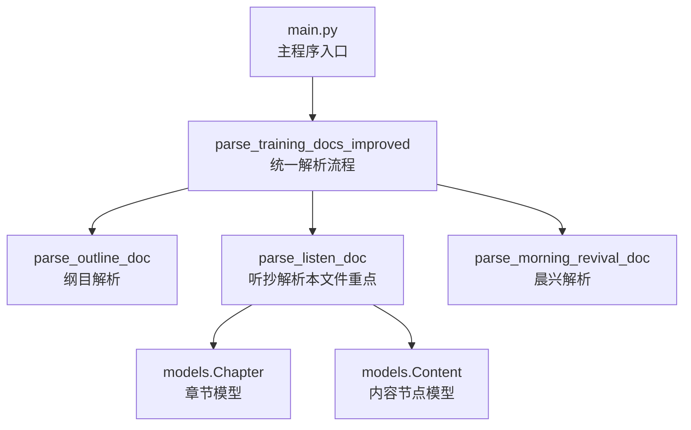
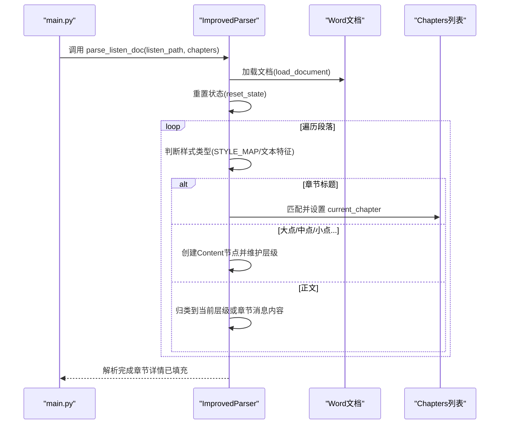
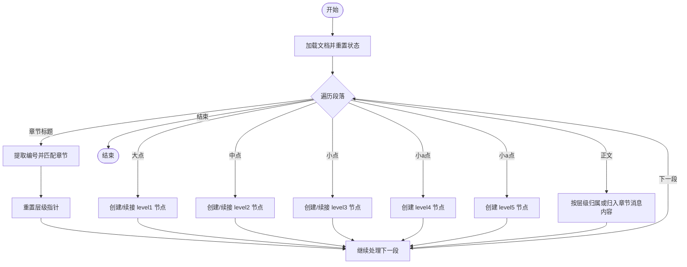
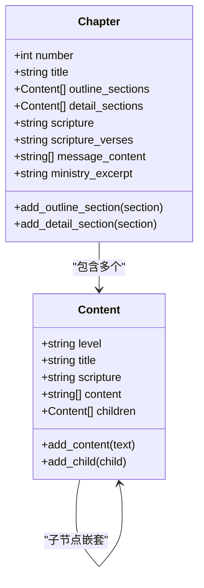
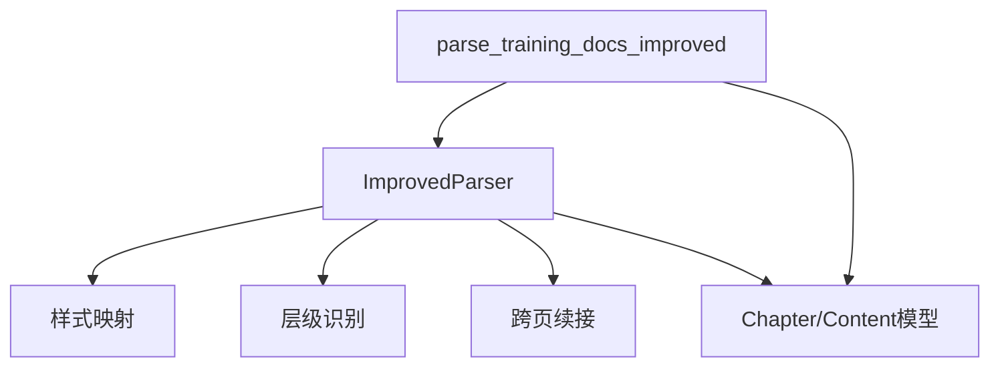

# 详细内容解析

<cite>
**本文档引用的文件**
- [src/parser_improved.py](file://src/parser_improved.py)
- [src/models.py](file://src/models.py)
- [main.py](file://main.py)
</cite>

## 目录
1. [简介](#简介)
2. [项目结构](#项目结构)
3. [核心组件](#核心组件)
4. [架构概览](#架构概览)
5. [详细组件分析](#详细组件分析)
6. [依赖分析](#依赖分析)
7. [性能考虑](#性能考虑)
8. [故障排除指南](#故障排除指南)
9. [结论](#结论)

## 简介
本文件聚焦于"详细内容解析"功能，深入解析 parse_listen_doc 函数的实现原理与工作机制。该函数负责将听抄文档（含纲目结构、详细正文说明与听抄内容）解析为结构化的章节内容，确保与纲目文档的对应关系准确建立，并实现样式类型判断、内容分类处理、层级关系维护等核心能力。文档还涵盖数据一致性保障、错误恢复策略与性能优化建议。

## 项目结构
- 核心解析器位于 src/parser_improved.py，包含 ImprovedParser 类及其 parse_listen_doc 方法
- 数据模型位于 src/models.py，定义 Chapter、Content 等关键实体
- 主入口 main.py 调用 parse_training_docs_improved 流程，串联纲目、听抄与晨兴文档解析

图表来源
- [main.py:489-500](file://main.py#L489-L500)
- [src/parser_improved.py:2592-2710](file://src/parser_improved.py#L2592-L2710)

章节来源
- [src/parser_improved.py:115-136](file://src/parser_improved.py#L115-L136)
- [src/models.py:9-55](file://src/models.py#L9-L55)
- [main.py:489-500](file://main.py#L489-L500)

## 核心组件
- ImprovedParser：提供 parse_listen_doc 等解析能力，包含样式映射、层级识别、跨页续接处理等
- Chapter/Content：承载章节与内容树形结构，支持正文段落与子节点嵌套
- parse_training_docs_improved：协调纲目、听抄、晨兴解析的整体流程

章节来源
- [src/parser_improved.py:115-136](file://src/parser_improved.py#L115-L136)
- [src/models.py:9-55](file://src/models.py#L9-L55)
- [src/parser_improved.py:2592-2710](file://src/parser_improved.py#L2592-L2710)

## 架构概览
parse_listen_doc 的工作流分为以下阶段：
1. 文档加载与初始化：加载 Word 文档，重置解析状态
2. 样式类型判断：优先使用 STYLE_MAP 映射，其次通过文本特征识别
3. 章节匹配：依据章节标题定位对应 Chapter 实例
4. 层级关系维护：逐级创建 Content 节点，支持跨页续接
5. 内容分类：将正文内容归类到当前层级或章节消息内容
6. 结果整合：将解析结果写入对应章节的 detail_sections/message_content

图表来源
- [src/parser_improved.py:784-945](file://src/parser_improved.py#L784-L945)
- [src/parser_improved.py:2592-2710](file://src/parser_improved.py#L2592-L2710)

## 详细组件分析

### parse_listen_doc 函数详解
- 输入：听抄文档路径、已解析的章节列表（含纲目结构）
- 输出：在章节列表中填充详细内容（detail_sections/message_content）
- 关键机制：
  - 样式类型判断：STYLE_MAP 映射优先，否则通过正则识别层级标记
  - 章节匹配：通过章节标题中的编号定位对应 Chapter
  - 层级关系：逐级创建 Content 节点，支持跨页续接（层级标记为空时拼接到上一节点）
  - 内容分类：正文内容按层级归属，无层级标记时归入章节消息内容

图表来源
- [src/parser_improved.py:784-945](file://src/parser_improved.py#L784-L945)

章节来源
- [src/parser_improved.py:784-945](file://src/parser_improved.py#L784-L945)

### 样式类型判断与文本特征识别
- STYLE_MAP：将 Word 样式名称映射到内部类型（章节标题、各级标题、正文）
- 文本特征识别：当样式映射失败时，通过正则匹配层级标记（壹、一、数字、小写字母、括号数字）
- 适用场景：不同版本/格式的 Word 文档可能存在样式差异，需通过特征识别兜底

章节来源
- [src/parser_improved.py:118-135](file://src/parser_improved.py#L118-L135)
- [src/parser_improved.py:806-825](file://src/parser_improved.py#L806-L825)

### 章节匹配机制
- 通过章节标题中的编号（中文/阿拉伯数字）提取并匹配对应 Chapter
- 匹配成功后设置 current_chapter，并重置层级指针，确保后续内容归属正确

章节来源
- [src/parser_improved.py:826-842](file://src/parser_improved.py#L826-L842)
- [src/parser_improved.py:958-975](file://src/parser_improved.py#L958-L975)

### 层级关系维护与跨页续接
- 逐级创建 Content 节点，支持 level1-level5 的嵌套
- 跨页续接：当层级标记为空且前一节点存在时，优先拼接到前一节点标题；否则新建无标记节点
- 适配 Word 分页/分栏导致的文本截断

章节来源
- [src/parser_improved.py:843-925](file://src/parser_improved.py#L843-L925)
- [src/parser_improved.py:977-993](file://src/parser_improved.py#L977-L993)

### 内容分类处理
- 正文内容按层级归属：level5 > level4 > level3 > level2 > level1 > 章节消息内容
- 读经行过滤：跳过以"读经："开头的行，避免与章节读经重复渲染
- 跨页续接：通过 _should_merge_with_previous 判断是否与前一行合并

章节来源
- [src/parser_improved.py:926-945](file://src/parser_improved.py#L926-L945)
- [src/parser_improved.py:2092-2158](file://src/parser_improved.py#L2092-L2158)

### 数据结构与模型
- Chapter：承载章节编号、标题、纲目/详细内容、读经、消息内容等
- Content：承载层级、标题、经文引用、正文段落、子节点
- 通过 add_detail_section/add_content 等方法维护树形结构

图表来源
- [src/models.py:40-63](file://src/models.py#L40-L63)
- [src/models.py:9-26](file://src/models.py#L9-L26)

章节来源
- [src/models.py:40-63](file://src/models.py#L40-L63)
- [src/models.py:9-26](file://src/models.py#L9-L26)

### 与纲目文档的对应关系
- parse_listen_doc 依赖已解析的纲目章节结构（Chapters），通过章节编号精确匹配
- 纲目中的经文引用可通过 _build_scripture_map/_fill_scripture 同步到晨兴纲目，但听抄解析本身不修改纲目经文字段

章节来源
- [src/parser_improved.py:2644-2654](file://src/parser_improved.py#L2644-L2654)

### 错误恢复与健壮性
- 样式映射失败时回退到文本特征识别
- 跨页续接通过 _should_merge_with_previous 判断，避免错误拼接
- 读经行过滤避免重复渲染
- 章节标题规范化（去除多余空格）提升匹配成功率

章节来源
- [src/parser_improved.py:806-825](file://src/parser_improved.py#L806-L825)
- [src/parser_improved.py:2092-2158](file://src/parser_improved.py#L2092-L2158)
- [src/parser_improved.py:800-801](file://src/parser_improved.py#L800-L801)

### 性能优化建议
- 样式映射优先：利用 STYLE_MAP 减少正则匹配次数
- 正则预编译：解析器中大量使用预编译正则，降低重复编译成本
- 跨页续接快速判断：_should_merge_with_previous 采用简单规则快速判断，减少复杂逻辑开销
- 层级指针复用：在章节内复用 current_level* 指针，避免频繁查找

章节来源
- [src/parser_improved.py:137-190](file://src/parser_improved.py#L137-L190)
- [src/parser_improved.py:2092-2158](file://src/parser_improved.py#L2092-L2158)

## 依赖分析
- parse_listen_doc 依赖 ImprovedParser 的样式映射、层级识别、跨页续接等能力
- 依赖 Chapter/Content 模型维护树形结构
- 与 parse_training_docs_improved 协同工作，后者负责整体流程编排

图表来源
- [src/parser_improved.py:118-135](file://src/parser_improved.py#L118-L135)
- [src/parser_improved.py:2592-2710](file://src/parser_improved.py#L2592-L2710)

章节来源
- [src/parser_improved.py:118-135](file://src/parser_improved.py#L118-L135)
- [src/parser_improved.py:2592-2710](file://src/parser_improved.py#L2592-L2710)

## 性能考虑
- 正则匹配优化：预编译常用正则，减少运行时编译开销
- 样式映射优先：优先使用 STYLE_MAP，避免复杂文本特征识别
- 跨页续接快速判断：通过简单规则快速判断是否需要合并，减少不必要的字符串处理
- 层级指针缓存：在章节内复用 current_level* 指针，减少节点查找成本

## 故障排除指南
- 章节匹配失败：检查听抄文档中的章节标题是否包含编号，确保与纲目文档一致
- 样式映射失效：确认 Word 文档样式名称是否在 STYLE_MAP 中，必要时通过文本特征识别
- 跨页续接异常：检查段落是否以完整标点结尾，避免错误拼接
- 读经行重复：确认是否正确过滤以"读经："开头的行

章节来源
- [src/parser_improved.py:826-842](file://src/parser_improved.py#L826-L842)
- [src/parser_improved.py:806-825](file://src/parser_improved.py#L806-L825)
- [src/parser_improved.py:2092-2158](file://src/parser_improved.py#L2092-L2158)
- [src/parser_improved.py:931-932](file://src/parser_improved.py#L931-L932)

## 结论
parse_listen_doc 通过样式类型判断、章节匹配与层级关系维护，实现了听抄文档与纲目结构的精准映射。其设计兼顾了不同格式文档的兼容性、跨页续接的鲁棒性与性能优化，为后续的渲染与检索提供了高质量的结构化数据。结合数据一致性保障与错误恢复策略，该实现能够稳定支撑大规模训练资料的解析与发布。