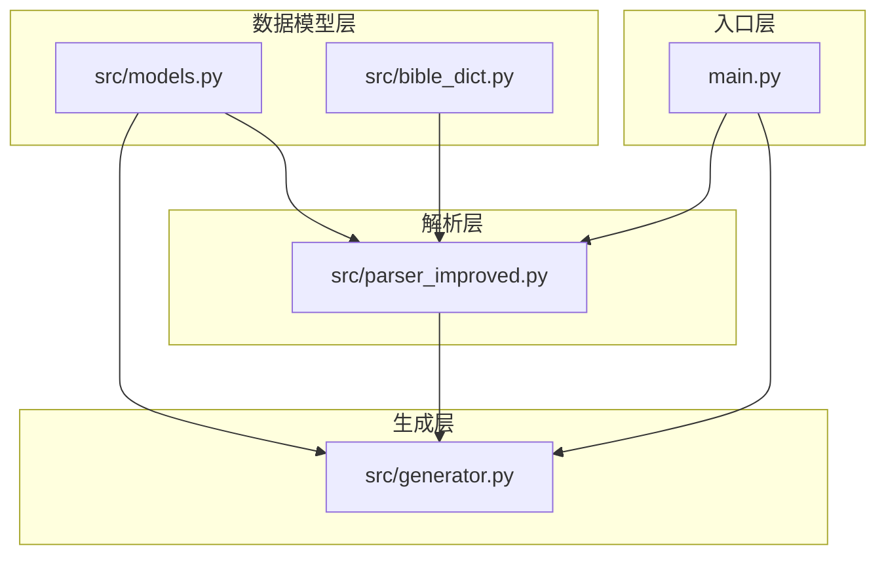
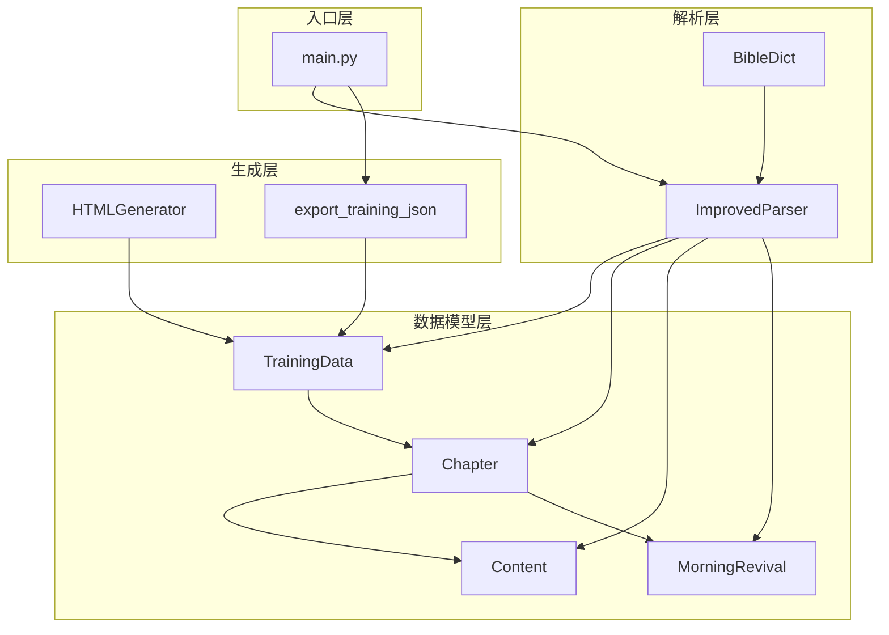
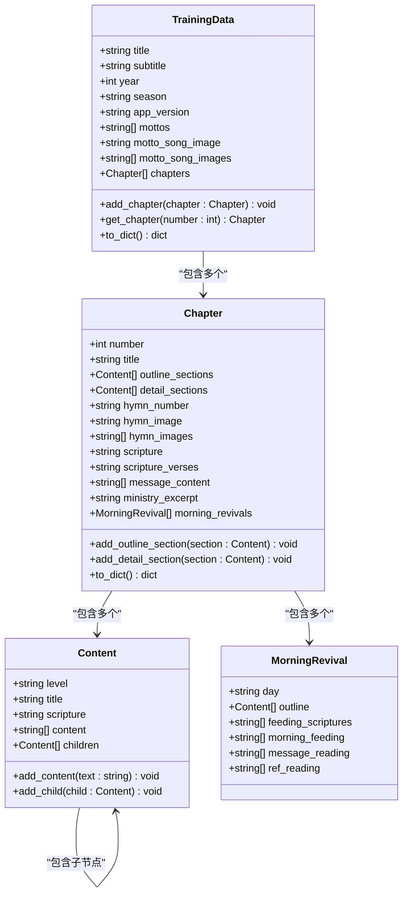
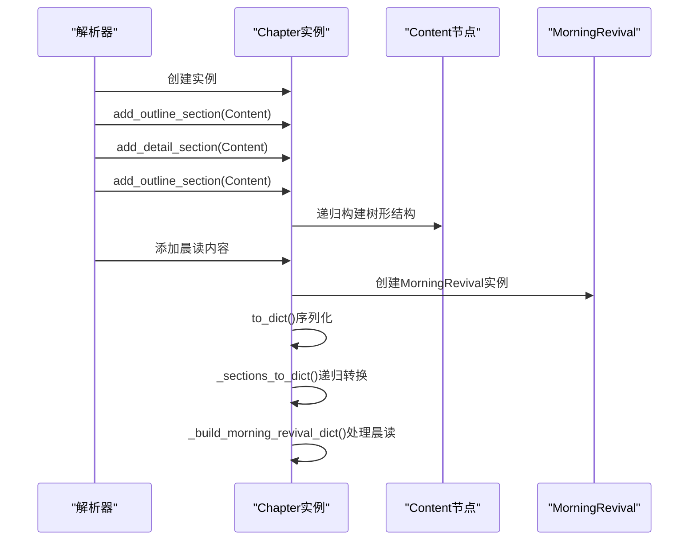
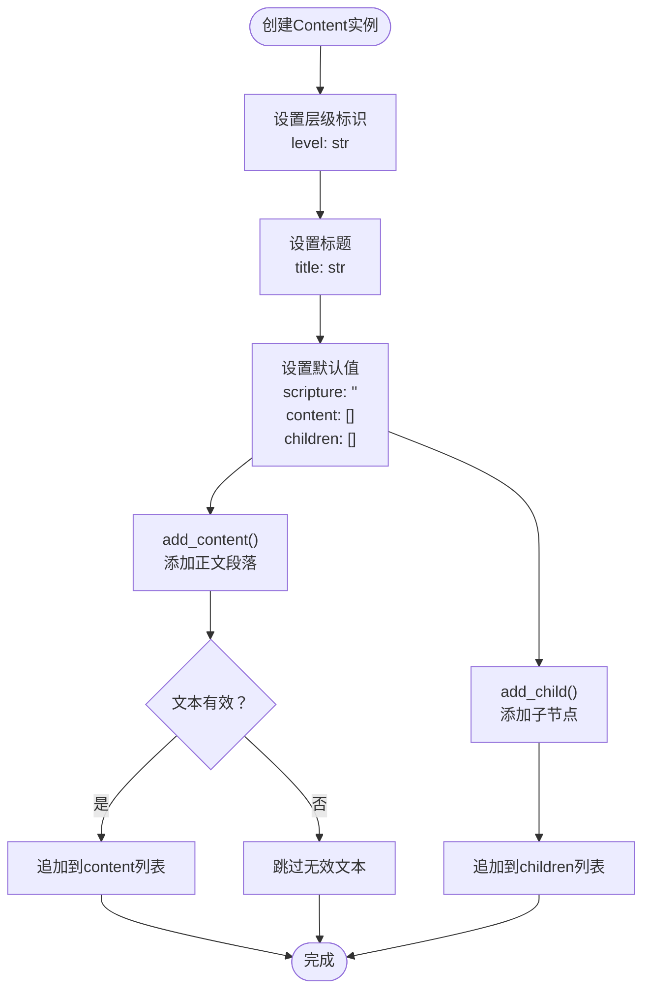
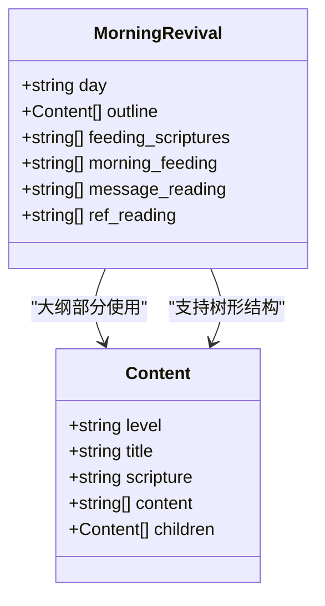
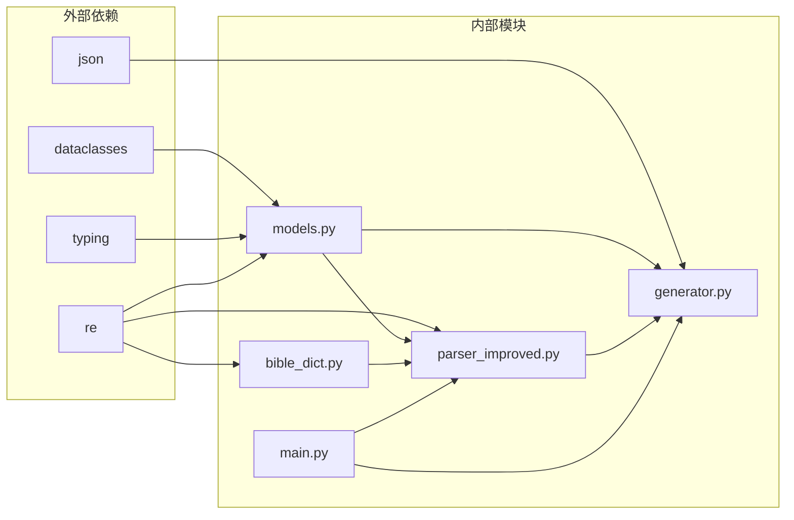

# 数据模型系统

<cite>
**本文档引用的文件**
- [src/models.py](file://src/models.py)
- [src/parser_improved.py](file://src/parser_improved.py)
- [src/generator.py](file://src/generator.py)
- [main.py](file://main.py)
- [src/bible_dict.py](file://src/bible_dict.py)
</cite>

## 目录
1. [简介](#简介)
2. [项目结构](#项目结构)
3. [核心组件](#核心组件)
4. [架构概览](#架构概览)
5. [详细组件分析](#详细组件分析)
6. [依赖分析](#依赖分析)
7. [性能考虑](#性能考虑)
8. [故障排除指南](#故障排除指南)
9. [结论](#结论)

## 简介

数据模型系统是整个Word文档静态网站生成器的核心基础设施，负责定义和管理训练数据的结构化表示。该系统采用Python数据类（dataclasses）实现，提供了清晰的数据结构定义、序列化机制和业务逻辑封装。

系统主要包含四个核心数据模型：TrainingData（训练数据总集）、Chapter（篇章）、Content（内容节点基类）和MorningRevival（晨读内容）。这些模型通过明确的层次关系和关联关系，构建了一个完整的训练数据管理体系。

## 项目结构

数据模型系统位于项目的src目录下，采用模块化设计：

**图表来源**
- [src/models.py:1-232](file://src/models.py#L1-L232)
- [src/parser_improved.py:1-200](file://src/parser_improved.py#L1-L200)
- [src/generator.py:1-200](file://src/generator.py#L1-L200)
- [main.py:1-200](file://main.py#L1-L200)

**章节来源**
- [src/models.py:1-232](file://src/models.py#L1-L232)
- [src/parser_improved.py:1-200](file://src/parser_improved.py#L1-L200)
- [src/generator.py:1-200](file://src/generator.py#L1-L200)
- [main.py:1-200](file://main.py#L1-L200)

## 核心组件

数据模型系统的核心由四个主要组件构成，每个组件都有其特定的职责和功能：

### TrainingData - 训练数据总集
- **职责**：管理整个训练项目的顶层数据结构
- **关键属性**：标题、副标题、年份、季节、应用版本、标语列表等
- **核心方法**：添加篇章、获取指定编号的篇章、字典序列化
- **使用场景**：作为JSON序列化的根对象，承载训练项目的所有元数据

### Chapter - 篇章模型
- **职责**：表示训练中的单个篇章，包含完整的结构化内容
- **关键属性**：篇章编号、标题、纲目结构、详细内容、诗歌信息、经文引用等
- **核心方法**：添加纲目节点、添加详细内容节点、字典转换、经文提取
- **使用场景**：封装单个篇章的所有内容，支持复杂的层次结构

### Content - 内容节点基类
- **职责**：提供内容节点的基础结构和操作方法
- **关键属性**：层级标识、标题、经文引用、正文段落、子节点列表
- **核心方法**：添加正文段落、添加子节点
- **使用场景**：作为所有内容节点的基类，支持树形结构的构建

### MorningRevival - 晨读内容
- **职责**：管理每日晨读的结构化内容
- **关键属性**：星期标识、大纲部分、喂养经文、晨兴喂养、信息选读、参考阅读
- **核心方法**：按天组织晨读内容，支持多日的晨读安排
- **使用场景**：处理每周的晨读计划，支持不同类型的阅读材料

**章节来源**
- [src/models.py:9-232](file://src/models.py#L9-L232)

## 架构概览

数据模型系统采用分层架构设计，各层之间职责明确，耦合度低：

**图表来源**
- [src/models.py:9-232](file://src/models.py#L9-L232)
- [src/parser_improved.py:114-200](file://src/parser_improved.py#L114-L200)
- [src/generator.py:22-200](file://src/generator.py#L22-L200)
- [main.py:205-295](file://main.py#L205-L295)

系统的核心流程包括：

1. **解析阶段**：ImprovedParser从Word文档中提取数据，构建数据模型实例
2. **验证阶段**：BibleDict提供经文验证和标准化服务
3. **生成阶段**：HTMLGenerator和export_training_json将数据模型转换为JSON格式
4. **输出阶段**：main.py协调整个处理流程，管理文件输出和错误处理

## 详细组件分析

### TrainingData 类分析

TrainingData是整个数据模型系统的顶层容器，负责管理训练项目的全局信息：

**图表来源**
- [src/models.py:9-232](file://src/models.py#L9-L232)

#### 关键特性分析

**序列化机制**：
- `to_dict()`方法实现了完整的数据转换，支持嵌套结构的递归处理
- 自动处理图片路径的兼容性（单张图片向多张图片的转换）
- 提供版本信息管理，便于缓存控制和更新检测

**数据验证**：
- 默认值处理：所有可选字段都有合理的默认值
- 类型约束：使用类型注解确保数据类型正确性
- 空值处理：对空字符串和空列表进行适当的初始化

**使用场景**：
- 作为JSON序列化的根对象
- 支持SPA（单页应用）的前端渲染需求
- 提供统一的数据访问接口

**章节来源**
- [src/models.py:196-232](file://src/models.py#L196-L232)

### Chapter 类深度分析

Chapter类是数据模型系统的核心，负责管理单个训练篇章的完整内容：

**图表来源**
- [src/models.py:40-175](file://src/models.py#L40-L175)

#### 核心算法实现

**纲目结构处理**：
- `_sections_to_dict()`方法实现了递归的树形结构转换
- 支持多层级的内容组织（大纲、中纲、小纲、细纲）
- 自动处理层级标识的CSS类映射

**晨读内容解析**：
- `_extract_feeding_scriptures()`方法实现了复杂的经文识别算法
- 支持多种经文格式：完整格式、省略书卷名格式、纯节号格式
- 智能处理长段落的分割逻辑

**数据提取工具**：
- `_extract_ref_keys()`方法从特殊格式文本中提取引用键
- 支持Tab分隔的引用格式处理
- 提供逗号分隔的引用键列表生成

**章节来源**
- [src/models.py:40-194](file://src/models.py#L40-L194)

### Content 类设计

Content类作为所有内容节点的基类，提供了统一的内容管理接口：

**图表来源**
- [src/models.py:9-26](file://src/models.py#L9-L26)

#### 设计模式应用

**工厂模式**：
- 通过`field(default_factory=list)`实现惰性初始化
- 避免了可变默认参数的问题
- 提供了统一的对象创建接口

**组合模式**：
- 支持树形结构的动态构建
- 子节点可以再次包含子节点
- 实现了递归的数据处理

**章节来源**
- [src/models.py:9-26](file://src/models.py#L9-L26)

### MorningRevival 类实现

MorningRevival类专门处理每日晨读内容，体现了系统的专业化设计：

**图表来源**
- [src/models.py:28-37](file://src/models.py#L28-L37)

#### 功能特性

**多类型内容支持**：
- 喂养经文：支持经文引用的提取和处理
- 晨兴喂养：处理每日的喂养内容
- 信息选读：提供信息阅读材料
- 参考阅读：支持参考文献的组织

**与Chapter的协作**：
- 通过`_build_morning_revival_dict()`方法集成到Chapter的序列化过程
- 支持按天组织的晨读内容
- 提供统一的数据访问接口

**章节来源**
- [src/models.py:28-37](file://src/models.py#L28-L37)

## 依赖分析

数据模型系统具有清晰的依赖关系，各模块之间耦合度低，内聚性强：

**图表来源**
- [src/models.py:5-6](file://src/models.py#L5-L6)
- [src/parser_improved.py:5-12](file://src/parser_improved.py#L5-L12)
- [src/generator.py:5-11](file://src/generator.py#L5-L11)
- [src/bible_dict.py:8-16](file://src/bible_dict.py#L8-L16)

### 模块间交互

**解析器依赖**：
- ImprovedParser直接依赖models.py中的所有数据类
- 使用正则表达式处理复杂的文本格式
- 通过BibleDict提供经文验证服务

**生成器依赖**：
- HTMLGenerator依赖TrainingData和Chapter进行数据转换
- export_training_json函数负责最终的JSON输出
- 提供搜索索引的生成能力

**入口模块依赖**：
- main.py协调整个处理流程
- 管理文件系统操作和错误处理
- 控制批量处理的执行逻辑

**章节来源**
- [src/parser_improved.py:10-12](file://src/parser_improved.py#L10-L12)
- [src/generator.py:9-11](file://src/generator.py#L9-L11)
- [main.py:14-16](file://main.py#L14-L16)

## 性能考虑

数据模型系统在设计时充分考虑了性能优化：

### 内存优化策略
- 使用dataclasses替代传统类定义，减少内存开销
- 惰性初始化：通过`default_factory`避免不必要的对象创建
- 递归处理：在需要时才进行深层数据结构的构建

### 序列化优化
- compact JSON输出：去除不必要的空白字符
- 智能缓存：BibleDict提供经文数据的持久化存储
- 分层处理：按需转换数据结构，避免一次性处理大量数据

### 处理效率
- 正则表达式预编译：提高文本匹配效率
- 批量操作：支持多文件的批量处理
- 流式处理：逐步处理大型文档，避免内存溢出

## 故障排除指南

### 常见问题及解决方案

**数据解析错误**：
- 检查Word文档格式是否符合预期
- 验证正则表达式的匹配结果
- 确认BibleDict的数据完整性

**序列化失败**：
- 检查JSON输出的编码设置
- 验证数据结构的完整性
- 确认文件权限和磁盘空间

**内存不足**：
- 优化大数据集的处理策略
- 实施分批处理机制
- 监控内存使用情况

**章节来源**
- [src/parser_improved.py:82-111](file://src/parser_improved.py#L82-L111)
- [src/generator.py:411-416](file://src/generator.py#L411-L416)

### 调试技巧

**数据验证**：
- 使用`to_dict()`方法检查数据结构
- 实施单元测试验证核心功能
- 监控异常处理流程

**性能监控**：
- 记录处理时间和内存使用
- 分析正则表达式的执行效率
- 优化递归处理的深度限制

## 结论

数据模型系统通过精心设计的架构和实现，成功地将复杂的训练数据结构化和标准化。系统的主要优势包括：

**设计优势**：
- 清晰的层次结构和职责分离
- 强大的序列化和反序列化能力
- 灵活的数据处理和扩展机制

**技术特点**：
- 基于Python数据类的现代实现
- 完善的类型安全和默认值处理
- 高效的正则表达式处理机制

**应用场景**：
- Word文档的结构化处理
- 静态网站的生成和部署
- 大规模数据的批量处理

该系统为整个Word文档静态网站生成器提供了坚实的数据基础，支持复杂的数据处理需求，同时保持了良好的可维护性和扩展性。通过持续的优化和改进，系统能够适应不断变化的需求和技术发展。