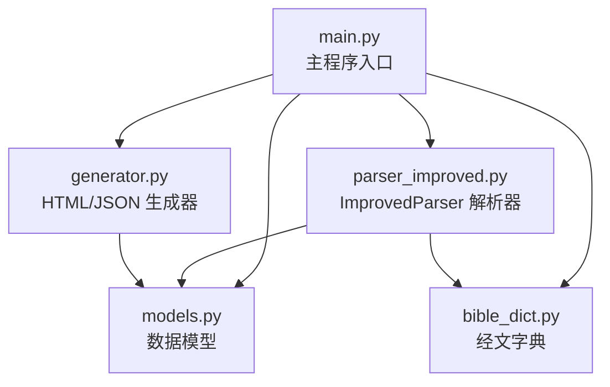
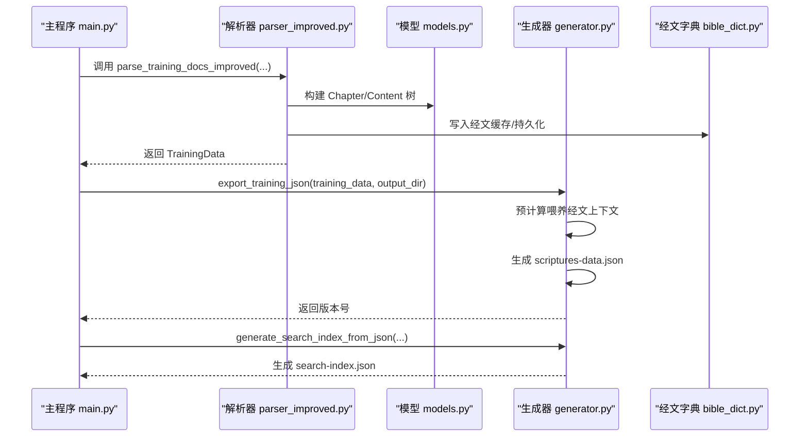
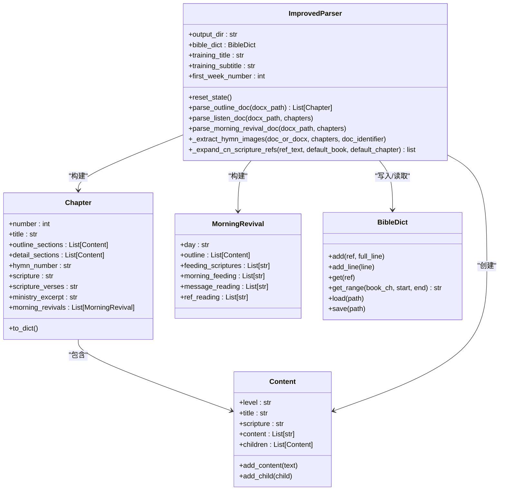
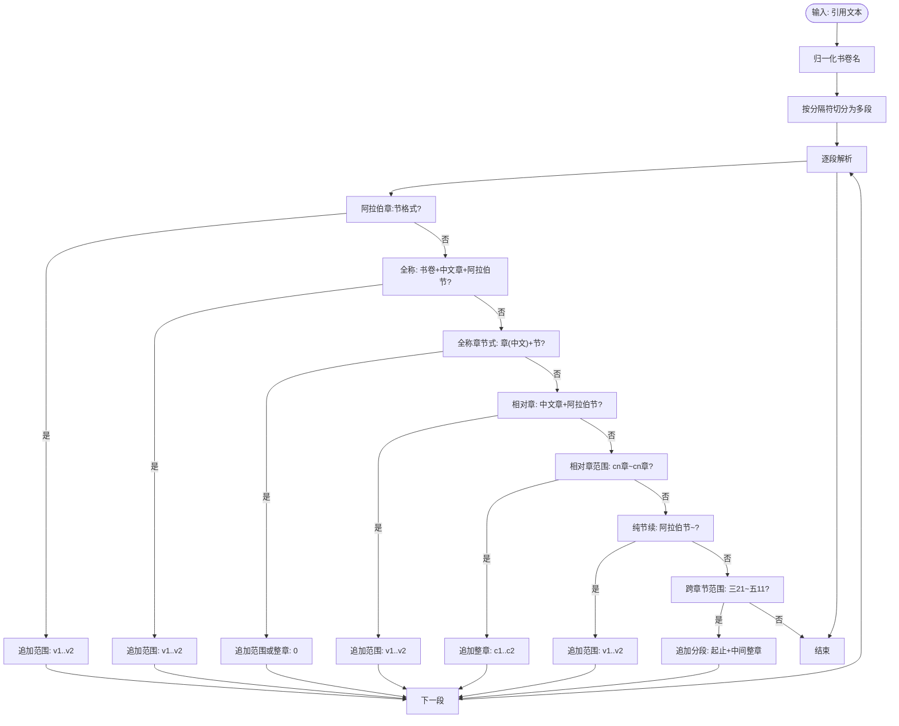
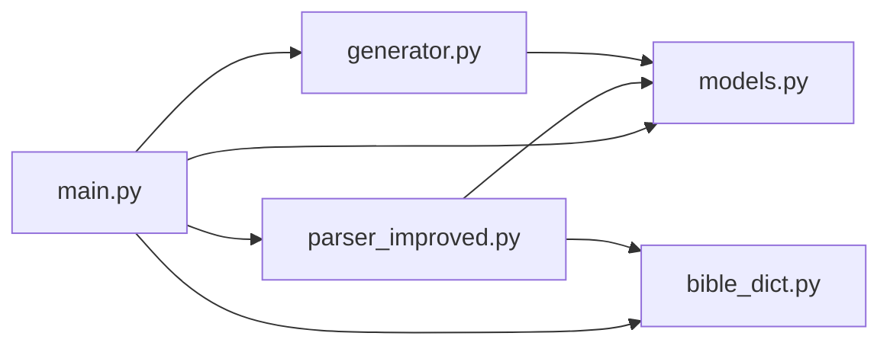

# 核心模块

<cite>
**本文引用的文件**
- [main.py](file://main.py)
- [parser_improved.py](file://src/parser_improved.py)
- [models.py](file://src/models.py)
- [generator.py](file://src/generator.py)
- [bible_dict.py](file://src/bible_dict.py)
</cite>

## 目录
1. [简介](#简介)
2. [项目结构](#项目结构)
3. [核心组件](#核心组件)
4. [架构总览](#架构总览)
5. [详细组件分析](#详细组件分析)
6. [依赖分析](#依赖分析)
7. [性能考虑](#性能考虑)
8. [故障排查指南](#故障排查指南)
9. [结论](#结论)
10. [附录](#附录)

## 简介
本文件面向 CX 项目的“核心模块”，系统性阐述四个关键 Python 模块：ImprovedParser 文档解析器、TrainingData 数据模型、Generator 静态网站生成器、BibleDict 经文字典管理。文档从设计模式、关键算法与数据结构入手，解释模块间的依赖与交互流程，提供使用示例与最佳实践指引，并覆盖性能、错误处理与扩展性建议，兼顾初学者与高级开发者的需求。

## 项目结构
- 源代码位于 src/ 目录，包含四大核心模块：
  - parser_improved.py：改进的 Word 文档解析器，负责从经文、听抄、晨兴等文档中抽取结构化内容。
  - models.py：训练数据的领域模型，定义章节、大纲、晨兴等数据结构。
  - generator.py：HTML/JSON 生成器，负责将训练数据渲染为 SPA JSON 与搜索索引。
  - bible_dict.py：经文字典，提供经文的增删查与持久化能力。
- 主程序 main.py 负责批量扫描资源、调用解析与生成流程、产出最终的静态站点与索引。

图表来源
- [main.py:655-901](file://main.py#L655-L901)
- [parser_improved.py:114-283](file://src/parser_improved.py#L114-L283)
- [models.py:9-232](file://src/models.py#L9-L232)
- [generator.py:22-545](file://src/generator.py#L22-L545)
- [bible_dict.py:19-96](file://src/bible_dict.py#L19-L96)

章节来源
- [main.py:655-901](file://main.py#L655-L901)

## 核心组件
- ImprovedParser（改进的解析器）
  - 功能：解析 Word 文档（.doc/.docx），抽取经文、纲目、详细内容、晨兴喂养/信息选读/参读、诗歌图片等，构建 TrainingData/Chapter/Content 结构。
  - 设计要点：双策略解析（样式驱动 vs 文本特征驱动）、跨页续接合并、经文范围缓存与持久化字典联动、多格式图片提取。
- TrainingData（训练数据模型）
  - 功能：承载整套训练数据，提供章节聚合、序列化、大纲/详细内容转换等。
  - 设计要点：dataclass + 递归结构，支持大纲树与正文段落的双向转换。
- Generator（静态网站生成器）
  - 功能：生成 SPA 所需的 training.json，预计算喂养经文上下文，生成搜索索引，复制共享静态资源。
  - 设计要点：Jinja2 模板环境、自定义过滤器、经文数据去重与半节补全。
- BibleDict（经文字典）
  - 功能：维护经文的增删查与持久化，支持增量加载与保存。
  - 设计要点：键值对存储、正则匹配、范围查询、幂等写入。

章节来源
- [parser_improved.py:114-283](file://src/parser_improved.py#L114-L283)
- [models.py:9-232](file://src/models.py#L9-L232)
- [generator.py:22-545](file://src/generator.py#L22-L545)
- [bible_dict.py:19-96](file://src/bible_dict.py#L19-L96)

## 架构总览
整体流程：主程序扫描资源批次 → 调用解析器生成训练数据 → 生成 SPA JSON 与搜索索引 → 复制静态资源 → 产出最终站点。

图表来源
- [main.py:205-314](file://main.py#L205-L314)
- [main.py:266-277](file://main.py#L266-L277)
- [generator.py:382-424](file://src/generator.py#L382-L424)
- [generator.py:427-545](file://src/generator.py#L427-L545)

## 详细组件分析

### ImprovedParser 文档解析器
- 设计模式
  - 状态机风格：通过 reset_state 与 current_* 指针管理解析状态，逐段推进。
  - 策略模式：样式驱动与文本特征驱动双通道，自动识别 Summer/Autumn 格式差异。
  - 观察者/回调：对经文、纲目、正文、晨兴内容分别建立回调式收集逻辑。
- 关键算法
  - 跨页续接合并：_should_merge_with_previous 基于标点、缩进、长度与层级标记综合判断。
  - 中文章节引用解析：_expand_cn_scripture_refs 支持全称/简称/相对章/纯节续/跨章范围等多形态。
  - 诗歌图片提取：基于段落邻近度分组，自动定位每篇诗歌图片集合。
- 数据结构
  - 递归 Content 树：Chapter.outline_sections/detail_sections/morning_revivals 均由 Content 组成。
  - verse_cache：解析过程中的经文范围缓存，提升“从略”还原效率。
  - _day_outlines：按天存储纲目，供晨兴内容分配。
- 交互关系
  - 依赖 models：创建 Chapter/Content/MorningRevival。
  - 依赖 bible_dict：写入经文、读取范围内容。
  - 依赖自身工具方法：中文数字转换、书卷名归一化、引用展开等。

图表来源
- [parser_improved.py:114-283](file://src/parser_improved.py#L114-L283)
- [parser_improved.py:952-1303](file://src/parser_improved.py#L952-L1303)
- [parser_improved.py:1908-2044](file://src/parser_improved.py#L1908-L2044)
- [parser_improved.py:2208-2399](file://src/parser_improved.py#L2208-L2399)
- [models.py:9-232](file://src/models.py#L9-L232)
- [bible_dict.py:19-96](file://src/bible_dict.py#L19-L96)

章节来源
- [parser_improved.py:114-283](file://src/parser_improved.py#L114-L283)
- [parser_improved.py:952-1303](file://src/parser_improved.py#L952-L1303)
- [parser_improved.py:1908-2044](file://src/parser_improved.py#L1908-L2044)
- [parser_improved.py:2208-2399](file://src/parser_improved.py#L2208-L2399)
- [models.py:9-232](file://src/models.py#L9-L232)
- [bible_dict.py:19-96](file://src/bible_dict.py#L19-L96)

#### 经文引用解析流程（算法）

图表来源
- [parser_improved.py:2208-2399](file://src/parser_improved.py#L2208-L2399)

### TrainingData 数据模型
- 设计要点
  - dataclass 简化字段定义与序列化，to_dict 支持模板渲染。
  - _sections_to_dict 递归转换大纲树，_extract_feeding_scriptures 分离经文与正文。
  - _extract_ref_keys 从“经文+正文”混合文本中提取引用键列表。
- 使用场景
  - 作为解析器输出的统一载体，贯穿生成器阶段。
  - 作为 SPA JSON 的基础结构，供前端渲染。

章节来源
- [models.py:9-232](file://src/models.py#L9-L232)

### Generator 静态网站生成器
- 设计要点
  - HTMLGenerator：Jinja2 环境、自定义过滤器（提取星期、纲目层级类名）。
  - _compute_feeding_refs_list：基于上下文传播，为喂养经文列表预计算 data-refs。
  - _generate_scriptures_data_json：仅输出全本圣经中没有的补充经文，减少前端体积。
  - generate_search_index_from_json：从 training.json 生成搜索索引，支持多视图类型。
- 与解析器协作
  - 复用解析器的经文引用展开能力，保证上下文一致性。
  - 读取 output/data/bible-text.json 以过滤重复经文。

章节来源
- [generator.py:22-545](file://src/generator.py#L22-L545)

### BibleDict 经文字典管理
- 设计要点
  - add/add_line：幂等写入，避免覆盖既有条目。
  - get/get_range：快速检索与范围拼接。
  - load/save：增量加载与排序持久化，支持跨批次累积。
- 与解析器协作
  - 解析器在遇到“从略”占位符时，优先从持久化字典补全范围经文。
  - 生成器在 scripts-data.json 中仅输出全本圣经中缺失的条目。

章节来源
- [bible_dict.py:19-96](file://src/bible_dict.py#L19-L96)

## 依赖分析
- 模块耦合
  - parser_improved.py 与 models.py：强耦合（构建数据结构）。
  - parser_improved.py 与 bible_dict.py：弱耦合（读写经文缓存）。
  - generator.py 与 models.py：强耦合（序列化与上下文计算）。
  - main.py 与上述模块：编排层，负责批量处理与资源复制。
- 外部依赖
  - python-docx：解析 .docx。
  - Jinja2：模板渲染。
  - PIL：图片提取与保存。
  - LibreOffice：.doc 转 .docx（可选）。

图表来源
- [main.py:655-901](file://main.py#L655-L901)
- [parser_improved.py:114-283](file://src/parser_improved.py#L114-L283)
- [models.py:9-232](file://src/models.py#L9-L232)
- [generator.py:22-545](file://src/generator.py#L22-L545)
- [bible_dict.py:19-96](file://src/bible_dict.py#L19-L96)

章节来源
- [main.py:655-901](file://main.py#L655-L901)

## 性能考虑
- 解析阶段
  - 正则预编译与书卷名归一化（从长到短）降低匹配成本。
  - 跨页续接合并采用启发式规则，避免过度拼接导致内存膨胀。
  - verse_cache 与 BibleDict 双层缓存，减少重复解析与 IO。
- 生成阶段
  - scriptures-data.json 仅输出全本圣经缺失条目，显著降低前端体积。
  - 搜索索引直接从 JSON 读取，避免解析 HTML 的额外开销。
- I/O 优化
  - 图片提取采用邻近度分组，减少多次 IO。
  - 静态资源复制集中执行，避免重复拷贝。

## 故障排查指南
- .doc 文件无法解析
  - 现象：提示无法自动转换或手动转换。
  - 处理：安装 LibreOffice 或手动另存为 .docx；或使用 win32com（Windows）读取 .doc。
  - 参考路径：[parser_improved.py:35-112](file://src/parser_improved.py#L35-L112)、[parser_improved.py:1851-1906](file://src/parser_improved.py#L1851-L1906)
- 经文“从略”无法还原
  - 现象：纲目中出现“腓2:5~11 从略。”但页面未显示范围经文。
  - 处理：确认解析器已将范围经文写入 verse_cache 或持久化字典；检查 BibleDict 是否加载成功。
  - 参考路径：[parser_improved.py:308-365](file://src/parser_improved.py#L308-L365)、[bible_dict.py:65-86](file://src/bible_dict.py#L65-L86)
- 晨兴纲目错配
  - 现象：某天纲目为空或与预期不符。
  - 处理：检查 _day_outlines 分配逻辑；确认 Summer/Autumn 格式识别是否正确。
  - 参考路径：[parser_improved.py:1280-1303](file://src/parser_improved.py#L1280-L1303)、[parser_improved.py:1680-1732](file://src/parser_improved.py#L1680-L1732)
- 生成 scripts-data.json 失败
  - 现象：生成器抛出异常或输出为空。
  - 处理：确认 output/data/bible-text.json 是否存在；检查过滤逻辑与半节补全。
  - 参考路径：[generator.py:333-372](file://src/generator.py#L333-L372)、[generator.py:268-279](file://src/generator.py#L268-L279)

章节来源
- [parser_improved.py:35-112](file://src/parser_improved.py#L35-L112)
- [parser_improved.py:1851-1906](file://src/parser_improved.py#L1851-L1906)
- [parser_improved.py:308-365](file://src/parser_improved.py#L308-L365)
- [bible_dict.py:65-86](file://src/bible_dict.py#L65-L86)
- [parser_improved.py:1280-1303](file://src/parser_improved.py#L1280-L1303)
- [parser_improved.py:1680-1732](file://src/parser_improved.py#L1680-L1732)
- [generator.py:333-372](file://src/generator.py#L333-L372)
- [generator.py:268-279](file://src/generator.py#L268-L279)

## 结论
本项目通过 ImprovedParser 的高鲁棒性解析、TrainingData 的清晰模型、Generator 的高效生成与 BibleDict 的持久化能力，形成了一条从 Word 文档到 SPA JSON 的完整流水线。模块间职责明确、耦合可控，具备良好的扩展性与可维护性。建议在生产环境中结合缓存与增量处理，进一步优化大规模批次的处理效率。

## 附录
- 使用示例（步骤说明）
  - 准备资源：在 resource/ 下按“年-月 训练类型”组织 Word 文档（经文、听抄、晨兴）。
  - 运行主程序：python main.py，自动扫描并处理指定批次。
  - 产物：每个批次输出 training.json、images/、js/、css/ 等；总主页输出在 output/index.html。
- 最佳实践
  - 保持书卷名书写规范，减少归一化歧义。
  - 对于 .doc 文件，优先转换为 .docx 以获得稳定解析体验。
  - 合理使用“从略”占位符，确保经文范围可还原。
  - 控制搜索索引生成频率，避免频繁 I/O。
- 扩展建议
  - 支持更多文档格式（如 .rtf）。
  - 增加单元测试与集成测试，覆盖复杂引用与跨页续接场景。
  - 引入并发解析与分片生成，提升大批量处理吞吐。