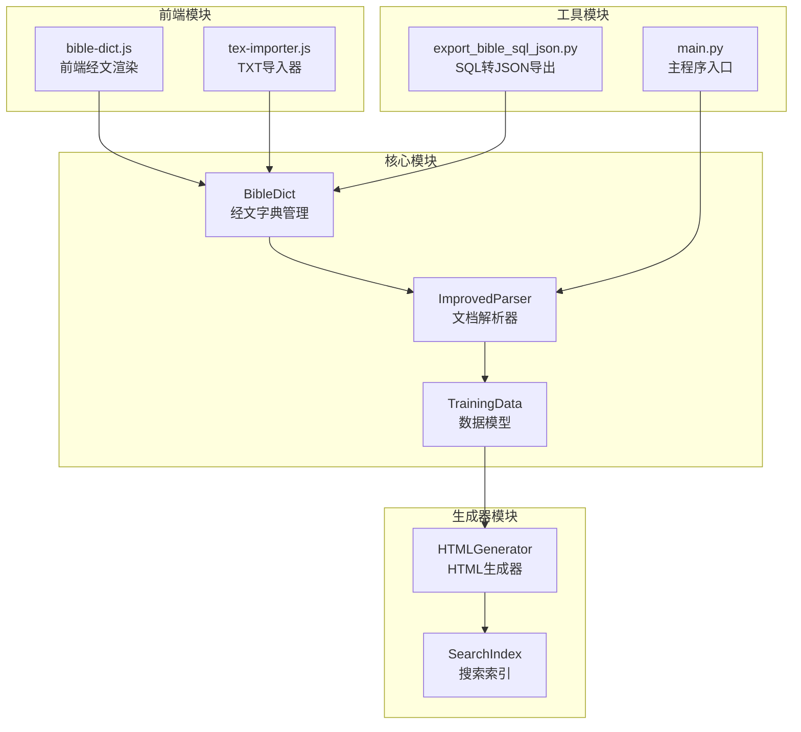
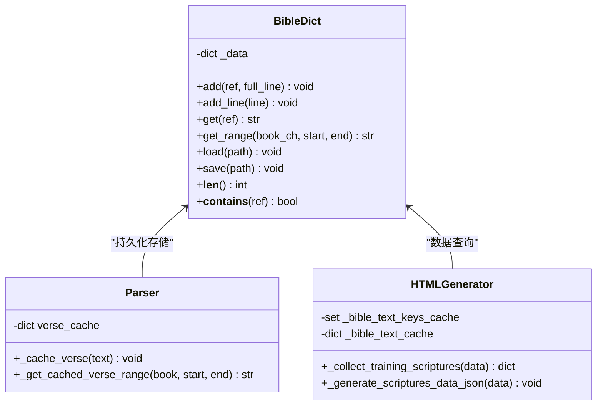
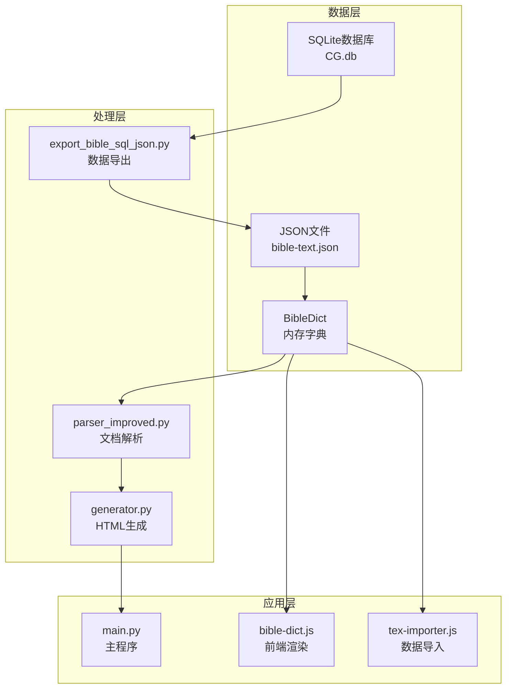
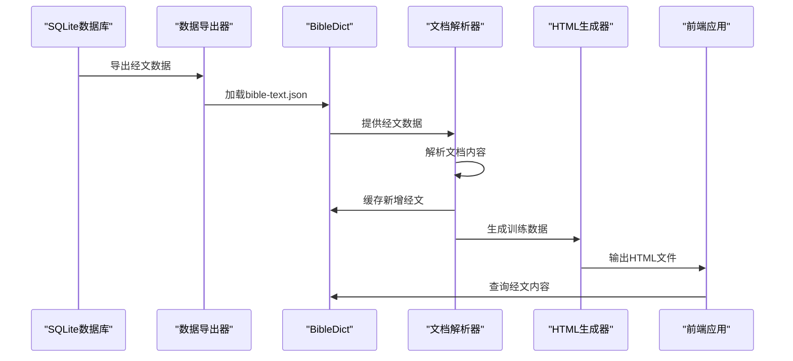
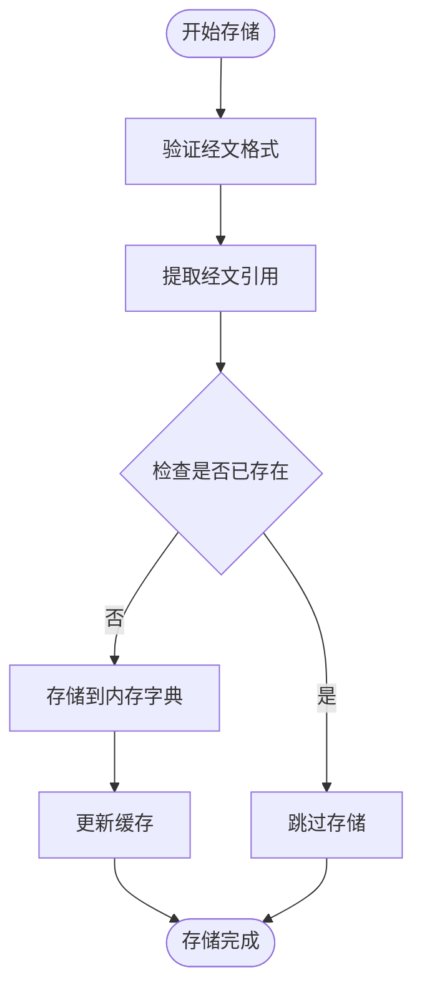
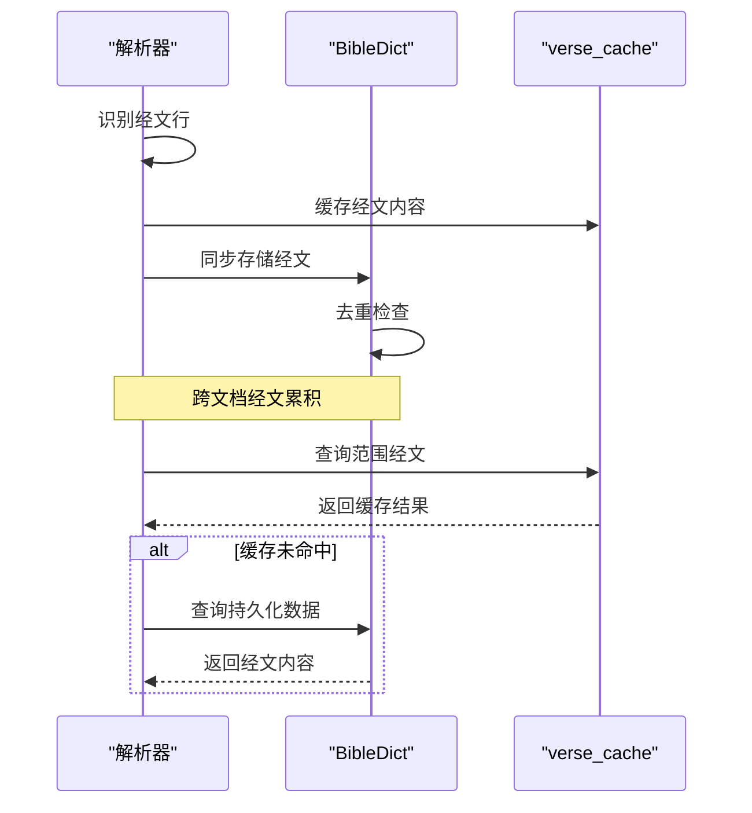
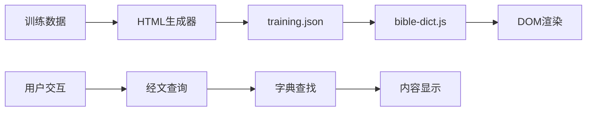
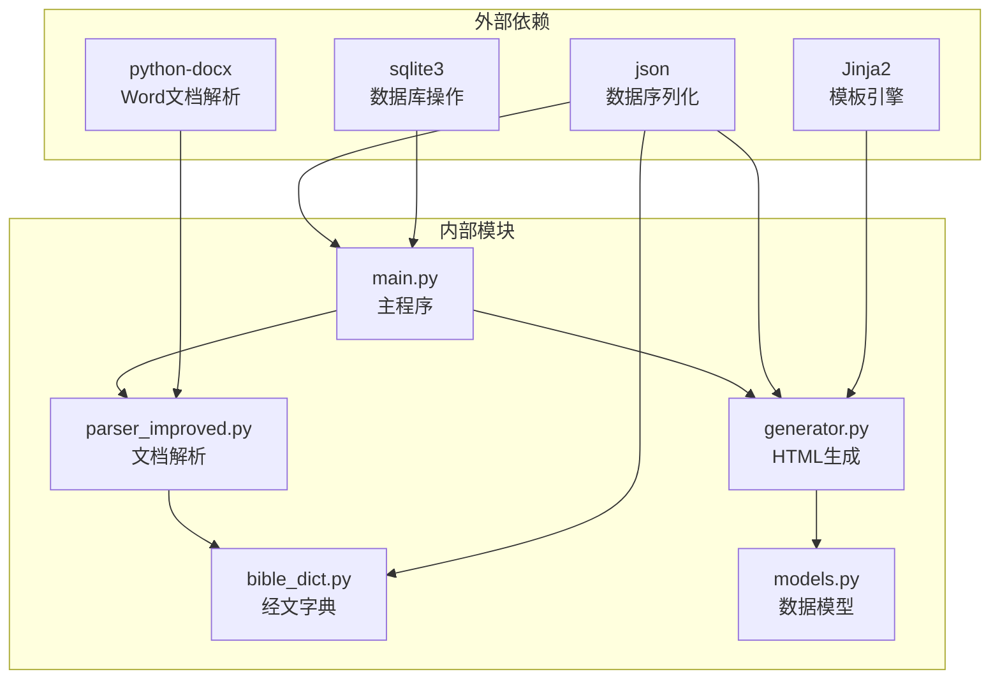
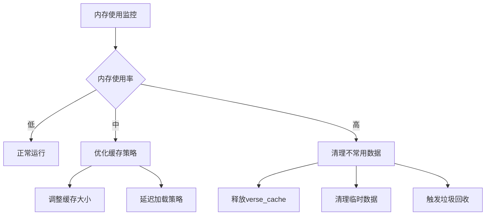

# 经文字典管理

<cite>
**本文档引用的文件**
- [bible_dict.py](file://src/bible_dict.py)
- [parser_improved.py](file://src/parser_improved.py)
- [generator.py](file://src/generator.py)
- [main.py](file://main.py)
- [export_bible_sql_json.py](file://export_bible_sql_json.py)
- [bible-dict.js](file://src/static/js/bible-dict.js)
- [txt-importer.js](file://src/static/js/txt-importer.js)
</cite>

## 目录
1. [简介](#简介)
2. [项目结构](#项目结构)
3. [核心组件](#核心组件)
4. [架构概览](#架构概览)
5. [详细组件分析](#详细组件分析)
6. [依赖分析](#依赖分析)
7. [性能考虑](#性能考虑)
8. [故障排除指南](#故障排除指南)
9. [结论](#结论)

## 简介

经文字典管理系统是一个专门用于管理和检索圣经经文的系统。该系统的核心是BibleDict类，它提供了经文的存储、检索、持久化和缓存功能。系统采用增量累积的方式，随每次构建过程不断丰富经文数据库，同时支持与解析器的紧密协作，确保经文数据的一致性和完整性。

该系统主要服务于静态网站生成器，为训练材料的解析和展示提供可靠的经文数据支撑。通过多层次的数据结构设计和优化的查询算法，系统能够高效处理大量的经文数据，并提供灵活的检索接口。

## 项目结构

项目采用模块化的组织结构，主要包含以下几个核心模块：

**图表来源**
- [bible_dict.py:1-96](file://src/bible_dict.py#L1-L96)
- [parser_improved.py:1-800](file://src/parser_improved.py#L1-L800)
- [generator.py:1-545](file://src/generator.py#L1-L545)
- [main.py:1-901](file://main.py#L1-L901)

**章节来源**
- [bible_dict.py:1-96](file://src/bible_dict.py#L1-L96)
- [parser_improved.py:1-800](file://src/parser_improved.py#L1-L800)
- [generator.py:1-545](file://src/generator.py#L1-L545)
- [main.py:1-901](file://main.py#L1-L901)

## 核心组件

### BibleDict类设计

BibleDict是整个系统的核心组件，负责经文数据的持久化存储和管理。其设计遵循简洁高效的原则，采用字典结构存储经文数据。

#### 数据结构设计

**图表来源**
- [bible_dict.py:19-96](file://src/bible_dict.py#L19-L96)
- [parser_improved.py:337-365](file://src/parser_improved.py#L337-L365)
- [generator.py:213-247](file://src/generator.py#L213-L247)

#### 关键特性

1. **增量累积存储**：支持随构建过程增量添加经文数据
2. **双重缓存机制**：内存缓存vs持久化存储的双重保障
3. **智能去重**：避免重复条目的覆盖
4. **范围查询**：支持按章节范围的批量检索

**章节来源**
- [bible_dict.py:19-96](file://src/bible_dict.py#L19-L96)

### 经文格式规范

系统支持多种经文格式，确保与不同来源的文档兼容：

| 格式类型 | 示例 | 描述 |
|---------|------|------|
| 标准格式 | "太5:3 话语内容" | 书卷+章节+节号的标准格式 |
| 中文数字 | "太五3 话语内容" | 使用中文数字的简化格式 |
| 范围格式 | "腓2:5~11 话语内容" | 支持经文范围的连续格式 |
| 上下中格式 | "腓2:5上 话语内容" | 支持半节标记的格式 |

**章节来源**
- [bible_dict.py:12-16](file://src/bible_dict.py#L12-L16)
- [parser_improved.py:142-144](file://src/parser_improved.py#L142-L144)

## 架构概览

系统采用分层架构设计，从底层的数据存储到上层的应用逻辑形成清晰的层次结构：

**图表来源**
- [export_bible_sql_json.py:1-508](file://export_bible_sql_json.py#L1-L508)
- [parser_improved.py:1-800](file://src/parser_improved.py#L1-L800)
- [generator.py:1-545](file://src/generator.py#L1-L545)
- [main.py:1-901](file://main.py#L1-L901)

### 数据流处理

系统的数据流遵循"导入-处理-存储-查询"的完整循环：

**图表来源**
- [export_bible_sql_json.py:353-477](file://export_bible_sql_json.py#L353-L477)
- [parser_improved.py:2548-2577](file://src/parser_improved.py#L2548-L2577)
- [generator.py:382-424](file://src/generator.py#L382-L424)

## 详细组件分析

### BibleDict类详细分析

BibleDict类是经文字典管理的核心，提供了完整的经文生命周期管理功能。

#### 存储结构设计

**图表来源**
- [bible_dict.py:33-42](file://src/bible_dict.py#L33-L42)

#### 查询优化策略

系统采用了多层次的查询优化策略：

1. **内存缓存优先**：首先查询内存中的verse_cache
2. **持久化回退**：内存未命中时查询BibleDict
3. **范围查询优化**：批量查询相邻节号的经文
4. **正则表达式预编译**：避免重复编译正则表达式

**章节来源**
- [bible_dict.py:48-60](file://src/bible_dict.py#L48-L60)
- [parser_improved.py:350-365](file://src/parser_improved.py#L350-L365)

### 解析器协作机制

解析器与BibleDict的协作是系统的关键设计点：

**图表来源**
- [parser_improved.py:337-348](file://src/parser_improved.py#L337-L348)
- [parser_improved.py:350-365](file://src/parser_improved.py#L350-L365)

#### 跨文档经文处理

系统特别设计了跨文档的经文处理机制：

| 处理场景 | 缓存策略 | 持久化策略 | 处理结果 |
|---------|---------|-----------|---------|
| 同一文档内 | 内存缓存 | 仅内存 | 快速访问 |
| 跨文档经文 | 内存缓存 | 持久化存储 | 数据累积 |
| 范围查询 | 批量缓存 | 持久化回退 | 高效批量 |
| 新增经文 | 同步缓存 | 增量存储 | 实时更新 |

**章节来源**
- [parser_improved.py:276-293](file://src/parser_improved.py#L276-L293)
- [parser_improved.py:337-365](file://src/parser_improved.py#L337-L365)

### 前端集成方案

前端通过bible-dict.js实现经文的动态渲染：

**图表来源**
- [generator.py:382-424](file://src/generator.py#L382-L424)
- [bible-dict.js:42-63](file://src/static/js/bible-dict.js#L42-L63)

**章节来源**
- [bible-dict.js:42-63](file://src/static/js/bible-dict.js#L42-L63)
- [generator.py:333-372](file://src/generator.py#L333-L372)

## 依赖分析

系统采用松耦合的设计原则，各模块之间的依赖关系清晰明确：

**图表来源**
- [parser_improved.py:1-12](file://src/parser_improved.py#L1-L12)
- [generator.py:1-12](file://src/generator.py#L1-L12)
- [main.py:14-16](file://main.py#L14-L16)

### 模块间交互

系统通过明确的接口定义实现模块间的通信：

| 模块 | 主要职责 | 依赖模块 | 被依赖模块 |
|------|----------|----------|-----------|
| BibleDict | 经文存储管理 | json, os, re | parser_improved |
| ImprovedParser | 文档解析处理 | models, bible_dict | generator |
| HTMLGenerator | HTML文件生成 | models, parser_improved | main |
| TrainingData | 数据模型定义 | dataclasses, typing | 所有模块 |
| main | 程序入口控制 | parser_improved, generator, bible_dict | 所有模块 |

**章节来源**
- [bible_dict.py:1-11](file://src/bible_dict.py#L1-L11)
- [parser_improved.py:1-12](file://src/parser_improved.py#L1-L12)
- [generator.py:1-12](file://src/generator.py#L1-L12)
- [main.py:14-16](file://main.py#L14-L16)

## 性能考虑

系统在设计时充分考虑了性能优化，采用多种策略提升整体效率：

### 时间复杂度优化

1. **查询操作**：O(1)平均时间复杂度，基于字典查找
2. **范围查询**：O(n)线性复杂度，其中n为范围大小
3. **持久化操作**：O(m)线性复杂度，其中m为写入条目数
4. **正则匹配**：预编译后O(k)线性复杂度，k为文本长度

### 内存管理策略

### 并发访问处理

系统采用读写分离的并发策略：

1. **读操作优化**：多线程安全的只读访问
2. **写操作保护**：单线程写入，避免竞态条件
3. **缓存一致性**：内存缓存与持久化存储的同步更新
4. **锁机制**：在必要时使用轻量级锁保护共享资源

**章节来源**
- [bible_dict.py:33-42](file://src/bible_dict.py#L33-L42)
- [parser_improved.py:337-348](file://src/parser_improved.py#L337-L348)

## 故障排除指南

### 常见问题及解决方案

#### 经文格式识别问题

**问题描述**：某些经文格式无法被正确识别

**解决方案**：
1. 检查经文格式是否符合标准规范
2. 验证正则表达式的匹配规则
3. 确认特殊字符的编码格式

#### 数据持久化失败

**问题描述**：经文数据无法正确保存到文件

**解决方案**：
1. 检查目标目录的写入权限
2. 验证JSON序列化的编码设置
3. 确认文件路径的有效性

#### 内存溢出问题

**问题描述**：大量经文数据导致内存使用过高

**解决方案**：
1. 实施分批处理策略
2. 定期清理不常用的缓存数据
3. 优化数据结构的内存占用

**章节来源**
- [bible_dict.py:65-86](file://src/bible_dict.py#L65-L86)
- [parser_improved.py:79-78](file://src/parser_improved.py#L79-L78)

### 调试技巧

1. **启用详细日志**：在关键操作点添加日志输出
2. **数据验证**：定期检查数据的完整性和一致性
3. **性能监控**：监控内存使用和处理时间
4. **单元测试**：为关键功能编写测试用例

## 结论

经文字典管理系统通过精心设计的BibleDict类实现了高效的经文管理功能。系统采用多层次的数据结构和优化的查询算法，在保证数据一致性的同时提供了优秀的性能表现。

### 主要优势

1. **设计简洁**：BibleDict类接口简单明了，易于理解和使用
2. **性能优秀**：基于字典的O(1)查询复杂度，支持大规模数据处理
3. **扩展性强**：模块化设计支持功能的灵活扩展
4. **可靠性高**：完善的错误处理和数据校验机制

### 技术特色

1. **增量累积**：支持随构建过程不断丰富经文数据库
2. **智能缓存**：内存缓存与持久化存储的智能结合
3. **范围查询**：高效的批量经文查询能力
4. **前后端协同**：完整的前端渲染和数据导入支持

该系统为圣经经文的管理和应用提供了可靠的技术基础，能够满足各种规模的经文管理需求，并为未来的功能扩展奠定了良好的技术基础。