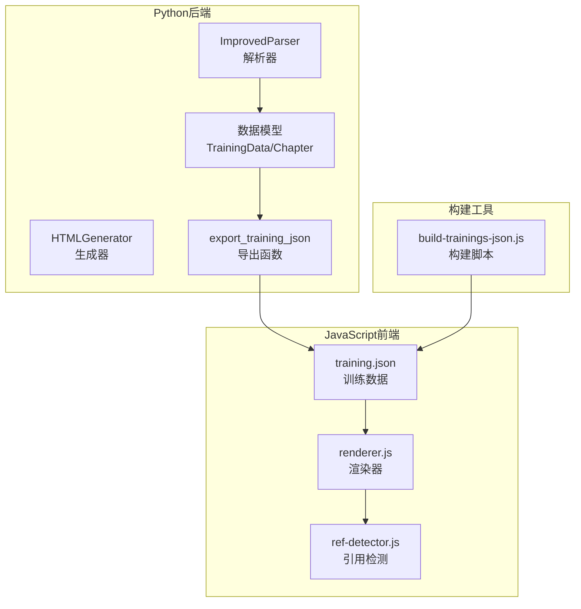
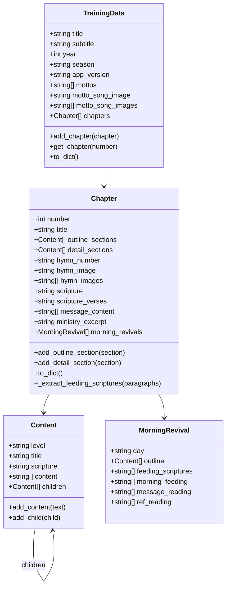
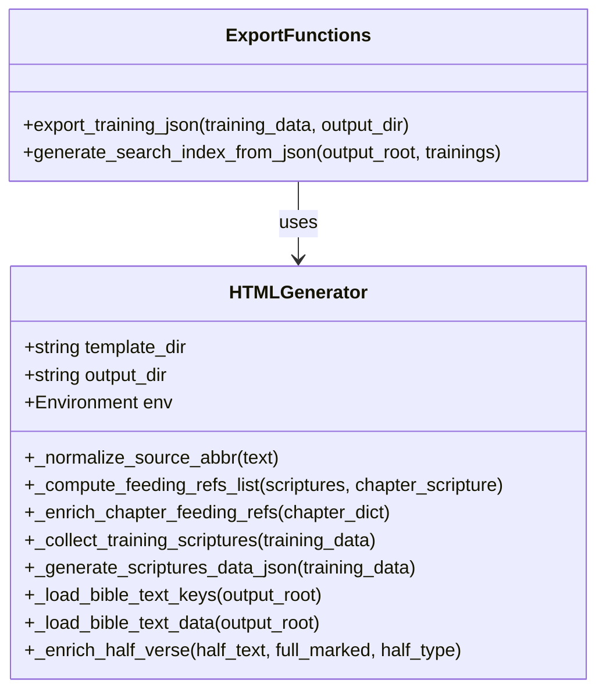
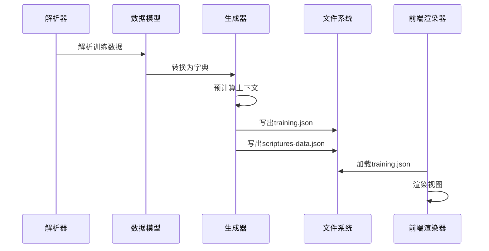
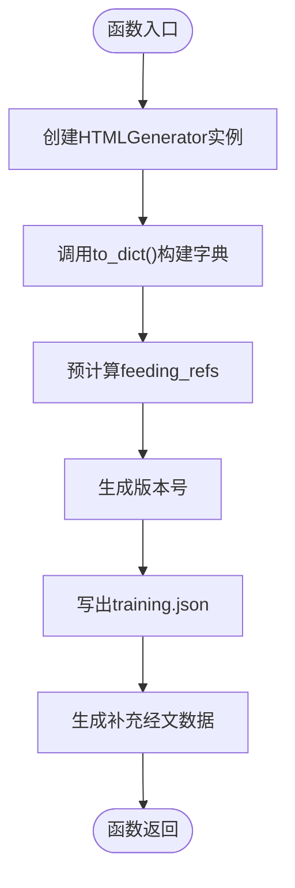
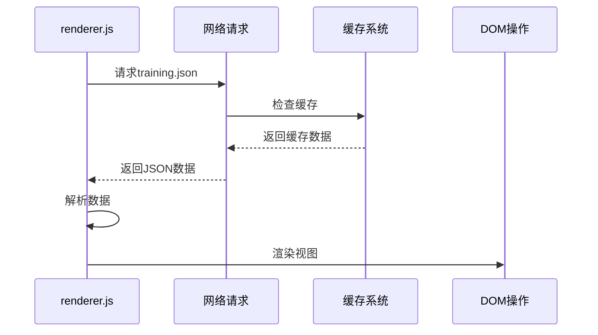
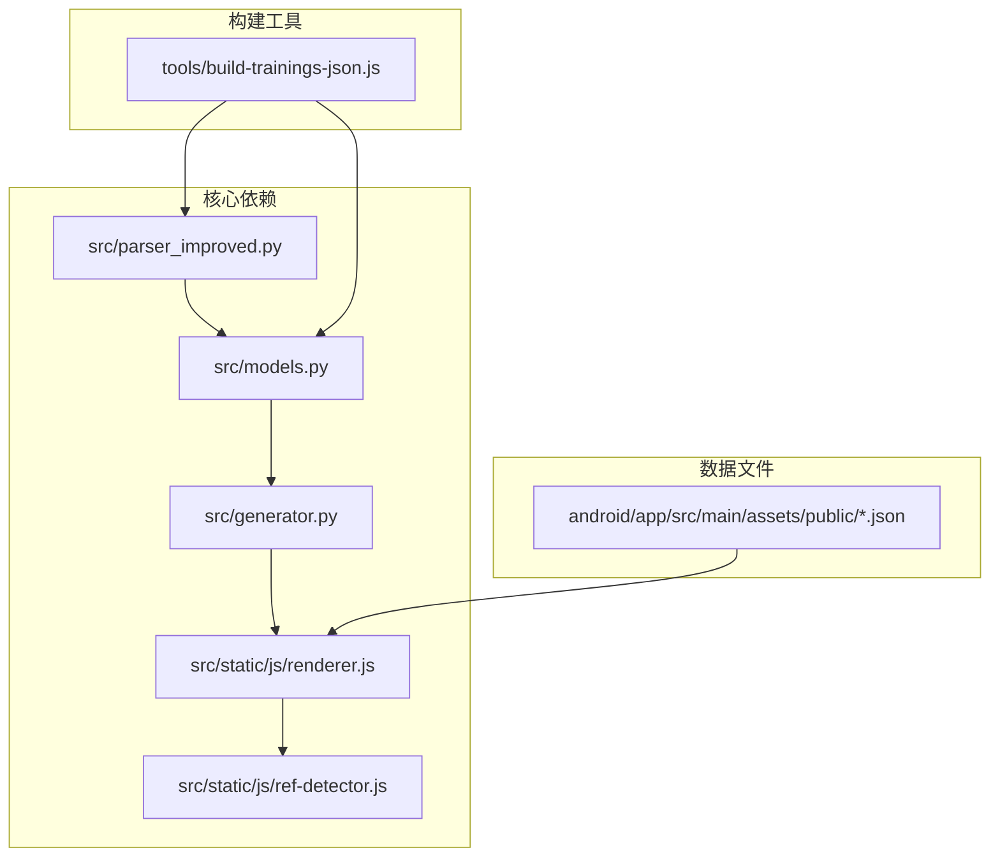

# SPA JSON导出

<cite>
**本文档引用的文件**
- [src/generator.py](file://src/generator.py)
- [src/models.py](file://src/models.py)
- [src/parser_improved.py](file://src/parser_improved.py)
- [tools/build-trainings-json.js](file://tools/build-trainings-json.js)
- [src/static/js/renderer.js](file://src/static/js/renderer.js)
- [src/static/js/ref-detector.js](file://src/static/js/ref-detector.js)
- [android/app/src/main/assets/public/2000-03/training.json](file://android/app/src/main/assets/public/2000-03/training.json)
</cite>

## 目录
1. [简介](#简介)
2. [项目结构](#项目结构)
3. [核心组件](#核心组件)
4. [架构概览](#架构概览)
5. [详细组件分析](#详细组件分析)
6. [依赖分析](#依赖分析)
7. [性能考虑](#性能考虑)
8. [故障排除指南](#故障排除指南)
9. [结论](#结论)
10. [附录](#附录)

## 简介
本文档详细阐述了SPA（单页应用）模式下的JSON导出功能，重点解释training.json的导出流程、数据模型转换、上下文预计算和版本管理机制。文档还深入分析了export_training_json函数的工作原理，包括to_dict()方法的调用、feeding_refs的丰富化处理和版本字符串的生成。同时提供了具体的数据结构处理示例，涵盖章节、内容、纲目等场景，并解释了与前端渲染器的集成方式、数据格式规范和兼容性考虑。最后，文档包含了JSON数据的压缩策略、缓存机制和性能优化技巧。

## 项目结构
该项目采用Python后端与JavaScript前端相结合的SPA架构。核心导出逻辑位于Python模块中，前端渲染器位于JavaScript静态资源中。构建脚本负责处理历史合辑TXT文件并生成训练数据。

**图表来源**
- [src/generator.py:383-425](file://src/generator.py#L383-L425)
- [src/models.py:196-232](file://src/models.py#L196-L232)
- [tools/build-trainings-json.js:1-417](file://tools/build-trainings-json.js#L1-L417)

**章节来源**
- [src/generator.py:1-546](file://src/generator.py#L1-L546)
- [src/models.py:1-232](file://src/models.py#L1-L232)
- [tools/build-trainings-json.js:1-417](file://tools/build-trainings-json.js#L1-L417)

## 核心组件
本节详细介绍SPA JSON导出系统的核心组件及其职责。

### 数据模型层
数据模型层定义了训练数据的结构，包括训练基本信息、章节结构和内容层次。

**图表来源**
- [src/models.py:9-232](file://src/models.py#L9-L232)

### 导出生成器
导出生成器负责将数据模型转换为JSON格式，并进行必要的上下文预计算。

**图表来源**
- [src/generator.py:22-425](file://src/generator.py#L22-L425)

**章节来源**
- [src/models.py:9-232](file://src/models.py#L9-L232)
- [src/generator.py:22-425](file://src/generator.py#L22-L425)

## 架构概览
SPA JSON导出系统采用分层架构设计，实现了数据解析、模型转换、JSON导出和前端渲染的完整流程。

**图表来源**
- [src/generator.py:383-425](file://src/generator.py#L383-L425)
- [src/parser_improved.py:367-782](file://src/parser_improved.py#L367-L782)

## 详细组件分析

### export_training_json函数详解
export_training_json是SPA模式下的核心导出函数，负责将训练数据转换为前端可直接使用的JSON格式。

#### 函数工作流程

**图表来源**
- [src/generator.py:383-425](file://src/generator.py#L383-L425)

#### 数据模型转换
函数首先调用TrainingData.to_dict()方法，将数据模型转换为字典结构：

**章节来源**
- [src/generator.py:383-425](file://src/generator.py#L383-L425)
- [src/models.py:220-232](file://src/models.py#L220-L232)

#### 上下文预计算机制
函数通过_enrich_chapter_feeding_refs方法为每个章节的晨兴喂养经文预计算data-refs：

**章节来源**
- [src/generator.py:136-142](file://src/generator.py#L136-L142)
- [src/generator.py:117-134](file://src/generator.py#L117-L134)

#### 版本管理机制
函数使用当前时间生成版本字符串，格式为YYYYMMDDHHMMSS：

**章节来源**
- [src/generator.py:408-410](file://src/generator.py#L408-L410)

### 数据结构处理示例

#### 章节数据结构
训练数据的基本结构包含章节信息、纲目内容和详细内容：

**章节来源**
- [android/app/src/main/assets/public/2000-03/training.json:10-200](file://android/app/src/main/assets/public/2000-03/training.json#L10-L200)

#### 纲目内容结构
纲目内容采用层级结构，支持多级嵌套：

**章节来源**
- [android/app/src/main/assets/public/2000-03/training.json:17-200](file://android/app/src/main/assets/public/2000-03/training.json#L17-L200)

#### 经文引用处理
系统支持多种经文引用格式，包括中文数字、阿拉伯数字和混合格式：

**章节来源**
- [src/parser_improved.py:147-286](file://src/parser_improved.py#L147-L286)

### 前端渲染器集成
前端渲染器通过renderer.js加载和渲染training.json数据：

**图表来源**
- [src/static/js/renderer.js:49-103](file://src/static/js/renderer.js#L49-L103)

**章节来源**
- [src/static/js/renderer.js:1-200](file://src/static/js/renderer.js#L1-L200)

## 依赖分析
系统各组件之间存在明确的依赖关系，形成了清晰的职责分工。

**图表来源**
- [src/generator.py:10-11](file://src/generator.py#L10-L11)
- [src/parser_improved.py:12-13](file://src/parser_improved.py#L12-L13)

**章节来源**
- [src/generator.py:1-546](file://src/generator.py#L1-L546)
- [src/parser_improved.py:1-800](file://src/parser_improved.py#L1-L800)

## 性能考虑
SPA JSON导出系统在设计时充分考虑了性能优化，采用了多种策略来提升处理效率和用户体验。

### 缓存机制
系统实现了多层次的缓存策略：

1. **类级缓存**：HTMLGenerator类维护_bible_text_keys_cache和_bible_text_cache，避免重复解析bible-text.json
2. **前端缓存**：renderer.js维护_loadTraining缓存，减少重复网络请求
3. **构建时缓存**：build-trainings-json.js懒加载bible-keys集合

### 数据压缩策略
导出的JSON文件采用紧凑格式，移除了不必要的空白字符：

**章节来源**
- [src/generator.py:415](file://src/generator.py#L415)
- [src/generator.py:250-280](file://src/generator.py#L250-L280)

### 异步处理
前端渲染器采用异步加载策略，确保用户体验流畅：

**章节来源**
- [src/static/js/renderer.js:49-103](file://src/static/js/renderer.js#L49-L103)

## 故障排除指南
本节提供常见问题的诊断和解决方法。

### JSON导出失败
当export_training_json函数执行失败时，可能的原因包括：

1. **文件权限问题**：检查输出目录的写入权限
2. **内存不足**：对于大型训练数据，确保有足够的内存空间
3. **编码问题**：确保输入文件使用UTF-8编码

### 前端渲染异常
前端渲染器可能出现的问题：

1. **training.json加载失败**：检查网络连接和文件路径
2. **经文引用显示异常**：验证feeding_refs数据格式
3. **缓存问题**：清除浏览器缓存后重试

**章节来源**
- [src/generator.py:422-423](file://src/generator.py#L422-L423)
- [src/static/js/renderer.js:70-102](file://src/static/js/renderer.js#L70-L102)

## 结论
SPA JSON导出系统通过精心设计的数据模型、高效的导出流程和完善的前端集成，实现了高质量的训练数据呈现。系统的关键优势包括：

1. **模块化设计**：清晰的职责分离使得系统易于维护和扩展
2. **性能优化**：多层缓存和异步处理提升了用户体验
3. **兼容性强**：前后端分离的设计确保了良好的兼容性
4. **数据完整性**：严格的验证机制保证了数据质量

该系统为训练数据的数字化呈现提供了可靠的基础设施，支持大规模数据的高效处理和展示。

## 附录

### 数据格式规范
training.json文件遵循以下格式规范：

1. **顶层字段**：包含训练基本信息和章节数组
2. **章节结构**：支持多级纲目嵌套
3. **经文引用**：支持多种引用格式
4. **元数据**：包含版本信息和时间戳

### 兼容性考虑
系统在设计时充分考虑了以下兼容性要求：

1. **浏览器兼容**：支持主流现代浏览器
2. **移动端适配**：响应式设计适配移动设备
3. **离线访问**：支持Service Worker缓存
4. **无障碍访问**：符合WCAG标准