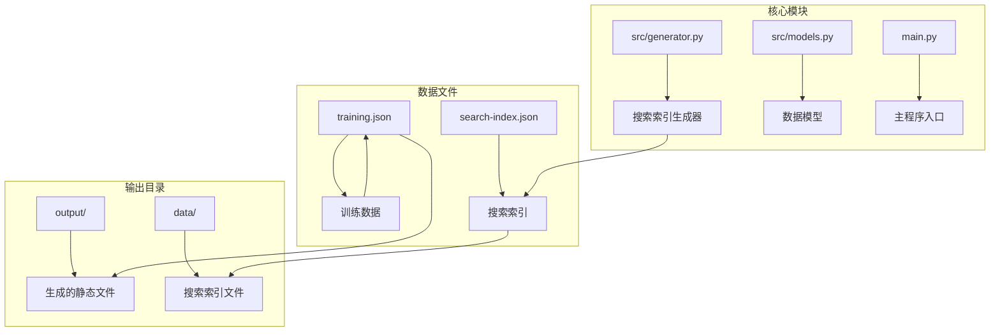
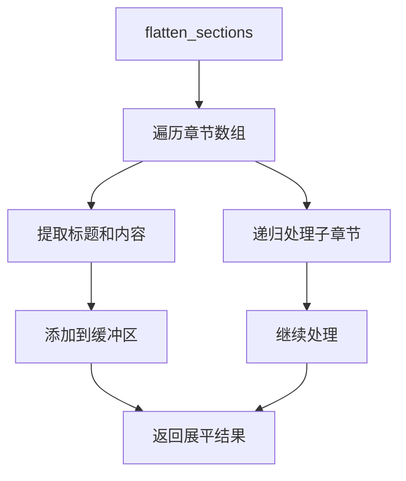
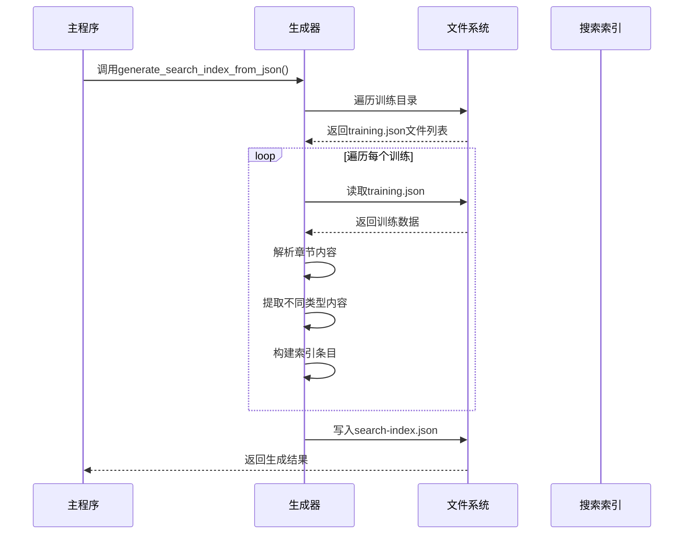
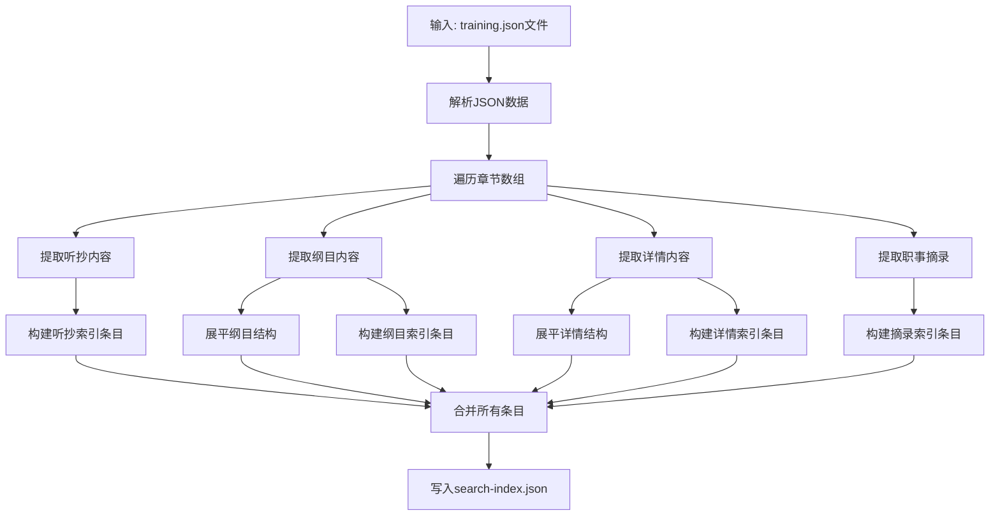
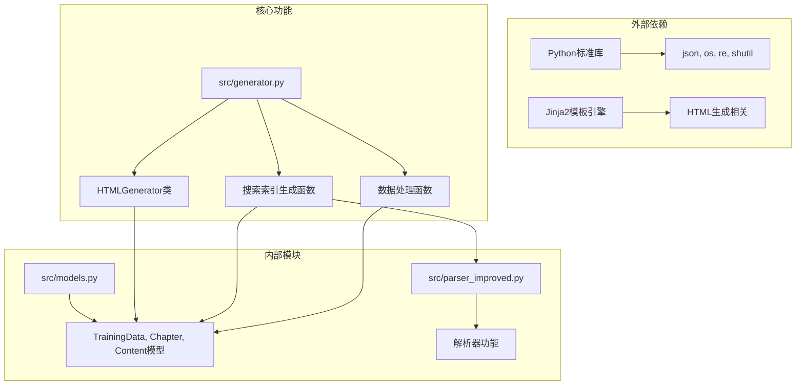
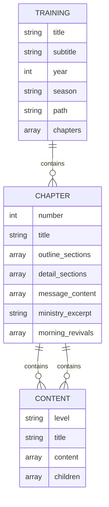

# 搜索索引生成

<cite>
**本文档引用的文件**
- [src/generator.py](file://src/generator.py)
- [src/models.py](file://src/models.py)
- [main.py](file://main.py)
- [android/app/src/main/assets/public/1997-01/training.json](file://android/app/src/main/assets/public/1997-01/training.json)
- [android/app/src/main/assets/public/1998-01/training.json](file://android/app/src/main/assets/public/1998-01/training.json)
- [android/app/src/main/assets/public/1999-01/training.json](file://android/app/src/main/assets/public/1999-01/training.json)
</cite>

## 目录
1. [简介](#简介)
2. [项目结构](#项目结构)
3. [核心组件](#核心组件)
4. [架构概览](#架构概览)
5. [详细组件分析](#详细组件分析)
6. [依赖关系分析](#依赖关系分析)
7. [性能考虑](#性能考虑)
8. [故障排除指南](#故障排除指南)
9. [结论](#结论)
10. [附录](#附录)

## 简介

搜索索引生成功能是整个静态网站生成系统的重要组成部分，负责从训练数据中提取可搜索的内容并生成高效的搜索索引文件。该功能通过分析训练JSON文件中的各种内容类型，构建结构化的搜索索引，为前端搜索功能提供数据支持。

## 项目结构

该项目采用模块化设计，搜索索引生成功能位于专门的生成器模块中：



**图表来源**
- [src/generator.py:428-546](file://src/generator.py#L428-L546)
- [src/models.py:196-232](file://src/models.py#L196-L232)

**章节来源**
- [src/generator.py:1-50](file://src/generator.py#L1-L50)
- [main.py:540-771](file://main.py#L540-L771)

## 核心组件

### 搜索索引生成器

搜索索引生成器是整个功能的核心，负责遍历训练数据、提取内容并构建索引条目。主要组件包括：

#### TYPE_MAP映射表
TYPE_MAP定义了不同类型内容的处理方式和对应的URL格式规范：

```mermaid
flowchart TD
A[TYPE_MAP映射表] --> B[h - 听抄]
A --> C[ts - 详情]
A --> D[cv - 纲目]
A --> E[zs - 职事摘录]
B --> F[message_content<br/>URL: {path}/{num}/h]
C --> G[detail_sections<br/>URL: {path}/{num}/ts]
D --> H[outline_sections<br/>URL: {path}/{num}/cv]
E --> I[ministry_excerpt<br/>URL: {path}/{num}/zs]
```

**图表来源**
- [src/generator.py:436-441](file://src/generator.py#L436-L441)

#### flatten_sections函数
该函数用于递归展平章节结构，提取标题和内容：



**图表来源**
- [src/generator.py:443-451](file://src/generator.py#L443-L451)

#### flatten_sections_content_only函数
专为详情视图设计的函数，仅提取内容段落而不包含标题：

**章节来源**
- [src/generator.py:428-546](file://src/generator.py#L428-L546)

## 架构概览

搜索索引生成的整体架构遵循"数据提取-内容处理-索引构建"的流水线模式：



**图表来源**
- [src/generator.py:428-546](file://src/generator.py#L428-L546)
- [main.py:540-771](file://main.py#L540-L771)

## 详细组件分析

### 数据流处理管道

搜索索引生成器实现了完整的数据流处理管道，从原始训练数据到最终的搜索索引文件：



**图表来源**
- [src/generator.py:464-546](file://src/generator.py#L464-L546)

### 内容提取算法

#### 听抄内容处理
听抄内容是最直接的文本内容，每个段落都会被单独索引：

**章节来源**
- [src/generator.py:486-493](file://src/generator.py#L486-L493)

#### 纲目内容处理
纲目内容需要通过递归展平函数处理嵌套结构：

**章节来源**
- [src/generator.py:495-503](file://src/generator.py#L495-L503)

#### 详情内容处理
详情内容同样需要展平处理，但使用专门的`flatten_sections_content_only`函数：

**章节来源**
- [src/generator.py:505-525](file://src/generator.py#L505-L525)

#### 职事摘录处理
职事摘录作为独立字段直接提取：

**章节来源**
- [src/generator.py:527-534](file://src/generator.py#L527-L534)

### URL格式规范

搜索索引中的URL采用统一的格式规范，确保前端导航的一致性：

| 内容类型 | URL格式 | 说明 |
|---------|---------|------|
| 听抄 | `{path}/{num}/h` | 第一个参数为训练路径，第二个为章节编号，第三个为视图类型 |
| 详情 | `{path}/{num}/ts` | ts代表"详情"视图 |
| 纲目 | `{path}/{num}/cv` | cv代表"纲目"视图 |
| 职事摘录 | `{path}/{num}/zs` | zs代表"职事摘录"视图 |

### 选择器映射

为了支持前端精确的DOM定位，搜索索引为不同内容类型提供了相应的CSS选择器：

| 内容类型 | CSS选择器 | 用途 |
|---------|-----------|------|
| 听抄 | `.content-text` | 定位段落内容元素 |
| 详情 | `.content-text` | 定位段落内容元素 |
| 纲目 | `.outline-item` | 定位纲目项元素 |
| 晨兴喂养 | `.content-text` | 定位喂养内容元素 |
| 信息选读 | `.content-text` | 定位信息选读元素 |

**章节来源**
- [src/generator.py:436-441](file://src/generator.py#L436-L441)

## 依赖关系分析

搜索索引生成功能与其他模块的依赖关系如下：



**图表来源**
- [src/generator.py:1-12](file://src/generator.py#L1-L12)
- [src/models.py:1-10](file://src/models.py#L1-L10)

### 数据模型依赖

搜索索引生成依赖于训练数据模型的结构化表示：

**章节来源**
- [src/models.py:40-100](file://src/models.py#L40-L100)

## 性能考虑

### 内存使用优化

搜索索引生成器采用了多项内存优化策略：

1. **流式处理**: 逐个处理训练文件，避免同时加载所有数据
2. **增量构建**: 索引条目在发现时立即构建和验证
3. **字符串截断**: 内容文本限制在200字符以内，减少内存占用
4. **条件过滤**: 只处理长度≥10字符的内容段落

### 处理复杂度分析

- **时间复杂度**: O(N×M)，其中N为训练文件数量，M为平均章节数量
- **空间复杂度**: O(K)，其中K为索引条目总数
- **I/O复杂度**: O(N)文件读取操作

### 缓存策略

虽然当前实现没有显式的缓存机制，但可以通过以下方式优化：

1. **文件系统缓存**: 利用操作系统文件缓存
2. **进程内缓存**: 在同一进程中复用已解析的数据
3. **增量更新**: 支持基于文件修改时间的增量索引更新

## 故障排除指南

### 常见问题及解决方案

#### 训练文件缺失
**问题**: 指定路径的training.json文件不存在
**解决方案**: 检查输出目录结构，确认训练文件已正确生成

#### JSON解析错误
**问题**: training.json文件格式不正确
**解决方案**: 验证JSON语法，检查特殊字符转义

#### 内存不足
**问题**: 处理大量训练数据时内存溢出
**解决方案**: 实施分批处理或增加系统内存

#### 权限错误
**问题**: 无法写入search-index.json文件
**解决方案**: 检查输出目录权限，确保具有写入权限

**章节来源**
- [src/generator.py:474-477](file://src/generator.py#L474-L477)

## 结论

搜索索引生成功能通过精心设计的数据提取算法和高效的内容处理机制，为整个静态网站提供了强大的搜索能力。该功能具有以下特点：

1. **模块化设计**: 清晰的职责分离和接口定义
2. **可扩展性**: 支持多种内容类型的统一处理
3. **性能优化**: 采用多项内存和处理优化策略
4. **维护友好**: 代码结构清晰，易于理解和修改

未来可以考虑的改进方向包括：实现增量更新机制、添加更多内容类型的处理、优化内存使用和提高处理速度。

## 附录

### 示例数据结构

以下是典型的训练数据结构示例：



**图表来源**
- [src/models.py:40-100](file://src/models.py#L40-L100)

### 配置选项

| 选项 | 类型 | 默认值 | 描述 |
|------|------|--------|------|
| min_length | int | 10 | 内容最小长度阈值 |
| max_text_length | int | 200 | 文本截断长度 |
| output_dir | string | 'output' | 输出目录路径 |