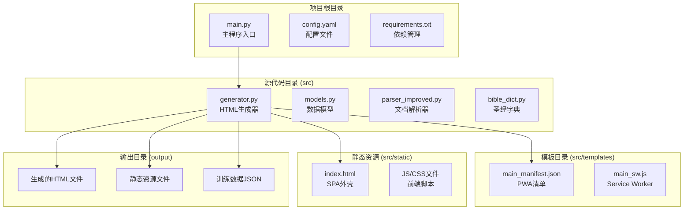
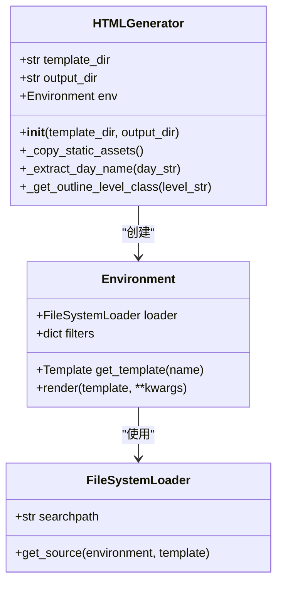
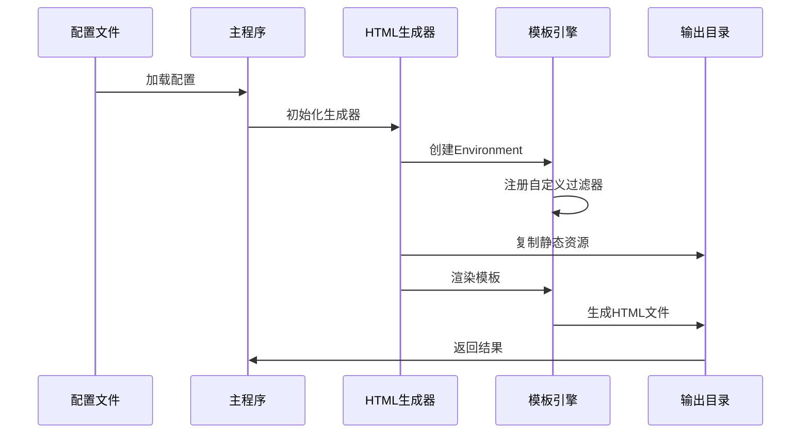
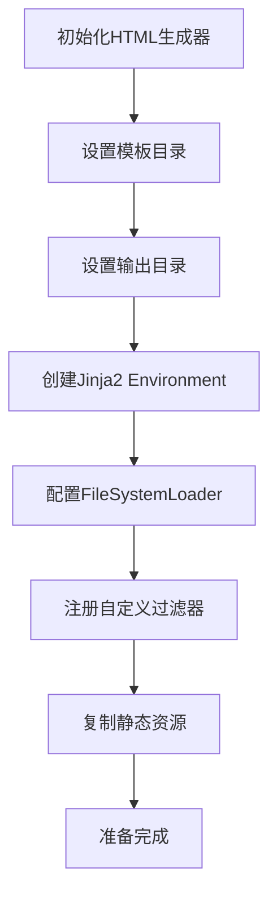
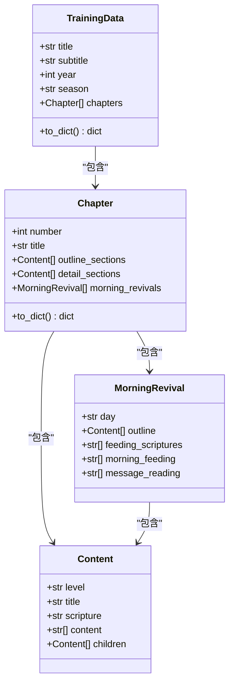
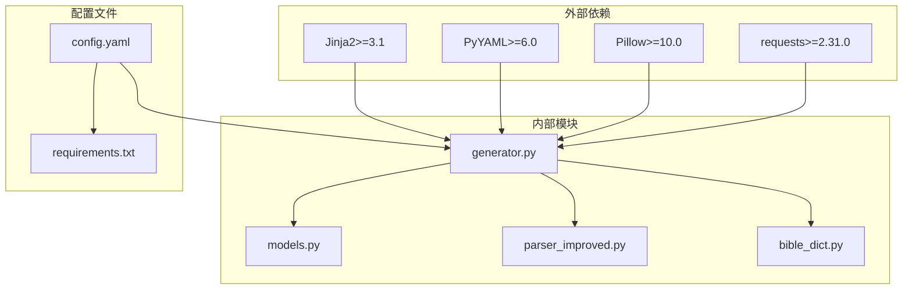

# 模板系统

<cite>
**本文档引用的文件**
- [main.py](file://main.py)
- [generator.py](file://src/generator.py)
- [models.py](file://src/models.py)
- [config.yaml](file://config.yaml)
- [main_manifest.json](file://src/templates/main_manifest.json)
- [main_sw.js](file://src/templates/main_sw.js)
- [index.html](file://src/static/index.html)
- [renderer.js](file://src/static/js/renderer.js)
- [requirements.txt](file://requirements.txt)
</cite>

## 目录
1. [简介](#简介)
2. [项目结构](#项目结构)
3. [核心组件](#核心组件)
4. [架构概览](#架构概览)
5. [详细组件分析](#详细组件分析)
6. [依赖关系分析](#依赖关系分析)
7. [性能考虑](#性能考虑)
8. [故障排除指南](#故障排除指南)
9. [结论](#结论)

## 简介

这是一个基于Python和Jinja2模板引擎的静态网站生成系统，专门用于生成Word文档训练内容的静态网站。系统采用SPA（单页应用程序）架构，结合Python后端的数据处理能力和前端JavaScript的动态渲染能力。

该模板系统的核心特点包括：
- 基于Jinja2的模板引擎配置和使用
- 自定义过滤器的实现和注册机制
- 模板继承体系和宏定义
- 条件渲染逻辑
- 模板与数据模型的绑定过程
- 变量传递机制
- 模板缓存策略

## 项目结构

项目采用清晰的分层架构，主要包含以下目录结构：



**图表来源**
- [main.py:1-800](file://main.py#L1-L800)
- [generator.py:1-546](file://src/generator.py#L1-L546)
- [config.yaml:1-42](file://config.yaml#L1-L42)

**章节来源**
- [main.py:1-800](file://main.py#L1-L800)
- [config.yaml:1-42](file://config.yaml#L1-L42)

## 核心组件

### Jinja2模板引擎配置

系统使用Jinja2作为模板引擎，通过Environment和FileSystemLoader进行配置：



**图表来源**
- [generator.py:22-46](file://src/generator.py#L22-L46)

### 自定义过滤器实现

系统实现了两个关键的自定义过滤器：

1. **extract_day**: 从完整日期字符串中提取星期几信息
2. **outline_level_class**: 根据纲目序号判断CSS类名

**章节来源**
- [generator.py:143-202](file://src/generator.py#L143-L202)

## 架构概览

系统采用前后端分离的架构设计，Python负责数据处理和模板渲染，前端负责动态交互：



**图表来源**
- [main.py:540-771](file://main.py#L540-L771)
- [generator.py:22-46](file://src/generator.py#L22-L46)

## 详细组件分析

### HTML生成器组件

HTML生成器是整个模板系统的核心组件，负责处理模板渲染和静态资源管理：

#### 初始化流程



**图表来源**
- [generator.py:25-46](file://src/generator.py#L25-L46)

#### 自定义过滤器实现

系统实现了两个重要的自定义过滤器：

**extract_day过滤器**
- 功能：从"第一周 • 周一"格式中提取"周一"
- 实现：使用字符串分割操作，提取"•"后的部分
- 应用场景：晨读页面的日期显示

**outline_level_class过滤器**
- 功能：根据纲目序号类型返回对应的CSS类名
- 支持的级别：
  - level-1：壹、I、A（大纲）
  - level-2：一二三四五六七八九十百（中纲）
  - level-3：数字1、2、3（小纲）
  - level-4：小写字母a、b、c（细纲）
  - level-5：括号数字㈠㈡㈢（更细纲）

**章节来源**
- [generator.py:143-202](file://src/generator.py#L143-L202)

### 数据模型绑定

系统使用Python的数据类作为模板数据模型：



**图表来源**
- [models.py:9-232](file://src/models.py#L9-L232)

**章节来源**
- [models.py:64-100](file://src/models.py#L64-L100)

### 模板继承和宏定义

虽然项目中没有直接展示Jinja2模板文件，但系统通过以下方式实现模板继承和宏定义：

1. **模板目录结构**：`src/templates/` 目录包含模板文件
2. **静态资源管理**：通过 `_copy_static_assets()` 方法统一管理
3. **条件渲染**：在前端JavaScript中实现复杂的条件渲染逻辑

### 变量传递机制

系统采用多层次的变量传递机制：

```mermaid
flowchart LR
A[数据模型] --> B[to_dict()转换]
B --> C[Jinja2模板变量]
C --> D[过滤器处理]
D --> E[最终渲染输出]
F[前端JavaScript] --> G[DOM操作]
G --> H[动态内容渲染]
```

**图表来源**
- [models.py:64-100](file://src/models.py#L64-L100)
- [generator.py:143-202](file://src/generator.py#L143-L202)

**章节来源**
- [models.py:64-100](file://src/models.py#L64-L100)

### 模板缓存策略

系统实现了多层次的缓存策略：

1. **前端缓存**：Service Worker缓存策略
2. **后端缓存**：Python对象缓存（如bible-text.json数据）
3. **静态资源缓存**：共享JS/CSS文件的版本控制

**章节来源**
- [generator.py:250-280](file://src/generator.py#L250-L280)
- [main_sw.js:1-171](file://src/templates/main_sw.js#L1-L171)

## 依赖关系分析

系统的关键依赖关系如下：



**图表来源**
- [requirements.txt:1-16](file://requirements.txt#L1-L16)
- [generator.py:9-11](file://src/generator.py#L9-L11)

**章节来源**
- [requirements.txt:1-16](file://requirements.txt#L1-L16)

## 性能考虑

### 模板渲染优化

1. **过滤器缓存**：自定义过滤器结果可以缓存，避免重复计算
2. **静态资源复用**：共享JS/CSS文件减少重复传输
3. **按需加载**：前端JavaScript按需加载，提高首屏速度

### 内存管理

1. **对象池模式**：对于频繁创建的对象（如Content实例）考虑使用对象池
2. **增量处理**：大数据集采用流式处理，避免内存峰值
3. **及时释放**：处理完成后及时释放不需要的中间变量

### 网络优化

1. **Service Worker缓存**：离线访问和缓存策略
2. **压缩传输**：静态资源压缩和Gzip传输
3. **CDN支持**：静态资源可部署到CDN加速

## 故障排除指南

### 常见问题及解决方案

**模板文件找不到**
- 检查模板目录配置是否正确
- 确认模板文件权限设置
- 验证文件编码格式

**过滤器执行错误**
- 检查过滤器参数类型
- 验证输入数据格式
- 查看异常堆栈信息

**静态资源加载失败**
- 检查输出目录权限
- 验证资源路径配置
- 确认文件完整性

**性能问题**
- 监控内存使用情况
- 分析模板渲染时间
- 优化数据模型结构

**章节来源**
- [generator.py:113-115](file://src/generator.py#L113-L115)

## 结论

该模板系统通过精心设计的架构和实现，成功地将Python的数据处理能力和Jinja2模板引擎的优势结合在一起。系统的主要优势包括：

1. **模块化设计**：清晰的组件分离和职责划分
2. **可扩展性**：易于添加新的过滤器和模板功能
3. **性能优化**：多层次的缓存策略和优化措施
4. **维护性**：良好的代码组织和文档结构

通过合理的配置和使用，该系统能够高效地处理大量训练内容的静态网站生成任务，为用户提供优质的阅读体验。