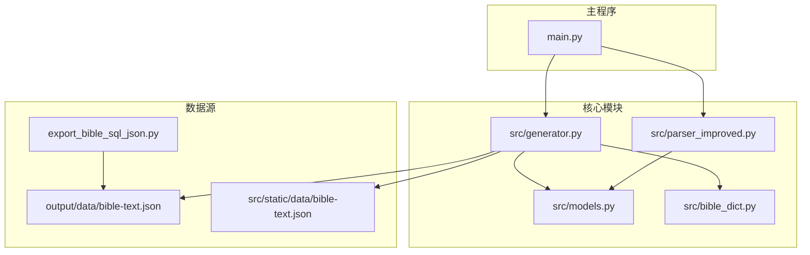
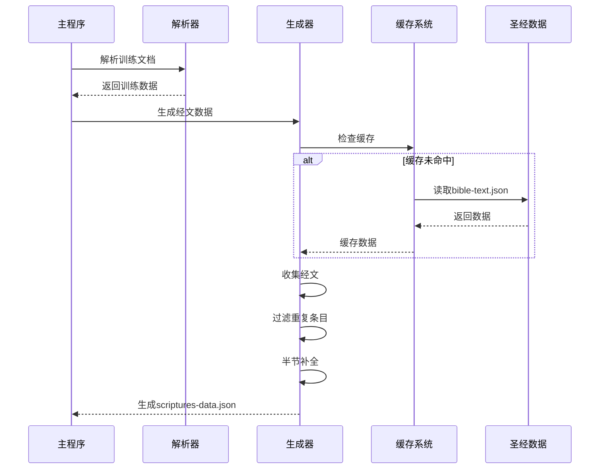
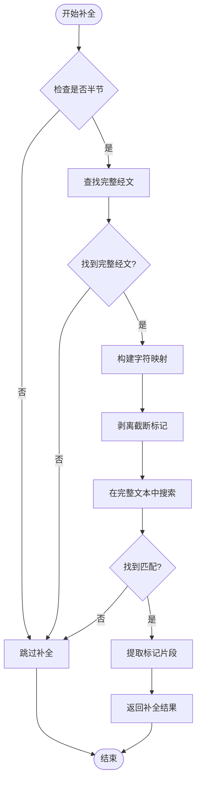
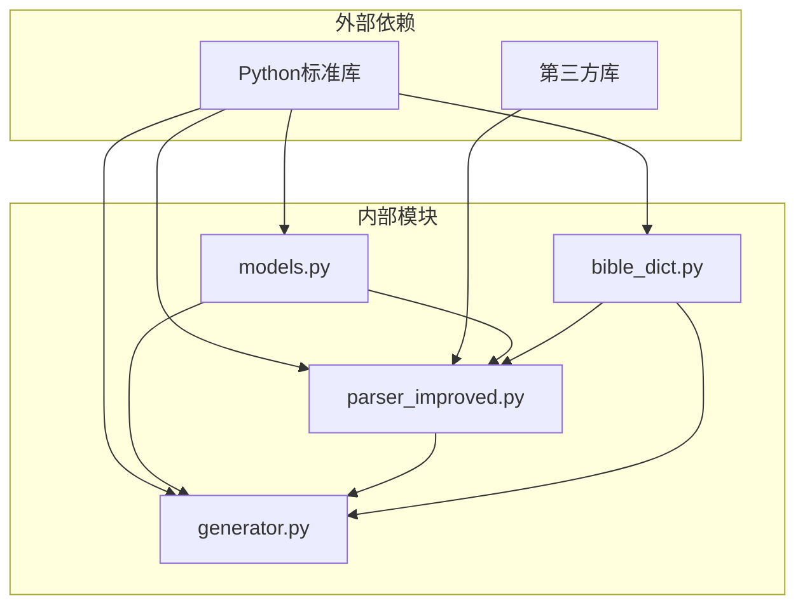
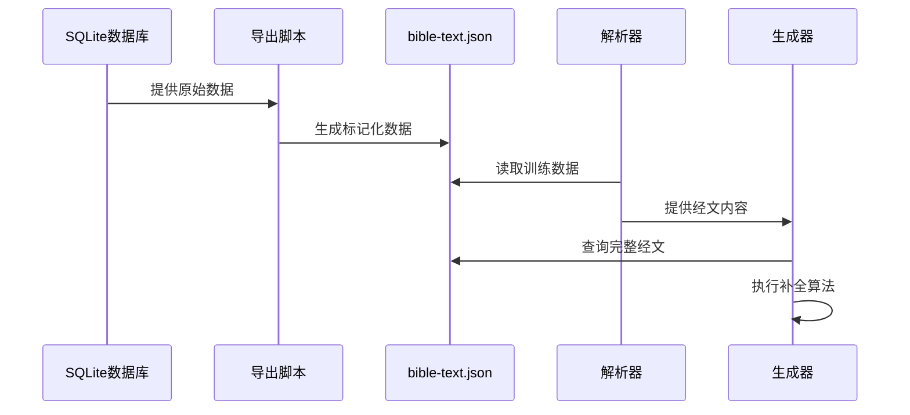

# 经文数据生成

<cite>
**本文档引用的文件**
- [src/generator.py](file://src/generator.py)
- [src/parser_improved.py](file://src/parser_improved.py)
- [src/models.py](file://src/models.py)
- [export_bible_sql_json.py](file://export_bible_sql_json.py)
- [src/bible_dict.py](file://src/bible_dict.py)
- [main.py](file://main.py)
- [output/data/bible-text.json](file://output/data/bible-text.json)
- [src/static/data/bible-text.json](file://src/static/data/bible-text.json)
</cite>

## 目录
1. [简介](#简介)
2. [项目结构](#项目结构)
3. [核心组件](#核心组件)
4. [架构概览](#架构概览)
5. [详细组件分析](#详细组件分析)
6. [依赖分析](#依赖分析)
7. [性能考虑](#性能考虑)
8. [故障排除指南](#故障排除指南)
9. [结论](#结论)

## 简介

本文档详细阐述了经文数据生成功能的技术实现，重点分析了 `scriptures-data.json` 的生成逻辑、缓存机制、半节经文补全策略，以及与 `bible-text.json` 的集成方式。该功能通过解析训练文档中的经文内容，过滤全本圣经中已有的条目，并对半节经文进行标记补全，最终生成补充性的经文数据。

## 项目结构

该项目采用模块化设计，主要涉及以下关键模块：

- **HTML生成器模块** (`src/generator.py`): 负责生成 `scriptures-data.json` 和相关的HTML资源。
- **解析器模块** (`src/parser_improved.py`): 提供改进的Word文档解析能力，支持多种格式和复杂的引用解析。
- **数据模型模块** (`src/models.py`): 定义训练数据、章节、内容等核心数据结构。
- **圣经字典模块** (`src/bible_dict.py`): 提供持久化的经文字典存储和查询功能。
- **导出脚本** (`export_bible_sql_json.py`): 从SQL数据库导出圣经文本、注解和串珠数据。
- **主程序** (`main.py`): 协调整个构建流程，包括文档解析、数据生成和资源复制。



**图表来源**
- [src/generator.py](file://src/generator.py)
- [src/parser_improved.py](file://src/parser_improved.py)
- [src/models.py](file://src/models.py)
- [export_bible_sql_json.py](file://export_bible_sql_json.py)
- [main.py](file://main.py)

**章节来源**
- [src/generator.py](file://src/generator.py)
- [src/parser_improved.py](file://src/parser_improved.py)
- [src/models.py](file://src/models.py)
- [export_bible_sql_json.py](file://export_bible_sql_json.py)
- [main.py](file://main.py)

## 核心组件

### HTML生成器 (HTMLGenerator)

HTML生成器是经文数据生成的核心组件，负责：

- **经文收集**: 遍历训练数据中的所有 scripture 字段，提取经文行并建立字典
- **缓存机制**: 实现类级缓存，避免重复解析 `bible-text.json`
- **半节补全**: 从全本圣经中标记文本中提取半节对应的带标记片段
- **JSON生成**: 生成 `scriptures-data.json` 文件

### 改进解析器 (ImprovedParser)

改进解析器提供强大的文档解析能力：

- **多格式支持**: 支持 `.doc` 和 `.docx` 格式，自动转换 `.doc` 文件
- **引用解析**: 复杂的经文引用解析，支持多种引用格式
- **缓存管理**: 维护经文范围的缓存，提高解析效率
- **样式识别**: 通过样式名称和内容格式双重识别经文

### 数据模型

定义了训练数据的结构化表示：

- **TrainingData**: 训练数据总集，包含标题、副标题、年份、季节等信息
- **Chapter**: 篇章结构，包含纲目、详细内容、经文等
- **Content**: 内容节点，支持多级嵌套
- **MorningRevival**: 晨读内容，包含大纲、经文、喂养等内容

**章节来源**
- [src/generator.py](file://src/generator.py)
- [src/parser_improved.py](file://src/parser_improved.py)
- [src/models.py](file://src/models.py)

## 架构概览

整个经文数据生成系统采用分层架构，各组件职责明确：



**图表来源**
- [main.py](file://main.py)
- [src/generator.py](file://src/generator.py)
- [src/parser_improved.py](file://src/parser_improved.py)

## 详细组件分析

### 经文收集算法

经文收集算法通过递归遍历训练数据结构，提取所有经文条目：


**图表来源**
- [src/generator.py](file://src/generator.py)

#### 关键实现细节

1. **正则表达式匹配**: 使用预编译的正则表达式 `_VERSE_LINE_RE` 来识别经文行
2. **递归遍历**: 通过递归函数遍历章节、大纲、详细内容等结构
3. **去重机制**: 利用字典的键唯一性自动去除重复条目

**章节来源**
- [src/generator.py](file://src/generator.py)

### 缓存机制分析

系统实现了两级缓存机制来提升性能：

#### 类级缓存 (类变量)

```python
_bible_text_keys_cache: set = None   # 类级缓存，避免每个训练重复解析
_bible_text_cache: dict = None       # 类级缓存（带 {N}/[a] 标记的完整数据）
```

#### 缓存工作流程


**图表来源**
- [src/generator.py](file://src/generator.py)

#### 缓存优势

1. **内存效率**: 类级缓存确保同一进程内只加载一次数据
2. **性能提升**: 避免重复的文件I/O操作
3. **一致性保证**: 所有训练共享相同的缓存数据

**章节来源**
- [src/generator.py](file://src/generator.py)

### 半节经文补全策略

半节经文补全是系统的核心功能之一，通过以下步骤实现：

#### 补全算法流程



**图表来源**
- [src/generator.py](file://src/generator.py)

#### 关键技术实现

1. **标记识别**: 使用正则表达式 `\{d+\}|\[a-z\+]` 识别 `{N}` 和 `[a]` 标记
2. **字符映射**: 建立纯文本字符到带标记文本位置的映射关系
3. **精确匹配**: 通过字符位置映射确保标记的正确提取

**章节来源**
- [src/generator.py](file://src/generator.py)

### 与bible-text.json的集成

系统通过以下方式与 `bible-text.json` 集成：

#### 数据格式转换

| 组件 | 输入格式 | 处理逻辑 | 输出格式 |
|------|----------|----------|----------|
| 导出脚本 | SQLite数据库 | 从数据库读取，应用标记 | `bible-text.json` |
| 生成器 | `bible-text.json` | 读取并缓存 | 内存字典 |
| 经文生成 | 训练数据 | 过滤、补全 | `scriptures-data.json` |

#### 兼容性处理

1. **标记系统**: 支持 `{注解序号}` 和 `[串珠字母]` 两种标记格式
2. **半节支持**: 处理 `上/中/下` 三种半节标记
3. **编码兼容**: 统一使用UTF-8编码处理

**章节来源**
- [export_bible_sql_json.py](file://export_bible_sql_json.py)
- [src/generator.py](file://src/generator.py)

## 依赖分析

### 组件间依赖关系



**图表来源**
- [src/models.py](file://src/models.py)
- [src/parser_improved.py](file://src/parser_improved.py)
- [src/generator.py](file://src/generator.py)
- [src/bible_dict.py](file://src/bible_dict.py)

### 数据流依赖



**图表来源**
- [export_bible_sql_json.py](file://export_bible_sql_json.py)
- [src/parser_improved.py](file://src/parser_improved.py)
- [src/generator.py](file://src/generator.py)

**章节来源**
- [src/models.py](file://src/models.py)
- [src/parser_improved.py](file://src/parser_improved.py)
- [src/generator.py](file://src/generator.py)
- [src/bible_dict.py](file://src/bible_dict.py)

## 性能考虑

### 缓存策略优化

1. **类级缓存**: 利用类变量实现进程内共享缓存
2. **懒加载**: 仅在首次访问时加载文件
3. **内存管理**: 缓存对象在进程生命周期内保持

### 算法复杂度分析

- **经文收集**: O(n)，其中 n 为经文条目数量
- **去重操作**: O(1)，利用字典键的唯一性
- **半节补全**: O(m)，其中 m 为完整经文长度
- **整体复杂度**: O(n + m)

### 内存使用优化

1. **增量加载**: 仅加载必要的数据部分
2. **及时释放**: 避免不必要的数据保留
3. **压缩存储**: 使用紧凑的数据结构

## 故障排除指南

### 常见问题及解决方案

#### 1. 经文数据为空

**症状**: 生成的 `scriptures-data.json` 为空或只包含少量条目

**可能原因**:
- 训练文档中缺少经文格式
- 正则表达式匹配失败
- 缓存加载失败

**解决方法**:
1. 检查训练文档的经文格式是否符合预期
2. 验证正则表达式的准确性
3. 确认 `bible-text.json` 文件存在且可访问

#### 2. 半节补全失败

**症状**: 半节经文没有正确补全标记

**可能原因**:
- 完整经文标记不匹配
- 字符映射关系错误
- 截断标记处理不当

**解决方法**:
1. 检查 `bible-text.json` 中的标记格式
2. 验证 `_MARKER` 正则表达式的匹配逻辑
3. 确认截断标记的剥离和匹配过程

#### 3. 缓存问题

**症状**: 性能异常或内存使用过高

**可能原因**:
- 缓存未正确更新
- 内存泄漏
- 缓存策略不当

**解决方法**:
1. 重启进程以清除缓存状态
2. 检查缓存的生命周期管理
3. 调整缓存大小限制

**章节来源**
- [src/generator.py](file://src/generator.py)
- [src/parser_improved.py](file://src/parser_improved.py)

## 结论

经文数据生成功能通过精心设计的算法和缓存机制，实现了高效的经文数据处理。系统的主要优势包括：

1. **高效的数据处理**: 通过类级缓存和优化的算法，显著提升了处理性能
2. **精确的半节补全**: 利用字符映射和标记识别，实现了准确的半节经文补全
3. **良好的扩展性**: 模块化设计使得功能易于维护和扩展
4. **完善的错误处理**: 提供了全面的故障诊断和恢复机制

该系统为后续的经文数据应用奠定了坚实的基础，能够满足大规模训练数据的处理需求。