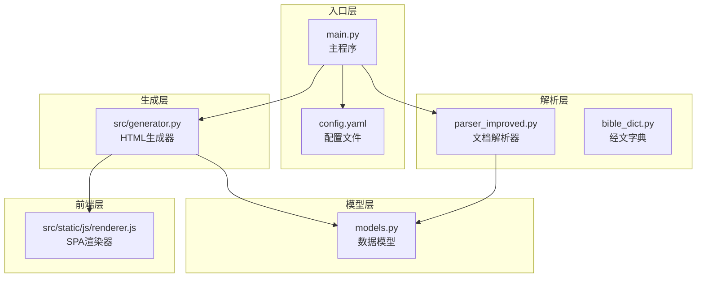
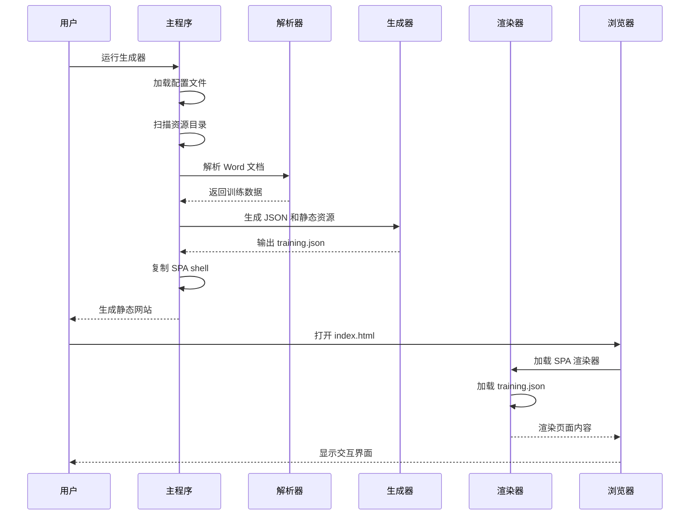
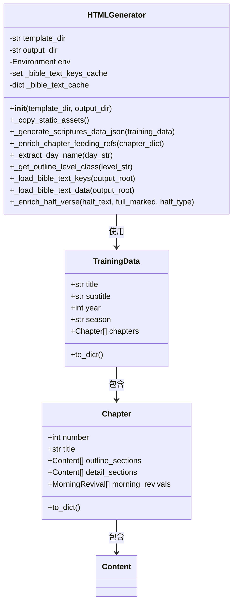
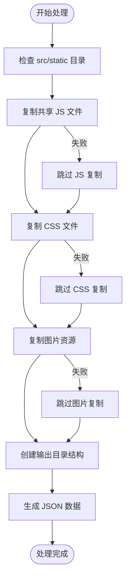
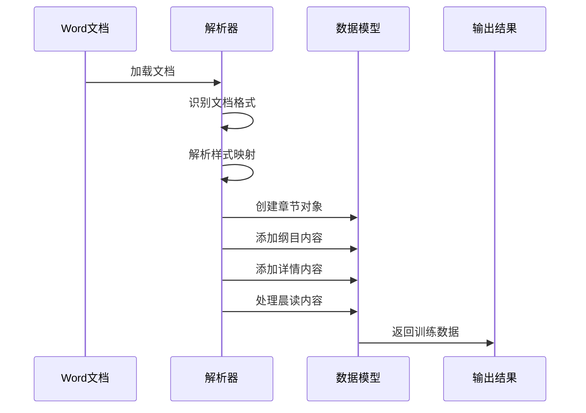
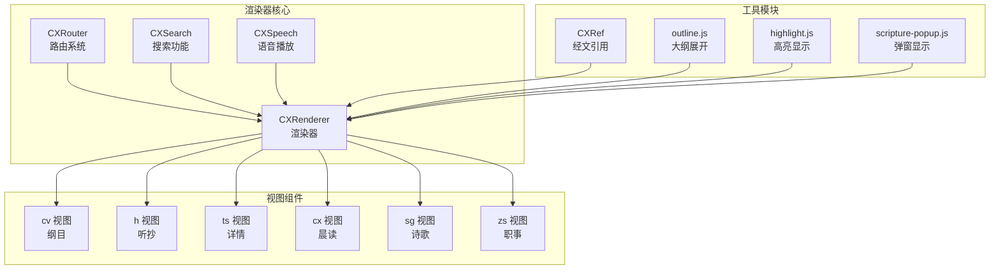
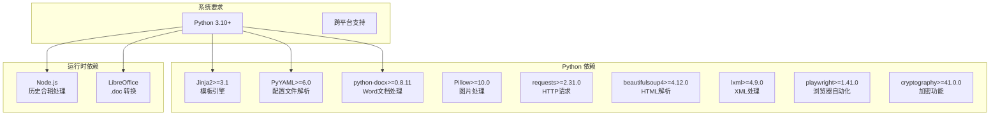

# 静态网站生成器

<cite>
**本文档引用的文件**
- [main.py](file://main.py)
- [generator.py](file://src/generator.py)
- [models.py](file://src/models.py)
- [parser_improved.py](file://src/parser_improved.py)
- [bible_dict.py](file://src/bible_dict.py)
- [renderer.js](file://src/static/js/renderer.js)
- [config.yaml](file://config.yaml)
- [requirements.txt](file://requirements.txt)
</cite>

## 目录
1. [简介](#简介)
2. [项目结构](#项目结构)
3. [核心组件](#核心组件)
4. [架构概览](#架构概览)
5. [详细组件分析](#详细组件分析)
6. [依赖分析](#依赖分析)
7. [性能考虑](#性能考虑)
8. [故障排除指南](#故障排除指南)
9. [结论](#结论)
10. [附录](#附录)

## 简介
本项目是一个基于 Python 的静态网站生成器，专门用于将 Word 文档（听抄、经文、晨兴）转换为可离线使用的 SPA（单页应用）静态网站。系统采用 Jinja2 模板引擎进行数据绑定与渲染，结合前端 JavaScript 模块实现丰富的交互体验。生成器能够批量处理多个训练批次，生成统一的索引页面和每个训练的独立页面，同时提供搜索索引、资源包管理和缓存优化等功能。

## 项目结构
项目采用模块化设计，主要分为以下层次：
- **入口层**：主程序负责配置加载、批处理调度和资源复制
- **解析层**：文档解析器负责从 Word 文档中提取结构化数据
- **模型层**：数据模型定义训练、章节、内容节点等核心实体
- **生成层**：HTML 生成器负责模板渲染、静态资源处理和 JSON 导出
- **前端层**：SPA 渲染器负责运行时交互、路由和页面渲染

**图表来源**
- [main.py:655-901](file://main.py#L655-L901)
- [generator.py:22-545](file://src/generator.py#L22-L545)
- [models.py:1-232](file://src/models.py#L1-L232)
- [parser_improved.py:114-200](file://src/parser_improved.py#L114-L200)
- [bible_dict.py:19-96](file://src/bible_dict.py#L19-L96)
- [renderer.js:14-800](file://src/static/js/renderer.js#L14-L800)

**章节来源**
- [main.py:1-901](file://main.py#L1-L901)
- [generator.py:1-545](file://src/generator.py#L1-L545)
- [models.py:1-232](file://src/models.py#L1-L232)
- [parser_improved.py:1-200](file://src/parser_improved.py#L1-L200)
- [bible_dict.py:1-96](file://src/bible_dict.py#L1-L96)
- [renderer.js:1-800](file://src/static/js/renderer.js#L1-L800)

## 核心组件
系统的核心组件包括：

### 1. 主程序 (main.py)
- **配置管理**：加载 YAML 配置文件，支持批量处理模式
- **批处理调度**：扫描资源目录，自动识别训练批次并执行处理
- **资源复制**：复制 SPA shell、图标、静态资源到输出目录
- **历史合辑处理**：调用 Node.js 脚本处理历史训练数据
- **资源包生成**：按 10 年分组生成可下载的 ZIP 资源包

### 2. HTML 生成器 (generator.py)
- **模板引擎**：使用 Jinja2 Environment 和 FileSystemLoader
- **静态资源处理**：复制共享 JS/CSS/图片到输出目录
- **数据绑定**：将训练数据转换为模板可用的字典结构
- **JSON 导出**：生成 training.json 和 scriptures-data.json
- **搜索索引**：从 JSON 文件构建全文搜索索引

### 3. 数据模型 (models.py)
- **TrainingData**：训练总集，包含标题、副标题、年份、季节等元数据
- **Chapter**：篇章实体，包含纲目、详情、诗歌、经文等内容
- **Content**：内容节点，支持层级结构和子节点
- **MorningRevival**：晨读内容，按天组织大纲和喂养内容

### 4. 文档解析器 (parser_improved.py)
- **格式支持**：自动识别 .doc 和 .docx 格式
- **样式映射**：将 Word 样式映射到内部数据结构
- **经文解析**：提取经文引用和上下文信息
- **章节识别**：识别周次、星期、章节层级等结构信息

### 5. 经文字典 (bible_dict.py)
- **持久化存储**：维护经文引用到完整文本的映射
- **增量更新**：支持从新数据增量累积
- **范围查询**：支持按书卷和章节范围获取经文

### 6. SPA 渲染器 (renderer.js)
- **视图渲染**：渲染纲目(cv)、听抄(h)、详情(ts)、晨读(cx)等视图
- **路由系统**：基于 hash 的 SPA 路由导航
- **交互功能**：播放控制、页面翻页、搜索等
- **缓存机制**：训练数据缓存和滚动位置记忆

**章节来源**
- [main.py:205-314](file://main.py#L205-L314)
- [generator.py:22-46](file://src/generator.py#L22-L46)
- [models.py:9-232](file://src/models.py#L9-L232)
- [parser_improved.py:114-145](file://src/parser_improved.py#L114-L145)
- [bible_dict.py:19-96](file://src/bible_dict.py#L19-L96)
- [renderer.js:14-800](file://src/static/js/renderer.js#L14-L800)

## 架构概览
系统采用分层架构，各层职责清晰分离：

**图表来源**
- [main.py:655-901](file://main.py#L655-L901)
- [generator.py:382-424](file://src/generator.py#L382-L424)
- [renderer.js:49-103](file://src/static/js/renderer.js#L49-L103)

系统的关键特性包括：
- **批量处理**：支持多个训练批次的并行处理
- **模板系统**：基于 Jinja2 的灵活模板引擎
- **SPA 架构**：前端 JavaScript 实现的单页应用
- **缓存优化**：多层缓存机制提升性能
- **资源管理**：智能的静态资源复制和压缩

## 详细组件分析

### HTML 生成器类分析
HTMLGenerator 是整个系统的核心组件，负责将训练数据转换为静态网页。

**图表来源**
- [generator.py:22-46](file://src/generator.py#L22-L46)
- [models.py:197-232](file://src/models.py#L197-L232)
- [models.py:40-100](file://src/models.py#L40-L100)

#### 模板系统设计
HTML 生成器使用 Jinja2 模板引擎，通过 FileSystemLoader 从指定目录加载模板文件。系统内置了两个自定义过滤器：

1. **extract_day**：从包含周信息的字符串中提取星期几
2. **outline_level_class**：根据纲目层级生成对应的 CSS 类名

#### 数据绑定机制
生成器通过以下步骤实现数据绑定：
1. 将 TrainingData 对象转换为字典结构
2. 预计算晨读喂养经文的引用列表
3. 使用模板渲染生成最终的 HTML 文件

#### 静态文件处理流程
静态资源处理采用复制策略，确保所有训练共享相同的 JS/CSS 文件：

**图表来源**
- [generator.py:47-115](file://src/generator.py#L47-L115)

**章节来源**
- [generator.py:22-202](file://src/generator.py#L22-L202)
- [generator.py:333-372](file://src/generator.py#L333-L372)

### 文档解析器工作流程
文档解析器负责从 Word 文档中提取结构化数据：

**图表来源**
- [parser_improved.py:15-112](file://src/parser_improved.py#L15-L112)
- [parser_improved.py:114-200](file://src/parser_improved.py#L114-L200)

解析器的关键功能包括：
- **格式检测**：自动识别 .doc 和 .docx 格式
- **样式映射**：将 Word 样式转换为内部数据结构
- **层级识别**：识别章节、大纲、内容的层级关系
- **经文提取**：从文本中提取经文引用和上下文

**章节来源**
- [parser_improved.py:114-200](file://src/parser_improved.py#L114-L200)

### SPA 渲染器架构
SPA 渲染器实现了完整的前端交互功能：

**图表来源**
- [renderer.js:14-800](file://src/static/js/renderer.js#L14-L800)

**章节来源**
- [renderer.js:14-800](file://src/static/js/renderer.js#L14-L800)

## 依赖分析
系统依赖关系清晰，主要外部依赖包括：

**图表来源**
- [requirements.txt:1-16](file://requirements.txt#L1-L16)

**章节来源**
- [requirements.txt:1-16](file://requirements.txt#L1-L16)

## 性能考虑
系统在多个层面进行了性能优化：

### 1. 缓存策略
- **类级缓存**：经文数据在类级别缓存，避免重复解析
- **训练数据缓存**：SPA 渲染器缓存已加载的训练数据
- **滚动位置记忆**：自动保存和恢复滚动位置

### 2. 资源优化
- **静态资源复用**：所有训练共享 JS/CSS 文件，减少重复
- **JSON 压缩**：生成压缩的 JSON 文件，减少传输体积
- **图片懒加载**：支持图片的延迟加载机制

### 3. 处理优化
- **批量处理**：支持多个训练批次的并行处理
- **增量更新**：支持增量生成，跳过已存在的文件
- **智能复制**：只复制必要的静态资源

## 故障排除指南
常见问题及解决方案：

### 1. 文档格式问题
**问题**：.doc 文件无法自动转换
**原因**：缺少 LibreOffice 或转换超时
**解决**：
- 安装 LibreOffice 并确保可执行文件可用
- 手动将 .doc 文件转换为 .docx 格式
- 检查系统权限和磁盘空间

### 2. 模板渲染错误
**问题**：Jinja2 模板渲染失败
**原因**：数据结构不匹配或模板文件缺失
**解决**：
- 检查数据模型的字段完整性
- 确认模板文件存在于指定目录
- 验证数据类型与模板期望一致

### 3. SPA 加载问题
**问题**：前端页面无法正常加载
**原因**：training.json 文件缺失或格式错误
**解决**：
- 确认生成器已正确生成 training.json
- 检查 JSON 文件的语法和格式
- 验证前端资源文件的完整性

### 4. 性能问题
**问题**：生成过程耗时过长
**原因**：大量图片处理或复杂模板渲染
**解决**：
- 启用增量生成模式
- 优化模板复杂度
- 减少不必要的静态资源复制

**章节来源**
- [parser_improved.py:82-111](file://src/parser_improved.py#L82-L111)
- [main.py:776-791](file://main.py#L776-L791)

## 结论
本静态网站生成器通过精心设计的架构和模块化实现，成功地将 Word 文档转换为功能完整的 SPA 静态网站。系统具有以下优势：

1. **架构清晰**：分层设计使得各组件职责明确，易于维护和扩展
2. **功能完整**：从文档解析到页面渲染提供了完整的解决方案
3. **性能优秀**：多层缓存和优化策略确保了高效的处理能力
4. **用户体验好**：SPA 架构提供了流畅的交互体验
5. **部署简单**：生成的静态文件可在任何 Web 服务器上部署

未来可以考虑的功能增强包括：
- 更丰富的模板定制选项
- 增强的搜索功能
- 多语言支持
- 更好的移动端适配

## 附录

### 配置文件说明
系统使用 YAML 格式的配置文件，主要配置项包括：

| 配置项 | 类型 | 默认值 | 描述 |
|--------|------|--------|------|
| batch_processing.enabled | boolean | true | 是否启用批量处理模式 |
| batch_processing.max_latest_trainings | integer | 5 | 最新训练保留数量 |
| output_dir | string | "output" | 输出目录路径 |
| resource_base_dir | string | "resource" | 资源目录路径 |
| template_dir | string | "src/templates" | 模板目录路径 |
| static_dir | string | "src/static" | 静态资源目录路径 |

### 使用示例
以下是使用生成器创建静态网站的基本流程：

1. **准备数据**：将 Word 文档按批次组织在 resource 目录下
2. **配置系统**：编辑 config.yaml 文件设置相关参数
3. **运行生成器**：执行主程序进行批量处理
4. **部署网站**：将生成的静态文件部署到 Web 服务器

### 开发指南
对于开发者，建议关注以下要点：
- 理解数据模型的设计思路
- 掌握 Jinja2 模板的使用方法
- 熟悉 SPA 渲染器的工作原理
- 了解缓存和性能优化策略