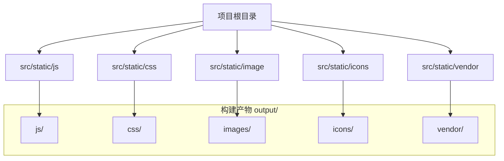
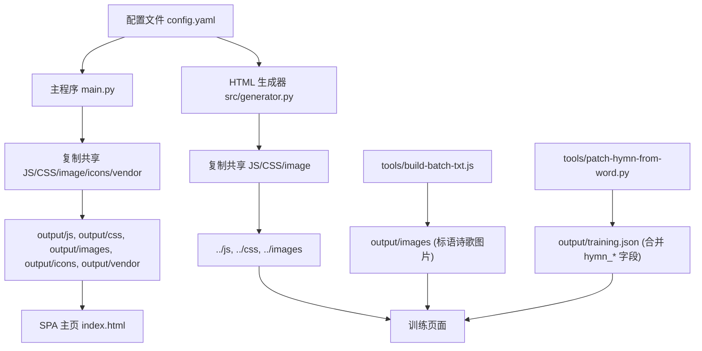
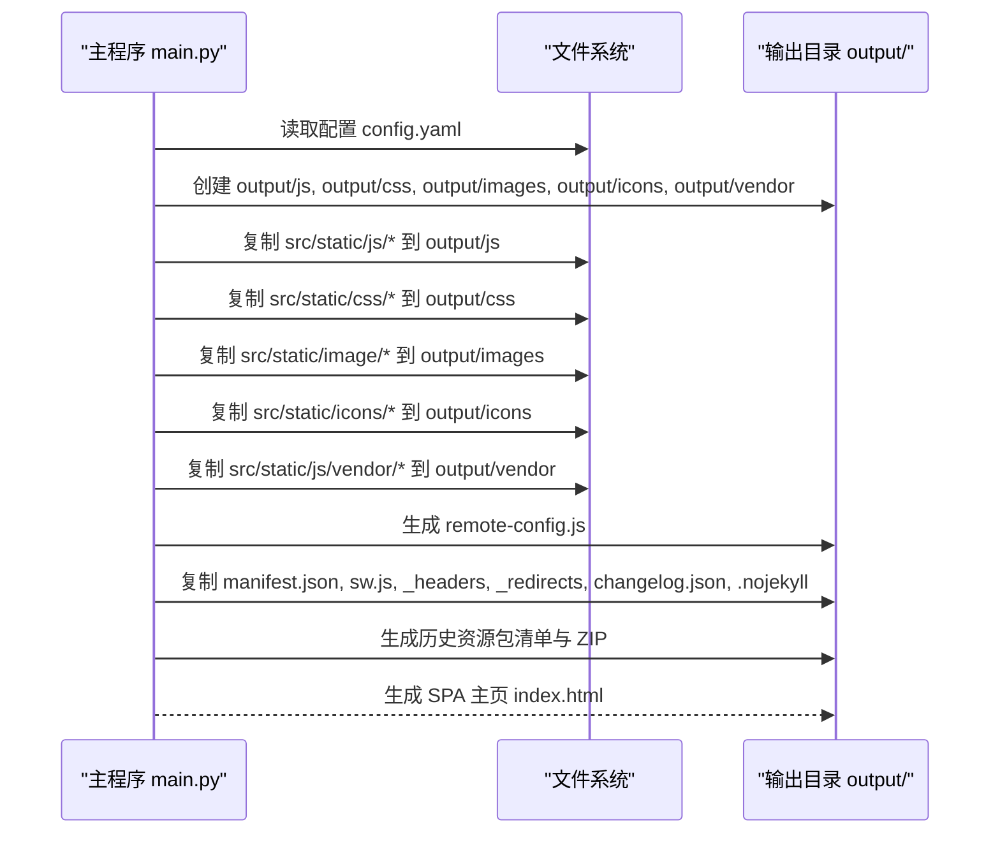
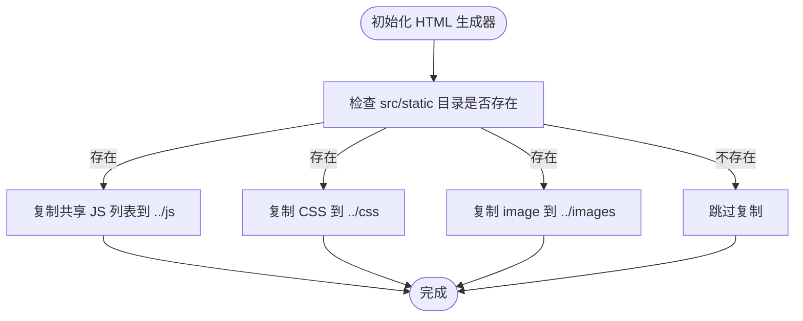
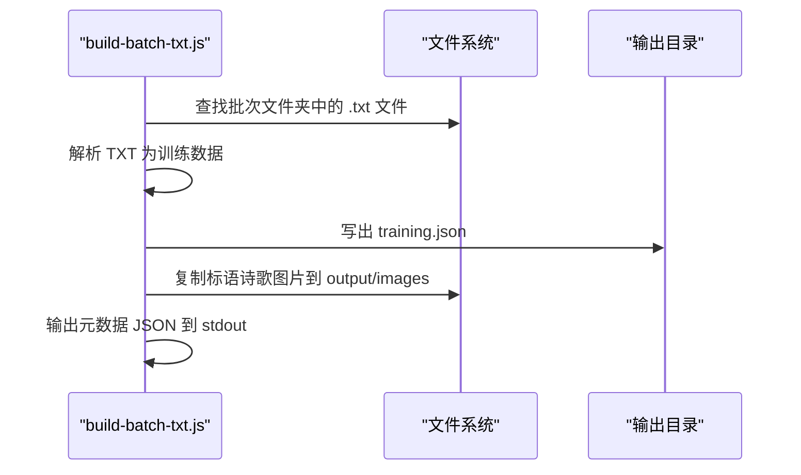
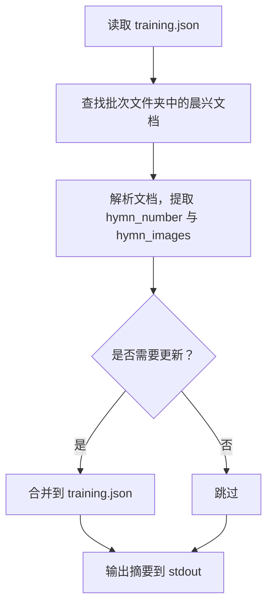
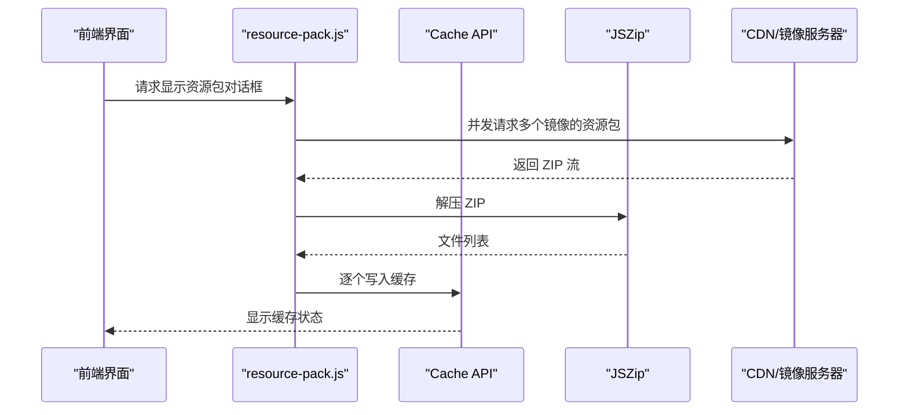
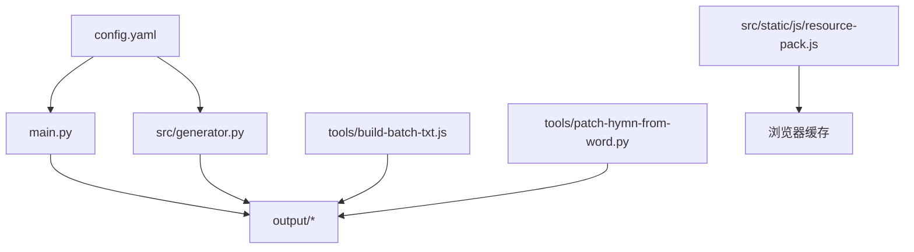

# 静态资源处理

<cite>
**本文引用的文件**
- [main.py](file://main.py)
- [config.yaml](file://config.yaml)
- [src/generator.py](file://src/generator.py)
- [src/parser_improved.py](file://src/parser_improved.py)
- [src/models.py](file://src/models.py)
- [tools/build-batch-txt.js](file://tools/build-batch-txt.js)
- [tools/patch-hymn-from-word.py](file://tools/patch-hymn-from-word.py)
- [src/static/js/resource-pack.js](file://src/static/js/resource-pack.js)
</cite>

## 目录
1. [简介](#简介)
2. [项目结构](#项目结构)
3. [核心组件](#核心组件)
4. [架构概览](#架构概览)
5. [详细组件分析](#详细组件分析)
6. [依赖分析](#依赖分析)
7. [性能考虑](#性能考虑)
8. [故障排查指南](#故障排查指南)
9. [结论](#结论)
10. [附录](#附录)

## 简介
本文件面向静态资源处理模块，系统性阐述静态资源复制机制、共享 JS 文件清单、CSS 样式与图片资源处理流程、资源路径映射规则、文件权限与错误恢复策略，并提供配置与使用示例，涵盖资源优化、缓存机制与部署管理的最佳实践。

## 项目结构
静态资源主要位于项目根目录的 src/static 目录下，包含以下子目录：
- js：共享 JavaScript 文件（如导航、主题切换、搜索、路由等）
- css：共享样式文件
- image：静态图片资源（如赞助二维码等）
- icons：应用图标
- vendor：第三方库（如 localforage）

在构建阶段，主程序会将这些静态资源复制到输出目录的对应子目录，形成最终的静态站点结构。

图表来源
- [main.py:619-730](file://main.py#L619-L730)
- [src/generator.py:44-115](file://src/generator.py#L44-L115)

章节来源
- [main.py:619-730](file://main.py#L619-L730)
- [src/generator.py:44-115](file://src/generator.py#L44-L115)

## 核心组件
- 主程序静态资源复制：在生成 SPA 主页时，将共享 JS/CSS/图片/图标/vendor 等静态资源复制到输出目录。
- HTML 生成器静态资源复制：在模板渲染前，将共享 JS/CSS/image 资源复制到根输出目录的 js/css/images 子目录。
- TXT 批次构建脚本：解析 TXT 文件生成 training.json，并复制标语诗歌图片到输出 images 目录。
- 晨兴补丁脚本：从 Word 文档提取诗歌内容与图片，合并到已生成的 training.json。
- 资源包下载客户端：在前端通过 JSZip 与 Cache API 实现历史资源包的下载与缓存。

章节来源
- [main.py:619-730](file://main.py#L619-L730)
- [src/generator.py:44-115](file://src/generator.py#L44-L115)
- [tools/build-batch-txt.js:117-140](file://tools/build-batch-txt.js#L117-L140)
- [tools/patch-hymn-from-word.py:42-135](file://tools/patch-hymn-from-word.py#L42-L135)
- [src/static/js/resource-pack.js:217-327](file://src/static/js/resource-pack.js#L217-L327)

## 架构概览
静态资源处理贯穿“配置加载 → 资源复制 → 资源优化 → 部署”的全流程。主程序与 HTML 生成器分别承担不同阶段的静态资源复制职责，确保 SPA 与训练页面共享同一套静态资产。

图表来源
- [config.yaml:1-42](file://config.yaml#L1-L42)
- [main.py:619-730](file://main.py#L619-L730)
- [src/generator.py:44-115](file://src/generator.py#L44-L115)
- [tools/build-batch-txt.js:117-140](file://tools/build-batch-txt.js#L117-L140)
- [tools/patch-hymn-from-word.py:42-135](file://tools/patch-hymn-from-word.py#L42-L135)

## 详细组件分析

### 主程序静态资源复制流程
主程序在生成 SPA 主页时执行静态资源复制，包括：
- SPA Shell：复制 src/static/index.html 到 output/index.html，并注入最大缓存配置。
- 图标：复制一组图标到 output/icons。
- 静态图片：复制 src/static/image 下的图片到 output/images。
- vendor：复制第三方库到 output/vendor。
- 共享 JS：复制共享 JS 列表到 output/js。
- remote-config.js：基于配置生成输出到 output/js。
- 共享 CSS：复制 src/static/css 下的 CSS 文件到 output/css。
- 其他静态文件：manifest.json、sw.js、_headers、_redirects、changelog.json、.nojekyll。
- 历史资源包：按策略生成 ZIP 并输出清单。

图表来源
- [main.py:619-730](file://main.py#L619-L730)
- [main.py:19-51](file://main.py#L19-L51)

章节来源
- [main.py:619-730](file://main.py#L619-L730)
- [main.py:19-51](file://main.py#L19-L51)

### HTML 生成器静态资源复制流程
HTML 生成器在初始化时复制静态资源，确保模板渲染前共享资源已就绪：
- 复制共享 JS 列表到根输出目录的 js 子目录。
- 复制 CSS 到根输出目录的 css 子目录。
- 复制 image 到根输出目录的 images 子目录。
- 若复制过程中发生异常，不影响 HTML 生成。

图表来源
- [src/generator.py:44-115](file://src/generator.py#L44-L115)

章节来源
- [src/generator.py:44-115](file://src/generator.py#L44-L115)

### TXT 批次构建与标语诗歌图片复制
TXT 批次构建脚本负责：
- 解析 TXT 文件生成 training.json。
- 从批次文件夹复制标语诗歌图片到 output/images。
- 输出元数据到 stdout，供主程序读取。

图表来源
- [tools/build-batch-txt.js:154-267](file://tools/build-batch-txt.js#L154-L267)

章节来源
- [tools/build-batch-txt.js:154-267](file://tools/build-batch-txt.js#L154-L267)

### 晨兴补丁：从 Word 提取诗歌内容与图片
补丁脚本从批次文件夹的晨兴 Word 文档中提取诗歌文本与图片，并合并到已生成的 training.json：
- 读取 training.json。
- 解析晨兴文档，提取 hymn_number 与 hymn_images。
- 合并更新到 training.json。
- 输出摘要到 stdout。

图表来源
- [tools/patch-hymn-from-word.py:42-135](file://tools/patch-hymn-from-word.py#L42-L135)

章节来源
- [tools/patch-hymn-from-word.py:42-135](file://tools/patch-hymn-from-word.py#L42-L135)

### 资源包下载与缓存
前端通过 resource-pack.js 实现历史资源包的下载与缓存：
- 加载 JSZip，从多个镜像并发竞速拉取 ZIP。
- 使用 Cache API 将 ZIP 内文件逐个写入缓存。
- 支持单个包下载与全部下载。

图表来源
- [src/static/js/resource-pack.js:217-327](file://src/static/js/resource-pack.js#L217-L327)

章节来源
- [src/static/js/resource-pack.js:217-327](file://src/static/js/resource-pack.js#L217-L327)

## 依赖分析
静态资源处理涉及以下关键依赖关系：
- 主程序依赖配置文件决定输出目录与静态资源路径。
- HTML 生成器依赖 src/static 目录的存在与否决定是否复制共享资源。
- TXT 构建脚本与补丁脚本均依赖 training.json 的存在与结构。
- 资源包下载客户端依赖远程服务器列表与 Cache API。

图表来源
- [config.yaml:1-42](file://config.yaml#L1-L42)
- [main.py:619-730](file://main.py#L619-L730)
- [src/generator.py:44-115](file://src/generator.py#L44-L115)
- [tools/build-batch-txt.js:154-267](file://tools/build-batch-txt.js#L154-L267)
- [tools/patch-hymn-from-word.py:42-135](file://tools/patch-hymn-from-word.py#L42-L135)
- [src/static/js/resource-pack.js:217-327](file://src/static/js/resource-pack.js#L217-L327)

章节来源
- [config.yaml:1-42](file://config.yaml#L1-L42)
- [main.py:619-730](file://main.py#L619-L730)
- [src/generator.py:44-115](file://src/generator.py#L44-L115)
- [tools/build-batch-txt.js:154-267](file://tools/build-batch-txt.js#L154-L267)
- [tools/patch-hymn-from-word.py:42-135](file://tools/patch-hymn-from-word.py#L42-L135)
- [src/static/js/resource-pack.js:217-327](file://src/static/js/resource-pack.js#L217-L327)

## 性能考虑
- 并发竞速：资源包下载采用多镜像并发竞速，提升下载稳定性与速度。
- 缓存策略：通过 Cache API 缓存资源包文件，减少重复下载。
- 资源优化：在 CI 环境可选择性混淆 JS 以减小体积（可通过环境变量控制）。
- 路径映射：共享资源统一放置于根输出目录的 js/css/images 子目录，训练页面通过相对路径 ../js/... 引用，降低路径复杂度。

章节来源
- [main.py:701-720](file://main.py#L701-L720)
- [src/static/js/resource-pack.js:274-285](file://src/static/js/resource-pack.js#L274-L285)

## 故障排查指南
- 静态资源复制失败：HTML 生成器在复制静态资源时捕获异常并忽略，不影响 HTML 生成。建议检查 src/static 目录是否存在以及权限是否正确。
- remote-config.js 未生成：确认 config.yaml 中 remote_servers 配置项存在且有效。
- TXT 构建失败：检查批次文件夹中是否存在 .txt 文件，或通过 --txt 指定具体文件路径。
- 晨兴补丁失败：确认 training.json 已生成且包含章节数据；检查批次文件夹中是否存在晨兴 Word 文档。
- 资源包下载失败：检查 remote_servers 配置与网络连通性；确认浏览器支持 Cache API。

章节来源
- [src/generator.py:113-115](file://src/generator.py#L113-L115)
- [main.py:19-51](file://main.py#L19-L51)
- [tools/build-batch-txt.js:154-173](file://tools/build-batch-txt.js#L154-L173)
- [tools/patch-hymn-from-word.py:49-66](file://tools/patch-hymn-from-word.py#L49-L66)
- [src/static/js/resource-pack.js:286-327](file://src/static/js/resource-pack.js#L286-L327)

## 结论
静态资源处理模块通过主程序与 HTML 生成器协同工作，结合 TXT 构建与补丁脚本，实现了从源静态资源到最终输出目录的完整复制与优化链路。配合资源包下载与缓存机制，可在部署后进一步提升用户体验与加载性能。建议在维护共享 JS/CSS 列表时遵循最小变更原则，并定期清理历史资源包以控制存储占用。

## 附录

### 配置与使用示例
- 配置文件：参考 config.yaml 中的 output_dir、template_dir、static_dir 等路径配置。
- 生成 remote-config.js：在主程序中读取 remote_servers 并生成 output/js/remote-config.js。
- 复制共享 JS 列表：在主程序中维护 shared_js_files 列表，确保所有共享脚本被复制到 output/js。
- 复制共享 CSS：在主程序中复制 src/static/css 下的所有 CSS 文件到 output/css。
- 复制静态图片与图标：在主程序中复制 src/static/image 与 src/static/icons 到输出目录对应子目录。
- TXT 批次构建：使用 tools/build-batch-txt.js 指定 --folder 与 --output，必要时通过 --txt 指定具体 TXT 文件。
- 晨兴补丁：使用 tools/patch-hymn-from-word.py 指定 --output-dir 与 --batch-folder，合并诗歌内容与图片到 training.json。
- 资源包下载：在前端通过 resource-pack.js 的公开 API 调用 showPacksDialog、downloadPack、downloadAll 等方法。

章节来源
- [config.yaml:1-42](file://config.yaml#L1-L42)
- [main.py:19-51](file://main.py#L19-L51)
- [main.py:675-694](file://main.py#L675-L694)
- [main.py:721-730](file://main.py#L721-L730)
- [tools/build-batch-txt.js:154-267](file://tools/build-batch-txt.js#L154-L267)
- [tools/patch-hymn-from-word.py:138-151](file://tools/patch-hymn-from-word.py#L138-L151)
- [src/static/js/resource-pack.js:984-991](file://src/static/js/resource-pack.js#L984-L991)