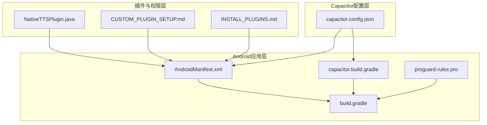
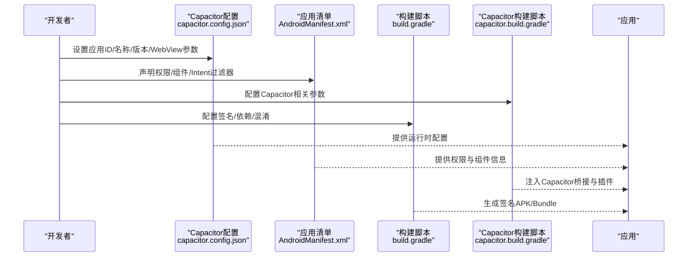
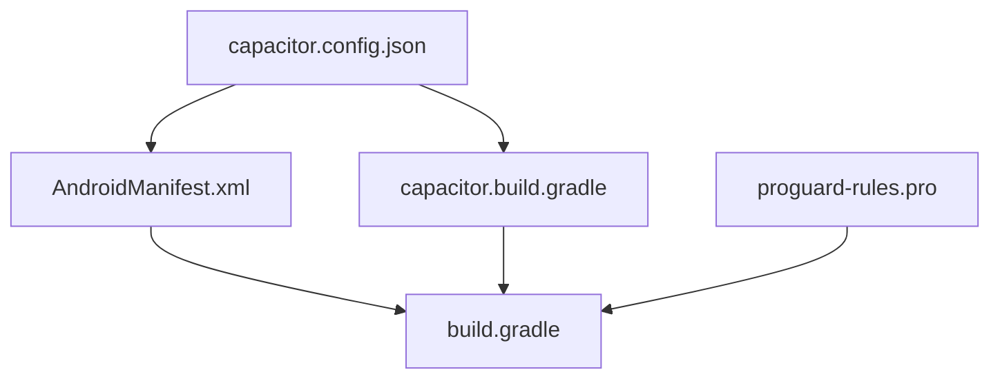

# Android应用配置

<cite>
**本文引用的文件**
- [AndroidManifest.xml](file://android/app/src/main/AndroidManifest.xml)
- [capacitor.config.json](file://capacitor.config.json)
- [capacitor.build.gradle](file://android/app/capacitor.build.gradle)
- [build.gradle](file://android/app/build.gradle)
- [proguard-rules.pro](file://android/app/proguard-rules.pro)
- [NativeTTSPlugin.java](file://android/app/src/main/java/com/tehui/offline/NativeTTSPlugin.java)
- [Bridge.java](file://node_modules/@capacitor/android/capacitor/src/main/java/com/getcapacitor/Bridge.java)
- [CapConfig.java](file://node_modules/@capacitor/android/capacitor/src/main/java/com/getcapacitor/CapConfig.java)
- [CUSTOM_PLUGIN_SETUP.md](file://CUSTOM_PLUGIN_SETUP.md)
- [INSTALL_PLUGINS.md](file://INSTALL_PLUGINS.md)
</cite>

## 目录
1. [简介](#简介)
2. [项目结构](#项目结构)
3. [核心组件](#核心组件)
4. [架构概览](#架构概览)
5. [详细组件分析](#详细组件分析)
6. [依赖关系分析](#依赖关系分析)
7. [性能考虑](#性能考虑)
8. [故障排除指南](#故障排除指南)
9. [结论](#结论)
10. [附录](#附录)

## 简介
本文件为Android应用配置的详细技术文档，重点涵盖以下方面：
- AndroidManifest.xml的配置项：应用权限声明、组件注册、Intent过滤器等
- Capacitor配置文件设置：应用ID、名称、版本号、WebView配置等
- Android图标资源的组织结构和命名规范
- 应用权限系统：网络访问、存储权限、外部存储等
- 应用签名配置和发布准备指导
- ProGuard混淆配置与性能优化建议

本指南旨在帮助开发者快速理解并正确配置Android应用，确保功能完整性和安全性。

## 项目结构
Android应用采用标准的Android Gradle项目结构，并通过Capacitor框架进行跨平台开发。关键配置文件分布如下：
- 应用清单与构建：AndroidManifest.xml、build.gradle、capacitor.build.gradle
- Capacitor配置：capacitor.config.json
- 混淆规则：proguard-rules.pro
- 插件与权限：NativeTTSPlugin.java及相关文档

**图表来源**
- [AndroidManifest.xml](file://android/app/src/main/AndroidManifest.xml)
- [build.gradle](file://android/app/build.gradle)
- [capacitor.build.gradle](file://android/app/capacitor.build.gradle)
- [capacitor.config.json](file://capacitor.config.json)
- [proguard-rules.pro](file://android/app/proguard-rules.pro)
- [NativeTTSPlugin.java](file://android/app/src/main/java/com/tehui/offline/NativeTTSPlugin.java)
- [CUSTOM_PLUGIN_SETUP.md](file://CUSTOM_PLUGIN_SETUP.md)
- [INSTALL_PLUGINS.md](file://INSTALL_PLUGINS.md)

**章节来源**
- [AndroidManifest.xml](file://android/app/src/main/AndroidManifest.xml)
- [capacitor.config.json](file://capacitor.config.json)
- [capacitor.build.gradle](file://android/app/capacitor.build.gradle)
- [build.gradle](file://android/app/build.gradle)
- [proguard-rules.pro](file://android/app/proguard-rules.pro)
- [NativeTTSPlugin.java](file://android/app/src/main/java/com/tehui/offline/NativeTTSPlugin.java)
- [CUSTOM_PLUGIN_SETUP.md](file://CUSTOM_PLUGIN_SETUP.md)
- [INSTALL_PLUGINS.md](file://INSTALL_PLUGINS.md)

## 核心组件
本节概述Android应用配置的核心组件及其职责：
- 应用清单（AndroidManifest.xml）：定义应用元数据、权限、组件和Intent过滤器
- 构建脚本（build.gradle、capacitor.build.gradle）：管理应用ID、版本、签名、依赖和混淆
- Capacitor配置（capacitor.config.json）：控制WebView行为、应用URL、包名等
- 混淆规则（proguard-rules.pro）：保护代码并优化性能
- 权限与插件（NativeTTSPlugin.java及相关文档）：实现特定功能所需的权限声明与配置

**章节来源**
- [AndroidManifest.xml](file://android/app/src/main/AndroidManifest.xml)
- [capacitor.config.json](file://capacitor.config.json)
- [capacitor.build.gradle](file://android/app/capacitor.build.gradle)
- [build.gradle](file://android/app/build.gradle)
- [proguard-rules.pro](file://android/app/proguard-rules.pro)
- [NativeTTSPlugin.java](file://android/app/src/main/java/com/tehui/offline/NativeTTSPlugin.java)

## 架构概览
下图展示了Android应用配置在运行时的关键交互流程：

**图表来源**
- [capacitor.config.json](file://capacitor.config.json)
- [AndroidManifest.xml](file://android/app/src/main/AndroidManifest.xml)
- [capacitor.build.gradle](file://android/app/capacitor.build.gradle)
- [build.gradle](file://android/app/build.gradle)

## 详细组件分析

### AndroidManifest.xml配置详解
AndroidManifest.xml是应用的“宪法”，必须准确声明以下内容：
- 应用标识与元数据：应用ID、版本号、名称等
- 权限声明：网络访问、存储访问、外部存储等
- 组件注册：Activity、Service、BroadcastReceiver、ContentProvider
- Intent过滤器：处理自定义协议、文件类型、系统事件等
- 元数据：WebView配置、调试模式、硬件特性要求等

权限系统要点：
- 网络访问：INTERNET、ACCESS_NETWORK_STATE
- 存储权限：READ_EXTERNAL_STORAGE、WRITE_EXTERNAL_STORAGE（Android 12+需配合管理存储）
- 外部存储：MANAGE_EXTERNAL_STORAGE（仅在需要管理所有文件时使用）
- 特定功能：如忽略电池优化（REQUEST_IGNORE_BATTERY_OPTIMIZATIONS）

组件与Intent过滤器：
- Activity需声明主题、启动模式、是否可导出
- 自定义协议需在Activity中添加Intent过滤器以支持Deep Link
- 广播接收器需明确广播类别与权限

**章节来源**
- [AndroidManifest.xml](file://android/app/src/main/AndroidManifest.xml)
- [NativeTTSPlugin.java](file://android/app/src/main/java/com/tehui/offline/NativeTTSPlugin.java)
- [CUSTOM_PLUGIN_SETUP.md](file://CUSTOM_PLUGIN_SETUP.md)
- [INSTALL_PLUGINS.md](file://INSTALL_PLUGINS.md)

### Capacitor配置文件设置
capacitor.config.json用于控制WebView行为与应用运行时参数：
- 应用ID与包名：与build.gradle中的applicationId保持一致
- 应用名称与版本：影响应用显示名称与更新机制
- WebView配置：启用/禁用调试、缓存策略、跨域策略等
- 应用URL：开发环境与生产环境的入口地址
- 插件配置：启用或禁用特定Capacitor插件

加载与验证：
- Capacitor在运行时从assets目录加载该配置文件
- 若配置缺失或格式错误，CLI会提示复制配置或修复JSON格式

**章节来源**
- [capacitor.config.json](file://capacitor.config.json)
- [CapConfig.java](file://node_modules/@capacitor/android/capacitor/src/main/java/com/getcapacitor/CapConfig.java)

### Android图标资源组织与命名规范
图标资源按密度分组存放于mipmap目录中，命名规范如下：
- mdpi：基础密度（1x）
- hdpi：1.5x
- xhdpi：2x
- xxhdpi：3x
- xxxhdpi：4x

命名建议：
- 使用统一前缀（如ic_launcher），后跟状态（normal、pressed、focused等）
- 文件名应简洁且具描述性，避免特殊字符
- 尺寸与比例严格遵循各密度标准，确保在不同设备上清晰显示

**章节来源**
- [AndroidManifest.xml](file://android/app/src/main/AndroidManifest.xml)

### 权限系统与最佳实践
权限分为两类：
- 正常权限：安装时自动授予（如网络访问）
- 危险权限：需运行时申请（如存储、相机、麦克风）

最佳实践：
- 仅声明必要权限，避免过度索取
- 在首次使用前解释权限用途，提升用户信任
- 对于外部存储管理，优先使用分区存储策略
- 定期审查权限列表，移除不再使用的权限

**章节来源**
- [AndroidManifest.xml](file://android/app/src/main/AndroidManifest.xml)
- [NativeTTSPlugin.java](file://android/app/src/main/java/com/tehui/offline/NativeTTSPlugin.java)

### 应用签名与发布准备
签名配置：
- debug签名：开发阶段自动生成，无需手动配置
- release签名：需配置keystore路径、别名、密码等
- Gradle任务：通过signingConfigs定义签名参数

发布准备：
- 生成签名APK/Bundle：使用assembleRelease或bundleRelease
- 代码混淆：启用ProGuard/R8并维护混淆规则
- 签名校验：确保签名与应用ID匹配，避免覆盖安装失败

**章节来源**
- [build.gradle](file://android/app/build.gradle)
- [capacitor.build.gradle](file://android/app/capacitor.build.gradle)

### ProGuard混淆与性能优化
混淆规则：
- proguard-rules.pro用于定义保留规则与混淆策略
- 建议保留接口、注解类、序列化类等关键元素
- 避免对第三方库进行不必要混淆，防止运行时异常

性能优化：
- 启用R8代码压缩与内联
- 移除未使用资源与代码
- 优化WebView加载策略，减少首屏时间
- 合理使用多进程与后台服务，避免耗电

**章节来源**
- [proguard-rules.pro](file://android/app/proguard-rules.pro)
- [build.gradle](file://android/app/build.gradle)

## 依赖关系分析
下图展示配置文件之间的依赖关系与相互影响：

**图表来源**
- [capacitor.config.json](file://capacitor.config.json)
- [AndroidManifest.xml](file://android/app/src/main/AndroidManifest.xml)
- [capacitor.build.gradle](file://android/app/capacitor.build.gradle)
- [build.gradle](file://android/app/build.gradle)
- [proguard-rules.pro](file://android/app/proguard-rules.pro)

**章节来源**
- [capacitor.config.json](file://capacitor.config.json)
- [AndroidManifest.xml](file://android/app/src/main/AndroidManifest.xml)
- [capacitor.build.gradle](file://android/app/capacitor.build.gradle)
- [build.gradle](file://android/app/build.gradle)
- [proguard-rules.pro](file://android/app/proguard-rules.pro)

## 性能考虑
- WebView优化：合理设置缓存策略与跨域策略，减少网络请求开销
- 资源优化：使用合适密度的图标与图片，避免超大资源导致内存压力
- 代码优化：启用R8压缩，精简无用代码；维护混淆规则，避免误删关键类
- 权限最小化：仅申请必要权限，降低运行时检查成本

[本节为通用指导，无需具体文件分析]

## 故障排除指南
常见问题与解决方案：
- 权限缺失：运行时检测到权限未在清单中声明，需在AndroidManifest.xml补充相应权限
- 配置加载失败：capacitor.config.json格式错误或未复制到assets，需修复JSON并执行复制命令
- 签名不匹配：release签名与应用ID不一致导致安装失败，需重新生成签名或调整应用ID
- 混淆冲突：第三方库被错误混淆导致崩溃，需在proguard-rules.pro中添加保留规则

定位与诊断：
- 查看Bridge日志输出，确认缺失的权限与配置项
- 检查Capacitor配置加载过程，确保文件存在且格式正确
- 使用Android Studio的Build Analyzer与APK Analyzer分析性能瓶颈

**章节来源**
- [Bridge.java](file://node_modules/@capacitor/android/capacitor/src/main/java/com/getcapacitor/Bridge.java)
- [CapConfig.java](file://node_modules/@capacitor/android/capacitor/src/main/java/com/getcapacitor/CapConfig.java)

## 结论
Android应用配置涉及多个层面的协同工作：清单文件定义权限与组件、构建脚本管理签名与混淆、Capacitor配置控制运行时行为。遵循本文档的配置建议与最佳实践，可显著提升应用的安全性、稳定性与性能表现。发布前务必完成签名配置、混淆规则校验与权限审查，确保应用顺利上线并获得良好用户体验。

[本节为总结性内容，无需具体文件分析]

## 附录
- 参考文档：CUSTOM_PLUGIN_SETUP.md、INSTALL_PLUGINS.md
- 关键实现：NativeTTSPlugin.java中对权限声明的说明与使用

**章节来源**
- [CUSTOM_PLUGIN_SETUP.md](file://CUSTOM_PLUGIN_SETUP.md)
- [INSTALL_PLUGINS.md](file://INSTALL_PLUGINS.md)
- [NativeTTSPlugin.java](file://android/app/src/main/java/com/tehui/offline/NativeTTSPlugin.java)