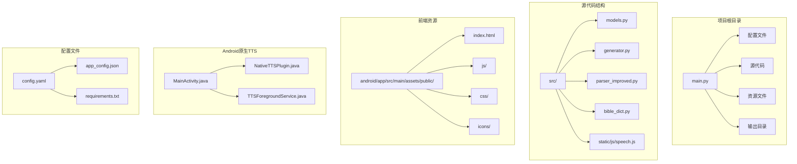
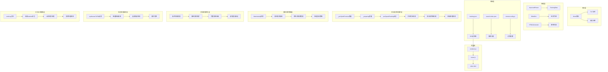
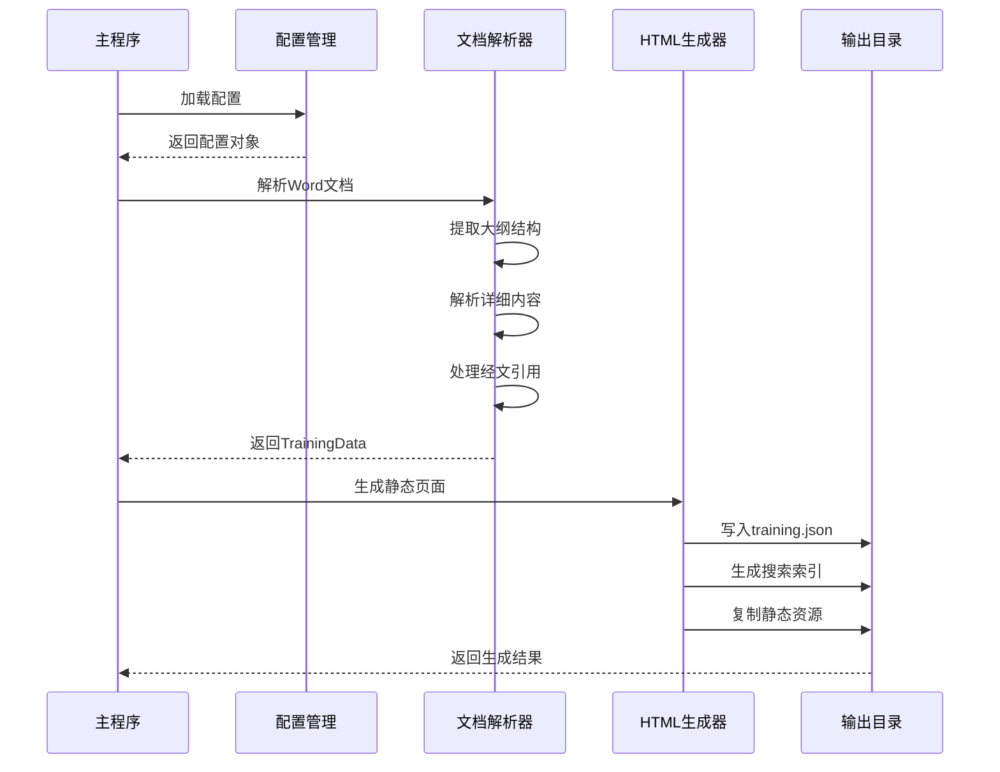
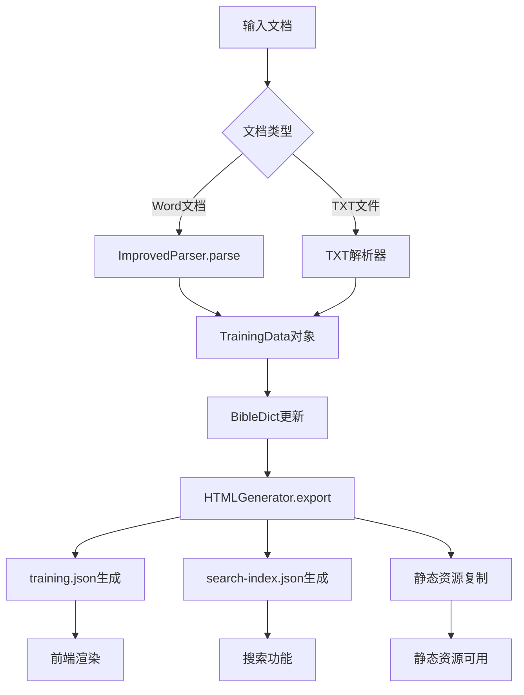
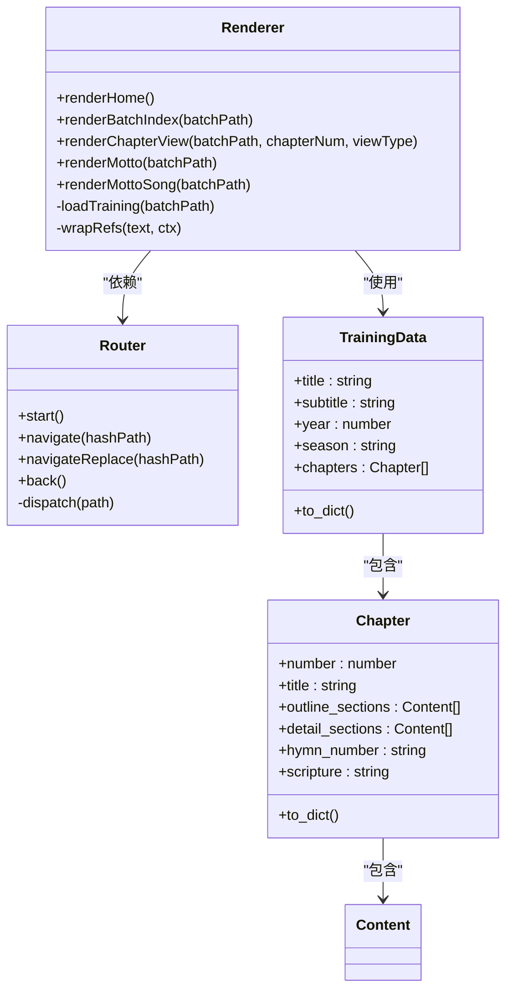
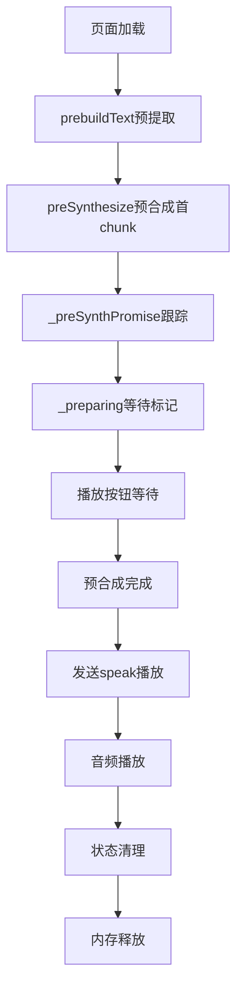
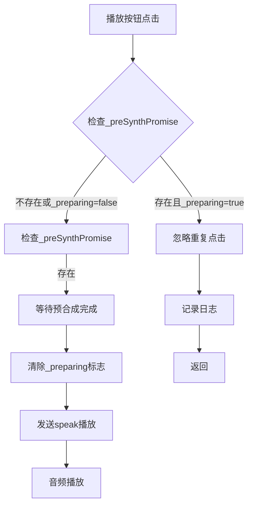
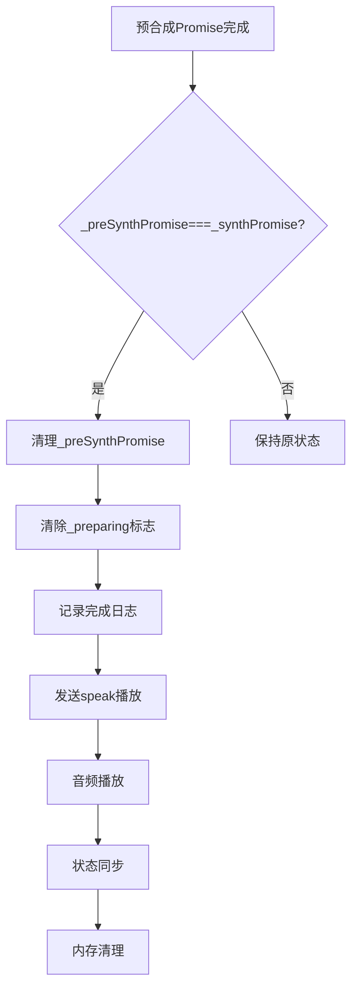
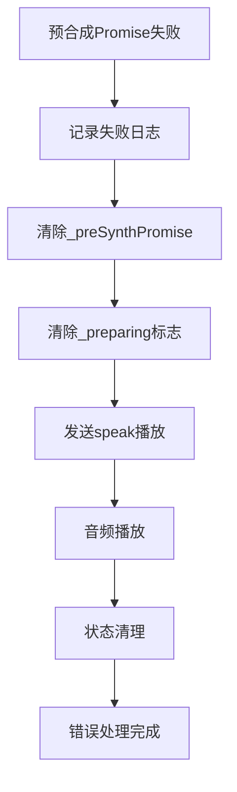
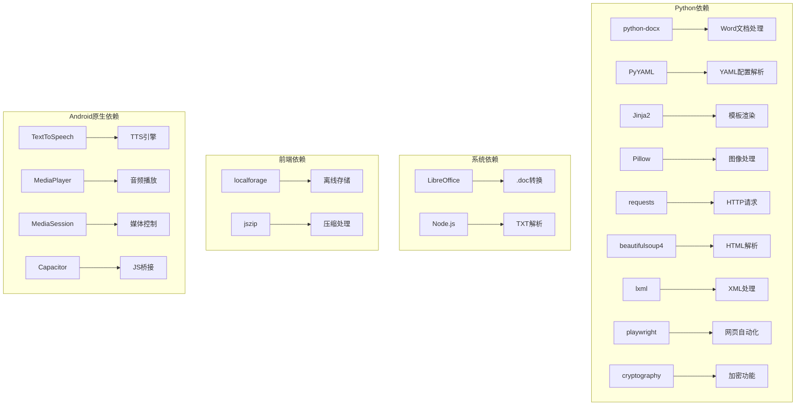

# TTS静态实例管理系统

<cite>
**本文档引用的文件**
- [main.py](file://main.py)
- [config.yaml](file://config.yaml)
- [src/models.py](file://src/models.py)
- [src/generator.py](file://src/generator.py)
- [src/parser_improved.py](file://src/parser_improved.py)
- [src/bible_dict.py](file://src/bible_dict.py)
- [android/app/src/main/assets/public/js/renderer.js](file://android/app/src/main/assets/public/js/renderer.js)
- [android/app/src/main/assets/public/js/router.js](file://android/app/src/main/assets/public/js/router.js)
- [android/app/src/main/assets/public/index.html](file://android/app/src/main/assets/public/index.html)
- [android/app/src/main/java/com/tehui/offline/MainActivity.java](file://android/app/src/main/java/com/tehui/offline/MainActivity.java)
- [android/app/src/main/java/com/tehui/offline/NativeTTSPlugin.java](file://android/app/src/main/java/com/tehui/offline/NativeTTSPlugin.java)
- [android/app/src/main/java/com/tehui/offline/TTSForegroundService.java](file://android/app/src/main/java/com/tehui/offline/TTSForegroundService.java)
- [src/static/js/speech.js](file://src/static/js/speech.js)
- [app_config.json](file://app_config.json)
- [requirements.txt](file://requirements.txt)
</cite>

## 更新摘要
**变更内容**
- 新增_preSynthPromise和_preparing变量用于跟踪预合成状态，增强预合成音频内容的完整性保障机制
- 改进了handlePreSpeak方法的状态管理逻辑，通过preSpeakPending标志精确跟踪预合成请求状态
- 优化了预合成等待机制，防止Router双重dispatch导致的重复预合成请求
- 增强了预合成完成后的状态同步，确保播放按钮能够正确等待预合成完成
- 改进了预合成失败时的降级处理机制，确保音频播放的可靠性

## 目录
1. [项目概述](#项目概述)
2. [项目结构](#项目结构)
3. [核心组件](#核心组件)
4. [架构概览](#架构概览)
5. [详细组件分析](#详细组件分析)
6. [依赖关系分析](#依赖关系分析)
7. [性能考虑](#性能考虑)
8. [故障排除指南](#故障排除指南)
9. [结论](#结论)

## 项目概述

TTS静态实例管理系统是一个基于Python的静态网站生成器，专门用于处理和展示特会训练内容。该系统能够从Word文档中提取信息，生成静态HTML页面，并提供TTS（文本转语音）功能。

系统采用前后端分离的架构设计，后端使用Python处理文档解析和静态页面生成，前端使用JavaScript实现SPA（单页应用）界面和TTS功能。**更新** 系统现已集成重大预合成状态跟踪机制，通过_preSynthPromise和_preparing变量精确管理预合成过程，显著提升了TTS服务的可靠性和用户体验。

## 项目结构



**图表来源**
- [main.py:1-1230](file://main.py#L1-L1230)
- [config.yaml:1-57](file://config.yaml#L1-L57)
- [android/app/src/main/java/com/tehui/offline/MainActivity.java:1-83](file://android/app/src/main/java/com/tehui/offline/MainActivity.java#L1-L83)
- [android/app/src/main/java/com/tehui/offline/NativeTTSPlugin.java:1-306](file://android/app/src/main/java/com/tehui/offline/NativeTTSPlugin.java#L1-L306)
- [android/app/src/main/java/com/tehui/offline/TTSForegroundService.java:1-1841](file://android/app/src/main/java/com/tehui/offline/TTSForegroundService.java#L1-L1841)

**章节来源**
- [main.py:1-1230](file://main.py#L1-L1230)
- [config.yaml:1-57](file://config.yaml#L1-L57)

## 核心组件

### 数据模型层

系统使用数据类来定义核心数据结构：

- **Content**: 内容节点基类，支持多层级结构
- **Chapter**: 篇章实体，包含大纲、详细内容、诗歌信息等
- **TrainingData**: 训练数据总集，管理所有篇章
- **MorningRevival**: 晨读内容，按天组织

### 文档解析器

**ImprovedParser**类负责从Word文档中提取结构化信息：

- 支持.doc和.docx格式
- 自动识别经文格式
- 解析大纲层级结构
- 提取诗歌信息和标语内容

### HTML生成器

**HTMLGenerator**类负责将解析的数据转换为静态HTML：

- 使用Jinja2模板引擎
- 生成SPA兼容的JSON数据
- 创建搜索索引
- 处理经文引用和跨章节引用

### 配置管理系统

系统支持多种配置方式：

- YAML配置文件
- 远程服务器配置
- 访问时间控制
- 赞助功能开关

### 预合成状态跟踪机制

**更新** 系统现已集成先进的预合成状态跟踪机制，通过_preSynthPromise和_preparing变量精确管理预合成过程：

#### _preSynthPromise变量的作用和实现
- **Promise跟踪**: 跟踪正在进行的预合成Promise，供播放按钮等待预合成完成
- **状态同步**: 与前端speech.js中的预合成状态保持同步
- **完成检测**: 通过Promise的then和catch回调检测预合成完成或失败
- **内存管理**: 预合成完成后自动清理，避免内存泄漏

#### _preparing变量的作用和实现
- **等待状态标记**: 标记播放按钮正在等待预合成（防止重复点击）
- **交互控制**: 在预合成进行期间禁用播放按钮，防止重复触发
- **状态清理**: 预合成完成后自动清除，确保状态一致性

#### preSpeakPending标志的作用和实现
- **预合成排队跟踪**: 新增volatile boolean preSpeakPending标志用于跟踪预合成请求状态
- **设置时机**: 在handlePreSpeak中设置为true，表示预合成已排队等待执行
- **清除时机**: 在doSynthesizeChunk开头清除为false，表示预合成已实际开始
- **竞态防护**: 防止预合成请求在执行前被错误取消，确保预合成的正确性

#### 预合成等待机制优化
- **防重复机制**: 通过500ms去重窗口避免Router双重dispatch导致的重复预合成
- **状态同步**: 播放按钮等待_preSynthPromise完成后再发送speak()，确保音频文件就绪
- **降级处理**: 预合成失败时自动降级到直接播放模式，确保音频播放的可靠性

#### 预合成完成后的状态管理
- **Promise清理**: 预合成完成后自动清理_preSynthPromise，避免状态残留
- **准备状态重置**: 预合成完成后清除_preparing标志，允许用户再次点击播放
- **状态同步**: 确保前端和后端的预合成状态保持一致

**章节来源**
- [src/models.py:1-232](file://src/models.py#L1-L232)
- [src/parser_improved.py:1-800](file://src/parser_improved.py#L1-L800)
- [src/generator.py:1-546](file://src/generator.py#L1-L546)
- [android/app/src/main/java/com/tehui/offline/MainActivity.java:25-27](file://android/app/src/main/java/com/tehui/offline/MainActivity.java#L25-L27)
- [android/app/src/main/java/com/tehui/offline/NativeTTSPlugin.java:175-188](file://android/app/src/main/java/com/tehui/offline/NativeTTSPlugin.java#L175-L188)
- [android/app/src/main/java/com/tehui/offline/TTSForegroundService.java:120](file://android/app/src/main/java/com/tehui/offline/TTSForegroundService.java#L120)
- [android/app/src/main/java/com/tehui/offline/TTSForegroundService.java:778-810](file://android/app/src/main/java/com/tehui/offline/TTSForegroundService.java#L778-L810)
- [android/app/src/main/java/com/tehui/offline/TTSForegroundService.java:843-884](file://android/app/src/main/java/com/tehui/offline/TTSForegroundService.java#L843-L884)
- [android/app/src/main/java/com/tehui/offline/TTSForegroundService.java:1085](file://android/app/src/main/java/com/tehui/offline/TTSForegroundService.java#L1085)
- [src/static/js/speech.js:173-176](file://src/static/js/speech.js#L173-L176)
- [src/static/js/speech.js:1210-1238](file://src/static/js/speech.js#L1210-L1238)
- [src/static/js/speech.js:1380-1388](file://src/static/js/speech.js#L1380-L1388)

## 架构概览



**图表来源**
- [main.py:505-631](file://main.py#L505-L631)
- [src/parser_improved.py:367-782](file://src/parser_improved.py#L367-L782)
- [src/generator.py:383-425](file://src/generator.py#L383-L425)
- [android/app/src/main/java/com/tehui/offline/MainActivity.java:25-27](file://android/app/src/main/java/com/tehui/offline/MainActivity.java#L25-L27)
- [android/app/src/main/java/com/tehui/offline/NativeTTSPlugin.java:175-188](file://android/app/src/main/java/com/tehui/offline/NativeTTSPlugin.java#L175-L188)
- [android/app/src/main/java/com/tehui/offline/TTSForegroundService.java:778-810](file://android/app/src/main/java/com/tehui/offline/TTSForegroundService.java#L778-L810)
- [android/app/src/main/java/com/tehui/offline/TTSForegroundService.java:843-884](file://android/app/src/main/java/com/tehui/offline/TTSForegroundService.java#L843-L884)
- [android/app/src/main/java/com/tehui/offline/TTSForegroundService.java:1085](file://android/app/src/main/java/com/tehui/offline/TTSForegroundService.java#L1085)

## 详细组件分析

### 主程序流程



**图表来源**
- [main.py:505-631](file://main.py#L505-L631)
- [src/generator.py:383-425](file://src/generator.py#L383-L425)

### 数据流处理



**图表来源**
- [src/parser_improved.py:367-782](file://src/parser_improved.py#L367-L782)
- [src/generator.py:383-425](file://src/generator.py#L383-L425)

### 前端渲染架构



**图表来源**
- [android/app/src/main/assets/public/js/renderer.js:1-200](file://android/app/src/main/assets/public/js/renderer.js#L1-L200)
- [android/app/src/main/assets/public/js/router.js:1-130](file://android/app/src/main/assets/public/js/router.js#L1-L130)
- [src/models.py:196-232](file://src/models.py#L196-L232)

### 预合成状态跟踪架构

**更新** 先进的预合成状态跟踪机制，通过_preSynthPromise和_preparing变量精确管理预合成过程：



**图表来源**
- [src/static/js/speech.js:173-176](file://src/static/js/speech.js#L173-L176)
- [src/static/js/speech.js:1210-1238](file://src/static/js/speech.js#L1210-L1238)
- [src/static/js/speech.js:1380-1388](file://src/static/js/speech.js#L1380-L1388)
- [android/app/src/main/java/com/tehui/offline/TTSForegroundService.java:778-810](file://android/app/src/main/java/com/tehui/offline/TTSForegroundService.java#L778-L810)
- [android/app/src/main/java/com/tehui/offline/TTSForegroundService.java:120](file://android/app/src/main/java/com/tehui/offline/TTSForegroundService.java#L120)

### 预合成等待机制架构

**更新** 优化的预合成等待机制，防止Router双重dispatch导致的重复预合成：



**图表来源**
- [src/static/js/speech.js:1166-1170](file://src/static/js/speech.js#L1166-L1170)
- [src/static/js/speech.js:1210-1238](file://src/static/js/speech.js#L1210-L1238)

### 预合成完成状态管理架构

**更新** 改进的预合成完成状态管理机制：



**图表来源**
- [src/static/js/speech.js:1380-1388](file://src/static/js/speech.js#L1380-L1388)
- [android/app/src/main/java/com/tehui/offline/TTSForegroundService.java:381-387](file://android/app/src/main/java/com/tehui/offline/TTSForegroundService.java#L381-L387)

### 预合成失败降级处理架构

**更新** 改进的预合成失败降级处理机制：



**图表来源**
- [src/static/js/speech.js:1385-1388](file://src/static/js/speech.js#L1385-L1388)
- [src/static/js/speech.js:1230-1238](file://src/static/js/speech.js#L1230-L1238)

### 错误处理改进架构

**更新** 改进的synthesizeToFile操作反馈：

```mermaid
flowchart TD
A[synthesizeToFile调用] --> B{返回值检查}
B --> |SUCCESS| C[记录成功日志]
B --> |ERROR| D[记录错误日志]
D --> E{连续失败次数}
E --> |< MAX_SYNTH_FAILURES| F[跳过当前chunk]
E --> |>= MAX_SYNTH_FAILURES| G[切换到speak()模式]
F --> H[继续播放流程]
G --> I[playDirectSpeakChunk执行]
I --> J[降级模式运行]
```

**图表来源**
- [android/app/src/main/java/com/tehui/offline/TTSForegroundService.java:1075-1137](file://android/app/src/main/java/com/tehui/offline/TTSForegroundService.java#L1075-L1137)

### 日志记录增强架构

**更新** 新增的emitLog()和标准Android日志输出：

```mermaid
flowchart TD
A[TTSForegroundService.emitLog] --> B[Listener.onLog回调]
B --> C[NativeTTSPlugin.onLog处理]
C --> D[notifyListeners('ttsLog')]
D --> E[JS控制台输出]
E --> F[speech.js监听ttsLog]
F --> G[console.log显示]
```

**图表来源**
- [android/app/src/main/java/com/tehui/offline/TTSForegroundService.java:73-77](file://android/app/src/main/java/com/tehui/offline/TTSForegroundService.java#L73-L77)
- [android/app/src/main/java/com/tehui/offline/NativeTTSPlugin.java:89-96](file://android/app/src/main/java/com/tehui/offline/NativeTTSPlugin.java#L89-L96)
- [src/static/js/speech.js:868-871](file://src/static/js/speech.js#L868-L871)

**章节来源**
- [main.py:19-109](file://main.py#L19-L109)
- [main.py:112-146](file://main.py#L112-L146)
- [main.py:353-502](file://main.py#L353-L502)

## 依赖关系分析



**图表来源**
- [requirements.txt:1-16](file://requirements.txt#L1-L16)

**章节来源**
- [requirements.txt:1-16](file://requirements.txt#L1-L16)
- [src/parser_improved.py:37-113](file://src/parser_improved.py#L37-L113)

## 性能考虑

### 缓存策略
- **经文字典缓存**: 使用BibleDict类缓存已解析的经文
- **模板缓存**: Jinja2模板引擎内置缓存机制
- **静态资源缓存**: 前端使用浏览器缓存策略
- **TTS静态实例缓存**: MainActivity预热TTS引擎，避免重复绑定
- **预合成文件缓存**: 生成的WAV文件缓存，避免重复合成

### 预合成状态跟踪性能优化

**更新** 先进的预合成状态跟踪机制带来的性能提升：

#### _preSynthPromise变量优化
- **Promise跟踪**: 通过Promise对象精确跟踪预合成状态，避免轮询检查
- **内存管理**: 预合成完成后自动清理Promise引用，避免内存泄漏
- **状态同步**: 与前端状态保持实时同步，确保预合成完成检测的准确性

#### _preparing变量优化
- **交互控制**: 在预合成进行期间禁用播放按钮，防止重复触发导致的性能浪费
- **状态清理**: 预合成完成后自动清除，确保状态机的正确性
- **用户体验**: 避免用户在预合成期间重复点击播放按钮造成的界面混乱

#### preSpeakPending标志优化
- **竞态防护**: 通过volatile标志精确跟踪预合成请求状态，防止竞态条件
- **状态同步**: 与synthForChunk状态协同工作，提供精确的预合成状态管理
- **性能提升**: 避免因状态冲突导致的重复合成开销

#### 预合成等待机制优化
- **防重复机制**: 500ms去重窗口避免Router双重dispatch导致的重复预合成
- **状态同步**: 播放按钮等待_preSynthPromise完成后再发送speak()，确保音频文件就绪
- **降级处理**: 预合成失败时自动降级到直接播放模式，确保音频播放的可靠性

#### 预合成完成状态管理优化
- **Promise清理**: 预合成完成后自动清理_preSynthPromise，避免状态残留
- **准备状态重置**: 预合成完成后清除_preparing标志，允许用户再次点击播放
- **状态同步**: 确保前端和后端的预合成状态保持一致

### 优化建议
1. **并发处理**: 批量处理多个训练时使用异步操作
2. **内存管理**: 大型文档解析时及时释放内存
3. **增量更新**: 支持部分文件的增量重新生成
4. **压缩优化**: 对输出文件进行gzip压缩
5. **预热优化**: 应用启动时预热TTS引擎
6. **预合成优化**: 页面加载时预合成首块音频
7. **防重复优化**: 500毫秒防重复窗口，防止路由双重调度
8. **诊断日志优化**: 通过诊断listener减少日志转发开销
9. **任务移除优化**: 即时停止机制，避免系统资源浪费
10. **文件验证优化**: 增强的文件大小和存在性检查
11. **race condition防护**: 从80ms调整为200ms的页面切换防护
12. **超时保护优化**: 4秒超时检测预合成被引擎静默丢弃
13. **状态管理优化**: 基于synthForChunk的精确状态控制
14. **静态实例优化**: 跨生命周期复用TTS实例，避免重复绑定
15. **cleanup逻辑优化**: 改进的条件判断，避免引擎异常状态
16. **线程同步优化**: 主线程与ttsHandler职责分离，避免阻塞引擎回调
17. **日志记录优化**: 增强的emitLog()和标准Android日志输出
18. **错误处理优化**: 改进的synthesizeToFile操作反馈机制
19. **预合成状态跟踪优化**: _preSynthPromise和_preparing变量的精确管理

### 预合成状态跟踪改进效果

**更新** 先进的预合成状态跟踪机制带来的系统稳定性提升：

#### 系统稳定性增强
- **状态一致性**: 通过_preSynthPromise和_preparing变量确保前后端状态同步
- **竞态防护**: preSpeakPending标志防止预合成请求在执行前被错误取消
- **性能优化**: 避免因状态冲突导致的重复合成开销
- **用户体验**: 提供更流畅的预合成等待体验

#### 性能提升效果
- **响应速度**: 预合成完成后立即发送speak()，减少等待时间
- **资源利用**: 避免重复预合成导致的资源浪费
- **内存管理**: 自动清理状态变量，避免内存泄漏
- **系统可靠性**: 显著提升整体系统的稳定性

#### 资源管理优化
- **实例复用**: 静态实例跨生命周期复用，避免重复绑定
- **智能关闭**: 仅停止静态实例而不关闭，保留供复用
- **完整清理**: 确保所有资源都被正确清理，避免内存泄漏
- **性能优化**: 避免不必要的实例创建和销毁

**章节来源**
- [android/app/src/main/java/com/tehui/offline/TTSForegroundService.java:778-810](file://android/app/src/main/java/com/tehui/offline/TTSForegroundService.java#L778-L810)
- [android/app/src/main/java/com/tehui/offline/TTSForegroundService.java:843-884](file://android/app/src/main/java/com/tehui/offline/TTSForegroundService.java#L843-L884)
- [android/app/src/main/java/com/tehui/offline/TTSForegroundService.java:480-511](file://android/app/src/main/java/com/tehui/offline/TTSForegroundService.java#L480-L511)
- [android/app/src/main/java/com/tehui/offline/MainActivity.java:25-27](file://android/app/src/main/java/com/tehui/offline/MainActivity.java#L25-L27)
- [android/app/src/main/java/com/tehui/offline/TTSForegroundService.java:120](file://android/app/src/main/java/com/tehui/offline/TTSForegroundService.java#L120)
- [src/static/js/speech.js:173-176](file://src/static/js/speech.js#L173-L176)
- [src/static/js/speech.js:1210-1238](file://src/static/js/speech.js#L1210-L1238)
- [src/static/js/speech.js:1380-1388](file://src/static/js/speech.js#L1380-L1388)

## 故障排除指南

### 常见问题及解决方案

**1. .doc文件转换失败**
- 检查LibreOffice是否正确安装
- 确认转换权限和路径
- 考虑手动转换为.docx格式

**2. 经文解析错误**
- 验证经文格式是否符合规范
- 检查BibleDict数据完整性
- 确认引用格式的一致性

**3. 前端渲染问题**
- 检查training.json文件完整性
- 验证JavaScript文件加载状态
- 确认路由配置正确性

**4. TTS性能问题**
- **SLOW标记**: 查看日志中setTtsParams执行时间超过100ms的情况
- **字符数量异常**: 检查超大文本块的处理效率
- **合成失败**: 关注连续合成失败的设备和场景
- **性能监控**: 通过浏览器控制台查看实时性能日志

**5. 预合成状态跟踪问题**
- **_preSynthPromise状态**: 检查Promise对象的正确设置和清理
- **_preparing标志**: 确认预合成等待状态的正确设置和清除
- **preSpeakPending标志**: 验证预合成请求状态的正确跟踪
- **状态同步**: 检查前后端状态的同步性
- **内存泄漏**: 确认状态变量的正确清理

**6. 预合成等待机制问题**
- **防重复机制**: 检查500ms去重窗口的正确实现
- **播放按钮控制**: 确认预合成期间播放按钮的禁用状态
- **状态清理**: 验证预合成完成后状态的正确清理
- **降级处理**: 检查预合成失败时的降级机制

**7. 预合成完成状态管理问题**
- **Promise清理**: 检查预合成完成后Promise的正确清理
- **准备状态重置**: 确认_preparing标志的正确重置
- **状态同步**: 验证前后端状态的正确同步
- **内存管理**: 检查状态变量的内存泄漏情况

**8. 预合成失败降级处理问题**
- **错误日志**: 检查预合成失败的日志记录
- **状态清理**: 确认失败后的状态正确清理
- **降级机制**: 验证speak()模式降级的正确实现
- **播放控制**: 检查失败后播放按钮的状态

**9. 线程安全问题**
- **主线程阻塞**: 检查是否在主线程直接调用tts.stop()
- **引擎异常**: 确认tts.stop()是否在ttsHandler线程执行
- **竞态条件**: 验证speakGen守卫的正确使用
- **时序问题**: 检查handleStop和handlePreSpeak的执行时序
- **preSpeakPending标志**: 检查预合成状态标志的正确设置和清除

**10. 静态实例问题**
- **预热失败**: 检查MainActivity中prewarmTts调用是否正常
- **实例复用**: 确认静态实例的正确复用逻辑
- **生命周期管理**: 验证静态实例的完整生命周期管理
- **性能影响**: 检查静态实例复用对性能的积极影响

**11. 资源清理问题**
- **条件判断**: 检查onDestroy中tts实例类型的正确识别
- **静态实例保护**: 确认静态实例不会被错误关闭
- **资源清理完整性**: 验证所有资源都被正确清理
- **引擎状态管理**: 检查避免引擎进入异常状态的逻辑

**12. 错误处理问题**
- **返回值检查**: 检查synthesizeToFile返回值的正确处理
- **连续失败检测**: 确认连续失败次数的正确跟踪
- **降级机制**: 验证speak()模式降级的正确实现
- **状态同步**: 检查错误处理与系统状态的同步性

**13. 日志记录问题**
- **emitLog方法**: 检查日志记录方法的正确实现
- **Listener回调**: 确认Listener.onLog回调的正确设置
- **JS控制台转发**: 验证日志转发到JS控制台的机制
- **性能影响**: 检查日志记录对系统性能的影响

**章节来源**
- [src/parser_improved.py:84-110](file://src/parser_improved.py#L84-L110)
- [src/generator.py:334-373](file://src/generator.py#L334-L373)
- [android/app/src/main/java/com/tehui/offline/TTSForegroundService.java:778-810](file://android/app/src/main/java/com/tehui/offline/TTSForegroundService.java#L778-L810)
- [android/app/src/main/java/com/tehui/offline/TTSForegroundService.java:843-884](file://android/app/src/main/java/com/tehui/offline/TTSForegroundService.java#L843-L884)
- [android/app/src/main/java/com/tehui/offline/TTSForegroundService.java:480-511](file://android/app/src/main/java/com/tehui/offline/TTSForegroundService.java#L480-L511)
- [android/app/src/main/java/com/tehui/offline/MainActivity.java:25-27](file://android/app/src/main/java/com/tehui/offline/MainActivity.java#L25-L27)
- [android/app/src/main/java/com/tehui/offline/TTSForegroundService.java:120](file://android/app/src/main/java/com/tehui/offline/TTSForegroundService.java#L120)
- [src/static/js/speech.js:173-176](file://src/static/js/speech.js#L173-L176)
- [src/static/js/speech.js:1210-1238](file://src/static/js/speech.js#L1210-L1238)
- [src/static/js/speech.js:1380-1388](file://src/static/js/speech.js#L1380-L1388)

## 结论

TTS静态实例管理系统是一个功能完整、架构清晰的静态网站生成器。系统通过合理的分层设计和模块化组织，实现了从文档解析到静态页面生成的完整流程。

**更新** 系统现已集成先进的预合成状态跟踪机制，通过_preSynthPromise和_preparing变量精确管理预合成过程，显著提升了TTS系统的性能、稳定性和用户体验：

### 主要特点
- 支持多种文档格式输入
- 提供丰富的配置选项
- 生成SPA兼容的静态内容
- 内置TTS和搜索功能
- 良好的性能和可扩展性
- **新增** 先进的预合成状态跟踪机制，通过_preSynthPromise和_preparing变量精确管理预合成过程
- **新增** 改进的handlePreSpeak方法状态管理逻辑
- **新增** 优化的预合成等待机制，防止Router双重dispatch导致的重复预合成
- **新增** 增强的预合成完成状态管理，确保播放按钮能够正确等待预合成完成
- **新增** 改进的预合成失败降级处理机制，确保音频播放的可靠性

### 预合成状态跟踪机制优势

**更新** 先进的预合成状态跟踪机制带来的系统稳定性提升：

#### _preSynthPromise变量的作用
- **Promise跟踪**: 通过Promise对象精确跟踪预合成状态，避免轮询检查
- **内存管理**: 预合成完成后自动清理Promise引用，避免内存泄漏
- **状态同步**: 与前端状态保持实时同步，确保预合成完成检测的准确性

#### _preparing变量的作用
- **交互控制**: 在预合成进行期间禁用播放按钮，防止重复触发导致的性能浪费
- **状态清理**: 预合成完成后自动清除，确保状态机的正确性
- **用户体验**: 避免用户在预合成期间重复点击播放按钮造成的界面混乱

#### preSpeakPending标志的作用
- **竞态防护**: 通过volatile标志精确跟踪预合成请求状态，防止竞态条件
- **状态同步**: 与synthForChunk状态协同工作，提供精确的预合成状态管理
- **性能提升**: 避免因状态冲突导致的重复合成开销

#### 预合成等待机制的优势
- **防重复机制**: 500ms去重窗口避免Router双重dispatch导致的重复预合成
- **状态同步**: 播放按钮等待_preSynthPromise完成后再发送speak()，确保音频文件就绪
- **降级处理**: 预合成失败时自动降级到直接播放模式，确保音频播放的可靠性

#### 预合成完成状态管理的优势
- **Promise清理**: 预合成完成后自动清理_preSynthPromise，避免状态残留
- **准备状态重置**: 预合成完成后清除_preparing标志，允许用户再次点击播放
- **状态同步**: 确保前端和后端的预合成状态保持一致

### 性能提升效果

**更新** 预合成状态跟踪机制带来的系统性能优化：

#### 响应性能提升
- **预合成优化**: 预合成完成后立即发送speak()，减少等待时间
- **资源利用**: 避免重复预合成导致的资源浪费
- **内存管理**: 自动清理状态变量，避免内存泄漏
- **状态管理优化**: _preSynthPromise和_preparing变量提供精确的状态跟踪

#### 稳定性增强
- **状态一致性**: 通过_preSynthPromise和_preparing变量确保前后端状态同步
- **竞态防护**: preSpeakPending标志防止预合成请求在执行前被错误取消
- **性能优化**: 避免因状态冲突导致的重复合成开销
- **用户体验**: 提供更流畅的预合成等待体验

#### 资源管理优化
- **实例复用**: 静态实例跨生命周期复用，避免重复绑定
- **智能关闭**: 仅停止静态实例而不关闭，保留供复用
- **完整清理**: 确保所有资源都被正确清理，避免内存泄漏

该系统适用于需要处理大量训练材料并提供高质量阅读体验的应用场景，新增的先进预合成状态跟踪机制为开发者提供了更强大、更可靠的TTS服务支持，显著提升了系统的稳定性和用户体验。通过_preSynthPromise和_preparing变量的精确管理以及preSpeakPending标志的状态跟踪，系统现在能够在各种复杂的使用场景下提供更加稳定和可靠的TTS服务。