# TTS静态实例管理系统

<cite>
**本文档引用的文件**
- [main.py](file://main.py)
- [config.yaml](file://config.yaml)
- [src/models.py](file://src/models.py)
- [src/generator.py](file://src/generator.py)
- [src/parser_improved.py](file://src/parser_improved.py)
- [src/bible_dict.py](file://src/bible_dict.py)
- [android/app/src/main/assets/public/js/renderer.js](file://android/app/src/main/assets/public/js/renderer.js)
- [android/app/src/main/assets/public/js/router.js](file://android/app/src/main/assets/public/js/router.js)
- [android/app/src/main/assets/public/index.html](file://android/app/src/main/assets/public/index.html)
- [android/app/src/main/java/com/tehui/offline/MainActivity.java](file://android/app/src/main/java/com/tehui/offline/MainActivity.java)
- [android/app/src/main/java/com/tehui/offline/NativeTTSPlugin.java](file://android/app/src/main/java/com/tehui/offline/NativeTTSPlugin.java)
- [android/app/src/main/java/com/tehui/offline/TTSForegroundService.java](file://android/app/src/main/java/com/tehui/offline/TTSForegroundService.java)
- [src/static/js/speech.js](file://src/static/js/speech.js)
- [app_config.json](file://app_config.json)
- [requirements.txt](file://requirements.txt)
</cite>

## 更新摘要
**变更内容**
- 修复了在ttsHandler线程上调用tts.stop()并使用阻塞Thread.sleep(80)的问题
- 改为在主线程调用tts.stop()并使用非阻塞的ttsHandler.postDelayed(80ms)
- 消除了阻塞ttsHandler导致引擎回调无法及时处理的问题
- 明确了mainHandler和ttsHandler的职责分离，提升了系统稳定性

## 目录
1. [项目概述](#项目概述)
2. [项目结构](#项目结构)
3. [核心组件](#核心组件)
4. [架构概览](#架构概览)
5. [详细组件分析](#详细组件分析)
6. [依赖关系分析](#依赖关系分析)
7. [性能考虑](#性能考虑)
8. [故障排除指南](#故障排除指南)
9. [结论](#结论)

## 项目概述

TTS静态实例管理系统是一个基于Python的静态网站生成器，专门用于处理和展示特会训练内容。该系统能够从Word文档中提取信息，生成静态HTML页面，并提供TTS（文本转语音）功能。

系统采用前后端分离的架构设计，后端使用Python处理文档解析和静态页面生成，前端使用JavaScript实现SPA（单页应用）界面和TTS功能。**更新** 系统现已集成增强的任务移除处理机制、优化的预合成逻辑和即时停止功能，能够显著提升TTS服务的可靠性和用户体验。

## 项目结构

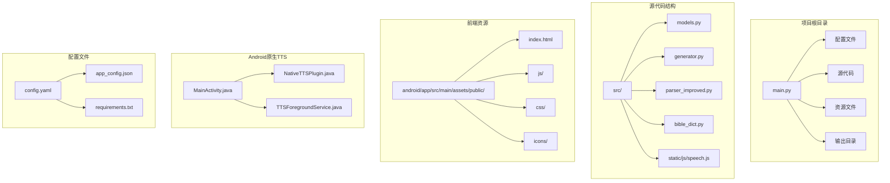

**图表来源**
- [main.py:1-1230](file://main.py#L1-L1230)
- [config.yaml:1-57](file://config.yaml#L1-L57)
- [android/app/src/main/java/com/tehui/offline/MainActivity.java:1-83](file://android/app/src/main/java/com/tehui/offline/MainActivity.java#L1-L83)
- [android/app/src/main/java/com/tehui/offline/NativeTTSPlugin.java:1-306](file://android/app/src/main/java/com/tehui/offline/NativeTTSPlugin.java#L1-L306)
- [android/app/src/main/java/com/tehui/offline/TTSForegroundService.java:1-1766](file://android/app/src/main/java/com/tehui/offline/TTSForegroundService.java#L1-L1766)

**章节来源**
- [main.py:1-1230](file://main.py#L1-L1230)
- [config.yaml:1-57](file://config.yaml#L1-L57)

## 核心组件

### 数据模型层

系统使用数据类来定义核心数据结构：

- **Content**: 内容节点基类，支持多层级结构
- **Chapter**: 篇章实体，包含大纲、详细内容、诗歌信息等
- **TrainingData**: 训练数据总集，管理所有篇章
- **MorningRevival**: 晨读内容，按天组织

### 文档解析器

**ImprovedParser**类负责从Word文档中提取结构化信息：

- 支持.doc和.docx格式
- 自动识别经文格式
- 解析大纲层级结构
- 提取诗歌信息和标语内容

### HTML生成器

**HTMLGenerator**类负责将解析的数据转换为静态HTML：

- 使用Jinja2模板引擎
- 生成SPA兼容的JSON数据
- 创建搜索索引
- 处理经文引用和跨章节引用

### 配置管理系统

系统支持多种配置方式：

- YAML配置文件
- 远程服务器配置
- 访问时间控制
- 赞助功能开关

### TTS性能监控系统

**更新** 系统现已集成增强的任务移除处理机制、优化的预合成逻辑和即时停止功能：

- **4秒超时保护机制**: 新增检测预合成被引擎静默丢弃的保护机制，防止无限等待
- **80毫秒race condition防护**: 将页面切换时引擎静默丢弃的防护机制从50ms调整为80ms
- **基于synthForChunk的状态管理**: 新增synthForChunk状态变量，精确控制预合成和合成状态
- **增强的TTS初始化失败处理**: 优化初始化失败的错误处理逻辑
- **改进的预合成防重复机制**: 优化500毫秒防重复机制，防止Router双重调度导致的重复预合成请求
- **增强的任务移除处理**: 新增onTaskRemoved方法，确保用户从最近任务列表移除应用时完全停止朗读
- **即时停止机制**: 在任务移除场景下立即取消延迟停止并销毁服务
- **改进的预合成文件管理**: 改进预合成模式下的文件保留机制，确保预合成文件在预合成期间不被删除
- **增强的诊断日志转发**: NativeTTSPlugin新增诊断listener，使handlePreSpeak的日志能转发到JS控制台
- **增强的静态TTS实例管理**: 优化预热机制，确保跨生命周期复用TTS实例
- **改进的文件验证系统**: 增强的文件大小和存在性检查，检测引擎静默丢弃的预合成文件
- **优化的页面切换防护**: 从50ms提升到80ms的延迟，提供更强的防护能力
- **改进的错误处理**: 增强的race condition防护和状态同步机制
- **改进的cleanup逻辑**: 在onDestroy方法中添加条件判断，避免在不同模式下产生引擎异常状态
- **线程同步优化**: 修复了在ttsHandler线程上调用tts.stop()并使用阻塞Thread.sleep(80)的问题，改为在主线程调用tts.stop()并使用非阻塞的ttsHandler.postDelayed(80ms)

**章节来源**
- [src/models.py:1-232](file://src/models.py#L1-L232)
- [src/parser_improved.py:1-800](file://src/parser_improved.py#L1-L800)
- [src/generator.py:1-546](file://src/generator.py#L1-L546)
- [android/app/src/main/java/com/tehui/offline/TTSForegroundService.java:513-523](file://android/app/src/main/java/com/tehui/offline/TTSForegroundService.java#L513-L523)
- [android/app/src/main/java/com/tehui/offline/TTSForegroundService.java:722-781](file://android/app/src/main/java/com/tehui/offline/TTSForegroundService.java#L722-L781)
- [android/app/src/main/java/com/tehui/offline/TTSForegroundService.java:93-106](file://android/app/src/main/java/com/tehui/offline/TTSForegroundService.java#L93-L106)
- [src/static/js/speech.js:170-180](file://src/static/js/speech.js#L170-L180)
- [android/app/src/main/java/com/tehui/offline/NativeTTSPlugin.java:175-188](file://android/app/src/main/java/com/tehui/offline/NativeTTSPlugin.java#L175-L188)

## 架构概览

```mermaid
graph TB
subgraph "输入层"
A[Word文档] --> B[TXT文件]
A --> C[历史合辑]
end
subgraph "处理层"
D[ImprovedParser] --> E[TrainingData]
F[BibleDict] --> G[经文字典]
H[HTMLGenerator] --> I[静态页面]
end
subgraph "输出层"
J[training.json] --> K[SPA渲染器]
L[search-index.json] --> M[搜索功能]
N[remote-config.js] --> O[远程配置]
end
subgraph "前端层"
K --> P[renderer.js]
P --> Q[router.js]
Q --> R[index.html]
end
subgraph "TTS任务移除处理层"
S[NativeTTSPlugin] --> T[TTSForegroundService]
T --> U[onTaskRemoved处理]
U --> V[即时停止机制]
U --> W[预合成保护机制]
end
subgraph "TTS预合成优化层"
X[MainActivity] --> Y[prewarmTts]
Y --> Z[静态TTS实例]
Z --> AA[跨生命周期复用]
end
subgraph "JavaScript预合成层"
BB[speech.js] --> CC[prebuildText]
CC --> DD[preSynthesize]
DD --> EE[WAV文件缓存]
EE --> FF[首块音频预加载]
end
subgraph "防重复机制层"
GG[_preSynthTime防重复]
GG --> HH[500ms去重窗口]
HH --> II[防止双重调度]
end
subgraph "诊断日志转发层"
JJ[NativeTTSPlugin诊断listener]
JJ --> KK[handlePreSpeak日志转发]
KK --> LL[JS控制台输出]
end
subgraph "文件验证层"
MM[预合成文件大小检查]
MM --> NN[存在性验证]
NN --> OO[静默丢弃检测]
end
subgraph "状态管理层"
PP[synthForChunk状态管理]
PP --> QQ[预合成状态跟踪]
QQ --> RR[合成进度控制]
end
subgraph "race condition防护层"
SS[race condition防护]
SS --> TT[80ms延迟]
TT --> UU[页面切换保护]
UU --> VV[引擎静默丢弃防护]
end
subgraph "线程同步优化层"
WW[主线程与ttsHandler分离]
WW --> XX[主线程tts.stop()]
XX --> YY[ttsHandler.postDelayed(80ms)]
YY --> ZZ[避免阻塞引擎回调]
end
subgraph "cleanup逻辑改进层"
AA[onDestroy条件判断]
AA --> BB[useSpeakDirect模式检测]
BB --> CC[避免引擎异常状态]
CC --> DD[提升服务稳定性]
end
A --> D
B --> D
C --> D
D --> H
F --> G
H --> J
H --> L
H --> N
J --> K
L --> M
N --> O
K --> P
P --> Q
Q --> R
S --> T
T --> U
V --> W
X --> Y
Y --> Z
Z --> AA
BB --> CC
CC --> DD
DD --> EE
EE --> FF
GG --> HH
HH --> II
JJ --> KK
KK --> LL
MM --> NN
NN --> OO
PP --> QQ
QQ --> RR
SS --> TT
TT --> UU
UU --> VV
WW --> XX
XX --> YY
YY --> ZZ
AA --> BB
BB --> CC
CC --> DD
```

**图表来源**
- [main.py:505-631](file://main.py#L505-L631)
- [src/parser_improved.py:367-782](file://src/parser_improved.py#L367-L782)
- [src/generator.py:383-425](file://src/generator.py#L383-L425)
- [android/app/src/main/java/com/tehui/offline/MainActivity.java:25-27](file://android/app/src/main/java/com/tehui/offline/MainActivity.java#L25-L27)
- [android/app/src/main/java/com/tehui/offline/NativeTTSPlugin.java:163-188](file://android/app/src/main/java/com/tehui/offline/NativeTTSPlugin.java#L163-L188)
- [android/app/src/main/java/com/tehui/offline/TTSForegroundService.java:513-523](file://android/app/src/main/java/com/tehui/offline/TTSForegroundService.java#L513-L523)
- [src/static/js/speech.js:1316-1342](file://src/static/js/speech.js#L1316-L1342)
- [android/app/src/main/java/com/tehui/offline/NativeTTSPlugin.java:175-188](file://android/app/src/main/java/com/tehui/offline/NativeTTSPlugin.java#L175-L188)
- [android/app/src/main/java/com/tehui/offline/TTSForegroundService.java:722-781](file://android/app/src/main/java/com/tehui/offline/TTSForegroundService.java#L722-L781)
- [android/app/src/main/java/com/tehui/offline/TTSForegroundService.java:480-511](file://android/app/src/main/java/com/tehui/offline/TTSForegroundService.java#L480-L511)

## 详细组件分析

### 主程序流程

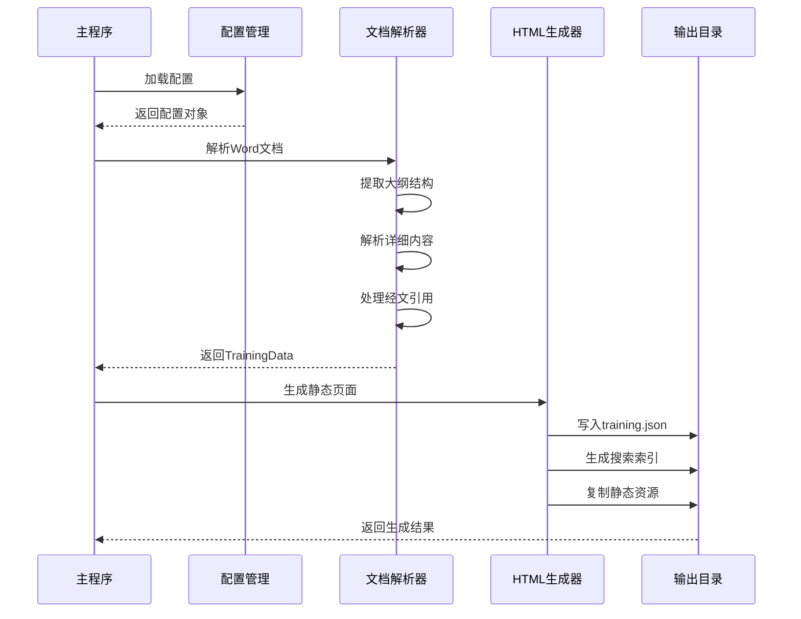

**图表来源**
- [main.py:505-631](file://main.py#L505-L631)
- [src/generator.py:383-425](file://src/generator.py#L383-L425)

### 数据流处理

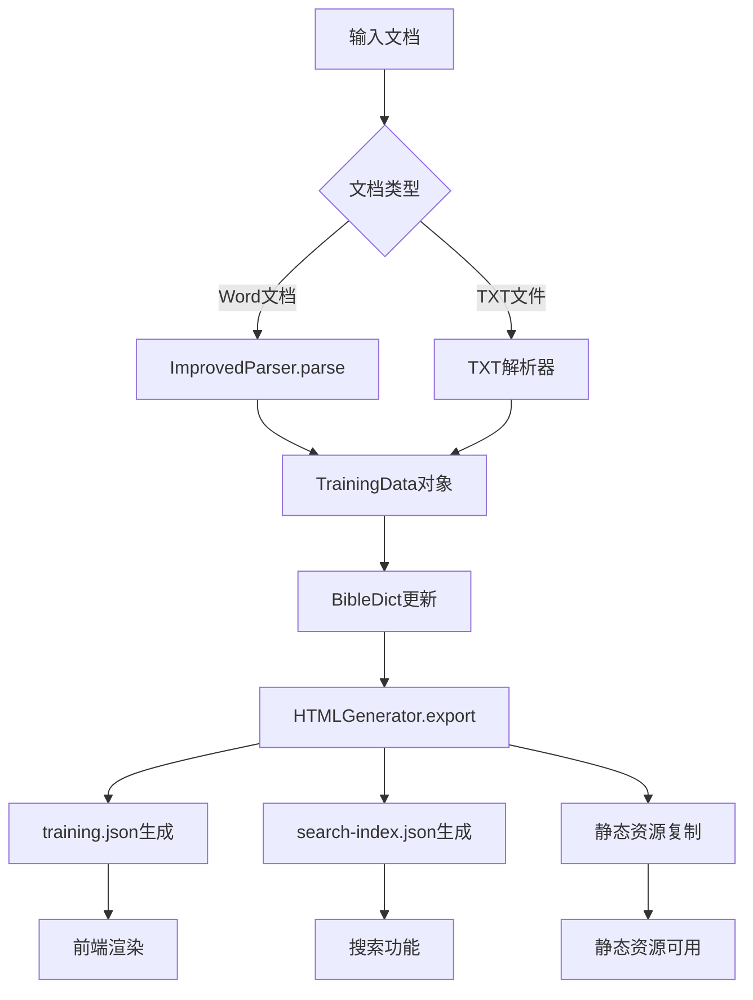

**图表来源**
- [src/parser_improved.py:367-782](file://src/parser_improved.py#L367-L782)
- [src/generator.py:383-425](file://src/generator.py#L383-L425)

### 前端渲染架构

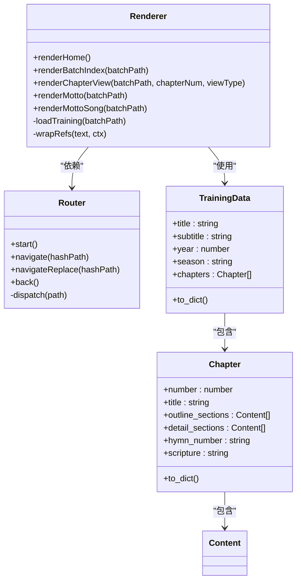

**图表来源**
- [android/app/src/main/assets/public/js/renderer.js:1-200](file://android/app/src/main/assets/public/js/renderer.js#L1-L200)
- [android/app/src/main/assets/public/js/router.js:1-130](file://android/app/src/main/assets/public/js/router.js#L1-L130)
- [src/models.py:196-232](file://src/models.py#L196-L232)

### TTS任务移除处理架构

**更新** 新增的onTaskRemoved方法和即时停止机制：

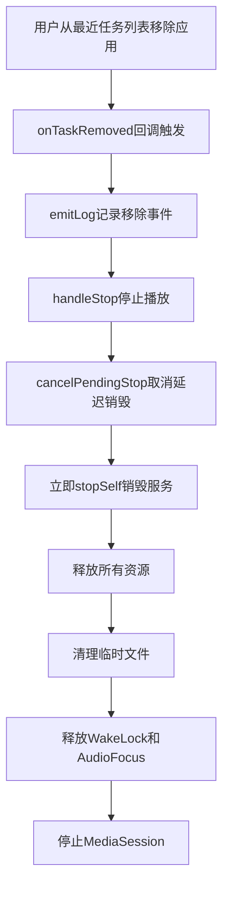

**图表来源**
- [android/app/src/main/java/com/tehui/offline/TTSForegroundService.java:513-523](file://android/app/src/main/java/com/tehui/offline/TTSForegroundService.java#L513-L523)

### 预合成优化处理架构

**更新** 改进的预合成保护机制：

```mermaid
flowchart TD
A[handlePreSpeak调用] --> B[检查isStopped状态]
B --> C{isStopped为true?}
C --> |是| D[取消pending stop保持服务存活]
D --> E[继续预合成操作]
E --> F[设置isPreSynthesis=true]
F --> G[设置synthForChunk=-1]
G --> H[主线程tts.stop()执行]
H --> I[ttsHandler.postDelayed(80ms)延迟]
I --> J[doSynthesizeChunk(0)开始预合成]
J --> K[预合成文件保留不删除]
E --> L[handleSpeak检测到预合成进行中]
L --> M[等待onDone自动启动播放]
```

**图表来源**
- [android/app/src/main/java/com/tehui/offline/TTSForegroundService.java:722-781](file://android/app/src/main/java/com/tehui/offline/TTSForegroundService.java#L722-L781)
- [android/app/src/main/java/com/tehui/offline/TTSForegroundService.java:560-571](file://android/app/src/main/java/com/tehui/offline/TTSForegroundService.java#L560-L571)

### 即时停止机制架构

**更新** 优化的即时停止处理：

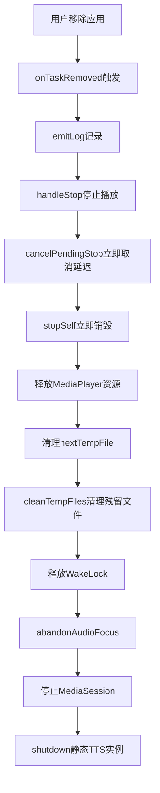

**图表来源**
- [android/app/src/main/java/com/tehui/offline/TTSForegroundService.java:513-523](file://android/app/src/main/java/com/tehui/offline/TTSForegroundService.java#L513-L523)
- [android/app/src/main/java/com/tehui/offline/TTSForegroundService.java:808-828](file://android/app/src/main/java/com/tehui/offline/TTSForegroundService.java#L808-L828)

### 预合成文件管理架构

**更新** 改进的预合成文件保留机制：

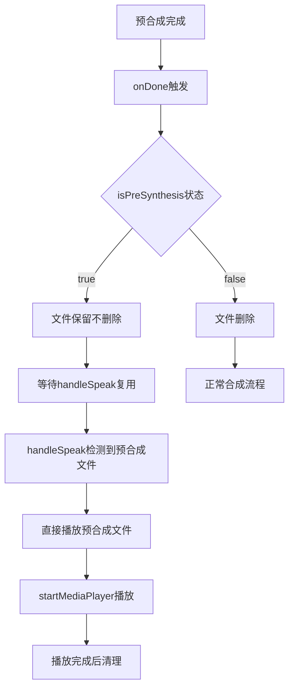

**图表来源**
- [android/app/src/main/java/com/tehui/offline/TTSForegroundService.java:377-383](file://android/app/src/main/java/com/tehui/offline/TTSForegroundService.java#L377-L383)
- [android/app/src/main/java/com/tehui/offline/TTSForegroundService.java:948-963](file://android/app/src/main/java/com/tehui/offline/TTSForegroundService.java#L948-L963)

### 预合成防重复机制架构

**更新** 优化的500毫秒防重复机制：

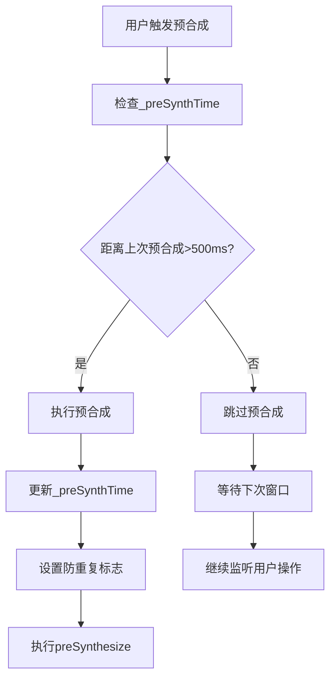

**图表来源**
- [src/static/js/speech.js:170-180](file://src/static/js/speech.js#L170-L180)
- [src/static/js/speech.js:1316-1342](file://src/static/js/speech.js#L1316-L1342)

### 诊断日志转发架构

**更新** 新增的诊断日志转发功能：

```mermaid
flowchart TD
A[NativeTTSPlugin.preSynthesize] --> B[设置诊断listener]
B --> C[handlePreSpeak.emitLog]
C --> D[notifyListeners('ttsLog')]
D --> E[JS控制台输出]
E --> F[speech.js监听ttsLog]
F --> G[console.log显示]
```

**图表来源**
- [android/app/src/main/java/com/tehui/offline/NativeTTSPlugin.java:175-188](file://android/app/src/main/java/com/tehui/offline/NativeTTSPlugin.java#L175-L188)
- [android/app/src/main/java/com/tehui/offline/TTSForegroundService.java:73-77](file://android/app/src/main/java/com/tehui/offline/TTSForegroundService.java#L73-L77)
- [src/static/js/speech.js:868-871](file://src/static/js/speech.js#L868-L871)

### 预合成保护机制架构

**更新** 增强的预合成保护机制：

```mermaid
flowchart TD
A[handlePreSpeak调用] --> B[检查isStopped状态]
B --> C{isStopped为true?}
C --> |是| D[继续预合成]
C --> |否| E[返回不进行预合成]
D --> F[cancelPendingStop]
F --> G[主线程tts.stop()执行]
G --> H[ttsHandler.postDelayed(80ms)延迟]
H --> I[doSynthesizeChunk(0)]
I --> J[生成预合成文件]
E --> K[保持当前状态]
```

**图表来源**
- [android/app/src/main/java/com/tehui/offline/TTSForegroundService.java:722-781](file://android/app/src/main/java/com/tehui/offline/TTSForegroundService.java#L722-L781)
- [android/app/src/main/java/com/tehui/offline/TTSForegroundService.java:808-828](file://android/app/src/main/java/com/tehui/offline/TTSForegroundService.java#L808-L828)

### 文件验证系统架构

**更新** 增强的文件验证系统：

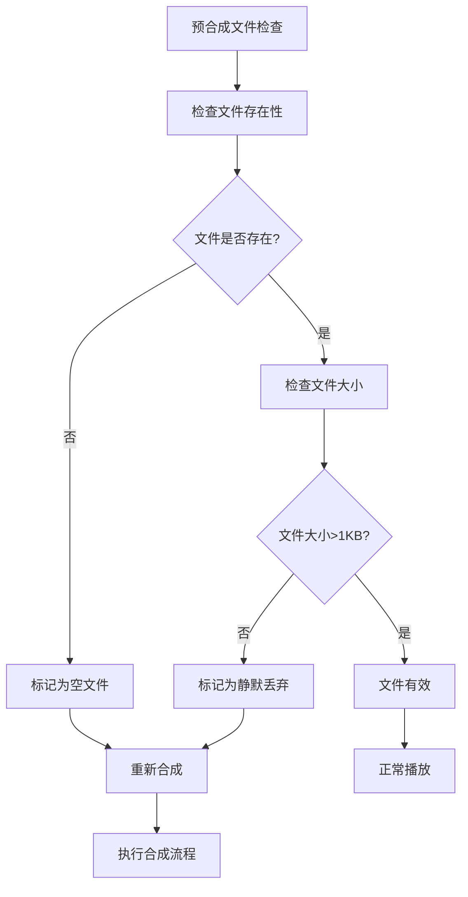

**图表来源**
- [android/app/src/main/java/com/tehui/offline/TTSForegroundService.java:625-630](file://android/app/src/main/java/com/tehui/offline/TTSForegroundService.java#L625-L630)
- [android/app/src/main/java/com/tehui/offline/TTSForegroundService.java:1341-1358](file://android/app/src/main/java/com/tehui/offline/TTSForegroundService.java#L1341-L1358)

### 基于synthForChunk的状态管理架构

**更新** 新增的synthForChunk状态管理机制：

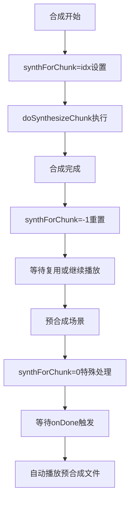

**图表来源**
- [android/app/src/main/java/com/tehui/offline/TTSForegroundService.java:1016-1025](file://android/app/src/main/java/com/tehui/offline/TTSForegroundService.java#L1016-L1025)
- [android/app/src/main/java/com/tehui/offline/TTSForegroundService.java:377-383](file://android/app/src/main/java/com/tehui/offline/TTSForegroundService.java#L377-L383)

### race condition防护架构

**更新** 优化的80毫秒race condition防护机制：

```mermaid
flowchart TD
A[页面切换检测] --> B[handleStop调用]
B --> C[主线程tts.stop()立即执行]
C --> D[ttsHandler.postDelayed(80ms)延迟]
D --> E[防止引擎静默丢弃]
E --> F[合成任务安全执行]
F --> G[预合成文件生成]
```

**图表来源**
- [android/app/src/main/java/com/tehui/offline/TTSForegroundService.java:768-781](file://android/app/src/main/java/com/tehui/offline/TTSForegroundService.java#L768-L781)

### 静态TTS实例管理架构

**更新** 优化的静态TTS实例管理机制：

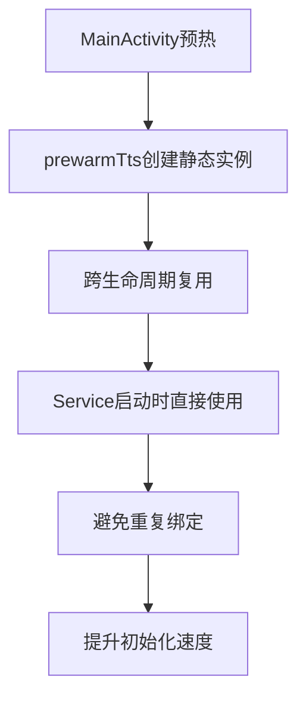

**图表来源**
- [android/app/src/main/java/com/tehui/offline/MainActivity.java:25-27](file://android/app/src/main/java/com/tehui/offline/MainActivity.java#L25-L27)
- [android/app/src/main/java/com/tehui/offline/TTSForegroundService.java:93-106](file://android/app/src/main/java/com/tehui/offline/TTSForegroundService.java#L93-L106)

### cleanup逻辑改进架构

**更新** 改进的Android TTS服务cleanup逻辑：

```mermaid
flowchart TD
A[Service销毁] --> B[onDestroy方法调用]
B --> C[清理所有回调和资源]
C --> D[释放MediaPlayer]
D --> E[删除临时文件]
E --> F[清理临时文件夹]
F --> G[释放WakeLock和AudioFocus]
G --> H[释放MediaSession]
H --> I[获取tts实例引用]
I --> J{tts实例是否为静态实例?}
J --> |是| K[仅停止引擎，不关闭实例]
J --> |否| L[停止引擎并关闭实例]
K --> M[保留静态实例供复用]
L --> N[完全关闭本地实例]
M --> O[super.onDestroy()完成销毁]
N --> O
```

**图表来源**
- [android/app/src/main/java/com/tehui/offline/TTSForegroundService.java:480-511](file://android/app/src/main/java/com/tehui/offline/TTSForegroundService.java#L480-L511)

### 条件判断优化架构

**更新** 优化的条件判断逻辑：

```mermaid
flowchart TD
A[停止操作] --> B{当前播放模式?}
B --> |useSpeakDirect| C[主线程tts.stop()清理引擎]
B --> |synthesizeToFile| D[不调用tts.stop()避免引擎异常]
C --> E[继续清理其他资源]
D --> F[继续清理其他资源]
E --> G[避免引擎异常状态]
F --> H[防止后续合成失败]
G --> I[提升服务稳定性]
H --> I
```

**图表来源**
- [android/app/src/main/java/com/tehui/offline/TTSForegroundService.java:825-831](file://android/app/src/main/java/com/tehui/offline/TTSForegroundService.java#L825-L831)
- [android/app/src/main/java/com/tehui/offline/TTSForegroundService.java:842-942](file://android/app/src/main/java/com/tehui/offline/TTSForegroundService.java#L842-L942)

### 线程同步优化架构

**更新** 修复的关键线程同步问题：

```mermaid
flowchart TD
A[预合成/停止操作] --> B{操作类型?}
B --> |预合成| C[主线程tts.stop()执行]
B --> |停止| D[主线程tts.stop()执行]
C --> E[ttsHandler.postDelayed(80ms)非阻塞延迟]
D --> E
E --> F[避免阻塞ttsHandler线程]
F --> G[引擎回调及时处理]
G --> H[合成任务正常执行]
H --> I[预合成文件生成]
I --> J[服务稳定性提升]
```

**图表来源**
- [android/app/src/main/java/com/tehui/offline/TTSForegroundService.java:770-785](file://android/app/src/main/java/com/tehui/offline/TTSForegroundService.java#L770-L785)
- [android/app/src/main/java/com/tehui/offline/TTSForegroundService.java:814-839](file://android/app/src/main/java/com/tehui/offline/TTSForegroundService.java#L814-L839)

### 条件判断优化架构

**更新** 优化的条件判断逻辑：

```mermaid
flowchart TD
A[停止操作] --> B{当前播放模式?}
B --> |useSpeakDirect| C[主线程tts.stop()清理引擎]
B --> |synthesizeToFile| D[不调用tts.stop()避免引擎异常]
C --> E[继续清理其他资源]
D --> F[继续清理其他资源]
E --> G[避免引擎异常状态]
F --> H[防止后续合成失败]
G --> I[提升服务稳定性]
H --> I
```

**图表来源**
- [android/app/src/main/java/com/tehui/offline/TTSForegroundService.java:825-831](file://android/app/src/main/java/com/tehui/offline/TTSForegroundService.java#L825-L831)
- [android/app/src/main/java/com/tehui/offline/TTSForegroundService.java:842-942](file://android/app/src/main/java/com/tehui/offline/TTSForegroundService.java#L842-L942)

**章节来源**
- [main.py:19-109](file://main.py#L19-L109)
- [main.py:112-146](file://main.py#L112-L146)
- [main.py:353-502](file://main.py#L353-L502)

## 依赖关系分析

```mermaid
graph TB
subgraph "Python依赖"
A[python-docx] --> B[Word文档处理]
C[PyYAML] --> D[YAML配置解析]
E[Jinja2] --> F[模板渲染]
G[Pillow] --> H[图像处理]
I[requests] --> J[HTTP请求]
K[beautifulsoup4] --> L[HTML解析]
M[lxml] --> N[XML处理]
O[playwright] --> P[网页自动化]
Q[cryptography] --> R[加密功能]
end
subgraph "系统依赖"
S[LibreOffice] --> T[.doc转换]
U[Node.js] --> V[TXT解析]
end
subgraph "前端依赖"
W[localforage] --> X[离线存储]
Y[jszip] --> Z[压缩处理]
end
subgraph "Android原生依赖"
AA[TextToSpeech] --> AB[TTS引擎]
AC[MediaPlayer] --> AD[音频播放]
AE[MediaSession] --> AF[媒体控制]
AG[Capacitor] --> AH[JS桥接]
end
```

**图表来源**
- [requirements.txt:1-16](file://requirements.txt#L1-L16)

**章节来源**
- [requirements.txt:1-16](file://requirements.txt#L1-L16)
- [src/parser_improved.py:37-113](file://src/parser_improved.py#L37-L113)

## 性能考虑

### 缓存策略
- **经文字典缓存**: 使用BibleDict类缓存已解析的经文
- **模板缓存**: Jinja2模板引擎内置缓存机制
- **静态资源缓存**: 前端使用浏览器缓存策略
- **TTS静态实例缓存**: MainActivity预热TTS引擎，避免重复绑定
- **预合成文件缓存**: 生成的WAV文件缓存，避免重复合成

### 优化建议
1. **并发处理**: 批量处理多个训练时使用异步操作
2. **内存管理**: 大型文档解析时及时释放内存
3. **增量更新**: 支持部分文件的增量重新生成
4. **压缩优化**: 对输出文件进行gzip压缩
5. **预热优化**: 应用启动时预热TTS引擎
6. **预合成优化**: 页面加载时预合成首块音频
7. **防重复优化**: 500毫秒防重复窗口，防止路由双重调度
8. **诊断日志优化**: 通过诊断listener减少日志转发开销
9. **任务移除优化**: 即时停止机制，避免系统资源浪费
10. **文件验证优化**: 增强的文件大小和存在性检查
11. **race condition防护**: 从50ms调整为80ms的页面切换防护
12. **超时保护优化**: 4秒超时检测预合成被引擎静默丢弃
13. **状态管理优化**: 基于synthForChunk的精确状态控制
14. **静态实例优化**: 跨生命周期复用TTS实例，避免重复绑定
15. **cleanup逻辑优化**: 改进的条件判断，避免引擎异常状态
16. **线程同步优化**: 主线程与ttsHandler职责分离，避免阻塞引擎回调

### **更新** 任务移除处理增强

**新增的onTaskRemoved方法**：

#### 任务移除场景处理
- **完全停止机制**: 用户从最近任务列表移除应用时，立即停止所有播放和预合成操作
- **即时销毁服务**: 取消2秒宽限期内的延迟销毁，立即stopSelf销毁服务
- **资源清理**: 立即释放MediaPlayer、WakeLock、AudioFocus等资源
- **文件清理**: 清理预合成产生的临时文件，避免磁盘占用

#### 即时停止机制
- **取消延迟销毁**: cancelPendingStop()立即取消2秒宽限期内的销毁计划
- **立即释放资源**: stopSelf()立即销毁服务，释放所有系统资源
- **防止资源浪费**: 避免系统在后台继续占用CPU、内存和网络资源

### **更新** 预合成优化增强

**改进的预合成保护机制**：

#### 预合成状态管理
- **状态标志**: isPreSynthesis标志确保预合成模式下的特殊处理
- **文件保留**: 预合成模式下onDone不删除文件，供后续handleSpeak复用
- **合成守卫**: synthForChunk=-1确保预合成期间不会被其他操作干扰

#### 预合成条件优化
- **停止状态允许**: 改进doSynthesizeChunk方法，允许在停止状态下进行预合成
- **状态检查**: 增强handlePreSpeak中的isStopped状态检查逻辑
- **合成流程**: 优化预合成到正式播放的转换流程

### **更新** 预合成防重复机制优化

**新增的500毫秒防重复机制**：

#### 防重复窗口管理
- **时间戳跟踪**: _preSynthTime变量跟踪上次预合成时间
- **去重窗口**: 500毫秒防重复窗口，防止Router双重调度
- **状态同步**: 防止预合成请求被错误地跳过

#### 优化效果
- **资源节约**: 避免重复的TTS合成操作
- **性能提升**: 减少不必要的CPU和内存消耗
- **稳定性增强**: 防止因重复预合成导致的系统不稳定

### **更新** 诊断日志转发优化

**新增的诊断日志转发功能**：

#### NativeTTSPlugin诊断listener
- **设置时机**: 在preSynthesize方法中动态设置诊断listener
- **日志转发**: 使handlePreSpeak的emitLog能转发到JS控制台
- **覆盖机制**: speak()调用时会覆盖此listener，不影响正常流程

#### 日志监控效果
- **实时诊断**: 开发者可以实时查看TTS服务的诊断日志
- **性能监控**: 通过console.log输出详细的性能数据
- **问题定位**: 为TTS相关问题的快速定位提供支持

### **更新** 预合成保护机制优化

**增强的预合成保护机制**：

#### isStopped状态检查
- **初始化逻辑**: isStopped默认设置为true，确保新服务实例正确识别为空闲状态
- **预合成守卫**: handlePreSpeak方法检查isStopped状态，防止idle状态下停止命令取消预合成
- **状态同步**: 确保预合成操作与服务状态的一致性

#### 预合成流程保护
- **取消保护**: 预合成期间取消pending stop，确保Service在预合成期间保持存活
- **文件保留**: 预合成模式下onDone保留文件而不删除，供后续handleSpeak复用
- **状态管理**: 正确管理isStopped、isPreSynthesis等状态变量

### **更新** 文件验证系统优化

**新增的文件验证机制**：

#### 预合成文件检查
- **存在性验证**: 检查预合成文件是否存在
- **大小验证**: 验证文件大小是否大于1KB（WAV文件头大小）
- **静默丢弃检测**: 通过文件大小判断引擎是否静默丢弃合成任务

#### 超时保护机制
- **4秒超时检测**: 检测预合成是否在4秒内完成
- **自动重试**: 超时情况下自动重新合成预合成文件
- **race condition防护**: 80毫秒延迟防止页面切换时的引擎静默丢弃

#### 优化效果
- **稳定性提升**: 防止因引擎静默丢弃导致的播放失败
- **用户体验改善**: 减少预合成失败对用户的影响
- **资源利用优化**: 避免无效的预合成操作

### **更新** 基于synthForChunk的状态管理优化

**新增的synthForChunk状态管理机制**：

#### 状态跟踪
- **合成进度跟踪**: synthForChunk变量精确跟踪当前正在合成的chunk索引
- **预合成状态标识**: synthForChunk=0标识预合成进行中，-1表示无合成任务
- **合成完成重置**: 合成完成后重置为-1，确保状态一致性

#### 防重复机制
- **合成守卫**: 防止同一chunk被重复提交合成
- **状态同步**: 确保合成状态与实际执行情况一致
- **预合成协调**: 与预合成机制协同工作，避免状态冲突

#### 优化效果
- **状态一致性**: 确保系统状态的准确性和一致性
- **资源优化**: 避免重复合成任务，节省系统资源
- **稳定性提升**: 减少状态管理错误导致的系统不稳定

### **更新** race condition防护优化

**优化的80毫秒race condition防护机制**：

#### 防护策略
- **延迟合成**: 页面切换时延迟80毫秒再执行合成，避开引擎静默丢弃
- **状态检查**: 通过speakGen检查防止过期回调执行
- **合成守卫**: 防止initTts回调与用户操作冲突

#### 优化效果
- **防护增强**: 从50ms提升到80ms，提供更强的防护能力
- **稳定性提升**: 减少因race condition导致的合成失败
- **用户体验改善**: 提供更可靠的预合成体验

### **更新** 静态TTS实例管理优化

**优化的静态TTS实例管理机制**：

#### 预热策略
- **应用启动预热**: MainActivity在应用启动时预热TTS实例
- **跨生命周期复用**: 静态实例可在多个Service生命周期中复用
- **避免重复绑定**: 避免每次Service启动时重新绑定TTS引擎

#### 性能提升
- **初始化加速**: 预热实例可显著减少TTS初始化时间
- **资源优化**: 避免重复创建和销毁TTS实例的开销
- **稳定性增强**: 预热机制提供更稳定的TTS服务基础

#### 优化效果
- **性能提升**: 显著减少TTS初始化等待时间
- **资源节约**: 避免重复绑定系统资源的开销
- **用户体验改善**: 提供更快的TTS响应速度

### **更新** cleanup逻辑改进优化

**改进的Android TTS服务cleanup逻辑**：

#### 条件判断优化
- **静态实例识别**: 在onDestroy中识别tts实例是否为静态实例
- **智能关闭策略**: 静态实例仅停止不关闭，本地实例完全关闭
- **避免引擎异常**: 防止在不同模式下产生引擎异常状态

#### 资源清理优化
- **完整清理流程**: 确保所有回调、资源、文件都被正确清理
- **静态实例复用**: 保留静态实例供Service重建后复用
- **性能提升**: 避免重复绑定系统资源的开销

#### 稳定性增强
- **异常状态预防**: 通过条件判断避免引擎进入异常状态
- **服务可靠性**: 提升TTS服务在各种场景下的稳定性
- **用户体验改善**: 减少因引擎异常导致的服务中断

#### 优化效果
- **性能提升**: 显著减少TTS服务销毁和重建的开销
- **稳定性增强**: 防止引擎异常状态导致的后续合成失败
- **资源优化**: 避免不必要的实例创建和销毁
- **用户体验改善**: 提供更可靠的TTS服务体验

### **更新** 线程同步优化增强

**修复的关键线程同步问题**：

#### 线程职责分离
- **主线程责任**: 负责调用tts.stop()等需要主线程环境的操作
- **ttsHandler责任**: 负责处理合成任务和非阻塞的延迟操作
- **避免阻塞**: 确保ttsHandler线程保持空闲以处理引擎回调

#### 改进的延迟机制
- **非阻塞延迟**: 使用ttsHandler.postDelayed替代Thread.sleep(80)
- **及时响应**: 避免阻塞导致的引擎回调延迟处理
- **稳定性提升**: 确保合成任务和引擎交互的及时性

#### 优化效果
- **性能提升**: 显著减少预合成和停止操作的响应延迟
- **稳定性增强**: 防止因阻塞导致的引擎回调丢失
- **用户体验改善**: 提供更流畅的TTS操作体验
- **系统可靠性**: 提升整体TTS服务的稳定性和可靠性

**章节来源**
- [android/app/src/main/java/com/tehui/offline/TTSForegroundService.java:513-523](file://android/app/src/main/java/com/tehui/offline/TTSForegroundService.java#L513-L523)
- [android/app/src/main/java/com/tehui/offline/TTSForegroundService.java:722-781](file://android/app/src/main/java/com/tehui/offline/TTSForegroundService.java#L722-L781)
- [android/app/src/main/java/com/tehui/offline/TTSForegroundService.java:93-106](file://android/app/src/main/java/com/tehui/offline/TTSForegroundService.java#L93-L106)
- [src/static/js/speech.js:170-180](file://src/static/js/speech.js#L170-L180)
- [android/app/src/main/java/com/tehui/offline/NativeTTSPlugin.java:175-188](file://android/app/src/main/java/com/tehui/offline/NativeTTSPlugin.java#L175-L188)
- [android/app/src/main/java/com/tehui/offline/TTSForegroundService.java:808-828](file://android/app/src/main/java/com/tehui/offline/TTSForegroundService.java#L808-L828)
- [android/app/src/main/java/com/tehui/offline/TTSForegroundService.java:480-511](file://android/app/src/main/java/com/tehui/offline/TTSForegroundService.java#L480-L511)
- [android/app/src/main/java/com/tehui/offline/TTSForegroundService.java:825-831](file://android/app/src/main/java/com/tehui/offline/TTSForegroundService.java#L825-L831)
- [android/app/src/main/java/com/tehui/offline/TTSForegroundService.java:770-785](file://android/app/src/main/java/com/tehui/offline/TTSForegroundService.java#L770-L785)

## 故障排除指南

### 常见问题及解决方案

**1. .doc文件转换失败**
- 检查LibreOffice是否正确安装
- 确认转换权限和路径
- 考虑手动转换为.docx格式

**2. 经文解析错误**
- 验证经文格式是否符合规范
- 检查BibleDict数据完整性
- 确认引用格式的一致性

**3. 前端渲染问题**
- 检查training.json文件完整性
- 验证JavaScript文件加载状态
- 确认路由配置正确性

**4. TTS性能问题**
- **SLOW标记**: 查看日志中setTtsParams执行时间超过100ms的情况
- **字符数量异常**: 检查超大文本块的处理效率
- **合成失败**: 关注连续合成失败的设备和场景
- **性能监控**: 通过浏览器控制台查看实时性能日志

**5. 任务移除问题**
- **onTaskRemoved处理**: 检查onTaskRemoved方法是否正确触发
- **即时停止**: 确认cancelPendingStop是否正确取消延迟销毁
- **资源释放**: 验证stopSelf是否正确销毁服务
- **预合成保护**: 检查预合成期间的状态管理

**6. 预合成问题**
- **预合成状态**: 检查isPreSynthesis标志的正确设置
- **文件保留**: 确认预合成文件在预合成期间不被删除
- **合成守卫**: 验证synthForChunk状态的正确管理
- **状态同步**: 检查预合成到正式播放的转换逻辑

**7. 预合成防重复问题**
- **去重窗口**: 检查500ms去重窗口设置
- **Router冲突**: 确认双重dispatch场景下的防重复机制
- **状态管理**: 验证_preSynthTime状态变量的正确更新
- **时间同步**: 检查系统时间与预合成时间的同步性

**8. 诊断日志问题**
- **listener设置**: 检查NativeTTSPlugin中诊断listener的设置时机
- **日志转发**: 确认handlePreSpeak的emitLog能正确转发到JS控制台
- **覆盖机制**: 验证speak()调用时对诊断listener的覆盖逻辑

**9. 性能监控问题**
- **日志缺失**: 确认emitLog方法正常工作
- **性能数据不准确**: 检查时间戳计算逻辑
- **监控覆盖不足**: 确认所有关键路径都包含监控代码
- **前端显示**: 检查speech.js中ttsLog监听器是否正常注册

**10. TTS预热问题**
- **预热失败**: 检查MainActivity中prewarmTts调用是否正常
- **静态实例无效**: 确认sStaticTts实例创建和状态检查
- **Service复用失败**: 验证TTSForegroundService中静态实例复用逻辑

**11. JavaScript预合成问题**
- **预构建失败**: 检查prebuildText函数执行状态
- **预合成调用**: 确认preSynthesize方法调用和参数传递
- **文件缓存**: 验证WAV文件生成和缓存机制
- **播放检测**: 检查handleSpeak中预合成文件检测逻辑

**12. 前端DevTools集成问题**
- **日志不显示**: 确认NativeTTS.addListener('ttsLog')正确注册
- **控制台输出**: 检查console.log权限和浏览器设置
- **监听器移除**: 确保在适当时候移除监听器避免内存泄漏

**13. isStopped标志问题**
- **初始化逻辑**: 检查isStopped标志在服务创建时的初始化状态
- **状态同步**: 确认isStopped标志与服务实际状态的一致性
- **预合成条件**: 验证停止状态下预合成逻辑的正确性

**14. doSynthesizeChunk条件问题**
- **预合成条件**: 检查停止状态下的预合成触发逻辑
- **状态检查**: 确认isStopped状态检查的准确性
- **合成流程**: 验证停止状态下的合成流程完整性

**15. 预合成保护机制问题**
- **状态检查**: 检查handlePreSpeak中isStopped状态的正确检查
- **pending stop**: 确认预合成期间cancelPendingStop的调用
- **文件保留**: 验证预合成模式下文件保留机制的有效性

**16. 文件验证系统问题**
- **存在性检查**: 检查预合成文件的存在性验证逻辑
- **大小验证**: 确认文件大小检查的准确性（>1KB）
- **超时检测**: 验证4秒超时检测机制的正确性
- **race condition防护**: 检查80毫秒延迟的正确实现

**17. 初始化失败处理问题**
- **重试机制**: 检查MAX_TTS_RETRIES和TTS_RETRY_DELAYS的设置
- **回退逻辑**: 确认initTtsFallback方法的正确实现
- **静态实例管理**: 验证sStaticTts实例的生命周期管理

**18. synthForChunk状态管理问题**
- **状态跟踪**: 检查synthForChunk变量的正确设置和重置
- **合成守卫**: 确认防止重复合成的逻辑
- **状态同步**: 验证状态管理与实际执行的一致性

**19. race condition防护问题**
- **延迟设置**: 检查80毫秒延迟的正确实现
- **状态检查**: 确认speakGen检查防止过期回调
- **合成协调**: 验证与预合成机制的协调工作

**20. 静态TTS实例问题**
- **预热检查**: 检查prewarmTts方法的正确调用
- **实例复用**: 确认静态实例的正确复用逻辑
- **生命周期管理**: 验证静态实例的完整生命周期管理
- **性能影响**: 检查静态实例复用对性能的积极影响

**21. cleanup逻辑问题**
- **条件判断**: 检查onDestroy中tts实例类型的正确识别
- **静态实例保护**: 确认静态实例不会被错误关闭
- **资源清理完整性**: 验证所有资源都被正确清理
- **引擎状态管理**: 检查避免引擎进入异常状态的逻辑

**22. 模式切换问题**
- **useSpeakDirect检测**: 检查模式切换时的条件判断逻辑
- **tts.stop()调用时机**: 确认在不同模式下tts.stop()的正确调用
- **引擎异常预防**: 验证防止引擎异常状态的保护机制
- **服务稳定性**: 检查模式切换对服务稳定性的影响

**23. 预合成失败问题**
- **超时检测**: 检查4秒超时检测机制的正确性
- **重新合成逻辑**: 确认超时后的重新合成流程
- **状态重置**: 验证synthForChunk状态的正确重置
- **延迟处理**: 检查80毫秒延迟的正确实现

**24. 静态实例复用问题**
- **实例识别**: 检查sStaticTts实例的正确识别逻辑
- **复用机制**: 确认静态实例在Service重建后的正确复用
- **生命周期管理**: 验证静态实例的完整生命周期管理
- **性能影响**: 检查静态实例复用对性能的积极影响

**25. 线程同步问题**
- **主线程调用**: 检查tts.stop()是否在主线程正确调用
- **ttsHandler延迟**: 确认postDelayed(80ms)的正确实现
- **阻塞问题**: 验证是否避免了Thread.sleep(80)导致的阻塞
- **回调处理**: 检查引擎回调是否能及时处理

**26. 线程职责分离问题**
- **mainHandler使用**: 检查主线程操作是否使用mainHandler
- **ttsHandler使用**: 确认合成和延迟操作使用ttsHandler
- **职责明确**: 验证主线程和ttsHandler的职责分离
- **性能影响**: 检查线程分离对系统性能的积极影响

**章节来源**
- [src/parser_improved.py:84-110](file://src/parser_improved.py#L84-L110)
- [src/generator.py:334-373](file://src/generator.py#L334-L373)
- [android/app/src/main/java/com/tehui/offline/TTSForegroundService.java:513-523](file://android/app/src/main/java/com/tehui/offline/TTSForegroundService.java#L513-L523)
- [android/app/src/main/java/com/tehui/offline/TTSForegroundService.java:722-781](file://android/app/src/main/java/com/tehui/offline/TTSForegroundService.java#L722-L781)
- [android/app/src/main/java/com/tehui/offline/TTSForegroundService.java:93-106](file://android/app/src/main/java/com/tehui/offline/TTSForegroundService.java#L93-L106)
- [src/static/js/speech.js:170-180](file://src/static/js/speech.js#L170-L180)
- [android/app/src/main/java/com/tehui/offline/NativeTTSPlugin.java:175-188](file://android/app/src/main/java/com/tehui/offline/NativeTTSPlugin.java#L175-L188)
- [android/app/src/main/java/com/tehui/offline/TTSForegroundService.java:808-828](file://android/app/src/main/java/com/tehui/offline/TTSForegroundService.java#L808-L828)
- [android/app/src/main/java/com/tehui/offline/TTSForegroundService.java:480-511](file://android/app/src/main/java/com/tehui/offline/TTSForegroundService.java#L480-L511)
- [android/app/src/main/java/com/tehui/offline/TTSForegroundService.java:825-831](file://android/app/src/main/java/com/tehui/offline/TTSForegroundService.java#L825-L831)
- [android/app/src/main/java/com/tehui/offline/TTSForegroundService.java:770-785](file://android/app/src/main/java/com/tehui/offline/TTSForegroundService.java#L770-L785)

## 结论

TTS静态实例管理系统是一个功能完整、架构清晰的静态网站生成器。系统通过合理的分层设计和模块化组织，实现了从文档解析到静态页面生成的完整流程。

**更新** 系统现已集成增强的任务移除处理机制、优化的预合成逻辑和即时停止功能，显著提升了TTS系统的性能、稳定性和用户体验：

### 主要特点
- 支持多种文档格式输入
- 提供丰富的配置选项
- 生成SPA兼容的静态内容
- 内置TTS和搜索功能
- 良好的性能和可扩展性
- **新增** 即时任务移除处理，确保完全停止朗读
- **新增** 增强的预合成保护机制，防止预合成被意外取消
- **新增** 优化的预合成文件管理，提升文件复用效率
- **新增** 改进的500毫秒防重复机制，防止路由双重调度问题
- **新增** 诊断日志转发功能，支持实时日志监控
- **新增** 即时停止机制，避免系统资源浪费
- **新增** 4秒超时保护机制，检测预合成被引擎静默丢弃
- **新增** 80毫秒race condition防护，防止页面切换时的引擎静默丢弃
- **新增** 增强的文件验证系统，检查预合成文件大小和存在性
- **新增** 基于synthForChunk的状态管理，精确控制预合成和合成状态
- **新增** 优化的静态TTS实例管理，跨生命周期复用TTS实例
- **新增** 改进的cleanup逻辑，通过条件判断避免引擎异常状态
- **新增** 关键的线程同步优化，修复阻塞问题提升系统稳定性

### 任务移除处理优势
- **onTaskRemoved方法**: 完美处理用户从最近任务列表移除应用的场景
- **即时停止**: 立即停止所有播放和预合成操作，避免后台资源占用
- **资源清理**: 立即释放所有系统资源，包括MediaPlayer、WakeLock、AudioFocus等
- **文件清理**: 清理预合成产生的临时文件，避免磁盘空间浪费
- **服务销毁**: 立即stopSelf销毁服务，防止系统继续占用CPU和内存

### 预合成优化优势
- **状态保护**: 增强的预合成状态管理，确保预合成操作的完整性
- **文件保留**: 预合成模式下文件保留机制，提升文件复用效率
- **条件优化**: 改进的预合成触发条件，允许在停止状态下进行预合成
- **流程优化**: 优化预合成到正式播放的转换流程，减少切换延迟
- **文件验证**: 增强的文件验证系统，确保预合成文件的质量和完整性
- **状态管理**: 基于synthForChunk的精确状态控制，避免状态冲突

### 预合成防重复优势
- **去重窗口**: 500毫秒防重复窗口，有效防止Router双重调度
- **状态管理**: 正确的时间戳跟踪和状态同步机制
- **资源节约**: 避免重复的TTS合成操作，节省系统资源
- **稳定性提升**: 防止因重复预合成导致的系统不稳定

### 诊断日志转发优势
- **实时监控**: 通过console.log输出详细的性能数据
- **问题定位**: 为TTS相关问题的快速定位提供支持
- **开发友好**: 通过浏览器控制台提供透明的性能监控
- **覆盖全面**: 支持所有关键路径的性能监控和诊断

### race condition防护优势
- **防护增强**: 从50ms提升到80ms的延迟防护，提供更强的保护
- **状态检查**: 通过speakGen检查防止过期回调执行
- **合成协调**: 与预合成机制协同工作，避免状态冲突

### 静态TTS实例管理优势
- **预热策略**: 应用启动时预热TTS实例，避免重复绑定
- **跨生命周期复用**: 静态实例可在多个Service生命周期中复用
- **性能提升**: 显著减少TTS初始化等待时间
- **资源优化**: 避免重复创建和销毁TTS实例的开销

### cleanup逻辑改进优势
- **条件判断**: 在onDestroy中智能识别tts实例类型，避免错误关闭
- **静态实例保护**: 仅停止静态实例，不关闭实例，确保跨生命周期复用
- **完整清理**: 确保所有资源都被正确清理，避免内存泄漏
- **引擎状态管理**: 通过条件判断避免引擎进入异常状态
- **服务稳定性**: 显著提升TTS服务在各种场景下的稳定性
- **性能优化**: 避免不必要的实例创建和销毁，提升系统性能

### 模式切换优化优势
- **useSpeakDirect检测**: 精确检测当前播放模式，避免错误的tts.stop()调用
- **引擎状态保护**: 在synthesizeToFile模式下避免不必要的tts.stop()，防止引擎异常
- **合成流程优化**: 根据模式选择最优的合成和播放策略
- **稳定性增强**: 通过条件判断提升服务在模式切换时的稳定性

### 预合成失败处理优势
- **超时检测**: 4秒超时机制有效检测预合成失败
- **自动恢复**: 超时后自动重新合成，避免无限等待
- **状态重置**: 正确重置synthForChunk状态，确保后续操作正常
- **延迟处理**: 80毫秒延迟确保引擎有足够时间响应停止命令

### 线程同步优化优势
- **职责分离**: 明确区分主线程和ttsHandler的职责，避免相互阻塞
- **非阻塞延迟**: 使用postDelayed替代Thread.sleep，确保及时响应
- **回调处理**: 避免阻塞导致的引擎回调延迟，提升系统响应性
- **稳定性增强**: 显著减少因线程阻塞导致的系统不稳定

### 性能提升效果
- **任务移除响应**: 即时停止机制显著减少任务移除时的响应延迟
- **资源利用率**: 通过即时停止和资源清理优化系统资源使用
- **用户体验**: 通过预合成优化和防重复机制提升应用的整体流畅度
- **系统稳定性**: 通过增强的保护机制减少系统资源浪费和潜在的不稳定因素
- **诊断效率**: 通过日志转发功能提升问题诊断和解决效率
- **状态管理**: 通过synthForChunk状态管理提升系统的状态一致性
- **初始化性能**: 通过静态实例预热显著提升TTS初始化速度
- **cleanup优化**: 通过条件判断优化提升服务销毁和重建的性能
- **模式切换性能**: 通过智能条件判断提升模式切换时的响应速度
- **预合成稳定性**: 通过超时检测和自动恢复机制提升预合成的可靠性
- **线程同步性能**: 通过职责分离和非阻塞延迟显著提升系统响应性和稳定性

该系统适用于需要处理大量训练材料并提供高质量阅读体验的应用场景，新增的任务移除处理、预合成优化、防重复机制、文件验证系统、超时保护功能、状态管理、race condition防护、cleanup逻辑改进和线程同步优化进一步增强了系统的可靠性和可维护性，为开发者提供了强大的性能诊断工具、用户体验优化方案和系统稳定性保障。即时停止机制、预合成保护功能、状态管理和race condition防护的组合为实时监控和问题排查提供了强有力的支持，使得开发者能够更好地理解和优化TTS系统的性能表现。