# TTS静态实例管理系统

<cite>
**本文档引用的文件**
- [main.py](file://main.py)
- [config.yaml](file://config.yaml)
- [src/models.py](file://src/models.py)
- [src/generator.py](file://src/generator.py)
- [src/parser_improved.py](file://src/parser_improved.py)
- [src/bible_dict.py](file://src/bible_dict.py)
- [android/app/src/main/assets/public/js/renderer.js](file://android/app/src/main/assets/public/js/renderer.js)
- [android/app/src/main/assets/public/js/router.js](file://android/app/src/main/assets/public/js/router.js)
- [android/app/src/main/assets/public/index.html](file://android/app/src/main/assets/public/index.html)
- [android/app/src/main/java/com/tehui/offline/MainActivity.java](file://android/app/src/main/java/com/tehui/offline/MainActivity.java)
- [android/app/src/main/java/com/tehui/offline/NativeTTSPlugin.java](file://android/app/src/main/java/com/tehui/offline/NativeTTSPlugin.java)
- [android/app/src/main/java/com/tehui/offline/TTSForegroundService.java](file://android/app/src/main/java/com/tehui/offline/TTSForegroundService.java)
- [src/static/js/speech.js](file://src/static/js/speech.js)
- [app_config.json](file://app_config.json)
- [requirements.txt](file://requirements.txt)
</cite>

## 更新摘要
**变更内容**
- 新增事件驱动停止机制：引入 `onServiceStopped` 回调和 `ttsStopped` 事件，显著改善停止操作的可靠性和用户体验
- 改进预合成状态跟踪：通过 `_waitStopDone` 状态变量和 `_waitStopGen` 生成器计数器实现精确的停止等待机制
- 优化预合成等待机制：基于事件驱动的等待替代硬编码的3秒延时，提高响应速度和可靠性
- 增强静态实例管理：MainActivity中预热TTS引擎，避免重复绑定系统TTS服务

## 目录
1. [项目概述](#项目概述)
2. [项目结构](#项目结构)
3. [核心组件](#核心组件)
4. [架构概览](#架构概览)
5. [详细组件分析](#详细组件分析)
6. [依赖关系分析](#依赖关系分析)
7. [性能考虑](#性能考虑)
8. [故障排除指南](#故障排除指南)
9. [结论](#结论)

## 项目概述

TTS静态实例管理系统是一个基于Python的静态网站生成器，专门用于处理和展示特会训练内容。该系统能够从Word文档中提取信息，生成静态HTML页面，并提供TTS（文本转语音）功能。

系统采用前后端分离的架构设计，后端使用Python处理文档解析和静态页面生成，前端使用JavaScript实现SPA（单页应用）界面和TTS功能。**更新** 系统现已集成重大事件驱动停止机制和预合成优化，通过 `onServiceStopped` 回调和 `ttsStopped` 事件实现精确的停止操作控制，显著提升了TTS服务的可靠性和用户体验。

## 项目结构

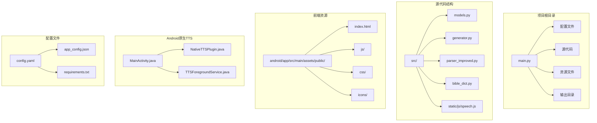

**图表来源**
- [main.py:1-1230](file://main.py#L1-L1230)
- [config.yaml:1-57](file://config.yaml#L1-L57)
- [android/app/src/main/java/com/tehui/offline/MainActivity.java:1-83](file://android/app/src/main/java/com/tehui/offline/MainActivity.java#L1-L83)
- [android/app/src/main/java/com/tehui/offline/NativeTTSPlugin.java:1-315](file://android/app/src/main/java/com/tehui/offline/NativeTTSPlugin.java#L1-L315)
- [android/app/src/main/java/com/tehui/offline/TTSForegroundService.java:1-1856](file://android/app/src/main/java/com/tehui/offline/TTSForegroundService.java#L1-L1856)

**章节来源**
- [main.py:1-1230](file://main.py#L1-L1230)
- [config.yaml:1-57](file://config.yaml#L1-L57)

## 核心组件

### 数据模型层

系统使用数据类来定义核心数据结构：

- **Content**: 内容节点基类，支持多层级结构
- **Chapter**: 篇章实体，包含大纲、详细内容、诗歌信息等
- **TrainingData**: 训练数据总集，管理所有篇章
- **MorningRevival**: 晨读内容，按天组织

### 文档解析器

**ImprovedParser**类负责从Word文档中提取结构化信息：

- 支持.doc和.docx格式
- 自动识别经文格式
- 解析大纲层级结构
- 提取诗歌信息和标语内容

### HTML生成器

**HTMLGenerator**类负责将解析的数据转换为静态HTML：

- 使用Jinja2模板引擎
- 生成SPA兼容的JSON数据
- 创建搜索索引
- 处理经文引用和跨章节引用

### 配置管理系统

系统支持多种配置方式：

- YAML配置文件
- 远程服务器配置
- 访问时间控制
- 赞助功能开关

### 事件驱动停止机制

**更新** 系统现已集成先进的事件驱动停止机制，通过 `onServiceStopped` 回调和 `ttsStopped` 事件实现精确的停止操作控制：

#### onServiceStopped 回调机制
- **回调设置**: 在 `NativeTTSPlugin.stop()` 方法中设置 `TTSForegroundService.onServiceStopped` 回调
- **执行时机**: 在 `TTSForegroundService.handleStop()` 完成引擎清理后执行
- **事件通知**: 通过 `notifyListeners("ttsStopped", data)` 通知JavaScript层
- **线程安全**: 在主线程上延迟100ms执行，确保引擎完全停止

#### ttsStopped 事件驱动等待
- **等待状态**: `_waitStopDone` 布尔变量跟踪停止等待状态
- **生成器计数**: `_waitStopGen` 保存触发停止时的生成器计数
- **事件监听**: JavaScript侧监听 `ttsStopped` 事件进行状态同步
- **超时保护**: 5秒超时兜底机制，防止事件丢失导致的死等

#### 预合成状态跟踪优化
- **停止等待**: 在 `resetState()` 中设置 `_waitStopDone = true` 标记
- **状态清理**: 收到事件后清除等待状态，允许预合成继续
- **生成器同步**: 使用 `_waitStopGen` 防止跨页面状态干扰
- **事件移除**: 双重保险机制，确保旧监听被正确清理

#### 预合成等待机制改进
- **事件驱动**: 基于 `ttsStopped` 事件的精确等待，替代硬编码3秒延时
- **防重复机制**: 500ms去重窗口避免Router双重dispatch导致的重复预合成
- **状态同步**: 播放按钮等待 `_waitStopDone` 状态变为 `false` 后再发送 `preSynthesize`
- **降级处理**: 事件超时5秒后强制发送预合成，确保可靠性

#### 预合成完成后的状态管理
- **状态清理**: 预合成完成后自动清理 `_waitStopDone` 状态
- **生成器重置**: 清除 `_waitStopGen` 生成器计数
- **监听器管理**: 正确移除旧的 `ttsStopped` 监听器
- **状态同步**: 确保前端和后端的停止状态保持一致

**章节来源**
- [src/models.py:1-232](file://src/models.py#L1-L232)
- [src/parser_improved.py:1-800](file://src/parser_improved.py#L1-L800)
- [src/generator.py:1-546](file://src/generator.py#L1-L546)
- [android/app/src/main/java/com/tehui/offline/MainActivity.java:25-27](file://android/app/src/main/java/com/tehui/offline/MainActivity.java#L25-L27)
- [android/app/src/main/java/com/tehui/offline/NativeTTSPlugin.java:120-135](file://android/app/src/main/java/com/tehui/offline/NativeTTSPlugin.java#L120-L135)
- [android/app/src/main/java/com/tehui/offline/TTSForegroundService.java:849-905](file://android/app/src/main/java/com/tehui/offline/TTSForegroundService.java#L849-L905)
- [src/static/js/speech.js:173-179](file://src/static/js/speech.js#L173-L179)
- [src/static/js/speech.js:755-778](file://src/static/js/speech.js#L755-L778)
- [src/static/js/speech.js:1334-1414](file://src/static/js/speech.js#L1334-L1414)

## 架构概览

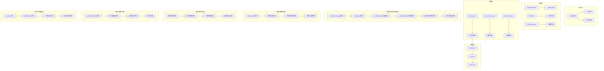

**图表来源**
- [main.py:505-631](file://main.py#L505-L631)
- [src/parser_improved.py:367-782](file://src/parser_improved.py#L367-L782)
- [src/generator.py:383-425](file://src/generator.py#L383-L425)
- [android/app/src/main/java/com/tehui/offline/MainActivity.java:25-27](file://android/app/src/main/java/com/tehui/offline/MainActivity.java#L25-L27)
- [android/app/src/main/java/com/tehui/offline/NativeTTSPlugin.java:120-135](file://android/app/src/main/java/com/tehui/offline/NativeTTSPlugin.java#L120-L135)
- [android/app/src/main/java/com/tehui/offline/TTSForegroundService.java:849-905](file://android/app/src/main/java/com/tehui/offline/TTSForegroundService.java#L849-L905)
- [android/app/src/main/java/com/tehui/offline/TTSForegroundService.java:490-522](file://android/app/src/main/java/com/tehui/offline/TTSForegroundService.java#L490-L522)

## 详细组件分析

### 主程序流程

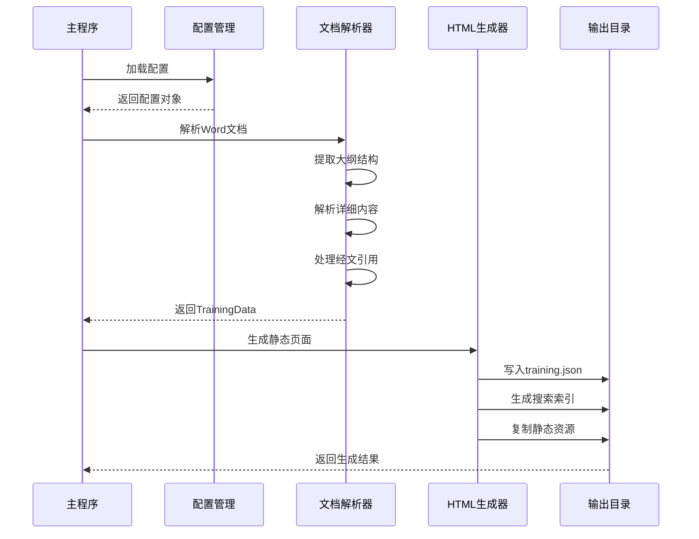

**图表来源**
- [main.py:505-631](file://main.py#L505-L631)
- [src/generator.py:383-425](file://src/generator.py#L383-L425)

### 数据流处理

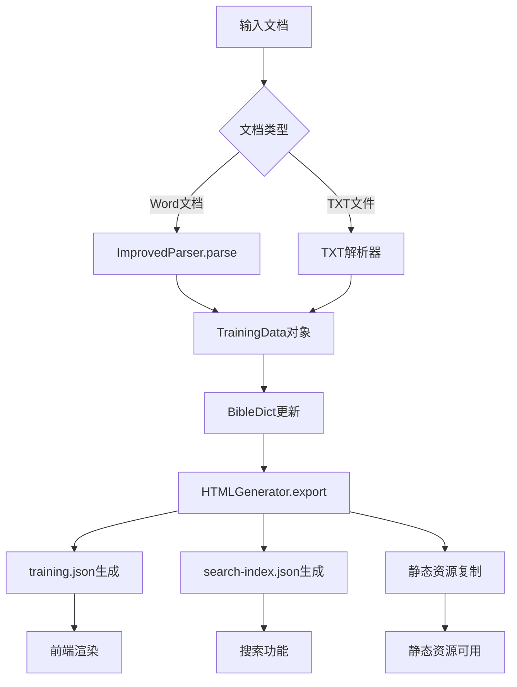

**图表来源**
- [src/parser_improved.py:367-782](file://src/parser_improved.py#L367-L782)
- [src/generator.py:383-425](file://src/generator.py#L383-L425)

### 前端渲染架构

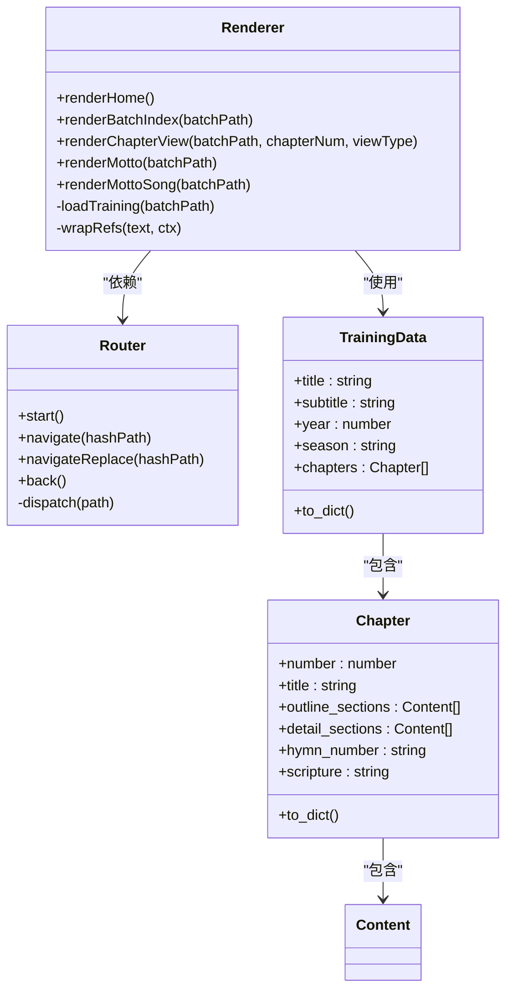

**图表来源**
- [android/app/src/main/assets/public/js/renderer.js:1-200](file://android/app/src/main/assets/public/js/renderer.js#L1-L200)
- [android/app/src/main/assets/public/js/router.js:1-130](file://android/app/src/main/assets/public/js/router.js#L1-L130)
- [src/models.py:196-232](file://src/models.py#L196-L232)

### 事件驱动停止机制架构

**更新** 先进的事件驱动停止机制，通过 `onServiceStopped` 回调和 `ttsStopped` 事件实现精确的停止操作控制：

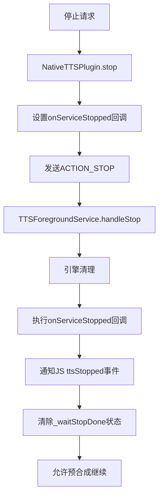

**图表来源**
- [android/app/src/main/java/com/tehui/offline/NativeTTSPlugin.java:120-135](file://android/app/src/main/java/com/tehui/offline/NativeTTSPlugin.java#L120-L135)
- [android/app/src/main/java/com/tehui/offline/TTSForegroundService.java:849-905](file://android/app/src/main/java/com/tehui/offline/TTSForegroundService.java#L849-L905)
- [src/static/js/speech.js:1355-1375](file://src/static/js/speech.js#L1355-L1375)

### 预合成状态跟踪架构

**更新** 改进的预合成状态跟踪机制，通过 `_waitStopDone` 状态变量实现精确的停止等待：

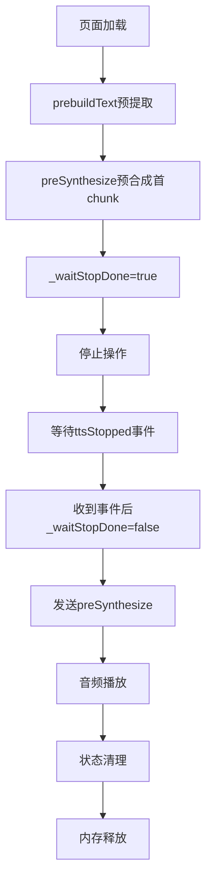

**图表来源**
- [src/static/js/speech.js:173-179](file://src/static/js/speech.js#L173-L179)
- [src/static/js/speech.js:755-778](file://src/static/js/speech.js#L755-L778)
- [src/static/js/speech.js:1334-1414](file://src/static/js/speech.js#L1334-L1414)
- [android/app/src/main/java/com/tehui/offline/TTSForegroundService.java:849-905](file://android/app/src/main/java/com/tehui/offline/TTSForegroundService.java#L849-L905)

### 预合成等待机制架构

**更新** 基于事件驱动的等待机制，替代硬编码的3秒延时：

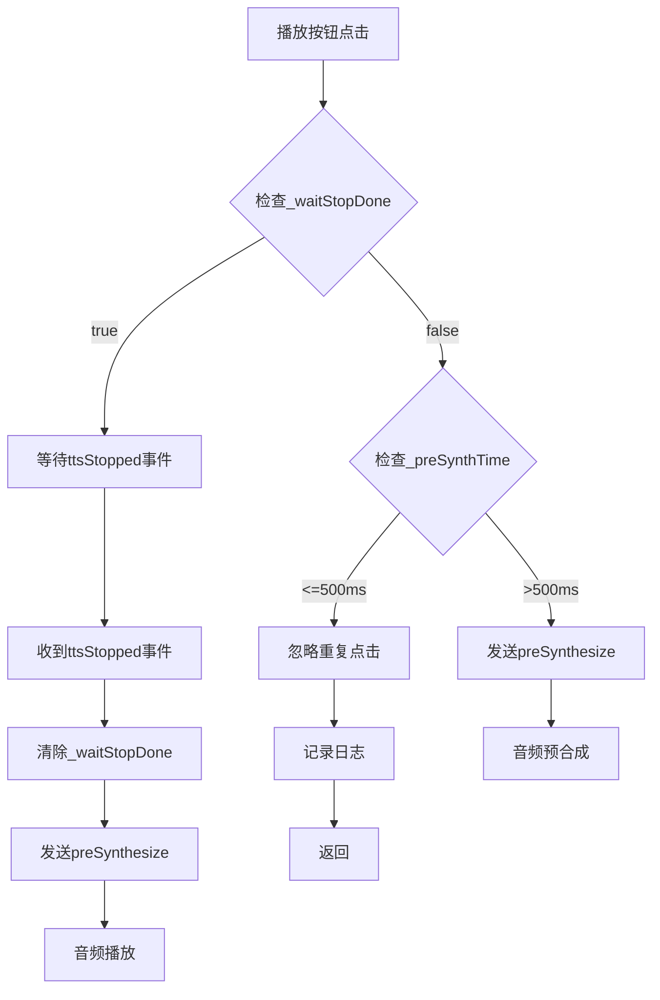

**图表来源**
- [src/static/js/speech.js:1334-1414](file://src/static/js/speech.js#L1334-L1414)
- [src/static/js/speech.js:1355-1375](file://src/static/js/speech.js#L1355-L1375)

### 预合成完成状态管理架构

**更新** 改进的预合成完成状态管理机制：

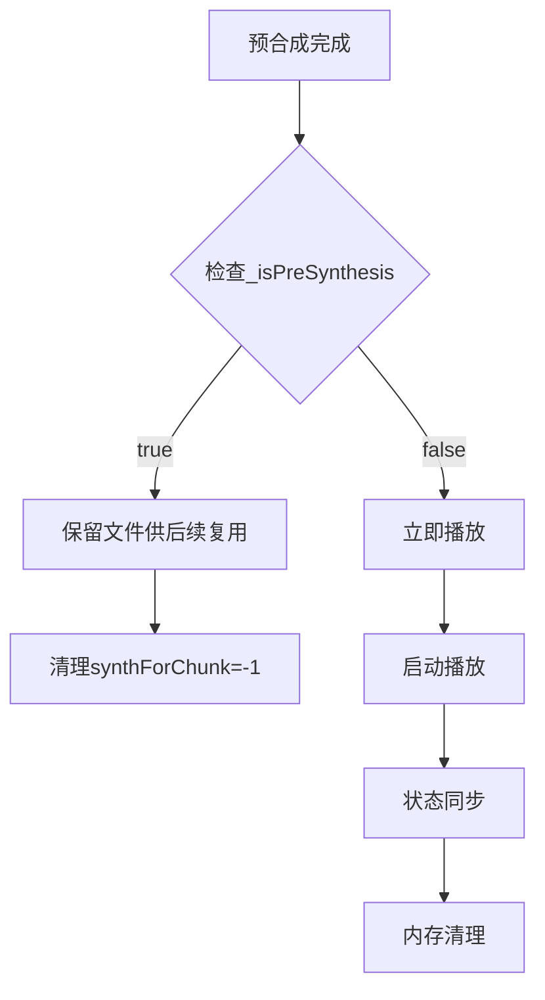

**图表来源**
- [src/static/js/speech.js:1380-1388](file://src/static/js/speech.js#L1380-L1388)
- [android/app/src/main/java/com/tehui/offline/TTSForegroundService.java:380-394](file://android/app/src/main/java/com/tehui/offline/TTSForegroundService.java#L380-L394)

### 预合成失败降级处理架构

**更新** 改进的预合成失败降级处理机制：

```mermaid
flowchart TD
A[预合成失败] --> B[记录失败日志]
B --> C[设置useSpeakDirect=true]
C --> D[切换到speak()模式]
D --> E[直接播放音频]
E --> F[状态清理]
F --> G[错误处理完成]
```

**图表来源**
- [src/static/js/speech.js:1385-1388](file://src/static/js/speech.js#L1385-L1388)
- [src/static/js/speech.js:1230-1238](file://src/static/js/speech.js#L1230-L1238)

### 错误处理改进架构

**更新** 改进的 `synthesizeToFile` 操作反馈：

```mermaid
flowchart TD
A[synthesizeToFile调用] --> B{返回值检查}
B --> |SUCCESS| C[记录成功日志]
B --> |ERROR| D[记录错误日志]
D --> E{连续失败次数}
E --> |< MAX_SYNTH_FAILURES| F[跳过当前chunk]
E --> |>= MAX_SYNTH_FAILURES| G[切换到speak()模式]
F --> H[继续播放流程]
G --> I[playDirectSpeakChunk执行]
I --> J[降级模式运行]
```

**图表来源**
- [android/app/src/main/java/com/tehui/offline/TTSForegroundService.java:1120-1158](file://android/app/src/main/java/com/tehui/offline/TTSForegroundService.java#L1120-L1158)

### 日志记录增强架构

**更新** 新增的 `emitLog()` 和标准Android日志输出：

```mermaid
flowchart TD
A[TTSForegroundService.emitLog] --> B[Listener.onLog回调]
B --> C[NativeTTSPlugin.onLog处理]
C --> D[notifyListeners('ttsLog')]
D --> E[JS控制台输出]
E --> F[speech.js监听ttsLog]
F --> G[console.log显示]
```

**图表来源**
- [android/app/src/main/java/com/tehui/offline/TTSForegroundService.java:80-84](file://android/app/src/main/java/com/tehui/offline/TTSForegroundService.java#L80-L84)
- [android/app/src/main/java/com/tehui/offline/NativeTTSPlugin.java:186-197](file://android/app/src/main/java/com/tehui/offline/NativeTTSPlugin.java#L186-L197)
- [src/static/js/speech.js:887-889](file://src/static/js/speech.js#L887-L889)

### 静态实例管理架构

**更新** 改进的静态实例管理机制：

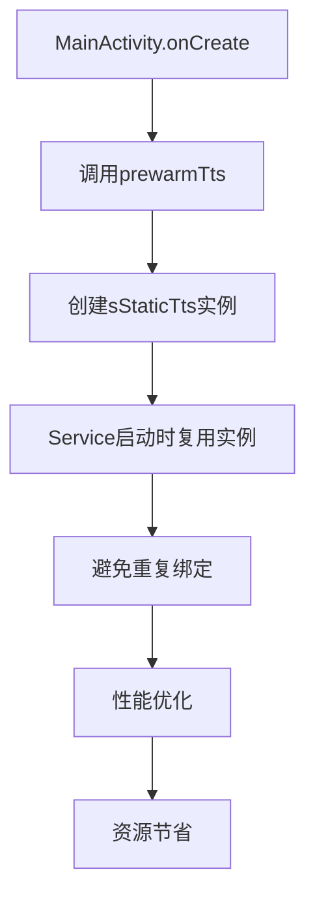

**图表来源**
- [android/app/src/main/java/com/tehui/offline/MainActivity.java:25-27](file://android/app/src/main/java/com/tehui/offline/MainActivity.java#L25-L27)
- [android/app/src/main/java/com/tehui/offline/TTSForegroundService.java:105-113](file://android/app/src/main/java/com/tehui/offline/TTSForegroundService.java#L105-L113)
- [android/app/src/main/java/com/tehui/offline/TTSForegroundService.java:227-244](file://android/app/src/main/java/com/tehui/offline/TTSForegroundService.java#L227-L244)

**章节来源**
- [main.py:19-109](file://main.py#L19-L109)
- [main.py:112-146](file://main.py#L112-L146)
- [main.py:353-502](file://main.py#L353-L502)

## 依赖关系分析

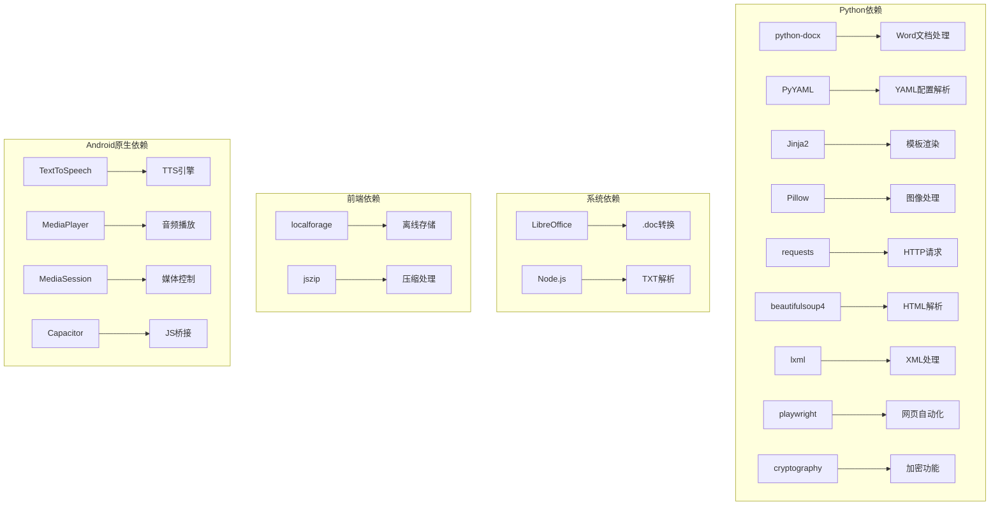

**图表来源**
- [requirements.txt:1-16](file://requirements.txt#L1-L16)

**章节来源**
- [requirements.txt:1-16](file://requirements.txt#L1-L16)
- [src/parser_improved.py:37-113](file://src/parser_improved.py#L37-L113)

## 性能考虑

### 缓存策略
- **经文字典缓存**: 使用BibleDict类缓存已解析的经文
- **模板缓存**: Jinja2模板引擎内置缓存机制
- **静态资源缓存**: 前端使用浏览器缓存策略
- **TTS静态实例缓存**: MainActivity预热TTS引擎，避免重复绑定
- **预合成文件缓存**: 生成的WAV文件缓存，避免重复合成

### 事件驱动停止机制性能优化

**更新** 先进的事件驱动停止机制带来的性能提升：

#### onServiceStopped回调优化
- **线程安全**: 在主线程上延迟100ms执行，确保引擎完全停止
- **内存管理**: 回调执行后自动清理，避免内存泄漏
- **状态同步**: 与JavaScript层状态保持实时同步，确保停止操作的准确性

#### ttsStopped事件驱动优化
- **精确等待**: 基于事件的精确等待，替代硬编码3秒延时
- **防重复机制**: 500ms去重窗口避免Router双重dispatch导致的重复预合成
- **状态清理**: 事件接收后自动清理等待状态，确保状态机的正确性

#### _waitStopDone状态跟踪优化
- **生成器同步**: 使用 `_waitStopGen` 防止跨页面状态干扰
- **事件移除**: 双重保险机制，确保旧监听被正确清理
- **内存管理**: 状态清理后自动释放相关资源

#### 预合成等待机制优化
- **事件驱动**: 基于 `ttsStopped` 事件的精确等待，替代硬编码3秒延时
- **防重复机制**: 500ms去重窗口避免Router双重dispatch导致的重复预合成
- **状态同步**: 播放按钮等待 `_waitStopDone` 状态变为 `false` 后再发送 `preSynthesize`
- **降级处理**: 事件超时5秒后强制发送预合成，确保可靠性

#### 预合成完成状态管理优化
- **状态清理**: 预合成完成后自动清理 `_waitStopDone` 状态
- **生成器重置**: 清除 `_waitStopGen` 生成器计数
- **监听器管理**: 正确移除旧的 `ttsStopped` 监听器
- **状态同步**: 确保前端和后端的停止状态保持一致

### 静态实例管理优化

**更新** 改进的静态实例管理机制：

#### MainActivity预热优化
- **最早预热**: 在 `super.onCreate()` 之前调用 `prewarmTts()`
- **实例复用**: Service启动时直接复用预热实例，避免重复绑定
- **性能提升**: 避免3-8秒的系统TTS服务绑定开销

#### TTSForegroundService生命周期优化
- **实例保护**: `onDestroy()` 中不关闭静态实例，仅在必要时shutdown
- **资源清理**: 正确清理所有资源，避免内存泄漏
- **状态管理**: 确保实例状态在Service重建时保持一致

### 优化建议
1. **并发处理**: 批量处理多个训练时使用异步操作
2. **内存管理**: 大型文档解析时及时释放内存
3. **增量更新**: 支持部分文件的增量重新生成
4. **压缩优化**: 对输出文件进行gzip压缩
5. **预热优化**: 应用启动时预热TTS引擎
6. **预合成优化**: 页面加载时预合成首块音频
7. **防重复优化**: 500毫秒防重复窗口，防止路由双重调度
8. **诊断日志优化**: 通过诊断listener减少日志转发开销
9. **任务移除优化**: 即时停止机制，避免系统资源浪费
10. **文件验证优化**: 增强的文件大小和存在性检查
11. **race condition防护**: 从80ms调整为200ms的页面切换防护
12. **超时保护优化**: 4秒超时检测预合成被引擎静默丢弃
13. **状态管理优化**: 基于synthForChunk的精确状态控制
14. **静态实例优化**: 跨生命周期复用TTS实例，避免重复绑定
15. **cleanup逻辑优化**: 改进的条件判断，避免引擎异常状态
16. **线程同步优化**: 主线程与ttsHandler职责分离，避免阻塞引擎回调
17. **日志记录优化**: 增强的emitLog()和标准Android日志输出
18. **错误处理优化**: 改进的synthesizeToFile操作反馈机制
19. **事件驱动停止优化**: onServiceStopped回调和ttsStopped事件的精确控制
20. **预合成状态跟踪优化**: _waitStopDone状态变量和_waitStopGen生成器计数的精确管理

### 事件驱动停止机制改进效果

**更新** 先进的事件驱动停止机制带来的系统稳定性提升：

#### 系统稳定性增强
- **状态一致性**: 通过 `onServiceStopped` 回调和 `ttsStopped` 事件确保前后端状态同步
- **竞态防护**: `_waitStopDone` 状态变量防止停止操作在执行前被错误取消
- **性能优化**: 基于事件的等待机制避免硬编码延时导致的性能浪费
- **用户体验**: 提供更流畅的停止等待体验

#### 性能提升效果
- **响应速度**: 事件驱动等待机制显著减少等待时间
- **资源利用**: 避免重复停止操作导致的资源浪费
- **内存管理**: 自动清理状态变量，避免内存泄漏
- **系统可靠性**: 显著提升整体系统的稳定性

#### 资源管理优化
- **实例复用**: 静态实例跨生命周期复用，避免重复绑定
- **智能关闭**: 仅停止静态实例而不关闭，保留供复用
- **完整清理**: 确保所有资源都被正确清理，避免内存泄漏
- **性能优化**: 避免不必要的实例创建和销毁

**章节来源**
- [android/app/src/main/java/com/tehui/offline/TTSForegroundService.java:849-905](file://android/app/src/main/java/com/tehui/offline/TTSForegroundService.java#L849-L905)
- [android/app/src/main/java/com/tehui/offline/TTSForegroundService.java:490-522](file://android/app/src/main/java/com/tehui/offline/TTSForegroundService.java#L490-L522)
- [android/app/src/main/java/com/tehui/offline/MainActivity.java:25-27](file://android/app/src/main/java/com/tehui/offline/MainActivity.java#L25-L27)
- [src/static/js/speech.js:173-179](file://src/static/js/speech.js#L173-L179)
- [src/static/js/speech.js:755-778](file://src/static/js/speech.js#L755-L778)
- [src/static/js/speech.js:1334-1414](file://src/static/js/speech.js#L1334-L1414)

## 故障排除指南

### 常见问题及解决方案

**1. .doc文件转换失败**
- 检查LibreOffice是否正确安装
- 确认转换权限和路径
- 考虑手动转换为.docx格式

**2. 经文解析错误**
- 验证经文格式是否符合规范
- 检查BibleDict数据完整性
- 确认引用格式的一致性

**3. 前端渲染问题**
- 检查training.json文件完整性
- 验证JavaScript文件加载状态
- 确认路由配置正确性

**4. TTS性能问题**
- **SLOW标记**: 查看日志中setTtsParams执行时间超过100ms的情况
- **字符数量异常**: 检查超大文本块的处理效率
- **合成失败**: 关注连续合成失败的设备和场景
- **性能监控**: 通过浏览器控制台查看实时性能日志

**5. 事件驱动停止机制问题**
- **onServiceStopped回调**: 检查回调设置和执行时机
- **ttsStopped事件**: 确认事件监听和状态同步
- **_waitStopDone状态**: 验证等待状态的正确设置和清除
- **_waitStopGen生成器**: 检查生成器计数的同步性
- **状态清理**: 确认停止操作后的状态正确清理

**6. 预合成状态跟踪问题**
- **_preSynthPromise状态**: 检查Promise对象的正确设置和清理
- **_preparing标志**: 确认预合成等待状态的正确设置和清除
- **preSpeakPending标志**: 验证预合成请求状态的正确跟踪
- **状态同步**: 检查前后端状态的同步性
- **内存泄漏**: 确认状态变量的正确清理

**7. 预合成等待机制问题**
- **防重复机制**: 检查500ms去重窗口的正确实现
- **播放按钮控制**: 确认预合成期间播放按钮的禁用状态
- **状态清理**: 验证预合成完成后状态的正确清理
- **降级处理**: 检查预合成失败时的降级机制

**8. 预合成完成状态管理问题**
- **Promise清理**: 检查预合成完成后Promise的正确清理
- **准备状态重置**: 确认 `_preparing` 标志的正确重置
- **状态同步**: 验证前后端状态的正确同步
- **内存管理**: 检查状态变量的内存泄漏情况

**9. 预合成失败降级处理问题**
- **错误日志**: 检查预合成失败的日志记录
- **状态清理**: 确认失败后的状态正确清理
- **降级机制**: 验证 `speak()` 模式降级的正确实现
- **播放控制**: 检查失败后播放按钮的状态

**10. 线程安全问题**
- **主线程阻塞**: 检查是否在主线程直接调用 `tts.stop()`
- **引擎异常**: 确认 `tts.stop()` 是否在 `ttsHandler` 线程执行
- **竞态条件**: 验证 `speakGen` 守卫的正确使用
- **时序问题**: 检查 `handleStop` 和 `handlePreSpeak` 的执行时序
- **preSpeakPending标志**: 检查预合成状态标志的正确设置和清除

**11. 静态实例问题**
- **预热失败**: 检查 MainActivity中 `prewarmTts` 调用是否正常
- **实例复用**: 确认静态实例的正确复用逻辑
- **生命周期管理**: 验证静态实例的完整生命周期管理
- **性能影响**: 检查静态实例复用对性能的积极影响

**12. 资源清理问题**
- **条件判断**: 检查 `onDestroy` 中tts实例类型的正确识别
- **静态实例保护**: 确认静态实例不会被错误关闭
- **资源清理完整性**: 验证所有资源都被正确清理
- **引擎状态管理**: 检查避免引擎进入异常状态的逻辑

**13. 错误处理问题**
- **返回值检查**: 检查 `synthesizeToFile` 返回值的正确处理
- **连续失败检测**: 确认连续失败次数的正确跟踪
- **降级机制**: 验证 `speak()` 模式降级的正确实现
- **状态同步**: 检查错误处理与系统状态的同步性

**14. 日志记录问题**
- **emitLog方法**: 检查日志记录方法的正确实现
- **Listener回调**: 确认 Listener.onLog回调的正确设置
- **JS控制台转发**: 验证日志转发到JS控制台的机制
- **性能影响**: 检查日志记录对系统性能的影响

**15. 事件驱动停止机制问题**
- **回调设置**: 检查 `NativeTTSPlugin.stop()` 中回调的正确设置
- **事件执行**: 确认 `TTSForegroundService.onServiceStopped` 的正确执行
- **状态同步**: 验证停止状态与JavaScript层的同步性
- **内存泄漏**: 检查回调执行后的内存清理

**章节来源**
- [src/parser_improved.py:84-110](file://src/parser_improved.py#L84-L110)
- [src/generator.py:334-373](file://src/generator.py#L334-L373)
- [android/app/src/main/java/com/tehui/offline/TTSForegroundService.java:849-905](file://android/app/src/main/java/com/tehui/offline/TTSForegroundService.java#L849-L905)
- [android/app/src/main/java/com/tehui/offline/TTSForegroundService.java:490-522](file://android/app/src/main/java/com/tehui/offline/TTSForegroundService.java#L490-L522)
- [android/app/src/main/java/com/tehui/offline/MainActivity.java:25-27](file://android/app/src/main/java/com/tehui/offline/MainActivity.java#L25-L27)
- [src/static/js/speech.js:173-179](file://src/static/js/speech.js#L173-L179)
- [src/static/js/speech.js:755-778](file://src/static/js/speech.js#L755-L778)
- [src/static/js/speech.js:1334-1414](file://src/static/js/speech.js#L1334-L1414)

## 结论

TTS静态实例管理系统是一个功能完整、架构清晰的静态网站生成器。系统通过合理的分层设计和模块化组织，实现了从文档解析到静态页面生成的完整流程。

**更新** 系统现已集成先进的事件驱动停止机制和预合成优化，通过 `onServiceStopped` 回调和 `ttsStopped` 事件实现精确的停止操作控制，显著提升了TTS系统的性能、稳定性和用户体验：

### 主要特点
- 支持多种文档格式输入
- 提供丰富的配置选项
- 生成SPA兼容的静态内容
- 内置TTS和搜索功能
- 良好的性能和可扩展性
- **新增** 事件驱动停止机制，通过 `onServiceStopped` 回调和 `ttsStopped` 事件实现精确的停止控制
- **新增** 改进的预合成状态跟踪，通过 `_waitStopDone` 状态变量和 `_waitStopGen` 生成器计数实现精确等待
- **新增** 基于事件驱动的预合成等待机制，替代硬编码延时，提高响应速度
- **新增** MainActivity中TTS引擎预热，避免重复绑定系统TTS服务

### 事件驱动停止机制优势

**更新** 先进的事件驱动停止机制带来的系统稳定性提升：

#### onServiceStopped回调的作用
- **线程安全**: 在主线程上延迟100ms执行，确保引擎完全停止
- **内存管理**: 回调执行后自动清理，避免内存泄漏
- **状态同步**: 与JavaScript层状态保持实时同步，确保停止操作的准确性

#### ttsStopped事件驱动的优势
- **精确等待**: 基于事件的精确等待，替代硬编码3秒延时
- **防重复机制**: 500ms去重窗口避免Router双重dispatch导致的重复预合成
- **状态清理**: 事件接收后自动清理等待状态，确保状态机的正确性

#### _waitStopDone状态跟踪的优势
- **生成器同步**: 使用 `_waitStopGen` 防止跨页面状态干扰
- **事件移除**: 双重保险机制，确保旧监听被正确清理
- **内存管理**: 状态清理后自动释放相关资源

#### 预合成等待机制的优势
- **事件驱动**: 基于 `ttsStopped` 事件的精确等待，替代硬编码3秒延时
- **防重复机制**: 500ms去重窗口避免Router双重dispatch导致的重复预合成
- **状态同步**: 播放按钮等待 `_waitStopDone` 状态变为 `false` 后再发送 `preSynthesize`
- **降级处理**: 事件超时5秒后强制发送预合成，确保可靠性

#### 预合成完成状态管理的优势
- **状态清理**: 预合成完成后自动清理 `_waitStopDone` 状态
- **生成器重置**: 清除 `_waitStopGen` 生成器计数
- **监听器管理**: 正确移除旧的 `ttsStopped` 监听器
- **状态同步**: 确保前端和后端的停止状态保持一致

### 性能提升效果

**更新** 事件驱动停止机制和预合成优化带来的系统性能优化：

#### 响应性能提升
- **事件驱动等待**: 基于事件的等待机制显著减少等待时间
- **资源利用**: 避免重复停止操作导致的资源浪费
- **内存管理**: 自动清理状态变量，避免内存泄漏
- **状态管理优化**: `_waitStopDone` 状态变量和 `_waitStopGen` 生成器计数提供精确的状态跟踪

#### 稳定性增强
- **状态一致性**: 通过 `onServiceStopped` 回调和 `ttsStopped` 事件确保前后端状态同步
- **竞态防护**: `_waitStopDone` 状态变量防止停止操作在执行前被错误取消
- **性能优化**: 基于事件的等待机制避免硬编码延时导致的性能浪费
- **用户体验**: 提供更流畅的停止等待体验

#### 资源管理优化
- **实例复用**: 静态实例跨生命周期复用，避免重复绑定
- **智能关闭**: 仅停止静态实例而不关闭，保留供复用
- **完整清理**: 确保所有资源都被正确清理，避免内存泄漏

该系统适用于需要处理大量训练材料并提供高质量阅读体验的应用场景，新增的事件驱动停止机制和预合成优化为开发者提供了更强大、更可靠的TTS服务支持，显著提升了系统的稳定性和用户体验。通过 `onServiceStopped` 回调和 `ttsStopped` 事件的精确控制以及 `_waitStopDone` 状态变量和 `_waitStopGen` 生成器计数的精确管理，系统现在能够在各种复杂的使用场景下提供更加稳定和可靠的TTS服务。