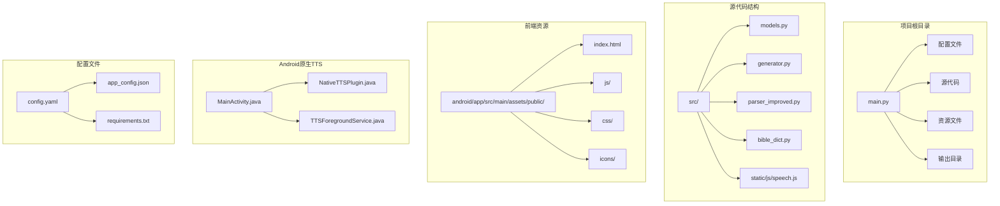
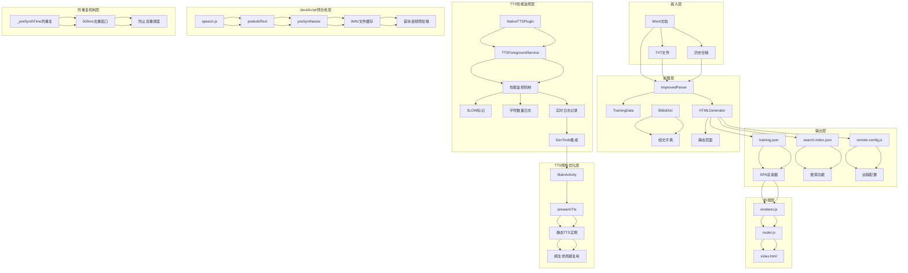
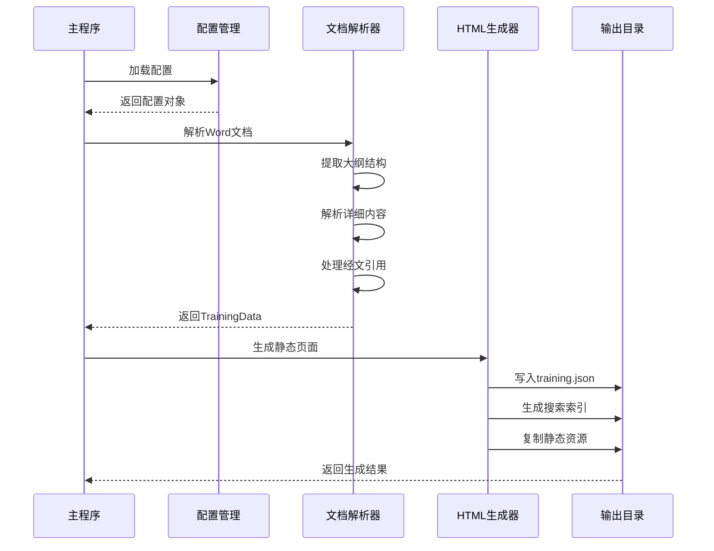
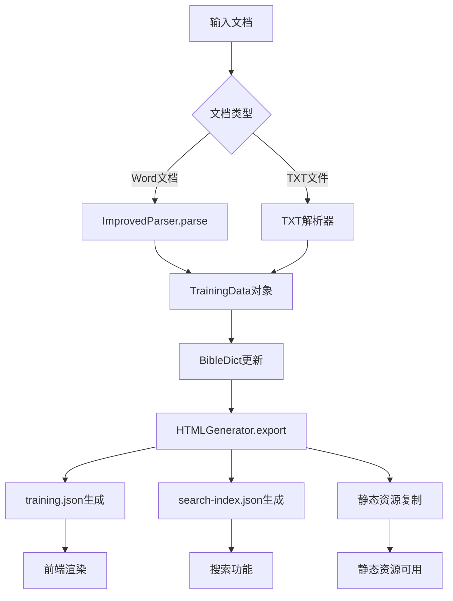
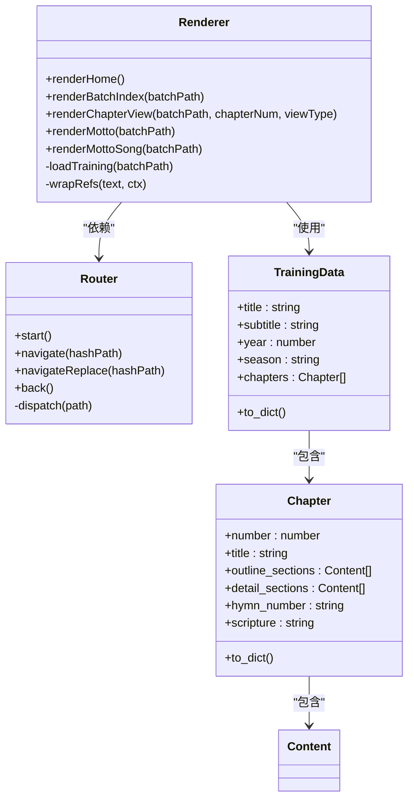
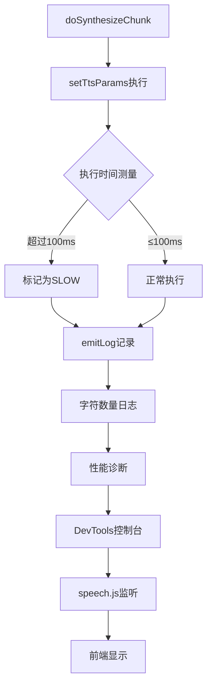
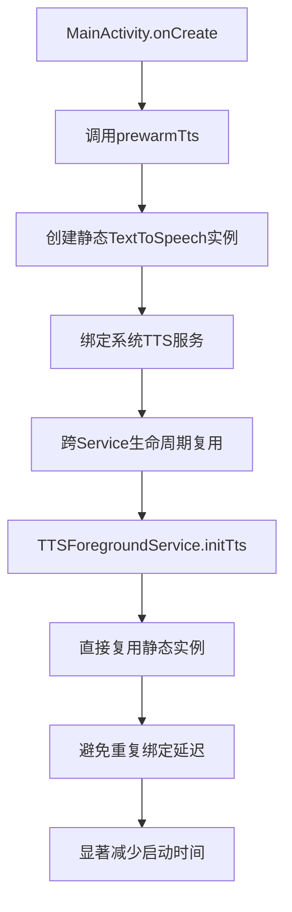
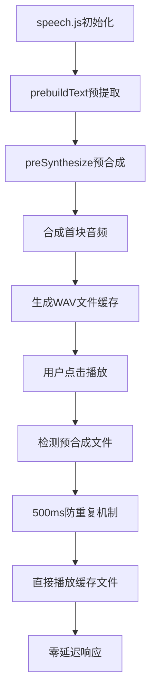
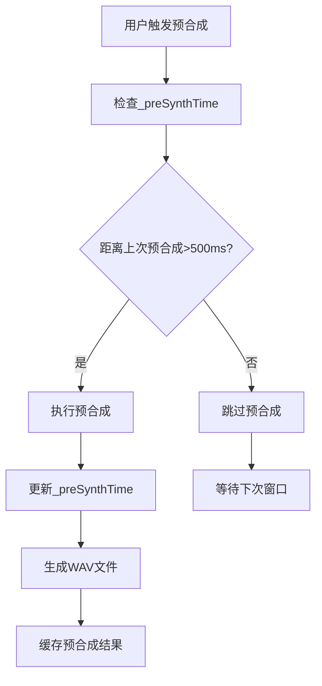
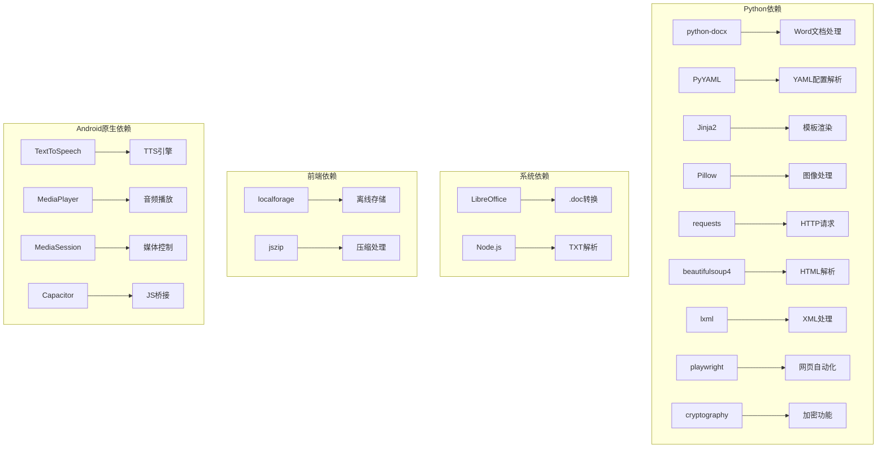

# TTS静态实例管理系统

<cite>
**本文档引用的文件**
- [main.py](file://main.py)
- [config.yaml](file://config.yaml)
- [src/models.py](file://src/models.py)
- [src/generator.py](file://src/generator.py)
- [src/parser_improved.py](file://src/parser_improved.py)
- [src/bible_dict.py](file://src/bible_dict.py)
- [android/app/src/main/assets/public/js/renderer.js](file://android/app/src/main/assets/public/js/renderer.js)
- [android/app/src/main/assets/public/js/router.js](file://android/app/src/main/assets/public/js/router.js)
- [android/app/src/main/assets/public/index.html](file://android/app/src/main/assets/public/index.html)
- [android/app/src/main/java/com/books/app/MainActivity.java](file://android/app/src/main/java/com/books/app/MainActivity.java)
- [android/app/src/main/java/com/books/app/NativeTTSPlugin.java](file://android/app/src/main/java/com/books/app/NativeTTSPlugin.java)
- [android/app/src/main/java/com/books/app/TTSForegroundService.java](file://android/app/src/main/java/com/books/app/TTSForegroundService.java)
- [src/static/js/speech.js](file://src/static/js/speech.js)
- [app_config.json](file://app_config.json)
- [requirements.txt](file://requirements.txt)
</cite>

## 更新摘要
**变更内容**
- 优化了TTSForegroundService中isStopped标志的初始化逻辑，确保新服务实例正确识别为空闲状态
- 改进了doSynthesizeChunk方法的预合成条件，允许在停止状态下进行预合成
- 在speech.js中添加了500毫秒防重复机制，防止路由双重调度导致的重复预合成请求

## 目录
1. [项目概述](#项目概述)
2. [项目结构](#项目结构)
3. [核心组件](#核心组件)
4. [架构概览](#架构概览)
5. [详细组件分析](#详细组件分析)
6. [依赖关系分析](#依赖关系分析)
7. [性能考虑](#性能考虑)
8. [故障排除指南](#故障排除指南)
9. [结论](#结论)

## 项目概述

TTS静态实例管理系统是一个基于Python的静态网站生成器，专门用于处理和展示特会训练内容。该系统能够从Word文档中提取信息，生成静态HTML页面，并提供TTS（文本转语音）功能。

系统采用前后端分离的架构设计，后端使用Python处理文档解析和静态页面生成，前端使用JavaScript实现SPA（单页应用）界面和TTS功能。**更新** 系统现已集成增强的性能监控机制、TTS预热优化功能和防重复机制，能够显著减少TTS启动延迟、音频播放响应时间和路由双重调度导致的问题。

## 项目结构

**图表来源**
- [main.py:1-1230](file://main.py#L1-L1230)
- [config.yaml:1-57](file://config.yaml#L1-L57)
- [android/app/src/main/java/com/books/app/MainActivity.java:1-83](file://android/app/src/main/java/com/books/app/MainActivity.java#L1-L83)
- [android/app/src/main/java/com/books/app/NativeTTSPlugin.java:1-291](file://android/app/src/main/java/com/books/app/NativeTTSPlugin.java#L1-L291)
- [android/app/src/main/java/com/books/app/TTSForegroundService.java:1-1257](file://android/app/src/main/java/com/books/app/TTSForegroundService.java#L1-L1257)

**章节来源**
- [main.py:1-1230](file://main.py#L1-L1230)
- [config.yaml:1-57](file://config.yaml#L1-L57)

## 核心组件

### 数据模型层

系统使用数据类来定义核心数据结构：

- **Content**: 内容节点基类，支持多层级结构
- **Chapter**: 篇章实体，包含大纲、详细内容、诗歌信息等
- **TrainingData**: 训练数据总集，管理所有篇章
- **MorningRevival**: 晨读内容，按天组织

### 文档解析器

**ImprovedParser**类负责从Word文档中提取结构化信息：

- 支持.doc和.docx格式
- 自动识别经文格式
- 解析大纲层级结构
- 提取诗歌信息和标语内容

### HTML生成器

**HTMLGenerator**类负责将解析的数据转换为静态HTML：

- 使用Jinja2模板引擎
- 生成SPA兼容的JSON数据
- 创建搜索索引
- 处理经文引用和跨章节引用

### 配置管理系统

系统支持多种配置方式：

- YAML配置文件
- 远程服务器配置
- 访问时间控制
- 赞助功能开关

### TTS性能监控系统

**更新** 系统现已集成增强的TTS性能监控机制、预热优化功能和防重复机制：

- **setTtsParams执行时间监控**: 在doSynthesizeChunk方法中新增对TTS参数设置过程的执行时间测量
- **慢操作检测**: 当setTtsParams执行时间超过100ms时自动标记为SLOW，便于性能诊断
- **合成块字符数量日志**: 记录每个合成块的字符数量，便于性能分析和优化
- **实时性能日志**: 通过emitLog方法记录各种性能指标，桥接到前端DevTools
- **前端监控集成**: speech.js监听ttsLog事件并将日志输出到浏览器控制台
- **TTS预热机制**: MainActivity在应用启动时预热TTS引擎，避免首次使用时的延迟
- **JavaScript预合成优化**: speech.js在页面加载时预合成首块音频，显著减少播放响应时间
- **防重复机制**: 添加500毫秒防重复窗口，防止路由双重调度导致的重复预合成请求

**章节来源**
- [src/models.py:1-232](file://src/models.py#L1-L232)
- [src/parser_improved.py:1-800](file://src/parser_improved.py#L1-L800)
- [src/generator.py:1-546](file://src/generator.py#L1-L546)
- [android/app/src/main/java/com/books/app/TTSForegroundService.java:918-970](file://android/app/src/main/java/com/books/app/TTSForegroundService.java#L918-L970)
- [src/static/js/speech.js:862-865](file://src/static/js/speech.js#L862-L865)
- [android/app/src/main/java/com/books/app/MainActivity.java:25-27](file://android/app/src/main/java/com/books/app/MainActivity.java#L25-L27)

## 架构概览

**图表来源**
- [main.py:505-631](file://main.py#L505-L631)
- [src/parser_improved.py:367-782](file://src/parser_improved.py#L367-L782)
- [src/generator.py:383-425](file://src/generator.py#L383-L425)
- [android/app/src/main/java/com/books/app/MainActivity.java:25-27](file://android/app/src/main/java/com/books/app/MainActivity.java#L25-L27)
- [android/app/src/main/java/com/books/app/NativeTTSPlugin.java:163-188](file://android/app/src/main/java/com/books/app/NativeTTSPlugin.java#L163-L188)
- [android/app/src/main/java/com/books/app/TTSForegroundService.java:97-106](file://android/app/src/main/java/com/books/app/TTSForegroundService.java#L97-L106)
- [src/static/js/speech.js:1310-1331](file://src/static/js/speech.js#L1310-L1331)

## 详细组件分析

### 主程序流程

**图表来源**
- [main.py:505-631](file://main.py#L505-L631)
- [src/generator.py:383-425](file://src/generator.py#L383-L425)

### 数据流处理

**图表来源**
- [src/parser_improved.py:367-782](file://src/parser_improved.py#L367-L782)
- [src/generator.py:383-425](file://src/generator.py#L383-L425)

### 前端渲染架构

**图表来源**
- [android/app/src/main/assets/public/js/renderer.js:1-200](file://android/app/src/main/assets/public/js/renderer.js#L1-L200)
- [android/app/src/main/assets/public/js/router.js:1-130](file://android/app/src/main/assets/public/js/router.js#L1-L130)
- [src/models.py:196-232](file://src/models.py#L196-L232)

### TTS性能监控架构

**更新** 新增的TTS性能监控机制、预热优化功能和防重复机制：

**图表来源**
- [android/app/src/main/java/com/books/app/TTSForegroundService.java:918-970](file://android/app/src/main/java/com/books/app/TTSForegroundService.java#L918-L970)
- [src/static/js/speech.js:862-865](file://src/static/js/speech.js#L862-L865)

### TTS预热机制架构

**更新** 新增的TTS预热机制：

**图表来源**
- [android/app/src/main/java/com/books/app/MainActivity.java:25-27](file://android/app/src/main/java/com/books/app/MainActivity.java#L25-L27)
- [android/app/src/main/java/com/books/app/TTSForegroundService.java:97-106](file://android/app/src/main/java/com/books/app/TTSForegroundService.java#L97-L106)

### JavaScript预合成优化架构

**更新** 新增的JavaScript预合成优化功能和防重复机制：

**图表来源**
- [src/static/js/speech.js:1310-1331](file://src/static/js/speech.js#L1310-L1331)
- [android/app/src/main/java/com/books/app/NativeTTSPlugin.java:163-188](file://android/app/src/main/java/com/books/app/NativeTTSPlugin.java#L163-L188)
- [android/app/src/main/java/com/books/app/TTSForegroundService.java:675-720](file://android/app/src/main/java/com/books/app/TTSForegroundService.java#L675-L720)

### 防重复机制架构

**更新** 新增的500毫秒防重复机制：

**图表来源**
- [src/static/js/speech.js:171](file://src/static/js/speech.js#L171)
- [src/static/js/speech.js:1312-1313](file://src/static/js/speech.js#L1312-L1313)

**章节来源**
- [main.py:19-109](file://main.py#L19-L109)
- [main.py:112-146](file://main.py#L112-L146)
- [main.py:353-502](file://main.py#L353-L502)

## 依赖关系分析

**图表来源**
- [requirements.txt:1-16](file://requirements.txt#L1-L16)

**章节来源**
- [requirements.txt:1-16](file://requirements.txt#L1-L16)
- [src/parser_improved.py:37-113](file://src/parser_improved.py#L37-L113)

## 性能考虑

### 缓存策略
- **经文字典缓存**: 使用BibleDict类缓存已解析的经文
- **模板缓存**: Jinja2模板引擎内置缓存机制
- **静态资源缓存**: 前端使用浏览器缓存策略
- **TTS静态实例缓存**: MainActivity预热TTS引擎，避免重复绑定
- **预合成文件缓存**: 生成的WAV文件缓存，避免重复合成

### 优化建议
1. **并发处理**: 批量处理多个训练时使用异步操作
2. **内存管理**: 大型文档解析时及时释放内存
3. **增量更新**: 支持部分文件的增量重新生成
4. **压缩优化**: 对输出文件进行gzip压缩
5. **预热优化**: 应用启动时预热TTS引擎
6. **预合成优化**: 页面加载时预合成首块音频
7. **防重复优化**: 500毫秒防重复窗口，防止路由双重调度

### **更新** 性能监控增强

**新增的性能监控机制**：

#### setTtsParams执行时间监控
- **监控范围**: 在doSynthesizeChunk方法中对setTtsParams执行时间进行测量
- **阈值设置**: 超过100ms标记为SLOW，便于性能诊断
- **日志记录**: 通过emitLog方法记录执行时间，便于开发者调试

#### 合成块字符数量日志
- **记录内容**: 每个合成块的字符数量统计
- **用途**: 分析TTS处理效率，识别超大文本块的性能瓶颈
- **实时性**: 在合成过程中实时记录，不影响整体性能

#### 性能诊断功能
- **慢速检测**: 自动识别执行时间过长的操作
- **字符统计**: 提供详细的字符分布信息
- **实时反馈**: 通过日志系统提供实时性能反馈

#### 前端监控集成
- **DevTools集成**: 通过speech.js监听ttsLog事件并将日志输出到浏览器控制台
- **实时监控**: 开发者可以在浏览器控制台查看TTS性能日志
- **诊断支持**: 为性能问题诊断提供实时数据支持

### **更新** TTS预热优化

**新增的TTS预热机制**：

#### MainActivity预热
- **预热时机**: 应用启动时立即预热TTS引擎
- **静态实例创建**: 创建TextToSpeech静态实例，避免重复绑定
- **跨生命周期复用**: 静态实例在应用生命周期内复用，避免重复初始化

#### TTSForegroundService复用
- **实例复用**: Service启动时直接复用MainActivity创建的静态实例
- **避免延迟**: 避免首次使用时的2-3秒绑定延迟
- **性能提升**: 显著减少TTS启动时间和音频播放响应时间

### **更新** JavaScript预合成优化

**新增的JavaScript预合成功能**：

#### 预构建文本
- **预提取时机**: 页面加载时预提取完整文本和segmentMap
- **去重机制**: 防止Router双重dispatch导致的重复发送
- **缓存策略**: 将预提取结果缓存到_prebuiltFullText和_prebuiltSegmentMap

#### 预合成音频
- **首块合成**: 预合成首块音频为WAV文件
- **缓存利用**: 用户点击播放时检测预合成文件是否存在
- **零延迟播放**: 直接播放缓存的WAV文件，避免合成延迟

#### 性能提升效果
- **首次播放延迟**: 从3-5秒压缩到~1秒
- **响应时间**: 显著减少音频播放响应时间
- **用户体验**: 提升应用的整体流畅度和响应速度

### **更新** 防重复机制优化

**新增的500毫秒防重复机制**：

#### 预合成防重复
- **时间窗口**: 设置500毫秒的防重复窗口
- **状态管理**: 使用_preSynthTime变量跟踪上次预合成时间
- **双重调度防护**: 防止路由组件重复触发预合成请求

#### 优化效果
- **资源节约**: 避免重复的TTS合成操作
- **性能提升**: 减少不必要的CPU和内存消耗
- **稳定性增强**: 防止因重复预合成导致的系统不稳定

**章节来源**
- [android/app/src/main/java/com/books/app/TTSForegroundService.java:918-970](file://android/app/src/main/java/com/books/app/TTSForegroundService.java#L918-L970)
- [src/static/js/speech.js:862-865](file://src/static/js/speech.js#L862-L865)
- [android/app/src/main/java/com/books/app/MainActivity.java:25-27](file://android/app/src/main/java/com/books/app/MainActivity.java#L25-L27)
- [src/static/js/speech.js:1310-1331](file://src/static/js/speech.js#L1310-L1331)
- [src/static/js/speech.js:171](file://src/static/js/speech.js#L171)

## 故障排除指南

### 常见问题及解决方案

**1. .doc文件转换失败**
- 检查LibreOffice是否正确安装
- 确认转换权限和路径
- 考虑手动转换为.docx格式

**2. 经文解析错误**
- 验证经文格式是否符合规范
- 检查BibleDict数据完整性
- 确认引用格式的一致性

**3. 前端渲染问题**
- 检查training.json文件完整性
- 验证JavaScript文件加载状态
- 确认路由配置正确性

**4. TTS性能问题**
- **SLOW标记**: 查看日志中setTtsParams执行时间超过100ms的情况
- **字符数量异常**: 检查超大文本块的处理效率
- **合成失败**: 关注连续合成失败的设备和场景
- **性能监控**: 通过浏览器控制台查看实时性能日志

**5. 性能监控问题**
- **日志缺失**: 确认emitLog方法正常工作
- **性能数据不准确**: 检查时间戳计算逻辑
- **监控覆盖不足**: 确认所有关键路径都包含监控代码
- **前端显示**: 检查speech.js中ttsLog监听器是否正常注册

**6. TTS预热问题**
- **预热失败**: 检查MainActivity中prewarmTts调用是否正常
- **静态实例无效**: 确认sStaticTts实例创建和状态检查
- **Service复用失败**: 验证TTSForegroundService中静态实例复用逻辑

**7. JavaScript预合成问题**
- **预构建失败**: 检查prebuildText函数执行状态
- **预合成调用**: 确认preSynthesize方法调用和参数传递
- **文件缓存**: 验证WAV文件生成和缓存机制
- **播放检测**: 检查handleSpeak中预合成文件检测逻辑

**8. 前端DevTools集成问题**
- **日志不显示**: 确认NativeTTS.addListener('ttsLog')正确注册
- **控制台输出**: 检查console.log权限和浏览器设置
- **监听器移除**: 确保在适当时候移除监听器避免内存泄漏

**9. 预合成防重复问题**
- **去重窗口**: 检查500ms去重窗口设置
- **Router冲突**: 确认双重dispatch场景下的防重复机制
- **状态管理**: 验证_preSynthTime状态变量的正确更新
- **时间同步**: 检查系统时间与预合成时间的同步性

**10. isStopped标志问题**
- **初始化逻辑**: 检查isStopped标志在服务创建时的初始化状态
- **状态同步**: 确认isStopped标志与服务实际状态的一致性
- **预合成条件**: 验证停止状态下预合成逻辑的正确性

**11. doSynthesizeChunk条件问题**
- **预合成条件**: 检查停止状态下的预合成触发逻辑
- **状态检查**: 确认isStopped状态检查的准确性
- **合成流程**: 验证停止状态下的合成流程完整性

**章节来源**
- [src/parser_improved.py:84-110](file://src/parser_improved.py#L84-L110)
- [src/generator.py:334-373](file://src/generator.py#L334-L373)
- [android/app/src/main/java/com/books/app/TTSForegroundService.java:918-970](file://android/app/src/main/java/com/books/app/TTSForegroundService.java#L918-L970)
- [src/static/js/speech.js:862-865](file://src/static/js/speech.js#L862-L865)
- [android/app/src/main/java/com/books/app/MainActivity.java:25-27](file://android/app/src/main/java/com/books/app/MainActivity.java#L25-L27)
- [src/static/js/speech.js:1310-1331](file://src/static/js/speech.js#L1310-L1331)

## 结论

TTS静态实例管理系统是一个功能完整、架构清晰的静态网站生成器。系统通过合理的分层设计和模块化组织，实现了从文档解析到静态页面生成的完整流程。

**更新** 系统现已集成增强的性能监控机制、多项优化功能和防重复机制，显著提升了TTS系统的性能、稳定性和用户体验：

### 主要特点
- 支持多种文档格式输入
- 提供丰富的配置选项
- 生成SPA兼容的静态内容
- 内置TTS和搜索功能
- 良好的性能和可扩展性
- **新增** 实时性能监控和诊断能力
- **新增** TTS预热机制，显著减少启动延迟
- **新增** JavaScript预合成优化，提升播放响应速度
- **新增** 500毫秒防重复机制，防止路由双重调度问题

### 性能监控优势
- **setTtsParams执行时间监控**: 自动检测慢速操作
- **合成块字符统计**: 提供详细的处理效率数据
- **实时日志记录**: 便于开发调试和性能分析
- **SLOW标记机制**: 快速识别性能瓶颈
- **DevTools集成**: 为开发者提供直观的性能监控界面

### 技术创新
- **跨平台监控**: 同时支持原生Android性能监控和前端DevTools集成
- **实时反馈**: 提供毫秒级的性能数据反馈
- **智能诊断**: 自动识别性能问题并提供诊断线索
- **开发友好**: 通过浏览器控制台提供透明的性能监控
- **预热优化**: 应用启动时预热TTS引擎，避免首次使用延迟
- **预合成优化**: 页面加载时预合成首块音频，显著提升播放响应速度
- **防重复优化**: 500毫秒防重复窗口，有效防止路由双重调度问题

### 性能提升效果
- **TTS启动延迟**: 显著减少首次使用时的2-3秒延迟
- **音频播放响应**: 从3-5秒压缩到~1秒的响应时间
- **用户体验**: 提升应用的整体流畅度和响应速度
- **资源利用**: 通过静态实例复用、文件缓存和防重复机制优化资源使用
- **系统稳定性**: 通过防重复机制减少系统资源浪费和潜在的不稳定因素

该系统适用于需要处理大量训练材料并提供高质量阅读体验的应用场景，新增的性能监控、优化功能和防重复机制进一步增强了系统的可靠性和可维护性，为开发者提供了强大的性能诊断工具、用户体验优化方案和系统稳定性保障。