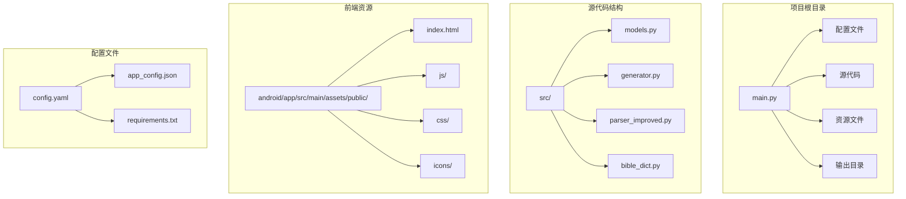
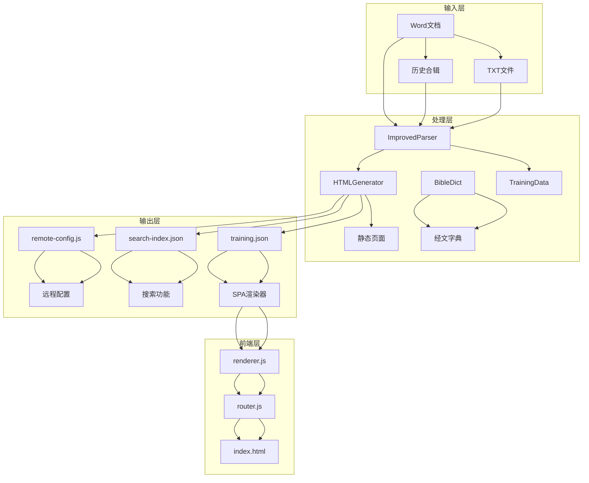
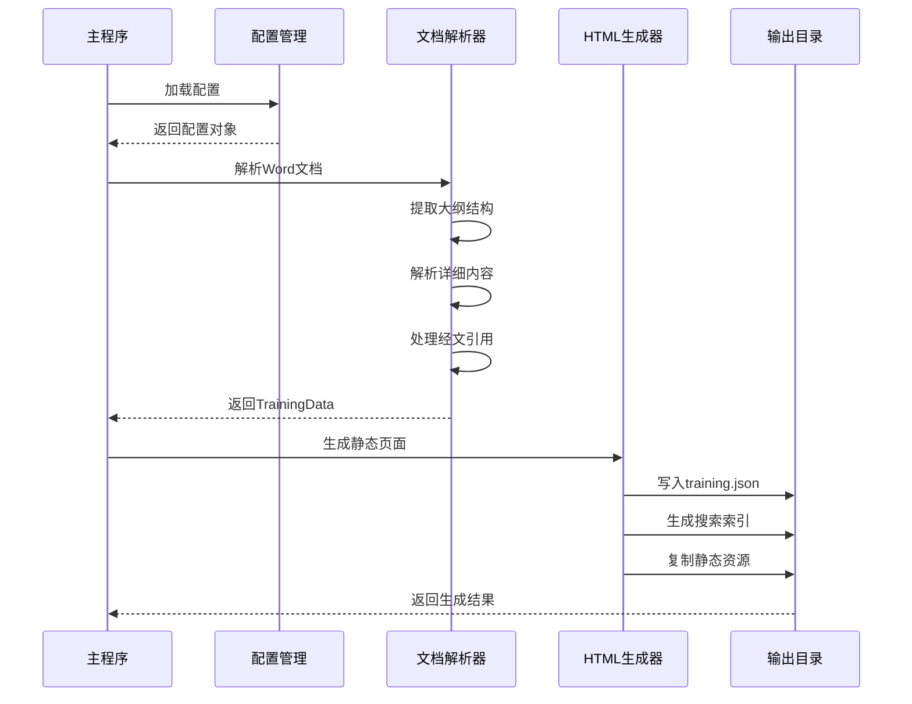
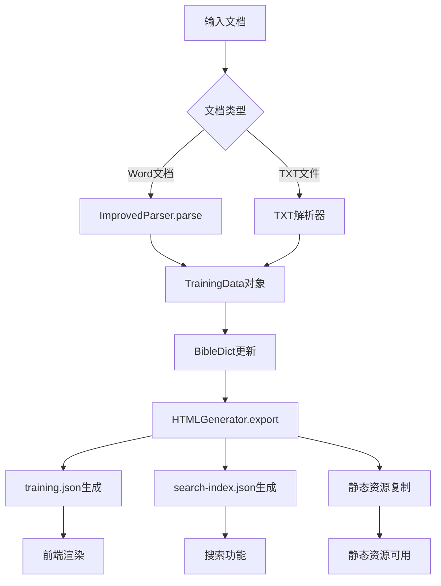
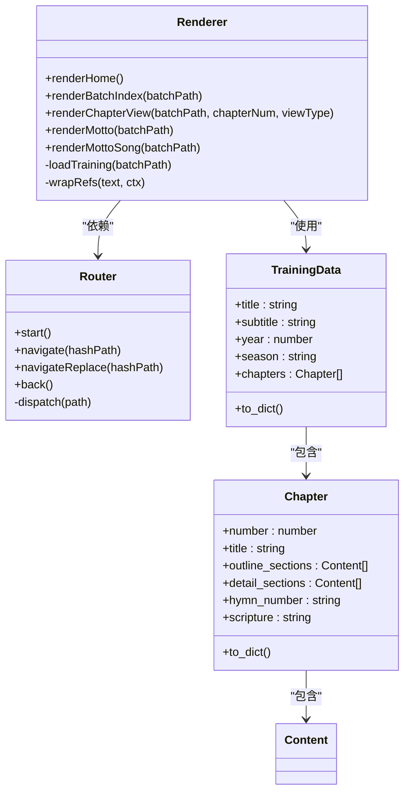
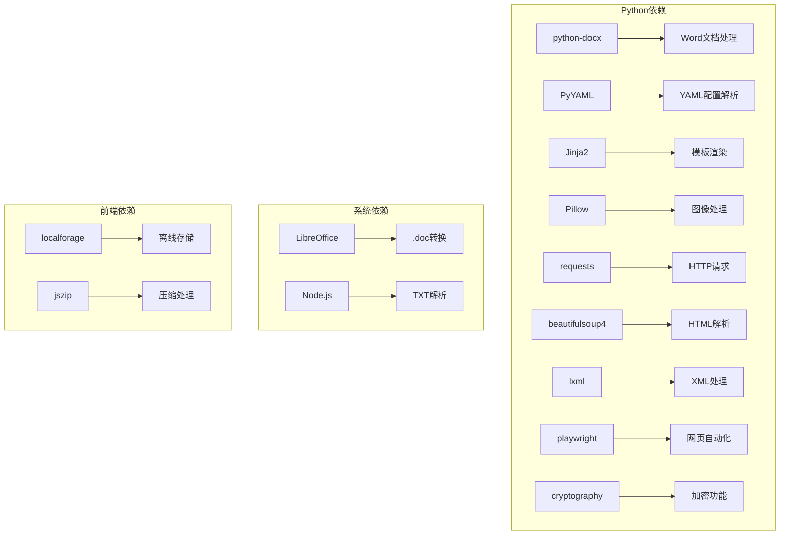

# TTS静态实例管理系统

<cite>
**本文档引用的文件**
- [main.py](file://main.py)
- [config.yaml](file://config.yaml)
- [src/models.py](file://src/models.py)
- [src/generator.py](file://src/generator.py)
- [src/parser_improved.py](file://src/parser_improved.py)
- [src/bible_dict.py](file://src/bible_dict.py)
- [android/app/src/main/assets/public/js/renderer.js](file://android/app/src/main/assets/public/js/renderer.js)
- [android/app/src/main/assets/public/js/router.js](file://android/app/src/main/assets/public/js/router.js)
- [android/app/src/main/assets/public/index.html](file://android/app/src/main/assets/public/index.html)
- [app_config.json](file://app_config.json)
- [requirements.txt](file://requirements.txt)
</cite>

## 目录
1. [项目概述](#项目概述)
2. [项目结构](#项目结构)
3. [核心组件](#核心组件)
4. [架构概览](#架构概览)
5. [详细组件分析](#详细组件分析)
6. [依赖关系分析](#依赖关系分析)
7. [性能考虑](#性能考虑)
8. [故障排除指南](#故障排除指南)
9. [结论](#结论)

## 项目概述

TTS静态实例管理系统是一个基于Python的静态网站生成器，专门用于处理和展示特会训练内容。该系统能够从Word文档中提取信息，生成静态HTML页面，并提供TTS（文本转语音）功能。

系统采用前后端分离的架构设计，后端使用Python处理文档解析和静态页面生成，前端使用JavaScript实现SPA（单页应用）界面和TTS功能。

## 项目结构

**图表来源**
- [main.py:1-1230](file://main.py#L1-L1230)
- [config.yaml:1-57](file://config.yaml#L1-L57)

**章节来源**
- [main.py:1-1230](file://main.py#L1-L1230)
- [config.yaml:1-57](file://config.yaml#L1-L57)

## 核心组件

### 数据模型层

系统使用数据类来定义核心数据结构：

- **Content**: 内容节点基类，支持多层级结构
- **Chapter**: 篇章实体，包含大纲、详细内容、诗歌信息等
- **TrainingData**: 训练数据总集，管理所有篇章
- **MorningRevival**: 晨读内容，按天组织

### 文档解析器

**ImprovedParser**类负责从Word文档中提取结构化信息：

- 支持.doc和.docx格式
- 自动识别经文格式
- 解析大纲层级结构
- 提取诗歌信息和标语内容

### HTML生成器

**HTMLGenerator**类负责将解析的数据转换为静态HTML：

- 使用Jinja2模板引擎
- 生成SPA兼容的JSON数据
- 创建搜索索引
- 处理经文引用和跨章节引用

### 配置管理系统

系统支持多种配置方式：

- YAML配置文件
- 远程服务器配置
- 访问时间控制
- 赞助功能开关

**章节来源**
- [src/models.py:1-232](file://src/models.py#L1-L232)
- [src/parser_improved.py:1-800](file://src/parser_improved.py#L1-L800)
- [src/generator.py:1-546](file://src/generator.py#L1-L546)

## 架构概览

**图表来源**
- [main.py:505-631](file://main.py#L505-L631)
- [src/parser_improved.py:367-782](file://src/parser_improved.py#L367-L782)
- [src/generator.py:383-425](file://src/generator.py#L383-L425)

## 详细组件分析

### 主程序流程

**图表来源**
- [main.py:505-631](file://main.py#L505-L631)
- [src/generator.py:383-425](file://src/generator.py#L383-L425)

### 数据流处理

**图表来源**
- [src/parser_improved.py:367-782](file://src/parser_improved.py#L367-L782)
- [src/generator.py:383-425](file://src/generator.py#L383-L425)

### 前端渲染架构

**图表来源**
- [android/app/src/main/assets/public/js/renderer.js:1-200](file://android/app/src/main/assets/public/js/renderer.js#L1-L200)
- [android/app/src/main/assets/public/js/router.js:1-130](file://android/app/src/main/assets/public/js/router.js#L1-L130)
- [src/models.py:196-232](file://src/models.py#L196-L232)

**章节来源**
- [main.py:19-109](file://main.py#L19-L109)
- [main.py:112-146](file://main.py#L112-L146)
- [main.py:353-502](file://main.py#L353-L502)

## 依赖关系分析

**图表来源**
- [requirements.txt:1-16](file://requirements.txt#L1-L16)

**章节来源**
- [requirements.txt:1-16](file://requirements.txt#L1-L16)
- [src/parser_improved.py:37-113](file://src/parser_improved.py#L37-L113)

## 性能考虑

### 缓存策略
- **经文字典缓存**: 使用BibleDict类缓存已解析的经文
- **模板缓存**: Jinja2模板引擎内置缓存机制
- **静态资源缓存**: 前端使用浏览器缓存策略

### 优化建议
1. **并发处理**: 批量处理多个训练时使用异步操作
2. **内存管理**: 大型文档解析时及时释放内存
3. **增量更新**: 支持部分文件的增量重新生成
4. **压缩优化**: 对输出文件进行gzip压缩

## 故障排除指南

### 常见问题及解决方案

**1. .doc文件转换失败**
- 检查LibreOffice是否正确安装
- 确认转换权限和路径
- 考虑手动转换为.docx格式

**2. 经文解析错误**
- 验证经文格式是否符合规范
- 检查BibleDict数据完整性
- 确认引用格式的一致性

**3. 前端渲染问题**
- 检查training.json文件完整性
- 验证JavaScript文件加载状态
- 确认路由配置正确性

**章节来源**
- [src/parser_improved.py:84-110](file://src/parser_improved.py#L84-L110)
- [src/generator.py:334-373](file://src/generator.py#L334-L373)

## 结论

TTS静态实例管理系统是一个功能完整、架构清晰的静态网站生成器。系统通过合理的分层设计和模块化组织，实现了从文档解析到静态页面生成的完整流程。

主要特点包括：
- 支持多种文档格式输入
- 提供丰富的配置选项
- 生成SPA兼容的静态内容
- 内置TTS和搜索功能
- 良好的性能和可扩展性

该系统适用于需要处理大量训练材料并提供高质量阅读体验的应用场景。