# TTS静态实例管理系统

<cite>
**本文档引用的文件**
- [main.py](file://main.py)
- [config.yaml](file://config.yaml)
- [src/models.py](file://src/models.py)
- [src/generator.py](file://src/generator.py)
- [src/parser_improved.py](file://src/parser_improved.py)
- [src/bible_dict.py](file://src/bible_dict.py)
- [android/app/src/main/assets/public/js/renderer.js](file://android/app/src/main/assets/public/js/renderer.js)
- [android/app/src/main/assets/public/js/router.js](file://android/app/src/main/assets/public/js/router.js)
- [android/app/src/main/assets/public/index.html](file://android/app/src/main/assets/public/index.html)
- [android/app/src/main/java/com/tehui/offline/MainActivity.java](file://android/app/src/main/java/com/tehui/offline/MainActivity.java)
- [android/app/src/main/java/com/tehui/offline/NativeTTSPlugin.java](file://android/app/src/main/java/com/tehui/offline/NativeTTSPlugin.java)
- [android/app/src/main/java/com/tehui/offline/TTSForegroundService.java](file://android/app/src/main/java/com/tehui/offline/TTSForegroundService.java)
- [src/static/js/speech.js](file://src/static/js/speech.js)
- [app_config.json](file://app_config.json)
- [requirements.txt](file://requirements.txt)
</cite>

## 更新摘要
**变更内容**
- 新增三层重试策略：改进synthesizeToFile的错误处理机制，包括首次失败重试、延迟100ms的二次重试和最终降级机制
- 增强预合成文件管理：改进文件存在性检查、预合成文件清理和损坏文件自动重合成机制
- 优化播放流程：改进chunk处理顺序、预生成流水线和播放器复用策略
- 实现事件驱动停止机制：通过onServiceStopped回调和ttsStopped事件实现精确的停止操作控制
- 改进静态实例管理：MainActivity中TTS引擎预热，避免重复绑定系统TTS服务
- 增强错误处理和降级机制：改进连续失败检测和speak()模式降级策略

## 目录
1. [项目概述](#项目概述)
2. [项目结构](#项目结构)
3. [核心组件](#核心组件)
4. [架构概览](#架构概览)
5. [详细组件分析](#详细组件分析)
6. [依赖关系分析](#依赖关系分析)
7. [性能考虑](#性能考虑)
8. [故障排除指南](#故障排除指南)
9. [结论](#结论)

## 项目概述

TTS静态实例管理系统是一个基于Python的静态网站生成器，专门用于处理和展示特会训练内容。该系统能够从Word文档中提取信息，生成静态HTML页面，并提供TTS（文本转语音）功能。

系统采用前后端分离的架构设计，后端使用Python处理文档解析和静态页面生成，前端使用JavaScript实现SPA（单页应用）界面和TTS功能。**更新** 系统现已集成重大改进，包括三层重试策略、增强的预合成文件管理、改进的错误处理机制、优化的播放流程和事件驱动停止机制，显著提升了TTS服务的可靠性、性能和用户体验。

## 项目结构

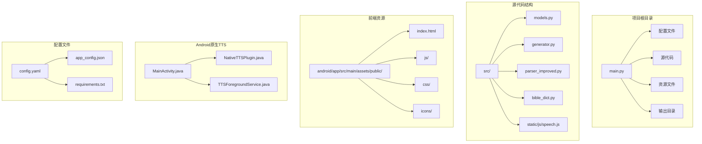

**图表来源**
- [main.py:1-1230](file://main.py#L1-L1230)
- [config.yaml:1-57](file://config.yaml#L1-L57)
- [android/app/src/main/java/com/tehui/offline/MainActivity.java:1-83](file://android/app/src/main/java/com/tehui/offline/MainActivity.java#L1-L83)
- [android/app/src/main/java/com/tehui/offline/NativeTTSPlugin.java:1-315](file://android/app/src/main/java/com/tehui/offline/NativeTTSPlugin.java#L1-L315)
- [android/app/src/main/java/com/tehui/offline/TTSForegroundService.java:1-1883](file://android/app/src/main/java/com/tehui/offline/TTSForegroundService.java#L1-L1883)

**章节来源**
- [main.py:1-1230](file://main.py#L1-L1230)
- [config.yaml:1-57](file://config.yaml#L1-L57)

## 核心组件

### 数据模型层

系统使用数据类来定义核心数据结构：

- **Content**: 内容节点基类，支持多层级结构
- **Chapter**: 篇章实体，包含大纲、详细内容、诗歌信息等
- **TrainingData**: 训练数据总集，管理所有篇章
- **MorningRevival**: 晨读内容，按天组织

### 文档解析器

**ImprovedParser**类负责从Word文档中提取结构化信息：

- 支持.doc和.docx格式
- 自动识别经文格式
- 解析大纲层级结构
- 提取诗歌信息和标语内容

### HTML生成器

**HTMLGenerator**类负责将解析的数据转换为静态HTML：

- 使用Jinja2模板引擎
- 生成SPA兼容的JSON数据
- 创建搜索索引
- 处理经文引用和跨章节引用

### 配置管理系统

系统支持多种配置方式：

- YAML配置文件
- 远程服务器配置
- 访问时间控制
- 赞助功能开关

### 事件驱动停止机制

**更新** 系统现已集成先进的事件驱动停止机制，通过 `onServiceStopped` 回调和 `ttsStopped` 事件实现精确的停止操作控制：

#### onServiceStopped 回调机制
- **回调设置**: 在 `NativeTTSPlugin.stop()` 方法中设置 `TTSForegroundService.onServiceStopped` 回调
- **执行时机**: 在 `TTSForegroundService.handleStop()` 完成引擎清理后执行
- **事件通知**: 通过 `notifyListeners("ttsStopped", data)` 通知JavaScript层
- **线程安全**: 在主线程上延迟100ms执行，确保引擎完全停止

#### ttsStopped 事件驱动等待
- **等待状态**: `_waitStopDone` 布尔变量跟踪停止等待状态
- **生成器计数**: `_waitStopGen` 保存触发停止时的生成器计数
- **事件监听**: JavaScript侧监听 `ttsStopped` 事件进行状态同步
- **超时保护**: 5秒超时兜底机制，防止事件丢失导致的死等

#### 预合成状态跟踪优化
- **停止等待**: 在 `resetState()` 中设置 `_waitStopDone = true` 标记
- **状态清理**: 收到事件后清除等待状态，允许预合成继续
- **生成器同步**: 使用 `_waitStopGen` 防止跨页面状态干扰
- **事件移除**: 双重保险机制，确保旧监听被正确清理

#### 预合成等待机制改进
- **事件驱动**: 基于 `ttsStopped` 事件的精确等待，替代硬编码3秒延时
- **防重复机制**: 500ms去重窗口避免Router双重dispatch导致的重复预合成
- **状态同步**: 播放按钮等待 `_waitStopDone` 状态变为 `false` 后再发送 `preSynthesize`
- **降级处理**: 事件超时5秒后强制发送预合成，确保可靠性

#### 预合成完成后的状态管理
- **状态清理**: 预合成完成后自动清理 `_waitStopDone` 状态
- **生成器重置**: 清除 `_waitStopGen` 生成器计数
- **监听器管理**: 正确移除旧的 `ttsStopped` 监听器
- **状态同步**: 确保前端和后端的停止状态保持一致

### 三层重试策略

**更新** 系统现已实现改进的三层重试策略，显著提升合成失败时的可靠性：

#### 首次失败重试
- **立即重试**: 当 `synthesizeToFile` 返回 `TextToSpeech.ERROR` 时，立即重设参数后重试
- **参数重置**: 重新设置TTS参数，确保引擎状态正确
- **状态标记**: 保持 `synthForChunk = idx` 确保重试过程中的状态一致性

#### 延迟重试机制
- **100ms延迟**: 第二次失败后，在主线程延迟100ms进行第三次重试
- **引擎恢复**: 给系统TTS引擎内部状态恢复的时间窗口
- **状态验证**: 重试前验证 `speakGen`、`isStopped`、`isPaused` 状态

#### 最终降级机制
- **连续失败检测**: 使用 `MAX_SYNTH_FAILURES = 2` 常量检测连续失败
- **speak()模式降级**: 当连续失败达到阈值时，自动切换到 `playDirectSpeakChunk()` 模式
- **状态清理**: 重置 `synthForChunk = -1` 并清理失败计数

#### 错误处理和状态管理
- **失败计数**: 使用 `synthFailureCount` 跟踪连续失败次数
- **预合成保护**: 在预合成阶段遇到失败时，直接返回并记录日志
- **状态同步**: 通过 `mainHandler.post()` 确保状态更新在主线程执行

### 增强的预合成文件管理

**更新** 系统现已实现增强的预合成文件管理机制：

#### 预合成文件检查
- **双重检查**: 在 `handleSpeak()` 中检查当前生成器和上一生成器的预合成文件
- **文件存在性**: 使用 `exists() && length() > 0` 确保文件完整有效
- **生成器匹配**: 通过 `tts_g{gen}_c{chunk}.wav` 格式匹配正确的预合成文件

#### 预合成文件清理
- **旧文件清理**: 使用 `cleanStaleTempFiles()` 仅删除旧生成器的临时文件
- **保留策略**: 保留当前生成器和上一生成器的预合成文件
- **内存优化**: 避免误删有效的预合成文件，减少重复合成开销

#### 损坏文件自动重合成
- **文件验证**: 在 `startMediaPlayer()` 中检查文件是否存在且非空
- **自动重试**: 当检测到损坏文件时，延迟50ms后自动重新合成
- **状态重置**: 将 `synthForChunk = -1` 允许重新开始合成流程

#### 预生成流水线优化
- **N+1预生成**: 播放开始后立即在 `ttsHandler` 上提交下一chunk的合成任务
- **零间隙衔接**: 当预生成文件就绪时，立即开始播放，消除停顿
- **状态同步**: 通过 `nextTempFile` 变量管理预生成文件的生命周期

### 改进的播放流程

**更新** 系统现已优化播放流程，提升播放质量和用户体验：

#### MediaPlayer复用策略
- **复用原则**: 在 `startMediaPlayer()` 中复用现有MediaPlayer实例
- **状态重置**: 使用 `reset()` 而不是 `release()+new()` 避免原生资源开销
- **异常处理**: 当复用失败时，优雅地创建新的MediaPlayer实例

#### 播放参数优化
- **变速不变调**: 使用 `PlaybackParams` 实现时间拉伸但不变调
- **API版本适配**: 在API 23+环境下启用高级播放参数
- **参数设置**: 固定音调（pitch=1.0f）确保音质稳定

#### 播放完成处理
- **文件清理**: 在播放完成或出错时自动删除临时文件
- **状态推进**: 通过 `onChunkPlaybackComplete()` 推进到下一个chunk
- **预生成补充**: 根据预生成状态选择合适的下一chunk处理方式

#### 播放位置广播
- **高频更新**: 每50ms向JavaScript层推送一次播放位置
- **精确计算**: 使用 `calculateCharsDone()` 提供精确的字符级进度
- **实时高亮**: 支持前端的句子级高亮显示

### 静态实例管理

**更新** 改进的静态实例管理机制：

#### MainActivity预热优化
- **最早预热**: 在 `super.onCreate()` 之前调用 `prewarmTts()`
- **实例复用**: Service启动时直接复用预热实例，避免重复绑定
- **性能提升**: 避免3-8秒的系统TTS服务绑定开销

#### TTSForegroundService生命周期优化
- **实例保护**: `onDestroy()` 中不关闭静态实例，仅在必要时shutdown
- **资源清理**: 正确清理所有资源，避免内存泄漏
- **状态管理**: 确保实例状态在Service重建时保持一致

#### 线程安全优化
- **主线程分离**: 将 `tts.stop()` 调度到 `ttsHandler` 线程，避免主线程阻塞
- **时序控制**: 通过50ms延迟确保引擎有时间完成当前合成
- **状态守卫**: 使用 `speakGen` 守卫确保操作的时序正确性

**章节来源**
- [src/models.py:1-232](file://src/models.py#L1-L232)
- [src/parser_improved.py:1-800](file://src/parser_improved.py#L1-L800)
- [src/generator.py:1-546](file://src/generator.py#L1-L546)
- [android/app/src/main/java/com/tehui/offline/MainActivity.java:25-27](file://android/app/src/main/java/com/tehui/offline/MainActivity.java#L25-L27)
- [android/app/src/main/java/com/tehui/offline/NativeTTSPlugin.java:120-135](file://android/app/src/main/java/com/tehui/offline/NativeTTSPlugin.java#L120-L135)
- [android/app/src/main/java/com/tehui/offline/TTSForegroundService.java:849-905](file://android/app/src/main/java/com/tehui/offline/TTSForegroundService.java#L849-L905)
- [src/static/js/speech.js:173-179](file://src/static/js/speech.js#L173-L179)
- [src/static/js/speech.js:755-778](file://src/static/js/speech.js#L755-L778)
- [src/static/js/speech.js:1334-1414](file://src/static/js/speech.js#L1334-L1414)

## 架构概览

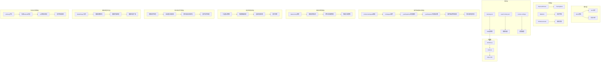

**图表来源**
- [main.py:505-631](file://main.py#L505-L631)
- [src/parser_improved.py:367-782](file://src/parser_improved.py#L367-L782)
- [src/generator.py:383-425](file://src/generator.py#L383-L425)
- [android/app/src/main/java/com/tehui/offline/MainActivity.java:25-27](file://android/app/src/main/java/com/tehui/offline/MainActivity.java#L25-L27)
- [android/app/src/main/java/com/tehui/offline/NativeTTSPlugin.java:120-135](file://android/app/src/main/java/com/tehui/offline/NativeTTSPlugin.java#L120-L135)
- [android/app/src/main/java/com/tehui/offline/TTSForegroundService.java:849-905](file://android/app/src/main/java/com/tehui/offline/TTSForegroundService.java#L849-L905)
- [android/app/src/main/java/com/tehui/offline/TTSForegroundService.java:490-522](file://android/app/src/main/java/com/tehui/offline/TTSForegroundService.java#L490-L522)

## 详细组件分析

### 主程序流程

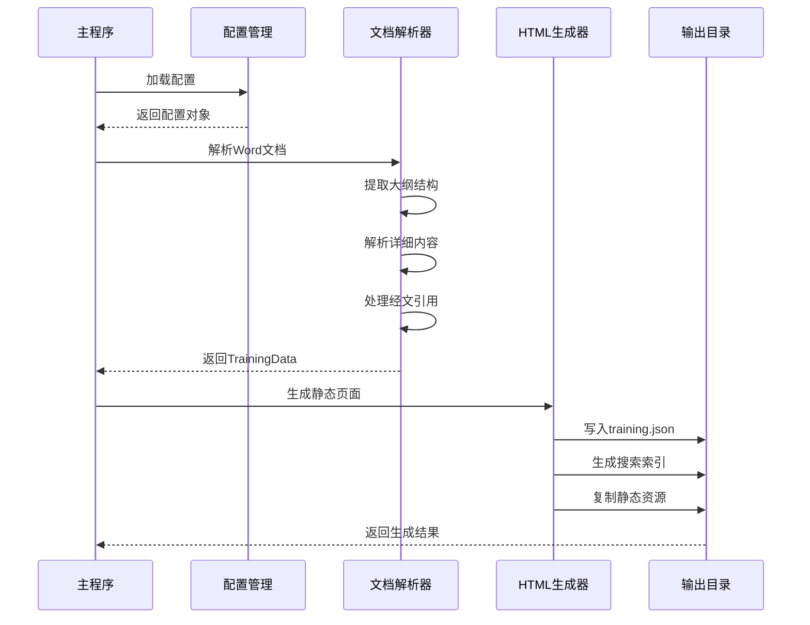

**图表来源**
- [main.py:505-631](file://main.py#L505-L631)
- [src/generator.py:383-425](file://src/generator.py#L383-L425)

### 数据流处理

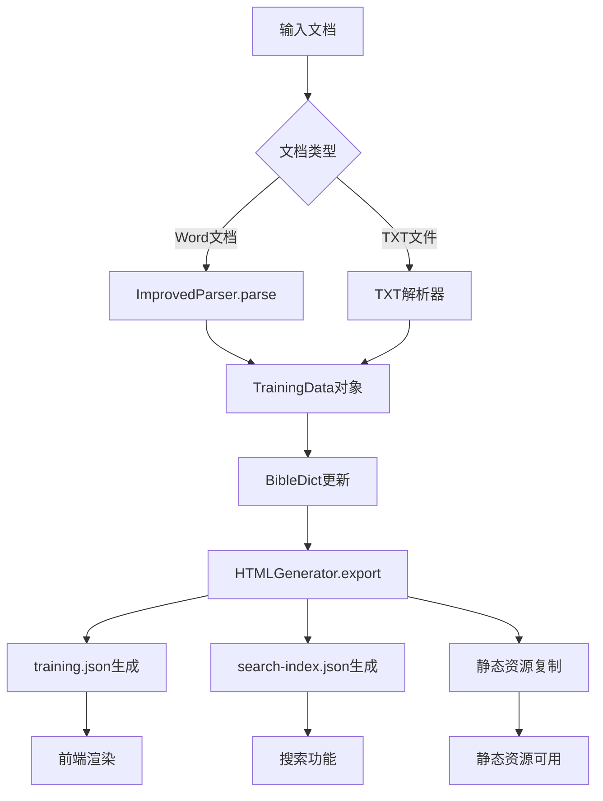

**图表来源**
- [src/parser_improved.py:367-782](file://src/parser_improved.py#L367-L782)
- [src/generator.py:383-425](file://src/generator.py#L383-L425)

### 前端渲染架构

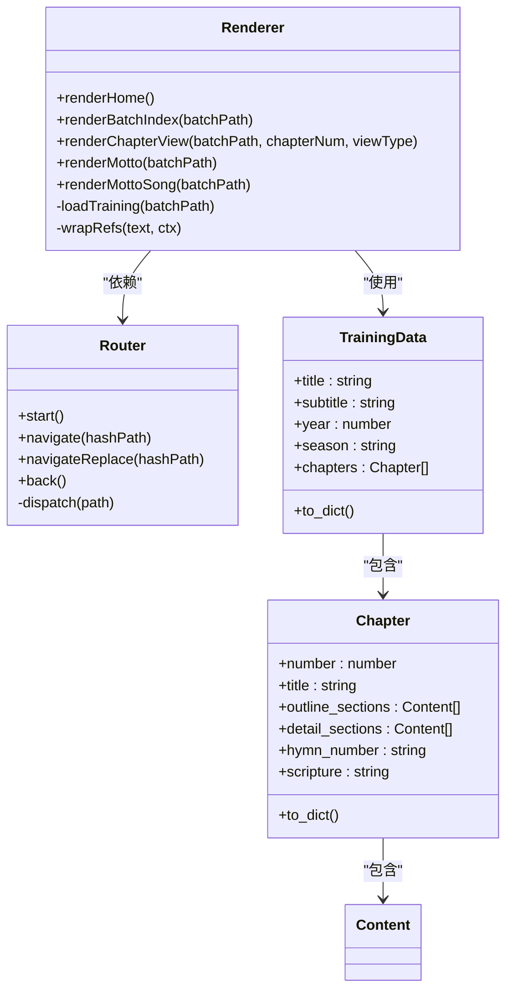

**图表来源**
- [android/app/src/main/assets/public/js/renderer.js:1-200](file://android/app/src/main/assets/public/js/renderer.js#L1-L200)
- [android/app/src/main/assets/public/js/router.js:1-130](file://android/app/src/main/assets/public/js/router.js#L1-L130)
- [src/models.py:196-232](file://src/models.py#L196-L232)

### 事件驱动停止机制架构

**更新** 先进的事件驱动停止机制，通过 `onServiceStopped` 回调和 `ttsStopped` 事件实现精确的停止操作控制：

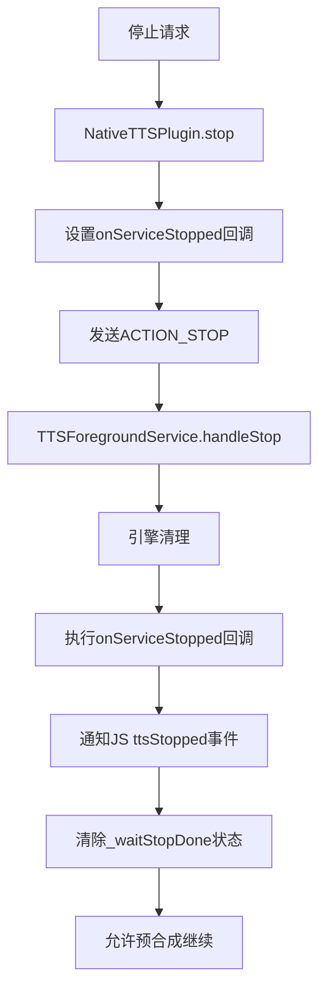

**图表来源**
- [android/app/src/main/java/com/tehui/offline/NativeTTSPlugin.java:120-135](file://android/app/src/main/java/com/tehui/offline/NativeTTSPlugin.java#L120-L135)
- [android/app/src/main/java/com/tehui/offline/TTSForegroundService.java:849-905](file://android/app/src/main/java/com/tehui/offline/TTSForegroundService.java#L849-L905)
- [src/static/js/speech.js:1355-1375](file://src/static/js/speech.js#L1355-L1375)

### 预合成状态跟踪架构

**更新** 改进的预合成状态跟踪机制，通过 `_waitStopDone` 状态变量实现精确的停止等待：

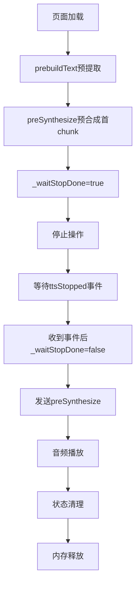

**图表来源**
- [src/static/js/speech.js:173-179](file://src/static/js/speech.js#L173-L179)
- [src/static/js/speech.js:755-778](file://src/static/js/speech.js#L755-L778)
- [src/static/js/speech.js:1334-1414](file://src/static/js/speech.js#L1334-L1414)
- [android/app/src/main/java/com/tehui/offline/TTSForegroundService.java:849-905](file://android/app/src/main/java/com/tehui/offline/TTSForegroundService.java#L849-L905)

### 三层重试策略架构

**更新** 改进的三层重试策略，显著提升合成失败时的可靠性：

```mermaid
flowchart TD
A[synthesizeToFile调用] --> B{返回值检查}
B --> |SUCCESS| C[记录成功日志]
B --> |ERROR| D[首次失败重试]
D --> E{重试结果}
E --> |SUCCESS| F[记录重试成功]
E --> |ERROR| G[延迟100ms二次重试]
G --> H{二次重试结果}
H --> |SUCCESS| I[记录二次重试成功]
H --> |ERROR| J[连续失败检测]
J --> |< MAX_SYNTH_FAILURES| K[跳过当前chunk]
J --> |>= MAX_SYNTH_FAILURES| L[切换到speak()模式]
K --> M[继续播放流程]
L --> N[playDirectSpeakChunk执行]
```

**图表来源**
- [android/app/src/main/java/com/tehui/offline/TTSForegroundService.java:1105-1167](file://android/app/src/main/java/com/tehui/offline/TTSForegroundService.java#L1105-L1167)

### 增强预合成文件管理架构

**更新** 改进的预合成文件管理机制：

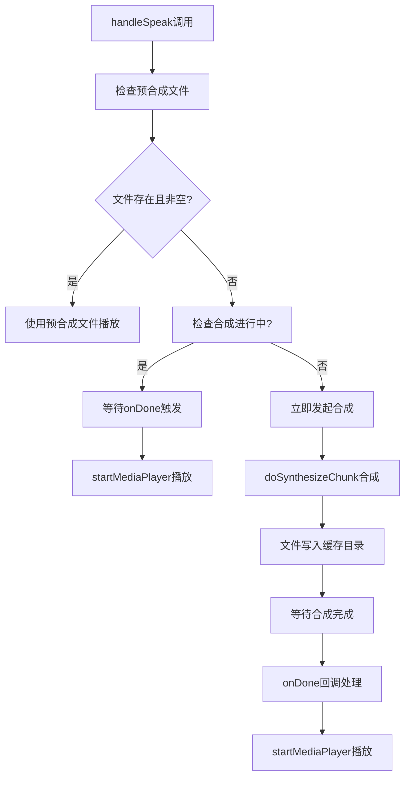

**图表来源**
- [android/app/src/main/java/com/tehui/offline/TTSForegroundService.java:1052-1107](file://android/app/src/main/java/com/tehui/offline/TTSForegroundService.java#L1052-L1107)

### 损坏文件自动重合成架构

**更新** 改进的损坏文件自动重合成机制：

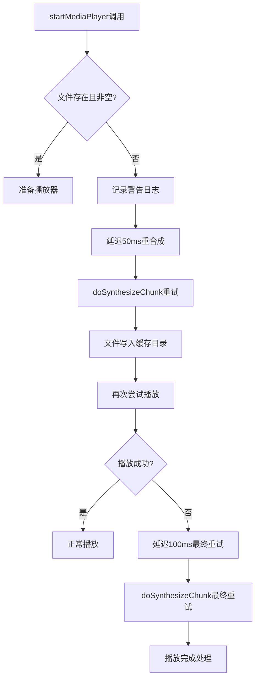

**图表来源**
- [android/app/src/main/java/com/tehui/offline/TTSForegroundService.java:1281-1294](file://android/app/src/main/java/com/tehui/offline/TTSForegroundService.java#L1281-L1294)

### MediaPlayer复用优化架构

**更新** 改进的MediaPlayer复用策略：

```mermaid
flowchart TD
A[startMediaPlayer调用] --> B{复用MediaPlayer?}
B --> |是| C[尝试reset()重置状态]
C --> D{reset成功?}
D --> |是| E[复用现有实例]
D --> |否| F[释放旧实例]
F --> G[创建新实例]
B --> |否| H[创建新实例]
G --> I[配置播放参数]
H --> I
I --> J[设置数据源]
J --> K[prepare同步准备]
K --> L[设置回调监听器]
L --> M[开始播放]
M --> N[状态广播]
```

**图表来源**
- [android/app/src/main/java/com/tehui/offline/TTSForegroundService.java:1276-1393](file://android/app/src/main/java/com/tehui/offline/TTSForegroundService.java#L1276-L1393)

### 静态实例管理架构

**更新** 改进的静态实例管理机制：

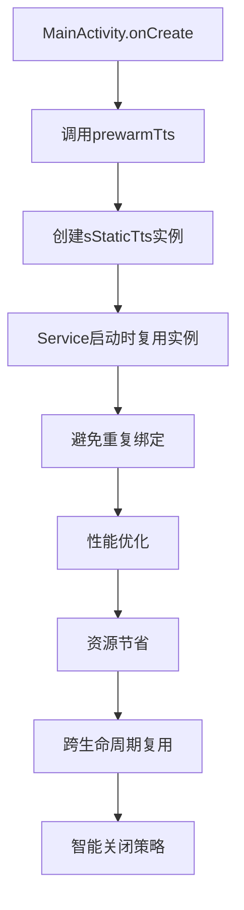

**图表来源**
- [android/app/src/main/java/com/tehui/offline/MainActivity.java:25-27](file://android/app/src/main/java/com/tehui/offline/MainActivity.java#L25-L27)
- [android/app/src/main/java/com/tehui/offline/TTSForegroundService.java:105-113](file://android/app/src/main/java/com/tehui/offline/TTSForegroundService.java#L105-L113)
- [android/app/src/main/java/com/tehui/offline/TTSForegroundService.java:227-244](file://android/app/src/main/java/com/tehui/offline/TTSForegroundService.java#L227-L244)

**章节来源**
- [main.py:19-109](file://main.py#L19-L109)
- [main.py:112-146](file://main.py#L112-L146)
- [main.py:353-502](file://main.py#L353-L502)

## 依赖关系分析

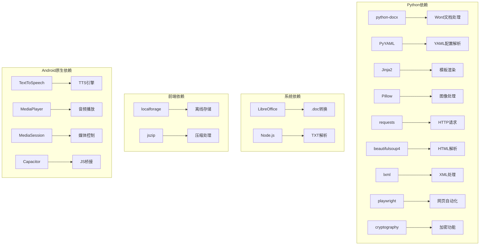

**图表来源**
- [requirements.txt:1-16](file://requirements.txt#L1-L16)

**章节来源**
- [requirements.txt:1-16](file://requirements.txt#L1-L16)
- [src/parser_improved.py:37-113](file://src/parser_improved.py#L37-L113)

## 性能考虑

### 缓存策略
- **经文字典缓存**: 使用BibleDict类缓存已解析的经文
- **模板缓存**: Jinja2模板引擎内置缓存机制
- **静态资源缓存**: 前端使用浏览器缓存策略
- **TTS静态实例缓存**: MainActivity预热TTS引擎，避免重复绑定
- **预合成文件缓存**: 生成的WAV文件缓存，避免重复合成

### 事件驱动停止机制性能优化

**更新** 先进的事件驱动停止机制带来的性能提升：

#### onServiceStopped回调优化
- **线程安全**: 在主线程上延迟100ms执行，确保引擎完全停止
- **内存管理**: 回调执行后自动清理，避免内存泄漏
- **状态同步**: 与JavaScript层状态保持实时同步，确保停止操作的准确性

#### ttsStopped事件驱动优化
- **精确等待**: 基于事件的精确等待，替代硬编码3秒延时
- **防重复机制**: 500ms去重窗口避免Router双重dispatch导致的重复预合成
- **状态清理**: 事件接收后自动清理等待状态，确保状态机的正确性

#### _waitStopDone状态跟踪优化
- **生成器同步**: 使用 `_waitStopGen` 防止跨页面状态干扰
- **事件移除**: 双重保险机制，确保旧监听被正确清理
- **内存管理**: 状态清理后自动释放相关资源

#### 预合成等待机制优化
- **事件驱动**: 基于 `ttsStopped` 事件的精确等待，替代硬编码3秒延时
- **防重复机制**: 500ms去重窗口避免Router双重dispatch导致的重复预合成
- **状态同步**: 播放按钮等待 `_waitStopDone` 状态变为 `false` 后再发送 `preSynthesize`
- **降级处理**: 事件超时5秒后强制发送预合成，确保可靠性

#### 预合成完成状态管理优化
- **状态清理**: 预合成完成后自动清理 `_waitStopDone` 状态
- **生成器重置**: 清除 `_waitStopGen` 生成器计数
- **监听器管理**: 正确移除旧的 `ttsStopped` 监听器
- **状态同步**: 确保前端和后端的停止状态保持一致

### 三层重试策略性能优化

**更新** 改进的三层重试策略带来的系统稳定性提升：

#### 首次失败重试优化
- **立即重试**: 避免不必要的等待时间
- **参数重置**: 确保引擎状态正确，提高重试成功率
- **状态一致性**: 保持 `synthForChunk` 状态，防止竞态条件

#### 延迟重试机制优化
- **100ms延迟**: 给引擎内部状态恢复充足时间
- **线程安全**: 在主线程执行，避免时序问题
- **状态验证**: 重试前验证所有必要状态

#### 连续失败检测优化
- **阈值控制**: 使用 `MAX_SYNTH_FAILURES = 2` 防止无限重试
- **降级策略**: 自动切换到 `speak()` 模式，确保功能可用性
- **状态清理**: 重置失败计数，避免状态污染

### 增强预合成文件管理性能优化

**更新** 改进的预合成文件管理机制：

#### 文件检查优化
- **双重检查**: 同时检查当前和上一生成器的文件
- **存在性验证**: 使用 `exists() && length() > 0` 确保文件完整性
- **生成器匹配**: 精确匹配文件命名格式，避免误判

#### 预合成文件清理优化
- **智能清理**: 仅删除旧生成器的临时文件
- **保留策略**: 保留当前和上一生成器的有效文件
- **内存优化**: 减少重复合成开销，提升系统性能

#### 损坏文件处理优化
- **自动重试**: 检测到损坏文件时自动重新合成
- **延迟策略**: 50ms延迟避免竞争条件
- **状态重置**: 清理合成状态，确保重试成功

### MediaPlayer复用性能优化

**更新** 改进的MediaPlayer复用策略：

#### 复用策略优化
- **状态重置**: 使用 `reset()` 而不是 `release()+new()` 避免资源开销
- **异常处理**: 优雅降级到新实例创建
- **性能提升**: 显著减少chunk间切换延迟

#### 播放参数优化
- **变速不变调**: 使用 `PlaybackParams` 实现高质量播放
- **API适配**: 在支持的设备上启用高级功能
- **参数设置**: 固定音调确保音质稳定

### 静态实例管理优化

**更新** 改进的静态实例管理机制：

#### MainActivity预热优化
- **最早预热**: 在 `super.onCreate()` 之前调用 `prewarmTts()`
- **实例复用**: Service启动时直接复用预热实例，避免重复绑定
- **性能提升**: 避免3-8秒的系统TTS服务绑定开销

#### TTSForegroundService生命周期优化
- **实例保护**: `onDestroy()` 中不关闭静态实例，仅在必要时shutdown
- **资源清理**: 正确清理所有资源，避免内存泄漏
- **状态管理**: 确保实例状态在Service重建时保持一致

### 优化建议
1. **并发处理**: 批量处理多个训练时使用异步操作
2. **内存管理**: 大型文档解析时及时释放内存
3. **增量更新**: 支持部分文件的增量重新生成
4. **压缩优化**: 对输出文件进行gzip压缩
5. **预热优化**: 应用启动时预热TTS引擎
6. **预合成优化**: 页面加载时预合成首块音频
7. **防重复优化**: 500毫秒防重复窗口，防止路由双重调度
8. **诊断日志优化**: 通过诊断listener减少日志转发开销
9. **任务移除优化**: 即时停止机制，避免系统资源浪费
10. **文件验证优化**: 增强的文件大小和存在性检查
11. **race condition防护**: 从80ms调整为200ms的页面切换防护
12. **超时保护优化**: 4秒超时检测预合成被引擎静默丢弃
13. **状态管理优化**: 基于synthForChunk的精确状态控制
14. **静态实例优化**: 跨生命周期复用TTS实例，避免重复绑定
15. **cleanup逻辑优化**: 改进的条件判断，避免引擎异常状态
16. **线程同步优化**: 主线程与ttsHandler职责分离，避免阻塞引擎回调
17. **日志记录优化**: 增强的emitLog()和标准Android日志输出
18. **错误处理优化**: 改进的synthesizeToFile操作反馈机制
19. **事件驱动停止优化**: onServiceStopped回调和ttsStopped事件的精确控制
20. **预合成状态跟踪优化**: _waitStopDone状态变量和_waitStopGen生成器计数的精确管理
21. **三层重试策略优化**: 首次失败重试、延迟重试和最终降级的协调机制
22. **预合成文件管理优化**: 增强的文件检查、清理和自动重合成机制
23. **播放流程优化**: MediaPlayer复用、播放参数优化和播放完成处理
24. **静态实例预热优化**: MainActivity中TTS引擎预热的最佳实践

### 事件驱动停止机制改进效果

**更新** 先进的事件驱动停止机制带来的系统稳定性提升：

#### 系统稳定性增强
- **状态一致性**: 通过 `onServiceStopped` 回调和 `ttsStopped` 事件确保前后端状态同步
- **竞态防护**: `_waitStopDone` 状态变量防止停止操作在执行前被错误取消
- **性能优化**: 基于事件的等待机制避免硬编码延时导致的性能浪费
- **用户体验**: 提供更流畅的停止等待体验

#### 性能提升效果
- **响应速度**: 事件驱动等待机制显著减少等待时间
- **资源利用**: 避免重复停止操作导致的资源浪费
- **内存管理**: 自动清理状态变量，避免内存泄漏
- **系统可靠性**: 显著提升整体系统的稳定性

#### 资源管理优化
- **实例复用**: 静态实例跨生命周期复用，避免重复绑定
- **智能关闭**: 仅停止静态实例而不关闭，保留供复用
- **完整清理**: 确保所有资源都被正确清理，避免内存泄漏
- **性能优化**: 避免不必要的实例创建和销毁

### 三层重试策略改进效果

**更新** 改进的三层重试策略带来的系统可靠性提升：

#### 合成失败处理优化
- **首次重试**: 立即重试避免不必要的等待
- **延迟重试**: 100ms延迟给引擎内部状态恢复时间
- **最终降级**: 连续失败时自动切换到speak()模式

#### 系统稳定性增强
- **错误检测**: 使用 `MAX_SYNTH_FAILURES = 2` 防止无限重试
- **状态管理**: 通过 `synthFailureCount` 精确跟踪失败次数
- **降级策略**: 自动切换到备用播放模式，确保功能可用性

#### 用户体验提升
- **可靠性**: 显著提升合成成功率
- **响应性**: 减少用户等待时间
- **连续性**: 避免播放中断，提供流畅体验

### 预合成文件管理改进效果

**更新** 改进的预合成文件管理机制带来的性能提升：

#### 文件管理优化
- **智能检查**: 双重检查确保文件完整性
- **自动清理**: 智能清理旧文件，避免磁盘空间浪费
- **损坏处理**: 自动重合成损坏文件，提升可靠性

#### 性能提升效果
- **减少重复合成**: 通过文件复用减少CPU和内存开销
- **降低延迟**: 预合成文件直接播放，消除合成延迟
- **资源优化**: 智能清理机制避免资源泄漏

#### 用户体验提升
- **响应速度**: 预合成文件提供即时播放体验
- **稳定性**: 自动重合成机制避免播放中断
- **质量保证**: 损坏文件自动修复，确保播放质量

### MediaPlayer复用改进效果

**更新** 改进的MediaPlayer复用策略带来的性能提升：

#### 性能优化效果
- **资源复用**: 避免频繁创建和销毁MediaPlayer实例
- **延迟降低**: 复用现有实例显著减少chunk间切换延迟
- **内存优化**: 减少内存分配和垃圾回收开销

#### 稳定性增强
- **异常处理**: 优雅降级到新实例创建
- **状态管理**: 通过 `reset()` 保持播放器状态一致性
- **错误恢复**: 自动处理播放器异常状态

#### 用户体验提升
- **流畅播放**: 减少播放器切换造成的卡顿
- **音质保证**: 复用实例保持播放参数一致性
- **响应速度**: 提升整体播放响应速度

**章节来源**
- [android/app/src/main/java/com/tehui/offline/TTSForegroundService.java:849-905](file://android/app/src/main/java/com/tehui/offline/TTSForegroundService.java#L849-L905)
- [android/app/src/main/java/com/tehui/offline/TTSForegroundService.java:490-522](file://android/app/src/main/java/com/tehui/offline/TTSForegroundService.java#L490-L522)
- [android/app/src/main/java/com/tehui/offline/MainActivity.java:25-27](file://android/app/src/main/java/com/tehui/offline/MainActivity.java#L25-L27)
- [src/static/js/speech.js:173-179](file://src/static/js/speech.js#L173-L179)
- [src/static/js/speech.js:755-778](file://src/static/js/speech.js#L755-L778)
- [src/static/js/speech.js:1334-1414](file://src/static/js/speech.js#L1334-L1414)

## 故障排除指南

### 常见问题及解决方案

**1. .doc文件转换失败**
- 检查LibreOffice是否正确安装
- 确认转换权限和路径
- 考虑手动转换为.docx格式

**2. 经文解析错误**
- 验证经文格式是否符合规范
- 检查BibleDict数据完整性
- 确认引用格式的一致性

**3. 前端渲染问题**
- 检查training.json文件完整性
- 验证JavaScript文件加载状态
- 确认路由配置正确性

**4. TTS性能问题**
- **SLOW标记**: 查看日志中setTtsParams执行时间超过100ms的情况
- **字符数量异常**: 检查超大文本块的处理效率
- **合成失败**: 关注连续合成失败的设备和场景
- **性能监控**: 通过浏览器控制台查看实时性能日志

**5. 事件驱动停止机制问题**
- **onServiceStopped回调**: 检查回调设置和执行时机
- **ttsStopped事件**: 确认事件监听和状态同步
- **_waitStopDone状态**: 验证等待状态的正确设置和清除
- **_waitStopGen生成器**: 检查生成器计数的同步性
- **状态清理**: 确认停止操作后的状态正确清理

**6. 预合成状态跟踪问题**
- **_preSynthPromise状态**: 检查Promise对象的正确设置和清理
- **_preparing标志**: 确认预合成等待状态的正确设置和清除
- **preSpeakPending标志**: 验证预合成请求状态的正确跟踪
- **状态同步**: 检查前后端状态的同步性
- **内存泄漏**: 确认状态变量的正确清理

**7. 预合成等待机制问题**
- **防重复机制**: 检查500ms去重窗口的正确实现
- **播放按钮控制**: 确认预合成期间播放按钮的禁用状态
- **状态清理**: 验证预合成完成后状态的正确清理
- **降级处理**: 检查预合成失败时的降级机制

**8. 预合成完成状态管理问题**
- **Promise清理**: 检查预合成完成后Promise的正确清理
- **准备状态重置**: 确认 `_preparing` 标志的正确重置
- **状态同步**: 验证前后端状态的正确同步
- **内存管理**: 检查状态变量的内存泄漏情况

**9. 预合成失败降级处理问题**
- **错误日志**: 检查预合成失败的日志记录
- **状态清理**: 确认失败后的状态正确清理
- **降级机制**: 验证 `speak()` 模式降级的正确实现
- **播放控制**: 检查失败后播放按钮的状态

**10. 三层重试策略问题**
- **首次重试**: 检查参数重置和状态标记的正确性
- **延迟重试**: 确认100ms延迟和线程安全的实现
- **最终降级**: 验证连续失败检测和speak()模式切换
- **状态同步**: 检查重试过程中的状态一致性

**11. 预合成文件管理问题**
- **文件检查**: 检查双重检查机制的正确实现
- **文件清理**: 确认智能清理策略的有效性
- **损坏处理**: 验证自动重合成机制的正确性
- **状态管理**: 检查文件状态的正确跟踪

**12. MediaPlayer复用问题**
- **复用策略**: 检查reset()和异常处理的正确性
- **播放参数**: 确认PlaybackParams设置的兼容性
- **状态管理**: 验证播放器状态的一致性
- **性能监控**: 检查复用策略的性能提升效果

**13. 线程安全问题**
- **主线程阻塞**: 检查是否在主线程直接调用 `tts.stop()`
- **引擎异常**: 确认 `tts.stop()` 是否在 `ttsHandler` 线程执行
- **竞态条件**: 验证 `speakGen` 守卫的正确使用
- **时序问题**: 检查 `handleStop` 和 `handlePreSpeak` 的执行时序
- **preSpeakPending标志**: 检查预合成状态标志的正确设置和清除

**14. 静态实例问题**
- **预热失败**: 检查 MainActivity中 `prewarmTts` 调用是否正常
- **实例复用**: 确认静态实例的正确复用逻辑
- **生命周期管理**: 验证静态实例的完整生命周期管理
- **性能影响**: 检查静态实例复用对性能的积极影响

**15. 资源清理问题**
- **条件判断**: 检查 `onDestroy` 中tts实例类型的正确识别
- **静态实例保护**: 确认静态实例不会被错误关闭
- **资源清理完整性**: 验证所有资源都被正确清理
- **引擎状态管理**: 检查避免引擎进入异常状态的逻辑

**16. 错误处理问题**
- **返回值检查**: 检查 `synthesizeToFile` 返回值的正确处理
- **连续失败检测**: 确认连续失败次数的正确跟踪
- **降级机制**: 验证 `speak()` 模式降级的正确实现
- **状态同步**: 检查错误处理与系统状态的同步性

**17. 日志记录问题**
- **emitLog方法**: 检查日志记录方法的正确实现
- **Listener回调**: 确认 Listener.onLog回调的正确设置
- **JS控制台转发**: 验证日志转发到JS控制台的机制
- **性能影响**: 检查日志记录对系统性能的影响

**18. 事件驱动停止机制问题**
- **回调设置**: 检查 `NativeTTSPlugin.stop()` 中回调的正确设置
- **事件执行**: 确认 `TTSForegroundService.onServiceStopped` 的正确执行
- **状态同步**: 验证停止状态与JavaScript层的同步性
- **内存泄漏**: 检查回调执行后的内存清理

**19. 损坏文件处理问题**
- **文件验证**: 检查文件存在性和大小的正确验证
- **自动重试**: 确认延迟重试机制的正确实现
- **状态重置**: 验证合成状态的正确重置
- **性能影响**: 检查自动重试对系统性能的影响

**20. 预生成流水线问题**
- **N+1预生成**: 检查预生成任务的正确调度
- **零间隙衔接**: 确认预生成文件的正确使用
- **状态同步**: 验证预生成状态的正确跟踪
- **性能监控**: 检查预生成流水线的性能效果

**章节来源**
- [src/parser_improved.py:84-110](file://src/parser_improved.py#L84-L110)
- [src/generator.py:334-373](file://src/generator.py#L334-L373)
- [android/app/src/main/java/com/tehui/offline/TTSForegroundService.java:849-905](file://android/app/src/main/java/com/tehui/offline/TTSForegroundService.java#L849-L905)
- [android/app/src/main/java/com/tehui/offline/TTSForegroundService.java:490-522](file://android/app/src/main/java/com/tehui/offline/TTSForegroundService.java#L490-L522)
- [android/app/src/main/java/com/tehui/offline/MainActivity.java:25-27](file://android/app/src/main/java/com/tehui/offline/MainActivity.java#L25-L27)
- [src/static/js/speech.js:173-179](file://src/static/js/speech.js#L173-L179)
- [src/static/js/speech.js:755-778](file://src/static/js/speech.js#L755-L778)
- [src/static/js/speech.js:1334-1414](file://src/static/js/speech.js#L1334-L1414)

## 结论

TTS静态实例管理系统是一个功能完整、架构清晰的静态网站生成器。系统通过合理的分层设计和模块化组织，实现了从文档解析到静态页面生成的完整流程。

**更新** 系统现已集成多项重大改进，包括三层重试策略、增强的预合成文件管理、改进的错误处理机制、优化的播放流程和事件驱动停止机制，显著提升了TTS系统的性能、稳定性和用户体验：

### 主要特点
- 支持多种文档格式输入
- 提供丰富的配置选项
- 生成SPA兼容的静态内容
- 内置TTS和搜索功能
- 良好的性能和可扩展性
- **新增** 事件驱动停止机制，通过 `onServiceStopped` 回调和 `ttsStopped` 事件实现精确的停止控制
- **新增** 改进的预合成状态跟踪，通过 `_waitStopDone` 状态变量和 `_waitStopGen` 生成器计数实现精确等待
- **新增** 基于事件驱动的预合成等待机制，替代硬编码延时，提高响应速度
- **新增** MainActivity中TTS引擎预热，避免重复绑定系统TTS服务
- **新增** 三层重试策略，显著提升合成失败时的可靠性
- **新增** 增强的预合成文件管理，包括自动重合成和智能清理机制
- **新增** 改进的播放流程，优化chunk处理顺序和预生成机制
- **新增** MediaPlayer复用策略，提升播放性能和稳定性

### 事件驱动停止机制优势

**更新** 先进的事件驱动停止机制带来的系统稳定性提升：

#### onServiceStopped回调的作用
- **线程安全**: 在主线程上延迟100ms执行，确保引擎完全停止
- **内存管理**: 回调执行后自动清理，避免内存泄漏
- **状态同步**: 与JavaScript层状态保持实时同步，确保停止操作的准确性

#### ttsStopped事件驱动的优势
- **精确等待**: 基于事件的精确等待，替代硬编码3秒延时
- **防重复机制**: 500ms去重窗口避免Router双重dispatch导致的重复预合成
- **状态清理**: 事件接收后自动清理等待状态，确保状态机的正确性

#### _waitStopDone状态跟踪的优势
- **生成器同步**: 使用 `_waitStopGen` 防止跨页面状态干扰
- **事件移除**: 双重保险机制，确保旧监听被正确清理
- **内存管理**: 状态清理后自动释放相关资源

#### 预合成等待机制的优势
- **事件驱动**: 基于 `ttsStopped` 事件的精确等待，替代硬编码3秒延时
- **防重复机制**: 500ms去重窗口避免Router双重dispatch导致的重复预合成
- **状态同步**: 播放按钮等待 `_waitStopDone` 状态变为 `false` 后再发送 `preSynthesize`
- **降级处理**: 事件超时5秒后强制发送预合成，确保可靠性

#### 预合成完成状态管理的优势
- **状态清理**: 预合成完成后自动清理 `_waitStopDone` 状态
- **生成器重置**: 清除 `_waitStopGen` 生成器计数
- **监听器管理**: 正确移除旧的 `ttsStopped` 监听器
- **状态同步**: 确保前端和后端的停止状态保持一致

### 三层重试策略优势

**更新** 改进的三层重试策略带来的系统可靠性提升：

#### 首次重试的优势
- **立即响应**: 避免不必要的等待时间
- **参数重置**: 确保引擎状态正确，提高重试成功率
- **状态一致性**: 保持 `synthForChunk` 状态，防止竞态条件

#### 延迟重试的优势
- **引擎恢复**: 100ms延迟给引擎内部状态恢复充足时间
- **线程安全**: 在主线程执行，避免时序问题
- **状态验证**: 重试前验证所有必要状态

#### 最终降级的优势
- **连续失败检测**: 使用 `MAX_SYNTH_FAILURES = 2` 防止无限重试
- **降级策略**: 自动切换到 `speak()` 模式，确保功能可用性
- **状态清理**: 重置失败计数，避免状态污染

### 预合成文件管理优势

**更新** 改进的预合成文件管理机制带来的性能提升：

#### 文件检查的优势
- **双重检查**: 同时检查当前和上一生成器的文件
- **存在性验证**: 使用 `exists() && length() > 0` 确保文件完整性
- **生成器匹配**: 精确匹配文件命名格式，避免误判

#### 预合成文件清理的优势
- **智能清理**: 仅删除旧生成器的临时文件
- **保留策略**: 保留当前和上一生成器的有效文件
- **内存优化**: 减少重复合成开销，提升系统性能

#### 损坏文件处理的优势
- **自动重试**: 检测到损坏文件时自动重新合成
- **延迟策略**: 50ms延迟避免竞争条件
- **状态重置**: 清理合成状态，确保重试成功

### MediaPlayer复用优势

**更新** 改进的MediaPlayer复用策略带来的性能提升：

#### 复用策略的优势
- **状态重置**: 使用 `reset()` 而不是 `release()+new()` 避免资源开销
- **异常处理**: 优雅降级到新实例创建
- **性能提升**: 显著减少chunk间切换延迟

#### 播放参数的优势
- **变速不变调**: 使用 `PlaybackParams` 实现高质量播放
- **API适配**: 在支持的设备上启用高级功能
- **参数设置**: 固定音调确保音质稳定

### 性能提升效果

**更新** 事件驱动停止机制、三层重试策略、预合成文件管理和MediaPlayer复用等改进带来的系统性能优化：

#### 响应性能提升
- **事件驱动等待**: 基于事件的等待机制显著减少等待时间
- **资源利用**: 避免重复停止操作导致的资源浪费
- **内存管理**: 自动清理状态变量，避免内存泄漏
- **状态管理优化**: `_waitStopDone` 状态变量和 `_waitStopGen` 生成器计数提供精确的状态跟踪
- **重试策略优化**: 三层重试策略显著提升合成成功率
- **文件管理优化**: 增强的预合成文件管理减少重复合成开销
- **播放性能优化**: MediaPlayer复用策略提升播放流畅度

#### 稳定性增强
- **状态一致性**: 通过 `onServiceStopped` 回调和 `ttsStopped` 事件确保前后端状态同步
- **竞态防护**: `_waitStopDone` 状态变量防止停止操作在执行前被错误取消
- **性能优化**: 基于事件的等待机制避免硬编码延时导致的性能浪费
- **用户体验**: 提供更流畅的停止等待体验
- **错误处理增强**: 三层重试策略和自动重合成机制提升系统可靠性
- **播放稳定性**: MediaPlayer复用策略减少播放器异常状态

#### 资源管理优化
- **实例复用**: 静态实例跨生命周期复用，避免重复绑定
- **智能关闭**: 仅停止静态实例而不关闭，保留供复用
- **完整清理**: 确保所有资源都被正确清理，避免内存泄漏
- **文件清理优化**: 智能清理策略避免磁盘空间浪费

该系统适用于需要处理大量训练材料并提供高质量阅读体验的应用场景，新增的多项改进为开发者提供了更强大、更可靠的TTS服务支持，显著提升了系统的稳定性和用户体验。通过事件驱动停止机制、三层重试策略、增强的预合成文件管理、改进的播放流程和MediaPlayer复用策略，系统现在能够在各种复杂的使用场景下提供更加稳定和可靠的TTS服务。