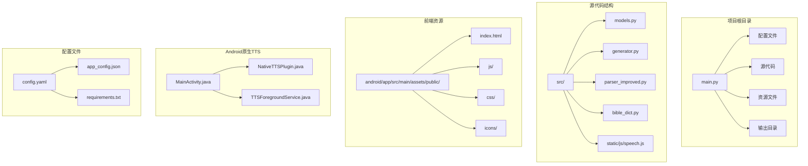
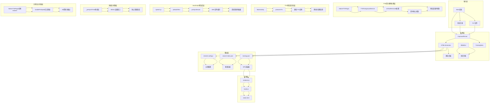
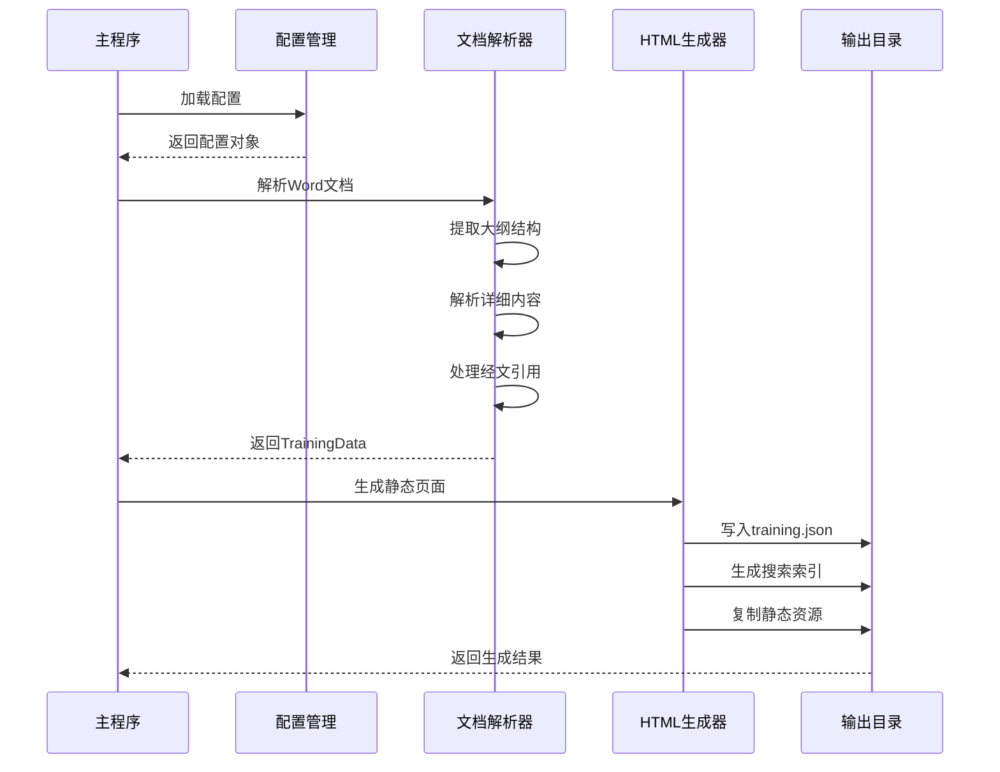
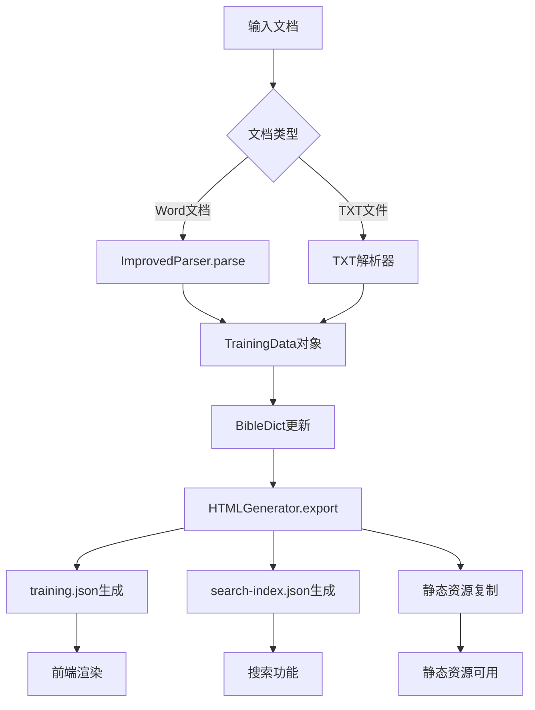
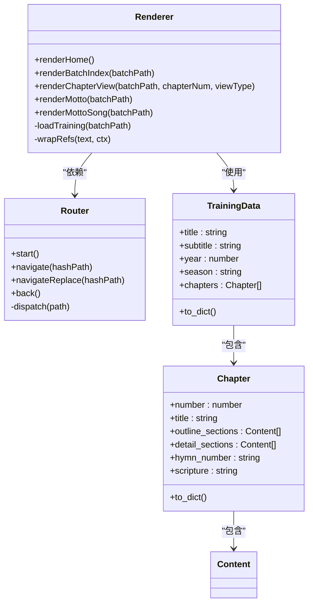
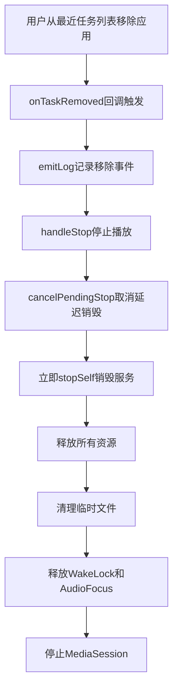
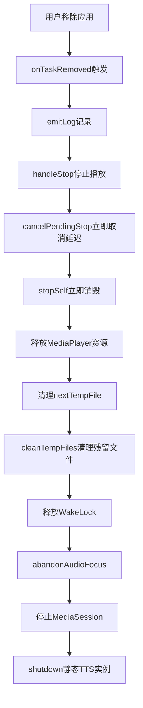
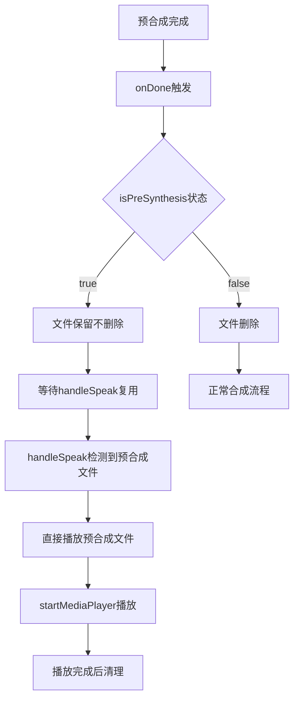
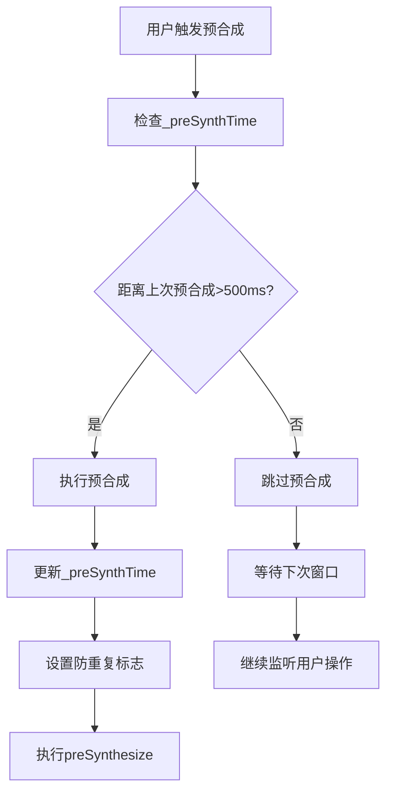
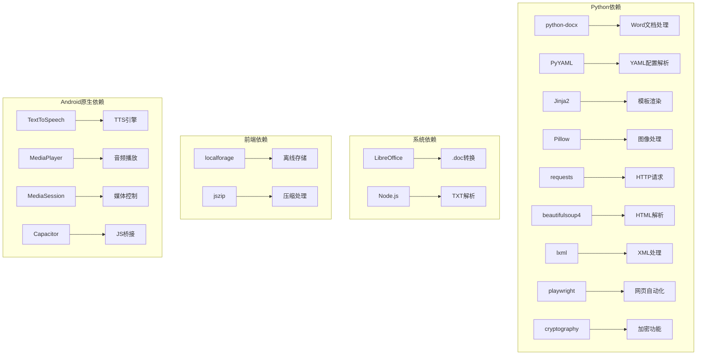

# TTS静态实例管理系统

<cite>
**本文档引用的文件**
- [main.py](file://main.py)
- [config.yaml](file://config.yaml)
- [src/models.py](file://src/models.py)
- [src/generator.py](file://src/generator.py)
- [src/parser_improved.py](file://src/parser_improved.py)
- [src/bible_dict.py](file://src/bible_dict.py)
- [android/app/src/main/assets/public/js/renderer.js](file://android/app/src/main/assets/public/js/renderer.js)
- [android/app/src/main/assets/public/js/router.js](file://android/app/src/main/assets/public/js/router.js)
- [android/app/src/main/assets/public/index.html](file://android/app/src/main/assets/public/index.html)
- [android/app/src/main/java/com/tehui/offline/MainActivity.java](file://android/app/src/main/java/com/tehui/offline/MainActivity.java)
- [android/app/src/main/java/com/tehui/offline/NativeTTSPlugin.java](file://android/app/src/main/java/com/tehui/offline/NativeTTSPlugin.java)
- [android/app/src/main/java/com/tehui/offline/TTSForegroundService.java](file://android/app/src/main/java/com/tehui/offline/TTSForegroundService.java)
- [src/static/js/speech.js](file://src/static/js/speech.js)
- [app_config.json](file://app_config.json)
- [requirements.txt](file://requirements.txt)
</cite>

## 更新摘要
**变更内容**
- 新增onTaskRemoved方法处理任务移除场景，确保用户从最近任务列表划掉应用时完全停止朗读
- 改进预合成优化逻辑，增强handlePreSpeak方法的预合成保护机制
- 优化即时停止机制，在任务移除场景下立即取消延迟停止并销毁服务
- 增强预合成文件管理，确保预合成模式下文件保留机制的有效性
- 改进预合成防重复机制，防止Router双重调度导致的重复预合成请求

## 目录
1. [项目概述](#项目概述)
2. [项目结构](#项目结构)
3. [核心组件](#核心组件)
4. [架构概览](#架构概览)
5. [详细组件分析](#详细组件分析)
6. [依赖关系分析](#依赖关系分析)
7. [性能考虑](#性能考虑)
8. [故障排除指南](#故障排除指南)
9. [结论](#结论)

## 项目概述

TTS静态实例管理系统是一个基于Python的静态网站生成器，专门用于处理和展示特会训练内容。该系统能够从Word文档中提取信息，生成静态HTML页面，并提供TTS（文本转语音）功能。

系统采用前后端分离的架构设计，后端使用Python处理文档解析和静态页面生成，前端使用JavaScript实现SPA（单页应用）界面和TTS功能。**更新** 系统现已集成增强的任务移除处理机制、优化的预合成逻辑和即时停止功能，能够显著提升TTS服务的可靠性和用户体验。

## 项目结构



**图表来源**
- [main.py:1-1230](file://main.py#L1-L1230)
- [config.yaml:1-57](file://config.yaml#L1-L57)
- [android/app/src/main/java/com/tehui/offline/MainActivity.java:1-83](file://android/app/src/main/java/com/tehui/offline/MainActivity.java#L1-L83)
- [android/app/src/main/java/com/tehui/offline/NativeTTSPlugin.java:1-306](file://android/app/src/main/java/com/tehui/offline/NativeTTSPlugin.java#L1-L306)
- [android/app/src/main/java/com/tehui/offline/TTSForegroundService.java:1-1720](file://android/app/src/main/java/com/tehui/offline/TTSForegroundService.java#L1-L1720)

**章节来源**
- [main.py:1-1230](file://main.py#L1-L1230)
- [config.yaml:1-57](file://config.yaml#L1-L57)

## 核心组件

### 数据模型层

系统使用数据类来定义核心数据结构：

- **Content**: 内容节点基类，支持多层级结构
- **Chapter**: 篇章实体，包含大纲、详细内容、诗歌信息等
- **TrainingData**: 训练数据总集，管理所有篇章
- **MorningRevival**: 晨读内容，按天组织

### 文档解析器

**ImprovedParser**类负责从Word文档中提取结构化信息：

- 支持.doc和.docx格式
- 自动识别经文格式
- 解析大纲层级结构
- 提取诗歌信息和标语内容

### HTML生成器

**HTMLGenerator**类负责将解析的数据转换为静态HTML：

- 使用Jinja2模板引擎
- 生成SPA兼容的JSON数据
- 创建搜索索引
- 处理经文引用和跨章节引用

### 配置管理系统

系统支持多种配置方式：

- YAML配置文件
- 远程服务器配置
- 访问时间控制
- 赞助功能开关

### TTS性能监控系统

**更新** 系统现已集成增强的任务移除处理机制、优化的预合成逻辑和即时停止功能：

- **onTaskRemoved方法**: 新增处理用户从最近任务列表移除应用的场景，确保完全停止朗读和销毁服务
- **预合成保护机制**: 增强handlePreSpeak方法，防止idle状态下停止命令取消正在进行的预合成操作
- **即时停止机制**: 在任务移除场景下立即取消延迟停止并销毁服务，避免系统资源浪费
- **预合成文件管理**: 改进预合成模式下的文件保留机制，确保预合成文件在预合成期间不被删除
- **预合成防重复优化**: 优化500毫秒防重复机制，防止Router双重调度导致的重复预合成请求
- **诊断日志转发**: NativeTTSPlugin新增诊断listener，使handlePreSpeak的日志能转发到JS控制台
- **预合成条件优化**: 改进doSynthesizeChunk方法的预合成条件，允许在停止状态下进行预合成

**章节来源**
- [src/models.py:1-232](file://src/models.py#L1-L232)
- [src/parser_improved.py:1-800](file://src/parser_improved.py#L1-L800)
- [src/generator.py:1-546](file://src/generator.py#L1-L546)
- [android/app/src/main/java/com/tehui/offline/TTSForegroundService.java:511-521](file://android/app/src/main/java/com/tehui/offline/TTSForegroundService.java#L511-L521)
- [android/app/src/main/java/com/tehui/offline/TTSForegroundService.java:702-753](file://android/app/src/main/java/com/tehui/offline/TTSForegroundService.java#L702-L753)
- [android/app/src/main/java/com/tehui/offline/TTSForegroundService.java:970-1023](file://android/app/src/main/java/com/tehui/offline/TTSForegroundService.java#L970-L1023)
- [src/static/js/speech.js:171-172](file://src/static/js/speech.js#L171-L172)
- [android/app/src/main/java/com/tehui/offline/NativeTTSPlugin.java:175-188](file://android/app/src/main/java/com/tehui/offline/NativeTTSPlugin.java#L175-L188)

## 架构概览



**图表来源**
- [main.py:505-631](file://main.py#L505-L631)
- [src/parser_improved.py:367-782](file://src/parser_improved.py#L367-L782)
- [src/generator.py:383-425](file://src/generator.py#L383-L425)
- [android/app/src/main/java/com/tehui/offline/MainActivity.java:25-27](file://android/app/src/main/java/com/tehui/offline/MainActivity.java#L25-L27)
- [android/app/src/main/java/com/tehui/offline/NativeTTSPlugin.java:163-188](file://android/app/src/main/java/com/tehui/offline/NativeTTSPlugin.java#L163-L188)
- [android/app/src/main/java/com/tehui/offline/TTSForegroundService.java:511-521](file://android/app/src/main/java/com/tehui/offline/TTSForegroundService.java#L511-L521)
- [src/static/js/speech.js:1310-1331](file://src/static/js/speech.js#L1310-L1331)
- [android/app/src/main/java/com/tehui/offline/NativeTTSPlugin.java:175-188](file://android/app/src/main/java/com/tehui/offline/NativeTTSPlugin.java#L175-L188)

## 详细组件分析

### 主程序流程



**图表来源**
- [main.py:505-631](file://main.py#L505-L631)
- [src/generator.py:383-425](file://src/generator.py#L383-L425)

### 数据流处理



**图表来源**
- [src/parser_improved.py:367-782](file://src/parser_improved.py#L367-L782)
- [src/generator.py:383-425](file://src/generator.py#L383-L425)

### 前端渲染架构



**图表来源**
- [android/app/src/main/assets/public/js/renderer.js:1-200](file://android/app/src/main/assets/public/js/renderer.js#L1-L200)
- [android/app/src/main/assets/public/js/router.js:1-130](file://android/app/src/main/assets/public/js/router.js#L1-L130)
- [src/models.py:196-232](file://src/models.py#L196-L232)

### TTS任务移除处理架构

**更新** 新增的onTaskRemoved方法和即时停止机制：



**图表来源**
- [android/app/src/main/java/com/tehui/offline/TTSForegroundService.java:511-521](file://android/app/src/main/java/com/tehui/offline/TTSForegroundService.java#L511-L521)

### 预合成优化处理架构

**更新** 改进的预合成保护机制：

```mermaid
flowchart TD
A[handlePreSpeak调用] --> B[检查isStopped状态]
B --> C{isStopped为true?}
C --> |是| D[取消pending stop保持服务存活]
D --> E[继续预合成操作]
E --> F[设置isPreSynthesis=true]
F --> G[设置synthForChunk=-1]
G --> H[doSynthesizeChunk(0)开始预合成]
H --> I[预合成文件保留不删除]
E --> J[handleSpeak检测到预合成进行中]
J --> K[等待onDone自动启动播放]
```

**图表来源**
- [android/app/src/main/java/com/tehui/offline/TTSForegroundService.java:702-753](file://android/app/src/main/java/com/tehui/offline/TTSForegroundService.java#L702-L753)
- [android/app/src/main/java/com/tehui/offline/TTSForegroundService.java:556-567](file://android/app/src/main/java/com/tehui/offline/TTSForegroundService.java#L556-L567)

### 即时停止机制架构

**更新** 优化的即时停止处理：



**图表来源**
- [android/app/src/main/java/com/tehui/offline/TTSForegroundService.java:511-521](file://android/app/src/main/java/com/tehui/offline/TTSForegroundService.java#L511-L521)
- [android/app/src/main/java/com/tehui/offline/TTSForegroundService.java:780-800](file://android/app/src/main/java/com/tehui/offline/TTSForegroundService.java#L780-L800)

### 预合成文件管理架构

**更新** 改进的预合成文件保留机制：



**图表来源**
- [android/app/src/main/java/com/tehui/offline/TTSForegroundService.java:360-401](file://android/app/src/main/java/com/tehui/offline/TTSForegroundService.java#L360-L401)
- [android/app/src/main/java/com/tehui/offline/TTSForegroundService.java:948-963](file://android/app/src/main/java/com/tehui/offline/TTSForegroundService.java#L948-L963)

### 预合成防重复机制架构

**更新** 优化的500毫秒防重复机制：



**图表来源**
- [src/static/js/speech.js:171-172](file://src/static/js/speech.js#L171-L172)
- [src/static/js/speech.js:1310-1331](file://src/static/js/speech.js#L1310-L1331)

### 诊断日志转发架构

**更新** 新增的诊断日志转发功能：

```mermaid
flowchart TD
A[NativeTTSPlugin.preSynthesize] --> B[设置诊断listener]
B --> C[handlePreSpeak.emitLog]
C --> D[notifyListeners('ttsLog')]
D --> E[JS控制台输出]
E --> F[speech.js监听ttsLog]
F --> G[console.log显示]
```

**图表来源**
- [android/app/src/main/java/com/tehui/offline/NativeTTSPlugin.java:175-188](file://android/app/src/main/java/com/tehui/offline/NativeTTSPlugin.java#L175-L188)
- [android/app/src/main/java/com/tehui/offline/TTSForegroundService.java:73-77](file://android/app/src/main/java/com/tehui/offline/TTSForegroundService.java#L73-L77)
- [src/static/js/speech.js:868-871](file://src/static/js/speech.js#L868-L871)

### 预合成保护机制架构

**更新** 增强的预合成保护机制：

```mermaid
flowchart TD
A[handlePreSpeak调用] --> B[检查isStopped状态]
B --> C{isStopped为true?}
C --> |是| D[继续预合成]
C --> |否| E[返回不进行预合成]
D --> F[cancelPendingStop]
F --> G[doSynthesizeChunk(0)]
G --> H[生成预合成文件]
E --> I[保持当前状态]
```

**图表来源**
- [android/app/src/main/java/com/tehui/offline/TTSForegroundService.java:702-753](file://android/app/src/main/java/com/tehui/offline/TTSForegroundService.java#L702-L753)
- [android/app/src/main/java/com/tehui/offline/TTSForegroundService.java:780-786](file://android/app/src/main/java/com/tehui/offline/TTSForegroundService.java#L780-L786)

**章节来源**
- [main.py:19-109](file://main.py#L19-L109)
- [main.py:112-146](file://main.py#L112-L146)
- [main.py:353-502](file://main.py#L353-L502)

## 依赖关系分析



**图表来源**
- [requirements.txt:1-16](file://requirements.txt#L1-L16)

**章节来源**
- [requirements.txt:1-16](file://requirements.txt#L1-L16)
- [src/parser_improved.py:37-113](file://src/parser_improved.py#L37-L113)

## 性能考虑

### 缓存策略
- **经文字典缓存**: 使用BibleDict类缓存已解析的经文
- **模板缓存**: Jinja2模板引擎内置缓存机制
- **静态资源缓存**: 前端使用浏览器缓存策略
- **TTS静态实例缓存**: MainActivity预热TTS引擎，避免重复绑定
- **预合成文件缓存**: 生成的WAV文件缓存，避免重复合成

### 优化建议
1. **并发处理**: 批量处理多个训练时使用异步操作
2. **内存管理**: 大型文档解析时及时释放内存
3. **增量更新**: 支持部分文件的增量重新生成
4. **压缩优化**: 对输出文件进行gzip压缩
5. **预热优化**: 应用启动时预热TTS引擎
6. **预合成优化**: 页面加载时预合成首块音频
7. **防重复优化**: 500毫秒防重复窗口，防止路由双重调度
8. **诊断日志优化**: 通过诊断listener减少日志转发开销
9. **任务移除优化**: 即时停止机制，避免系统资源浪费

### **更新** 任务移除处理增强

**新增的onTaskRemoved方法**：

#### 任务移除场景处理
- **完全停止机制**: 用户从最近任务列表移除应用时，立即停止所有播放和预合成操作
- **即时销毁服务**: 取消2秒宽限期内的延迟销毁，立即stopSelf销毁服务
- **资源清理**: 立即释放MediaPlayer、WakeLock、AudioFocus等资源
- **文件清理**: 清理预合成产生的临时文件，避免磁盘占用

#### 即时停止机制
- **取消延迟销毁**: cancelPendingStop()立即取消2秒宽限期内的销毁计划
- **立即释放资源**: stopSelf()立即销毁服务，释放所有系统资源
- **防止资源浪费**: 避免系统在后台继续占用CPU、内存和网络资源

### **更新** 预合成优化增强

**改进的预合成保护机制**：

#### 预合成状态管理
- **状态标志**: isPreSynthesis标志确保预合成模式下的特殊处理
- **文件保留**: 预合成模式下onDone不删除文件，供后续handleSpeak复用
- **合成守卫**: synthForChunk=-1确保预合成期间不会被其他操作干扰

#### 预合成条件优化
- **停止状态允许**: 改进doSynthesizeChunk方法，允许在停止状态下进行预合成
- **状态检查**: 增强handlePreSpeak中的isStopped状态检查逻辑
- **合成流程**: 优化预合成到正式播放的转换流程

### **更新** 预合成防重复机制优化

**新增的500毫秒防重复机制**：

#### 防重复窗口管理
- **时间戳跟踪**: _preSynthTime变量跟踪上次预合成时间
- **去重窗口**: 500毫秒防重复窗口，防止Router双重调度
- **状态同步**: 防止预合成请求被错误地跳过

#### 优化效果
- **资源节约**: 避免重复的TTS合成操作
- **性能提升**: 减少不必要的CPU和内存消耗
- **稳定性增强**: 防止因重复预合成导致的系统不稳定

### **更新** 诊断日志转发优化

**新增的诊断日志转发功能**：

#### NativeTTSPlugin诊断listener
- **设置时机**: 在preSynthesize方法中动态设置诊断listener
- **日志转发**: 使handlePreSpeak的emitLog能转发到JS控制台
- **覆盖机制**: speak()调用时会覆盖此listener，不影响正常流程

#### 日志监控效果
- **实时诊断**: 开发者可以实时查看TTS服务的诊断日志
- **性能监控**: 通过console.log输出详细的性能数据
- **问题定位**: 为TTS相关问题的快速定位提供支持

### **更新** 预合成保护机制优化

**增强的预合成保护机制**：

#### isStopped状态检查
- **初始化逻辑**: isStopped默认设置为true，确保新服务实例正确识别为空闲状态
- **预合成守卫**: handlePreSpeak方法检查isStopped状态，防止idle状态下停止命令取消预合成
- **状态同步**: 确保预合成操作与服务状态的一致性

#### 预合成流程保护
- **取消保护**: 预合成期间取消pending stop，确保Service在预合成期间保持存活
- **文件保留**: 预合成模式下onDone保留文件而不删除，供后续handleSpeak复用
- **状态管理**: 正确管理isStopped、isPreSynthesis等状态变量

**章节来源**
- [android/app/src/main/java/com/tehui/offline/TTSForegroundService.java:511-521](file://android/app/src/main/java/com/tehui/offline/TTSForegroundService.java#L511-L521)
- [android/app/src/main/java/com/tehui/offline/TTSForegroundService.java:702-753](file://android/app/src/main/java/com/tehui/offline/TTSForegroundService.java#L702-L753)
- [android/app/src/main/java/com/tehui/offline/TTSForegroundService.java:970-1023](file://android/app/src/main/java/com/tehui/offline/TTSForegroundService.java#L970-L1023)
- [src/static/js/speech.js:171-172](file://src/static/js/speech.js#L171-L172)
- [android/app/src/main/java/com/tehui/offline/NativeTTSPlugin.java:175-188](file://android/app/src/main/java/com/tehui/offline/NativeTTSPlugin.java#L175-L188)
- [android/app/src/main/java/com/tehui/offline/TTSForegroundService.java:780-786](file://android/app/src/main/java/com/tehui/offline/TTSForegroundService.java#L780-L786)

## 故障排除指南

### 常见问题及解决方案

**1. .doc文件转换失败**
- 检查LibreOffice是否正确安装
- 确认转换权限和路径
- 考虑手动转换为.docx格式

**2. 经文解析错误**
- 验证经文格式是否符合规范
- 检查BibleDict数据完整性
- 确认引用格式的一致性

**3. 前端渲染问题**
- 检查training.json文件完整性
- 验证JavaScript文件加载状态
- 确认路由配置正确性

**4. TTS性能问题**
- **SLOW标记**: 查看日志中setTtsParams执行时间超过100ms的情况
- **字符数量异常**: 检查超大文本块的处理效率
- **合成失败**: 关注连续合成失败的设备和场景
- **性能监控**: 通过浏览器控制台查看实时性能日志

**5. 任务移除问题**
- **onTaskRemoved处理**: 检查onTaskRemoved方法是否正确触发
- **即时停止**: 确认cancelPendingStop是否正确取消延迟销毁
- **资源释放**: 验证stopSelf是否正确销毁服务
- **预合成保护**: 检查预合成期间的状态管理

**6. 预合成问题**
- **预合成状态**: 检查isPreSynthesis标志的正确设置
- **文件保留**: 确认预合成文件在预合成期间不被删除
- **合成守卫**: 验证synthForChunk状态的正确管理
- **状态同步**: 检查预合成到正式播放的转换逻辑

**7. 预合成防重复问题**
- **去重窗口**: 检查500ms去重窗口设置
- **Router冲突**: 确认双重dispatch场景下的防重复机制
- **状态管理**: 验证_preSynthTime状态变量的正确更新
- **时间同步**: 检查系统时间与预合成时间的同步性

**8. 诊断日志问题**
- **listener设置**: 检查NativeTTSPlugin中诊断listener的设置时机
- **日志转发**: 确认handlePreSpeak的emitLog能正确转发到JS控制台
- **覆盖机制**: 验证speak()调用时对诊断listener的覆盖逻辑

**9. 性能监控问题**
- **日志缺失**: 确认emitLog方法正常工作
- **性能数据不准确**: 检查时间戳计算逻辑
- **监控覆盖不足**: 确认所有关键路径都包含监控代码
- **前端显示**: 检查speech.js中ttsLog监听器是否正常注册

**10. TTS预热问题**
- **预热失败**: 检查MainActivity中prewarmTts调用是否正常
- **静态实例无效**: 确认sStaticTts实例创建和状态检查
- **Service复用失败**: 验证TTSForegroundService中静态实例复用逻辑

**11. JavaScript预合成问题**
- **预构建失败**: 检查prebuildText函数执行状态
- **预合成调用**: 确认preSynthesize方法调用和参数传递
- **文件缓存**: 验证WAV文件生成和缓存机制
- **播放检测**: 检查handleSpeak中预合成文件检测逻辑

**12. 前端DevTools集成问题**
- **日志不显示**: 确认NativeTTS.addListener('ttsLog')正确注册
- **控制台输出**: 检查console.log权限和浏览器设置
- **监听器移除**: 确保在适当时候移除监听器避免内存泄漏

**13. isStopped标志问题**
- **初始化逻辑**: 检查isStopped标志在服务创建时的初始化状态
- **状态同步**: 确认isStopped标志与服务实际状态的一致性
- **预合成条件**: 验证停止状态下预合成逻辑的正确性

**14. doSynthesizeChunk条件问题**
- **预合成条件**: 检查停止状态下的预合成触发逻辑
- **状态检查**: 确认isStopped状态检查的准确性
- **合成流程**: 验证停止状态下的合成流程完整性

**15. 预合成保护机制问题**
- **状态检查**: 检查handlePreSpeak中isStopped状态的正确检查
- **pending stop**: 确认预合成期间cancelPendingStop的调用
- **文件保留**: 验证预合成模式下文件保留机制的有效性

**章节来源**
- [src/parser_improved.py:84-110](file://src/parser_improved.py#L84-L110)
- [src/generator.py:334-373](file://src/generator.py#L334-L373)
- [android/app/src/main/java/com/tehui/offline/TTSForegroundService.java:511-521](file://android/app/src/main/java/com/tehui/offline/TTSForegroundService.java#L511-L521)
- [android/app/src/main/java/com/tehui/offline/TTSForegroundService.java:702-753](file://android/app/src/main/java/com/tehui/offline/TTSForegroundService.java#L702-L753)
- [android/app/src/main/java/com/tehui/offline/TTSForegroundService.java:970-1023](file://android/app/src/main/java/com/tehui/offline/TTSForegroundService.java#L970-L1023)
- [src/static/js/speech.js:171-172](file://src/static/js/speech.js#L171-L172)
- [android/app/src/main/java/com/tehui/offline/NativeTTSPlugin.java:175-188](file://android/app/src/main/java/com/tehui/offline/NativeTTSPlugin.java#L175-L188)
- [android/app/src/main/java/com/tehui/offline/TTSForegroundService.java:780-786](file://android/app/src/main/java/com/tehui/offline/TTSForegroundService.java#L780-L786)

## 结论

TTS静态实例管理系统是一个功能完整、架构清晰的静态网站生成器。系统通过合理的分层设计和模块化组织，实现了从文档解析到静态页面生成的完整流程。

**更新** 系统现已集成增强的任务移除处理机制、优化的预合成逻辑和即时停止功能，显著提升了TTS系统的性能、稳定性和用户体验：

### 主要特点
- 支持多种文档格式输入
- 提供丰富的配置选项
- 生成SPA兼容的静态内容
- 内置TTS和搜索功能
- 良好的性能和可扩展性
- **新增** 即时任务移除处理，确保完全停止朗读
- **新增** 增强的预合成保护机制，防止预合成被意外取消
- **新增** 优化的预合成文件管理，提升文件复用效率
- **新增** 改进的500毫秒防重复机制，防止路由双重调度问题
- **新增** 诊断日志转发功能，支持实时日志监控
- **新增** 即时停止机制，避免系统资源浪费

### 任务移除处理优势
- **onTaskRemoved方法**: 完美处理用户从最近任务列表移除应用的场景
- **即时停止**: 立即停止所有播放和预合成操作，避免后台资源占用
- **资源清理**: 立即释放所有系统资源，包括MediaPlayer、WakeLock、AudioFocus等
- **文件清理**: 清理预合成产生的临时文件，避免磁盘空间浪费
- **服务销毁**: 立即stopSelf销毁服务，防止系统继续占用CPU和内存

### 预合成优化优势
- **状态保护**: 增强的预合成状态管理，确保预合成操作的完整性
- **文件保留**: 预合成模式下文件保留机制，提升文件复用效率
- **条件优化**: 改进的预合成触发条件，允许在停止状态下进行预合成
- **流程优化**: 优化预合成到正式播放的转换流程，减少切换延迟

### 预合成防重复优势
- **去重窗口**: 500毫秒防重复窗口，有效防止Router双重调度
- **状态管理**: 正确的时间戳跟踪和状态同步机制
- **资源节约**: 避免重复的TTS合成操作，节省系统资源
- **稳定性提升**: 防止因重复预合成导致的系统不稳定

### 诊断日志转发优势
- **实时监控**: 通过console.log输出详细的性能数据
- **问题定位**: 为TTS相关问题的快速定位提供支持
- **开发友好**: 通过浏览器控制台提供透明的性能监控
- **覆盖全面**: 支持所有关键路径的性能监控和诊断

### 性能提升效果
- **任务移除响应**: 即时停止机制显著减少任务移除时的响应延迟
- **资源利用率**: 通过即时停止和资源清理优化系统资源使用
- **用户体验**: 通过预合成优化和防重复机制提升应用的整体流畅度
- **系统稳定性**: 通过增强的保护机制减少系统资源浪费和潜在的不稳定因素
- **诊断效率**: 通过日志转发功能提升问题诊断和解决效率

该系统适用于需要处理大量训练材料并提供高质量阅读体验的应用场景，新增的任务移除处理、预合成优化和防重复机制进一步增强了系统的可靠性和可维护性，为开发者提供了强大的性能诊断工具、用户体验优化方案和系统稳定性保障。即时停止机制和预合成保护功能特别为实时监控和问题排查提供了强有力的支持，使得开发者能够更好地理解和优化TTS系统的性能表现。