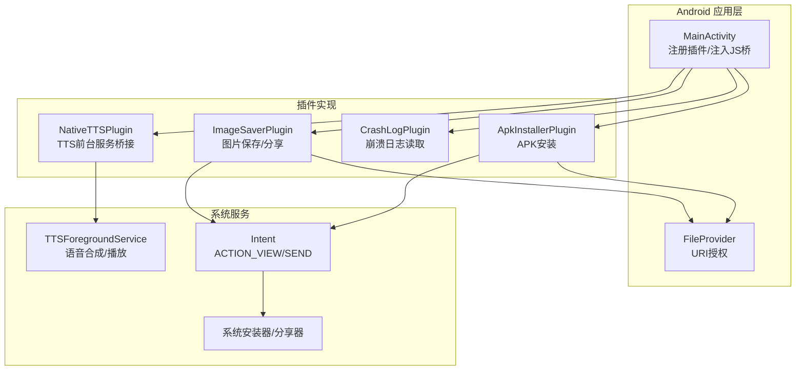
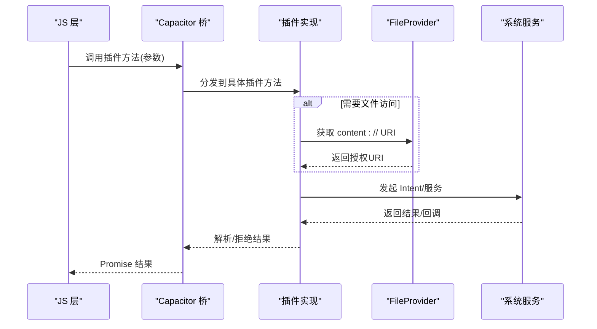
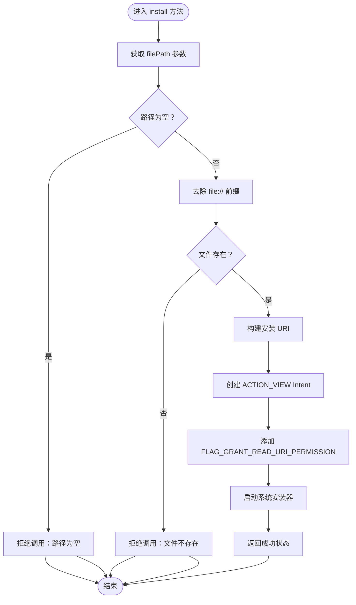
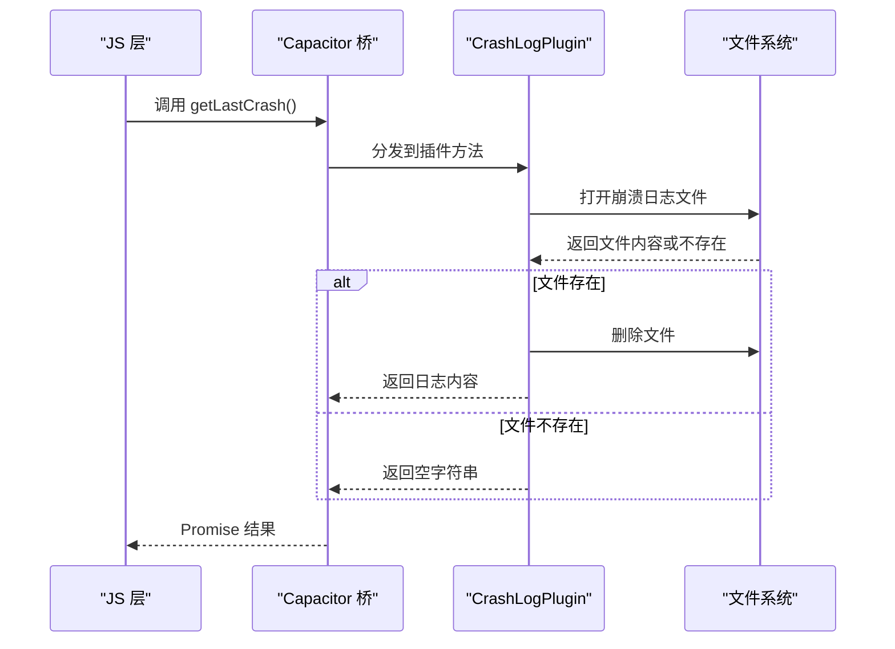
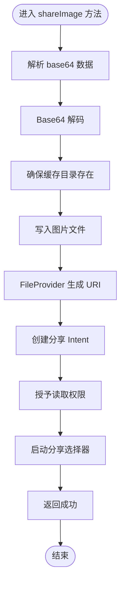
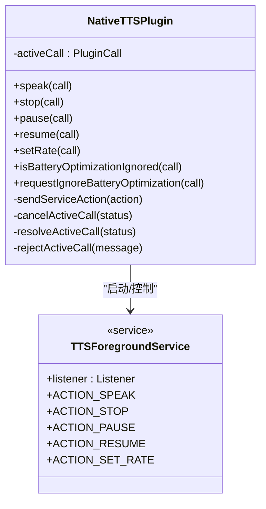
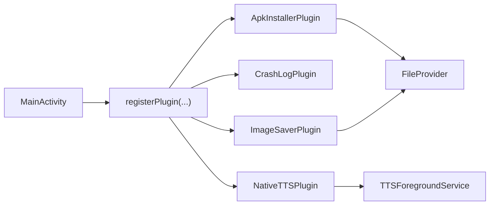

# 插件系统

<cite>
**本文引用的文件**
- [ApkInstallerPlugin.java](file://android/app/src/main/java/com/tehui/offline/ApkInstallerPlugin.java)
- [CrashLogPlugin.java](file://android/app/src/main/java/com/tehui/offline/CrashLogPlugin.java)
- [ImageSaverPlugin.java](file://android/app/src/main/java/com/tehui/offline/ImageSaverPlugin.java)
- [NativeTTSPlugin.java](file://android/app/src/main/java/com/tehui/offline/NativeTTSPlugin.java)
- [MainActivity.java](file://android/app/src/main/java/com/tehui/offline/MainActivity.java)
- [CUSTOM_PLUGIN_SETUP.md](file://CUSTOM_PLUGIN_SETUP.md)
- [capacitor.plugins.json](file://android/app/src/main/assets/capacitor.plugins.json)
</cite>

## 目录
1. [简介](#简介)
2. [项目结构](#项目结构)
3. [核心组件](#核心组件)
4. [架构总览](#架构总览)
5. [详细组件分析](#详细组件分析)
6. [依赖关系分析](#依赖关系分析)
7. [性能考虑](#性能考虑)
8. [故障排查指南](#故障排查指南)
9. [结论](#结论)
10. [附录](#附录)

## 简介
本文件面向移动应用插件系统的使用者与开发者，系统性阐述四个核心插件的实现原理与功能特性：ApkInstallerPlugin 的 APK 安装能力、CrashLogPlugin 的崩溃日志收集机制、ImageSaverPlugin 的图片保存与分享、NativeTTSPlugin 的文本转语音与前台服务集成。同时提供插件开发指南与自定义插件创建方法，帮助读者快速理解并扩展插件体系。

## 项目结构
插件系统基于 Capacitor Android 平台构建，Java/Kotlin 插件位于 Android 模块内，JavaScript 层通过 Capacitor 的插件桥接调用。核心文件组织如下：
- Android 主入口：注册并初始化各插件
- 插件实现：四个自有插件的 Java 实现类
- 插件清单：Capacitor 插件注册表
- 自定义插件指南：包含 APK 安装插件的工作原理与测试排障

**图表来源**
- [MainActivity.java:18-22](file://android/app/src/main/java/com/tehui/offline/MainActivity.java#L18-L22)
- [ApkInstallerPlugin.java:14-66](file://android/app/src/main/java/com/tehui/offline/ApkInstallerPlugin.java#L14-L66)
- [ImageSaverPlugin.java:20-75](file://android/app/src/main/java/com/tehui/offline/ImageSaverPlugin.java#L20-L75)
- [NativeTTSPlugin.java:24-106](file://android/app/src/main/java/com/tehui/offline/NativeTTSPlugin.java#L24-L106)

**章节来源**
- [MainActivity.java:12-35](file://android/app/src/main/java/com/tehui/offline/MainActivity.java#L12-L35)
- [capacitor.plugins.json:1-20](file://android/app/src/main/assets/capacitor.plugins.json#L1-L20)

## 核心组件
- ApkInstallerPlugin：接收 file:// URI，校验文件存在性，按 Android 版本选择 FileProvider 或 file:// URI，发起系统安装意图。
- CrashLogPlugin：在应用启动时读取上次崩溃日志文件，返回给 JS 后自动删除，确保一次性上报。
- ImageSaverPlugin：接收 base64 数据，写入缓存目录并通过 FileProvider 生成 content:// URI，唤起系统分享器。
- NativeTTSPlugin：作为 JS 与 TTSForegroundService 的桥接，提供 speak/stop/pause/resume/setRate 等能力，并处理电池优化提示。

**章节来源**
- [ApkInstallerPlugin.java:14-66](file://android/app/src/main/java/com/tehui/offline/ApkInstallerPlugin.java#L14-L66)
- [CrashLogPlugin.java:21-47](file://android/app/src/main/java/com/tehui/offline/CrashLogPlugin.java#L21-L47)
- [ImageSaverPlugin.java:20-75](file://android/app/src/main/java/com/tehui/offline/ImageSaverPlugin.java#L20-L75)
- [NativeTTSPlugin.java:24-188](file://android/app/src/main/java/com/tehui/offline/NativeTTSPlugin.java#L24-L188)

## 架构总览
下图展示了从 JS 调用到 Android 原生执行的关键路径，以及插件之间的协作关系：

**图表来源**
- [MainActivity.java:18-22](file://android/app/src/main/java/com/tehui/offline/MainActivity.java#L18-L22)
- [ApkInstallerPlugin.java:17-66](file://android/app/src/main/java/com/tehui/offline/ApkInstallerPlugin.java#L17-L66)
- [ImageSaverPlugin.java:23-75](file://android/app/src/main/java/com/tehui/offline/ImageSaverPlugin.java#L23-L75)
- [NativeTTSPlugin.java:32-106](file://android/app/src/main/java/com/tehui/offline/NativeTTSPlugin.java#L32-L106)

## 详细组件分析

### ApkInstallerPlugin：APK 安装流程
- 功能概述
  - 接收 file:// URI，校验非空与文件存在性
  - 根据 Android 版本选择 FileProvider 或 file:// URI
  - 设置安装 MIME 类型与读取权限标志，启动系统安装器
  - 成功时返回成功状态，异常时拒绝并返回错误信息
- 关键流程图

**图表来源**
- [ApkInstallerPlugin.java:17-66](file://android/app/src/main/java/com/tehui/offline/ApkInstallerPlugin.java#L17-L66)

**章节来源**
- [ApkInstallerPlugin.java:14-66](file://android/app/src/main/java/com/tehui/offline/ApkInstallerPlugin.java#L14-L66)
- [CUSTOM_PLUGIN_SETUP.md:74-140](file://CUSTOM_PLUGIN_SETUP.md#L74-L140)

### CrashLogPlugin：崩溃日志收集机制
- 功能概述
  - 应用启动时读取上次崩溃日志文件（UTF-8 文本）
  - 读取后立即删除文件，确保一次性上报
  - 任何异常均返回空字符串，保证健壮性
- 时序图

**图表来源**
- [CrashLogPlugin.java:24-47](file://android/app/src/main/java/com/tehui/offline/CrashLogPlugin.java#L24-L47)

**章节来源**
- [CrashLogPlugin.java:21-47](file://android/app/src/main/java/com/tehui/offline/CrashLogPlugin.java#L21-L47)

### ImageSaverPlugin：图片保存与分享
- 功能概述
  - 接收 base64 数据与可选文件名、MIME 类型、标题
  - 去除 Data URI 前缀，解码为字节数组
  - 写入缓存目录下的专用子目录，使用 FileProvider 生成 content:// URI
  - 通过系统分享器打开，用户可选择“保存到相册”等操作
- 流程图

**图表来源**
- [ImageSaverPlugin.java:23-75](file://android/app/src/main/java/com/tehui/offline/ImageSaverPlugin.java#L23-L75)

**章节来源**
- [ImageSaverPlugin.java:20-75](file://android/app/src/main/java/com/tehui/offline/ImageSaverPlugin.java#L20-L75)

### NativeTTSPlugin：文本转语音桥接
- 功能概述
  - speak：启动前台服务进行语音合成，监听进度与播放位置事件，支持暂停/恢复/停止/调整语速
  - stop/pause/resume：向服务发送动作指令
  - setRate：动态调整语速，避免竞态
  - 电池优化：检测与请求忽略电池优化，提升后台稳定性
- 类关系图

**图表来源**
- [NativeTTSPlugin.java:24-188](file://android/app/src/main/java/com/tehui/offline/NativeTTSPlugin.java#L24-L188)

**章节来源**
- [NativeTTSPlugin.java:24-188](file://android/app/src/main/java/com/tehui/offline/NativeTTSPlugin.java#L24-L188)

## 依赖关系分析
- 插件注册
  - MainActivity 在 super.onCreate 之前注册四个自有插件，确保生命周期早期可用
- 插件清单
  - Capacitor 插件注册表包含社区与官方插件条目，自有插件通过 MainActivity 注册生效
- 关键依赖
  - FileProvider：用于 Android 7.0+ 的安全 URI 分发
  - Intent：系统安装器与分享器的统一入口
  - 前台服务：NativeTTSPlugin 通过服务承载长时间语音任务

**图表来源**
- [MainActivity.java:18-22](file://android/app/src/main/java/com/tehui/offline/MainActivity.java#L18-L22)
- [capacitor.plugins.json:1-20](file://android/app/src/main/assets/capacitor.plugins.json#L1-L20)

**章节来源**
- [MainActivity.java:18-22](file://android/app/src/main/java/com/tehui/offline/MainActivity.java#L18-L22)
- [capacitor.plugins.json:1-20](file://android/app/src/main/assets/capacitor.plugins.json#L1-L20)

## 性能考虑
- 文件 I/O
  - ApkInstallerPlugin 与 ImageSaverPlugin 均涉及磁盘读写，建议在缓存目录操作并及时释放资源
- 前台服务
  - NativeTTSPlugin 使用前台服务，需合理管理通知与生命周期，避免过度唤醒
- 权限与 URI
  - FileProvider 授权仅授予必要读取权限，减少潜在安全风险
- 电池优化
  - NativeTTSPlugin 提供忽略电池优化能力，建议在需要长时播放场景引导用户设置

## 故障排查指南
- ApkInstaller 插件不可用
  - 症状：提示插件不可用
  - 可能原因：插件未正确注册或 MainActivity 配置缺失
  - 处理：检查 MainActivity 是否注册插件、执行同步命令并重新构建
- 文件不存在
  - 症状：提示文件不存在
  - 可能原因：路径格式错误或保存失败
  - 处理：核对保存步骤与路径格式
- 分享失败
  - 症状：分享失败
  - 可能原因：base64 数据格式不正确或缓存目录写入异常
  - 处理：确认 Data URI 前缀去除逻辑与文件写入成功
- TTS 无法播放或中断
  - 症状：TTS 无声或中途停止
  - 可能原因：未忽略电池优化导致后台限制
  - 处理：调用忽略电池优化接口并引导用户设置

**章节来源**
- [CUSTOM_PLUGIN_SETUP.md:114-140](file://CUSTOM_PLUGIN_SETUP.md#L114-L140)
- [ApkInstallerPlugin.java:34-37](file://android/app/src/main/java/com/tehui/offline/ApkInstallerPlugin.java#L34-L37)
- [ImageSaverPlugin.java:30-33](file://android/app/src/main/java/com/tehui/offline/ImageSaverPlugin.java#L30-L33)
- [NativeTTSPlugin.java:168-188](file://android/app/src/main/java/com/tehui/offline/NativeTTSPlugin.java#L168-L188)

## 结论
本插件系统以 Capacitor 为基础，通过四个自有插件实现了 APK 安装、崩溃日志收集、图片保存与分享、以及文本转语音的完整能力闭环。插件设计遵循最小权限原则与前台服务最佳实践，配合清晰的错误处理与用户引导，能够在保证安全性的同时提供良好的用户体验。开发者可参考现有插件实现，快速扩展自定义功能。

## 附录
- 插件开发指南与自定义插件创建方法请参阅自定义插件设置文档。

**章节来源**
- [CUSTOM_PLUGIN_SETUP.md:74-140](file://CUSTOM_PLUGIN_SETUP.md#L74-L140)