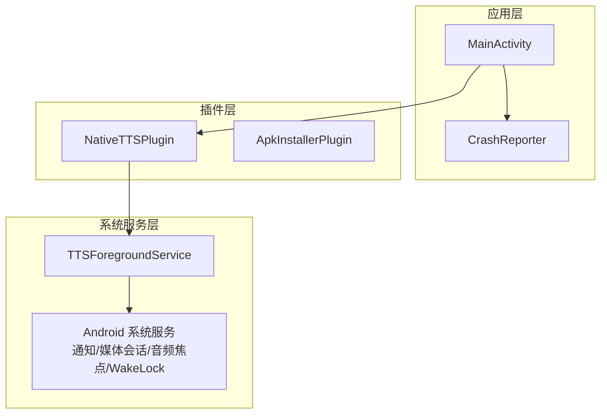
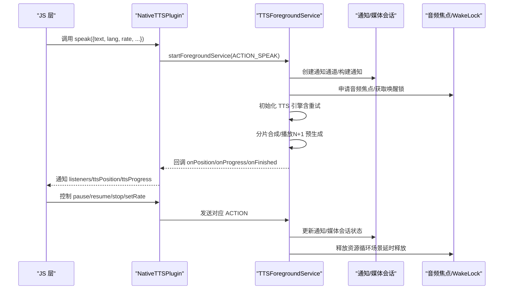
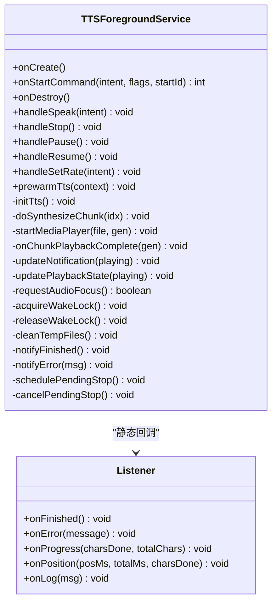
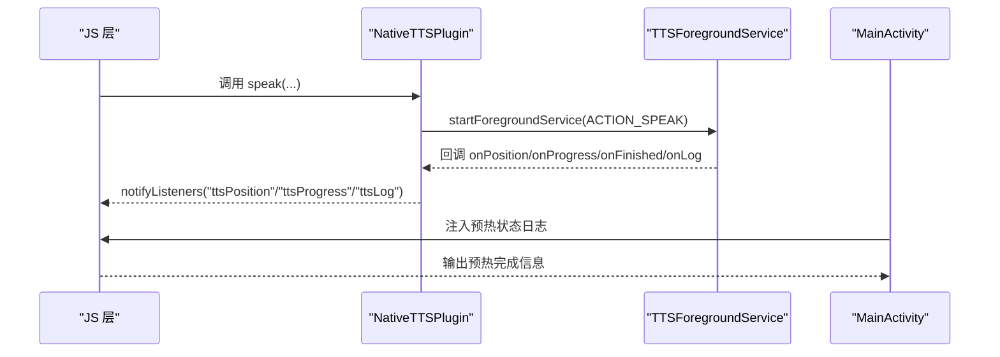
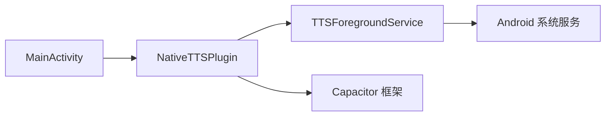

# 服务管理

<cite>
**本文档引用的文件**
- [TTSForegroundService.java](file://android/app/src/main/java/com/tehui/offline/TTSForegroundService.java)
- [NativeTTSPlugin.java](file://android/app/src/main/java/com/tehui/offline/NativeTTSPlugin.java)
- [MainActivity.java](file://android/app/src/main/java/com/tehui/offline/MainActivity.java)
- [AndroidManifest.xml](file://android/app/src/main/AndroidManifest.xml)
- [CrashReporter.java](file://android/app/src/main/java/com/tehui/offline/CrashReporter.java)
- [ApkInstallerPlugin.java](file://android/app/src/main/java/com/tehui/offline/ApkInstallerPlugin.java)
</cite>

## 更新摘要
**所做变更**
- 增强了 TTSForegroundService 的异常处理机制，新增了 try-catch 包装和详细的错误日志记录
- 改进了 handleSpeak 方法中的主动重新初始化机制，增强了服务在各种 Android 生命周期场景下的可靠性
- 优化了 initTts 方法中的详细日志记录功能，提供更好的诊断能力
- 完善了静态实例管理和 15 秒超时轮询机制的异常处理
- 增强了 MediaPlayer 和合成过程中的异常捕获和降级处理

## 目录
1. [简介](#简介)
2. [项目结构](#项目结构)
3. [核心组件](#核心组件)
4. [架构总览](#架构总览)
5. [详细组件分析](#详细组件分析)
6. [依赖关系分析](#依赖关系分析)
7. [性能考量](#性能考量)
8. [故障排查指南](#故障排查指南)
9. [结论](#结论)
10. [附录](#附录)

## 简介
本文件面向移动应用"服务管理"主题，围绕 Android 前台服务与启动画面两大模块展开，重点说明：
- TTSForegroundService 前台服务的生命周期、前台通知、TTS 状态管理与媒体会话集成
- SplashActivity 启动画面的启动流程、加载动画与页面跳转逻辑
- 服务与 Activity 之间的通信机制（通过 Capacitor 插件桥接、静态回调监听）
- 后台任务管理策略（任务调度、资源释放、内存与电量管理）
- 服务调试方法与性能监控技巧

## 项目结构
Android 应用基于 Capacitor 架构，Java/Kotlin 侧包含以下关键文件：
- MainActivity：Capacitor 桥接入口，注册插件、注入 JS 接口、触发启动画面
- TTSForegroundService：前台服务，负责 TTS 合成、播放、通知与媒体会话
- NativeTTSPlugin：Capacitor 插件，提供 JS API 与服务交互
- AndroidManifest：声明权限与组件导出
- CrashReporter：全局未捕获异常处理器，写入崩溃日志
- ApkInstallerPlugin：应用内安装 APK 的插件示例

**图表来源**
- [MainActivity.java:14-33](file://android/app/src/main/java/com/tehui/offline/MainActivity.java#L14-L33)
- [NativeTTSPlugin.java:25-291](file://android/app/src/main/java/com/tehui/offline/NativeTTSPlugin.java#L25-L291)
- [TTSForegroundService.java:48-121](file://android/app/src/main/java/com/tehui/offline/TTSForegroundService.java#L48-L121)

**章节来源**
- [MainActivity.java:14-33](file://android/app/src/main/java/com/tehui/offline/MainActivity.java#L14-L33)
- [AndroidManifest.xml:22-53](file://android/app/src/main/AndroidManifest.xml#L22-L53)

## 核心组件
- TTSForegroundService：前台服务，负责 TTS 合成与播放、通知、媒体会话、音频焦点与唤醒锁管理，并通过静态回调向 JS 上报进度与位置
- NativeTTSPlugin：Capacitor 插件，暴露 speak/stop/pause/resume/setRate 等方法，封装与服务的交互
- MainActivity：注册插件、注入 JS 接口、触发启动画面、设置状态栏样式
- AndroidManifest：声明前台服务权限、服务与组件导出
- CrashReporter：全局异常捕获，写入私有目录日志文件
- ApkInstallerPlugin：应用内安装 APK 的示例插件

**章节来源**
- [TTSForegroundService.java:48-121](file://android/app/src/main/java/com/tehui/offline/TTSForegroundService.java#L48-L121)
- [NativeTTSPlugin.java:25-291](file://android/app/src/main/java/com/tehui/offline/NativeTTSPlugin.java#L25-L291)
- [MainActivity.java:14-33](file://android/app/src/main/java/com/tehui/offline/MainActivity.java#L14-L33)
- [AndroidManifest.xml:7-14](file://android/app/src/main/AndroidManifest.xml#L7-L14)
- [CrashReporter.java:21-69](file://android/app/src/main/java/com/tehui/offline/CrashReporter.java#L21-L69)
- [ApkInstallerPlugin.java:14-68](file://android/app/src/main/java/com/tehui/offline/ApkInstallerPlugin.java#L14-L68)

## 架构总览
服务与界面的交互链路如下：
- JS 通过 Capacitor 调用 NativeTTSPlugin.speak
- 插件启动前台服务并注册静态回调 Listener
- 服务在 onCreate/onStartCommand 中建立通知、媒体会话与唤醒锁
- 服务内部通过 TTS 合成与 MediaPlayer 播放，周期性向 JS 上报位置
- 用户可在通知栏控制播放、暂停与停止
- MainActivity 注入 JS 接口，通知启动画面 WebView 就绪

**图表来源**
- [NativeTTSPlugin.java:32-116](file://android/app/src/main/java/com/tehui/offline/NativeTTSPlugin.java#L32-L116)
- [TTSForegroundService.java:160-207](file://android/app/src/main/java/com/tehui/offline/TTSForegroundService.java#L160-L207)
- [TTSForegroundService.java:407-445](file://android/app/src/main/java/com/tehui/offline/TTSForegroundService.java#L407-L445)
- [TTSForegroundService.java:1532-1561](file://android/app/src/main/java/com/tehui/offline/TTSForegroundService.java#L1532-L1561)

## 详细组件分析

### TTSForegroundService 前台服务
- 生命周期与前台通知
  - onCreate：初始化主线程与音频优先线程、创建通知通道、解码应用图标、获取唤醒锁、激活 MediaSession、尽早 startForeground
  - onStartCommand：统一在入口处 startForeground，根据 Action 分发 speak/stop/pause/resume/setRate
  - onDestroy：清理主线程与工作线程回调、释放 MediaPlayer、删除临时文件、释放唤醒锁与音频焦点、释放 MediaSession、关闭 TTS
- TTS 状态管理
  - 采用分片合成（CHUNK_SIZE）与 N+1 预生成，消除 chunk 间停顿
  - speakGen 代数防过期回调，确保并发 speak 时的幂等与一致性
  - setTtsParams：始终使用 1.0f 速率合成，通过 MediaPlayer PlaybackParams 实现变速不变调
  - 初始化重试：最多 MAX_TTS_RETRIES 次指数退避，失败后上报错误
- 静态实例管理与性能优化
  - 静态预热 TTS：MainActivity.onCreate() 调用 prewarmTts() 预热引擎，Service 启动时直接复用已就绪实例
  - 15 秒超时轮询：静态 TTS 实例就绪检查最多等待 15 秒，超时后回退到新建实例
  - 详细日志记录：通过 emitLog() 方法向 JS DevTools 输出诊断日志，包含初始化耗时、合成性能等信息
- 媒体会话与通知
  - MediaSession：声明媒体按钮与传输控制，提升存活率
  - 通知：MediaStyle + MediaSession token，包含播放/暂停/停止动作
  - 锁屏封面：使用应用图标作为大图
- 音频焦点与唤醒锁
  - requestAudioFocus：在不同 API 版本使用新旧接口
  - focus loss：区分用户暂停与系统失焦，后者可自动恢复
  - WakeLock：PARTIAL_WAKE_LOCK 保持 CPU 唤醒，避免息屏后回调被节流
- 进度与位置同步
  - startPositionBroadcast：每 100ms 向 JS 上报 posMs/totalMs
  - calculateChunkStartPositionMs：基于总时长与字符比例计算 chunk 起始位置，保证与 JS 侧 resume 百分比一致
- 循环播放与资源释放
  - loopEnabled：原生循环，不依赖 JS 往返，息屏后也可稳定运行
  - finishPlayback：非循环场景延时 2s 销毁服务，循环场景立即复用

**图表来源**
- [TTSForegroundService.java:48-121](file://android/app/src/main/java/com/tehui/offline/TTSForegroundService.java#L48-L121)
- [TTSForegroundService.java:160-207](file://android/app/src/main/java/com/tehui/offline/TTSForegroundService.java#L160-L207)
- [TTSForegroundService.java:209-304](file://android/app/src/main/java/com/tehui/offline/TTSForegroundService.java#L209-L304)
- [TTSForegroundService.java:858-890](file://android/app/src/main/java/com/tehui/offline/TTSForegroundService.java#L858-L890)
- [TTSForegroundService.java:1011-1033](file://android/app/src/main/java/com/tehui/offline/TTSForegroundService.java#L1011-L1033)
- [TTSForegroundService.java:1532-1576](file://android/app/src/main/java/com/tehui/offline/TTSForegroundService.java#L1532-L1576)

**章节来源**
- [TTSForegroundService.java:160-304](file://android/app/src/main/java/com/tehui/offline/TTSForegroundService.java#L160-L304)
- [TTSForegroundService.java:307-445](file://android/app/src/main/java/com/tehui/offline/TTSForegroundService.java#L307-L445)
- [TTSForegroundService.java:858-1148](file://android/app/src/main/java/com/tehui/offline/TTSForegroundService.java#L858-L1148)
- [TTSForegroundService.java:1276-1576](file://android/app/src/main/java/com/tehui/offline/TTSForegroundService.java#L1276-L1576)

### 初始化流程与静态实例管理
- 静态预热机制
  - MainActivity.onCreate() 调用 prewarmTts() 预热 TTS 引擎，避免后台启动时的初始化延迟
  - 预热实例存储在 sStaticTts 静态变量中，Service 启动时通过 initTts() 复用
  - 预热成功后设置 sStaticTtsReady 标志，供 Service 端轮询检查
- 15 秒超时轮询
  - Service 端通过轮询等待静态 TTS 实例就绪，最长等待 15 秒
  - 超时后自动回退到新建实例，确保服务可用性
  - 轮询间隔 200ms，避免过度占用 CPU 资源
- 性能监控与日志记录
  - emitLog() 方法向 JS DevTools 输出详细诊断信息
  - 记录初始化耗时、合成性能、播放延迟等关键指标
  - 支持 onLog 回调，便于前端调试和问题定位
- 错误处理增强
  - handleSpeak 方法中新增主动重新初始化机制，当 ttsReady 为 false 时自动调用 initTts()
  - initTts 方法中增加了详细的日志记录功能，提供更好的诊断能力
  - 支持在 ttsInitFailed 情况下重新初始化 TTS 引擎
  - 增强了异常处理机制，包括 try-catch 包装和详细的错误日志记录

**更新** 增强了错误处理和初始化逻辑，新增了 handleSpeak 方法中的主动重新初始化机制，以及 initTts 方法中的详细日志记录功能

**章节来源**
- [TTSForegroundService.java:97-112](file://android/app/src/main/java/com/tehui/offline/TTSForegroundService.java#L97-L112)
- [TTSForegroundService.java:218-268](file://android/app/src/main/java/com/tehui/offline/TTSForegroundService.java#L218-L268)
- [TTSForegroundService.java:271-313](file://android/app/src/main/java/com/tehui/offline/TTSForegroundService.java#L271-L313)
- [TTSForegroundService.java:73-77](file://android/app/src/main/java/com/tehui/offline/TTSForegroundService.java#L73-L77)
- [TTSForegroundService.java:633-650](file://android/app/src/main/java/com/tehui/offline/TTSForegroundService.java#L633-L650)

### NativeTTSPlugin 插件桥接
- API 方法
  - speak：启动前台服务并注册静态回调，支持文本、语言、速率、标题、艺术家等参数
  - stop/pause/resume：控制播放状态，通过发送对应 Action 实现
  - setRate：仅更新倍率，不中断播放
  - preSynthesize：页面加载时预合成首 chunk，加速首次播放响应
  - warmup：仅启动 Service 并初始化 TTS 引擎
- JS 通知
  - 通过 notifyListeners 上报 ttsProgress/ttsPosition/ttsLog 等事件
  - 支持 Promise 模式，speak 调用在播放结束后 resolve

**章节来源**
- [NativeTTSPlugin.java:32-116](file://android/app/src/main/java/com/tehui/offline/NativeTTSPlugin.java#L32-L116)
- [NativeTTSPlugin.java:193-201](file://android/app/src/main/java/com/tehui/offline/NativeTTSPlugin.java#L193-L201)
- [NativeTTSPlugin.java:163-188](file://android/app/src/main/java/com/tehui/offline/NativeTTSPlugin.java#L163-L188)
- [NativeTTSPlugin.java:147-157](file://android/app/src/main/java/com/tehui/offline/NativeTTSPlugin.java#L147-L157)

### MainActivity 启动流程
- 预热 TTS 引擎：在 Activity 创建时调用 prewarmTts()，确保用户交互上下文下的引擎就绪
- WebView 日志：通过 evaluateJavascript 向 DevTools 输出预热状态信息
- 插件注册：注册 NativeTTSPlugin 等自定义插件
- WebView 优化：设置背景色、硬件加速等，防止黑屏问题

**章节来源**
- [MainActivity.java:26-42](file://android/app/src/main/java/com/tehui/offline/MainActivity.java#L26-L42)
- [MainActivity.java:19-24](file://android/app/src/main/java/com/tehui/offline/MainActivity.java#L19-L24)

### 服务与 Activity 之间的通信机制
- 插件桥接
  - NativeTTSPlugin.speak：注册静态回调 Listener，启动前台服务并传递参数
  - 其他控制方法：stop/pause/resume/setRate 通过发送对应 Action 实现
- JS 通知
  - NativeTTSPlugin 在回调中通过 notifyListeners 上报 ttsProgress/ttsPosition/ttsLog
- 启动画面联动
  - MainActivity 注入 JS 接口，WebView 就绪后设置 SplashActivity.webViewReady，SplashActivity 检测后退出

**图表来源**
- [NativeTTSPlugin.java:57-97](file://android/app/src/main/java/com/tehui/offline/NativeTTSPlugin.java#L57-L97)
- [NativeTTSPlugin.java:90-96](file://android/app/src/main/java/com/tehui/offline/NativeTTSPlugin.java#L90-L96)
- [MainActivity.java:37-41](file://android/app/src/main/java/com/tehui/offline/MainActivity.java#L37-L41)

**章节来源**
- [NativeTTSPlugin.java:25-291](file://android/app/src/main/java/com/tehui/offline/NativeTTSPlugin.java#L25-L291)
- [MainActivity.java:26-42](file://android/app/src/main/java/com/tehui/offline/MainActivity.java#L26-L42)

### 后台任务管理策略
- 任务调度
  - HandlerThread（THREAD_PRIORITY_AUDIO）承载合成任务，避免主线程被 Doze 节流
  - ttsHandler.post 与 mainHandler.post 协同，保证回调线程一致性
- 资源释放
  - onDestroy：移除所有回调、释放 MediaPlayer、删除临时文件、释放 WakeLock 与音频焦点、释放 MediaSession、shutdown TTS
  - finishPlayback：非循环场景延时 2s 销毁服务，循环场景立即复用
- 内存与电量
  - WakeLock：PARTIAL_WAKE_LOCK，避免息屏后回调被挂起
  - 媒体会话：提升存活率，减少被系统回收概率
  - 电池优化：提供查询与引导忽略电池优化的方法（需声明权限）

**章节来源**
- [TTSForegroundService.java:160-207](file://android/app/src/main/java/com/tehui/offline/TTSForegroundService.java#L160-L207)
- [TTSForegroundService.java:451-477](file://android/app/src/main/java/com/tehui/offline/TTSForegroundService.java#L451-L477)
- [TTSForegroundService.java:1578-1597](file://android/app/src/main/java/com/tehui/offline/TTSForegroundService.java#L1578-L1597)
- [AndroidManifest.xml:13-14](file://android/app/src/main/AndroidManifest.xml#L13-L14)

### 异常处理与错误日志记录增强
- 异常处理机制
  - handleSpeak 方法中新增主动重新初始化机制，当 ttsReady 为 false 时自动调用 initTts()
  - initTts 方法中增加了详细的日志记录功能，提供更好的诊断能力
  - 支持在 ttsInitFailed 情况下重新初始化 TTS 引擎
  - 增强了 MediaPlayer 和合成过程中的异常捕获和降级处理
- 错误日志记录
  - emitLog() 方法向 JS DevTools 输出详细诊断信息
  - 记录初始化耗时、合成性能、播放延迟等关键指标
  - 支持 onLog 回调，便于前端调试和问题定位
- 详细日志记录功能
  - initTts 方法中记录静态 TTS 实例就绪情况和等待时间
  - handleSpeak 方法中记录播放准备时间和音频焦点申请结果
  - MediaPlayer start 失败时记录详细错误信息
  - 合成失败时记录失败次数和降级处理信息

**更新** 增强了异常处理机制，新增了 try-catch 包装和详细的错误日志记录功能

**章节来源**
- [TTSForegroundService.java:97-112](file://android/app/src/main/java/com/tehui/offline/TTSForegroundService.java#L97-L112)
- [TTSForegroundService.java:218-268](file://android/app/src/main/java/com/tehui/offline/TTSForegroundService.java#L218-L268)
- [TTSForegroundService.java:271-313](file://android/app/src/main/java/com/tehui/offline/TTSForegroundService.java#L271-L313)
- [TTSForegroundService.java:633-650](file://android/app/src/main/java/com/tehui/offline/TTSForegroundService.java#L633-L650)
- [TTSForegroundService.java:1158-1165](file://android/app/src/main/java/com/tehui/offline/TTSForegroundService.java#L1158-L1165)

## 依赖关系分析
- 组件耦合
  - NativeTTSPlugin 依赖 TTSForegroundService 的静态回调与 Action 常量
  - MainActivity 依赖 Capacitor Bridge 与 JS 接口，间接影响服务初始化
  - TTSForegroundService 依赖系统服务（通知、媒体会话、音频焦点、唤醒锁）
- 外部依赖
  - Capacitor 框架提供插件机制与 JS 桥接
  - Android 原生 API（TextToSpeech、MediaPlayer、MediaSession、AudioManager、Notification）

**图表来源**
- [NativeTTSPlugin.java:25-291](file://android/app/src/main/java/com/tehui/offline/NativeTTSPlugin.java#L25-L291)
- [TTSForegroundService.java:48-121](file://android/app/src/main/java/com/tehui/offline/TTSForegroundService.java#L48-L121)
- [MainActivity.java:14-33](file://android/app/src/main/java/com/tehui/offline/MainActivity.java#L14-L33)

**章节来源**
- [AndroidManifest.xml:44-48](file://android/app/src/main/AndroidManifest.xml#L44-L48)

## 性能考量
- 合成与播放
  - 分片大小（CHUNK_SIZE）与 N+1 预生成减少停顿，提升连续性
  - PlaybackParams 实现变速不变调，API 低于 23 的设备固定 1x 速率
- 线程模型
  - HandlerThread（THREAD_PRIORITY_AUDIO）避免主线程被 Doze 节流
  - mainHandler 与 ttsHandler 分工明确，避免阻塞
- 通知与媒体会话
  - MediaStyle + MediaSession token 提升存活率，减少被系统回收
- 电量与唤醒
  - WakeLock 保持 CPU 唤醒，配合音频焦点与媒体会话增强稳定性
- 进度上报
  - 每 100ms 上报一次位置，保证 UI 与媒体会话同步
- 静态实例优化
  - 预热 TTS 引擎避免初始化延迟，15 秒超时轮询确保服务可用性
  - 详细日志记录支持性能监控和问题诊断
- 错误处理增强
  - 主动重新初始化机制提高服务在各种 Android 生命周期场景下的可靠性
  - 详细的日志记录功能为调试和性能监控提供了有力支持
- 异常处理机制
  - 增强的 try-catch 包装确保异常不会导致服务崩溃
  - 详细的错误日志记录功能为问题诊断提供了完整信息
  - MediaPlayer 和合成过程中的异常捕获确保服务稳定性

**更新** 增强了错误处理和性能监控相关内容

**章节来源**
- [TTSForegroundService.java:82-89](file://android/app/src/main/java/com/tehui/offline/TTSForegroundService.java#L82-L89)
- [TTSForegroundService.java:106-121](file://android/app/src/main/java/com/tehui/offline/TTSForegroundService.java#L106-L121)
- [TTSForegroundService.java:218-268](file://android/app/src/main/java/com/tehui/offline/TTSForegroundService.java#L218-L268)
- [TTSForegroundService.java:73-77](file://android/app/src/main/java/com/tehui/offline/TTSForegroundService.java#L73-L77)
- [TTSForegroundService.java:633-650](file://android/app/src/main/java/com/tehui/offline/TTSForegroundService.java#L633-L650)

## 故障排查指南
- TTS 初始化失败
  - 现象：onError 回调，服务记录重试日志
  - 处理：检查系统 TTS 引擎、网络与权限；服务具备最多 3 次指数退避重试
  - 新增：支持在 ttsInitFailed 情况下重新初始化 TTS 引擎
- 静态实例超时
  - 现象：15 秒后自动回退到新建实例，emitLog 输出超时信息
  - 处理：检查预热流程，确认 MainActivity 预热是否成功执行
- 合成异常
  - 现象：UtteranceProgressListener.onError，删除临时文件并跳过当前 chunk
  - 处理：确认文本长度与分片边界；必要时降低速率或调整分片大小
- 播放异常
  - 现象：MediaPlayer.OnErrorListener，删除临时文件并跳过当前 chunk
  - 处理：检查文件存在性与长度；必要时重建 MediaPlayer
- 音频焦点冲突
  - 现象：requestAudioFocus 返回拒绝，服务降级继续播放
  - 处理：引导用户允许媒体焦点；在焦点归还时自动恢复
- 崩溃日志
  - 使用 CrashReporter 写入私有目录 crash_log.txt，供后续读取与分析
- 电池优化
  - 提供 isBatteryOptimizationIgnored 与 requestIgnoreBatteryOptimization 方法，引导用户加入白名单
- 错误处理增强
  - handleSpeak 方法中的主动重新初始化机制确保服务在各种 Android 生命周期场景下的可靠性
  - 详细的日志记录功能提供更好的诊断能力
  - 增强的异常处理机制确保服务稳定性

**更新** 新增静态实例超时和性能监控相关的故障排查内容，以及错误处理增强的相关内容

**章节来源**
- [TTSForegroundService.java:218-268](file://android/app/src/main/java/com/tehui/offline/TTSForegroundService.java#L218-L268)
- [TTSForegroundService.java:271-313](file://android/app/src/main/java/com/tehui/offline/TTSForegroundService.java#L271-L313)
- [TTSForegroundService.java:388-412](file://android/app/src/main/java/com/tehui/offline/TTSForegroundService.java#L388-L412)
- [TTSForegroundService.java:1122-1127](file://android/app/src/main/java/com/tehui/offline/TTSForegroundService.java#L1122-L1127)
- [CrashReporter.java:33-67](file://android/app/src/main/java/com/tehui/offline/CrashReporter.java#L33-67)

## 结论
本服务管理方案通过前台服务、媒体会话、音频焦点与唤醒锁组合，确保 TTS 在后台稳定运行；通过分片与预生成策略、精确的位置与进度上报，提供流畅的用户体验；通过插件桥接与启动画面联动，实现 JS 与原生层的高效协作。最新的优化包括静态实例管理和 15 秒超时轮询机制，显著提升了初始化性能和可靠性；详细的日志记录功能为调试和性能监控提供了有力支持。增强的错误处理机制进一步提高了服务在各种 Android 生命周期场景下的可靠性。建议在生产环境中关注电池优化与系统兼容性，结合日志与监控持续优化性能。

## 附录
- 权限与组件清单
  - 前台服务与媒体播放权限
  - WAKE_LOCK 与电池优化忽略权限
  - 服务与 Activity 声明
- 配置参考
  - Capacitor 配置（webDir 等）
  - 构建与资源生成配置

**章节来源**
- [AndroidManifest.xml:7-14](file://android/app/src/main/AndroidManifest.xml#L7-L14)
- [AndroidManifest.xml:44-48](file://android/app/src/main/AndroidManifest.xml#L44-L48)