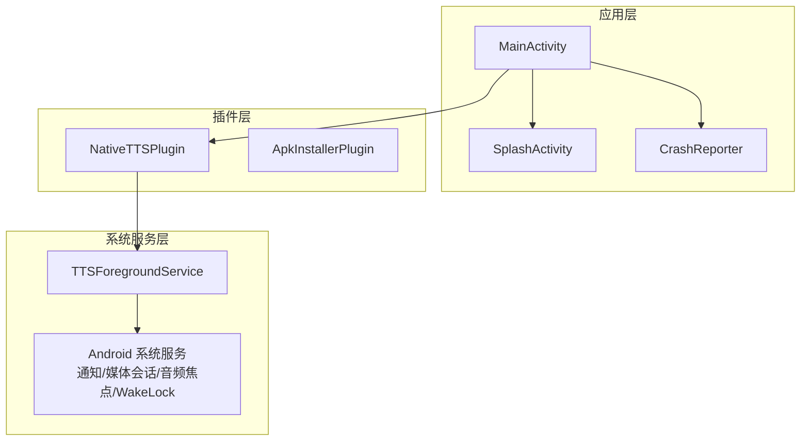
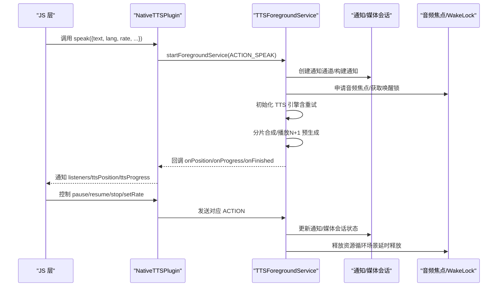
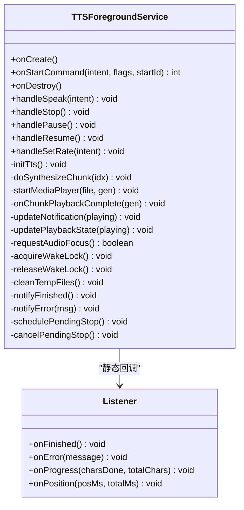
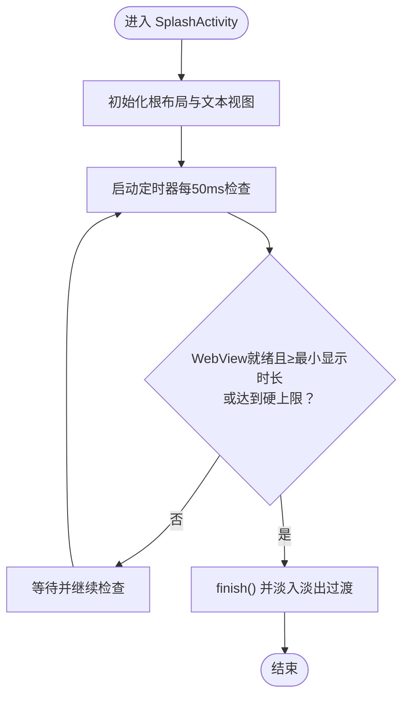
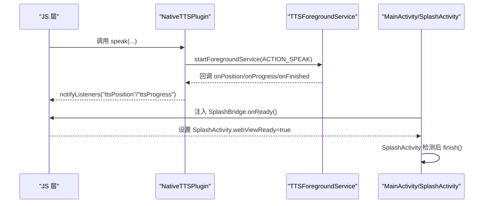
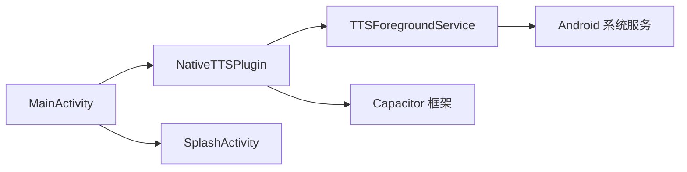

# 服务管理

<cite>
**本文引用的文件**
- [TTSForegroundService.java](file://android/app/src/main/java/com/tehui/offline/TTSForegroundService.java)
- [NativeTTSPlugin.java](file://android/app/src/main/java/com/tehui/offline/NativeTTSPlugin.java)
- [SplashActivity.java](file://android/app/src/main/java/com/tehui/offline/SplashActivity.java)
- [MainActivity.java](file://android/app/src/main/java/com/tehui/offline/MainActivity.java)
- [AndroidManifest.xml](file://android/app/src/main/AndroidManifest.xml)
- [CrashReporter.java](file://android/app/src/main/java/com/tehui/offline/CrashReporter.java)
- [ApkInstallerPlugin.java](file://android/app/src/main/java/com/tehui/offline/ApkInstallerPlugin.java)
- [capacitor.config.json](file://android/app/src/main/assets/capacitor.config.json)
- [config.yaml](file://config.yaml)
</cite>

## 目录
1. [简介](#简介)
2. [项目结构](#项目结构)
3. [核心组件](#核心组件)
4. [架构总览](#架构总览)
5. [详细组件分析](#详细组件分析)
6. [依赖关系分析](#依赖关系分析)
7. [性能考量](#性能考量)
8. [故障排查指南](#故障排查指南)
9. [结论](#结论)
10. [附录](#附录)

## 简介
本文件面向移动应用“服务管理”主题，围绕 Android 前台服务与启动画面两大模块展开，重点说明：
- TTSForegroundService 前台服务的生命周期、前台通知、TTS 状态管理与媒体会话集成
- SplashActivity 启动画面的启动流程、加载动画与页面跳转逻辑
- 服务与 Activity 之间的通信机制（通过 Capacitor 插件桥接、静态回调监听）
- 后台任务管理策略（任务调度、资源释放、内存与电量管理）
- 服务调试方法与性能监控技巧

## 项目结构
Android 应用基于 Capacitor 架构，Java/Kotlin 侧包含以下关键文件：
- MainActivity：Capacitor 桥接入口，注册插件、注入 JS 接口、触发启动画面
- SplashActivity：启动画面，覆盖 WebView 渲染前的空白期
- TTSForegroundService：前台服务，负责 TTS 合成、播放、通知与媒体会话
- NativeTTSPlugin：Capacitor 插件，提供 JS API 与服务交互
- AndroidManifest：声明权限与组件导出
- CrashReporter：全局未捕获异常处理器，写入崩溃日志
- ApkInstallerPlugin：应用内安装 APK 的插件示例
- assets/capacitor.config.json：Capacitor 配置
- config.yaml：构建与资源生成的通用配置

**图表来源**
- [MainActivity.java:12-61](file://android/app/src/main/java/com/tehui/offline/MainActivity.java#L12-L61)
- [SplashActivity.java:18-103](file://android/app/src/main/java/com/tehui/offline/SplashActivity.java#L18-L103)
- [NativeTTSPlugin.java:25-235](file://android/app/src/main/java/com/tehui/offline/NativeTTSPlugin.java#L25-L235)
- [TTSForegroundService.java:48-121](file://android/app/src/main/java/com/tehui/offline/TTSForegroundService.java#L48-L121)

**章节来源**
- [MainActivity.java:12-61](file://android/app/src/main/java/com/tehui/offline/MainActivity.java#L12-L61)
- [AndroidManifest.xml:22-59](file://android/app/src/main/AndroidManifest.xml#L22-L59)

## 核心组件
- TTSForegroundService：前台服务，负责 TTS 合成与播放、通知、媒体会话、音频焦点与唤醒锁管理，并通过静态回调向 JS 上报进度与位置
- NativeTTSPlugin：Capacitor 插件，暴露 speak/stop/pause/resume/setRate 等方法，封装与服务的交互
- SplashActivity：启动画面，等待 WebView 就绪后退出
- MainActivity：注册插件、注入 JS 接口、触发启动画面、设置状态栏样式
- AndroidManifest：声明前台服务权限、服务与组件导出
- CrashReporter：全局异常捕获，写入私有目录日志文件
- ApkInstallerPlugin：应用内安装 APK 的示例插件

**章节来源**
- [TTSForegroundService.java:48-121](file://android/app/src/main/java/com/tehui/offline/TTSForegroundService.java#L48-L121)
- [NativeTTSPlugin.java:25-235](file://android/app/src/main/java/com/tehui/offline/NativeTTSPlugin.java#L25-L235)
- [SplashActivity.java:18-103](file://android/app/src/main/java/com/tehui/offline/SplashActivity.java#L18-L103)
- [MainActivity.java:12-61](file://android/app/src/main/java/com/tehui/offline/MainActivity.java#L12-L61)
- [AndroidManifest.xml:7-14](file://android/app/src/main/AndroidManifest.xml#L7-L14)
- [CrashReporter.java:21-69](file://android/app/src/main/java/com/tehui/offline/CrashReporter.java#L21-L69)
- [ApkInstallerPlugin.java:14-68](file://android/app/src/main/java/com/tehui/offline/ApkInstallerPlugin.java#L14-L68)

## 架构总览
服务与界面的交互链路如下：
- JS 通过 Capacitor 调用 NativeTTSPlugin.speak
- 插件启动前台服务并注册静态回调 Listener
- 服务在 onCreate/onStartCommand 中建立通知、媒体会话与唤醒锁
- 服务内部通过 TTS 合成与 MediaPlayer 播放，周期性向 JS 上报位置
- 用户可在通知栏控制播放、暂停与停止
- MainActivity 注入 JS 接口，通知启动画面 WebView 就绪

**图表来源**
- [NativeTTSPlugin.java:32-106](file://android/app/src/main/java/com/tehui/offline/NativeTTSPlugin.java#L32-L106)
- [TTSForegroundService.java:127-173](file://android/app/src/main/java/com/tehui/offline/TTSForegroundService.java#L127-L173)
- [TTSForegroundService.java:276-302](file://android/app/src/main/java/com/tehui/offline/TTSForegroundService.java#L276-L302)
- [TTSForegroundService.java:847-992](file://android/app/src/main/java/com/tehui/offline/TTSForegroundService.java#L847-L992)
- [TTSForegroundService.java:998-1044](file://android/app/src/main/java/com/tehui/offline/TTSForegroundService.java#L998-L1044)
- [TTSForegroundService.java:1050-1060](file://android/app/src/main/java/com/tehui/offline/TTSForegroundService.java#L1050-L1060)

## 详细组件分析

### TTSForegroundService 前台服务
- 生命周期与前台通知
  - onCreate：初始化主线程与音频优先线程、创建通知通道、解码应用图标、获取唤醒锁、激活 MediaSession、尽早 startForeground
  - onStartCommand：统一在入口处 startForeground，根据 Action 分发 speak/stop/pause/resume/setRate
  - onDestroy：清理主线程与工作线程回调、释放 MediaPlayer、删除临时文件、释放唤醒锁与音频焦点、释放 MediaSession、关闭 TTS
- TTS 状态管理
  - 采用分片合成（CHUNK_SIZE）与 N+1 预生成，消除 chunk 间停顿
  - speakGen 代数防过期回调，确保并发 speak 时的幂等与一致性
  - setTtsParams：始终使用 1.0f 速率合成，通过 MediaPlayer PlaybackParams 实现变速不变调
  - 初始化重试：最多 MAX_TTS_RETRIES 次指数退避，失败后上报错误
- 媒体会话与通知
  - MediaSession：声明媒体按钮与传输控制，提升存活率
  - 通知：MediaStyle + MediaSession token，包含播放/暂停/停止动作
  - 锁屏封面：使用应用图标作为大图
- 音频焦点与唤醒锁
  - requestAudioFocus：在不同 API 版本使用新旧接口
  - focus loss：区分用户暂停与系统失焦，后者可自动恢复
  - WakeLock：PARTIAL_WAKE_LOCK 保持 CPU 唤醒，避免息屏后回调被节流
- 进度与位置同步
  - startPositionBroadcast：每 100ms 向 JS 上报 posMs/totalMs
  - calculateChunkStartPositionMs：基于总时长与字符比例计算 chunk 起始位置，保证与 JS 侧 resume 百分比一致
- 循环播放与资源释放
  - loopEnabled：原生循环，不依赖 JS 往返，息屏后也可稳定运行
  - finishPlayback：非循环场景延时 2s 销毁服务，循环场景立即复用

**图表来源**
- [TTSForegroundService.java:48-121](file://android/app/src/main/java/com/tehui/offline/TTSForegroundService.java#L48-L121)
- [TTSForegroundService.java:175-212](file://android/app/src/main/java/com/tehui/offline/TTSForegroundService.java#L175-L212)
- [TTSForegroundService.java:340-427](file://android/app/src/main/java/com/tehui/offline/TTSForegroundService.java#L340-L427)
- [TTSForegroundService.java:448-535](file://android/app/src/main/java/com/tehui/offline/TTSForegroundService.java#L448-L535)
- [TTSForegroundService.java:586-631](file://android/app/src/main/java/com/tehui/offline/TTSForegroundService.java#L586-L631)
- [TTSForegroundService.java:667-739](file://android/app/src/main/java/com/tehui/offline/TTSForegroundService.java#L667-L739)
- [TTSForegroundService.java:745-789](file://android/app/src/main/java/com/tehui/offline/TTSForegroundService.java#L745-L789)
- [TTSForegroundService.java:858-887](file://android/app/src/main/java/com/tehui/offline/TTSForegroundService.java#L858-L887)
- [TTSForegroundService.java:926-992](file://android/app/src/main/java/com/tehui/offline/TTSForegroundService.java#L926-L992)
- [TTSForegroundService.java:998-1044](file://android/app/src/main/java/com/tehui/offline/TTSForegroundService.java#L998-L1044)
- [TTSForegroundService.java:1050-1060](file://android/app/src/main/java/com/tehui/offline/TTSForegroundService.java#L1050-L1060)
- [TTSForegroundService.java:1066-1138](file://android/app/src/main/java/com/tehui/offline/TTSForegroundService.java#L1066-L1138)

**章节来源**
- [TTSForegroundService.java:127-334](file://android/app/src/main/java/com/tehui/offline/TTSForegroundService.java#L127-L334)
- [TTSForegroundService.java:340-535](file://android/app/src/main/java/com/tehui/offline/TTSForegroundService.java#L340-L535)
- [TTSForegroundService.java:586-789](file://android/app/src/main/java/com/tehui/offline/TTSForegroundService.java#L586-L789)
- [TTSForegroundService.java:847-992](file://android/app/src/main/java/com/tehui/offline/TTSForegroundService.java#L847-L992)
- [TTSForegroundService.java:998-1060](file://android/app/src/main/java/com/tehui/offline/TTSForegroundService.java#L998-L1060)
- [TTSForegroundService.java:1066-1138](file://android/app/src/main/java/com/tehui/offline/TTSForegroundService.java#L1066-L1138)

### SplashActivity 启动画面
- 启动流程
  - onCreate：创建根布局，设置居中、背景色与内边距
  - 显示经文引用与正文，设置字体、字号、字距与行间距
  - 使用 Handler 每 50ms 检查 WebView 就绪标志与最小显示时长
  - 达到条件后 dismissSplash：finish 并使用淡入淡出过渡
- 页面跳转
  - MainActivity 在首次启动时先启动 SplashActivity，随后 WebView 就绪后通过 JS 接口通知 SplashActivity 退出

**图表来源**
- [SplashActivity.java:34-89](file://android/app/src/main/java/com/tehui/offline/SplashActivity.java#L34-L89)
- [SplashActivity.java:91-102](file://android/app/src/main/java/com/tehui/offline/SplashActivity.java#L91-L102)
- [MainActivity.java:25-37](file://android/app/src/main/java/com/tehui/offline/MainActivity.java#L25-L37)

**章节来源**
- [SplashActivity.java:18-103](file://android/app/src/main/java/com/tehui/offline/SplashActivity.java#L18-L103)
- [MainActivity.java:25-37](file://android/app/src/main/java/com/tehui/offline/MainActivity.java#L25-L37)

### 服务与 Activity 之间的通信机制
- 插件桥接
  - NativeTTSPlugin.speak：注册静态回调 Listener，启动前台服务并传递参数
  - 其他控制方法：stop/pause/resume/setRate 通过发送对应 Action 实现
- JS 通知
  - NativeTTSPlugin 在回调中通过 notifyListeners 上报 ttsProgress/ttsPosition
- 启动画面联动
  - MainActivity 注入 JS 接口，WebView 就绪后设置 SplashActivity.webViewReady，SplashActivity 检测后退出

**图表来源**
- [NativeTTSPlugin.java:32-106](file://android/app/src/main/java/com/tehui/offline/NativeTTSPlugin.java#L32-L106)
- [NativeTTSPlugin.java:191-195](file://android/app/src/main/java/com/tehui/offline/NativeTTSPlugin.java#L191-L195)
- [MainActivity.java:25-31](file://android/app/src/main/java/com/tehui/offline/MainActivity.java#L25-L31)
- [SplashActivity.java:76-88](file://android/app/src/main/java/com/tehui/offline/SplashActivity.java#L76-L88)

**章节来源**
- [NativeTTSPlugin.java:25-235](file://android/app/src/main/java/com/tehui/offline/NativeTTSPlugin.java#L25-L235)
- [MainActivity.java:25-31](file://android/app/src/main/java/com/tehui/offline/MainActivity.java#L25-L31)
- [SplashActivity.java:73-88](file://android/app/src/main/java/com/tehui/offline/SplashActivity.java#L73-L88)

### 后台任务管理策略
- 任务调度
  - HandlerThread（THREAD_PRIORITY_AUDIO）承载合成任务，避免主线程被 Doze 节流
  - ttsHandler.post 与 mainHandler.post 协同，保证回调线程一致性
- 资源释放
  - onDestroy：移除所有回调、释放 MediaPlayer、删除临时文件、释放 WakeLock 与音频焦点、释放 MediaSession、shutdown TTS
  - finishPlayback：非循环场景延时 2s 销毁服务，循环场景立即复用
- 内存与电量
  - WakeLock：PARTIAL_WAKE_LOCK，避免息屏后回调被挂起
  - 媒体会话：提升存活率，减少被系统回收概率
  - 电池优化：提供查询与引导忽略电池优化的方法（需声明权限）

**章节来源**
- [TTSForegroundService.java:127-173](file://android/app/src/main/java/com/tehui/offline/TTSForegroundService.java#L127-L173)
- [TTSForegroundService.java:307-334](file://android/app/src/main/java/com/tehui/offline/TTSForegroundService.java#L307-L334)
- [TTSForegroundService.java:1066-1138](file://android/app/src/main/java/com/tehui/offline/TTSForegroundService.java#L1066-L1138)
- [TTSForegroundService.java:1050-1060](file://android/app/src/main/java/com/tehui/offline/TTSForegroundService.java#L1050-L1060)
- [AndroidManifest.xml:13-14](file://android/app/src/main/AndroidManifest.xml#L13-L14)

## 依赖关系分析
- 组件耦合
  - NativeTTSPlugin 依赖 TTSForegroundService 的静态回调与 Action 常量
  - MainActivity 依赖 Capacitor Bridge 与 JS 接口，间接影响 SplashActivity 生命周期
  - TTSForegroundService 依赖系统服务（通知、媒体会话、音频焦点、唤醒锁）
- 外部依赖
  - Capacitor 框架提供插件机制与 JS 桥接
  - Android 原生 API（TextToSpeech、MediaPlayer、MediaSession、AudioManager、Notification）

**图表来源**
- [NativeTTSPlugin.java:25-235](file://android/app/src/main/java/com/tehui/offline/NativeTTSPlugin.java#L25-L235)
- [TTSForegroundService.java:48-121](file://android/app/src/main/java/com/tehui/offline/TTSForegroundService.java#L48-L121)
- [MainActivity.java:12-61](file://android/app/src/main/java/com/tehui/offline/MainActivity.java#L12-L61)
- [SplashActivity.java:18-103](file://android/app/src/main/java/com/tehui/offline/SplashActivity.java#L18-L103)

**章节来源**
- [AndroidManifest.xml:51-55](file://android/app/src/main/AndroidManifest.xml#L51-L55)
- [capacitor.config.json:1-10](file://android/app/src/main/assets/capacitor.config.json#L1-L10)

## 性能考量
- 合成与播放
  - 分片大小（CHUNK_SIZE）与 N+1 预生成减少停顿，提升连续性
  - PlaybackParams 实现变速不变调，API 低于 23 的设备固定 1x 速率
- 线程模型
  - HandlerThread（THREAD_PRIORITY_AUDIO）避免主线程被 Doze 节流
  - mainHandler 与 ttsHandler 分工明确，避免阻塞
- 通知与媒体会话
  - MediaStyle + MediaSession token 提升存活率，减少被系统回收
- 电量与唤醒
  - WakeLock 保持 CPU 唤醒，配合音频焦点与媒体会话增强稳定性
- 进度上报
  - 每 100ms 上报一次位置，保证 UI 与媒体会话同步

**章节来源**
- [TTSForegroundService.java:71-78](file://android/app/src/main/java/com/tehui/offline/TTSForegroundService.java#L71-L78)
- [TTSForegroundService.java:118-121](file://android/app/src/main/java/com/tehui/offline/TTSForegroundService.java#L118-L121)
- [TTSForegroundService.java:633-654](file://android/app/src/main/java/com/tehui/offline/TTSForegroundService.java#L633-L654)
- [TTSForegroundService.java:858-887](file://android/app/src/main/java/com/tehui/offline/TTSForegroundService.java#L858-L887)
- [TTSForegroundService.java:1050-1060](file://android/app/src/main/java/com/tehui/offline/TTSForegroundService.java#L1050-L1060)

## 故障排查指南
- TTS 初始化失败
  - 现象：onError 回调，服务记录重试日志
  - 处理：检查系统 TTS 引擎、网络与权限；服务具备最多 3 次指数退避重试
- 合成异常
  - 现象：UtteranceProgressListener.onError，删除临时文件并跳过当前 chunk
  - 处理：确认文本长度与分片边界；必要时降低速率或调整分片大小
- 播放异常
  - 现象：MediaPlayer.OnErrorListener，删除临时文件并跳过当前 chunk
  - 处理：检查文件存在性与长度；必要时重建 MediaPlayer
- 音频焦点冲突
  - 现象：requestAudioFocus 返回拒绝，服务降级继续播放
  - 处理：引导用户允许媒体焦点；在焦点归还时自动恢复
- 崩溃日志
  - 使用 CrashReporter 写入私有目录 crash_log.txt，供后续读取与分析
- 电池优化
  - 提供 isBatteryOptimizationIgnored 与 requestIgnoreBatteryOptimization 方法，引导用户加入白名单

**章节来源**
- [TTSForegroundService.java:175-212](file://android/app/src/main/java/com/tehui/offline/TTSForegroundService.java#L175-L212)
- [TTSForegroundService.java:257-273](file://android/app/src/main/java/com/tehui/offline/TTSForegroundService.java#L257-L273)
- [TTSForegroundService.java:702-707](file://android/app/src/main/java/com/tehui/offline/TTSForegroundService.java#L702-L707)
- [TTSForegroundService.java:998-1044](file://android/app/src/main/java/com/tehui/offline/TTSForegroundService.java#L998-L1044)
- [CrashReporter.java:33-67](file://android/app/src/main/java/com/tehui/offline/CrashReporter.java#L33-L67)
- [NativeTTSPlugin.java:149-188](file://android/app/src/main/java/com/tehui/offline/NativeTTSPlugin.java#L149-L188)

## 结论
本服务管理方案通过前台服务、媒体会话、音频焦点与唤醒锁组合，确保 TTS 在后台稳定运行；通过分片与预生成策略、精确的位置与进度上报，提供流畅的用户体验；通过插件桥接与启动画面联动，实现 JS 与原生层的高效协作。建议在生产环境中关注电池优化与系统兼容性，结合日志与监控持续优化性能。

## 附录
- 权限与组件清单
  - 前台服务与媒体播放权限
  - WAKE_LOCK 与电池优化忽略权限
  - 服务与 Activity 声明
- 配置参考
  - Capacitor 配置（webDir 等）
  - 构建与资源生成配置

**章节来源**
- [AndroidManifest.xml:7-14](file://android/app/src/main/AndroidManifest.xml#L7-L14)
- [AndroidManifest.xml:51-55](file://android/app/src/main/AndroidManifest.xml#L51-L55)
- [capacitor.config.json:1-10](file://android/app/src/main/assets/capacitor.config.json#L1-L10)
- [config.yaml:1-42](file://config.yaml#L1-L42)