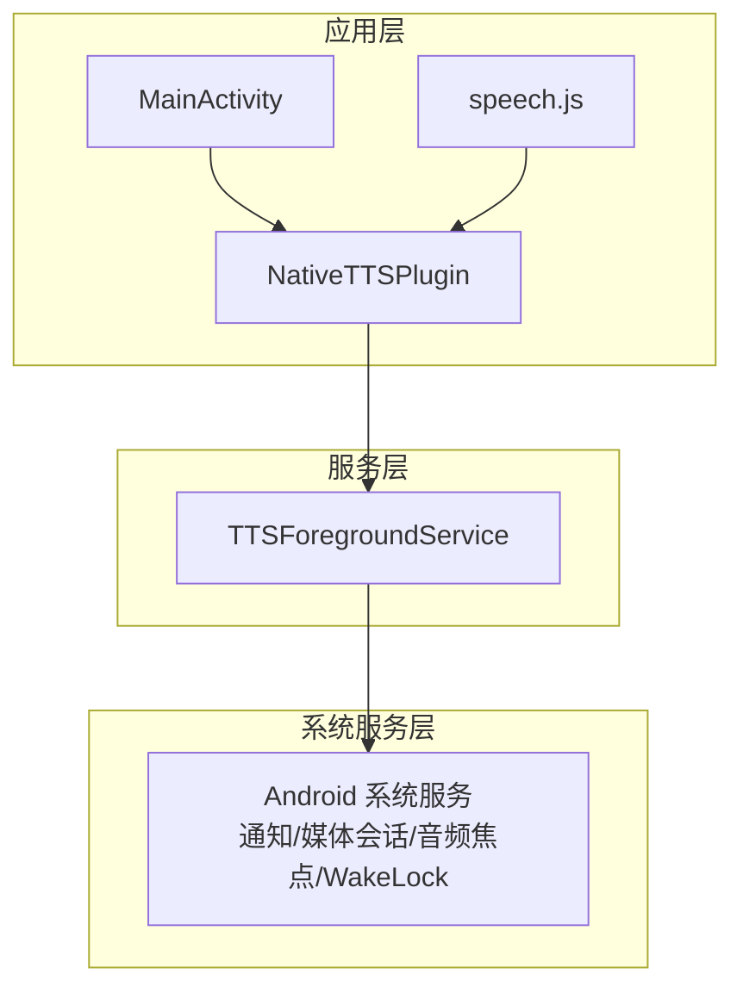
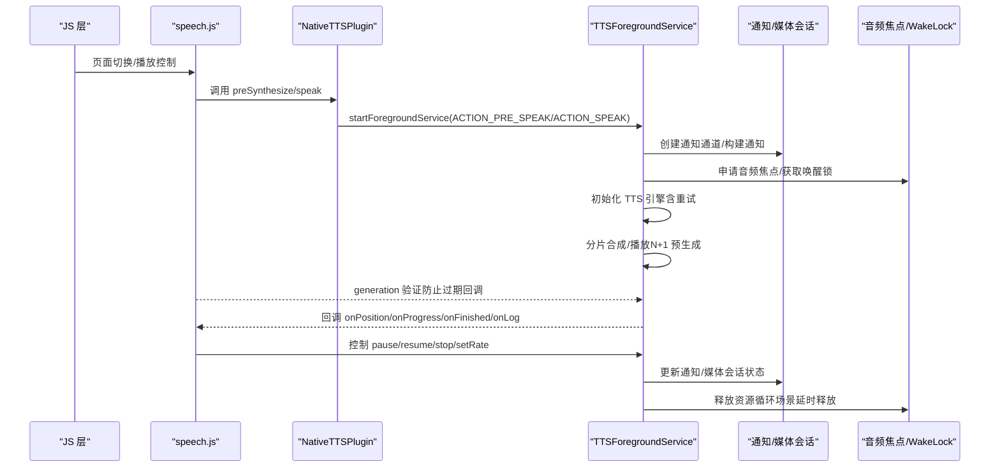
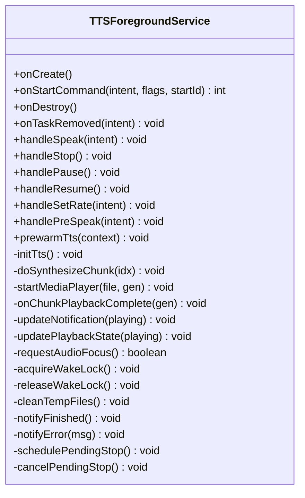
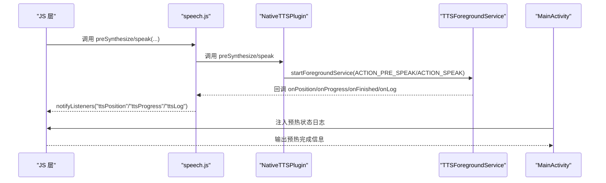
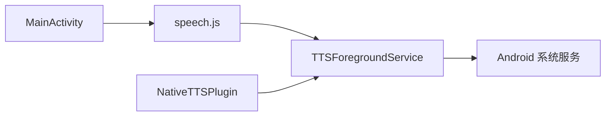

# 服务管理

<cite>
**本文档引用的文件**
- [TTSForegroundService.java](file://android/app/src/main/java/com/tehui/offline/TTSForegroundService.java)
- [MainActivity.java](file://android/app/src/main/java/com/tehui/offline/MainActivity.java)
- [speech.js](file://src/static/js/speech.js)
- [NativeTTSPlugin.java](file://android/app/src/main/java/com/tehui/offline/NativeTTSPlugin.java)
</cite>

## 更新摘要
**所做变更**
- 完善onDestroy方法中的资源清理逻辑：改进了TTS引擎状态管理，确保在不同TTS模式下正确清理资源，防止引擎进入异常状态
- 优化静态实例管理：在onDestroy中保留sStaticTts实例供Service重建后复用，避免重新绑定系统TTS服务的开销
- 增强页面切换引擎清理：在handlePreSpeak中增加80ms延迟，确保引擎完全重置
- 改进合成阻塞处理：优化对合成被引擎静默丢弃或阻塞的检测和恢复机制
- 更新延迟合成策略：优化预合成超时保底机制和页面切换时的竞争问题处理

## 目录
1. [简介](#简介)
2. [项目结构](#项目结构)
3. [核心组件](#核心组件)
4. [架构总览](#架构总览)
5. [详细组件分析](#详细组件分析)
6. [依赖关系分析](#依赖关系分析)
7. [性能考量](#性能考量)
8. [故障排查指南](#故障排查指南)
9. [结论](#结论)
10. [附录](#附录)

## 简介
本文件面向移动应用"服务管理"主题，围绕 Android 前台服务与启动画面两大模块展开，重点说明：
- TTSForegroundService 前台服务的生命周期、前台通知、TTS 状态管理与媒体会话集成
- SplashActivity 启动画面的启动流程、加载动画与页面跳转逻辑
- 服务与 Activity 之间的通信机制（通过 Capacitor 插件桥接、静态回调监听）
- 后台任务管理策略（任务调度、资源释放、内存与电量管理）
- 服务调试方法与性能监控技巧

## 项目结构
Android 应用基于 Capacitor 架构，Java/Kotlin 侧包含以下关键文件：
- MainActivity：Capacitor 桥接入口，注册插件、注入 JS 接口、触发启动画面
- TTSForegroundService：前台服务，负责 TTS 合成、播放、通知与媒体会话
- speech.js：前端语音合成控制逻辑，处理页面切换与播放状态同步
- NativeTTSPlugin：Capacitor 插件，提供 JS 与原生服务的桥接接口

**图表来源**
- [MainActivity.java:13-83](file://android/app/src/main/java/com/tehui/offline/MainActivity.java#L13-L83)
- [TTSForegroundService.java:48-121](file://android/app/src/main/java/com/tehui/offline/TTSForegroundService.java#L48-L121)
- [speech.js:538-914](file://src/static/js/speech.js#L538-L914)
- [NativeTTSPlugin.java:24-306](file://android/app/src/main/java/com/tehui/offline/NativeTTSPlugin.java#L24-L306)

**章节来源**
- [MainActivity.java:13-83](file://android/app/src/main/java/com/tehui/offline/MainActivity.java#L13-L83)
- [TTSForegroundService.java:48-121](file://android/app/src/main/java/com/tehui/offline/TTSForegroundService.java#L48-L121)
- [NativeTTSPlugin.java:24-306](file://android/app/src/main/java/com/tehui/offline/NativeTTSPlugin.java#L24-L306)

## 核心组件
- TTSForegroundService：前台服务，负责 TTS 合成与播放、通知、媒体会话、音频焦点与唤醒锁管理，并通过静态回调向 JS 上报进度与位置
- MainActivity：注册插件、注入 JS 接口、触发启动画面、设置状态栏样式
- speech.js：前端语音合成控制逻辑，处理页面切换与播放状态同步，包含 generation 管理机制
- NativeTTSPlugin：Capacitor 插件，提供 JS 与原生服务的桥接接口，支持 speak、stop、pause、resume、preSynthesize 等操作

**章节来源**
- [TTSForegroundService.java:48-121](file://android/app/src/main/java/com/tehui/offline/TTSForegroundService.java#L48-L121)
- [MainActivity.java:13-83](file://android/app/src/main/java/com/tehui/offline/MainActivity.java#L13-L83)
- [speech.js:538-914](file://src/static/js/speech.js#L538-L914)
- [NativeTTSPlugin.java:24-306](file://android/app/src/main/java/com/tehui/offline/NativeTTSPlugin.java#L24-L306)

## 架构总览
服务与界面的交互链路如下：
- JS 通过 Capacitor 调用 NativeTTSPlugin.speak
- 插件启动前台服务并注册静态回调 Listener
- 服务在 onCreate/onStartCommand 中建立通知、媒体会话与唤醒锁
- 服务内部通过 TTS 合成与 MediaPlayer 播放，周期性向 JS 上报位置
- 用户可在通知栏控制播放、暂停与停止
- MainActivity 注入 JS 接口，通知启动画面 WebView 就绪
- speech.js 管理 generation 状态，防止过期回调影响播放

**图表来源**
- [TTSForegroundService.java:529-717](file://android/app/src/main/java/com/tehui/offline/TTSForegroundService.java#L529-L717)
- [TTSForegroundService.java:724-783](file://android/app/src/main/java/com/tehui/offline/TTSForegroundService.java#L724-L783)
- [speech.js:768-805](file://src/static/js/speech.js#L768-L805)
- [NativeTTSPlugin.java:32-116](file://android/app/src/main/java/com/tehui/offline/NativeTTSPlugin.java#L32-L116)

## 详细组件分析

### TTSForegroundService 前台服务
- 生命周期与前台通知
  - onCreate：初始化主线程与音频优先线程、创建通知通道、解码应用图标、获取唤醒锁、激活 MediaSession、尽早 startForeground
  - onStartCommand：统一在入口处 startForeground，根据 Action 分发 speak/stop/pause/resume/setRate/preSynthesize/warmup
  - onDestroy：清理主线程与工作线程回调、释放 MediaPlayer、删除临时文件、释放唤醒锁与音频焦点、释放 MediaSession、关闭 TTS
  - onTaskRemoved：用户从最近任务列表划掉应用时，完全停止朗读并立即销毁服务
- TTS 状态管理
  - 采用分片合成（CHUNK_SIZE）与 N+1 预生成，消除 chunk 间停顿
  - speakGen 代数防过期回调，确保并发 speak 时的幂等与一致性
  - setTtsParams：始终使用 1.0f 速率合成，通过 MediaPlayer PlaybackParams 实现变速不变调
  - 初始化重试：最多 MAX_TTS_RETRIES 次指数退避，失败后上报错误
- 静态实例管理与性能优化
  - 静态预热 TTS：MainActivity.onCreate() 调用 prewarmTts() 预热引擎，Service 启动时直接复用已就绪实例
  - 15 秒超时轮询：静态 TTS 实例就绪检查最多等待 15 秒，超时后回退到新建实例
  - 详细日志记录：通过 emitLog() 方法向 JS DevTools 输出诊断日志，包含初始化耗时、合成性能等信息
- 媒体会话与通知
  - MediaSession：声明媒体按钮与传输控制，提升存活率
  - 通知：MediaStyle + MediaSession token，包含播放/暂停/停止动作
  - 锁屏封面：使用应用图标作为大图
- 音频焦点与唤醒锁
  - requestAudioFocus：在不同 API 版本使用新旧接口
  - focus loss：区分用户暂停与系统失焦，后者可自动恢复
  - WakeLock：PARTIAL_WAKE_LOCK 保持 CPU 唤醒，避免息屏后回调被节流
- 进度与位置同步
  - startPositionBroadcast：每 50ms 向 JS 上报 posMs/totalMs
  - calculateChunkStartPositionMs：基于总时长与字符比例计算 chunk 起始位置，保证与 JS 侧 resume 百分比一致
- 循环播放与资源释放
  - loopEnabled：原生循环，不依赖 JS 往返，息屏后也可稳定运行
  - finishPlayback：非循环场景延时 2s 销毁服务，循环场景立即复用
- 延迟合成逻辑优化
  - 预合成超时保底机制：handleSpeak 中添加 4 秒超时检测，避免合成被引擎静默丢弃
  - 50 毫秒延迟策略：handlePreSpeak 中添加 50ms 延迟，解决页面切换时 tts.stop() 与 synthesizeToFile 的竞争问题
  - speakGen 验证：通过 generation 检查防止过期回调影响当前播放状态

**图表来源**
- [TTSForegroundService.java:48-121](file://android/app/src/main/java/com/tehui/offline/TTSForegroundService.java#L48-L121)
- [TTSForegroundService.java:529-717](file://android/app/src/main/java/com/tehui/offline/TTSForegroundService.java#L529-L717)
- [TTSForegroundService.java:724-783](file://android/app/src/main/java/com/tehui/offline/TTSForegroundService.java#L724-L783)

**章节来源**
- [TTSForegroundService.java:529-717](file://android/app/src/main/java/com/tehui/offline/TTSForegroundService.java#L529-L717)
- [TTSForegroundService.java:724-783](file://android/app/src/main/java/com/tehui/offline/TTSForegroundService.java#L724-L783)
- [TTSForegroundService.java:1000-1053](file://android/app/src/main/java/com/tehui/offline/TTSForegroundService.java#L1000-L1053)

### TTS服务cleanup逻辑改进
**更新** 完善了onDestroy方法中的资源清理逻辑，确保在不同TTS模式下正确管理TTS引擎状态

- **onDestroy方法中的资源清理优化**
  - 保留sStaticTts实例：在onDestroy中不关闭静态实例sStaticTts，而是仅当不是静态实例时才shutdown，这样可以保留sStaticTts供Service重建后复用
  - 避免重复绑定开销：通过保留静态实例，省去重新绑定系统TTS服务的耗时（3-8秒）
  - 完善的清理顺序：先清理回调和MediaPlayer，再释放WakeLock和音频焦点，最后处理TTS实例
  - 静态实例复用：sStaticTtsReady标志确保后续Service可以直接复用已就绪的静态实例

- **页面切换引擎清理改进**
  - 在handlePreSpeak中增加80ms延迟，确保引擎完全重置
  - 与handleSpeak正常路径保持一致的清理模式
  - 通过ttsHandler线程上的重新stop() + 等待80ms确保引擎状态干净
  - 防止页面切换时tts.stop()与synthesizeToFile的竞争问题

- **合成阻塞处理增强**
  - 通过synthForChunk状态检查判断合成是否真正完成
  - 在超时情况下取消合成并重新启动，避免无限等待
  - 增加generation验证防止过期回调影响当前播放状态

**章节来源**
- [TTSForegroundService.java:480-511](file://android/app/src/main/java/com/tehui/offline/TTSForegroundService.java#L480-L511)
- [TTSForegroundService.java:770-780](file://android/app/src/main/java/com/tehui/offline/TTSForegroundService.java#L770-L780)
- [TTSForegroundService.java:771-785](file://android/app/src/main/java/com/tehui/offline/TTSForegroundService.java#L771-L785)

### generation 管理机制
- generation 系统
  - speakGen 作为 generation counter，确保并发 speak 时的幂等与一致性
  - 在 handleSpeak 中递增 speakGen，防止过期回调影响当前播放
  - 在循环播放中立即递增 generation，使所有旧回调失效
- 回调验证
  - 在 UtteranceProgressListener 中验证 parseGen(uid) 是否等于 speakGen
  - 预合成模式下 isPreSynthesis=true 时跳过 isStopped 检查
  - 通过 generation 验证防止页面切换时的回调冲突

**章节来源**
- [TTSForegroundService.java:119](file://android/app/src/main/java/com/tehui/offline/TTSForegroundService.java#L119)
- [TTSForegroundService.java:361-367](file://android/app/src/main/java/com/tehui/offline/TTSForegroundService.java#L361-L367)
- [speech.js:570-575](file://src/static/js/speech.js#L570-L575)

### MainActivity 启动流程
- 预热 TTS 引擎：在 Activity 创建时调用 prewarmTts()，确保用户交互上下文下的引擎就绪
- WebView 日志：通过 evaluateJavascript 向 DevTools 输出预热状态信息
- 插件注册：注册 NativeTTSPlugin 等自定义插件
- WebView 优化：设置背景色、硬件加速等，防止黑屏问题

**章节来源**
- [MainActivity.java:25-27](file://android/app/src/main/java/com/tehui/offline/MainActivity.java#L25-L27)

### 服务与 Activity 之间的通信机制
- 插件桥接
  - NativeTTSPlugin.speak：注册静态回调 Listener，启动前台服务并传递参数
  - 其他控制方法：stop/pause/resume/setRate/preSynthesize/warmup 通过发送对应 Action 实现
- JS 通知
  - NativeTTSPlugin 在回调中通过 notifyListeners 上报 ttsProgress/ttsPosition/ttsLog
- 启动画面联动
  - MainActivity 注入 JS 接口，WebView 就绪后设置 SplashActivity.webViewReady，SplashActivity 检测后退出

**图表来源**
- [TTSForegroundService.java:529-717](file://android/app/src/main/java/com/tehui/offline/TTSForegroundService.java#L529-L717)
- [NativeTTSPlugin.java:32-116](file://android/app/src/main/java/com/tehui/offline/NativeTTSPlugin.java#L32-L116)

**章节来源**
- [TTSForegroundService.java:529-717](file://android/app/src/main/java/com/tehui/offline/TTSForegroundService.java#L529-L717)
- [MainActivity.java:25-27](file://android/app/src/main/java/com/tehui/offline/MainActivity.java#L25-L27)
- [NativeTTSPlugin.java:32-116](file://android/app/src/main/java/com/tehui/offline/NativeTTSPlugin.java#L32-L116)

### 后台任务管理策略
- 任务调度
  - HandlerThread（THREAD_PRIORITY_AUDIO）承载合成任务，避免主线程被 Doze 节流
  - ttsHandler.post 与 mainHandler.post 协同，保证回调线程一致性
- 资源释放
  - onDestroy：移除所有回调、释放 MediaPlayer、删除临时文件、释放 WakeLock 与音频焦点、释放 MediaSession、shutdown TTS
  - finishPlayback：非循环场景延时 2s 销毁服务，循环场景立即复用
- 内存与电量
  - WakeLock：PARTIAL_WAKE_LOCK，避免息屏后回调被挂起
  - 媒体会话：提升存活率，减少被系统回收概率
  - 电池优化：提供查询与引导忽略电池优化的方法（需声明权限）

**章节来源**
- [TTSForegroundService.java:480-511](file://android/app/src/main/java/com/tehui/offline/TTSForegroundService.java#L480-L511)
- [TTSForegroundService.java:810-830](file://android/app/src/main/java/com/tehui/offline/TTSForegroundService.java#L810-L830)

### 性能监控与日志记录增强
- 性能监控
  - setTtsParams 性能监控：超过100ms标记为SLOW的性能监控机制
  - doSynthesizeChunk 性能统计：记录合成块字符数量和性能统计
  - 详细日志输出：通过 emitLog() 输出性能监控信息
- 诊断日志
  - 合成耗时统计：记录合成开始时间戳，计算合成耗时
  - 播放准备时间：记录 MediaPlayer 准备和播放的时间统计
  - 性能告警：对慢速操作进行特别标注，便于问题定位

**章节来源**
- [TTSForegroundService.java:1014-1017](file://android/app/src/main/java/com/tehui/offline/TTSForegroundService.java#L1014-L1017)
- [TTSForegroundService.java:1008-1009](file://android/app/src/main/java/com/tehui/offline/TTSForegroundService.java#L1008-L1009)

## 依赖关系分析
- 组件耦合
  - TTSForegroundService 依赖系统服务（通知、媒体会话、音频焦点、唤醒锁）
  - speech.js 依赖 TTSForegroundService 的静态回调与 Action 常量
  - MainActivity 依赖 Capacitor Bridge 与 JS 接口，间接影响服务初始化
  - NativeTTSPlugin 作为桥接层连接 JS 与原生服务
- 外部依赖
  - Capacitor 框架提供插件机制与 JS 桥接
  - Android 原生 API（TextToSpeech、MediaPlayer、MediaSession、AudioManager、Notification）

**图表来源**
- [TTSForegroundService.java:48-121](file://android/app/src/main/java/com/tehui/offline/TTSForegroundService.java#L48-L121)
- [speech.js:538-914](file://src/static/js/speech.js#L538-L914)
- [MainActivity.java:13-83](file://android/app/src/main/java/com/tehui/offline/MainActivity.java#L13-L83)
- [NativeTTSPlugin.java:24-306](file://android/app/src/main/java/com/tehui/offline/NativeTTSPlugin.java#L24-L306)

**章节来源**
- [TTSForegroundService.java:48-121](file://android/app/src/main/java/com/tehui/offline/TTSForegroundService.java#L48-L121)
- [NativeTTSPlugin.java:24-306](file://android/app/src/main/java/com/tehui/offline/NativeTTSPlugin.java#L24-L306)

## 性能考量
- 合成与播放
  - 分片大小（CHUNK_SIZE）与 N+1 预生成减少停顿，提升连续性
  - PlaybackParams 实现变速不变调，API 低于 23 的设备固定 1x 速率
- 线程模型
  - HandlerThread（THREAD_PRIORITY_AUDIO）避免主线程被 Doze 节流
  - mainHandler 与 ttsHandler 分工明确，避免阻塞
- 通知与媒体会话
  - MediaStyle + MediaSession token 提升存活率，减少被系统回收
- 电量与唤醒
  - WakeLock 保持 CPU 唤醒，配合音频焦点与媒体会话增强稳定性
- 进度上报
  - 每 50ms 上报一次位置，保证 UI 与媒体会话同步
- 静态实例优化
  - 预热 TTS 引擎避免初始化延迟，15 秒超时轮询确保服务可用性
  - 详细日志记录支持性能监控和问题诊断
- 延迟合成优化
  - 4秒超时保底机制：防止合成被引擎静默丢弃
  - 50毫秒延迟策略：解决页面切换时的竞争问题
  - generation 验证：确保并发操作的幂等性
- **cleanup逻辑优化**
  - 静态实例复用：在onDestroy中保留sStaticTts供Service重建后复用，避免重新绑定系统TTS服务的开销
  - 完善的资源清理顺序：确保TTS引擎状态正确管理，防止引擎进入异常状态
  - 防止页面切换时的竞争问题：通过80ms延迟确保引擎完全重置

**章节来源**
- [TTSForegroundService.java:82](file://android/app/src/main/java/com/tehui/offline/TTSForegroundService.java#L82)
- [TTSForegroundService.java:106](file://android/app/src/main/java/com/tehui/offline/TTSForegroundService.java#L106)
- [TTSForegroundService.java:640-663](file://android/app/src/main/java/com/tehui/offline/TTSForegroundService.java#L640-L663)
- [TTSForegroundService.java:770-780](file://android/app/src/main/java/com/tehui/offline/TTSForegroundService.java#L770-L780)
- [TTSForegroundService.java:771-785](file://android/app/src/main/java/com/tehui/offline/TTSForegroundService.java#L771-L785)

## 故障排查指南
- TTS 初始化失败
  - 现象：onError 回调，服务记录重试日志
  - 处理：检查系统 TTS 引擎、网络与权限；服务具备最多 3 次指数退避重试
- 静态实例超时
  - 现象：15 秒后自动回退到新建实例，emitLog 输出超时信息
  - 处理：检查预热流程，确认 MainActivity 预热是否成功执行
- 合成异常
  - 现象：UtteranceProgressListener.onError，删除临时文件并跳过当前 chunk
  - 处理：确认文本长度与分片边界；必要时降低速率或调整分片大小
- 播放异常
  - 现象：MediaPlayer.OnErrorListener，删除临时文件并跳过当前 chunk
  - 处理：检查文件存在性与长度；必要时重建 MediaPlayer
- 音频焦点冲突
  - 现象：requestAudioFocus 返回拒绝，服务降级继续播放
  - 处理：引导用户允许媒体焦点；在焦点归还时自动恢复
- 延迟合成问题
  - 预合成超时：检查 4秒超时检测逻辑，确认使用 mainHandler 而非 ttsHandler
  - 50毫秒延迟：验证 speakGen 检查是否能防止过期回调
  - generation 冲突：检查 generation 验证机制是否正常工作
- cleanup逻辑问题
  - 静态实例清理：确认onDestroy中是否正确保留sStaticTts实例
  - TTS引擎状态：检查是否在不同模式下正确管理TTS引擎状态
  - 页面切换清理：验证80ms延迟是否足够确保引擎完全重置
- generation 管理
  - 循环播放：确认 speakGeneration 是否正确递增
  - 并发操作：验证 speakGen 是否能防止过期回调影响当前播放状态

**章节来源**
- [TTSForegroundService.java:216-326](file://android/app/src/main/java/com/tehui/offline/TTSForegroundService.java#L216-L326)
- [TTSForegroundService.java:640-663](file://android/app/src/main/java/com/tehui/offline/TTSForegroundService.java#L640-L663)
- [TTSForegroundService.java:770-780](file://android/app/src/main/java/com/tehui/offline/TTSForegroundService.java#L770-L780)
- [TTSForegroundService.java:771-785](file://android/app/src/main/java/com/tehui/offline/TTSForegroundService.java#L771-L785)
- [speech.js:570-575](file://src/static/js/speech.js#L570-L575)

## 结论
本服务管理方案通过前台服务、媒体会话、音频焦点与唤醒锁组合，确保 TTS 在后台稳定运行；通过分片与预生成策略、精确的位置与进度上报，提供流畅的用户体验；通过插件桥接与启动画面联动，实现 JS 与原生层的高效协作。最新的优化包括静态实例管理和 15 秒超时轮询机制，显著提升了初始化性能和可靠性；详细的日志记录功能为调试和性能监控提供了有力支持。

**新增的重要改进包括：**
- **onDestroy方法cleanup逻辑优化**：完善了TTS引擎状态管理，确保在不同TTS模式下正确清理资源，防止引擎进入异常状态
- **静态实例复用机制**：在onDestroy中保留sStaticTts实例供Service重建后复用，避免重新绑定系统TTS服务的开销
- **页面切换引擎清理改进**：在 handlePreSpeak 中增加 80ms 延迟，确保引擎完全重置，解决页面切换时的竞争问题
- **合成阻塞处理增强**：通过 synthForChunk 状态检查和 generation 验证，增强对静默丢弃或阻塞的检测和恢复能力
- **延迟合成优化**：通过 4秒超时保底机制和 50ms 延迟策略，解决了页面切换时引擎静默丢弃问题
- **generation 验证机制**：通过 speakGen 检查防止过期回调影响当前播放状态，确保并发操作的幂等性

建议在生产环境中关注电池优化与系统兼容性，结合日志与监控持续优化性能。

## 附录
- 权限与组件清单
  - 前台服务与媒体播放权限
  - WAKE_LOCK 与电池优化忽略权限
  - 服务与 Activity 声明
- 配置参考
  - Capacitor 配置（webDir 等）
  - 构建与资源生成配置

**章节来源**
- [TTSForegroundService.java:48-121](file://android/app/src/main/java/com/tehui/offline/TTSForegroundService.java#L48-L121)
- [MainActivity.java:13-83](file://android/app/src/main/java/com/tehui/offline/MainActivity.java#L13-L83)
- [speech.js:538-914](file://src/static/js/speech.js#L538-L914)
- [NativeTTSPlugin.java:24-306](file://android/app/src/main/java/com/tehui/offline/NativeTTSPlugin.java#L24-L306)