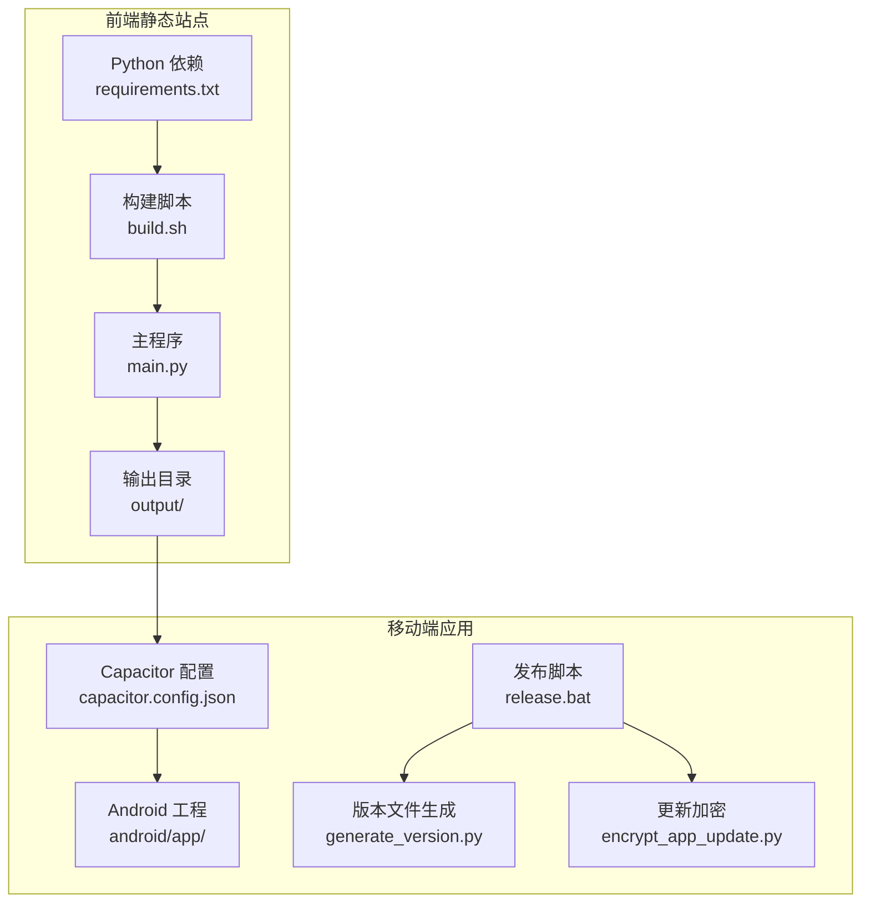
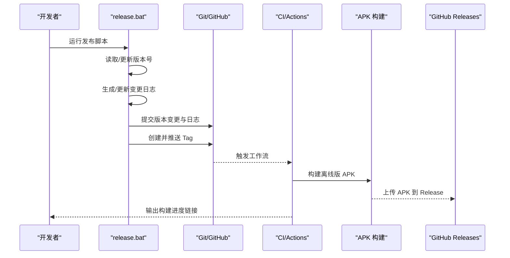
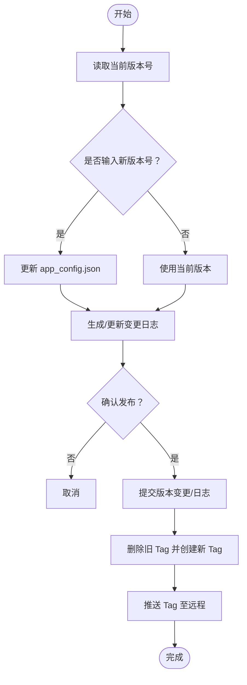
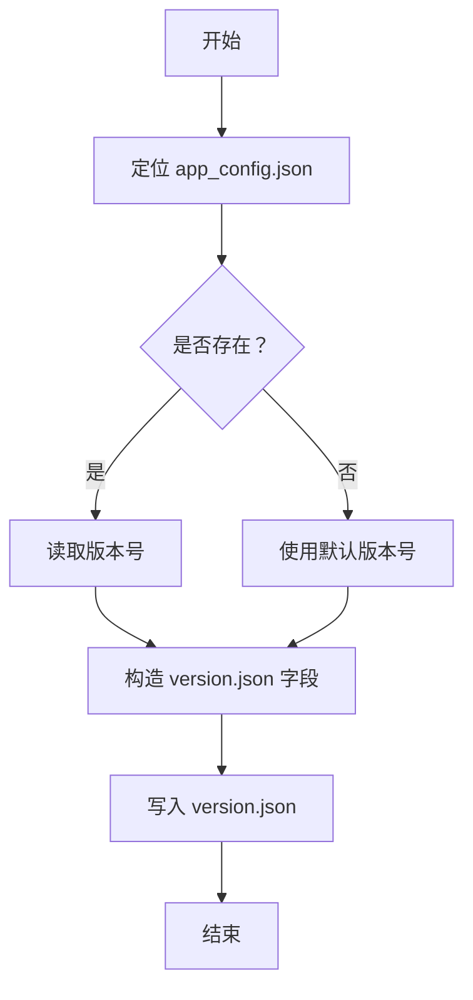
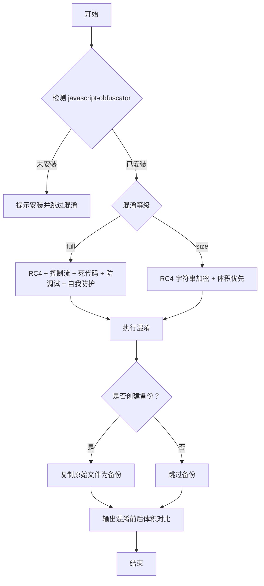
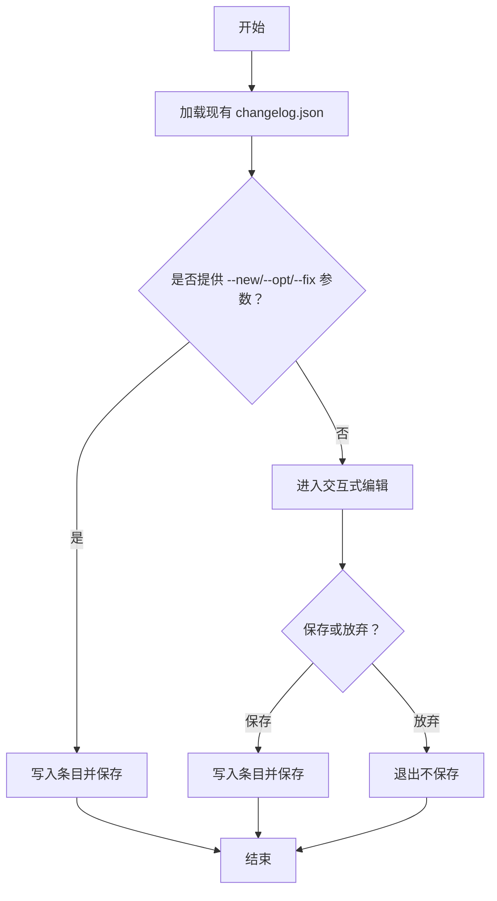
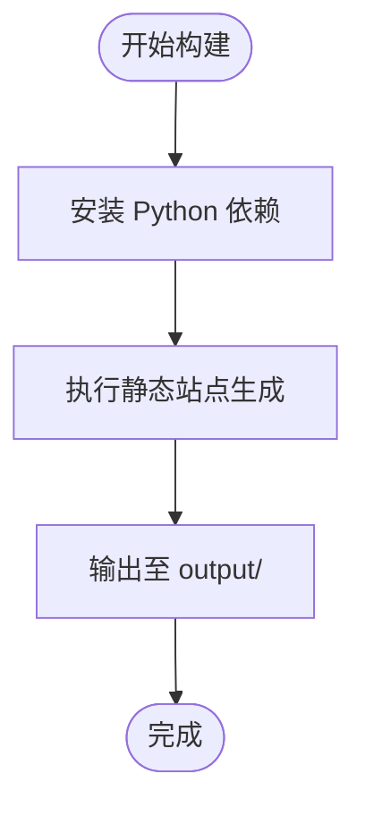
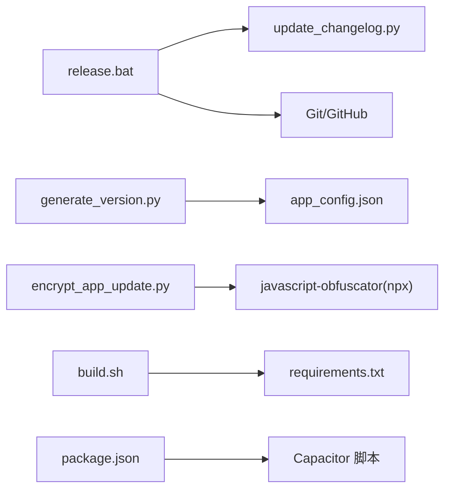

# 构建与部署

<cite>
**本文引用的文件**
- [release.bat](file://release.bat)
- [generate_version.py](file://generate_version.py)
- [encrypt_app_update.py](file://encrypt_app_update.py)
- [update_changelog.py](file://update_changelog.py)
- [build.sh](file://build.sh)
- [run.bat](file://run.bat)
- [requirements.txt](file://requirements.txt)
- [package.json](file://package.json)
- [DEPLOYMENT.md](file://DEPLOYMENT.md)
</cite>

## 目录
1. [简介](#简介)
2. [项目结构](#项目结构)
3. [核心组件](#核心组件)
4. [架构总览](#架构总览)
5. [详细组件分析](#详细组件分析)
6. [依赖分析](#依赖分析)
7. [性能考虑](#性能考虑)
8. [故障排查指南](#故障排查指南)
9. [结论](#结论)
10. [附录](#附录)

## 简介
本文件面向移动应用的构建与部署，系统性梳理以下能力与流程：
- 构建脚本工作流：环境准备、依赖安装、静态资源生成与打包。
- 发布脚本 release.bat：版本号输入、变更日志生成、Git Tag 管理与推送。
- 版本管理工具 generate_version.py：生成 APK 版本信息文件。
- 应用更新加密 encrypt_app_update.py：对 app-update.js 等关键 JS 文件进行混淆与保护。
- CI/CD 集成：Cloudflare Pages 自动构建与部署。
- 性能优化与最佳实践：构建速度、产物体积与安全性。

## 项目结构
本项目采用“前端静态站点 + 移动端 Capacitor 应用”的双轨布局：
- 前端静态站点：通过 Python 脚本生成 HTML/CSS/JS，输出至 output 目录，由 Cloudflare Pages 部署。
- 移动端应用：基于 Capacitor，使用 Gradle 构建 APK，配合 release.bat 完成版本与发布流程。

图表来源
- [build.sh:1-20](file://build.sh#L1-L20)
- [requirements.txt:1-16](file://requirements.txt#L1-L16)
- [package.json:1-30](file://package.json#L1-L30)
- [release.bat:1-137](file://release.bat#L1-L137)
- [generate_version.py:1-62](file://generate_version.py#L1-L62)
- [encrypt_app_update.py:1-263](file://encrypt_app_update.py#L1-L263)

章节来源
- [build.sh:1-20](file://build.sh#L1-L20)
- [requirements.txt:1-16](file://requirements.txt#L1-L16)
- [package.json:1-30](file://package.json#L1-L30)

## 核心组件
- 发布脚本 release.bat：负责版本号读取/更新、变更日志生成、Git 提交与 Tag 推送，并提示后续由 CI 触发 APK 构建与发布。
- 版本管理 generate_version.py：根据 app_config.json 生成 version.json，包含 APK 版本与文件名等必要信息。
- 应用更新加密 encrypt_app_update.py：对 app-update.js 等关键 JS 文件进行高强度混淆，保护下载地址、镜像链接与更新逻辑。
- 变更日志 update_changelog.py：支持非交互批量参数与交互式编辑，维护 changelog.json。
- 前端构建 build.sh：在 Cloudflare Pages 环境中安装依赖并执行静态站点生成。
- 运行脚本 run.bat：本地开发环境校验与启动。
- 依赖清单 requirements.txt：定义静态站点生成所需的最小运行依赖。
- 包管理 package.json：定义前端脚本与 Capacitor/Obfuscator 相关命令。

章节来源
- [release.bat:1-137](file://release.bat#L1-L137)
- [generate_version.py:1-62](file://generate_version.py#L1-L62)
- [encrypt_app_update.py:1-263](file://encrypt_app_update.py#L1-L263)
- [update_changelog.py:1-218](file://update_changelog.py#L1-L218)
- [build.sh:1-20](file://build.sh#L1-L20)
- [run.bat:1-44](file://run.bat#L1-L44)
- [requirements.txt:1-16](file://requirements.txt#L1-L16)
- [package.json:1-30](file://package.json#L1-L30)

## 架构总览
下图展示从本地发布到云端 CI 的整体流程：

图表来源
- [release.bat:1-137](file://release.bat#L1-L137)

章节来源
- [release.bat:1-137](file://release.bat#L1-L137)

## 详细组件分析

### 发布脚本 release.bat
- 功能要点
  - 读取 app_config.json 中的当前版本号。
  - 支持手动输入新版本号，或沿用当前版本。
  - 调用 update_changelog.py 生成/更新指定版本的变更日志。
  - 在版本号变化时提交 app_config.json；仅变更日志时单独提交。
  - 删除并重新创建同名 Tag，确保可重发场景正确性。
  - 推送 Tag 至远程仓库，随后由 CI 自动完成 APK 构建与发布。
- 关键行为
  - 版本号输入与更新：[release.bat:11-30](file://release.bat#L11-L30)
  - 变更日志生成与交互：[release.bat:38-56](file://release.bat#L38-L56)，[update_changelog.py:161-218](file://update_changelog.py#L161-L218)
  - 提交与推送：[release.bat:71-93](file://release.bat#L71-L93)，[release.bat:114-120](file://release.bat#L114-L120)
  - Tag 管理与重发：[release.bat:97-112](file://release.bat#L97-L112)

图表来源
- [release.bat:1-137](file://release.bat#L1-L137)
- [update_changelog.py:1-218](file://update_changelog.py#L1-L218)

章节来源
- [release.bat:1-137](file://release.bat#L1-L137)
- [update_changelog.py:1-218](file://update_changelog.py#L1-L218)

### 版本管理 generate_version.py
- 功能要点
  - 从 app_config.json 读取 APK 版本号，若缺失则回退为默认值。
  - 生成 version.json，包含 APK 版本、文件名等字段；可选附加 APK 大小。
  - 支持从根目录或 output 子目录读取配置文件。
- 关键行为
  - 读取配置与回退策略：[generate_version.py:13-33](file://generate_version.py#L13-L33)
  - 生成版本信息与保存：[generate_version.py:39-58](file://generate_version.py#L39-L58)

图表来源
- [generate_version.py:1-62](file://generate_version.py#L1-L62)

章节来源
- [generate_version.py:1-62](file://generate_version.py#L1-L62)

### 应用更新加密 encrypt_app_update.py
- 功能要点
  - 对 remote-config.js、app-update.js、theme-toggle.js 进行混淆保护。
  - 支持两种混淆等级：
    - full：用于 remote-config.js，启用 RC4 字符串加密、控制流平坦化、死代码注入、防调试、自我防护等。
    - size：用于 app-update.js 与 theme-toggle.js，侧重体积优化，降低膨胀。
  - 提供备份与恢复能力，便于开发调试。
- 关键行为
  - 混淆入口与等级选择：[encrypt_app_update.py:63-167](file://encrypt_app_update.py#L63-L167)
  - 单文件混淆与体积统计：[encrypt_app_update.py:12-153](file://encrypt_app_update.py#L12-L153)
  - 恢复原始文件：[encrypt_app_update.py:223-237](file://encrypt_app_update.py#L223-L237)

图表来源
- [encrypt_app_update.py:1-263](file://encrypt_app_update.py#L1-L263)

章节来源
- [encrypt_app_update.py:1-263](file://encrypt_app_update.py#L1-L263)

### 变更日志 update_changelog.py
- 功能要点
  - 支持非交互批量参数：--version、--new、--opt、--fix。
  - 支持交互式编辑：增删改查、保存与放弃。
  - 维护 changelog.json，包含版本号、发布日期与分类条目。
- 关键行为
  - 参数解析与非交互写入：[update_changelog.py:161-187](file://update_changelog.py#L161-L187)
  - 交互式编辑循环与索引映射：[update_changelog.py:69-159](file://update_changelog.py#L69-L159)

图表来源
- [update_changelog.py:1-218](file://update_changelog.py#L1-L218)

章节来源
- [update_changelog.py:1-218](file://update_changelog.py#L1-L218)

### 前端构建 build.sh 与 Cloudflare Pages 集成
- 功能要点
  - 在 Cloudflare Pages 构建环境中安装 Python 依赖并执行静态站点生成。
  - 由于 Pages 环境限制，要求文档为 .docx 格式，避免使用需要 sudo 的 LibreOffice。
- 关键行为
  - 安装依赖与生成静态文件：[build.sh:11-18](file://build.sh#L11-L18)
  - 部署说明与注意事项：[DEPLOYMENT.md:1-157](file://DEPLOYMENT.md#L1-L157)

图表来源
- [build.sh:1-20](file://build.sh#L1-L20)
- [DEPLOYMENT.md:1-157](file://DEPLOYMENT.md#L1-L157)

章节来源
- [build.sh:1-20](file://build.sh#L1-L20)
- [DEPLOYMENT.md:1-157](file://DEPLOYMENT.md#L1-L157)

### 本地开发 run.bat
- 功能要点
  - 校验虚拟环境是否存在，提示安装步骤。
  - 执行 main.py 生成 HTML，并可选择在浏览器中打开首页。
- 关键行为
  - 虚拟环境检查与引导：[run.bat:10-17](file://run.bat#L10-L17)
  - 执行生成与结果提示：[run.bat:22-40](file://run.bat#L22-L40)

章节来源
- [run.bat:1-44](file://run.bat#L1-L44)

## 依赖分析
- Python 依赖（静态站点）
  - requirements.txt 定义了生成静态站点所需的最小依赖集合，包括文档处理、模板渲染、网络请求与浏览器自动化等。
- 前端与构建
  - package.json 定义了 Capacitor 初始化、同步、打开 Android 工程以及构建 APK 的脚本。
  - javascript-obfuscator 作为 devDependencies，用于 encrypt_app_update.py 的混淆能力。
- 构建脚本耦合
  - release.bat 依赖 update_changelog.py 与 Git；generate_version.py 依赖 app_config.json；encrypt_app_update.py 依赖 NPM 工具链。

图表来源
- [release.bat:1-137](file://release.bat#L1-L137)
- [update_changelog.py:1-218](file://update_changelog.py#L1-L218)
- [generate_version.py:1-62](file://generate_version.py#L1-L62)
- [encrypt_app_update.py:1-263](file://encrypt_app_update.py#L1-L263)
- [build.sh:1-20](file://build.sh#L1-L20)
- [requirements.txt:1-16](file://requirements.txt#L1-L16)
- [package.json:1-30](file://package.json#L1-L30)

章节来源
- [requirements.txt:1-16](file://requirements.txt#L1-L16)
- [package.json:1-30](file://package.json#L1-L30)

## 性能考虑
- 构建性能
  - 减少不必要的文件扫描与 IO：集中使用一次性生成流程，避免重复解析资源。
  - 依赖安装优化：在 CI 环境缓存依赖安装结果（如 Pages 支持的缓存策略）。
  - 资源压缩：对静态资源进行压缩与去重，减少 output 目录体积。
- 产物体积
  - JS 混淆：对 app-update.js 使用 size 策略，平衡保护与体积；对 remote-config.js 使用 full 策略，强化安全。
  - APK 体积：在 release.bat 流程中结合 generate_version.py 输出的 APK 信息，评估体积变化趋势。
- 安全性
  - 混淆策略：启用 RC4 字符串加密、控制流平坦化、死代码注入与自我防护，降低逆向难度。
  - 备份与恢复：混淆前自动备份，便于开发调试与回滚。

## 故障排查指南
- 发布脚本常见问题
  - 版本号未更新：确认 app_config.json 是否被提交与推送；检查 release.bat 的提交与推送逻辑。[release.bat:27-30](file://release.bat#L27-L30)，[release.bat:88-93](file://release.bat#L88-L93)
  - 变更日志生成失败：检查 update_changelog.py 的参数与交互输入；确认 changelog.json 可写。[update_changelog.py:161-187](file://update_changelog.py#L161-L187)
  - Tag 推送失败：检查 Git 用户权限与远程仓库访问；确认网络连通性。[release.bat:114-120](file://release.bat#L114-L120)
- 混淆工具问题
  - 未安装 javascript-obfuscator：按提示安装全局依赖后重试。[encrypt_app_update.py:57-60](file://encrypt_app_update.py#L57-L60)
  - 混淆失败：查看子进程错误输出，确认文件路径与权限。[encrypt_app_update.py:146-148](file://encrypt_app_update.py#L146-L148)
- 前端构建问题
  - 依赖安装失败：核对 requirements.txt 与 Python 版本；确认 Pages 环境变量设置。[build.sh:11-13](file://build.sh#L11-L13)，[DEPLOYMENT.md:31-34](file://DEPLOYMENT.md#L31-L34)
  - 文档格式错误：确保所有文档为 .docx 格式，避免 Pages 环境缺少 sudo 导致的 LibreOffice 限制。[DEPLOYMENT.md:36-40](file://DEPLOYMENT.md#L36-L40)

章节来源
- [release.bat:1-137](file://release.bat#L1-L137)
- [update_changelog.py:1-218](file://update_changelog.py#L1-L218)
- [encrypt_app_update.py:1-263](file://encrypt_app_update.py#L1-L263)
- [build.sh:1-20](file://build.sh#L1-L20)
- [DEPLOYMENT.md:1-157](file://DEPLOYMENT.md#L1-L157)

## 结论
本项目提供了完整的构建与发布体系：本地开发与静态站点生成、移动端 APK 构建与发布、变更日志管理与版本信息生成，以及应用更新的安全保护。通过 release.bat 的标准化流程与 CI/CD 的自动化集成，团队可以高效、可靠地交付产品版本。

## 附录
- CI/CD 集成建议
  - GitHub Actions：在 release.bat 推送 Tag 后触发 APK 构建与 GitHub Releases 上传，参考 release.bat 的注释说明。[release.bat:127-131](file://release.bat#L127-L131)
  - Cloudflare Pages：保持 build.sh 的单命令构建流程，确保依赖安装与生成步骤完整。[build.sh:11-18](file://build.sh#L11-L18)
- 最佳实践
  - 版本号管理：统一通过 app_config.json 管理，避免硬编码。
  - 变更日志：每次发布前完善 changelog.json，便于用户与运维追踪。
  - 安全加固：定期评估混淆策略与备份恢复流程，确保开发与生产的平衡。