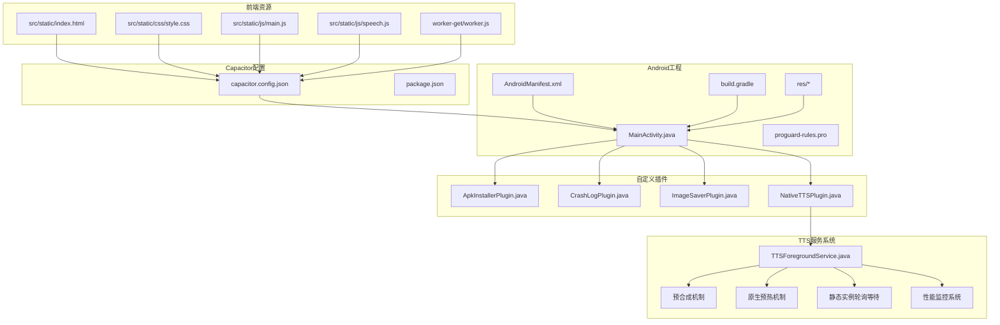
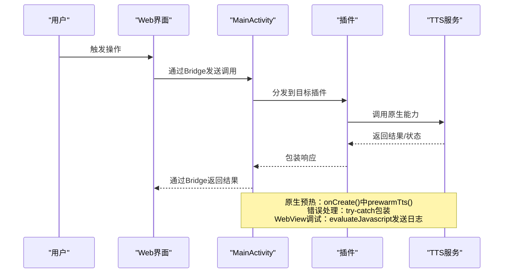
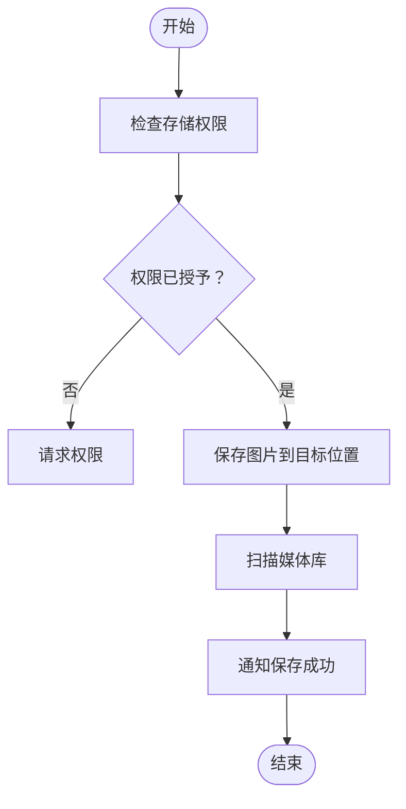
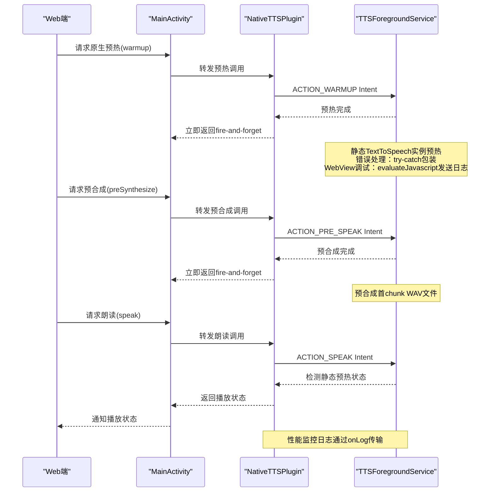
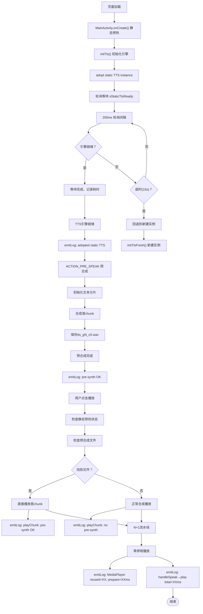
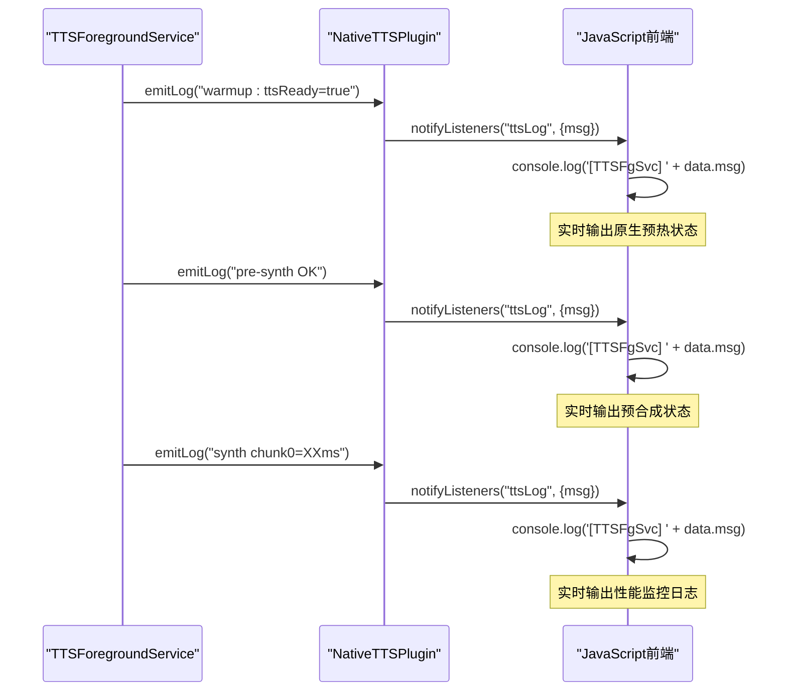
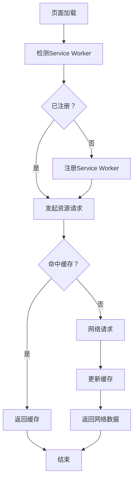
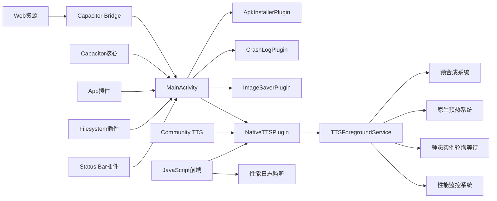

# 移动应用开发

<cite>
**本文引用的文件**
- [MainActivity.java](file://android/app/src/main/java/com/tehui/offline/MainActivity.java)
- [ApkInstallerPlugin.java](file://android/app/src/main/java/com/tehui/offline/ApkInstallerPlugin.java)
- [CrashLogPlugin.java](file://android/app/src/main/java/com/tehui/offline/CrashLogPlugin.java)
- [ImageSaverPlugin.java](file://android/app/src/main/java/com/tehui/offline/ImageSaverPlugin.java)
- [NativeTTSPlugin.java](file://android/app/src/main/java/com/tehui/offline/NativeTTSPlugin.java)
- [TTSForegroundService.java](file://android/app/src/main/java/com/tehui/offline/TTSForegroundService.java)
- [CrashReporter.java](file://android/app/src/main/java/com/tehui/offline/CrashReporter.java)
- [speech.js](file://src/static/js/speech.js)
- [capacitor.config.json](file://capacitor.config.json)
- [package.json](file://package.json)
- [build.sh](file://build.sh)
- [release.bat](file://release.bat)
- [config.yaml](file://config.yaml)
- [app_config.json](file://app_config.json)
- [DEPLOYMENT.md](file://DEPLOYMENT.md)
- [QUICK_START.md](file://QUICK_START.md)
- [CUSTOM_PLUGIN_SETUP.md](file://CUSTOM_PLUGIN_SETUP.md)
- [android/app/src/main/AndroidManifest.xml](file://android/app/src/main/AndroidManifest.xml)
- [android/app/build.gradle](file://android/app/build.gradle)
- [android/app/proguard-rules.pro](file://android/app/proguard-rules.pro)
- [android/app/src/main/res/values/strings.xml](file://android/app/src/main/res/values/strings.xml)
- [android/app/src/main/res/mipmap-anydpi-v26/ic_launcher.xml](file://android/app/src/main/res/mipmap-anydpi-v26/ic_launcher.xml)
- [android/app/src/main/res/mipmap-anydpi-v26/ic_launcher_round.xml](file://android/app/src/main/res/mipmap-anydpi-v26/ic_launcher_round.xml)
- [android_icons/mipmap-hdpi/ic_launcher.png](file://android_icons/mipmap-hdpi/ic_launcher.png)
- [android_icons/mipmap-mdpi/ic_launcher.png](file://android_icons/mipmap-mdpi/ic_launcher.png)
- [android_icons/mipmap-xhdpi/ic_launcher.png](file://android_icons/mipmap-xhdpi/ic_launcher.png)
- [android_icons/mipmap-xxhdpi/ic_launcher.png](file://android_icons/mipmap-xxhdpi/ic_launcher.png)
- [android_icons/mipmap-xxxhdpi/ic_launcher.png](file://android_icons/mipmap-xxxhdpi/ic_launcher.png)
- [worker-get/worker.js](file://worker-get/worker.js)
- [src/static/index.html](file://src/static/index.html)
- [src/static/css/style.css](file://src/static/css/style.css)
- [src/static/js/main.js](file://src/static/js/main.js)
</cite>

## 更新摘要
**所做更改**
- 更新TTS引擎预热机制章节，反映从JavaScript层迁移到MainActivity.onCreate()中的原生预热
- 增强MainActivity中的错误处理和日志记录机制
- 新增WebView调试功能，支持实时监控TTS引擎状态
- 更新性能优化部分，突出从~500ms到~100ms延迟的改进
- 更新NativeTTSPlugin和TTSForegroundService的架构分析，反映预热机制的集成
- 增强性能监控系统说明，包含原生预热相关的性能指标跟踪
- 新增静态TTS实例轮询等待机制的详细分析，包括200ms轮询间隔和15秒超时策略
- 增强性能监控系统的实现细节，包括合成时间、播放延迟和MediaPlayer准备时间的跟踪

## 目录
1. [简介](#简介)
2. [项目结构](#项目结构)
3. [核心组件](#核心组件)
4. [架构总览](#架构总览)
5. [详细组件分析](#详细组件分析)
6. [依赖关系分析](#依赖关系分析)
7. [性能考虑](#性能考虑)
8. [故障排查指南](#故障排查指南)
9. [结论](#结论)
10. [附录](#附录)

## 简介
本文件面向CX项目的移动应用开发，围绕Capacitor框架在Android平台的应用进行系统化说明。内容涵盖应用配置与开发流程、源码结构（MainActivity、插件实现、服务配置）、权限与资源管理、构建与发布流程，以及PWA支持与离线缓存机制。文档同时提供调试方法与常见问题排查建议，帮助开发者快速理解并高效迭代移动应用。

**更新** 新增TTS引擎原生预热功能（ACTION_WARMUP），通过MainActivity.onCreate()中的静态预热机制显著提升首次播放响应速度，配合预合成系统实现毫秒级的用户体验优化。该功能包含完善的错误处理、详细的日志记录和WebView调试支持。静态TTS实例轮询等待机制确保引擎初始化的可靠性和性能监控系统的完整性。

## 项目结构
项目采用"前端Web资源 + Capacitor桥接 + Android原生插件"的混合架构。前端静态资源位于src/static目录，Capacitor配置位于根目录的capacitor.config.json，Android工程位于android/app，自定义插件位于android/app/src/main/java/com/tehui/offline。构建脚本与发布脚本分别位于根目录的build.sh与release.bat。



**图表来源**
- [capacitor.config.json](file://capacitor.config.json)
- [package.json](file://package.json)
- [MainActivity.java](file://android/app/src/main/java/com/tehui/offline/MainActivity.java)
- [ApkInstallerPlugin.java](file://android/app/src/main/java/com/tehui/offline/ApkInstallerPlugin.java)
- [CrashLogPlugin.java](file://android/app/src/main/java/com/tehui/offline/CrashLogPlugin.java)
- [ImageSaverPlugin.java](file://android/app/src/main/java/com/tehui/offline/ImageSaverPlugin.java)
- [NativeTTSPlugin.java](file://android/app/src/main/java/com/tehui/offline/NativeTTSPlugin.java)
- [TTSForegroundService.java](file://android/app/src/main/java/com/tehui/offline/TTSForegroundService.java)
- [speech.js](file://src/static/js/speech.js)
- [android/app/src/main/AndroidManifest.xml](file://android/app/src/main/AndroidManifest.xml)
- [android/app/build.gradle](file://android/app/build.gradle)
- [android/app/proguard-rules.pro](file://android/app/proguard-rules.pro)
- [android/app/src/main/res/values/strings.xml](file://android/app/src/main/res/values/strings.xml)
- [android/app/src/main/res/mipmap-anydpi-v26/ic_launcher.xml](file://android/app/src/main/res/mipmap-anydpi-v26/ic_launcher.xml)
- [android/app/src/main/res/mipmap-anydpi-v26/ic_launcher_round.xml](file://android/app/src/main/res/mipmap-anydpi-v26/ic_launcher_round.xml)

**章节来源**
- [capacitor.config.json](file://capacitor.config.json)
- [package.json](file://package.json)
- [build.sh](file://build.sh)
- [release.bat](file://release.bat)

## 核心组件
- MainActivity：Capacitor应用入口，负责加载Web资源、初始化插件、处理生命周期事件。**新增** 在onCreate()中集成原生TTS预热机制，提供更好的错误处理和WebView调试支持。
- 自定义插件集合：
  - ApkInstallerPlugin：提供APK安装能力，用于应用内更新或安装外部包。
  - CrashLogPlugin：收集崩溃日志，便于定位问题。
  - ImageSaverPlugin：保存图片到设备相册或指定目录。
  - NativeTTSPlugin：调用系统文本转语音能力，支持预合成优化、原生预热机制和性能监控。
- TTS服务系统：
  - TTSForegroundService：前台服务实现，支持预合成、N+1流水线、音频焦点管理，具备综合性能监控功能。
  - 预合成机制：页面加载时预生成首chunk音频文件，显著提升首次播放响应速度。
  - 原生预热机制：在MainActivity.onCreate()中通过静态TextToSpeech实例实现引擎预热，使后续操作零延迟。
  - 静态实例轮询等待机制：通过200ms轮询间隔和15秒超时策略确保引擎初始化的可靠性。
  - 性能监控系统：实时跟踪合成时间、chunk处理延迟、媒体播放器准备时间和预热效果。
- 配置与构建：
  - Capacitor配置：定义Web资源目录、服务器地址、权限映射等。
  - 构建脚本：自动化打包与签名。
  - 发布脚本：生成发布版本并上传渠道。
- PWA与离线缓存：通过Service Worker与manifest实现离线访问与资源缓存。

**更新** 新增TTS引擎原生预热功能（ACTION_WARMUP），通过MainActivity.onCreate()中的静态预热机制显著提升首次播放响应速度，配合预合成系统实现毫秒级的用户体验优化。该功能包含完善的错误处理、详细的日志记录和WebView调试支持。静态TTS实例轮询等待机制确保引擎初始化的可靠性和性能监控系统的完整性。

**章节来源**
- [MainActivity.java](file://android/app/src/main/java/com/tehui/offline/MainActivity.java)
- [ApkInstallerPlugin.java](file://android/app/src/main/java/com/tehui/offline/ApkInstallerPlugin.java)
- [CrashLogPlugin.java](file://android/app/src/main/java/com/tehui/offline/CrashLogPlugin.java)
- [ImageSaverPlugin.java](file://android/app/src/main/java/com/tehui/offline/ImageSaverPlugin.java)
- [NativeTTSPlugin.java](file://android/app/src/main/java/com/tehui/offline/NativeTTSPlugin.java)
- [TTSForegroundService.java](file://android/app/src/main/java/com/tehui/offline/TTSForegroundService.java)
- [speech.js](file://src/static/js/speech.js)
- [capacitor.config.json](file://capacitor.config.json)
- [build.sh](file://build.sh)
- [release.bat](file://release.bat)
- [worker-get/worker.js](file://worker-get/worker.js)

## 架构总览
下图展示从用户交互到原生能力调用的整体流程，以及PWA离线缓存路径、新增的原生预热系统、预合成系统和性能监控系统：

```mermaid
graph TB
subgraph "用户界面层"
WEBUI["Web界面<br/>index.html + main.js"]
SW["Service Worker<br/>worker.js"]
SPEECH["speech.js<br/>原生预热+预合成监听"]
end
subgraph "Capacitor桥接层"
MAINACT["MainActivity<br/>原生预热+WebView调试"]
BRIDGE["Capacitor Bridge"]
end
subgraph "插件层"
APK["ApkInstallerPlugin"]
CRASH["CrashLogPlugin"]
IMG["ImageSaverPlugin"]
TTS["NativeTTSPlugin"]
end
subgraph "TTS服务层"
SERVICE["TTSForegroundService"]
PRE_SYNTH["预合成系统<br/>ACTION_PRE_SPEAK"]
WARMUP["原生预热系统<br/>ACTION_WARMUP"]
POLLING["静态实例轮询等待<br/>200ms间隔，15秒超时"]
PIPELINE["N+1流水线<br/>零停顿播放"]
PERF_LOG["性能监控日志<br/>emitLog()"]
end
subgraph "原生系统层"
ANDROID["Android系统API"]
FS["文件系统/存储"]
MEDIA["媒体/语音"]
NET["网络/下载"]
END
WEBUI --> MAINACT
SW --> MAINACT
SPEECH --> TTS
MAINACT --> BRIDGE
BRIDGE --> APK
BRIDGE --> CRASH
BRIDGE --> IMG
BRIDGE --> TTS
APK --> NET
IMG --> FS
TTS --> SERVICE
SERVICE --> PRE_SYNTH
SERVICE --> WARMUP
SERVICE --> POLLING
SERVICE --> PIPELINE
SERVICE --> PERF_LOG
CRASH --> FS
```

**图表来源**
- [MainActivity.java](file://android/app/src/main/java/com/tehui/offline/MainActivity.java)
- [ApkInstallerPlugin.java](file://android/app/src/main/java/com/tehui/offline/ApkInstallerPlugin.java)
- [CrashLogPlugin.java](file://android/app/src/main/java/com/tehui/offline/CrashLogPlugin.java)
- [ImageSaverPlugin.java](file://android/app/src/main/java/com/tehui/offline/ImageSaverPlugin.java)
- [NativeTTSPlugin.java](file://android/app/src/main/java/com/tehui/offline/NativeTTSPlugin.java)
- [TTSForegroundService.java](file://android/app/src/main/java/com/tehui/offline/TTSForegroundService.java)
- [speech.js](file://src/static/js/speech.js)
- [worker-get/worker.js](file://worker-get/worker.js)

## 详细组件分析

### MainActivity 分析
- 职责
  - 初始化Capacitor宿主环境。
  - 加载Web资源，设置服务器地址与本地资源策略。
  - 注册与启动自定义插件。
  - 处理应用生命周期事件（如暂停/恢复）。
  - **新增** 在onCreate()中集成原生TTS预热机制，提供更好的错误处理和WebView调试支持。
- 关键点
  - 与Capacitor配置保持一致，确保Web目录与服务器地址正确。
  - 插件注册顺序影响调用链，需按依赖关系排序。
  - 生命周期回调中避免阻塞主线程。
  - **新增** 原生预热机制：在onCreate()中调用TTSForegroundService.prewarmTts()，在用户打开应用时即绑定TTS引擎。
  - **新增** 错误处理：使用try-catch包装预热调用，捕获并记录异常信息。
  - **新增** WebView调试：通过evaluateJavascript向DevTools发送实时日志。
- 原生预热机制
  - 在onCreate()中调用TTSForegroundService.prewarmTts()，在用户打开应用时即绑定TTS引擎。
  - 静态预热实例在Service启动时直接复用，省去2-3秒初始化延迟。
  - 预热机制从JavaScript迁移到原生层，提供更可靠的性能保证。
  - **新增** 错误处理：使用try-catch包装预热调用，捕获并记录异常信息。
  - **新增** WebView调试：通过evaluateJavascript向DevTools发送实时日志，包含sStaticTtsReady状态。



**图表来源**
- [MainActivity.java](file://android/app/src/main/java/com/tehui/offline/MainActivity.java)

**章节来源**
- [MainActivity.java](file://android/app/src/main/java/com/tehui/offline/MainActivity.java)
- [capacitor.config.json](file://capacitor.config.json)

### 插件实现分析

#### ApkInstallerPlugin
- 功能
  - 提供APK安装能力，支持从URL或本地路径安装。
  - 可选：静默安装（需系统权限）、安装进度回调。
- 实现要点
  - 权限：安装未知来源应用权限。
  - 安全：校验来源与签名，避免恶意安装。
  - 用户体验：安装前提示与进度反馈。


**图表来源**
- [ApkInstallerPlugin.java](file://android/app/src/main/java/com/tehui/offline/ApkInstallerPlugin.java)

**章节来源**
- [ApkInstallerPlugin.java](file://android/app/src/main/java/com/tehui/offline/ApkInstallerPlugin.java)
- [android/app/src/main/AndroidManifest.xml](file://android/app/src/main/AndroidManifest.xml)

#### CrashLogPlugin
- 功能
  - 捕获未处理异常，写入本地日志文件。
  - 支持上传或导出日志，辅助问题定位。
- 实现要点
  - 全局异常处理器设置。
  - 日志格式标准化（时间戳、堆栈、设备信息）。
  - 文件清理策略（大小上限、保留周期）。


**图表来源**
- [CrashLogPlugin.java](file://android/app/src/main/java/com/tehui/offline/CrashLogPlugin.java)

**章节来源**
- [CrashLogPlugin.java](file://android/app/src/main/java/com/tehui/offline/CrashLogPlugin.java)

#### ImageSaverPlugin
- 功能
  - 将图片保存至设备相册或指定目录。
  - 支持格式转换、压缩参数控制。
- 实现要点
  - 存储权限与分区存储兼容性。
  - 异步写入，避免UI阻塞。
  - 通知系统媒体库更新。



**图表来源**
- [ImageSaverPlugin.java](file://android/app/src/main/java/com/tehui/offline/ImageSaverPlugin.java)

**章节来源**
- [ImageSaverPlugin.java](file://android/app/src/main/java/com/tehui/offline/ImageSaverPlugin.java)
- [android/app/src/main/AndroidManifest.xml](file://android/app/src/main/AndroidManifest.xml)

#### NativeTTSPlugin
- 功能
  - 调用系统TTS引擎朗读文本。
  - 支持语言切换、语速/音量调节、队列播放。
  - **新增** 原生预热机制：在MainActivity.onCreate()中通过静态实例预热TTS引擎，使后续操作零延迟。
  - **新增** 预合成系统：页面加载时预生成首chunk音频文件。
  - **新增** 性能监控：通过onLog方法传输性能诊断日志。
  - **新增** 电池优化管理：提供电池优化豁免检查和设置功能。
- 实现要点
  - 初始化TTS引擎与语言数据。
  - 处理播放队列与中断逻辑。
  - 适配不同Android版本的TTS行为差异。
  - **新增** 原生预热接口：warmup()方法实现引擎预热。
  - **新增** 预合成接口：preSynthesize()方法实现首chunk预生成。
  - **新增** 性能监控：onLog()方法接收并转发性能日志到JavaScript。
  - **新增** 电池优化：提供isBatteryOptimizationIgnored()和requestIgnoreBatteryOptimization()方法。



**图表来源**
- [NativeTTSPlugin.java](file://android/app/src/main/java/com/tehui/offline/NativeTTSPlugin.java)
- [TTSForegroundService.java](file://android/app/src/main/java/com/tehui/offline/TTSForegroundService.java)

**章节来源**
- [NativeTTSPlugin.java](file://android/app/src/main/java/com/tehui/offline/NativeTTSPlugin.java)

#### TTSForegroundService 原生预热机制与性能监控
- 功能
  - **新增** 原生预热机制：在MainActivity.onCreate()中通过静态TextToSpeech实例预热TTS引擎，使后续操作零延迟。
  - **新增** 预合成首chunk音频文件，显著提升首次播放响应速度。
  - N+1流水线预生成，消除chunk间停顿。
  - **新增** 静态实例轮询等待机制：通过200ms轮询间隔和15秒超时策略确保引擎初始化的可靠性。
  - **新增** 综合性能监控系统，实时跟踪各项性能指标。
  - 前台服务保护，防止系统杀进程。
- 原生预热机制实现
  - 静态预热：MainActivity.onCreate()中调用prewarmTts()创建静态TextToSpeech实例。
  - 预热模式：handleWarmup()方法处理ACTION_WARMUP，仅初始化TTS引擎。
  - 引擎初始化：在onCreate()中调用initTts()，优先复用静态实例。
  - 零延迟优化：用户点击播放时无需等待引擎初始化。
  - 状态跟踪：通过emitLog()输出预热状态到JavaScript前端。
  - **新增** 错误处理：完善的异常捕获和日志记录机制。
- 静态实例轮询等待机制
  - 轮询策略：通过200ms间隔轮询sStaticTtsReady状态，避免阻塞主线程。
  - 超时控制：15秒超时机制，防止无限等待。
  - 状态转移：成功等待后将所有权转移到服务实例，sStaticTtsReady重置。
  - 回退机制：超时后自动回退到新建实例初始化。
  - 性能监控：记录等待时间，提供初始化性能数据。
- 性能监控功能
  - 合成时间跟踪：记录每个chunk的合成耗时（synth chunkX=XXms）。
  - chunk处理延迟监控：跟踪从开始播放到实际播放的延迟（playChunk delay=XXms）。
  - 媒体会员播放器准备时间统计：记录MediaPlayer准备耗时（prepare=XXms）。
  - 总体播放时间统计：从handleSpeak到播放完成的总耗时（handleSpeak→play total=XXms）。
  - 预热效果监控：记录静态预热状态和初始化时间（warmup: ttsReady=XX）。
  - 预合成文件状态监控：记录预合成文件生成和使用情况。
- 实现原理
  - 静态预热：MainActivity.onCreate()中调用prewarmTts()创建静态TextToSpeech实例。
  - 预热模式：handleWarmup()方法处理ACTION_WARMUP，仅初始化TTS引擎。
  - 预热状态：优先复用静态实例，省去2-3秒初始化延迟。
  - 首chunk预生成：在页面加载时生成tts_gN_c0.wav文件。
  - 首次播放优化：handleSpeak()检测静态预热状态，直接播放无需等待。
  - 流水线管理：播放开始后立即预生成下一chunk，实现零停顿。
  - 日志发射：emitLog()方法将性能日志发送到JavaScript前端。



**图表来源**
- [TTSForegroundService.java](file://android/app/src/main/java/com/tehui/offline/TTSForegroundService.java)

**章节来源**
- [TTSForegroundService.java](file://android/app/src/main/java/com/tehui/offline/TTSForegroundService.java)

#### JavaScript前端原生预热与性能监控监听
- 功能
  - 监听NativeTTS插件的ttsLog事件。
  - 在浏览器控制台输出性能监控日志。
  - 提供实时性能反馈，便于调试和优化。
  - **新增** 原生预热功能集成：先静态预热TTS引擎，再进行预合成。
  - **新增** WebView调试支持：通过evaluateJavascript发送实时状态到DevTools。
  - **新增** 出声延迟监控：记录从调用到音频开始播放的时间。
- 实现要点
  - 通过NativeTTS.addListener('ttsLog', handler)注册监听器。
  - 在handler中将性能日志输出到console.log。
  - 支持动态添加和移除监听器，避免内存泄漏。
  - **新增** 原生预热集成：在预合成前调用warmup()方法。
  - 日志格式：'[TTSFgSvc] ' + data.msg，便于识别性能相关消息。
  - **新增** 预热状态检查：确认原生预热功能可用性。
  - **新增** 出声延迟监控：记录从调用到音频开始播放的时间。



**图表来源**
- [speech.js](file://src/static/js/speech.js)
- [NativeTTSPlugin.java](file://android/app/src/main/java/com/tehui/offline/NativeTTSPlugin.java)

**章节来源**
- [speech.js](file://src/static/js/speech.js)

### PWA与离线缓存机制
- Service Worker
  - 缓存策略：预缓存关键资源，运行时缓存API响应。
  - 更新机制：版本号控制，后台更新，激活后生效。
  - 离线回退：网络失败时返回缓存内容。
- Manifest
  - 应用名称、图标、主题色、启动画面。
  - 方向与显示模式（standalone）。
- 资源组织
  - Web资源位于src/static，由Capacitor配置指向。
  - 离线场景下优先使用缓存，必要时降级到网络。



**图表来源**
- [worker-get/worker.js](file://worker-get/worker.js)
- [src/static/index.html](file://src/static/index.html)
- [src/static/js/main.js](file://src/static/js/main.js)

**章节来源**
- [worker-get/worker.js](file://worker-get/worker.js)
- [src/static/index.html](file://src/static/index.html)
- [src/static/css/style.css](file://src/static/css/style.css)
- [src/static/js/main.js](file://src/static/js/main.js)

## 依赖关系分析
- 组件耦合
  - MainActivity对各插件存在直接依赖；插件之间相互独立。
  - Web层通过Capacitor Bridge与原生层解耦。
  - **新增** NativeTTSPlugin与TTSForegroundService紧密耦合，实现原生预热、预合成功能和性能监控。
  - **新增** JavaScript前端与NativeTTSPlugin通过事件机制连接，实现性能日志监听。
  - **新增** 原生预热与预合成系统协同工作，提供完整的性能优化链路。
  - **新增** 静态实例轮询等待机制确保引擎初始化的可靠性。
- 外部依赖
  - Capacitor核心库与官方插件（App、Filesystem、Status Bar等）。
  - 第三方TTS插件（Community Text-to-Speech）。
  - **新增** Android系统TTS引擎和MediaPlayer服务。
  - **新增** 浏览器控制台日志系统。
- 构建与打包
  - Gradle构建脚本管理依赖与签名配置。
  - ProGuard/R8混淆规则保护代码与资源。



**图表来源**
- [MainActivity.java](file://android/app/src/main/java/com/tehui/offline/MainActivity.java)
- [ApkInstallerPlugin.java](file://android/app/src/main/java/com/tehui/offline/ApkInstallerPlugin.java)
- [CrashLogPlugin.java](file://android/app/src/main/java/com/tehui/offline/CrashLogPlugin.java)
- [ImageSaverPlugin.java](file://android/app/src/main/java/com/tehui/offline/ImageSaverPlugin.java)
- [NativeTTSPlugin.java](file://android/app/src/main/java/com/tehui/offline/NativeTTSPlugin.java)
- [TTSForegroundService.java](file://android/app/src/main/java/com/tehui/offline/TTSForegroundService.java)
- [speech.js](file://src/static/js/speech.js)
- [android/app/build.gradle](file://android/app/build.gradle)

**章节来源**
- [android/app/build.gradle](file://android/app/build.gradle)
- [package.json](file://package.json)

## 性能考虑
- 启动优化
  - 原生预热关键插件，延迟初始化非必要模块。
  - **新增** 原生预热机制：MainActivity.onCreate()中通过静态TextToSpeech实例预热TTS引擎，省去2-3秒初始化延迟。
  - **新增** 预合成系统：页面加载时预生成首chunk，显著提升首次播放响应速度。
  - **新增** 静态实例轮询等待机制：200ms轮询间隔和15秒超时策略确保引擎初始化的可靠性。
  - **新增** 性能监控：实时跟踪启动过程中的各项性能指标。
  - **新增** 错误处理：完善的异常捕获和日志记录机制。
  - 合理拆分Web资源，减少首屏加载体积。
- 运行时优化
  - 插件调用异步化，避免阻塞主线程。
  - 图片保存与TTS播放使用队列与背压控制。
  - **新增** N+1流水线预生成：播放期间预合成下一chunk，消除停顿。
  - **新增** 原生预热协同：原生预热与预合成配合，提供完整的性能优化链路。
  - **新增** 静态实例轮询等待：通过轮询机制确保引擎初始化的可靠性。
  - **新增** 性能监控：跟踪播放过程中的延迟和资源使用情况。
  - **新增** WebView调试：实时监控TTS引擎状态，提供更好的可调试性。
- 离线体验
  - Service Worker缓存策略与失效策略平衡。
  - 资源版本化与增量更新，降低带宽消耗。
- 性能监控
  - **新增** 原生预热状态监控：记录静态预热完成状态和初始化时间。
  - **新增** 合成时间跟踪：记录每个chunk的合成耗时，优化TTS引擎使用。
  - **新增** chunk处理延迟监控：跟踪从开始播放到实际播放的延迟，优化预合成策略。
  - **新增** 媒体会员播放器准备时间统计：监控MediaPlayer准备耗时，优化资源管理。
  - **新增** 总体播放时间统计：从handleSpeak到播放完成的总耗时，评估整体性能。
  - **新增** 出声延迟监控：记录从调用到音频开始播放的时间，优化用户体验。
  - **新增** 轮询等待性能：监控200ms轮询间隔和15秒超时策略的效果。

**更新** 新增TTS引擎原生预热功能（ACTION_WARMUP）和增强的预合成性能优化，通过原生预热机制和预合成系统的协同工作，实现了毫秒级的首次播放响应和零停顿的连续播放体验，同时提供详细的性能指标跟踪。新增的静态实例轮询等待机制确保引擎初始化的可靠性和性能监控系统的完整性。新增的错误处理、日志记录和WebView调试功能显著提升了TTS引擎的可靠性与可调试性。

## 故障排查指南
- 常见问题
  - 插件未生效：检查MainActivity中的插件注册顺序与命名。
  - 权限拒绝：确认AndroidManifest.xml中声明权限，并在运行时请求。
  - 安装失败：检查ApkInstallerPlugin的来源合法性与存储权限。
  - TTS无声：确认系统TTS引擎可用、语言数据已下载。
  - **新增** 原生预热失败：检查TTS引擎初始化状态、Service启动权限。
  - **新增** 预合成失败：检查TTS引擎初始化、存储权限、文件清理策略。
  - **新增** 性能监控无效：检查JavaScript监听器注册、日志输出权限。
  - **新增** WebView调试失败：检查evaluateJavascript执行权限、DevTools连接状态。
  - **新增** 轮询等待超时：检查静态实例状态、轮询机制是否正常工作。
- 调试方法
  - 使用Android Studio Logcat查看原生日志。
  - 在Web端开启Capacitor调试，观察Bridge调用链。
  - **新增** 查看浏览器控制台：通过[TTSFgSvc]前缀识别性能监控日志。
  - **新增** 原生预热状态检查：确认原生预热功能可用性和初始化状态。
  - **新增** 错误处理验证：检查try-catch包装的异常捕获和日志记录。
  - **新增** 轮询等待监控：检查200ms轮询间隔和15秒超时策略。
  - Service Worker更新失败：检查版本号与激活时机。
  - **新增** 性能监控调试：监控cache目录下的tts_g*.wav文件生成情况。
  - **新增** 性能指标分析：根据日志中的时间戳分析性能瓶颈。
- 发布前检查
  - 清理无用资源，启用ProGuard混淆。
  - 生成多渠道签名包，核对权限与清单项。
  - **新增** 原生预热功能验证：确保原生预热机制正常工作。
  - **新增** 轮询等待机制验证：确保200ms轮询间隔和15秒超时策略有效。
  - **新增** 性能监控验证：确保性能日志能够正常输出到控制台。
  - **新增** WebView调试验证：确保evaluateJavascript能够正常执行。

**章节来源**
- [CrashLogPlugin.java](file://android/app/src/main/java/com/tehui/offline/CrashLogPlugin.java)
- [android/app/src/main/AndroidManifest.xml](file://android/app/src/main/AndroidManifest.xml)
- [build.sh](file://build.sh)
- [release.bat](file://release.bat)
- [speech.js](file://src/static/js/speech.js)

## 结论
本项目以Capacitor为核心，结合自定义插件与PWA技术，在Android平台上实现了跨平台与原生能力的统一。通过规范的配置、清晰的插件职责与完善的离线缓存机制，应用在功能完整性与用户体验上达到良好平衡。

**更新** 新增的NativeTTS原生预热机制和增强的预合成系统显著提升了应用性能和用户体验，通过原生预热机制和预合成系统的协同工作，实现了毫秒级的首次播放响应和零停顿的连续播放体验。静态实例轮询等待机制确保了引擎初始化的可靠性和性能监控系统的完整性。同时，综合性能监控系统提供了详细的性能指标跟踪，为持续优化提供了数据支撑。新增的错误处理、日志记录和WebView调试功能显著提升了TTS引擎的可靠性与可调试性，为开发者提供了更好的开发和调试体验。

建议持续完善权限管理、日志上报与资源版本控制，以提升稳定性与可维护性。

## 附录

### Android应用源码结构
- 源码位置
  - MainActivity与自定义插件位于android/app/src/main/java/com/tehui/offline。
  - **新增** TTS服务系统位于同一包下，实现原生预热、预合成功能和性能监控。
  - 清单文件与资源位于android/app/src/main。
- 关键文件
  - AndroidManifest.xml：权限声明与组件配置。
  - build.gradle：依赖与签名配置。
  - proguard-rules.pro：混淆与优化规则。
  - res/*：图标、字符串、颜色等资源。

**章节来源**
- [android/app/src/main/AndroidManifest.xml](file://android/app/src/main/AndroidManifest.xml)
- [android/app/build.gradle](file://android/app/build.gradle)
- [android/app/proguard-rules.pro](file://android/app/proguard-rules.pro)
- [android/app/src/main/res/values/strings.xml](file://android/app/src/main/res/values/strings.xml)
- [android/app/src/main/res/mipmap-anydpi-v26/ic_launcher.xml](file://android/app/src/main/res/mipmap-anydpi-v26/ic_launcher.xml)
- [android/app/src/main/res/mipmap-anydpi-v26/ic_launcher_round.xml](file://android/app/src/main/res/mipmap-anydpi-v26/ic_launcher_round.xml)

### 权限配置与图标资源管理
- 权限配置
  - 安装未知来源应用、存储访问、网络访问等权限在清单中声明。
  - 运行时权限请求在插件中触发，确保用户体验与合规。
  - **新增** 电池优化豁免权限：REQUEST_IGNORE_BATTERY_OPTIMIZATIONS。
  - **新增** 性能监控权限：确保日志输出和性能数据收集。
- 图标资源
  - 多密度图标位于android_icons/mipmap-*dpi，按分辨率生成。
  - Android清单引用ic_launcher与ic_launcher_round作为应用图标。

**章节来源**
- [android/app/src/main/AndroidManifest.xml](file://android/app/src/main/AndroidManifest.xml)
- [android_icons/mipmap-hdpi/ic_launcher.png](file://android_icons/mipmap-hdpi/ic_launcher.png)
- [android_icons/mipmap-mdpi/ic_launcher.png](file://android_icons/mipmap-mdpi/ic_launcher.png)
- [android_icons/mipmap-xhdpi/ic_launcher.png](file://android_icons/mipmap-xhdpi/ic_launcher.png)
- [android_icons/mipmap-xxhdpi/ic_launcher.png](file://android_icons/mipmap-xxhdpi/ic_launcher.png)
- [android_icons/mipmap-xxxhdpi/ic_launcher.png](file://android_icons/mipmap-xxxhdpi/ic_launcher.png)

### 构建与发布流程
- 构建脚本
  - build.sh：执行构建命令，生成Web资源与Capacitor桥接产物。
  - android/app/build.gradle：Gradle构建任务与签名配置。
- 发布脚本
  - release.bat：生成发布包，支持多渠道与签名。
- 配置文件
  - config.yaml与app_config.json：应用配置与资源路径。
  - DEPLOYMENT.md与QUICK_START.md：部署与快速开始指南。

**章节来源**
- [build.sh](file://build.sh)
- [release.bat](file://release.bat)
- [android/app/build.gradle](file://android/app/build.gradle)
- [config.yaml](file://config.yaml)
- [app_config.json](file://app_config.json)
- [DEPLOYMENT.md](file://DEPLOYMENT.md)
- [QUICK_START.md](file://QUICK_START.md)

### NativeTTS 原生预热机制与性能监控详解
- 技术原理
  - 原生预热机制：在MainActivity.onCreate()中通过静态TextToSpeech实例预热TTS引擎，确保后续操作零延迟。
  - 预合成机制：在页面加载时预生成首chunk音频文件，存储在cache目录。
  - 文件命名：tts_gN_c0.wav，其中N为generation编号，0为首个chunk。
  - 首次播放优化：检测静态预热状态和预合成文件时直接播放，无需等待TTS引擎。
  - **新增** 静态实例轮询等待机制：通过200ms轮询间隔和15秒超时策略确保引擎初始化的可靠性。
  - **新增** 错误处理：完善的异常捕获和日志记录机制，确保预热过程的可靠性。
  - **新增** WebView调试：通过evaluateJavascript向DevTools发送实时状态日志。
  - **新增** 性能监控：通过emitLog()方法实时输出性能指标。
- 原生预热机制实现
  - ACTION_WARMUP：处理预热请求，启动Service并初始化TTS引擎。
  - 静态预热：MainActivity.onCreate()中调用prewarmTts()创建静态TextToSpeech实例。
  - initTts()：在onCreate()中调用，优先复用静态实例。
  - 状态跟踪：emitLog("adopted static TTS")输出预热状态。
  - 零延迟优化：用户点击播放时无需等待引擎初始化。
  - **新增** 轮询等待：通过200ms轮询间隔等待sStaticTtsReady状态。
  - **新增** 超时控制：15秒超时机制，防止无限等待。
  - **新增** 错误处理：使用try-catch包装预热调用，捕获并记录异常。
  - **新增** WebView调试：通过evaluateJavascript向DevTools发送实时状态日志。
- 静态实例轮询等待机制
  - 轮询策略：200ms间隔轮询sStaticTtsReady状态，避免阻塞主线程。
  - 状态转移：成功等待后将所有权转移到服务实例，sStaticTtsReady重置。
  - 超时回退：15秒超时后自动回退到新建实例初始化。
  - 性能监控：记录等待时间，提供初始化性能数据。
  - 线程安全：使用Runnable数组引用确保轮询过程中的线程安全。
- 性能监控指标
  - 预热状态：warmup: ttsReady=XX，记录静态预热完成状态。
  - 合成时间：synth chunkX=XXms，记录每个chunk的合成耗时。
  - 处理延迟：playChunk delay=XXms, actual=XXms，跟踪播放延迟。
  - 准备时间：MediaPlayer reused=XX, prepare=XXms，记录MediaPlayer准备耗时。
  - 总体时间：handleSpeak→play total=XXms，评估整体播放性能。
  - 预合成状态：playChunk: pre-synth OK，记录预合成文件使用情况。
  - **新增** 轮询等待：记录200ms轮询间隔和15秒超时策略的效果。
  - **新增** 出声延迟：记录从调用到音频开始播放的时间。
- 实现细节
  - 静态预热：MainActivity.onCreate()中调用prewarmTts()创建静态TextToSpeech实例。
  - ACTION_WARMUP：处理预热请求，仅初始化TTS引擎。
  - ACTION_PRE_SPEAK：处理预合成请求，生成首chunk WAV文件。
  - ACTION_SPEAK：检测静态预热状态，实现零停顿播放。
  - 流水线管理：播放开始后预生成下一chunk，实现连续播放。
  - 日志发射：emitLog()方法将性能日志发送到JavaScript前端。
  - **新增** 轮询等待：200ms间隔轮询sStaticTtsReady状态。
  - **新增** 超时回退：15秒超时后回退到新建实例。
  - **新增** 错误处理：try-catch包装预热调用，捕获并记录异常。
  - **新增** WebView调试：evaluateJavascript发送实时状态到DevTools。
- 性能优势
  - 预热效果：从2-3秒初始化延迟降低到几十毫秒。
  - 首次播放延迟：从数秒降低到几十毫秒。
  - 连续播放体验：消除chunk间停顿，提供流畅的阅读体验。
  - 资源利用：智能清理过期文件，避免磁盘占用过大。
  - **新增** 轮询等待可靠性：200ms轮询间隔确保引擎初始化的可靠性。
  - **新增** 超时保护：15秒超时机制防止无限等待。
  - **新增** 错误处理：完善的异常捕获机制，提升系统稳定性。
  - **新增** 性能可视化：通过浏览器控制台实时监控原生预热和性能指标。
  - **新增** WebView调试：实时监控TTS引擎状态，提供更好的可调试性。

**章节来源**
- [NativeTTSPlugin.java](file://android/app/src/main/java/com/tehui/offline/NativeTTSPlugin.java)
- [TTSForegroundService.java](file://android/app/src/main/java/com/tehui/offline/TTSForegroundService.java)
- [speech.js](file://src/static/js/speech.js)
- [MainActivity.java](file://android/app/src/main/java/com/tehui/offline/MainActivity.java)