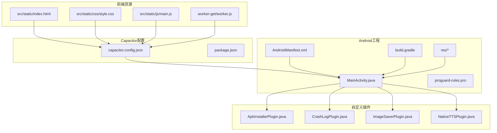
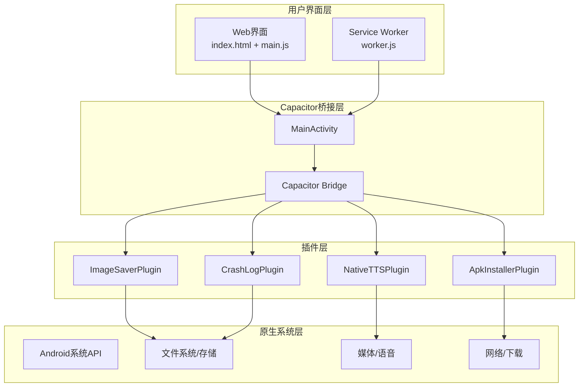
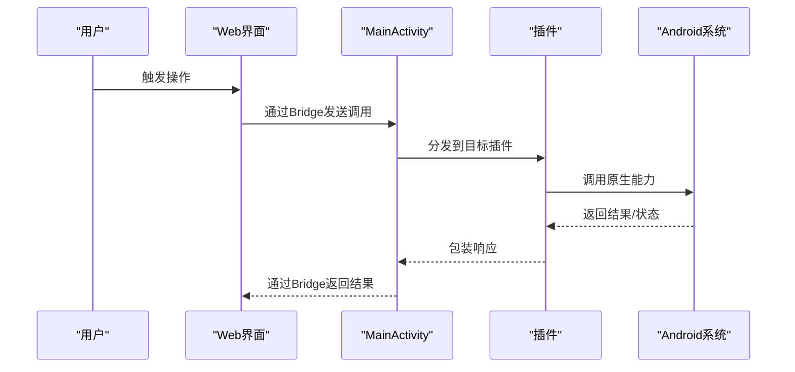
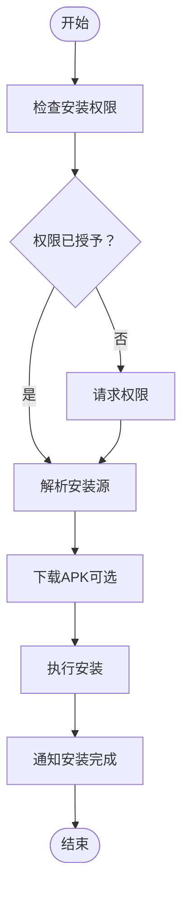
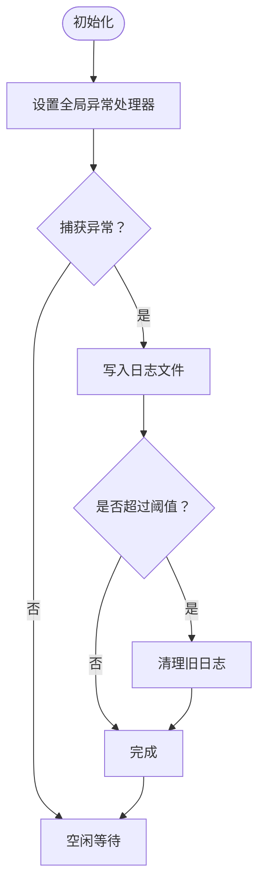
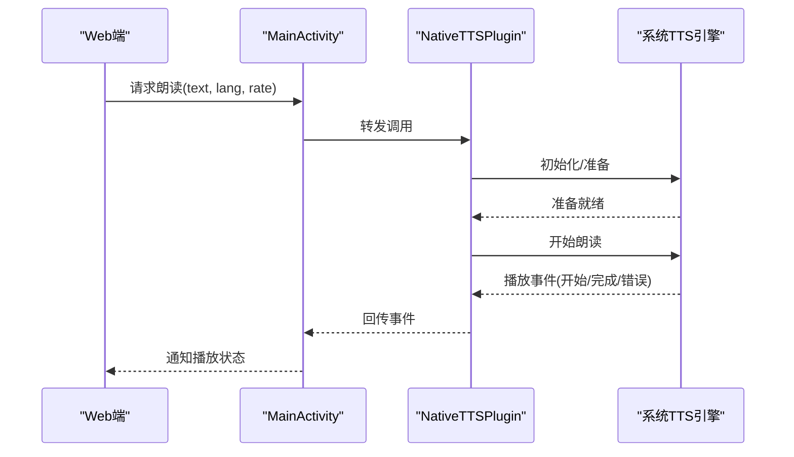
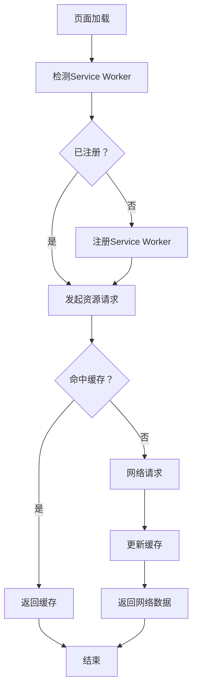
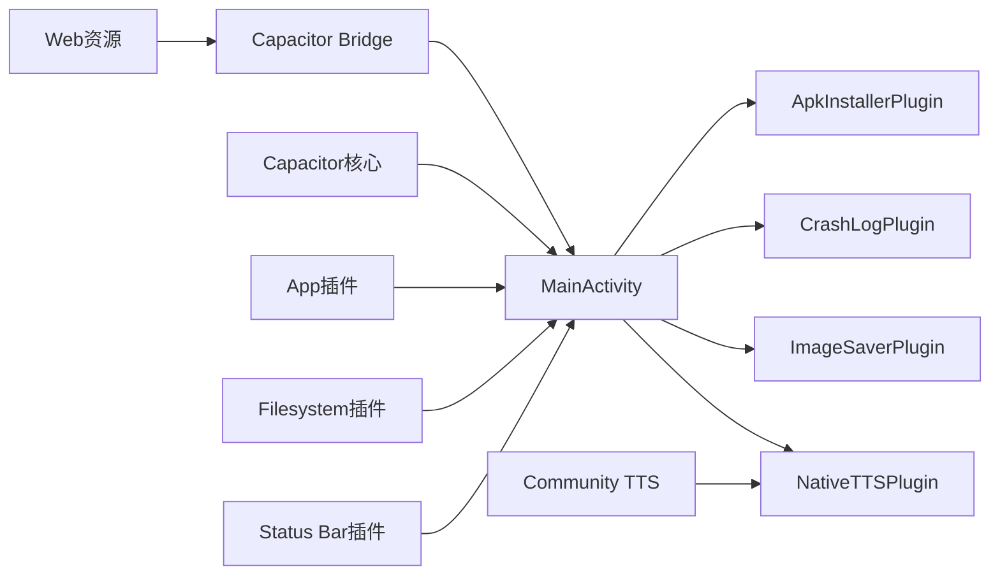

# 移动应用开发

<cite>
**本文引用的文件**
- [MainActivity.java](file://android/app/src/main/java/com/tehui/offline/MainActivity.java)
- [ApkInstallerPlugin.java](file://android/app/src/main/java/com/tehui/offline/ApkInstallerPlugin.java)
- [CrashLogPlugin.java](file://android/app/src/main/java/com/tehui/offline/CrashLogPlugin.java)
- [ImageSaverPlugin.java](file://android/app/src/main/java/com/tehui/offline/ImageSaverPlugin.java)
- [NativeTTSPlugin.java](file://android/app/src/main/java/com/tehui/offline/NativeTTSPlugin.java)
- [capacitor.config.json](file://capacitor.config.json)
- [package.json](file://package.json)
- [build.sh](file://build.sh)
- [release.bat](file://release.bat)
- [config.yaml](file://config.yaml)
- [app_config.json](file://app_config.json)
- [DEPLOYMENT.md](file://DEPLOYMENT.md)
- [QUICK_START.md](file://QUICK_START.md)
- [CUSTOM_PLUGIN_SETUP.md](file://CUSTOM_PLUGIN_SETUP.md)
- [android/app/src/main/AndroidManifest.xml](file://android/app/src/main/AndroidManifest.xml)
- [android/app/build.gradle](file://android/app/build.gradle)
- [android/app/proguard-rules.pro](file://android/app/proguard-rules.pro)
- [android/app/src/main/res/values/strings.xml](file://android/app/src/main/res/values/strings.xml)
- [android/app/src/main/res/mipmap-anydpi-v26/ic_launcher.xml](file://android/app/src/main/res/mipmap-anydpi-v26/ic_launcher.xml)
- [android/app/src/main/res/mipmap-anydpi-v26/ic_launcher_round.xml](file://android/app/src/main/res/mipmap-anydpi-v26/ic_launcher_round.xml)
- [android_icons/mipmap-hdpi/ic_launcher.png](file://android_icons/mipmap-hdpi/ic_launcher.png)
- [android_icons/mipmap-mdpi/ic_launcher.png](file://android_icons/mipmap-mdpi/ic_launcher.png)
- [android_icons/mipmap-xhdpi/ic_launcher.png](file://android_icons/mipmap-xhdpi/ic_launcher.png)
- [android_icons/mipmap-xxhdpi/ic_launcher.png](file://android_icons/mipmap-xxhdpi/ic_launcher.png)
- [android_icons/mipmap-xxxhdpi/ic_launcher.png](file://android_icons/mipmap-xxxhdpi/ic_launcher.png)
- [worker-get/worker.js](file://worker-get/worker.js)
- [src/static/index.html](file://src/static/index.html)
- [src/static/css/style.css](file://src/static/css/style.css)
- [src/static/js/main.js](file://src/static/js/main.js)
</cite>

## 目录
1. [简介](#简介)
2. [项目结构](#项目结构)
3. [核心组件](#核心组件)
4. [架构总览](#架构总览)
5. [详细组件分析](#详细组件分析)
6. [依赖关系分析](#依赖关系分析)
7. [性能考虑](#性能考虑)
8. [故障排查指南](#故障排查指南)
9. [结论](#结论)
10. [附录](#附录)

## 简介
本文件面向CX项目的移动应用开发，围绕Capacitor框架在Android平台的应用进行系统化说明。内容涵盖应用配置与开发流程、源码结构（MainActivity、插件实现、服务配置）、权限与资源管理、构建与发布流程，以及PWA支持与离线缓存机制。文档同时提供调试方法与常见问题排查建议，帮助开发者快速理解并高效迭代移动应用。

## 项目结构
项目采用“前端Web资源 + Capacitor桥接 + Android原生插件”的混合架构。前端静态资源位于src/static目录，Capacitor配置位于根目录的capacitor.config.json，Android工程位于android/app，自定义插件位于android/app/src/main/java/com/tehui/offline。构建脚本与发布脚本分别位于根目录的build.sh与release.bat。

**图表来源**
- [capacitor.config.json](file://capacitor.config.json)
- [package.json](file://package.json)
- [MainActivity.java](file://android/app/src/main/java/com/tehui/offline/MainActivity.java)
- [ApkInstallerPlugin.java](file://android/app/src/main/java/com/tehui/offline/ApkInstallerPlugin.java)
- [CrashLogPlugin.java](file://android/app/src/main/java/com/tehui/offline/CrashLogPlugin.java)
- [ImageSaverPlugin.java](file://android/app/src/main/java/com/tehui/offline/ImageSaverPlugin.java)
- [NativeTTSPlugin.java](file://android/app/src/main/java/com/tehui/offline/NativeTTSPlugin.java)
- [android/app/src/main/AndroidManifest.xml](file://android/app/src/main/AndroidManifest.xml)
- [android/app/build.gradle](file://android/app/build.gradle)
- [android/app/proguard-rules.pro](file://android/app/proguard-rules.pro)
- [android/app/src/main/res/values/strings.xml](file://android/app/src/main/res/values/strings.xml)
- [android/app/src/main/res/mipmap-anydpi-v26/ic_launcher.xml](file://android/app/src/main/res/mipmap-anydpi-v26/ic_launcher.xml)
- [android/app/src/main/res/mipmap-anydpi-v26/ic_launcher_round.xml](file://android/app/src/main/res/mipmap-anydpi-v26/ic_launcher_round.xml)

**章节来源**
- [capacitor.config.json](file://capacitor.config.json)
- [package.json](file://package.json)
- [build.sh](file://build.sh)
- [release.bat](file://release.bat)

## 核心组件
- MainActivity：Capacitor应用入口，负责加载Web资源、初始化插件、处理生命周期事件。
- 自定义插件集合：
  - ApkInstallerPlugin：提供APK安装能力，用于应用内更新或安装外部包。
  - CrashLogPlugin：收集崩溃日志，便于定位问题。
  - ImageSaverPlugin：保存图片到设备相册或指定目录。
  - NativeTTSPlugin：调用系统文本转语音能力。
- 配置与构建：
  - Capacitor配置：定义Web资源目录、服务器地址、权限映射等。
  - 构建脚本：自动化打包与签名。
  - 发布脚本：生成发布版本并上传渠道。
- PWA与离线缓存：通过Service Worker与manifest实现离线访问与资源缓存。

**章节来源**
- [MainActivity.java](file://android/app/src/main/java/com/tehui/offline/MainActivity.java)
- [ApkInstallerPlugin.java](file://android/app/src/main/java/com/tehui/offline/ApkInstallerPlugin.java)
- [CrashLogPlugin.java](file://android/app/src/main/java/com/tehui/offline/CrashLogPlugin.java)
- [ImageSaverPlugin.java](file://android/app/src/main/java/com/tehui/offline/ImageSaverPlugin.java)
- [NativeTTSPlugin.java](file://android/app/src/main/java/com/tehui/offline/NativeTTSPlugin.java)
- [capacitor.config.json](file://capacitor.config.json)
- [build.sh](file://build.sh)
- [release.bat](file://release.bat)
- [worker-get/worker.js](file://worker-get/worker.js)

## 架构总览
下图展示从用户交互到原生能力调用的整体流程，以及PWA离线缓存路径：

**图表来源**
- [MainActivity.java](file://android/app/src/main/java/com/tehui/offline/MainActivity.java)
- [ApkInstallerPlugin.java](file://android/app/src/main/java/com/tehui/offline/ApkInstallerPlugin.java)
- [CrashLogPlugin.java](file://android/app/src/main/java/com/tehui/offline/CrashLogPlugin.java)
- [ImageSaverPlugin.java](file://android/app/src/main/java/com/tehui/offline/ImageSaverPlugin.java)
- [NativeTTSPlugin.java](file://android/app/src/main/java/com/tehui/offline/NativeTTSPlugin.java)
- [worker-get/worker.js](file://worker-get/worker.js)

## 详细组件分析

### MainActivity 分析
- 职责
  - 初始化Capacitor宿主环境。
  - 加载Web资源，设置服务器地址与本地资源策略。
  - 注册与启动自定义插件。
  - 处理应用生命周期事件（如暂停/恢复）。
- 关键点
  - 与Capacitor配置保持一致，确保Web目录与服务器地址正确。
  - 插件注册顺序影响调用链，需按依赖关系排序。
  - 生命周期回调中避免阻塞主线程。

**图表来源**
- [MainActivity.java](file://android/app/src/main/java/com/tehui/offline/MainActivity.java)

**章节来源**
- [MainActivity.java](file://android/app/src/main/java/com/tehui/offline/MainActivity.java)
- [capacitor.config.json](file://capacitor.config.json)

### 插件实现分析

#### ApkInstallerPlugin
- 功能
  - 提供APK安装能力，支持从URL或本地路径安装。
  - 可选：静默安装（需系统权限）、安装进度回调。
- 实现要点
  - 权限：安装未知来源应用权限。
  - 安全：校验来源与签名，避免恶意安装。
  - 用户体验：安装前提示与进度反馈。

**图表来源**
- [ApkInstallerPlugin.java](file://android/app/src/main/java/com/tehui/offline/ApkInstallerPlugin.java)

**章节来源**
- [ApkInstallerPlugin.java](file://android/app/src/main/java/com/tehui/offline/ApkInstallerPlugin.java)
- [android/app/src/main/AndroidManifest.xml](file://android/app/src/main/AndroidManifest.xml)

#### CrashLogPlugin
- 功能
  - 捕获未处理异常，写入本地日志文件。
  - 支持上传或导出日志，辅助问题定位。
- 实现要点
  - 全局异常处理器设置。
  - 日志格式标准化（时间戳、堆栈、设备信息）。
  - 文件清理策略（大小上限、保留周期）。

**图表来源**
- [CrashLogPlugin.java](file://android/app/src/main/java/com/tehui/offline/CrashLogPlugin.java)

**章节来源**
- [CrashLogPlugin.java](file://android/app/src/main/java/com/tehui/offline/CrashLogPlugin.java)

#### ImageSaverPlugin
- 功能
  - 将图片保存至设备相册或指定目录。
  - 支持格式转换、压缩参数控制。
- 实现要点
  - 存储权限与分区存储兼容性。
  - 异步写入，避免UI阻塞。
  - 通知系统媒体库更新。

**图表来源**
- [ImageSaverPlugin.java](file://android/app/src/main/java/com/tehui/offline/ImageSaverPlugin.java)

**章节来源**
- [ImageSaverPlugin.java](file://android/app/src/main/java/com/tehui/offline/ImageSaverPlugin.java)
- [android/app/src/main/AndroidManifest.xml](file://android/app/src/main/AndroidManifest.xml)

#### NativeTTSPlugin
- 功能
  - 调用系统TTS引擎朗读文本。
  - 支持语言切换、语速/音量调节、队列播放。
- 实现要点
  - 初始化TTS引擎与语言数据。
  - 处理播放队列与中断逻辑。
  - 适配不同Android版本的TTS行为差异。

**图表来源**
- [NativeTTSPlugin.java](file://android/app/src/main/java/com/tehui/offline/NativeTTSPlugin.java)

**章节来源**
- [NativeTTSPlugin.java](file://android/app/src/main/java/com/tehui/offline/NativeTTSPlugin.java)

### PWA与离线缓存机制
- Service Worker
  - 缓存策略：预缓存关键资源，运行时缓存API响应。
  - 更新机制：版本号控制，后台更新，激活后生效。
  - 离线回退：网络失败时返回缓存内容。
- Manifest
  - 应用名称、图标、主题色、启动画面。
  - 方向与显示模式（standalone）。
- 资源组织
  - Web资源位于src/static，由Capacitor配置指向。
  - 离线场景下优先使用缓存，必要时降级到网络。

**图表来源**
- [worker-get/worker.js](file://worker-get/worker.js)
- [src/static/index.html](file://src/static/index.html)
- [src/static/js/main.js](file://src/static/js/main.js)

**章节来源**
- [worker-get/worker.js](file://worker-get/worker.js)
- [src/static/index.html](file://src/static/index.html)
- [src/static/css/style.css](file://src/static/css/style.css)
- [src/static/js/main.js](file://src/static/js/main.js)

## 依赖关系分析
- 组件耦合
  - MainActivity对各插件存在直接依赖；插件之间相互独立。
  - Web层通过Capacitor Bridge与原生层解耦。
- 外部依赖
  - Capacitor核心库与官方插件（App、Filesystem、Status Bar等）。
  - 第三方TTS插件（Community Text-to-Speech）。
- 构建与打包
  - Gradle构建脚本管理依赖与签名配置。
  - ProGuard/R8混淆规则保护代码与资源。

**图表来源**
- [MainActivity.java](file://android/app/src/main/java/com/tehui/offline/MainActivity.java)
- [ApkInstallerPlugin.java](file://android/app/src/main/java/com/tehui/offline/ApkInstallerPlugin.java)
- [CrashLogPlugin.java](file://android/app/src/main/java/com/tehui/offline/CrashLogPlugin.java)
- [ImageSaverPlugin.java](file://android/app/src/main/java/com/tehui/offline/ImageSaverPlugin.java)
- [NativeTTSPlugin.java](file://android/app/src/main/java/com/tehui/offline/NativeTTSPlugin.java)
- [android/app/build.gradle](file://android/app/build.gradle)

**章节来源**
- [android/app/build.gradle](file://android/app/build.gradle)
- [package.json](file://package.json)

## 性能考虑
- 启动优化
  - 预热关键插件，延迟初始化非必要模块。
  - 合理拆分Web资源，减少首屏加载体积。
- 运行时优化
  - 插件调用异步化，避免阻塞主线程。
  - 图片保存与TTS播放使用队列与背压控制。
- 离线体验
  - Service Worker缓存策略与失效策略平衡。
  - 资源版本化与增量更新，降低带宽消耗。

## 故障排查指南
- 常见问题
  - 插件未生效：检查MainActivity中的插件注册顺序与命名。
  - 权限拒绝：确认AndroidManifest.xml中声明权限，并在运行时请求。
  - 安装失败：检查ApkInstallerPlugin的来源合法性与存储权限。
  - TTS无声：确认系统TTS引擎可用、语言数据已下载。
- 调试方法
  - 使用Android Studio Logcat查看原生日志。
  - 在Web端开启Capacitor调试，观察Bridge调用链。
  - Service Worker更新失败：检查版本号与激活时机。
- 发布前检查
  - 清理无用资源，启用ProGuard混淆。
  - 生成多渠道签名包，核对权限与清单项。

**章节来源**
- [CrashLogPlugin.java](file://android/app/src/main/java/com/tehui/offline/CrashLogPlugin.java)
- [android/app/src/main/AndroidManifest.xml](file://android/app/src/main/AndroidManifest.xml)
- [build.sh](file://build.sh)
- [release.bat](file://release.bat)

## 结论
本项目以Capacitor为核心，结合自定义插件与PWA技术，在Android平台上实现了跨平台与原生能力的统一。通过规范的配置、清晰的插件职责与完善的离线缓存机制，应用在功能完整性与用户体验上达到良好平衡。建议持续完善权限管理、日志上报与资源版本控制，以提升稳定性与可维护性。

## 附录

### Android应用源码结构
- 源码位置
  - MainActivity与自定义插件位于android/app/src/main/java/com/tehui/offline。
  - 清单文件与资源位于android/app/src/main。
- 关键文件
  - AndroidManifest.xml：权限声明与组件配置。
  - build.gradle：依赖与签名配置。
  - proguard-rules.pro：混淆与优化规则。
  - res/*：图标、字符串、颜色等资源。

**章节来源**
- [android/app/src/main/AndroidManifest.xml](file://android/app/src/main/AndroidManifest.xml)
- [android/app/build.gradle](file://android/app/build.gradle)
- [android/app/proguard-rules.pro](file://android/app/proguard-rules.pro)
- [android/app/src/main/res/values/strings.xml](file://android/app/src/main/res/values/strings.xml)
- [android/app/src/main/res/mipmap-anydpi-v26/ic_launcher.xml](file://android/app/src/main/res/mipmap-anydpi-v26/ic_launcher.xml)
- [android/app/src/main/res/mipmap-anydpi-v26/ic_launcher_round.xml](file://android/app/src/main/res/mipmap-anydpi-v26/ic_launcher_round.xml)

### 权限配置与图标资源管理
- 权限配置
  - 安装未知来源应用、存储访问、网络访问等权限在清单中声明。
  - 运行时权限请求在插件中触发，确保用户体验与合规。
- 图标资源
  - 多密度图标位于android_icons/mipmap-*dpi，按分辨率生成。
  - Android清单引用ic_launcher与ic_launcher_round作为应用图标。

**章节来源**
- [android/app/src/main/AndroidManifest.xml](file://android/app/src/main/AndroidManifest.xml)
- [android_icons/mipmap-hdpi/ic_launcher.png](file://android_icons/mipmap-hdpi/ic_launcher.png)
- [android_icons/mipmap-mdpi/ic_launcher.png](file://android_icons/mipmap-mdpi/ic_launcher.png)
- [android_icons/mipmap-xhdpi/ic_launcher.png](file://android_icons/mipmap-xhdpi/ic_launcher.png)
- [android_icons/mipmap-xxhdpi/ic_launcher.png](file://android_icons/mipmap-xxhdpi/ic_launcher.png)
- [android_icons/mipmap-xxxhdpi/ic_launcher.png](file://android_icons/mipmap-xxxhdpi/ic_launcher.png)

### 构建与发布流程
- 构建脚本
  - build.sh：执行构建命令，生成Web资源与Capacitor桥接产物。
  - android/app/build.gradle：Gradle构建任务与签名配置。
- 发布脚本
  - release.bat：生成发布包，支持多渠道与签名。
- 配置文件
  - config.yaml与app_config.json：应用配置与资源路径。
  - DEPLOYMENT.md与QUICK_START.md：部署与快速开始指南。

**章节来源**
- [build.sh](file://build.sh)
- [release.bat](file://release.bat)
- [android/app/build.gradle](file://android/app/build.gradle)
- [config.yaml](file://config.yaml)
- [app_config.json](file://app_config.json)
- [DEPLOYMENT.md](file://DEPLOYMENT.md)
- [QUICK_START.md](file://QUICK_START.md)