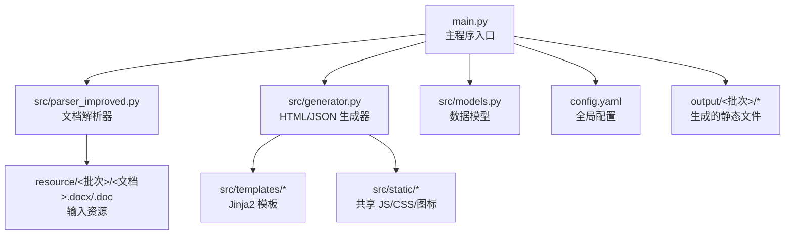
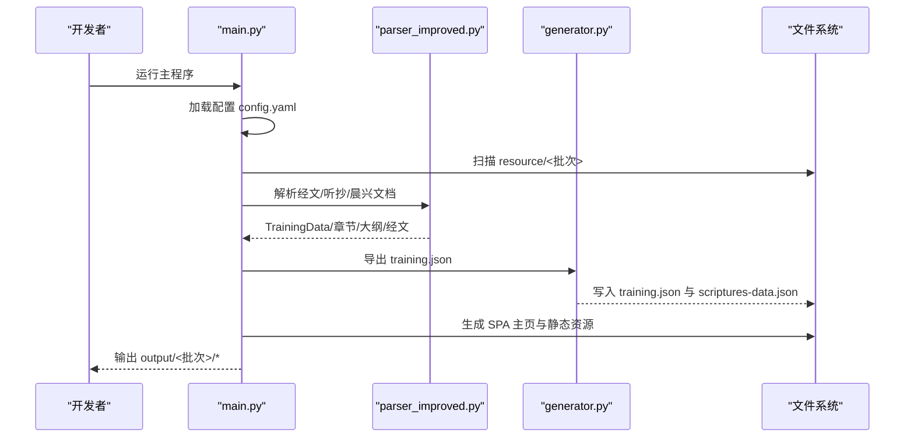
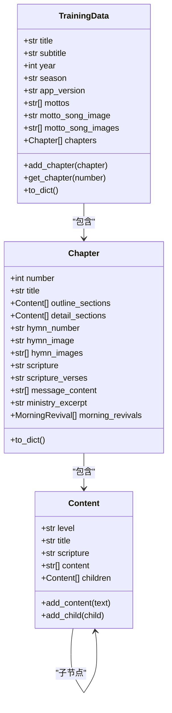
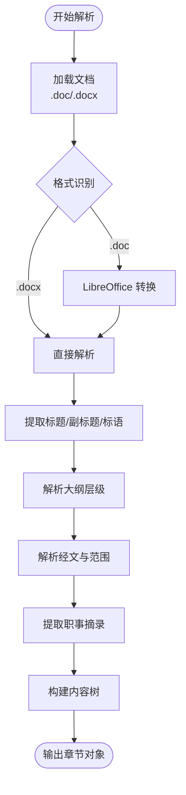
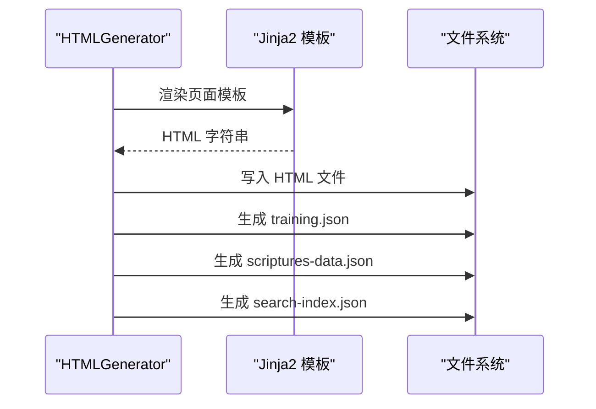
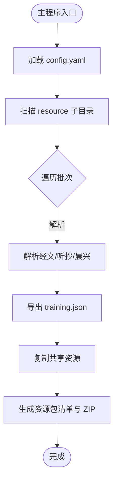
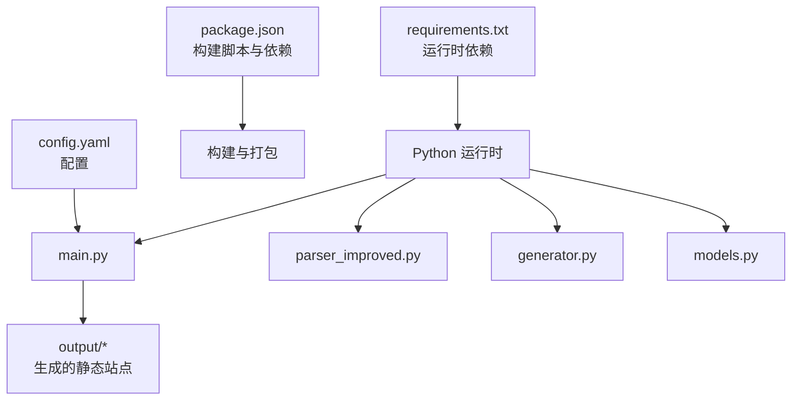

# 贡献指南

<cite>
**本文引用的文件**
- [README.md](file://README.md)
- [QUICK_START.md](file://QUICK_START.md)
- [DEPLOYMENT.md](file://DEPLOYMENT.md)
- [config.yaml](file://config.yaml)
- [requirements.txt](file://requirements.txt)
- [package.json](file://package.json)
- [main.py](file://main.py)
- [src/models.py](file://src/models.py)
- [src/parser_improved.py](file://src/parser_improved.py)
- [src/generator.py](file://src/generator.py)
</cite>

## 目录
1. [简介](#简介)
2. [项目结构](#项目结构)
3. [核心组件](#核心组件)
4. [架构总览](#架构总览)
5. [详细组件分析](#详细组件分析)
6. [依赖关系分析](#依赖关系分析)
7. [性能考量](#性能考量)
8. [故障排查指南](#故障排查指南)
9. [结论](#结论)
10. [附录](#附录)

## 简介
本指南面向希望为 CX 项目做出贡献的新老贡献者，帮助你快速理解项目的开发文化、代码规范、测试要求、提交流程与工作方式。项目是一个从 Word 文档自动生成静态 HTML 网站的工具，支持批量处理与跨平台部署，特别适用于特会信息内容的自动化发布。

## 项目结构
项目采用“Python 主程序 + 模块化组件 + 模板与静态资源”的分层组织方式，核心目录与职责如下：
- src：Python 源代码，包含数据模型、解析器、HTML 生成器与模板
- resource：Word 源文档（按批次组织）
- output：生成的静态站点（按批次组织）
- tools：辅助脚本（如历史训练 JSON 构建）
- 根目录配置与脚本：配置文件、依赖声明、一键部署脚本与构建脚本

图表来源
- [main.py:655-800](file://main.py#L655-L800)
- [src/parser_improved.py:1-120](file://src/parser_improved.py#L1-L120)
- [src/generator.py:22-115](file://src/generator.py#L22-L115)
- [config.yaml:1-42](file://config.yaml#L1-L42)

章节来源
- [README.md:52-88](file://README.md#L52-L88)
- [config.yaml:1-42](file://config.yaml#L1-L42)

## 核心组件
- 数据模型（models.py）：定义篇章、章节、内容节点、晨兴内容等数据结构，提供序列化与层级转换能力。
- 解析器（parser_improved.py）：支持 .doc/.docx 自动识别与转换，提取大纲、经文、职事摘录、标语等结构化内容。
- 生成器（generator.py）：基于 Jinja2 模板生成 HTML，同时生成 SPA 所需的 training.json 与搜索索引。
- 主程序（main.py）：批量扫描资源、处理批次、生成主 SPA 页面与资源包清单。

章节来源
- [src/models.py:9-232](file://src/models.py#L9-L232)
- [src/parser_improved.py:114-743](file://src/parser_improved.py#L114-L743)
- [src/generator.py:22-545](file://src/generator.py#L22-L545)
- [main.py:655-800](file://main.py#L655-L800)

## 架构总览
整体流程从配置与资源出发，经过解析与生成，最终产出静态站点与 SPA 资源。主程序负责调度与批处理策略，解析器负责内容抽取，生成器负责模板渲染与数据导出。

图表来源
- [main.py:655-800](file://main.py#L655-L800)
- [src/parser_improved.py:366-743](file://src/parser_improved.py#L366-L743)
- [src/generator.py:382-425](file://src/generator.py#L382-L425)

## 详细组件分析

### 数据模型（models.py）
- 设计要点
  - 使用 dataclass 简化结构体定义，字段具备默认工厂，便于扩展
  - 提供层级化的内容树（Content），支持多级大纲
  - 提供 to_dict 与内部转换逻辑，便于模板渲染与 JSON 导出
- 关键类
  - Content：内容节点，包含层级、标题、经文引用、正文段落与子节点
  - Chapter：篇章，包含纲目、详细内容、诗歌信息、经文、职事摘录、晨兴内容等
  - TrainingData：训练总集，聚合多个篇章
- 性能与复杂度
  - 转换为字典时采用递归遍历，时间复杂度与节点总数线性相关
  - 适合大规模层次结构的序列化与渲染

图表来源
- [src/models.py:9-232](file://src/models.py#L9-L232)

章节来源
- [src/models.py:9-232](file://src/models.py#L9-L232)

### 文档解析器（parser_improved.py）
- 功能特性
  - 自动识别 .doc/.docx，必要时通过 LibreOffice 转换
  - 提取训练标题、副标题、标语、经文范围、职事摘录、大纲层级
  - 支持“从略”占位符的缓存与回填
- 关键流程
  - 标题与标语提取：在文档头部扫描，过滤无效内容
  - 经文解析：支持多种格式，缓存并回填
  - 大纲层级：按样式或文本特征识别，构建多级内容树
- 错误处理
  - .doc 转换失败时提供清晰的用户指引与替代方案

图表来源
- [src/parser_improved.py:15-112](file://src/parser_improved.py#L15-L112)
- [src/parser_improved.py:366-743](file://src/parser_improved.py#L366-L743)

章节来源
- [src/parser_improved.py:15-112](file://src/parser_improved.py#L15-L112)
- [src/parser_improved.py:366-743](file://src/parser_improved.py#L366-L743)

### HTML 生成器（generator.py）
- 功能特性
  - 基于 Jinja2 模板渲染页面
  - 复制共享静态资源（JS/CSS/图片）
  - 生成 SPA 所需的 training.json 与 scriptures-data.json
  - 生成搜索索引 search-index.json（SPA 模式）
- 关键流程
  - 静态资源复制：确保所有训练页面共享根目录下的 JS/CSS
  - 经文数据增强：过滤全本圣经已有经文，生成补充数据
  - 搜索索引：从 training.json 扁平化内容，生成可检索索引

图表来源
- [src/generator.py:22-115](file://src/generator.py#L22-L115)
- [src/generator.py:382-425](file://src/generator.py#L382-L425)
- [src/generator.py:427-545](file://src/generator.py#L427-L545)

章节来源
- [src/generator.py:22-115](file://src/generator.py#L22-L115)
- [src/generator.py:382-425](file://src/generator.py#L382-L425)
- [src/generator.py:427-545](file://src/generator.py#L427-L545)

### 主程序（main.py）
- 功能特性
  - 批量扫描 resource 子目录，按批次处理
  - 生成 SPA 主页、共享资源、manifest、service worker、重定向规则等
  - 生成历史资源包清单与个体资源包
  - 生成远程服务器配置（JS 基础64编码存储）
- 关键流程
  - 扫描与筛选：支持按时间排序与“最新 N 个”策略
  - 圣经数据准备：调用外部脚本生成压缩的 JSON
  - 历史合辑：调用 Node 脚本生成历史训练 JSON
  - 资源包：按 10 年分组打包，排除图片以减小体积

图表来源
- [main.py:655-800](file://main.py#L655-L800)
- [main.py:134-156](file://main.py#L134-L156)
- [main.py:548-653](file://main.py#L548-L653)

章节来源
- [main.py:655-800](file://main.py#L655-L800)
- [main.py:134-156](file://main.py#L134-L156)
- [main.py:548-653](file://main.py#L548-L653)

## 依赖关系分析
- 运行时依赖（requirements.txt）：python-docx、PyYAML、Jinja2、Pillow、requests、beautifulsoup4、lxml、playwright、cryptography 等
- 构建与脚本（package.json）：提供构建、加密、Capacitor 集成与 Android 打包脚本
- 配置（config.yaml）：控制批量处理、输出目录、默认训练参数与远程服务器配置

图表来源
- [requirements.txt:1-16](file://requirements.txt#L1-L16)
- [package.json:1-30](file://package.json#L1-L30)
- [config.yaml:1-42](file://config.yaml#L1-L42)

章节来源
- [requirements.txt:1-16](file://requirements.txt#L1-L16)
- [package.json:1-30](file://package.json#L1-L30)
- [config.yaml:1-42](file://config.yaml#L1-L42)

## 性能考量
- 批量处理策略：支持“最新 N 个”批次限制，降低 CI 打包体积与构建时间
- 资源包优化：历史训练按 10 年分组打包并排除图片，显著减小体积
- 静态资源复用：共享 JS/CSS/图标放置于根目录，避免重复拷贝
- 经文数据压缩：生成压缩的 JSON，减少传输与存储开销
- 搜索索引：从 JSON 扁平化生成，避免解析 HTML 的额外成本

章节来源
- [main.py:721-751](file://main.py#L721-L751)
- [main.py:610-642](file://main.py#L610-L642)
- [src/generator.py:382-425](file://src/generator.py#L382-L425)

## 故障排查指南
- .doc 文件无法自动转换
  - 现象：解析 .doc 时报错并给出替代方案
  - 处理：安装 LibreOffice 或手动转换为 .docx 后重试
- 部署失败（Cloudflare Pages）
  - 现象：构建命令执行失败或缺少依赖
  - 处理：检查环境变量（PYTHON_VERSION、DEBIAN_FRONTEND）、requirements.txt 与构建命令
- 输出目录未生成
  - 现象：未找到 output 或部分文件缺失
  - 处理：确认资源目录结构、批次命名规范与配置文件路径

章节来源
- [src/parser_improved.py:82-112](file://src/parser_improved.py#L82-L112)
- [DEPLOYMENT.md:36-40](file://DEPLOYMENT.md#L36-L40)
- [QUICK_START.md:117-131](file://QUICK_START.md#L117-L131)

## 结论
本指南提供了从代码规范、测试要求、提交流程到部署与故障排查的完整贡献路径。建议贡献者遵循统一的命名与注释规范，关注批量处理与资源包优化策略，结合一键部署脚本提升协作效率。对于新贡献者，建议先通读 README 与 QUICK_START，再深入阅读核心模块源码，逐步参与功能迭代与维护。

## 附录

### 代码规范与编程风格
- 编码与注释
  - 文件编码统一为 UTF-8，模块顶部包含简要说明注释
  - 函数与类提供清晰的 docstring，解释用途、参数与返回值
- 命名约定
  - 模块与文件：使用小写下划线命名（如 parser_improved.py）
  - 类：使用 PascalCase（如 ImprovedParser、HTMLGenerator）
  - 函数与变量：使用 snake_case（如 export_training_json、training_data）
  - 常量：使用 UPPER_CASE（如 TEMPLATE_DIR、OUTPUT_DIR）
- 类型标注
  - 关键函数与方法提供类型注解，提升可读性与 IDE 支持
- 模块导入
  - 标准库优先，第三方库次之，项目内相对导入明确

章节来源
- [src/parser_improved.py:1-13](file://src/parser_improved.py#L1-L13)
- [src/generator.py:1-12](file://src/generator.py#L1-L12)
- [src/models.py:1-7](file://src/models.py#L1-L7)

### 测试要求与流程
- 单元测试
  - 建议针对解析器的关键正则与数据转换函数编写单元测试，覆盖边界与异常场景
- 集成测试
  - 使用真实或模拟的 Word 文档进行端到端测试，验证 training.json 与 HTML 生成结果
- 手动测试
  - 在不同平台（Windows/Linux/macOS）与不同文档格式（.doc/.docx）下验证转换与生成流程
- 测试建议
  - 使用最小化资源目录进行回归测试，确保批量处理与资源包生成稳定

[本节为通用指导，不直接分析具体文件]

### 提交流程与分支管理
- 分支策略
  - 主分支：稳定版本，用于发布
  - 开发分支：日常开发与功能迭代
- 提交信息规范
  - 格式：类型(作用域): 描述
  - 示例：feat(parser): 支持新的经文格式解析
- Pull Request 流程
  - 在 GitHub 创建 PR，填写变更说明与影响范围
  - 通过 CI 构建与静态检查后合并

章节来源
- [QUICK_START.md:62-94](file://QUICK_START.md#L62-L94)

### 开发工具与工作流程
- 本地开发
  - 使用 Python 虚拟环境，安装 requirements.txt 中的依赖
  - 通过 npm 脚本进行 Capacitor 与 Android 打包（可选）
- 自动化部署
  - Cloudflare Pages 自动连接 GitHub，按推送触发构建与部署
  - 一键部署脚本简化本地生成与推送流程

章节来源
- [requirements.txt:1-16](file://requirements.txt#L1-L16)
- [package.json:5-15](file://package.json#L5-L15)
- [DEPLOYMENT.md:1-51](file://DEPLOYMENT.md#L1-L51)
- [QUICK_START.md:62-94](file://QUICK_START.md#L62-L94)

### 报告 Bug 与功能请求
- 报告 Bug
  - 在 GitHub Issues 中创建新 Issue，附带：环境信息、复现步骤、期望结果与实际结果
- 功能请求
  - 在 Issues 中描述需求背景、使用场景与预期行为，团队将评估并纳入计划

章节来源
- [QUICK_START.md:176-181](file://QUICK_START.md#L176-L181)

### 社区行为准则与沟通规范
- 尊重与包容：保持友善与尊重，避免人身攻击
- 明确与简洁：沟通聚焦问题与解决方案，提供必要上下文
- 开放协作：欢迎不同背景的贡献者参与讨论与实现

[本节为通用指导，不直接分析具体文件]