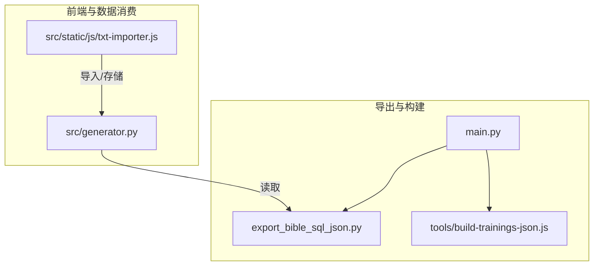
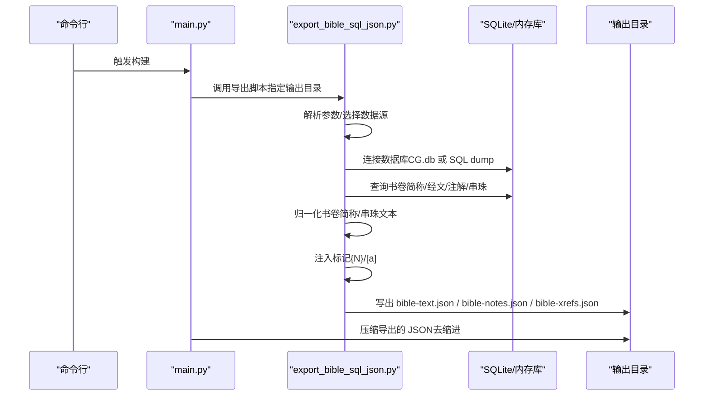
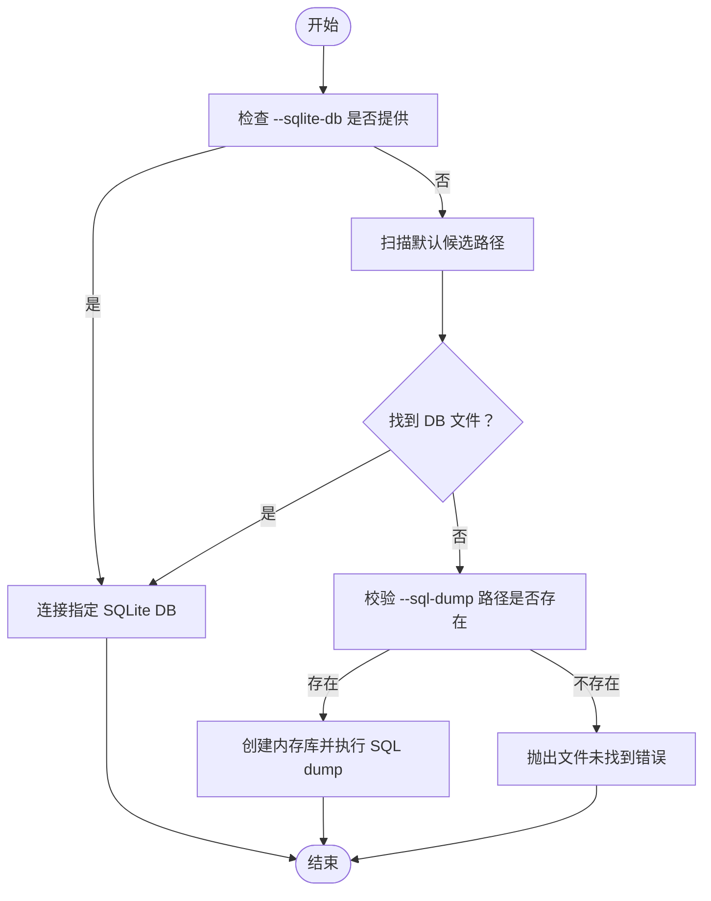
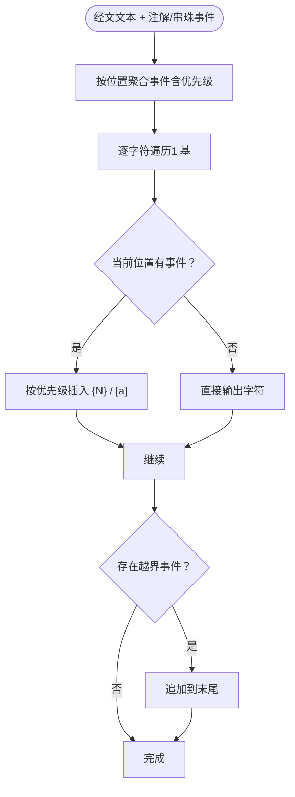
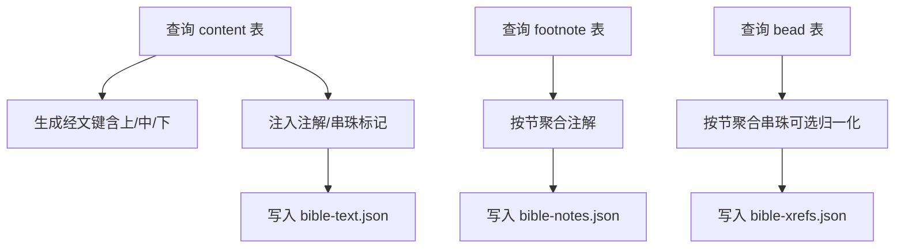
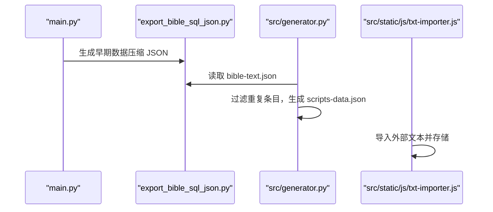
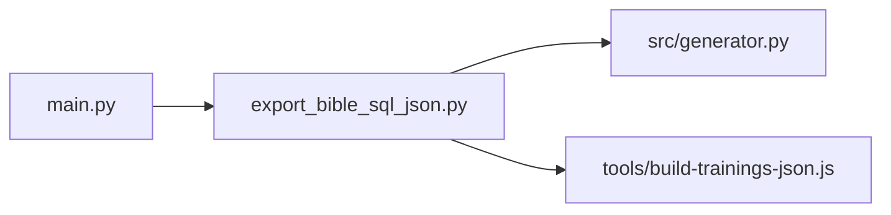

# 圣经数据导出

<cite>
**本文引用的文件**
- [export_bible_sql_json.py](file://export_bible_sql_json.py)
- [main.py](file://main.py)
- [build-trainings-json.js](file://tools/build-trainings-json.js)
- [generator.py](file://src/generator.py)
- [txt-importer.js](file://src/static/js/txt-importer.js)
</cite>

## 目录
1. [简介](#简介)
2. [项目结构](#项目结构)
3. [核心组件](#核心组件)
4. [架构总览](#架构总览)
5. [详细组件分析](#详细组件分析)
6. [依赖分析](#依赖分析)
7. [性能考虑](#性能考虑)
8. [故障排查指南](#故障排查指南)
9. [结论](#结论)
10. [附录](#附录)

## 简介
本文件为 CX 项目的“圣经数据导出”功能的综合技术文档，围绕 export_bible_sql_json.py 的实现进行深入解析，覆盖以下主题：
- 从 SQLite 数据库（或 SQL dump）抽取、转换并生成三类 JSON 的完整流程：经文文本、注解、串珠。
- 支持的圣经版本与数据来源说明。
- 导出配置项与命令行参数。
- 输出文件结构与前端应用集成方式。
- 数据验证、错误处理与性能优化建议。

## 项目结构
与“圣经数据导出”直接相关的文件与角色如下：
- export_bible_sql_json.py：导出脚本主体，负责数据库连接、查询、数据转换与 JSON 写出。
- main.py：主流程入口，在构建阶段调用导出脚本以生成早期数据，随后对导出的 JSON 进行压缩。
- tools/build-trainings-json.js：历史合辑（training.json）生成工具，与圣经数据导出形成互补。
- src/generator.py：训练数据生成器，负责将训练内容与圣经数据整合，生成补充经文数据 scripts-data.json。
- src/static/js/txt-importer.js：前端导入器，负责将外部文本导入并存储至本地存储，间接与圣经数据消费相关。

**图表来源**
- [export_bible_sql_json.py:1-508](file://export_bible_sql_json.py#L1-L508)
- [main.py:760-901](file://main.py#L760-L901)
- [build-trainings-json.js:84-110](file://tools/build-trainings-json.js#L84-L110)
- [generator.py:193-386](file://src/generator.py#L193-L386)
- [txt-importer.js:1442-1482](file://src/static/js/txt-importer.js#L1442-L1482)

**章节来源**
- [export_bible_sql_json.py:1-508](file://export_bible_sql_json.py#L1-L508)
- [main.py:760-901](file://main.py#L760-L901)

## 核心组件
- 数据源解析与连接
  - 优先尝试定位默认 SQLite 数据库文件；若未提供，则要求显式传入 SQL dump 路径。
  - 支持从内存数据库加载 SQL dump 并清理内部表定义，保证可执行性。
- 书卷简称映射与串珠文本归一化
  - 从 book_name 表提取书卷简称，优先中文简称，否则回退英文简称。
  - 串珠文本归一化采用启发式规则，将多种书写形式统一为“书:章:节[,书:章:节]...”格式。
- 标记注入与文本拼接
  - 将注解序号 {N} 与串珠标记 [a] 按 location 插入到经文文本中，支持“上/中/下”半节标记。
- 三类 JSON 导出
  - bible-text.json：带标记的经文文本，键为“书卷简称章:节上/中/下”。
  - bible-notes.json：每节注解列表，键为“书卷简称章:节”。
  - bible-xrefs.json：每节串珠映射，键为“书卷简称章:节”。

**章节来源**
- [export_bible_sql_json.py:34-107](file://export_bible_sql_json.py#L34-L107)
- [export_bible_sql_json.py:165-195](file://export_bible_sql_json.py#L165-L195)
- [export_bible_sql_json.py:198-307](file://export_bible_sql_json.py#L198-L307)
- [export_bible_sql_json.py:310-351](file://export_bible_sql_json.py#L310-L351)
- [export_bible_sql_json.py:353-477](file://export_bible_sql_json.py#L353-L477)

## 架构总览
下图展示从数据库到最终 JSON 的端到端流程，以及与主流程、前端工具的集成关系：

**图表来源**
- [main.py:770-791](file://main.py#L770-L791)
- [export_bible_sql_json.py:488-508](file://export_bible_sql_json.py#L488-L508)
- [export_bible_sql_json.py:60-71](file://export_bible_sql_json.py#L60-L71)
- [export_bible_sql_json.py:353-477](file://export_bible_sql_json.py#L353-L477)

## 详细组件分析

### 组件A：数据库连接与数据源选择
- 默认优先从项目内两个候选路径查找 SQLite 数据库文件；若未找到，则要求传入 SQL dump。
- 若使用 SQL dump，将在内存中创建临时数据库并执行脚本，同时清理内部表定义，避免后续执行报错。
- 支持直接传入 SQLite DB 文件路径，优先于 SQL dump。

**图表来源**
- [export_bible_sql_json.py:34-38](file://export_bible_sql_json.py#L34-L38)
- [export_bible_sql_json.py:60-71](file://export_bible_sql_json.py#L60-L71)
- [export_bible_sql_json.py:488-508](file://export_bible_sql_json.py#L488-L508)

**章节来源**
- [export_bible_sql_json.py:34-38](file://export_bible_sql_json.py#L34-L38)
- [export_bible_sql_json.py:60-71](file://export_bible_sql_json.py#L60-L71)
- [export_bible_sql_json.py:488-508](file://export_bible_sql_json.py#L488-L508)

### 组件B：书卷简称映射与串珠文本归一化
- 从 book_name 表读取 1..66 的书卷简称，优先中文简称，否则回退英文简称。
- 构造 token 映射，覆盖常见简写别名，提升串珠识别准确率。
- 归一化规则：
  - 清除引导词“参见”，替换标点为逗号/冒号/短横线。
  - 从长到短匹配书卷 token，支持“书 十字:节-节”、“书章节”、“章节”等多形态。
  - 支持中文数字转阿拉伯数字，处理区间与单节。

**图表来源**
- [export_bible_sql_json.py:165-195](file://export_bible_sql_json.py#L165-L195)
- [export_bible_sql_json.py:198-307](file://export_bible_sql_json.py#L198-L307)
- [export_bible_sql_json.py:110-163](file://export_bible_sql_json.py#L110-L163)

**章节来源**
- [export_bible_sql_json.py:74-107](file://export_bible_sql_json.py#L74-L107)
- [export_bible_sql_json.py:165-195](file://export_bible_sql_json.py#L165-L195)
- [export_bible_sql_json.py:198-307](file://export_bible_sql_json.py#L198-L307)
- [export_bible_sql_json.py:110-163](file://export_bible_sql_json.py#L110-L163)

### 组件C：标记注入与文本拼接
- 将注解序号 {N} 与串珠标记 [a] 按 location 插入到经文文本中，location 为 1 基。
- 对“上/中/下”半节，分别注入对应标记；flag=0 的公共标记对非 0 flag 的节同样生效。
- 超出文本长度的标记追加到末尾，避免越界。

**图表来源**
- [export_bible_sql_json.py:310-351](file://export_bible_sql_json.py#L310-L351)

**章节来源**
- [export_bible_sql_json.py:310-351](file://export_bible_sql_json.py#L310-L351)

### 组件D：三类 JSON 导出与键空间设计
- 经文文本（bible-text.json）
  - 键格式：“书卷简称章:节上/中/下”，值为带标记的经文。
  - “上/中/下”半节键用于精确标记注入与显示。
- 注解（bible-notes.json）
  - 键格式：“书卷简称章:节”，值为按序号排序的注解列表。
- 串珠（bible-xrefs.json）
  - 键格式：“书卷简称章:节”，值为“序号->串珠文本”的映射，归一化可选。

**图表来源**
- [export_bible_sql_json.py:353-477](file://export_bible_sql_json.py#L353-L477)
- [export_bible_sql_json.py:405-461](file://export_bible_sql_json.py#L405-L461)

**章节来源**
- [export_bible_sql_json.py:353-477](file://export_bible_sql_json.py#L353-L477)
- [export_bible_sql_json.py:405-461](file://export_bible_sql_json.py#L405-L461)

### 组件E：与主流程的集成与前端消费
- 主流程在构建早期调用导出脚本，生成早期数据并压缩，确保后续处理能读取。
- 训练数据生成器会读取导出的 bible-text.json，过滤重复条目，生成补充经文 scripts-data.json。
- 前端导入器负责将外部文本导入并存储，间接与圣经数据消费场景衔接。

**图表来源**
- [main.py:770-791](file://main.py#L770-L791)
- [generator.py:333-372](file://src/generator.py#L333-L372)
- [txt-importer.js:1442-1482](file://src/static/js/txt-importer.js#L1442-L1482)

**章节来源**
- [main.py:770-791](file://main.py#L770-L791)
- [generator.py:333-372](file://src/generator.py#L333-L372)
- [txt-importer.js:1442-1482](file://src/static/js/txt-importer.js#L1442-L1482)

## 依赖分析
- 外部依赖
  - Python 标准库：argparse、json、re、sqlite3、collections、dataclasses、pathlib、typing。
- 内部耦合
  - main.py 与 export_bible_sql_json.py：主流程调用导出脚本并压缩输出。
  - src/generator.py 与 export_bible_sql_json.py：生成器读取导出的经文数据，生成补充经文。
  - tools/build-trainings-json.js 与 export_bible_sql_json.py：历史合辑生成工具与经文键集合配合，生成补充经文数据。

**图表来源**
- [main.py:770-791](file://main.py#L770-L791)
- [export_bible_sql_json.py:353-477](file://export_bible_sql_json.py#L353-L477)
- [build-trainings-json.js:84-110](file://tools/build-trainings-json.js#L84-L110)

**章节来源**
- [main.py:770-791](file://main.py#L770-L791)
- [export_bible_sql_json.py:353-477](file://export_bible_sql_json.py#L353-L477)
- [build-trainings-json.js:84-110](file://tools/build-trainings-json.js#L84-L110)

## 性能考虑
- 数据库访问
  - 使用 ORDER BY 保证扫描顺序，减少内存排序开销。
  - 通过分组聚合（按节/标记）降低重复计算。
- 文本处理
  - 标记注入采用事件聚合与一次遍历，时间复杂度 O(N)。
  - 串珠归一化按最长前缀匹配，建议控制 token 数量以避免过度回溯。
- I/O 与压缩
  - 导出阶段先写出带缩进的 JSON，主流程再进行去缩进压缩，平衡可读性与体积。
- 建议
  - 在大规模数据场景下，可考虑分批导出或并行化（当前脚本为单进程）。
  - 对频繁使用的键集合（如书卷简称映射）可做缓存复用（当前已通过模块级缓存机制降低重复解析成本）。

[本节为通用性能建议，不直接分析具体代码文件]

## 故障排查指南
- 数据源问题
  - 未找到 SQLite DB 且未提供 SQL dump：请确认数据源路径或显式传入 --sql-dump。
  - SQL dump 包含内部表定义导致执行失败：脚本已内置清理逻辑，确保 dump 合法。
- 键空间与标记异常
  - 经文键缺失“上/中/下”后缀：确认 content 表 flag 字段与键生成逻辑一致。
  - 标记位置越界：检查 location 是否超过文本长度，脚本会自动追加到末尾。
- 串珠归一化不理想
  - 自定义简写较多时，建议扩展 token 映射以提升识别准确率。
- 前端消费差异
  - 若发现经文显示异常，检查 scripts-data.json 与 bible-text.json 的键一致性，确保过滤逻辑正确。

**章节来源**
- [export_bible_sql_json.py:60-71](file://export_bible_sql_json.py#L60-L71)
- [export_bible_sql_json.py:310-351](file://export_bible_sql_json.py#L310-L351)
- [export_bible_sql_json.py:165-195](file://export_bible_sql_json.py#L165-L195)
- [export_bible_sql_json.py:405-461](file://export_bible_sql_json.py#L405-L461)

## 结论
export_bible_sql_json.py 提供了从 SQLite 数据库到三类 JSON 的完整导出链路，具备清晰的数据源选择、健壮的标记注入与可选的串珠归一化能力。结合主流程的早期数据生成与压缩、生成器的补充经文过滤，以及前端导入工具的协同，形成了完整的“圣经数据导出—消费”闭环。建议在实际部署中关注数据源路径、键空间一致性与串珠归一化的可维护性，以获得稳定可靠的用户体验。

[本节为总结性内容，不直接分析具体代码文件]

## 附录

### A. 支持的圣经版本与数据来源
- 数据来源
  - 默认优先读取项目内的 SQLite 数据库文件（CG.db）。
  - 也可从 SQL dump 导出，适用于离线或迁移场景。
- 版本说明
  - 仓库未明确标注具体圣经版本号；导出逻辑基于书卷索引与标记系统，适配标准中文和合本风格的键空间。

**章节来源**
- [export_bible_sql_json.py:8-11](file://export_bible_sql_json.py#L8-L11)
- [export_bible_sql_json.py:34-38](file://export_bible_sql_json.py#L34-L38)
- [export_bible_sql_json.py:60-71](file://export_bible_sql_json.py#L60-L71)

### B. 数据格式规范
- 经文文本（bible-text.json）
  - 键：书卷简称 + 章号 + 冒号 + 节号 + “上/中/下”后缀。
  - 值：带标记的经文文本（{N} 注解序号，[a] 串珠字母）。
- 注解（bible-notes.json）
  - 键：书卷简称 + 章号 + 冒号 + 节号。
  - 值：注解列表（按序号排序）。
- 串珠（bible-xrefs.json）
  - 键：书卷简称 + 章号 + 冒号 + 节号。
  - 值：序号到串珠文本的映射；可选启用归一化。

**章节来源**
- [export_bible_sql_json.py:405-461](file://export_bible_sql_json.py#L405-L461)

### C. 导出配置选项
- --sql-dump：SQL dump 文件路径（可选）。
- --sqlite-db：SQLite DB 文件路径（可选；优先于 --sql-dump）。
- --out-dir：输出目录（默认 output/data-sql）。
- --normalize-xrefs：启用串珠文本归一化（启发式）。

**章节来源**
- [export_bible_sql_json.py:479-485](file://export_bible_sql_json.py#L479-L485)

### D. 使用方法
- 命令行
  - 直接运行导出脚本，默认从默认候选路径读取数据库，输出到默认目录。
  - 如需从 SQL dump 导出，显式传入 --sql-dump。
  - 如需指定输出目录，使用 --out-dir。
  - 如需启用串珠归一化，使用 --normalize-xrefs。
- 构建集成
  - 主流程在构建早期调用导出脚本生成早期数据，并对导出的 JSON 进行压缩。

**章节来源**
- [export_bible_sql_json.py:488-508](file://export_bible_sql_json.py#L488-L508)
- [main.py:770-791](file://main.py#L770-L791)

### E. 输出文件结构说明
- 输出目录包含三类 JSON：
  - bible-text.json：带标记的经文文本。
  - bible-notes.json：每节注解列表。
  - bible-xrefs.json：每节串珠映射。
- 主流程会在输出目录对上述 JSON 进行去缩进压缩，以减小包体体积。

**章节来源**
- [export_bible_sql_json.py:462-477](file://export_bible_sql_json.py#L462-L477)
- [main.py:784-791](file://main.py#L784-L791)

### F. 与前端应用的集成方式
- 经文键空间
  - 前端通过 scripts-data.json 与 bible-text.json 的键集合进行比对，过滤重复条目，仅保留补充经文。
- 导入与存储
  - 前端导入器负责将外部文本导入并存储至本地存储，便于离线阅读与检索。
- 训练数据渲染
  - 训练数据生成器在生成 training.json 的同时，生成 scripts-data.json，供前端渲染补充经文。

**章节来源**
- [generator.py:333-372](file://src/generator.py#L333-L372)
- [txt-importer.js:1442-1482](file://src/static/js/txt-importer.js#L1442-L1482)
- [build-trainings-json.js:84-110](file://tools/build-trainings-json.js#L84-L110)