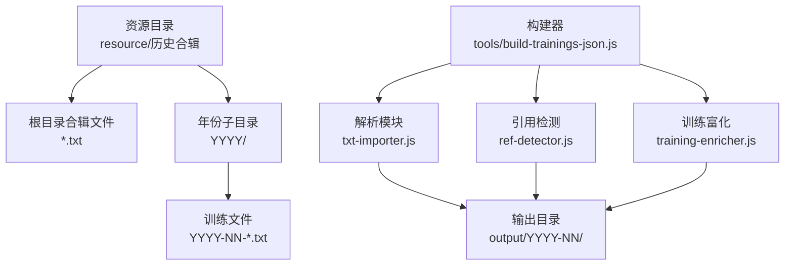
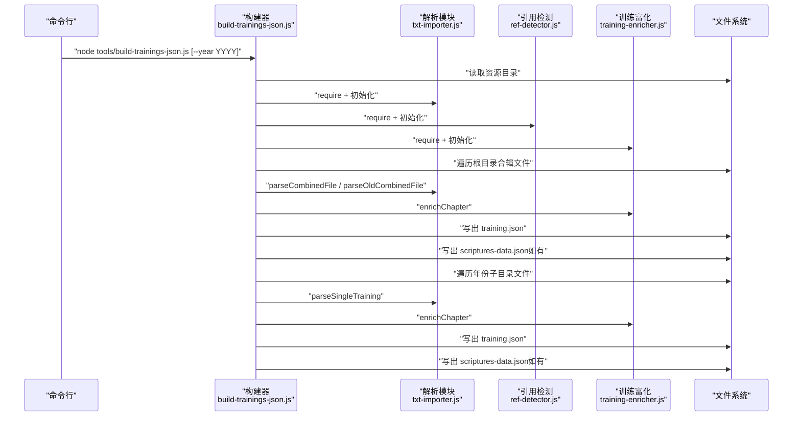
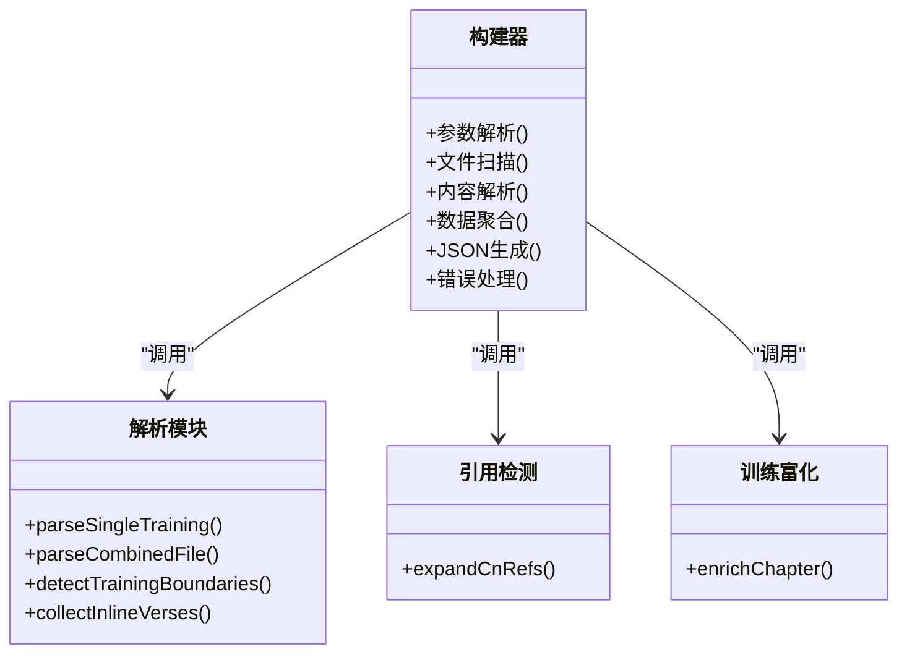
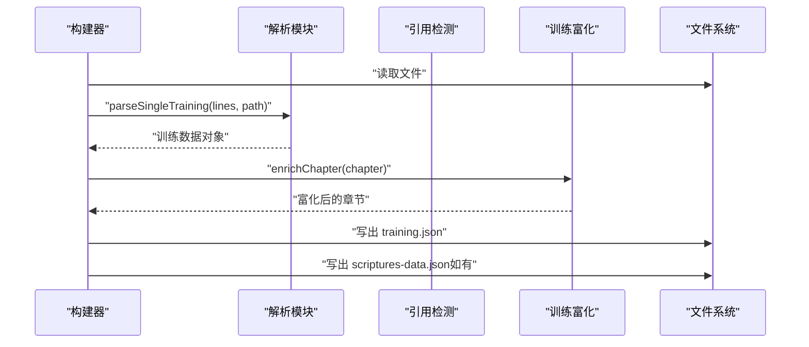
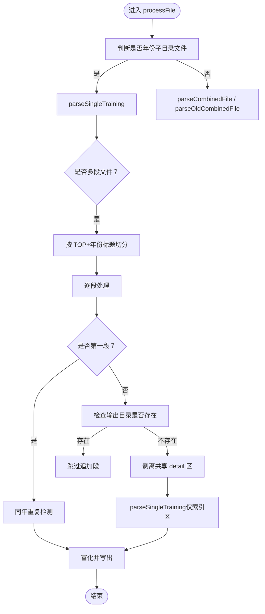
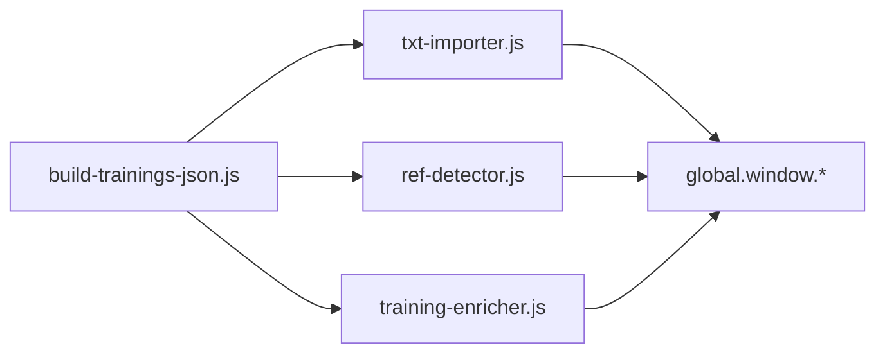

# 训练JSON构建器

<cite>
**本文档引用的文件**
- [tools/build-trainings-json.js](file://tools/build-trainings-json.js)
- [src/static/js/txt-importer.js](file://src/static/js/txt-importer.js)
- [src/static/js/ref-detector.js](file://src/static/js/ref-detector.js)
- [src/static/js/training-enricher.js](file://src/static/js/training-enricher.js)
- [resource/历史合辑](file://resource/历史合辑)
- [output](file://output)
</cite>

## 目录
1. [简介](#简介)
2. [项目结构](#项目结构)
3. [核心组件](#核心组件)
4. [架构总览](#架构总览)
5. [详细组件分析](#详细组件分析)
6. [依赖关系分析](#依赖关系分析)
7. [性能考量](#性能考量)
8. [故障排查指南](#故障排查指南)
9. [结论](#结论)
10. [附录](#附录)

## 简介
本文件面向 CX 项目的“训练JSON构建器”，系统性阐述 tools/build-trainings-json.js 的功能与实现，涵盖以下方面：
- 从 Word 文档导出的历史合辑 TXT 文件中提取训练数据，构建标准化的 training.json
- 支持的训练类型：经文、听抄、晨兴
- 数据结构设计与文件命名规范
- 工作流程：文件扫描、内容解析、数据聚合、JSON 生成
- 配置选项、自定义规则、错误处理机制
- 使用示例、调试方法与性能优化建议

该构建器替代了 Python 版本的 split_trainings.py --mode json，采用 Node.js 运行时，结合浏览器端 IIFE 模块（txt-importer.js、ref-detector.js、training-enricher.js）在服务端完成解析与富化。

## 项目结构
- 输入资源目录：resource/历史合辑
  - 根目录可包含合辑 TXT 文件（如“合辑-2025.txt”）
  - 子目录按年份组织（如“2025”、“2026”），内部为独立训练的 TXT 文件（如“YYYY-NN-*.txt”）
- 输出目录：output
  - 每个训练生成 output/{year}-{seq:02d}/training.json
  - 若存在补充经文，将在同一目录下生成 scriptures-data.json

图表来源
- [tools/build-trainings-json.js:358-414](file://tools/build-trainings-json.js#L358-L414)
- [resource/历史合辑](file://resource/历史合辑)
- [output](file://output)

章节来源
- [tools/build-trainings-json.js:72-75](file://tools/build-trainings-json.js#L72-L75)
- [tools/build-trainings-json.js:358-414](file://tools/build-trainings-json.js#L358-L414)

## 核心组件
- 构建器主程序：tools/build-trainings-json.js
  - 负责参数解析、文件扫描、调用解析与富化模块、写出 JSON
- 解析模块：src/static/js/txt-importer.js
  - 提供 parseSingleTraining、parseCombinedFile、detectTrainingBoundaries 等接口
- 引用检测：src/static/js/ref-detector.js
  - 提供 expandCnRefs 等中文经文引用扩展能力
- 训练富化：src/static/js/training-enricher.js
  - 提供 enrichChapter 对章节进行上下文与 feeding_refs 富化

章节来源
- [tools/build-trainings-json.js:35-47](file://tools/build-trainings-json.js#L35-L47)
- [tools/build-trainings-json.js:49-60](file://tools/build-trainings-json.js#L49-L60)

## 架构总览
构建器采用“服务端运行 + 浏览器端 IIFE 模块复用”的架构：
- 在 Node.js 环境下，通过 global.window 和 localforage 的 shim，模拟浏览器全局环境
- 动态 require txt-importer.js、ref-detector.js、training-enricher.js，复用其解析与富化逻辑
- 依据输入文件类型（合辑/单训练/年份子目录文件）选择不同的解析策略与边界切片

图表来源
- [tools/build-trainings-json.js:35-47](file://tools/build-trainings-json.js#L35-L47)
- [tools/build-trainings-json.js:187-355](file://tools/build-trainings-json.js#L187-L355)
- [tools/build-trainings-json.js:358-414](file://tools/build-trainings-json.js#L358-L414)

## 详细组件分析

### 文件扫描与入口控制
- 参数解析
  - 支持 --year 选项，仅处理指定年份的训练
- 目录扫描顺序
  - 先处理根目录合辑文件，再处理年份子目录文件（后者会覆盖前者同 year-seq 的输出）
- 年度重置
  - 每年重置“同年重复检测表”与“多段追加计数器”，避免跨年误判

章节来源
- [tools/build-trainings-json.js:18-25](file://tools/build-trainings-json.js#L18-L25)
- [tools/build-trainings-json.js:358-414](file://tools/build-trainings-json.js#L358-L414)

### 内容解析与数据聚合
- 合辑文件解析
  - 新格式：parseCombinedFile
  - 旧格式：isOldCombinedFormat + parseOldCombinedFile
  - 单训练退化场景：尝试从文件名提取年份/序号并补全 path
- 年份子目录文件解析
  - parseSingleTraining
  - 支持“多段文件”：通过“TOP”行 + 年份标题边界识别多个训练段
  - 追加段处理：使用“本年最大 seq + 累计追加计数”分配序号，避免与既有文件冲突
- 边界切片
  - 合辑新格式：detectTrainingBoundaries 切分各训练文本区间
  - 旧格式：基于“回页首”“TOP-目录”等标记切分

章节来源
- [tools/build-trainings-json.js:267-351](file://tools/build-trainings-json.js#L267-L351)
- [tools/build-trainings-json.js:142-184](file://tools/build-trainings-json.js#L142-L184)

### 数据结构设计与文件命名规范
- 输出路径
  - output/{year}-{seq:02d}/training.json
  - output/{year}-{seq:02d}/js/scriptures-data.json（补充经文）
- 字段规范化
  - 源标识简称替换：如将“李常受文集”替换为“CWWL”，“生命读经”替换为“L-S”
- 训练类型
  - 经文：章节内容与经文引用
  - 听抄：章节内容与听抄相关字段
  - 晨兴：章节内容与 feeding_refs/context 富化

章节来源
- [tools/build-trainings-json.js:118-134](file://tools/build-trainings-json.js#L118-L134)
- [tools/build-trainings-json.js:137-140](file://tools/build-trainings-json.js#L137-L140)

### 多语言与引用处理
- 引用检测
  - expandCnRefs 将中文经文引用扩展为标准格式，供后续富化使用
- 富化流程
  - enrichChapter 对章节进行上下文与 feeding_refs 富化
- 补充经文
  - 仅写出在 output/data/bible-text.json 中不存在的经文条目，避免重复

章节来源
- [tools/build-trainings-json.js:104-116](file://tools/build-trainings-json.js#L104-L116)
- [tools/build-trainings-json.js:89-102](file://tools/build-trainings-json.js#L89-L102)

### 错误处理与重复检测
- 读取失败：记录警告并跳过
- 解析失败：记录警告并跳过
- 同年重复检测：对“前3章标题组合”建立签名，若重复则跳过并清理旧目录
- 多段文件保护：若追加段对应输出目录已存在，跳过以保留完整合辑版本

章节来源
- [tools/build-trainings-json.js:187-265](file://tools/build-trainings-json.js#L187-L265)
- [tools/build-trainings-json.js:240-255](file://tools/build-trainings-json.js#L240-L255)

### 类关系图（代码级）

图表来源
- [tools/build-trainings-json.js:35-47](file://tools/build-trainings-json.js#L35-L47)
- [tools/build-trainings-json.js:187-355](file://tools/build-trainings-json.js#L187-L355)

### 序列图：单训练文件处理流程

图表来源
- [tools/build-trainings-json.js:231-265](file://tools/build-trainings-json.js#L231-L265)
- [tools/build-trainings-json.js:137-140](file://tools/build-trainings-json.js#L137-L140)

### 流程图：多段文件与追加段处理

图表来源
- [tools/build-trainings-json.js:142-184](file://tools/build-trainings-json.js#L142-L184)
- [tools/build-trainings-json.js:187-265](file://tools/build-trainings-json.js#L187-L265)

## 依赖关系分析
- 模块依赖
  - 构建器依赖 txt-importer.js、ref-detector.js、training-enricher.js
  - 三者均通过 IIFE 暴露到 global.window（如 CXLocalImport、CXRef、CXEnricher）
- 运行时依赖
  - Node.js fs、path
  - 浏览器全局 shim（global.window、localforage）

图表来源
- [tools/build-trainings-json.js:35-47](file://tools/build-trainings-json.js#L35-L47)

章节来源
- [tools/build-trainings-json.js:35-47](file://tools/build-trainings-json.js#L35-L47)

## 性能考量
- IIFE 模块加载开销
  - 构建器在每次运行时动态 require 三个模块，建议在 CI 中缓存 node_modules 以减少冷启动时间
- 文件读取与写入
  - 采用同步 API（readFileSync/writeFileSync），适合一次性构建任务；若处理大量文件，可考虑异步化以提升吞吐
- 重复检测与边界切片
  - 年度重置“同年重复检测表”避免跨年误判，减少无效富化与写出
- 经文过滤
  - 仅写出 bible-text.json 中缺失的补充经文，降低输出体积与冗余

[本节为通用性能建议，不直接分析具体文件，故无章节来源]

## 故障排查指南
- 模块未正确暴露
  - 现象：构建器提示“未正确暴露 parseSingleTraining/expandCnRefs/enrichChapter”
  - 排查：确认 txt-importer.js、ref-detector.js、training-enricher.js 已正确加载且在 global.window 上暴露目标函数
- 文件读取失败
  - 现象：日志出现“读取失败”警告
  - 排查：检查文件权限、编码（UTF-8）、路径拼接
- 解析失败
  - 现象：日志出现“解析失败”警告
  - 排查：核对输入格式（合辑/单训练/旧格式）、边界标记、文件名年份/序号
- 同年重复被跳过
  - 现象：日志出现“跳过重复”警告并清理旧目录
  - 排查：确认前3章标题组合是否确实重复；必要时调整输入文件或年份
- 追加段未写出
  - 现象：日志出现“跳过额外段”
  - 排查：确认合辑文件是否已完整写出对应输出目录；追加段仅在输出目录不存在时生效

章节来源
- [tools/build-trainings-json.js:49-60](file://tools/build-trainings-json.js#L49-L60)
- [tools/build-trainings-json.js:190-195](file://tools/build-trainings-json.js#L190-L195)
- [tools/build-trainings-json.js:272-276](file://tools/build-trainings-json.js#L272-L276)
- [tools/build-trainings-json.js:242-254](file://tools/build-trainings-json.js#L242-L254)
- [tools/build-trainings-json.js:222-229](file://tools/build-trainings-json.js#L222-L229)

## 结论
训练JSON构建器通过复用浏览器端 IIFE 模块，在 Node.js 环境中高效完成历史合辑 TXT 的解析与富化，统一生成标准化的 training.json 与补充经文数据。其设计兼顾兼容性（支持旧/新合辑格式）、健壮性（重复检测、边界切片、错误处理）与可维护性（模块化、清晰的文件命名规范）。配合合理的性能优化与调试策略，可在大规模训练数据场景下稳定产出高质量的训练资源。

[本节为总结性内容，不直接分析具体文件，故无章节来源]

## 附录

### 使用示例
- 基本用法
  - 运行：node tools/build-trainings-json.js
  - 仅处理某一年：node tools/build-trainings-json.js --year 2025
- 输出位置
  - 训练 JSON：output/{year}-{seq:02d}/training.json
  - 补充经文：output/{year}-{seq:02d}/js/scriptures-data.json

章节来源
- [tools/build-trainings-json.js:9-11](file://tools/build-trainings-json.js#L9-L11)
- [tools/build-trainings-json.js:122-134](file://tools/build-trainings-json.js#L122-L134)

### 配置选项与自定义规则
- 命令行参数
  - --year：限定处理年份
- 文件命名规范
  - 年份子目录文件：YYYY-NN-*.txt，其中 NN 为序号（两位）
  - 输出目录：YYYY-NN（序号两位左填充）
- 自定义规则
  - 源标识简称替换：如“李常受文集”→“CWWL”、“生命读经”→“L-S”
  - 多段文件追加：当同一合辑文件包含多个训练时，追加段使用“本年最大序号 + 累计追加计数”

章节来源
- [tools/build-trainings-json.js:18-25](file://tools/build-trainings-json.js#L18-L25)
- [tools/build-trainings-json.js:118-120](file://tools/build-trainings-json.js#L118-L120)
- [tools/build-trainings-json.js:215-219](file://tools/build-trainings-json.js#L215-L219)