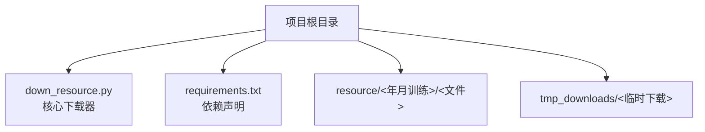
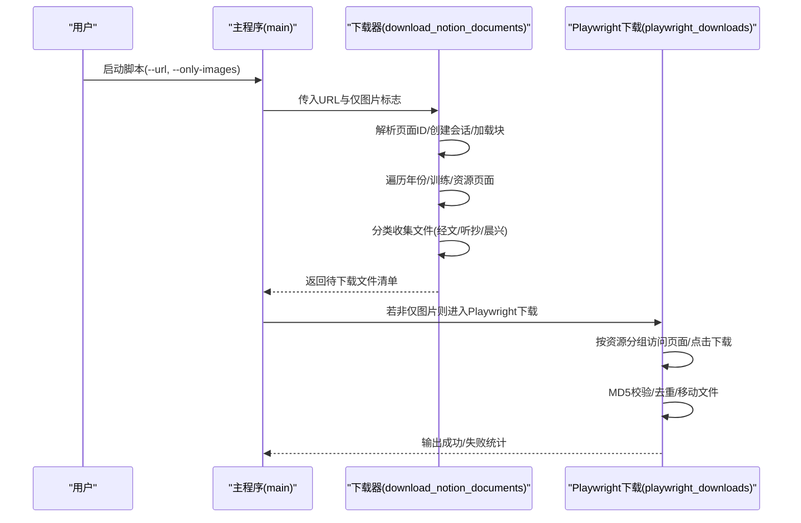
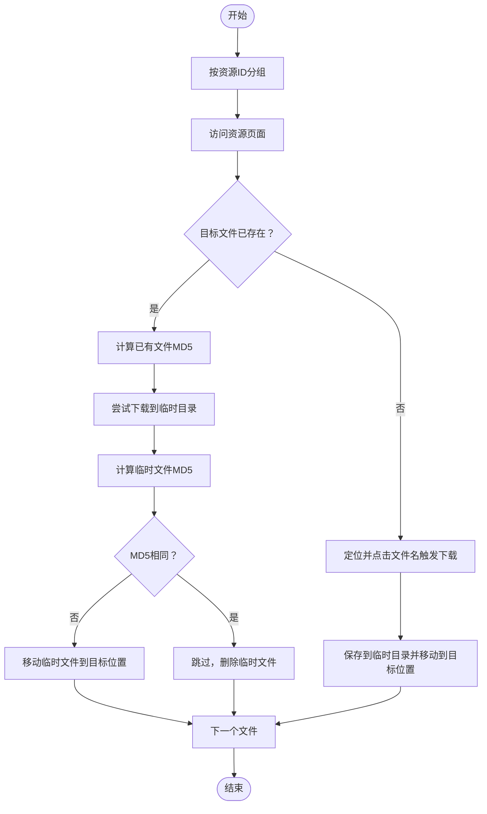
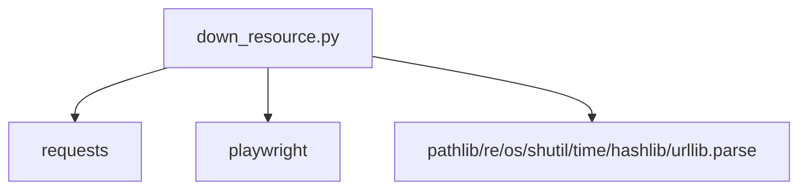

# 资源下载器

<cite>
**本文引用的文件**
- [down_resource.py](file://down_resource.py)
- [requirements.txt](file://requirements.txt)
</cite>

## 目录
1. [简介](#简介)
2. [项目结构](#项目结构)
3. [核心组件](#核心组件)
4. [架构总览](#架构总览)
5. [详细组件分析](#详细组件分析)
6. [依赖分析](#依赖分析)
7. [性能考虑](#性能考虑)
8. [故障排查指南](#故障排查指南)
9. [结论](#结论)
10. [附录](#附录)

## 简介
本文件面向CX项目的“资源下载器”模块，聚焦于down_resource.py的功能与实现细节。该模块用于自动化从Notion页面抓取训练资源，包括：
- 自动解析Notion页面ID
- 遍历年份页面，筛选指定时间范围内的训练页面
- 定位资源页面，按“经文/听抄/晨兴”分类收集文件
- 下载标语诗歌图片
- 提供两种下载方式：基于requests的直链获取与基于Playwright的浏览器驱动下载
- 支持MD5校验与去重，避免重复下载

## 项目结构
资源下载器位于仓库根目录，核心入口为down_resource.py；外部依赖通过requirements.txt声明。

图表来源
- [down_resource.py:1-774](file://down_resource.py#L1-L774)
- [requirements.txt](file://requirements.txt)

章节来源
- [down_resource.py:1-774](file://down_resource.py#L1-L774)

## 核心组件
- Notion页面ID解析：从传入URL中提取标准UUID格式的pageId
- 页面块加载：通过Notion API分页加载页面块数据
- 年份与训练筛选：遍历年份页面，筛选指定起始年月之后的训练
- 资源页面定位：在训练下查找标题包含“资源”的子页面
- 文件分类与收集：按标题识别“经文/听抄/晨兴”，过滤简体中文且带经文标注的doc/docx
- 图片下载：从标语页面提取图片并保存
- 下载执行：
  - requests方式：通过签名直链下载（当前代码主要以Playwright为主）
  - Playwright方式：模拟浏览器点击触发下载，支持MD5校验与去重

章节来源
- [down_resource.py:46-457](file://down_resource.py#L46-L457)
- [down_resource.py:558-733](file://down_resource.py#L558-L733)

## 架构总览
整体工作流分为两阶段：
- 解析与收集阶段：解析Notion页面，遍历年份/训练/资源页面，收集待下载文件清单
- 下载阶段：使用Playwright批量下载，结合MD5校验保证幂等

图表来源
- [down_resource.py:402-457](file://down_resource.py#L402-L457)
- [down_resource.py:558-733](file://down_resource.py#L558-L733)

## 详细组件分析

### 页面ID解析与会话管理
- 页面ID解析：支持从URL路径末尾的32位十六进制或标准UUID格式提取
- 会话管理：统一注入Notion头部与可选cookie(token_v2)，便于API访问

章节来源
- [down_resource.py:55-66](file://down_resource.py#L55-L66)
- [down_resource.py:46-52](file://down_resource.py#L46-L52)

### 页面块加载与导航
- 加载页面块：POST Notion API，返回block数据并进行扁平化处理
- 导航函数：根据block的children字段遍历子项，按类型与标题筛选

章节来源
- [down_resource.py:69-89](file://down_resource.py#L69-L89)
- [down_resource.py:92-99](file://down_resource.py#L92-L99)

### 年份与训练筛选
- 年份页面识别：标题以“年”结尾的页面即视为年份页面
- 训练筛选：匹配形如YYYY-MM的标题，限定最小年月范围

章节来源
- [down_resource.py:111-121](file://down_resource.py#L111-L121)
- [down_resource.py:124-134](file://down_resource.py#L124-L134)
- [down_resource.py:102-109](file://down_resource.py#L102-L109)

### 资源页面与标语页面定位
- 资源页面：标题包含“资源”的子页面
- 标语页面：标题包含“标语”的子页面，用于提取图片

章节来源
- [down_resource.py:137-147](file://down_resource.py#L137-L147)
- [down_resource.py:150-160](file://down_resource.py#L150-L160)

### 文件分类与收集
- 分类逻辑：依据标题关键字识别“经文/听抄/晨兴”
- 过滤条件：扩展名必须为.doc/.docx；简体中文文件；经文类需包含特定标注
- 收集字段：文件名、file_id、block_id、构建后的附件直链

章节来源
- [down_resource.py:163-196](file://down_resource.py#L163-L196)
- [down_resource.py:199-217](file://down_resource.py#L199-L217)
- [down_resource.py:219-226](file://down_resource.py#L219-L226)
- [down_resource.py:228-240](file://down_resource.py#L228-L240)
- [down_resource.py:242-251](file://down_resource.py#L242-L251)
- [down_resource.py:253-256](file://down_resource.py#L253-L256)
- [down_resource.py:258-269](file://down_resource.py#L258-L269)

### 图片下载（标语诗歌）
- 从标语页面提取图片源，构造重定向URL并下载
- 保存命名：标语诗歌.ext、标语诗歌2.ext、...

章节来源
- [down_resource.py:335-399](file://down_resource.py#L335-L399)

### 下载清单生成
- 生成Playwright下载清单：为每个文件构造file_id、目标文件名、所属训练/资源信息
- 多文件命名策略：单文件用“类别.doc/.docx”，多文件用“类别2.doc”等

章节来源
- [down_resource.py:304-333](file://down_resource.py#L304-L333)

### Playwright下载流程
- 分组策略：按resource_id分组，减少页面切换
- 页面访问：打开资源页面，等待DOM加载
- 下载策略：对每个文件尝试多种选择器定位并触发下载
- MD5校验：若目标文件存在，先计算MD5；下载到临时目录后对比，相同则跳过，不同则覆盖
- 清理：完成后删除临时目录

图表来源
- [down_resource.py:572-733](file://down_resource.py#L572-L733)

章节来源
- [down_resource.py:558-733](file://down_resource.py#L558-L733)

### MD5校验与去重
- 计算MD5：逐块读取文件内容，避免大文件内存压力
- 去重策略：若目标文件MD5与新下载一致，则跳过；不一致则覆盖

章节来源
- [down_resource.py:271-284](file://down_resource.py#L271-L284)
- [down_resource.py:531-556](file://down_resource.py#L531-L556)

### 错误处理与容错
- 页面ID解析失败：提示无法解析
- 未找到年份/训练/资源页面：输出相应提示
- Playwright不可用：提示安装与初始化步骤
- 下载失败：记录状态码并继续处理其他文件
- MD5校验异常：保留原文件并继续

章节来源
- [down_resource.py:402-457](file://down_resource.py#L402-L457)
- [down_resource.py:558-733](file://down_resource.py#L558-L733)

## 依赖分析
- requests：用于会话管理、API请求与图片下载
- playwright：用于模拟浏览器下载，支持选择器定位与下载事件监听
- 标准库：argparse、pathlib、hashlib、urllib.parse、time、shutil、re、os等

图表来源
- [down_resource.py:11-17](file://down_resource.py#L11-L17)
- [requirements.txt](file://requirements.txt)

章节来源
- [down_resource.py:11-17](file://down_resource.py#L11-L17)
- [requirements.txt](file://requirements.txt)

## 性能考虑
- 分组下载：按资源ID分组减少页面切换次数
- 选择器降级：多种选择器尝试，提升稳定性
- 临时目录：先下载到临时目录再移动，降低并发写入风险
- MD5校验：避免重复下载，节省带宽与时间
- 超时控制：API请求与页面加载均设置超时，防止阻塞

## 故障排查指南
- 无法解析页面ID
  - 确认传入URL为标准Notion页面链接，且路径末尾包含32位十六进制或标准UUID
  - 参考：[页面ID解析:55-66](file://down_resource.py#L55-L66)
- 未找到年份/训练/资源页面
  - 检查Notion页面结构是否包含“年”、“资源”等关键词
  - 确认时间范围参数是否正确
  - 参考：[年份筛选:111-121](file://down_resource.py#L111-L121)、[训练筛选:124-134](file://down_resource.py#L124-L134)、[资源页面定位:137-147](file://down_resource.py#L137-L147)
- 未找到标语页面
  - 标语页面标题需包含“标语”，否则不会下载图片
  - 参考：[标语页面定位:150-160](file://down_resource.py#L150-L160)
- Playwright未安装或无法下载
  - 安装并初始化：pip install playwright && playwright install chromium
  - 参考：[Playwright可用性检测:37-43](file://down_resource.py#L37-L43)、[Playwright下载入口:558-733](file://down_resource.py#L558-L733)
- 下载失败或404
  - 使用Playwright下载更稳定；若仍失败，检查文件名与选择器映射
  - 参考：[Playwright下载流程:558-733](file://down_resource.py#L558-L733)
- 重复下载或文件未更新
  - 启用MD5校验，相同MD5将跳过
  - 参考：[MD5校验:271-284](file://down_resource.py#L271-L284)、[Playwright MD5比较:617-668](file://down_resource.py#L617-L668)

章节来源
- [down_resource.py:55-66](file://down_resource.py#L55-L66)
- [down_resource.py:111-147](file://down_resource.py#L111-L147)
- [down_resource.py:150-160](file://down_resource.py#L150-L160)
- [down_resource.py:37-43](file://down_resource.py#L37-L43)
- [down_resource.py:558-733](file://down_resource.py#L558-L733)
- [down_resource.py:271-284](file://down_resource.py#L271-L284)

## 结论
该下载器以清晰的分层设计实现了从Notion页面到本地资源的自动化采集，具备以下特点：
- 稳健的页面解析与导航能力
- 精细的文件分类与过滤策略
- 可靠的下载执行与MD5去重
- 可选的Playwright驱动下载，适配复杂页面交互

建议在生产环境中：
- 设置NOTION_TOKEN环境变量以提高访问成功率
- 使用--only-images快速获取图片资源
- 定期清理tmp_downloads临时目录

## 附录

### 配置选项
- --url：Notion页面URL（默认使用内置BASE_URL）
- --only-images：仅下载标语诗歌图片，跳过Word文档

章节来源
- [down_resource.py:736-749](file://down_resource.py#L736-L749)

### 文件命名规则
- 单文件：类别.doc 或 类别.docx
- 多文件：类别2.doc、类别3.doc、...
- 图片：标语诗歌.ext、标语诗歌2.ext、...

章节来源
- [down_resource.py:312-319](file://down_resource.py#L312-L319)
- [down_resource.py:392-399](file://down_resource.py#L392-L399)

### 使用示例
- 下载全部资源（含图片与Word文档）
  - python down_resource.py
- 仅下载图片
  - python down_resource.py --only-images
- 指定URL
  - python down_resource.py --url "<你的Notion页面URL>"

章节来源
- [down_resource.py:736-749](file://down_resource.py#L736-L749)