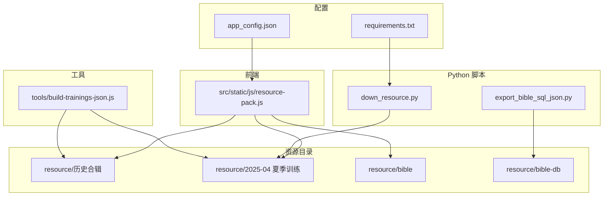
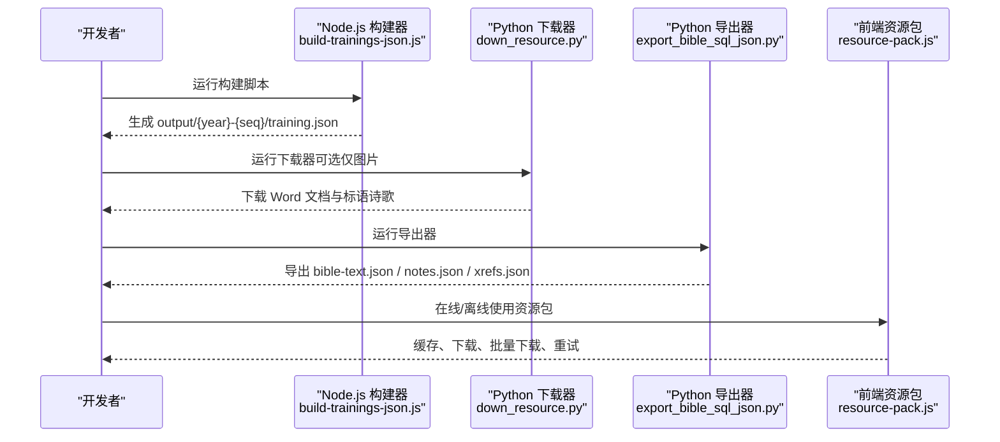
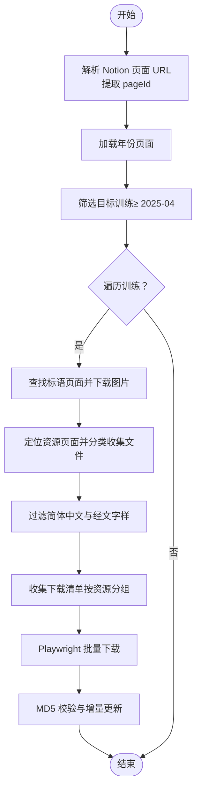
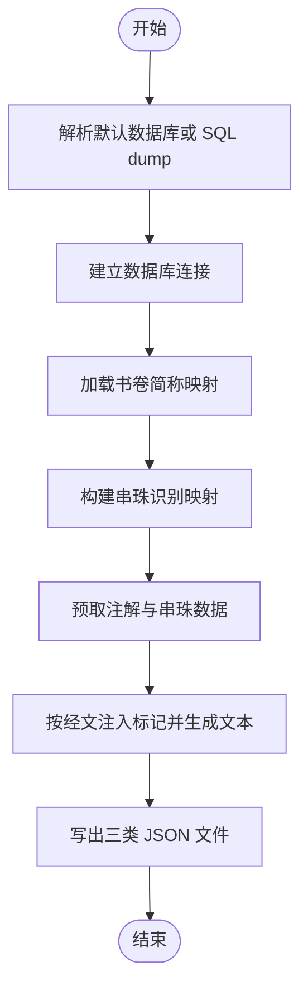
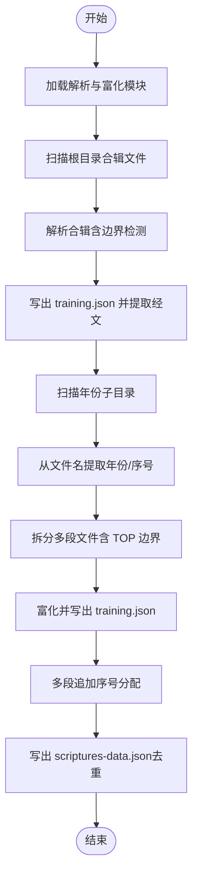
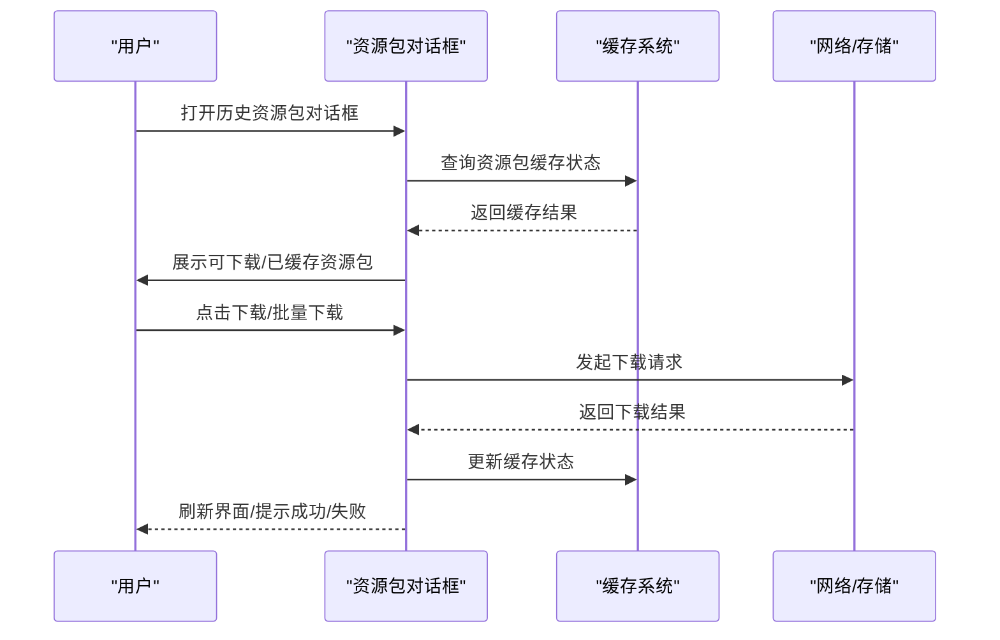
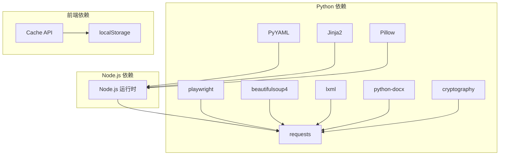

# 资源包管理

<cite>
**本文引用的文件**
- [down_resource.py](file://down_resource.py)
- [export_bible_sql_json.py](file://export_bible_sql_json.py)
- [build-trainings-json.js](file://tools/build-trainings-json.js)
- [resource-pack.js](file://src/static/js/resource-pack.js)
- [app_config.json](file://app_config.json)
- [requirements.txt](file://requirements.txt)
</cite>

## 目录
1. [简介](#简介)
2. [项目结构](#项目结构)
3. [核心组件](#核心组件)
4. [架构总览](#架构总览)
5. [详细组件分析](#详细组件分析)
6. [依赖分析](#依赖分析)
7. [性能考虑](#性能考虑)
8. [故障排除指南](#故障排除指南)
9. [结论](#结论)
10. [附录](#附录)

## 简介
本文件面向 CX 项目的资源包管理系统，系统性阐述资源包的生成逻辑、历史训练文档处理、资源文件组织与优化、下载机制、数据导出流程、前端资源包管理、版本与更新策略，以及如何新增训练资源与维护现有资源包。读者可据此高效地构建与维护资源包，确保资源一致性与可维护性。

## 项目结构
资源包管理涉及以下关键目录与文件：
- 资源目录 resource：包含历史合辑、现代训练、圣经 HTML、数据库等
- 工具目录 tools：包含构建训练 JSON 的 Node.js 脚本
- Python 脚本：下载资源与导出数据
- 前端 JS：资源包下载与缓存管理
- 应用配置：应用名称、ID、版本

**图表来源**
- [down_resource.py](file://down_resource.py)
- [export_bible_sql_json.py](file://export_bible_sql_json.py)
- [build-trainings-json.js](file://tools/build-trainings-json.js)
- [resource-pack.js](file://src/static/js/resource-pack.js)
- [app_config.json](file://app_config.json)
- [requirements.txt](file://requirements.txt)

**章节来源**
- [down_resource.py](file://down_resource.py)
- [export_bible_sql_json.py](file://export_bible_sql_json.py)
- [build-trainings-json.js](file://tools/build-trainings-json.js)
- [resource-pack.js](file://src/static/js/resource-pack.js)
- [app_config.json](file://app_config.json)
- [requirements.txt](file://requirements.txt)

## 核心组件
- 资源下载器（Python）：从 Notion 页面抓取训练资源（经文、听抄、晨兴、标语诗歌），并进行筛选与下载。
- 数据导出器（Python）：从 SQLite/SQL dump 导出经文、注解、串珠 JSON，供前端使用。
- 训练 JSON 构建器（Node.js）：解析历史合辑 TXT，生成各训练的 training.json，并补充经文数据。
- 前端资源包管理（JS）：负责资源包的缓存、下载、批量下载与对话框交互。
- 应用配置与依赖：定义应用标识与版本，声明运行所需依赖。

**章节来源**
- [down_resource.py](file://down_resource.py)
- [export_bible_sql_json.py](file://export_bible_sql_json.py)
- [build-trainings-json.js](file://tools/build-trainings-json.js)
- [resource-pack.js](file://src/static/js/resource-pack.js)
- [app_config.json](file://app_config.json)
- [requirements.txt](file://requirements.txt)

## 架构总览
资源包管理的端到端流程如下：
- 历史训练资源：通过 Node.js 脚本解析 TXT，生成 training.json 与补充经文数据。
- 现代训练资源：通过 Python 脚本从 Notion 抓取 Word 文档与图片，按训练目录组织。
- 圣经数据：通过 Python 脚本从 SQLite/SQL dump 导出经文、注解、串珠 JSON。
- 前端资源包：前端 JS 负责资源包的缓存与下载，支持批量下载与重试。

**图表来源**
- [build-trainings-json.js](file://tools/build-trainings-json.js)
- [down_resource.py](file://down_resource.py)
- [export_bible_sql_json.py](file://export_bible_sql_json.py)
- [resource-pack.js](file://src/static/js/resource-pack.js)

## 详细组件分析

### 资源下载器（down_resource.py）
职责与流程：
- 从 Notion 页面解析年份与训练列表，筛选目标日期后的训练。
- 定位“资源”页面，按“经文/听抄/晨兴”分类收集文件。
- 过滤简体中文且带有经文字样的文档，优先保留含“transcript”的听抄文件。
- 下载标语诗歌图片并保存至对应训练目录。
- 使用 Playwright 批量下载 Word 文档，支持 MD5 校验与断点续传式更新。

**图表来源**
- [down_resource.py](file://down_resource.py)

**章节来源**
- [down_resource.py](file://down_resource.py)

### 数据导出器（export_bible_sql_json.py）
职责与流程：
- 优先从默认 SQLite 数据库（bible-db/CG.db）读取，也可从 SQL dump 导入。
- 读取书卷简称映射，构建串珠文本识别映射。
- 从 content 表读取经文，按 flag 注入注解序号与串珠字母标记。
- 导出三类 JSON：bible-text.json（带标记）、bible-notes.json（注解）、bible-xrefs.json（串珠）。
- 支持串珠文本归一化（启发式）。

**图表来源**
- [export_bible_sql_json.py](file://export_bible_sql_json.py)

**章节来源**
- [export_bible_sql_json.py](file://export_bible_sql_json.py)

### 训练 JSON 构建器（build-trainings-json.js）
职责与流程：
- 加载浏览器端解析模块（txt-importer、ref-detector、training-enricher）。
- 遍历 resource/历史合辑 目录，解析 TXT 文件，生成 output/{year}-{seq}/training.json。
- 支持多段文件追加（同一文件内含多个训练），并避免与合辑文件冲突。
- 写出补充经文 scriptures-data.json（仅当不在 bible-text.json 中出现时）。
- 提供按年过滤参数（--year YYYY）。

**图表来源**
- [build-trainings-json.js](file://tools/build-trainings-json.js)

**章节来源**
- [build-trainings-json.js](file://tools/build-trainings-json.js)

### 前端资源包管理（resource-pack.js）
职责与流程：
- 提供资源包对话框（默认/历史/导入三个标签页），支持按资源包下载与批量下载。
- 通过 Cache API 与 localStorage 管理缓存，判断资源包是否已缓存。
- 下载失败时提供重试按钮；下载完成后刷新首页网格。
- 支持显示资源包大小、条目数量等信息。

**图表来源**
- [resource-pack.js](file://src/static/js/resource-pack.js)

**章节来源**
- [resource-pack.js](file://src/static/js/resource-pack.js)

## 依赖分析
- Python 运行时依赖：requests、playwright、beautifulsoup4、lxml、python-docx、PyYAML、Jinja2、Pillow、cryptography 等。
- Node.js 运行时：通过 require 加载浏览器端解析模块，实现与前端一致的解析逻辑。
- 前端：依赖 Cache API 与 localStorage 实现资源包缓存与状态持久化。

**图表来源**
- [requirements.txt](file://requirements.txt)
- [down_resource.py](file://down_resource.py)
- [export_bible_sql_json.py](file://export_bible_sql_json.py)
- [build-trainings-json.js](file://tools/build-trainings-json.js)
- [resource-pack.js](file://src/static/js/resource-pack.js)

**章节来源**
- [requirements.txt](file://requirements.txt)

## 性能考虑
- 下载阶段：使用 Playwright 批量下载并结合 MD5 校验，避免重复下载与网络浪费；按资源页面分组访问，减少页面切换成本。
- 导出阶段：预取注解与串珠数据，按 flag 合并注入，降低多次查询开销；串珠归一化采用启发式，兼顾准确性与性能。
- 构建阶段：Node.js 脚本按年预计算最大序号，避免与既有资源包冲突；多段文件追加时剥离共享 detail 区，提升解析效率。
- 前端阶段：缓存命中优先，批量下载减少请求次数；失败重试与进度反馈提升用户体验。

## 故障排除指南
- 下载器无法解析页面 ID：确认 Notion 页面 URL 正确，必要时设置环境变量 token_v2。
- Playwright 未安装：根据提示安装并初始化浏览器驱动。
- 下载失败或 404：检查文件是否被删除或权限变更；使用重试功能或手动清理缓存后重新下载。
- 导出器找不到数据库：确认默认路径存在 CG.db，或显式传入 --sqlite-db。
- Node.js 解析报错：检查 TXT 文件格式是否符合预期；确认解析模块已正确加载。
- 前端资源包未显示：检查缓存状态与网络状态；尝试清除缓存后重试。

**章节来源**
- [down_resource.py](file://down_resource.py)
- [export_bible_sql_json.py](file://export_bible_sql_json.py)
- [build-trainings-json.js](file://tools/build-trainings-json.js)
- [resource-pack.js](file://src/static/js/resource-pack.js)

## 结论
资源包管理系统通过“历史合辑解析 + 现代训练下载 + 圣经数据导出 + 前端缓存管理”的闭环，实现了资源的自动化生成与高效分发。遵循本文的命名规范、版本策略与维护流程，可确保资源包的稳定性与可扩展性。

## 附录

### 资源文件命名与组织规则
- 现代训练目录：按“YYYY-MM 名称”组织，名称中包含月份与活动名称，便于筛选与排序。
- 历史合辑：按“年份子目录 + TXT 文件”，文件名包含“年-序-主题”等信息，便于解析与去重。
- 圣经 HTML：按编号命名，便于快速检索与索引。
- 输出目录：Node.js 构建器输出到 output/{year}-{seq}，包含 training.json 与 scriptures-data.json；导出器输出到 output/data-sql。

**章节来源**
- [build-trainings-json.js](file://tools/build-trainings-json.js)
- [down_resource.py](file://down_resource.py)

### 版本管理与更新策略
- 应用版本：通过 app_config.json 统一管理应用名称、ID 与版本号。
- 资源包版本：前端通过 Cache API 与 localStorage 管理缓存版本；建议在资源包结构或关键文件名中引入版本号，便于升级与回滚。
- 更新策略：优先增量更新（MD5 校验），失败重试；批量下载用于首次安装或全量更新；导出器支持从 SQLite 或 SQL dump 两种数据源，确保数据一致性。

**章节来源**
- [app_config.json](file://app_config.json)
- [resource-pack.js](file://src/static/js/resource-pack.js)
- [export_bible_sql_json.py](file://export_bible_sql_json.py)

### 使用方法与配置选项
- 构建训练 JSON（Node.js）：
  - 用法：node tools/build-trainings-json.js [--year YYYY]
  - 功能：解析历史合辑 TXT，生成 training.json 与 scriptures-data.json。
- 下载资源（Python）：
  - 用法：python down_resource.py [--url URL] [--only-images]
  - 功能：从 Notion 下载 Word 文档与标语诗歌图片，支持仅图片模式。
- 导出圣经数据（Python）：
  - 用法：python export_bible_sql_json.py [--sqlite-db PATH] [--sql-dump PATH] [--out-dir DIR] [--normalize-xrefs]
  - 功能：从 SQLite/SQL dump 导出经文、注解、串珠 JSON。
- 前端资源包管理（JS）：
  - 功能：打开资源包对话框，支持默认/历史/导入标签页，批量下载与重试。

**章节来源**
- [build-trainings-json.js](file://tools/build-trainings-json.js)
- [down_resource.py](file://down_resource.py)
- [export_bible_sql_json.py](file://export_bible_sql_json.py)
- [resource-pack.js](file://src/static/js/resource-pack.js)

### 新增训练资源与维护流程
- 新增历史训练：
  - 在 resource/历史合辑 下创建年份子目录与 TXT 文件，确保文件名包含年份与序号信息。
  - 运行 Node.js 构建器生成 training.json；如包含补充经文，自动写出 scriptures-data.json。
- 新增现代训练：
  - 在 Notion 创建训练页面，按“资源/标语”页面组织 Word 文档与图片。
  - 运行 Python 下载器，按训练目录生成 Word 文档与标语图片。
- 维护现有资源包：
  - 前端资源包对话框支持批量下载与重试；缓存命中优先，避免重复下载。
  - 导出器支持从 SQLite 或 SQL dump 导出，确保数据一致性与可追溯性。

**章节来源**
- [build-trainings-json.js](file://tools/build-trainings-json.js)
- [down_resource.py](file://down_resource.py)
- [export_bible_sql_json.py](file://export_bible_sql_json.py)
- [resource-pack.js](file://src/static/js/resource-pack.js)