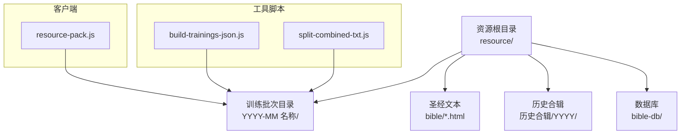
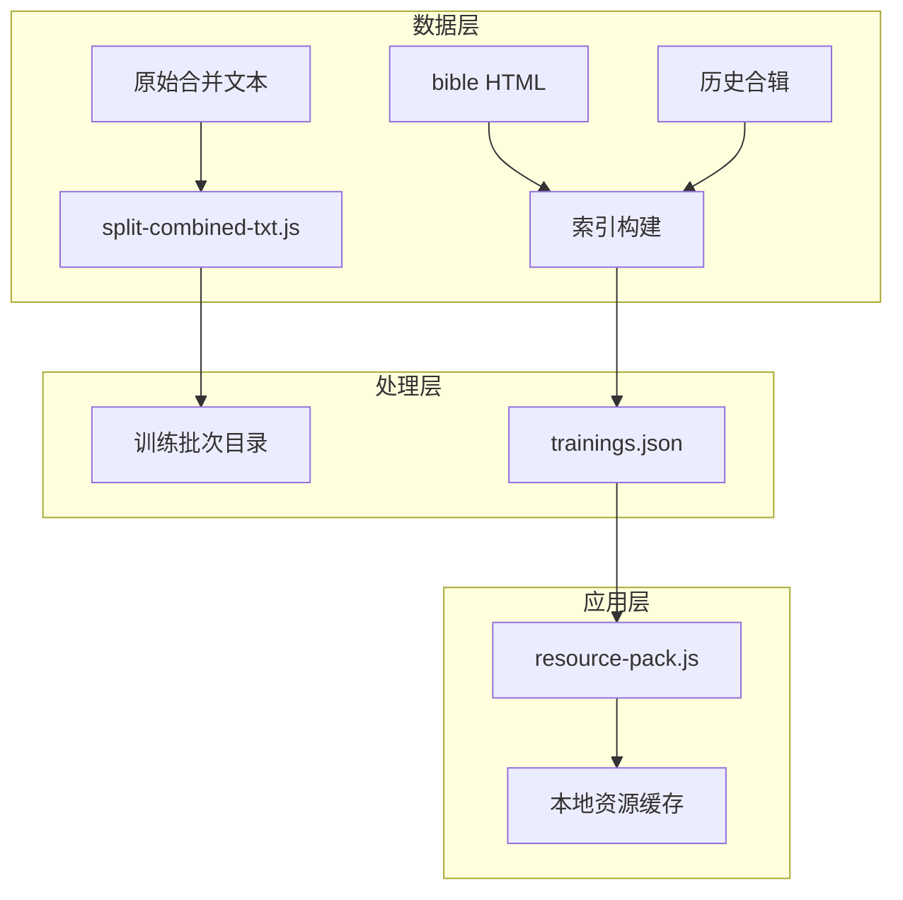
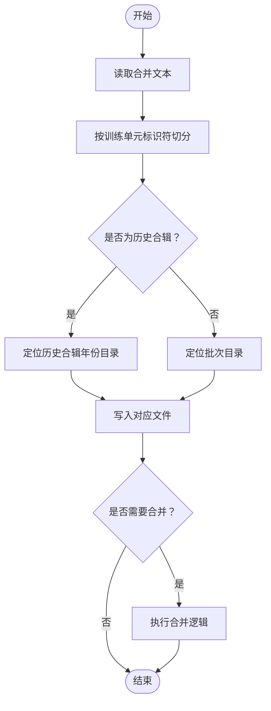
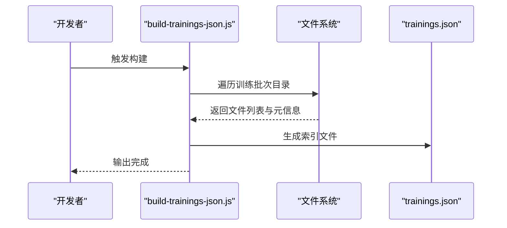
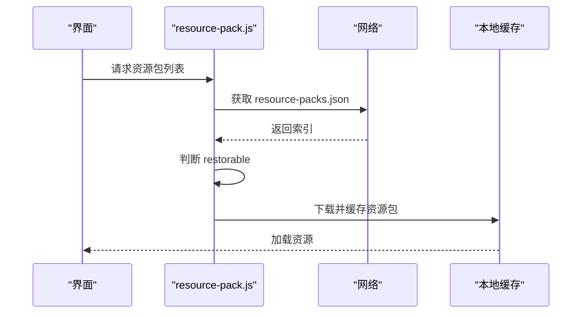
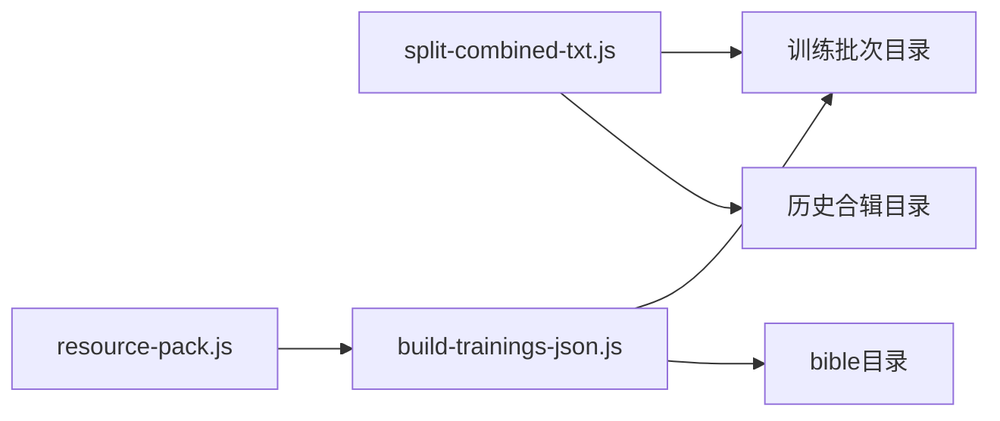

# 资源文件组织

<cite>
**本文引用的文件**
- [split-combined-txt.js](file://tools/split-combined-txt.js)
- [build-trainings-json.js](file://tools/build-trainings-json.js)
- [resource-pack.js](file://android/app/src/main/assets/public/js/resource-pack.js)
- [README.md](file://README.md)
</cite>

## 目录
1. [简介](#简介)
2. [项目结构](#项目结构)
3. [核心组件](#核心组件)
4. [架构总览](#架构总览)
5. [详细组件分析](#详细组件分析)
6. [依赖关系分析](#依赖关系分析)
7. [性能考量](#性能考量)
8. [故障排查指南](#故障排查指南)
9. [结论](#结论)
10. [附录](#附录)

## 简介
本文件面向CX项目的资源文件组织系统，聚焦于resource目录的结构与命名规范、训练批次的分类存储、文件类型管理与版本控制策略；并深入解析工具脚本split-combined-txt.js的文本分割功能，包括历史合辑的处理、文件合并逻辑与内容分段算法。同时提供资源文件的维护方法、备份策略、清理规则，以及文件完整性检查、损坏修复与存储空间优化建议。

## 项目结构
- 资源根目录：resource
  - 训练批次目录：按“YYYY-MM 名称”命名，如“2025-04 夏季训练”
  - 圣经文本：bible目录，按编号命名的HTML文件
  - 历史合辑：历史合辑目录，按年份分层
  - 数据库：bible-db目录（用于数据库相关资源）
- 工具脚本：
  - split-combined-txt.js：将合并后的文本拆分为独立训练文件
  - build-trainings-json.js：构建训练资源索引JSON
- 客户端资源包管理：android/app/src/main/assets/public/js/resource-pack.js

图表来源
- [split-combined-txt.js](file://tools/split-combined-txt.js)
- [build-trainings-json.js](file://tools/build-trainings-json.js)
- [resource-pack.js](file://android/app/src/main/assets/public/js/resource-pack.js)

章节来源
- [README.md](file://README.md)

## 核心组件
- 训练批次目录
  - 命名规则：YYYY-MM 名称（中文），例如“2025-04 夏季训练”
  - 存储内容：该批次相关的训练材料（文本、图片等）
  - 版本控制：以目录名区分批次，便于按时间线归档与回溯
- 圣经文本目录
  - 文件命名：bible/NNNN.html（四位数字编号，前导零）
  - 类型：HTML格式，承载经文内容
- 历史合辑
  - 结构：历史合辑/YYYY/，按年份进一步细分
  - 用途：存放历史训练合辑，便于检索与复用
- 数据库资源
  - 目录：bible-db/
  - 作用：存放与数据库相关的资源文件
- 工具脚本
  - split-combined-txt.js：将合并文本拆分为独立训练文件
  - build-trainings-json.js：生成训练资源索引JSON，供前端使用
- 客户端资源包管理
  - resource-pack.js：负责资源包的下载、校验与恢复逻辑

章节来源
- [split-combined-txt.js](file://tools/split-combined-txt.js)
- [build-trainings-json.js](file://tools/build-trainings-json.js)
- [resource-pack.js](file://android/app/src/main/assets/public/js/resource-pack.js)

## 架构总览
资源文件组织系统由“目录结构+命名规范+工具链+客户端管理”构成，形成从数据采集、拆分、索引到客户端下载与恢复的闭环。

图表来源
- [split-combined-txt.js](file://tools/split-combined-txt.js)
- [build-trainings-json.js](file://tools/build-trainings-json.js)
- [resource-pack.js](file://android/app/src/main/assets/public/js/resource-pack.js)

## 详细组件分析

### 文本分割与合并工具：split-combined-txt.js
- 功能概述
  - 将合并后的文本按训练单元进行拆分，输出到对应的训练批次目录
  - 支持历史合辑的特殊处理与文件合并逻辑
- 关键流程
  - 输入：合并文本文件
  - 输出：按批次命名的独立训练文件，放置在resource/批次目录下
  - 历史合辑：根据年份归档至历史合辑目录
- 内容分段算法
  - 基于训练单元标识符进行切分
  - 保持每条训练记录的完整性与可读性
  - 对历史合辑进行年份映射与目录归档
- 文件合并逻辑
  - 在需要时将多个训练文件合并为一个文件，便于打包或传输
  - 合并过程中保留元信息与分隔标记，确保可逆向拆分

图表来源
- [split-combined-txt.js](file://tools/split-combined-txt.js)

章节来源
- [split-combined-txt.js](file://tools/split-combined-txt.js)

### 训练资源索引构建：build-trainings-json.js
- 功能概述
  - 遍历训练批次目录，生成trainings.json索引文件
  - 提供前端查询与加载所需的信息（如文件列表、元数据）
- 输出
  - trainings.json：包含各批次的资源清单与元信息
- 与客户端集成
  - 客户端通过resource-pack.js读取索引，决定下载与缓存策略

图表来源
- [build-trainings-json.js](file://tools/build-trainings-json.js)

章节来源
- [build-trainings-json.js](file://tools/build-trainings-json.js)

### 客户端资源包管理：resource-pack.js
- 功能概述
  - 管理资源包的下载、校验与恢复
  - 依据trainings.json与resource-packs.json决定资源包可用性
  - 支持“restorable”逻辑，确保当前版本仍可使用旧资源
- 关键点
  - 通过URL拼接获取资源包索引
  - 判断资源包是否仍被当前版本引用（restorable）
  - 维护本地缓存与版本一致性

图表来源
- [resource-pack.js](file://android/app/src/main/assets/public/js/resource-pack.js)

章节来源
- [resource-pack.js](file://android/app/src/main/assets/public/js/resource-pack.js)

### 目录层级与命名约定
- 训练批次目录
  - 层级：resource/ YYYY-MM 名称/
  - 命名：YYYY-MM + 中文名称（避免空格影响跨平台兼容性）
- 圣经文本
  - 层级：resource/bible/
  - 命名：0001.html 至 NNNN.html（四位数字编号，前导零）
- 历史合辑
  - 层级：resource/历史合辑/ YYYY/
- 数据库资源
  - 层级：resource/bible-db/

章节来源
- [split-combined-txt.js](file://tools/split-combined-txt.js)
- [build-trainings-json.js](file://tools/build-trainings-json.js)
- [resource-pack.js](file://android/app/src/main/assets/public/js/resource-pack.js)

### 文件类型管理
- 圣经文本：HTML（bible/*.html）
- 训练材料：文本、图片等（按批次目录存放）
- 索引文件：JSON（trainings.json、resource-packs.json）
- 工具脚本：JavaScript（tools/*.js）

章节来源
- [split-combined-txt.js](file://tools/split-combined-txt.js)
- [build-trainings-json.js](file://tools/build-trainings-json.js)
- [resource-pack.js](file://android/app/src/main/assets/public/js/resource-pack.js)

### 版本控制策略
- 目录级版本：以“YYYY-MM 名称”作为版本标识，天然具备时间顺序与可追溯性
- 客户端版本一致性：通过resource-pack.js判断资源包restorable，避免因版本升级导致资源不可用
- 索引版本：trainings.json与resource-packs.json随资源更新同步生成与发布

章节来源
- [resource-pack.js](file://android/app/src/main/assets/public/js/resource-pack.js)
- [build-trainings-json.js](file://tools/build-trainings-json.js)

## 依赖关系分析
- split-combined-txt.js依赖于训练批次目录结构与历史合辑年份映射
- build-trainings-json.js依赖于训练批次目录与bible目录的文件存在性
- resource-pack.js依赖于trainings.json与resource-packs.json的可用性

图表来源
- [split-combined-txt.js](file://tools/split-combined-txt.js)
- [build-trainings-json.js](file://tools/build-trainings-json.js)
- [resource-pack.js](file://android/app/src/main/assets/public/js/resource-pack.js)

章节来源
- [split-combined-txt.js](file://tools/split-combined-txt.js)
- [build-trainings-json.js](file://tools/build-trainings-json.js)
- [resource-pack.js](file://android/app/src/main/assets/public/js/resource-pack.js)

## 性能考量
- 目录遍历与索引生成
  - 建议在CI中批量运行build-trainings-json.js，减少本地开发负担
  - 对大目录采用分批处理，避免一次性扫描造成卡顿
- 客户端资源包
  - 使用增量更新策略，仅下载变更资源包
  - 缓存命中优先，降低网络请求次数
- 存储优化
  - 定期清理历史合辑中的重复或过期资源
  - 合理压缩静态资源（如图片），平衡体积与加载速度

## 故障排查指南
- 索引缺失或不完整
  - 现象：trainings.json为空或字段不全
  - 排查：确认build-trainings-json.js已成功运行且无异常
  - 处理：重新执行构建脚本，并检查训练批次目录是否存在
- 资源包不可用
  - 现象：客户端提示资源包不可用或下载失败
  - 排查：检查resource-packs.json与trainings.json是否一致
  - 处理：确认resource-pack.js的restorable逻辑是否正确判断
- 历史合辑归档错误
  - 现象：历史合辑未按年份归档
  - 排查：检查split-combined-txt.js对历史合辑的年份识别与目录映射
  - 处理：修正年份提取逻辑或手动调整目录结构
- 文件命名不规范
  - 现象：bible编号缺失或重复
  - 排查：核对bible目录下的HTML文件命名是否符合四位数字编号
  - 处理：统一重命名或修复缺失编号

章节来源
- [build-trainings-json.js](file://tools/build-trainings-json.js)
- [resource-pack.js](file://android/app/src/main/assets/public/js/resource-pack.js)
- [split-combined-txt.js](file://tools/split-combined-txt.js)

## 结论
资源文件组织系统通过明确的目录结构与命名规范、完善的工具链与客户端管理，实现了训练资源的有序化、可追溯与高效分发。split-combined-txt.js承担了从合并文本到独立训练文件的关键转换，build-trainings-json.js提供了稳定的索引支撑，resource-pack.js保障了客户端的资源可用性与版本一致性。遵循本文的维护与优化建议，可进一步提升系统的稳定性与可维护性。

## 附录
- 维护方法
  - 定期校验训练批次目录完整性与命名一致性
  - 运行build-trainings-json.js生成最新索引
  - 使用split-combined-txt.js进行文本拆分与历史合辑归档
- 备份策略
  - 定期备份resource根目录与索引文件
  - 对bible与历史合辑建立快照，便于回滚
- 清理规则
  - 删除重复或过期的历史合辑文件
  - 清理bible目录中缺失编号或损坏的HTML文件
- 完整性检查与修复
  - 使用哈希校验（如MD5/SHA）验证关键资源文件
  - 对损坏文件进行替换或重生成
- 存储空间优化
  - 合理压缩静态资源
  - 分离常用与不常用资源，启用CDN加速