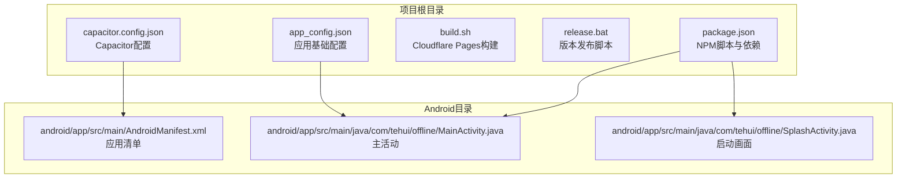
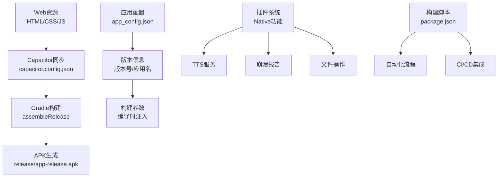
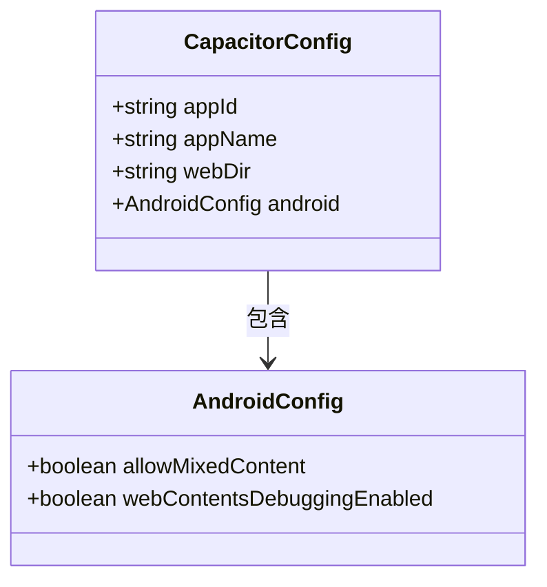
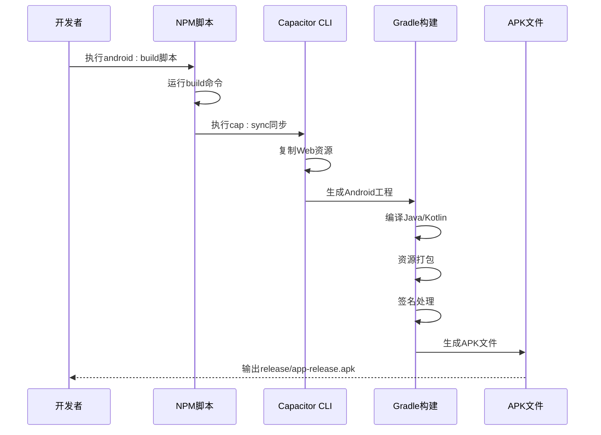
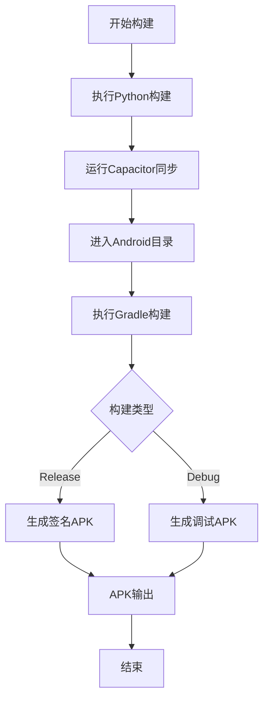
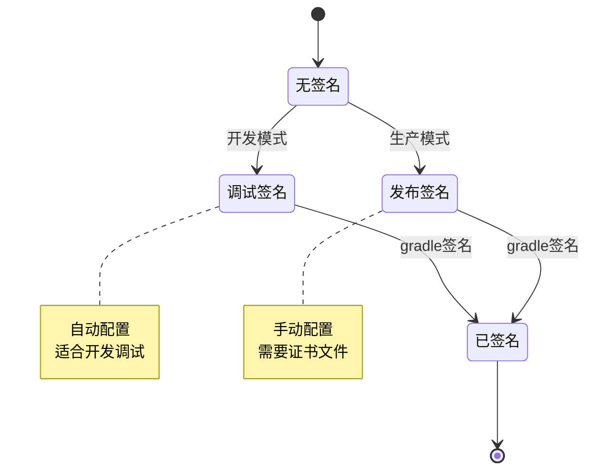
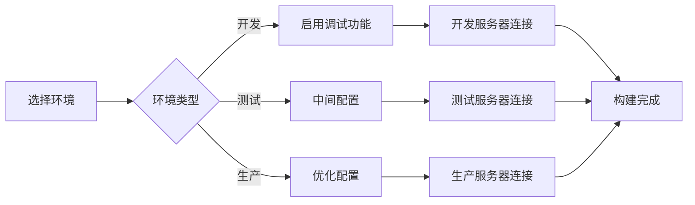
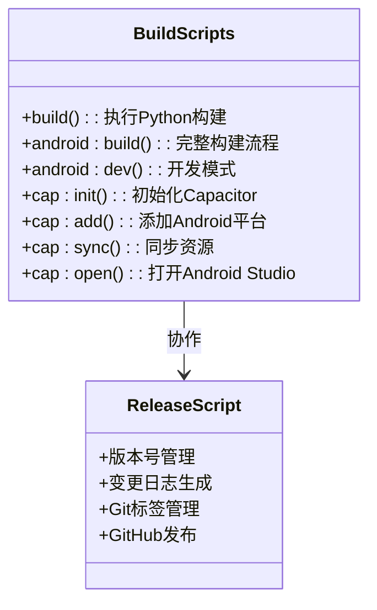

# Android应用打包

<cite>
**本文引用的文件**
- [capacitor.config.json](file://capacitor.config.json)
- [package.json](file://package.json)
- [build.sh](file://build.sh)
- [release.bat](file://release.bat)
- [app_config.json](file://app_config.json)
- [MainActivity.java](file://android/app/src/main/java/com/tehui/offline/MainActivity.java)
- [AndroidManifest.xml](file://android/app/src/main/AndroidManifest.xml)
- [SplashActivity.java](file://android/app/src/main/java/com/tehui/offline/SplashActivity.java)
</cite>

## 目录
1. [简介](#简介)
2. [项目结构](#项目结构)
3. [核心组件](#核心组件)
4. [架构概览](#架构概览)
5. [详细组件分析](#详细组件分析)
6. [依赖关系分析](#依赖关系分析)
7. [性能考虑](#性能考虑)
8. [故障排除指南](#故障排除指南)
9. [结论](#结论)
10. [附录](#附录)

## 简介
本指南面向CX项目的Android应用打包，基于Capacitor框架实现跨平台混合应用。文档涵盖从代码编译到APK生成的完整流程，包括Capacitor配置详解、Android构建流程、签名管理、多环境配置、图标与启动画面设置、打包脚本使用以及常见问题解决方案。

## 项目结构
项目采用Capacitor标准目录结构，前端资源位于根目录，Android原生代码位于android/app/src/main目录中。关键配置文件包括Capacitor配置、包管理脚本、构建脚本和应用配置。



**图表来源**
- [capacitor.config.json:1-10](file://capacitor.config.json#L1-L10)
- [package.json:1-30](file://package.json#L1-L30)
- [app_config.json:1-5](file://app_config.json#L1-L5)

**章节来源**
- [capacitor.config.json:1-10](file://capacitor.config.json#L1-L10)
- [package.json:1-30](file://package.json#L1-L30)
- [build.sh:1-20](file://build.sh#L1-L20)
- [release.bat:1-137](file://release.bat#L1-L137)
- [app_config.json:1-5](file://app_config.json#L1-L5)

## 核心组件
本项目的核心组件包括Capacitor配置系统、构建脚本体系、Android原生组件和版本管理工具。

### Capacitor配置系统
Capacitor作为核心框架，负责将Web应用包装为原生Android应用。配置文件定义了应用标识、名称、输出目录和Android特定设置。

### 构建脚本体系
项目提供了多种构建脚本，支持本地开发、CI/CD集成和版本发布自动化。

### Android原生组件
包含主活动、启动画面、插件扩展等原生组件，提供TTS、崩溃报告、图片保存等功能。

### 版本管理工具
自动化版本控制、变更日志生成和GitHub发布流程。

**章节来源**
- [capacitor.config.json:1-10](file://capacitor.config.json#L1-L10)
- [package.json:5-15](file://package.json#L5-L15)
- [release.bat:10-30](file://release.bat#L10-L30)

## 架构概览
下图展示了CX项目Android应用的完整架构，从Web资源到最终APK的生成路径。



**图表来源**
- [capacitor.config.json:4](file://capacitor.config.json#L4)
- [package.json:13-14](file://package.json#L13-L14)
- [app_config.json:2-4](file://app_config.json#L2-L4)

## 详细组件分析

### Capacitor配置详解
Capacitor配置文件是整个打包系统的核心，定义了应用的基本属性和Android特定行为。

#### 核心配置项
- **appId**: 应用程序唯一标识符，用于包名管理
- **appName**: 应用显示名称
- **webDir**: Web资源输出目录，构建后的内容存放位置
- **android.allowMixedContent**: 允许混合内容加载
- **android.webContentsDebuggingEnabled**: Web内容调试开关

#### 配置参数说明


**图表来源**
- [capacitor.config.json:2-8](file://capacitor.config.json#L2-L8)

**章节来源**
- [capacitor.config.json:1-10](file://capacitor.config.json#L1-L10)

### Android构建流程
完整的Android构建流程从代码编译到APK生成，涉及多个步骤和工具链。

#### 构建步骤序列


**图表来源**
- [package.json:13](file://package.json#L13)
- [build.sh:17](file://build.sh#L17)

#### 构建流程图


**图表来源**
- [package.json:13-14](file://package.json#L13-L14)
- [build.sh:16-17](file://build.sh#L16-L17)

**章节来源**
- [package.json:13-14](file://package.json#L13-L14)
- [build.sh:1-20](file://build.sh#L1-L20)

### 应用签名配置
应用签名是Android应用发布的必要条件，项目支持调试签名和发布签名两种模式。

#### 签名配置要点
- **调试签名**: 开发阶段自动生成，便于本地调试
- **发布签名**: 生产环境需要正式签名证书
- **密钥库管理**: 保护私钥安全，定期轮换

#### 签名流程


**图表来源**
- [package.json:13](file://package.json#L13)

**章节来源**
- [package.json:13](file://package.json#L13)

### 多环境配置管理
项目支持开发、测试、生产三种构建模式，每种模式有不同的配置特点。

#### 环境配置对比
| 配置项 | 开发环境 | 测试环境 | 生产环境 |
|--------|----------|----------|----------|
| 调试模式 | 开启 | 关闭 | 关闭 |
| 日志级别 | 详细 | 标准 | 限制 |
| 网络策略 | 允许混合内容 | 严格 | 严格 |
| 性能优化 | 关闭 | 部分开启 | 全部开启 |

#### 环境切换机制


**图表来源**
- [capacitor.config.json:6-7](file://capacitor.config.json#L6-L7)

**章节来源**
- [capacitor.config.json:1-10](file://capacitor.config.json#L1-L10)

### Android特有设置
项目包含完整的Android应用配置，涵盖图标、启动画面、权限等关键设置。

#### 应用清单配置
AndroidManifest.xml定义了应用的基本信息、权限声明和组件注册。

#### 启动画面配置
SplashActivity提供优雅的应用启动体验，支持自定义动画和主题。

#### 主活动配置
MainActivity作为应用入口点，负责初始化Capacitor运行时和处理生命周期事件。

**章节来源**
- [AndroidManifest.xml](file://android/app/src/main/AndroidManifest.xml)
- [SplashActivity.java](file://android/app/src/main/java/com/tehui/offline/SplashActivity.java)
- [MainActivity.java](file://android/app/src/main/java/com/tehui/offline/MainActivity.java)

### 打包脚本使用指南
项目提供了完整的打包脚本体系，支持自动化构建和发布流程。

#### NPM脚本命令
- **build**: 执行Python构建脚本生成静态资源
- **android:build**: 完整的Android构建流程
- **android:dev**: 开发模式构建并打开Android Studio
- **cap:*系列**: Capacitor相关命令

#### 构建脚本参数


**图表来源**
- [package.json:5-14](file://package.json#L5-L14)
- [release.bat:10-30](file://release.bat#L10-L30)

**章节来源**
- [package.json:5-15](file://package.json#L5-L15)
- [release.bat:1-137](file://release.bat#L1-L137)

## 依赖关系分析
项目依赖关系清晰，主要围绕Capacitor框架和相关插件展开。

```mermaid
graph TB
subgraph "核心依赖"
A[@capacitor/core] --> B[Capacitor运行时]
C[@capacitor/cli] --> D[命令行工具]
E[@capacitor/android] --> F[Android平台]
end
subgraph "功能插件"
G[@capacitor/app] --> H[应用管理]
I[@capacitor/status-bar] --> J[状态栏控制]
K[@capacitor/filesystem] --> L[文件系统]
M[@capacitor-community/text-to-speech] --> N[TTS功能]
end
subgraph "开发工具"
O[javascript-obfuscator] --> P[代码混淆]
Q[python] --> R[构建脚本]
end
A --> G
A --> I
A --> K
A --> M
```

**图表来源**
- [package.json:16-28](file://package.json#L16-L28)

**章节来源**
- [package.json:16-28](file://package.json#L16-L28)

## 性能考虑
针对Android应用打包的性能优化建议：

### 构建性能优化
- **增量构建**: 利用Gradle的增量编译特性
- **并行构建**: 启用多线程构建加速
- **缓存策略**: 合理使用Gradle和NPM缓存
- **资源压缩**: 图片和资源文件的优化压缩

### 运行时性能优化
- **WebView优化**: Capacitor WebView的性能调优
- **内存管理**: 合理的内存使用和垃圾回收
- **网络请求**: 异步网络请求和缓存策略
- **UI渲染**: 避免主线程阻塞操作

### 存储优化
- **数据存储**: 本地数据的高效存储方案
- **文件管理**: 文件系统的最佳实践
- **缓存策略**: 智能缓存和清理机制

## 故障排除指南

### 常见构建问题
1. **Gradle构建失败**
   - 检查Android SDK版本兼容性
   - 验证Java版本要求
   - 清理Gradle缓存后重试

2. **Capacitor同步错误**
   - 确认Web资源已正确生成
   - 检查capacitor.config.json配置
   - 验证Node.js版本兼容性

3. **签名配置问题**
   - 检查密钥库文件完整性
   - 验证签名密码正确性
   - 确认别名配置准确性

### 调试技巧
- **启用详细日志**: 在开发模式下查看详细构建日志
- **分步调试**: 将复杂构建流程分解为简单步骤
- **环境隔离**: 使用独立的测试环境验证配置
- **版本对比**: 对比不同版本的构建结果

**章节来源**
- [package.json:13-14](file://package.json#L13-L14)
- [build.sh:4](file://build.sh#L4)

## 结论
CX项目的Android应用打包基于Capacitor框架实现了高效的跨平台开发流程。通过合理的配置管理和自动化脚本，项目实现了从开发到发布的完整流水线。建议在实际使用中根据具体需求调整配置参数，并建立完善的版本管理和发布流程。

## 附录

### 快速参考表
- **构建命令**: `npm run android:build`
- **开发模式**: `npm run android:dev`
- **Capacitor初始化**: `npm run cap:init`
- **添加平台**: `npm run cap:add`
- **同步资源**: `npm run cap:sync`
- **打开项目**: `npm run cap:open`

### 配置文件位置
- **Capacitor配置**: `capacitor.config.json`
- **应用配置**: `app_config.json`
- **构建脚本**: `build.sh`, `release.bat`
- **包管理**: `package.json`

### 支持的构建环境
- **操作系统**: Windows, macOS, Linux
- **开发工具**: Android Studio, VS Code
- **命令行工具**: Node.js, Gradle, Python
- **版本要求**: Node.js 16+, Android SDK API 21+